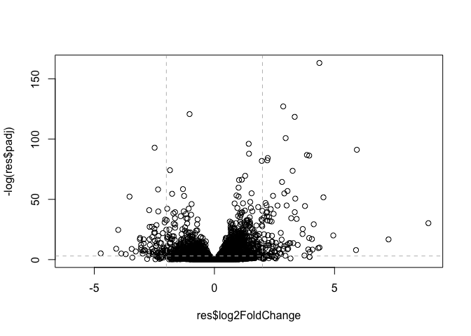
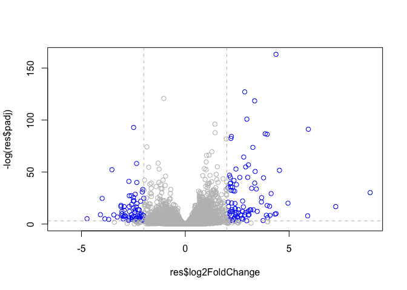

Class 14: Transcriptomics and the analysis of RNA-Seq data
================
Belinda Xue
11/12/2019

# Transcriptomics and the analysis of RNA-Seq data

## DESeq2 setup

We will use the DESeq2 package from bioconductor. To install this we ran
**in the CONSOLE** - note eval=FALSE option\!\! (showing the code
without running it\!\!\! )

``` r
install.packages("BiocManager")
BiocManager::install()

# For this class, you'll also need DESeq2:
BiocManager::install("DESeq2")
```

Background The data for this hands-on session comes from a published
RNA-seq experiment where airway smooth muscle cells were treated with
dexamethasone, a synthetic glucocorticoid steroid with anti-inflammatory
effects (Himes et al. 2014).

Glucocorticoids are used, for example, by people with asthma to reduce
inflammation of the airways. The anti-inflammatory effects on airway
smooth muscle (ASM) cells has been known for some time but the
underlying molecular mechanisms are unclear.

Himes et al. used RNA-seq to profile gene expression changes in four
different ASM cell lines treated with dexamethasone glucocorticoid. They
found a number of differentially expressed genes comparing
dexamethasone-treated to control cells, but focus much of the discussion
on a single gene called CRISPLD2. This gene encodes a secreted protein
known to be involved in lung development, and SNPs in this gene in
previous GWAS studies are associated with inhaled corticosteroid
resistance and bronchodilator response in asthma patients. They
confirmed the upregulated CRISPLD2 mRNA expression with qPCR and
increased protein expression using Western blotting.

In the experiment, four primary human ASM cell lines were treated with 1
micromolar dexamethasone for 18 hours. For each of the four cell lines,
we have a treated and an untreated sample. They did their analysis using
Tophat and Cufflinks similar to our work in the last hands-on session.
For a more detailed description of their analysis see the PubMed entry
24926665 and for raw data see the GEO entry GSE52778.

In this session we will read and explore the gene expression data from
this experiment using base R functions and then perform a detailed
analysis with the DESeq2 package from Bioconductor.

1.  Bioconductor and DESeq2 setup

<!-- end list -->

  - copy and paste the following lines of code into your R console one
    at a time

install.packages(“BiocManager”) BiocManager::install()

# For this class, you’ll also need DESeq2:

BiocManager::install(“DESeq2”)

## 2\. Import countData and colData

Input countData and colData (metadata)

``` r
counts <- read.csv("airway_scaledcounts.csv",  stringsAsFactors = FALSE)

metadata <- read.csv("airway_metadata.csv", stringsAsFactors = FALSE)
```

Have a peak… read the first 6 rows of the counts and
    metadata

``` r
head(counts)
```

    ##           ensgene SRR1039508 SRR1039509 SRR1039512 SRR1039513 SRR1039516
    ## 1 ENSG00000000003        723        486        904        445       1170
    ## 2 ENSG00000000005          0          0          0          0          0
    ## 3 ENSG00000000419        467        523        616        371        582
    ## 4 ENSG00000000457        347        258        364        237        318
    ## 5 ENSG00000000460         96         81         73         66        118
    ## 6 ENSG00000000938          0          0          1          0          2
    ##   SRR1039517 SRR1039520 SRR1039521
    ## 1       1097        806        604
    ## 2          0          0          0
    ## 3        781        417        509
    ## 4        447        330        324
    ## 5         94        102         74
    ## 6          0          0          0

``` r
head(metadata)
```

    ##           id     dex celltype     geo_id
    ## 1 SRR1039508 control   N61311 GSM1275862
    ## 2 SRR1039509 treated   N61311 GSM1275863
    ## 3 SRR1039512 control  N052611 GSM1275866
    ## 4 SRR1039513 treated  N052611 GSM1275867
    ## 5 SRR1039516 control  N080611 GSM1275870
    ## 6 SRR1039517 treated  N080611 GSM1275871

How many genes do we have in this dataset?

``` r
nrow(counts)
```

    ## [1] 38694

How many experiments do we have?

``` r
ncol(counts)
```

    ## [1] 9

``` r
nrow(metadata)
```

    ## [1] 8

Why counts and metadata have different experiment?

You can also use the View() function to view the entire object. Notice
something here. The sample IDs in the metadata sheet (SRR1039508,
SRR1039509, etc.) exactly match the column names of the countdata,
except for the first column, which contains the Ensembl gene ID. This is
important, and we’ll get more strict about it later on.

## 3\. Toy differential gene expression

Lets perform some exploratory differential gene expression analysis.
Note: this analysis is for demonstration only. NEVER do differential
expression analysis this way\!

Look at the metadata object again to see which samples are control and
which are drug treated

We want to know if there is a difference in expression values for
control (non-drug) vs treated (i.e. drug added cell lines).

First step is to find which experiments were the control experiments and
then get the average values across all control experiments. Then we will
do the same for drug treated.

``` r
control <- metadata[metadata[,"dex"]=="control",]
control$id # see if it match the control column in metadata
```

    ## [1] "SRR1039508" "SRR1039512" "SRR1039516" "SRR1039520"

Now calculate the mean values accross these control columns of
**counts** 共八个experiment, 38694个gene,找avg of control experiment (x4) for
every 38694 个genes

``` r
control.mean <- rowSums(counts[,control$id])/length(control$id)
names(control.mean) <- counts$ensgene
```

Now to do the same thing for the drug treated. Start with the metadata,
isolate the drug treated column, counts里的treated加一起除于多少个treated

``` r
treated <- metadata[metadata[,"dex"]=="treated",]
treated$id # see the id of the treated column in metadata
```

    ## [1] "SRR1039509" "SRR1039513" "SRR1039517" "SRR1039521"

Calculate the treated.mean

``` r
treated.mean <- rowSums(counts[,treated$id])/length(treated$id)
treated.mean
```

    ##     [1]    658.00      0.00    546.00    316.50     78.75      0.00
    ##     [7]   6687.50   1785.75    578.00    348.25    185.50   2701.25
    ##    [13]    519.50    106.75    543.50      8.00   1679.75    895.75
    ##    [19]    826.00    173.50      3.25    678.50   1256.75   8456.50
    ##    [25]      2.25      1.75      4.75    126.00    348.00   9618.25
    ##    [31]    270.75    527.50   1769.00    268.25     61.25     10.00
    ##    [37]    101.00    896.00     79.00   4612.50   4372.50    285.75
    ##    [43]   2724.50     36.25     52.25   1867.50    293.50   1527.50
    ##    [49]   3593.00   1215.00      6.25    603.75   1080.00   1129.00
    ##    [55]     60.75   1673.00    461.50  11041.50     80.50    374.25
    ##    [61]   1429.25      1.25     11.00     10.25      0.25    153.75
    ##    [67]    405.00   1552.25      7.00      0.00    401.25    854.50
    ##    [73]      0.00   2410.00    745.50   1230.50    212.25      0.25
    ##    [79]    631.75    546.50      0.00     16.25    248.25    328.00
    ##    [85]     22.00     62.50    476.25    713.75    644.25    899.00
    ##    [91]    344.25    488.25   2516.00    163.50      9.00      0.00
    ##    [97]    307.50    257.75    375.75     18.50   1873.75    821.00
    ##   [103]      3.25    553.00    195.00   2719.25   1616.25      2.00
    ##   [109]    984.50   1447.75    816.25   5032.25      7.50      5.00
    ##   [115]   2705.50    362.75    165.75    114.75   3136.75      0.50
    ##   [121]      0.00    201.75      0.00      0.25    365.00   6700.75
    ##   [127]      1.00    567.25     20.50   1318.75     40.00    610.50
    ##   [133]      0.25      6.00    866.00    187.00    384.50    214.00
    ##   [139]    280.50   1346.25      3.75    882.00      3.75   1102.50
    ##   [145]      0.00    175.25     72.75     49.50   1089.00      1.25
    ##   [151]    194.25    274.75    999.25   2091.75     43.25   1013.00
    ##   [157]     31.50    523.25    165.25     19.75   1148.25     65.50
    ##   [163]      1.75      1.00    793.50      2.00    725.00      0.00
    ##   [169]   3992.00      1.25      2.75   6563.50      0.00    290.75
    ##   [175]    135.50      3.00      0.00      2.00      0.50    309.50
    ##   [181]      0.00     43.75    270.50   1853.00    644.25     26.25
    ##   [187]      9.25    599.00    698.00    638.25   1855.50      0.00
    ##   [193]    964.75    770.00    286.75     13.00      4.00   1484.50
    ##   [199]     20.75    353.50    354.00      4.75    549.75   2093.00
    ##   [205]      0.50      0.00      7.50   5247.00     17.50   2080.50
    ##   [211]    529.50   2724.75    109.00    929.00     13.00    137.75
    ##   [217]    169.25   3946.50    284.75      2.75   9544.25   1313.50
    ##   [223]     24.00     77.00   5727.00     21.00   1145.00    936.00
    ##   [229]    720.25   5338.50  10446.00  15369.25   2218.00  10538.75
    ##   [235]     13.25      0.00     31.75     16.50    192.00      6.25
    ##   [241]    438.50    831.25      7.75   2835.75   2606.00     12.00
    ##   [247]    158.25    838.25    215.00   2784.75   2082.25    754.50
    ##   [253]   4328.75      0.00   1222.00   1109.50     16.25     73.25
    ##   [259]      2.00   2323.75      0.50    246.50      0.50   3068.75
    ##   [265]     20.00    144.00     54.75    129.25      0.25    412.75
    ##   [271]    757.50   1689.75   1309.00     29.50   1393.75    483.50
    ##   [277]    662.00  14996.75    196.00      0.25   3807.50    630.00
    ##   [283]    215.50    138.50   1517.50      0.25    709.00    319.00
    ##   [289]    423.25   1691.25    423.25   4033.75     22.25    107.25
    ##   [295]    418.00   1729.00    389.50    220.25   1495.25   2569.50
    ##   [301] 273445.50    182.50   1205.00    874.25   1815.75      2.75
    ##   [307]      1.50    865.50      2.25    129.25   1118.50      1.25
    ##   [313]    919.25    754.50    134.75      2.00   1325.50      0.25
    ##   [319]   2657.25      0.25    643.50   6851.25    319.75   1979.50
    ##   [325]   2308.25    502.25   3259.25    122.00   1514.75    990.25
    ##   [331]   8505.00   1496.00   1217.25    205.75   2856.75    281.25
    ##   [337]    319.25   1014.25    545.00    204.00   1611.50    543.50
    ##   [343]   1231.50      7.50     99.00    824.25    142.00    444.00
    ##   [349]   3822.50     13.25   1418.75   1418.00    469.75    555.75
    ##   [355]      4.75    249.00   2108.75      5.25      3.00    332.50
    ##   [361]   4394.50      6.00    679.75    132.75      2.25   1544.50
    ##   [367]      0.00     62.25      5.50      0.25      0.00   1529.75
    ##   [373]   2569.25    682.00    320.50   3948.75    858.00     43.25
    ##   [379]     17.00   2931.00    826.50      0.00    258.25    377.50
    ##   [385]    267.75     58.75      9.25   3868.00      0.50      1.75
    ##   [391]    358.75      1.50   3075.75     34.00    832.00   2798.50
    ##   [397]    913.75   8666.00      0.00    284.75    240.75   4303.50
    ##   [403]    103.00    546.50     13.00    717.75      3.00      2.75
    ##   [409]    497.50     55.00   1626.75   1415.50    281.25      0.00
    ##   [415]  11955.25   2121.25      0.00      2.50    161.50   2786.00
    ##   [421]    167.00    694.00     78.50   2436.00   1853.25   2910.00
    ##   [427]   1504.50    885.75     59.25   1841.25    100.00    485.00
    ##   [433]    508.75   2165.25     24.75      5.50    828.00   2747.00
    ##   [439]   1380.50  12507.50     17.50    224.00      9.50    230.75
    ##   [445]   1515.00     54.25    401.00    297.00    321.75    640.75
    ##   [451]   3429.25   2201.00  74238.00    151.25   1122.00    189.75
    ##   [457]  20689.25     21.25    327.75      2.00    486.75    496.00
    ##   [463]    121.50      0.25   1573.50    433.75      0.25    276.50
    ##   [469]    661.75   1141.25     22.00    584.25   3444.25    447.75
    ##   [475]    318.00   3101.25   1333.75     87.50      0.25    115.50
    ##   [481]   1900.75    517.75    908.25    190.75     27.25    270.25
    ##   [487]  10056.75   1383.50    262.50     86.50   2258.50   1269.00
    ##   [493]    612.25    212.75   1558.75    171.25    514.50    390.25
    ##   [499]   1425.50   2449.50      6.75   1315.00    841.50   1424.25
    ##   [505]   1084.75   1025.00   1522.25     36.25   1435.50      7.50
    ##   [511]  12363.75     91.75    849.00    261.75   1519.75    392.25
    ##   [517]    375.50    398.50  21024.00      9.25   1039.00    895.00
    ##   [523]    805.25      0.00  58635.75    991.00   1327.00   1680.50
    ##   [529]      5.50      0.00     39.75    838.75      4.25     20.75
    ##   [535]      0.00    398.00    332.00     11.00    805.75    661.50
    ##   [541]    492.25    364.00     70.25     21.00    524.25    353.75
    ##   [547]   2400.75   1939.75      7.00   1028.00   5733.75   8237.50
    ##   [553]    558.25    120.75      6.75   1237.25    231.75   1043.25
    ##   [559]   1838.75     40.25   6243.25      4.75    314.00      2.25
    ##   [565]    369.25    189.50    673.75    257.75    544.75      0.75
    ##   [571]    742.75     29.75    700.75     34.25   1174.25      7.50
    ##   [577]    592.00    365.50   2529.00    183.50   1599.00    168.50
    ##   [583]    735.50      6.50    180.25    459.75   1350.25    958.75
    ##   [589]   1276.00      3.25      0.00     39.50     23.75      1.50
    ##   [595]    668.75   1683.50      0.00      0.00    219.00      2.00
    ##   [601]      0.00   1024.75   8037.00    465.50    443.25     46.00
    ##   [607]  17619.00     22.00    338.75    559.50   2126.50      0.50
    ##   [613]     25.25    573.75    739.50    302.75    834.00   2354.75
    ##   [619]    685.25     36.25   4503.75     17.75    801.25    240.75
    ##   [625]      1.50     13.75    323.00    470.25   1762.75    447.75
    ##   [631]      7.75  16989.25   1386.75      1.50    592.75    310.50
    ##   [637]    987.25    220.25    739.00   1356.50    401.50      0.50
    ##   [643]   2364.25     87.25    688.75      2.25   1611.25   4023.75
    ##   [649]   7068.00   4333.50    461.00     47.00   3000.50    145.25
    ##   [655]    144.75   6696.25   3434.25     93.00      0.25     24.25
    ##   [661]      7.50  24518.50   5924.25   9276.00    118.75   1653.00
    ##   [667]   1325.00    902.50      4.25     78.75   4431.75    319.25
    ##   [673]      0.25   1002.75  18895.75    320.50    274.50    596.00
    ##   [679]   8270.25    850.75    106.75    100.50    303.25      5.50
    ##   [685]    829.50      1.50   1280.00    445.50   2791.25    881.50
    ##   [691]     55.50     18.75    390.50    759.75    166.75   1364.75
    ##   [697]    194.50   1285.25      0.25    792.50    326.25    612.25
    ##   [703]    286.50   2101.25      7.25      3.25   4456.50      5.75
    ##   [709]    905.00    370.25     34.50    274.75     56.75     29.50
    ##   [715]   1724.50    688.50    534.75      0.00    734.75   2674.50
    ##   [721]    800.50      0.25     67.25   1037.75    470.50    222.00
    ##   [727]     11.75     44.75   1656.75    465.50    596.25   1660.00
    ##   [733]     13.50   3402.25      0.00      0.00     55.50   1566.75
    ##   [739]     21.50    717.75    544.75   4071.50      9.00   1443.75
    ##   [745]    528.00    207.75   1684.00   2496.25   1812.50    845.00
    ##   [751]   1931.25     89.75     34.00   2344.75    646.25     16.50
    ##   [757]      3.25    281.50   3155.50    140.25      0.00      0.00
    ##   [763]    223.75   1495.50     52.00    572.50    308.75   2453.75
    ##   [769]      0.00   1472.75     20.00      2.50      5.50   3248.75
    ##   [775]    261.75    632.50     27.00    471.25    733.25    469.25
    ##   [781]   1837.25     94.75   1278.00   9486.00   1930.75      3.50
    ##   [787]      1.50    652.75    508.75  10693.25   4034.25    338.00
    ##   [793]    522.50    245.25      2.50   1151.25    644.25     16.00
    ##   [799]    236.75   1262.75    309.75    308.50    179.00    697.50
    ##   [805]    318.75   1240.50    135.25    509.75   5441.75      2.50
    ##   [811]   5237.25      0.00   1585.00    966.00      0.00      0.00
    ##   [817]    336.50    422.00    462.00      0.25    508.50   1045.00
    ##   [823]    330.25    725.50   2495.25   3708.25     47.25    801.75
    ##   [829]      0.00    111.00   6203.00    609.50   1483.00    767.50
    ##   [835]    463.00   1227.75      5.25      1.50    994.00     25.50
    ##   [841]    153.75   1760.50      2.00    602.25   1242.25   1183.50
    ##   [847]   3568.00   1720.50    130.25      2.25  12634.25     22.50
    ##   [853]    288.00    292.75   7695.25     89.75    367.00   1908.25
    ##   [859]   2491.25   1274.75    578.50      0.00    675.75    701.25
    ##   [865]   3907.75     99.25    364.25   1138.25    295.00    449.25
    ##   [871]    376.75   1875.50      0.00    198.00      6.50   1321.00
    ##   [877]      0.00     31.50      6.75      2.50    206.00    794.25
    ##   [883]   3246.00   1272.50     96.25    366.00    304.50     38.25
    ##   [889]   8430.25   1482.50    501.00    295.25    123.00  12102.50
    ##   [895]    123.00     25.75    375.25   2155.25    336.25      4.00
    ##   [901]      0.25   1310.00    552.50    547.25   1269.25     41.25
    ##   [907]    267.25    717.25   3813.00    426.75    901.25    115.75
    ##   [913]    366.75   1932.50   3984.75   2842.50    549.25   1391.75
    ##   [919]    310.75  10580.50   4665.00      7.25     11.75    942.25
    ##   [925]     24.50      0.50    172.00   1952.00    232.00    676.50
    ##   [931]    272.50    683.75   1766.25  20522.00    894.25    634.00
    ##   [937]     78.00      0.25   1644.50    412.50      1.25     87.50
    ##   [943]    116.00      1.25    300.50   1359.00   1458.25    521.00
    ##   [949]    907.50   1266.50    673.25   1006.25    745.25   9865.00
    ##   [955]    769.75    769.25      4.25   1090.50      8.75    881.75
    ##   [961]    853.50    913.00    386.75     12.00    118.25      2.50
    ##   [967]     90.25      5.50   1185.75      0.75     16.25     14.75
    ##   [973]     23.00    486.25    619.50   1373.25     11.50    303.75
    ##   [979]    280.75   3085.50    206.75    734.25    607.00      2.25
    ##   [985]   1230.25   1647.50     17.25    215.25    317.75    191.25
    ##   [991]    463.00   1194.75   1019.50   2452.75    378.25   2042.75
    ##   [997]   4253.75   1151.75    933.00  17269.25    617.00   3837.75
    ##  [1003]    171.75    733.25    311.25  19373.00   1177.75    902.25
    ##  [1009]    364.75   1552.75    470.75    279.00   9712.00   1094.00
    ##  [1015]     12.50     14.75    380.00   2913.25     18.75    951.50
    ##  [1021]    752.50    188.75     14.75      1.25   3059.25    644.75
    ##  [1027]     70.25    596.00    580.50    841.00     14.25    427.50
    ##  [1033]    388.00    918.50    398.00   2025.50   1478.50   2017.50
    ##  [1039]    272.50   3405.25   1852.00    324.50    594.25    401.25
    ##  [1045]     84.50      0.25   1003.25   1244.25   7494.25    952.00
    ##  [1051]    675.25    148.00    222.25    557.25    139.50   1610.50
    ##  [1057]   1260.50    545.25   1959.75    486.25     21.25      0.00
    ##  [1063]     77.00      0.00    693.25     11.75     34.00      0.00
    ##  [1069]   1218.25   5260.00   2697.00   1267.00    303.25    216.50
    ##  [1075]   1449.25      3.75    135.00    160.50    524.50    662.50
    ##  [1081]      2.50   3784.00    177.25      2.25      7.25   1763.25
    ##  [1087]   1445.00    285.75    851.25    734.75    752.50    592.75
    ##  [1093]    817.75    794.50      2.75      1.25    481.50    880.75
    ##  [1099]   1350.25   2126.50    104.25      6.50      3.00     78.00
    ##  [1105]   3818.00    420.50   1289.25   1522.00    243.00     17.50
    ##  [1111]   2605.50   2362.00    356.50    871.00    401.50    331.50
    ##  [1117]    101.50      0.50   6111.50      3.25    875.00   8750.00
    ##  [1123]    267.00    319.00      1.50    444.25      0.00  18630.50
    ##  [1129]     83.00    302.75   1270.75   1547.50    265.50     11.25
    ##  [1135]    691.00   3518.75    717.75      0.00      1.25    191.00
    ##  [1141]   1981.00      0.25    564.50  11537.50      7.00  10711.25
    ##  [1147]  12750.25   1123.00      0.00    991.00  15047.50    142.00
    ##  [1153]    324.25   5858.25    695.75   5952.50     49.00   1607.25
    ##  [1159]   1045.00    337.50   1115.50   1276.25      0.00    741.25
    ##  [1165]   1509.25    773.00   1678.75     19.25  32835.25      1.50
    ##  [1171]    667.25     57.75    905.50   1512.75    359.75      8.50
    ##  [1177]  15404.00    850.00    226.25   1299.00    452.25    927.25
    ##  [1183]      0.25   1042.00    263.00    586.00   4899.25   1103.00
    ##  [1189]      1.50   3459.00    585.00    740.00    807.00   1159.00
    ##  [1195]    519.75    394.50     53.25    499.25   1438.75   3496.00
    ##  [1201]      0.50    578.25    313.00   3353.75    790.75   1555.75
    ##  [1207]     58.25    488.00   2751.75    651.50      6.75    183.25
    ##  [1213]   6456.25     65.25   3007.00   1407.00    398.25    272.00
    ##  [1219]      1.50    124.00     57.75     57.00    548.50      1.50
    ##  [1225]    473.75      3.50    653.75    622.00    306.75   2150.75
    ##  [1231]   2653.00      1.75    167.00   1587.25     30.00    674.25
    ##  [1237]   4671.00      0.00      1.00      0.75     41.00   3252.25
    ##  [1243]    282.25     25.25      0.00      0.25   1788.75   4119.00
    ##  [1249]    461.50    313.75   1688.50    551.75   1152.75    978.50
    ##  [1255]     19.50    418.75    220.25      3.50      1.75   1186.00
    ##  [1261]   1024.00     66.25   2287.25   5155.75   5054.50    327.00
    ##  [1267]    581.25   1340.00    495.25   2859.75     21.50   3402.75
    ##  [1273]   1919.75     29.50   1917.00      0.00  16449.00      9.25
    ##  [1279]   1599.00    134.50    207.75    759.50      3.00      0.50
    ##  [1285]      0.00      5.50    258.50     61.75   1622.25   3230.25
    ##  [1291]    393.25    437.50     18.00   2727.75    567.25   1152.50
    ##  [1297]    372.50      5.25      0.25   1938.25    203.50    264.00
    ##  [1303]      1.25      0.00   1078.25    643.00    934.00   1142.25
    ##  [1309]   7015.75   7220.75   3413.00      0.25      0.00   1292.50
    ##  [1315]   1734.75   2336.25 114832.00    217.50    651.00      0.00
    ##  [1321]     21.75   1278.25   8115.25   1048.00    353.00    885.75
    ##  [1327]      8.00      4.00      0.00    439.50    763.50   1083.25
    ##  [1333]    486.75   1779.75    538.50   1597.50   2070.25   1326.75
    ##  [1339]    464.00    283.00    104.00    725.00    304.50    172.00
    ##  [1345]    181.00     67.75   8104.00      3.50    384.00    235.00
    ##  [1351]    304.25    135.25    164.00   2375.50    134.75    597.25
    ##  [1357]    104.75      0.25      9.50    734.50   1299.75     64.50
    ##  [1363]    773.25      0.00    121.50    213.25      0.00    214.25
    ##  [1369]   3139.50   5255.75    613.75     40.00   2179.50   3514.50
    ##  [1375]   2083.50    557.75   3379.75     48.00      1.25      1.75
    ##  [1381]    350.50      0.25     70.25   2861.50    380.50    561.50
    ##  [1387]    346.50    201.50      0.25    359.00     17.00   5404.75
    ##  [1393]    757.75     20.25   2354.75    673.75   1515.75  16124.00
    ##  [1399]      5.00      2.25 158137.25    607.75      0.00   1963.00
    ##  [1405]    602.50    490.25    916.50    630.25     11.25   3294.50
    ##  [1411]     11.50    419.75   1021.75   1252.75    515.00    344.75
    ##  [1417]   1281.25    907.75     43.75   2205.75     55.25      0.00
    ##  [1423]   7437.50      0.00     18.75    634.00    170.00      0.50
    ##  [1429]      1.25      0.00      6.50   3513.50   1121.25   2481.00
    ##  [1435]    383.00    402.75     21.50   1590.25      8.25    946.25
    ##  [1441]   4982.50     41.75      0.00     11.50   1109.75    268.50
    ##  [1447]      8.50    846.25      6.00    300.25    569.50     21.00
    ##  [1453]     60.50   5266.00   1040.75      5.25    545.00   6901.75
    ##  [1459]    442.25   3822.50     55.25     81.25      5.00    417.50
    ##  [1465]      0.50   1725.50     48.75    934.50     51.25    325.00
    ##  [1471]      0.00    174.75      0.00   2040.25   1545.00   1839.50
    ##  [1477]   2353.00   6413.75     51.50   4999.75   1491.25    498.25
    ##  [1483]   1554.00     15.50     18.25      4.75    761.50   1295.75
    ##  [1489]      1.00      0.50    118.50   1346.00   1167.00    225.00
    ##  [1495]   3366.25      0.50    641.50    156.50      0.50    423.25
    ##  [1501]   2329.00    478.25      0.00      0.25      7.75    538.00
    ##  [1507]   2021.25    519.00   1157.25    102.25  13048.25    141.00
    ##  [1513]   1984.50      0.25      0.00    111.75     48.50    490.75
    ##  [1519]    356.75    270.00      1.50      3.25    298.75     53.00
    ##  [1525]   1295.75      4.50      7.50   2595.75    456.00     18.25
    ##  [1531]    110.50      9.25      0.25      0.50    764.00   1919.00
    ##  [1537]   2840.75    263.75      3.00    134.75    230.75    197.50
    ##  [1543]    361.25    979.50      0.25   1493.25     17.50      7.75
    ##  [1549]    360.50    261.25    225.25   1592.00      4.25    851.25
    ##  [1555]    614.75      5.25     31.00   1429.25   6297.75     10.50
    ##  [1561]     18.00    460.50    423.00    690.25    179.50      5.75
    ##  [1567]    447.00    731.75    290.25     37.25      6.00    490.75
    ##  [1573]    224.50    476.75      0.50  12217.00      0.25   1421.00
    ##  [1579]   7277.50   1060.25   2429.75   1127.00     12.75    195.00
    ##  [1585]    417.00    499.25    378.00   1124.75   2010.50   2070.25
    ##  [1591]      0.25   4801.50   6087.50     15.50    275.75   1230.75
    ##  [1597]    343.75    236.50    117.50    806.75   1104.25    469.25
    ##  [1603]      0.25   1009.25    102.50    195.50    147.50     83.50
    ##  [1609]     48.00    192.25    414.25   8043.50   8024.00    561.50
    ##  [1615]    811.75    456.00    514.50   1888.00   4900.50    512.50
    ##  [1621]    930.25      2.00   2935.75   3330.75  26076.50    300.75
    ##  [1627]      4.00   1239.50   2515.00      3.50   2562.00   4415.75
    ##  [1633]    275.75   1131.00    581.75      9.00    632.75   2359.75
    ##  [1639]      5.00   4893.25    225.50   1139.50  11132.00   3233.00
    ##  [1645]    427.50   2714.75     81.25     26.75    357.50   1256.75
    ##  [1651]   1024.50    736.75    293.00    487.75    555.00   1783.25
    ##  [1657]     59.25    965.00    639.25     30.75      0.50     72.00
    ##  [1663]    289.50   2149.75   3135.25    390.25   9583.00      4.75
    ##  [1669]    518.00   1213.00     12.00   2001.50      8.75    125.00
    ##  [1675]    750.50    319.25    968.50   1128.75      5.00   1538.75
    ##  [1681]   3156.75   2536.75   1327.75    984.75      3.25    540.50
    ##  [1687]    495.50      2.50   2210.50      0.00   1085.25      2.25
    ##  [1693]    760.75    553.00      0.25   1073.25      0.25     14.50
    ##  [1699]    482.75   5302.00    140.25    984.25     51.25    547.50
    ##  [1705]      4.50     35.00   8167.50    304.25    706.75      0.50
    ##  [1711]     43.25    320.25    740.25   1511.25    194.25   1505.75
    ##  [1717]      5.50 146158.25   1652.50   1394.00    205.00   1153.50
    ##  [1723]   5437.50      0.25   1175.50    741.50   1827.25    403.00
    ##  [1729]      3.25 123061.50      1.50    747.25      3.50    721.50
    ##  [1735]    297.25    901.50   7715.50    114.25    296.25   1887.25
    ##  [1741]   8742.00    369.25   4388.25   1360.25  14624.25   1218.00
    ##  [1747]     73.00      4.50   1115.50     11.00    171.00    489.25
    ##  [1753]    158.00    322.75    193.75    250.00      3.25    161.75
    ##  [1759]    865.00      0.50    237.00   1041.75   2598.50   1942.50
    ##  [1765]    819.50    618.50     42.25      4.75    180.00    157.00
    ##  [1771]    223.75   1283.50      5.50    481.25   1137.25    122.50
    ##  [1777]     24.75    503.00    474.25      1.75     71.25    368.75
    ##  [1783]    471.75      0.00    120.25   3043.50    183.25      2.50
    ##  [1789]   4256.50    895.75     72.25   1727.50    390.25     75.50
    ##  [1795]     44.25   3467.75    225.75      0.00   2612.25    593.75
    ##  [1801]   2231.50      1.75   2578.00  14909.50      0.00    523.25
    ##  [1807]     74.50    436.00    282.50   2145.75    751.75   1036.50
    ##  [1813]   2440.75     37.25    498.00      3.00      0.00    165.75
    ##  [1819]     13.25   2709.00  39991.25   3670.50     17.25      8.25
    ##  [1825]    521.75    194.25      5.25   3840.50    594.75    548.00
    ##  [1831]   1856.00     19.75   2409.75   1203.25    805.25    528.50
    ##  [1837]    712.75      1.75   2677.75    493.75     23.50      0.75
    ##  [1843]   9404.50    139.50    235.75     47.00      4.75   2321.00
    ##  [1849]     33.00    222.00    291.25    456.50     26.00     54.25
    ##  [1855]    576.75    459.00   1208.75  25929.25    648.75   1027.00
    ##  [1861]   1607.75   3485.75    829.75    810.00      0.25   1092.00
    ##  [1867]    358.50    587.00   1182.25   1199.75    310.00   1319.50
    ##  [1873]    829.00      1.75      0.00    757.25    131.00    575.75
    ##  [1879]   1915.25      0.00    914.50     83.25     14.50    239.00
    ##  [1885]    186.75   1156.00   1256.75    471.50   2420.00   3903.00
    ##  [1891]      1.75    142.25    621.50   1923.50    408.00   1663.00
    ##  [1897]   2312.75   5368.00     23.50   2952.50   1358.00      1.50
    ##  [1903]    324.00    572.00   1387.00    603.50      0.25   4341.50
    ##  [1909]    174.25      9.50    224.00     13.75    161.50  38659.00
    ##  [1915]     11.00      0.00    838.50    565.50   1063.50      1.50
    ##  [1921]     31.50   2681.50    393.25     28.25   4671.50      0.25
    ##  [1927]   1066.25   1362.00     31.25   6003.00     53.00   1600.25
    ##  [1933]      2.75   1213.50     26.50    784.75     74.00    826.25
    ##  [1939]      0.00      3.75    243.25     22.50     66.75      7.50
    ##  [1945]    386.75     42.00 170242.50      1.50   1368.50    399.00
    ##  [1951]    450.50      0.00      0.00      0.25   2114.25    259.00
    ##  [1957]    372.50    620.75   1097.25    326.75   5708.50   5016.75
    ##  [1963]      4.50   2372.00   1521.75     78.25     12.50    695.75
    ##  [1969]      0.25      0.25     52.50   2054.75    395.50     77.50
    ##  [1975]    247.50   1231.25      2.25    624.75      4.75   1524.25
    ##  [1981]  15007.00    861.25      4.00     24.00    444.25     55.50
    ##  [1987]    356.50   3404.00     92.50    261.00   1551.25     12.75
    ##  [1993]   3134.00    512.00     10.50   1887.75   2544.25   1548.00
    ##  [1999]     50.25    482.50      0.00     26.25      0.00     34.50
    ##  [2005]    149.25    543.75    707.75   1705.75   2663.75    732.75
    ##  [2011]    334.25    278.50    501.00    211.25      0.25   4620.50
    ##  [2017]     93.75    164.00    894.75   2102.50    898.25   1677.75
    ##  [2023]      5.00    624.25    320.00     90.75      6.50    266.50
    ##  [2029]    170.50   1687.75    375.25      6.50      8.75      1.50
    ##  [2035]      2.00     67.25      0.00    131.25     66.75      0.00
    ##  [2041]   2534.25    219.75    501.75      0.00      0.00    398.50
    ##  [2047]      0.50      0.00      0.25   4646.00    819.75   1006.00
    ##  [2053]    257.25      0.25    458.50    643.25   3962.75    121.00
    ##  [2059]    105.00      0.00   8923.50      0.50   1073.00   2654.25
    ##  [2065]    120.00    207.00    541.50   1558.75    276.00    817.75
    ##  [2071]     11.00   5703.50    504.00   3455.00     48.00    274.75
    ##  [2077]    350.50    604.75    347.25   1187.75    649.50   1623.25
    ##  [2083]   6121.50     19.25    311.50     94.00      0.25    352.75
    ##  [2089]   5042.25    467.50    365.00    192.50   2716.00   1556.25
    ##  [2095]     24.50   1979.50    310.75     62.50    384.00    567.50
    ##  [2101]    558.00      0.00      0.00   2494.75    621.50     82.00
    ##  [2107]      1.25      0.00    205.25      3.25   2885.00    503.50
    ##  [2113]    619.50    671.00    501.75    609.25    686.25      2.50
    ##  [2119]    890.25   2624.25    581.75     54.25      1.75     52.25
    ##  [2125]     57.00    538.25   1840.00     10.00   1647.50    167.25
    ##  [2131]    449.00    549.25   1202.75    452.50   1904.50      0.50
    ##  [2137]    903.50   1467.00   1667.50    108.25      5.00    399.75
    ##  [2143]     62.25      1.00      9.75   1361.25     33.25    271.50
    ##  [2149]     18.50      0.00   2100.25    412.25     90.25   2000.00
    ##  [2155]    948.25    286.25    277.50      1.50   2705.75    858.50
    ##  [2161]     10.00    118.00    742.75   1209.00   3199.25     64.00
    ##  [2167]     89.00   1011.00    114.75    386.25      0.00      1.25
    ##  [2173]    337.50    207.50      0.00     63.75     35.25   1254.00
    ##  [2179]     90.25      0.25     12.75    684.25    903.50    116.50
    ##  [2185]      0.25  15927.00    541.00   2430.00      0.00    270.50
    ##  [2191]    343.25   4370.25    702.25    149.00      2.75      0.50
    ##  [2197]    254.75   6646.50   1185.50    710.75    470.75      0.50
    ##  [2203]     33.25    205.25     75.50   1431.00      3.50      6.75
    ##  [2209]     10.00      1.00      0.00   1479.00      4.25  11906.25
    ##  [2215]     64.75     96.50    158.25    429.00    751.00      0.75
    ##  [2221]   1129.25   1056.75   1307.00   1622.00    970.25   1573.50
    ##  [2227]    150.50  37119.25   1234.75   3228.75   5516.50  14515.25
    ##  [2233]    236.75      1.50      1.50   1455.75    278.25   1194.25
    ##  [2239]    228.25      1.25   1169.25    622.50   1043.00     34.75
    ##  [2245]    462.00      0.50   1334.00    201.75    809.50    241.00
    ##  [2251]      1.00    932.25   1981.75     14.00    655.00    824.50
    ##  [2257]      0.00      0.00      3.50  30081.25    227.50   4622.25
    ##  [2263]    592.00    558.00    816.50   1498.75   1042.75    155.50
    ##  [2269]     13.50    856.75    124.00  46906.75      1.00    792.00
    ##  [2275]   1078.25    466.75      0.25   3524.00    895.75    764.50
    ##  [2281]    514.75      0.00   1692.50      0.25      0.00    239.75
    ##  [2287]      0.50    514.25    305.25   5517.00      7.25    641.25
    ##  [2293]   2599.50    398.50     16.00   2281.25   4205.50    260.25
    ##  [2299]   1732.50    868.50    367.50    835.50    670.50   1645.50
    ##  [2305]    698.00    308.25     10.00    349.75      2.75   1813.00
    ##  [2311]   1808.00    704.00    468.00      0.00      0.00      0.25
    ##  [2317]    885.00    769.75      6.75     99.75     18.00     71.50
    ##  [2323]   1057.00    254.00   1567.50   1154.25     48.00    763.00
    ##  [2329]    909.50    913.00     60.25   2487.00    204.75    949.00
    ##  [2335]      2.75      5.75    186.00      0.25    869.00   2139.00
    ##  [2341]    238.75    174.50    292.75    422.25     15.00   1138.00
    ##  [2347]    497.75      1.75    898.25    541.00   1246.25    175.75
    ##  [2353]   1151.25      0.00    360.75    846.25   1310.00    498.00
    ##  [2359]    371.75     43.50     64.75    973.25   8774.00    988.75
    ##  [2365]   4822.25      0.25   4139.75      0.00      6.75   1612.25
    ##  [2371]   1153.50   1160.50      1.25   1179.25    358.50   2227.00
    ##  [2377]     92.25    392.25     82.75   1020.00    338.00     75.00
    ##  [2383]    990.25    130.50   1624.50   2270.00   3559.25    503.75
    ##  [2389]   1399.75   1479.00   1846.50    205.75   1868.75    431.50
    ##  [2395]     23.25    938.00      0.00   1634.50    339.00    474.50
    ##  [2401]   1088.00   1047.25    699.00     94.75    557.25    240.25
    ##  [2407]     34.50   1319.25   3844.50   1104.75   1707.00    277.25
    ##  [2413]   3202.50   5905.00    523.25    536.00      0.00      2.00
    ##  [2419]   2254.25   3601.00   1339.25    219.50     35.50    356.50
    ##  [2425]    116.75    666.25    493.25      6.00    731.25      5.75
    ##  [2431]      0.50      3.75    674.25      4.50    717.25      2.25
    ##  [2437]     16.00    326.25    784.25     10.50   1439.75    367.00
    ##  [2443]    217.00    597.50      0.75    443.00   4145.50   2033.75
    ##  [2449]    819.25   2363.50   1980.75      8.75    639.50      0.25
    ##  [2455]    400.00   1769.25      6.00      0.00    409.50    482.50
    ##  [2461]   1481.25    745.25     63.75      0.25      0.25   1547.75
    ##  [2467]      0.25      1.25      0.00     17.75      7.25    321.00
    ##  [2473]    521.50      5.25   1874.50     57.75   3102.25    343.75
    ##  [2479]    128.75      1.25    181.50    973.75   1751.00      4.50
    ##  [2485]      0.50      6.00      0.50   2523.25      0.00   2625.50
    ##  [2491]    254.50      0.25     14.75    484.75     49.50      0.00
    ##  [2497]      0.00      0.00    808.75  19595.50      0.25   1919.00
    ##  [2503]     91.50    758.25   2139.50  24068.25      0.00   2400.25
    ##  [2509]     51.00   1184.50   1096.75    779.75   1941.75    975.00
    ##  [2515]    254.50    450.50      1.25    343.25     39.50    593.25
    ##  [2521]    227.75   2269.25     10.75      0.00      0.00   4402.50
    ##  [2527]      0.25      0.00     84.00      0.00   1342.00      0.25
    ##  [2533]      0.00    285.75      9.25    368.25    292.75    563.25
    ##  [2539]      0.25    226.00     14.25    371.75   2746.00      3.50
    ##  [2545]    958.00      1.50    478.75    227.50   1370.75   2813.75
    ##  [2551]    207.00   1281.00   1709.50    140.25   6984.75     90.25
    ##  [2557]     17.25    665.75   1105.00    278.00     17.25    157.25
    ##  [2563]     26.25   1526.75      0.50    616.00   1661.75    485.50
    ##  [2569]   1596.75    199.25      6.25   2508.00      4.00    516.00
    ##  [2575]    176.25   2627.25    689.75      0.00   3324.75    220.00
    ##  [2581]   2395.00    379.75      0.25    209.50      0.00      3.00
    ##  [2587]      9.75    503.25    550.00      0.00   1130.50    271.00
    ##  [2593]    237.00   1241.50     56.75      0.00   5684.25      3.75
    ##  [2599]    912.50   2146.75   1612.00     11.50      0.00    466.75
    ##  [2605]    230.50      3.00     26.25   1143.25      0.00      0.25
    ##  [2611]   7547.50    652.00     25.25    477.50   2806.75      5.50
    ##  [2617]      5.25     78.50   1965.00      0.00    159.50      0.00
    ##  [2623]    125.50    651.75     54.00     40.25    397.50    413.50
    ##  [2629]      0.25      6.25    958.75    362.50      5.50   9768.75
    ##  [2635]      0.00   2203.25   1141.00    175.75    607.75   3115.50
    ##  [2641]   2560.00      0.00    488.00    167.25   1609.75   1322.25
    ##  [2647]      4.00      0.25   1226.25      0.00      1.00  14156.50
    ##  [2653]      1.50    156.50      2.75    461.00    221.00    199.00
    ##  [2659]      0.00   2695.50   3842.25    102.00    963.25    403.75
    ##  [2665]     14.00     45.75     73.75     10.00    311.25    271.75
    ##  [2671]   2531.00    273.00    213.00    135.25    366.25      7.50
    ##  [2677]    577.50     38.50   2187.25      1.00    198.00    683.50
    ##  [2683]    271.25   1449.00     20.50   2419.75    915.50   1464.25
    ##  [2689]    122.25     17.00   2936.25    728.50    175.75     68.75
    ##  [2695]   1470.50     67.00   1951.25    593.25    568.00    675.50
    ##  [2701]    667.75      0.00     98.00   1851.75   7362.75   1005.50
    ##  [2707]      0.00      1.00   1202.25    952.50    305.75    132.50
    ##  [2713]      5.50   2134.00     78.00     13.00      0.00   1403.50
    ##  [2719]    384.25   1270.50    679.00    699.00     43.75   2191.75
    ##  [2725]   2085.50    809.75      0.50   1408.00    128.75     22.25
    ##  [2731]      6.25     88.00      0.00    632.25    221.50    983.00
    ##  [2737]     25.00     53.50    219.25    708.75    870.50    130.50
    ##  [2743]      0.50    257.00    151.25   1330.00    164.50    668.75
    ##  [2749]    903.25     16.75    221.25   1438.50     47.50    610.75
    ##  [2755]   2370.75   1005.25      3.00      0.00    669.75   1249.25
    ##  [2761]    179.75    545.00    774.50    667.50    374.50   1062.00
    ##  [2767]      2.25    390.50    639.50    379.25    399.00    116.75
    ##  [2773]   2583.25    960.75   4864.75   1994.75    300.00      0.00
    ##  [2779]   1502.00   2072.00     39.00    323.25   1775.75    313.00
    ##  [2785]    245.00   1855.25    100.25    114.50    294.25    351.00
    ##  [2791]   1165.00   1312.50     37.00    176.75   2257.50      0.50
    ##  [2797]      8.50      7.75   1308.50    623.75   3693.75   2500.25
    ##  [2803]    167.00    606.00   1871.00      0.00    330.00   1730.50
    ##  [2809]    942.75      0.50   1038.50    357.75    254.50    323.75
    ##  [2815]      5.25    618.00     68.50      0.00     30.25   2750.00
    ##  [2821]    535.50    958.00    207.50    268.50   1149.75    610.75
    ##  [2827]   4199.75    894.00    442.50    251.50      8.25      6.75
    ##  [2833]      4.50    334.00   1593.50      0.00   1725.50    294.00
    ##  [2839]      0.00    676.00     40.75    593.00    304.75    504.75
    ##  [2845]   2099.50    351.75    229.25    672.25     54.00     25.00
    ##  [2851]    143.75   1955.00    905.00      0.00    425.25   2170.00
    ##  [2857]    312.00 164711.00    562.50     67.75    691.75   1126.50
    ##  [2863]  12479.00    102.75    665.75      1.25   1389.50      2.00
    ##  [2869]      2.25    586.25   1499.75    173.50    579.00      5.25
    ##  [2875]    141.75    629.50   1772.00      1.75   1012.25     11.50
    ##  [2881]    459.75   1915.00    216.00    308.00    316.50    384.75
    ##  [2887]   1549.50    301.00    419.75    251.25      0.50      0.50
    ##  [2893]     17.25    253.00    252.50     67.50    666.75    719.00
    ##  [2899]   1392.00    825.00     19.50   2836.00  16407.00   1177.75
    ##  [2905]    501.25    207.75   1106.50   1031.00    783.75      0.50
    ##  [2911]      0.00    579.50    107.00   3046.50   5041.00    549.50
    ##  [2917]      0.00    354.25   3888.25    368.75     14.50      3.00
    ##  [2923]    558.75    370.25     45.50    624.00     24.50    209.25
    ##  [2929]      0.00   4102.50    321.50    222.50     73.50   2956.50
    ##  [2935]     10.00    385.25    693.25    839.25    424.50   1350.75
    ##  [2941]    432.25    566.75    455.75    269.75   1329.50     74.25
    ##  [2947]    171.00   2213.75    345.00     72.75   1215.25    919.00
    ##  [2953]    259.75    403.50      0.00   2179.00      0.00   3147.25
    ##  [2959]   9720.25   3133.50      3.50     12.00   7359.75      2.50
    ##  [2965]   2277.00      3.25      0.00    768.75   1423.25    239.00
    ##  [2971]      0.25      0.00      1.00     69.25      6.50   4330.00
    ##  [2977]   2111.00    128.25    400.50     27.25    524.00   2839.25
    ##  [2983]    609.50      1.50    880.25    204.50     36.25    445.50
    ##  [2989]    407.75    587.00     21.25     69.75      7.50     17.25
    ##  [2995]    547.25     17.50      2.50      7.75  10652.75    433.25
    ##  [3001]    516.00      0.00      0.00   2513.00      2.00      0.00
    ##  [3007]   1235.50      5.00     13.25    426.50   1791.00   6369.50
    ##  [3013]     14.50   1034.50      5.50      0.00    663.25      0.25
    ##  [3019]    355.25    966.25    434.25    107.00     40.00     14.00
    ##  [3025]     15.00    473.00   1714.00   1684.50    234.75    161.00
    ##  [3031]     37.50      1.75    649.00      1.00    708.50    206.75
    ##  [3037]   1657.75      4.75     20.75     32.75    437.25     40.25
    ##  [3043]   1256.75    757.25    625.00   7969.00    681.50      0.00
    ##  [3049]    483.50    177.00      0.00      3.25   3528.50   2590.50
    ##  [3055]   5619.75    176.50    272.25   2281.50      1.25    182.25
    ##  [3061]      0.00    961.75     54.50    217.25      0.00   2810.00
    ##  [3067]      3.00   6314.00    428.00      3.25     73.00    547.25
    ##  [3073]    370.00   5056.25    735.00    219.25   1679.50    619.75
    ##  [3079]    605.50      0.00   2811.00      2.50    619.25      5.75
    ##  [3085]      4.50      0.00     38.00  15512.50   3574.00      0.25
    ##  [3091]     96.00    641.75      1.00      1.50     12.25   1028.75
    ##  [3097]   1096.00      3.25   2551.00   2200.00   1988.75      2.25
    ##  [3103]   1133.25   4035.25      0.75      0.00   4147.50   3035.00
    ##  [3109]    944.50    446.50     11.50      0.00    835.50      3.25
    ##  [3115]    377.00    103.00      0.00    241.00    115.25      0.50
    ##  [3121]      0.00      0.75    329.50     48.50    456.00    201.25
    ##  [3127]    932.50      3.25     72.50      0.00      0.00    592.50
    ##  [3133]    316.50    958.25   6372.50   2532.50   1086.00     51.50
    ##  [3139]    216.50      2.25      0.00    994.25      8.50      2.25
    ##  [3145]    382.25     41.25     75.00  12095.00      5.50      3.50
    ##  [3151]    380.50   1785.00     32.75     39.50     96.00    435.25
    ##  [3157]    703.50      8.75     17.50   1527.25    459.75     14.00
    ##  [3163]      0.50    343.75    894.75     52.25      0.00      0.00
    ##  [3169]     82.00      4.25   1223.75     20.75   1453.75   5624.75
    ##  [3175]    493.50      6.00     83.00     61.50     11.50    603.50
    ##  [3181]    940.50    990.75    242.25    117.00    281.50     10.75
    ##  [3187]    619.50     41.00    529.00    866.50     39.75    367.25
    ##  [3193]    352.00    466.25   1158.50    959.50    471.25    490.50
    ##  [3199]    456.25   3254.50    328.50      0.25      0.75   1219.50
    ##  [3205]   1552.00   2170.75     63.50    137.50    363.00     29.00
    ##  [3211]    463.75      3.25   4615.75    146.50   4365.00    226.50
    ##  [3217]    860.00      0.25   1546.75    210.50   1068.75      0.25
    ##  [3223]     41.25      3.75   1330.00   1756.00  14183.00   1090.75
    ##  [3229]     36.50    736.25      0.00     59.00     27.75   2353.50
    ##  [3235]     44.50    139.25      5.00    127.75      0.25    424.50
    ##  [3241]    725.75      6.75     11.00     29.25    507.00      0.25
    ##  [3247]   3140.75      0.00   1231.75   3381.00      1.50     10.25
    ##  [3253]    862.25     71.50      1.75   1089.75    570.25    168.50
    ##  [3259]    259.00   2589.75      3.00   1226.00    173.25      0.00
    ##  [3265]    145.50    366.75   2001.00      1.50   9660.75      3.50
    ##  [3271]   1907.00    803.50    163.75     79.00   2683.00   2799.50
    ##  [3277]    854.25    186.00      3.75   1144.25   1565.25      4.50
    ##  [3283]      0.00    236.00      8.75      0.25    282.00      0.00
    ##  [3289]   6811.00     18.50      0.00    599.75    224.00    985.75
    ##  [3295]    142.25    325.50   8622.00    910.25      5.50    561.25
    ##  [3301]   1924.50    106.50    833.75    174.00      0.00    252.00
    ##  [3307]      0.75    542.75    226.75   1534.75     70.75    174.00
    ##  [3313]    714.75    251.50    343.50     13.00    253.75      8.25
    ##  [3319]      1.00     16.25   1900.50      0.50      0.00   1710.50
    ##  [3325]    732.00     11.25    815.00    693.00    901.00    600.00
    ##  [3331]    384.50    483.50    625.00   3150.00     77.50   2819.75
    ##  [3337]   1491.00  11093.50    949.00      0.25     25.75    650.25
    ##  [3343]   2104.00    668.25      0.00   1889.50   6148.25   1093.50
    ##  [3349]     12.75    679.00      0.00   1128.75    138.25     15.50
    ##  [3355]   1664.00    244.25   2384.00   6649.00   1448.00    178.50
    ##  [3361]     12.50   3720.75    849.25    226.75   1612.50   2045.50
    ##  [3367]    762.75    743.75      0.00   1391.75    537.00      6.25
    ##  [3373]    365.50      0.25    418.50   2917.25   1073.25    459.50
    ##  [3379]      0.00      0.00    201.75    929.75   1646.50    352.50
    ##  [3385]     25.00   1744.50      3.50    915.00    757.75      2.75
    ##  [3391]     30.75   1156.00      0.25    925.50   1288.50   1638.00
    ##  [3397]      0.25    319.75   2366.75      1.25    828.50    591.50
    ##  [3403]   2049.25    849.50    352.25   3149.00      0.25   4144.50
    ##  [3409]   1331.25    236.25   1658.50    218.00    228.25   6042.75
    ##  [3415]   1070.25   3457.50    117.25      0.00      2.25     20.75
    ##  [3421]   1947.50    710.00    608.25    879.00    673.50  12050.75
    ##  [3427]   1587.50   9520.25      0.75     21.75     93.50    876.00
    ##  [3433]    491.00   1394.75    543.25    200.25    774.50     26.25
    ##  [3439]    355.00      8.50   4902.00      5.75   1584.75   1600.00
    ##  [3445]   1149.50   1060.75    625.00   7726.25   1274.75      0.50
    ##  [3451]    138.00   3122.00   2084.00    284.75    534.75      0.75
    ##  [3457]    196.00   2094.75      3.25   2392.50   5037.75     40.50
    ##  [3463]    137.25    870.00    612.75    270.50    678.25    205.25
    ##  [3469]   1474.00   1003.25    379.75    501.75    307.75     12.00
    ##  [3475]   9446.50   1725.00    240.25    672.50    519.75    137.50
    ##  [3481]    691.25      0.25   1298.25   1254.00   1472.00   1351.00
    ##  [3487]    384.75   1493.00    824.25   1918.00    273.25   9361.75
    ##  [3493]   3184.75     13.00    632.00    197.00    772.50     14.25
    ##  [3499]    695.50      1.50      0.00      0.25   2622.00   1391.50
    ##  [3505]  17337.50    471.75     26.00   2162.50      0.50   1740.00
    ##  [3511]   1869.75     42.00     28.75     13.75      4.75    340.00
    ##  [3517]    160.25     41.25    979.25    802.25      0.50   1553.25
    ##  [3523]      0.00     47.00   5745.00    648.25    302.00      0.00
    ##  [3529]    777.25    127.25      0.00   1521.00   1190.50    354.75
    ##  [3535]    171.50    210.00    275.75   1032.00   1913.75    101.25
    ##  [3541]     90.75      0.00   7118.25   1359.25    532.75    128.25
    ##  [3547]     12.75    754.25    414.50    650.75      2.75    361.00
    ##  [3553]   8875.50    714.75   1692.00    147.75    578.50   1414.75
    ##  [3559]    707.75      3.25   2932.25     11.75    454.50    143.25
    ##  [3565]    628.75  15373.75    179.00    294.00   1047.50   3524.00
    ##  [3571]      3.50      6.00   1105.25      2.50      0.00    215.50
    ##  [3577]      0.25    284.00    599.25   3453.00   1677.25     26.25
    ##  [3583]    420.50    706.50   1433.00      0.50   1461.00      4.00
    ##  [3589]   1679.50  60447.25      8.00      5.00    322.00   9462.75
    ##  [3595]   2436.25     80.00     50.50   3143.25    589.50   2970.00
    ##  [3601]      0.25    102.25   2827.25   2503.00      0.00   1072.00
    ##  [3607]     79.00    104.50   9988.00     77.25   1441.50   3272.50
    ##  [3613]      0.00   2507.00    266.50    595.25     68.75    387.75
    ##  [3619]   4863.25      1.75      1.00    267.00     45.50    517.50
    ##  [3625]    568.50     16.75   1181.00    450.25    225.25    624.25
    ##  [3631]   6349.25      0.25    387.00    371.75   3992.00   2142.75
    ##  [3637]    784.25      0.00    759.75      0.75      3.00   1042.25
    ##  [3643]   1769.00      0.00      0.00   1301.50    824.00      1.50
    ##  [3649]      0.00      0.00    284.00      0.00     39.25    652.50
    ##  [3655]      0.75    952.75      2.00   1496.00   5626.25    539.50
    ##  [3661]    734.00    380.00      0.00    829.00    633.75    288.25
    ##  [3667]    782.00    342.00      0.00   7289.25   5592.25   2269.75
    ##  [3673]      0.25    376.25    128.75    178.50   1478.50    113.50
    ##  [3679]    485.00   2550.50   4141.50    199.00    924.00    915.00
    ##  [3685]    146.00    355.00     25.75    401.25     14.00    725.00
    ##  [3691]   7261.50    739.00      6.75   1248.00    296.00    444.00
    ##  [3697]   1591.25      4.00    501.25     31.50    301.00   1326.25
    ##  [3703]   1586.25     72.25     64.75   1927.25    155.50      6.25
    ##  [3709]   2036.00      0.50    532.25   5599.75     42.75    808.75
    ##  [3715]    124.50    532.50   1369.25   1286.00     36.00    436.25
    ##  [3721]      1.50    135.25      2.75  18043.25      1.75    810.75
    ##  [3727]    377.25   1693.00    350.75     87.75    842.75    827.25
    ##  [3733]   2232.25   1463.75    408.25    131.50    211.50    586.25
    ##  [3739]    224.50   1478.25      4.00      1.00      0.00    644.25
    ##  [3745]   2788.75  14958.75    382.25   1236.50   2348.75      0.25
    ##  [3751]     23.50    404.00    569.50      6.25    282.75     10.00
    ##  [3757]    812.50   3062.00      0.25      0.00      0.00    812.25
    ##  [3763]   1653.75    454.25  27495.25      0.00     51.50   1375.25
    ##  [3769]   1644.75   3126.00      1.00   1006.75    103.00   3058.00
    ##  [3775]    152.25    672.50    448.75    231.75    371.25    349.75
    ##  [3781]      0.25    411.75      0.00   1304.25    690.00    658.75
    ##  [3787]    426.00    344.50    793.00    160.50  15984.00     60.25
    ##  [3793]      1.25      7.50      0.25     10.75   2729.75    764.00
    ##  [3799]   5528.75    652.25   2612.50    472.50   1150.75    191.00
    ##  [3805]    387.00   1408.50   1501.50     21.50      1.25     18.75
    ##  [3811]    771.25   1316.75   1419.50    270.00      0.00    711.25
    ##  [3817]    186.75    341.25     66.50   8512.75    204.50      0.25
    ##  [3823]    607.50    139.75   3287.25   1125.75   5376.00     69.50
    ##  [3829]    538.75   1249.00      1.00     17.00   6756.50   2703.00
    ##  [3835]      0.00    161.25   1190.25      5.75      0.25      0.00
    ##  [3841]    483.50     83.25    792.25   4227.25     11.75     11.75
    ##  [3847]   1603.25   1368.00   1910.50      5.00   1210.00    126.75
    ##  [3853]    183.00    256.50    146.00     13.75      1.25    213.25
    ##  [3859]   2664.25    301.75    861.25      0.00      0.00     17.75
    ##  [3865]      0.00   1190.00     20.50    349.75      1.00    253.75
    ##  [3871]   2015.75    507.50   3072.25    929.00      2.00    416.50
    ##  [3877]     38.50     11.00   3303.00    199.75   2597.50    154.25
    ##  [3883]     53.75      2.50   3919.00      4.50     38.00    518.75
    ##  [3889]    792.75    280.50   3036.00      0.75      7.25    925.75
    ##  [3895]    923.75      0.00    125.25   1329.50   9975.50   1865.00
    ##  [3901]      9.25   3031.00      0.00      0.00   3993.00    174.50
    ##  [3907]    528.50    964.75    153.25   1255.00    748.50   1055.75
    ##  [3913]  45415.50    446.50   4481.00      5.25    649.50   1831.50
    ##  [3919]    423.75     44.25     40.00   1090.50   1414.75   8420.00
    ##  [3925]   2766.00     98.50   1166.75   5134.25    918.25      1.50
    ##  [3931]   1078.25    351.25      0.00      0.00      7.00    709.50
    ##  [3937]    807.75      1.50   5855.00    542.50    552.50    755.25
    ##  [3943]    106.25      5.25    677.75      7.25   1207.75    701.00
    ##  [3949]   1417.75      2.75      1.00    295.00   1460.50     20.50
    ##  [3955]    556.75      0.25  39750.50    512.25    734.00    253.00
    ##  [3961]   4725.50    857.00      4.00      6.25   1570.00    183.50
    ##  [3967]     63.25    103.75   2824.50    384.50      8.00    263.75
    ##  [3973]    155.25     10.50    341.00   6896.50      5.50  11278.00
    ##  [3979]    632.75    198.00    317.25   1503.75     65.25   3353.25
    ##  [3985]    801.50      2.00     59.25     78.50    617.50   1149.75
    ##  [3991]      5.25    134.50      4.00     13.00   1354.75      0.00
    ##  [3997]   2841.25   1416.00   2231.50  17019.75    599.00      0.00
    ##  [4003]      0.00    529.00    406.00     30.50    908.00    682.75
    ##  [4009]   1418.75     66.25   1439.25      0.50    271.75      0.25
    ##  [4015]    119.75     27.00    319.50      0.50    755.00   1662.25
    ##  [4021]   2057.75      0.25      0.75     89.75      0.00    655.50
    ##  [4027]    661.25      0.00    348.00   1868.50      3.75   1962.00
    ##  [4033]      0.00    510.00      2.25    819.75    734.25     10.75
    ##  [4039]     13.75    399.00     14.00      5.00    409.75    661.25
    ##  [4045]  13494.00   2264.50      5.25    119.25    538.25    195.50
    ##  [4051]      1.25   3571.75      0.50   1043.50   1532.75     91.25
    ##  [4057]    239.75    458.00   6380.75     10.75     21.75    924.25
    ##  [4063]    938.00   2037.50    109.50      0.00      0.00      0.00
    ##  [4069]    476.25      9.75      1.25    360.75      0.00      1.25
    ##  [4075]     40.00   1045.00      3.00   3166.00      0.00     22.50
    ##  [4081]      0.75     62.00      2.25    843.00    174.00    553.00
    ##  [4087]    224.00      5.75    121.50    476.00   1172.50    233.50
    ##  [4093]   7597.50   1761.00    642.00    162.50    826.25    897.75
    ##  [4099]    669.00   6012.75    267.25   1535.25     13.25   1359.00
    ##  [4105]   1685.25     15.75    613.50      3.25    554.00  17842.00
    ##  [4111]    317.00      0.00    610.25     39.25      0.00      2.00
    ##  [4117]      0.00   1322.75   2970.25    151.25    502.25    305.50
    ##  [4123]     13.00   1989.25   4566.75   3740.25    472.00    105.75
    ##  [4129]    270.50   3658.50     34.25   1280.50     35.25   1660.50
    ##  [4135]    459.50   2873.25   1031.50    783.25      8.50      0.00
    ##  [4141]  15832.75      0.00      0.25    341.75    163.00  24768.25
    ##  [4147]   1959.50    374.25   1839.75   1642.00      0.25     31.75
    ##  [4153]     20.25     17.25     45.50     40.50    643.50     19.50
    ##  [4159]      0.00      6.50     13.00   1182.75    201.75   1791.50
    ##  [4165]   1642.75     35.75    589.00      3.50      0.25    686.75
    ##  [4171]    367.50    385.25      1.00   4571.75    134.75   1247.50
    ##  [4177]   1305.50     33.00    866.75   3161.75   2063.50   6422.50
    ##  [4183]   1079.25     18.00   1282.50      0.75   1531.50    569.75
    ##  [4189]   1297.50    660.75      0.00      4.75    280.75      0.75
    ##  [4195]   1898.50      0.25      5.75   1224.25     28.50   4920.50
    ##  [4201]    456.50   1741.75    249.25   1868.00   1534.50    545.00
    ##  [4207]    691.00    440.00    230.75      3.75   1093.75   1292.00
    ##  [4213]    155.50   1298.25    185.25   2163.25    824.50   3786.25
    ##  [4219]   1901.50   5998.00   1055.25   8463.25  22698.75     11.50
    ##  [4225]   3780.25    114.75  22195.50    611.25      0.75   3389.25
    ##  [4231]    276.50      0.75    163.50    506.50    797.25    404.00
    ##  [4237]    567.00    161.00   1135.25    729.00      0.25      7.00
    ##  [4243]   2307.25      1.75      1.50    163.00    784.25      0.00
    ##  [4249]   4792.50    793.75    675.50    357.00   1416.25    337.50
    ##  [4255]   1551.25   1310.75    235.50      0.75     13.75   2169.50
    ##  [4261]      2.00    752.25   1223.50   1625.50    622.50     41.50
    ##  [4267]      0.00    505.50      0.25   4834.75    124.50   2216.75
    ##  [4273]      2.75   1133.50      0.00   1452.75   1878.25    372.25
    ##  [4279]      0.00   6613.50   2128.25    991.25     15.75    366.00
    ##  [4285]    216.00   6260.00    159.00    127.75   2872.00    734.25
    ##  [4291]   2725.00    806.75   2610.50      4.25    233.25   4185.00
    ##  [4297]      0.00    335.75   1442.75    397.50     26.75      5.50
    ##  [4303]    915.75      0.25   2642.50   1856.25   1139.50     25.00
    ##  [4309]      0.50      1.75    404.75   1715.75      0.25     14.25
    ##  [4315]    114.50    825.00   2566.00    437.00     51.75    558.50
    ##  [4321]    104.75   1135.00    577.50   1151.75      6.25    262.25
    ##  [4327]   1246.50      3.25    980.50    523.25     10.25     47.50
    ##  [4333]   1204.50      3.75      0.75    248.00   3138.50   3362.00
    ##  [4339]      3.00   1445.00     57.50   1500.25   8705.00   1199.25
    ##  [4345]    421.25    185.00    376.75   5423.00    577.75    496.00
    ##  [4351]   3101.75   2226.00    423.00    220.25   1306.50      0.00
    ##  [4357]      2.25   1426.75    130.00    344.25   8754.25    855.75
    ##  [4363]   1980.00      0.00   4423.50    408.50    860.50      1.25
    ##  [4369]    666.25    685.50    119.50      2.00    967.00      1.50
    ##  [4375]    850.50      9.50      0.25   1515.50    953.75     13.75
    ##  [4381]   1048.50    774.50    633.75   2141.25      3.50    489.25
    ##  [4387]   2663.25    759.00   1992.00    511.00   1247.75    413.75
    ##  [4393]     70.25     50.00      1.00    138.00    153.50   4568.25
    ##  [4399]    127.00    202.00    867.50    373.25    467.50    164.75
    ##  [4405]     59.75   2019.75      0.25  12347.75   1600.50  16833.75
    ##  [4411]    311.00    560.00    396.00     28.00    270.25      0.25
    ##  [4417]   1311.75     19.25     76.75    487.50   1457.75    591.00
    ##  [4423]  22555.75      0.00    146.75 319066.00   9128.75   5930.00
    ##  [4429]    363.75      9.00     97.25    637.50   3202.75    369.25
    ##  [4435] 156646.00   3595.75     16.75      3.75   1820.00   1058.75
    ##  [4441]      0.00   4325.50     10.75    496.75    503.50      2.50
    ##  [4447]   7355.50    334.75    143.75    126.50    602.00    551.75
    ##  [4453]   1457.25    140.00   2868.25    516.50      4.00      0.75
    ##  [4459]      0.00  12564.50      0.00     22.75     12.25     33.00
    ##  [4465]      0.25      0.25   4910.25     57.75   1116.00    747.25
    ##  [4471]    380.00    490.50      0.00  22591.25    830.75     68.25
    ##  [4477]   1564.00      1.50      0.50   1480.75    331.25    290.75
    ##  [4483]    461.75   3402.75    509.25   1422.25   1934.00    786.25
    ##  [4489]    780.75   1838.25    402.25    450.75   2633.00    500.50
    ##  [4495]    218.75      1.50      0.25   1661.25    802.00    291.50
    ##  [4501]    419.75    146.00   3209.00     96.75   1528.25    299.50
    ##  [4507]   1414.25    273.75    478.75      1.25  12778.75    917.50
    ##  [4513]    734.50   1189.50   6713.00    157.75   1093.50   9427.75
    ##  [4519]      0.00  17958.75    481.25   1494.00      0.00     47.75
    ##  [4525]     16.50     17.75   6548.50   1129.00    456.00    346.25
    ##  [4531]    390.50   2656.25    441.25    383.75    365.75   4036.25
    ##  [4537]   6369.00    668.25     65.25      9.75     69.00    209.25
    ##  [4543]    629.25   2691.75      0.00     69.25   2103.50    358.00
    ##  [4549]    634.50   1900.00    466.00   4325.25    611.50    332.00
    ##  [4555]      0.00    873.25   2565.25   7817.00     14.75 205521.50
    ##  [4561]    861.50    660.00   5372.25   2274.75     27.00     14.25
    ##  [4567]    925.25   1574.75    230.25    157.50   1803.00    578.50
    ##  [4573]   1781.00   1000.75   1411.00   3259.50    607.75    151.50
    ##  [4579]    567.00    210.25   2350.00      1.75   3440.00    258.50
    ##  [4585]   1046.00   1466.50    387.75   1796.75   2813.50   1511.25
    ##  [4591]     47.50    117.75   3286.00    155.25    363.25     78.75
    ##  [4597]    988.25    571.25   1252.50   2556.25     43.25    230.00
    ##  [4603]    999.75      3.25      0.25    790.50     31.50   1484.50
    ##  [4609]      2.25      1.00   3748.00   1232.25    215.00      0.00
    ##  [4615]    914.00      0.00    320.00    331.75   4582.00     61.00
    ##  [4621]     15.75   3891.00      7.00      3.75   3877.00    424.50
    ##  [4627]    607.50    381.25     69.75     13.75      0.25    235.25
    ##  [4633]      2.25      2.25    764.25    382.25   3225.75    307.25
    ##  [4639]      0.00     90.50    638.25    438.00    934.50    839.00
    ##  [4645]    319.00   1485.00    194.25  13298.25   1443.50      0.00
    ##  [4651]      0.25   1952.00     15.25      3.50     26.25      0.00
    ##  [4657]    634.75      8.50     61.75      6.00     62.25   1347.25
    ##  [4663]    548.50    475.75     11.50      0.00      0.00   1792.00
    ##  [4669]      4.50    763.75    512.00    373.00   1935.50   1888.00
    ##  [4675]      2.00    659.25     66.00    797.50      0.25    500.25
    ##  [4681]    743.50      1.75    454.25    470.25   1172.00     44.00
    ##  [4687]    347.75     62.75   1363.50     22.75   7761.25    639.25
    ##  [4693]     87.00     61.75      6.25   5044.50    551.25   2167.00
    ##  [4699]   1225.75   3201.25    636.50     29.50      0.50      6.25
    ##  [4705]    801.75    714.25    995.25    741.50     34.75    756.25
    ##  [4711]   3847.75    105.75      2.50    532.25      6.75    336.00
    ##  [4717]     30.50    303.75   2496.50      0.75   1105.75      3.50
    ##  [4723]   7182.00   4862.25    622.75   1006.25   1212.75    327.50
    ##  [4729]      0.00    234.75     41.75   4050.00    309.25   1139.25
    ##  [4735]     65.00    673.50      1.00     17.50      2.50    409.00
    ##  [4741]   1143.50   1550.00    542.25    704.25   1161.50   1192.00
    ##  [4747]    774.00     11.25      6.75    715.25    715.50    332.75
    ##  [4753]      9.75   1532.75    107.25    493.50    748.75   2118.00
    ##  [4759]    343.75     17.50   1657.25   1158.75   5736.00     96.75
    ##  [4765]   1807.00   1809.00      4.25      0.00   8828.50      1.75
    ##  [4771]   1889.50      4.50   1030.50   2473.25      6.50    372.50
    ##  [4777]      1.75      0.50      4.00      3.75    167.50   3896.50
    ##  [4783]     18.75     12.00    257.50   1626.75   1367.00      0.00
    ##  [4789]     85.50      0.00    469.00   2536.50    644.75    608.50
    ##  [4795]      0.00     45.00    176.25     12.25     11.50      1.25
    ##  [4801]     15.00   1276.00    376.00     97.00    144.75    388.75
    ##  [4807]    478.00     35.50      0.75      0.00    850.50    887.50
    ##  [4813]   1717.25      0.25     17.25   1331.50    917.50    409.25
    ##  [4819]    125.00    598.75      0.75      7.00   3266.50   1007.50
    ##  [4825]      0.75  18378.25   8956.50      7.50    950.00   1546.00
    ##  [4831]   1375.00    276.75    114.00     15.50    154.00   6556.25
    ##  [4837]   7415.75     81.00      0.00   5329.00    194.00      1.00
    ##  [4843]      0.00   4749.50     30.25      2.25    408.00   4946.75
    ##  [4849]   2452.75   2098.50   1267.50    130.00   4432.25   1354.25
    ##  [4855]      0.00    768.50    295.25      0.00   1104.75    298.00
    ##  [4861]    496.50   2402.50     13.25      0.50   6806.75      1.00
    ##  [4867]     66.50    667.75    415.00    632.25    311.00   1409.00
    ##  [4873]     11.50      6.50   2581.00   8409.00      2.25   1877.75
    ##  [4879]    664.25    195.25    674.25    241.25   3346.75      6.00
    ##  [4885]   1521.00    703.75  10359.75   1264.50   1691.00    284.50
    ##  [4891]    311.50   4028.50   1629.00    708.50   1768.50    236.00
    ##  [4897]    738.75   1960.25    621.00   2154.75      1.25   1061.00
    ##  [4903]    409.75    105.00      0.00    501.50      1.00   1738.75
    ##  [4909]   2998.50    359.50    326.75    249.00    394.00    895.50
    ##  [4915]     25.00   2979.75   1550.50      0.75    462.25    292.50
    ##  [4921]   2207.00    168.75     15.00      0.00    844.00    408.00
    ##  [4927]    287.00    167.25   3805.50     95.75    321.25   3766.75
    ##  [4933]      0.00    307.25   1331.00    541.00  27351.00   1098.50
    ##  [4939]    332.00    558.25     93.00    558.00   4811.75     51.25
    ##  [4945]    258.25     20.00    281.00   2604.00    852.00     13.25
    ##  [4951]      2.75    430.25    358.00    209.75    631.25   5534.00
    ##  [4957]     13.50    796.50   1167.75    372.25   2231.50    252.75
    ##  [4963]     71.75    413.25   2284.50   1152.00   1433.00    492.25
    ##  [4969]     54.50    608.75      2.75    283.00      1.50   1719.25
    ##  [4975]   1070.25    834.75    905.50      0.25     37.25    742.00
    ##  [4981]      0.00    271.50    390.50    162.75   3111.50    188.75
    ##  [4987]     74.50   1647.25    639.00    152.00     77.25      0.50
    ##  [4993]   1776.00   1692.00    705.50   2170.25    610.75     21.50
    ##  [4999]     21.25    348.75      0.00      0.25   1142.50      5.75
    ##  [5005]     80.75     83.75      0.00   1044.50      0.00   5737.25
    ##  [5011]   1156.75    102.50    189.00     98.50    212.75      0.00
    ##  [5017]     87.75      5.50      0.50     15.50     86.00      0.00
    ##  [5023]      0.25      2.25    436.25   1222.25    944.00    136.50
    ##  [5029]   1098.25    413.00      2.25      1.50      0.00    541.00
    ##  [5035]    597.75    241.25     28.00     69.50    102.25     14.25
    ##  [5041]      0.25      0.50    411.25     92.00      1.50    146.75
    ##  [5047]    271.25      0.00    199.50   2772.25      0.00   3425.00
    ##  [5053]      8.25    179.00      0.00      0.75      7.00    529.50
    ##  [5059]    115.00    301.50    694.00    223.50     39.75      1.50
    ##  [5065]      0.00   1359.25    443.25     13.25    134.75    436.00
    ##  [5071]    255.50      0.00    146.75     17.50    743.50    504.25
    ##  [5077]   1930.75    443.00   1774.50    438.75   1184.50    131.00
    ##  [5083]    522.00    230.00   3101.75  10439.25   1209.25   1014.00
    ##  [5089]   1246.00      3.25   1978.00    542.25   1840.75      5.50
    ##  [5095]    223.25    464.50    994.75    420.00   1994.50    800.00
    ##  [5101]    379.00     88.75   2215.00    793.50    575.75      5.00
    ##  [5107]  13200.25   2226.75   3944.25    516.25      0.50      5.50
    ##  [5113]    392.25   2852.50     34.75    616.75      0.00    348.75
    ##  [5119]   2368.75      1.25      1.25    670.25    487.25      9.75
    ##  [5125]    856.25   7650.00      1.75    391.75    270.00   1609.00
    ##  [5131]   2522.75    881.25   3491.75    522.25    620.75      1.50
    ##  [5137]      9.00    142.00     13.00     18.75    340.00      4.00
    ##  [5143]    146.25      6.50    346.25    237.25    592.00    790.75
    ##  [5149]    794.75      0.00     34.25      1.00      1.25    331.75
    ##  [5155]      1.25    258.25      0.00      1.00      0.00      0.00
    ##  [5161]    649.50    136.00    188.50    728.50    157.25   2500.75
    ##  [5167]      3.25     66.00    317.50    449.75    294.25     48.75
    ##  [5173]     13.25     14.75    561.75   2630.00      0.50     19.25
    ##  [5179]      0.00   1567.50    213.25    490.50    285.75     68.75
    ##  [5185]   2528.00    365.75   1560.25      0.00     65.75    985.00
    ##  [5191]    392.75      0.50    489.00     63.50   1800.75    231.00
    ##  [5197]      0.00      0.00    579.50      0.00    149.25    401.75
    ##  [5203]      0.75   1345.50   2592.75      2.25    107.00   2481.00
    ##  [5209]    329.50    138.00   1085.75      2.00    250.00      0.75
    ##  [5215]    975.00    656.50    445.50      0.00     94.00    219.75
    ##  [5221]    676.75      1.50      0.00   8277.75    399.75    727.00
    ##  [5227]   1356.75   1052.50   1223.75    406.50    371.75      0.00
    ##  [5233]   1286.50      1.75      0.00    470.75      0.00  13789.00
    ##  [5239]      0.75      6.25     14.00   2643.00   6927.75      0.00
    ##  [5245]      7.25      2.00   1217.25   1692.50      0.00    860.75
    ##  [5251]   8411.50     15.25      0.00    462.50    108.25    163.50
    ##  [5257]    562.50  12348.25    520.00   1370.00     12.75    240.50
    ##  [5263]     21.25    187.75    651.00    109.00    863.50    828.50
    ##  [5269]    462.00    244.75   1028.75      1.00   9080.75    199.75
    ##  [5275]    719.75    873.75   2032.75   8374.00      4.25      0.00
    ##  [5281]      0.00   4182.00      3.25   1294.25   6438.00    243.75
    ##  [5287]    187.50   1097.75    416.00      1.50    306.00    398.25
    ##  [5293]   1192.25   1083.25    279.50   2143.25  10179.50      0.25
    ##  [5299]      0.00      1.25   3140.50      4.75      0.50   1030.50
    ##  [5305]      0.25    245.25    245.00    686.00  29541.50      2.75
    ##  [5311]     10.25      0.00      0.00    633.50    220.50   1284.50
    ##  [5317]   3821.75      0.25    214.25      3.75    440.50   2419.50
    ##  [5323]    299.50     71.75   1377.50    704.25    142.25    667.50
    ##  [5329]    654.50     89.00      0.25    815.00   3432.75    451.50
    ##  [5335]   2376.00   1650.50     96.75    782.25    302.25    418.75
    ##  [5341]     90.50    831.00    997.75   1508.25    377.00   2757.25
    ##  [5347]   1566.25    738.50    165.50   1300.50      0.00      0.00
    ##  [5353]    229.00    414.25    100.25   2953.25      0.25    667.75
    ##  [5359]     43.00   4728.00   8328.50    393.50    295.25      0.00
    ##  [5365]      1.75     14.25    702.00   3876.50    509.50    245.75
    ##  [5371]    379.00      3.50      0.50    395.00  81109.75      0.00
    ##  [5377]    649.50      3.75      0.00    188.00    249.00   6203.00
    ##  [5383]    169.00    388.50      0.00     29.50      1.75    761.25
    ##  [5389]    118.75     39.25    192.25     29.25    578.75    153.75
    ##  [5395]    265.00      6.25      0.00   6615.00      0.00     48.75
    ##  [5401]    138.00    697.00      0.00      0.00      0.00    561.25
    ##  [5407]    494.25    468.25    194.25    104.00     11.00    624.50
    ##  [5413]   1065.50   1089.25     66.75     12.00    810.75    578.25
    ##  [5419]    615.75    520.50     46.00    360.50    321.75      4.50
    ##  [5425]     44.25     40.25     32.75      5.75   1926.50   3142.50
    ##  [5431]     12.25    251.50      5.50   2251.50   3311.25   1673.75
    ##  [5437]     21.75      0.25   1819.75      3.00   1906.75    258.50
    ##  [5443]      0.00      4.25     10.00      0.25   2684.75      0.25
    ##  [5449]      1.75    766.75     12.00     12.50    941.50    145.25
    ##  [5455]      8.75     10.00      0.00   4682.25   2258.25   4708.50
    ##  [5461]      0.00      1.25    672.25   1331.00     28.00   2404.75
    ##  [5467]   1413.25   1528.75    198.00   2550.00      0.50      0.00
    ##  [5473]   1805.00   3063.50      0.00      0.50   1188.50    264.50
    ##  [5479]   1208.25   6890.00   2740.25     10.25     53.50    188.75
    ##  [5485]   1638.75    198.75    116.25   1245.00      0.00    948.25
    ##  [5491]      0.25      0.00      0.00    324.50    111.25     13.00
    ##  [5497]      3.50      9.25     56.75      4.75    648.25    102.75
    ##  [5503]   1550.75      0.25    349.50    927.00      1.50   1169.00
    ##  [5509]    594.50   1092.50    127.25     41.00    529.00    463.50
    ##  [5515]      0.25      0.00     21.75   4371.75      0.50    324.25
    ##  [5521]    155.25      0.75    231.75     10.75      5.00      2.00
    ##  [5527]      0.00   6067.75      0.00      0.00      3.75    354.75
    ##  [5533]      3.00    201.00    211.00    329.75    795.00    478.50
    ##  [5539]    135.00      1.25    694.75      0.25      0.00   1490.50
    ##  [5545]    581.50    520.00      1.00    682.00    327.50    115.25
    ##  [5551]    348.25      3.75    289.50      0.00    107.50   8435.75
    ##  [5557]    627.25     37.25    356.00      0.50    509.25      0.25
    ##  [5563]      1.75    289.00      1.00   1229.25      5.50      0.50
    ##  [5569]      1.75    737.75      2.50     77.25   5408.75    447.50
    ##  [5575]   1619.00     25.75      0.00    605.00   2754.75    313.75
    ##  [5581]      8.50    674.75     57.50   1249.25   1130.25   2966.00
    ##  [5587]    156.25      0.00    151.25      0.25      0.00   2408.00
    ##  [5593]     12.50     34.50     14.00      0.25     26.25      0.00
    ##  [5599]      0.00 105721.25   1317.50     12.00      0.00      7.25
    ##  [5605]   3785.25     38.75    861.50     28.75   5970.25    324.00
    ##  [5611]    784.25    468.00      0.00      0.00     38.00    235.75
    ##  [5617]    767.00      0.25   1557.25   1283.00      0.25   3062.25
    ##  [5623]     24.00      1.50    388.00    300.00    174.50    230.00
    ##  [5629]      5.25    733.75      0.00    546.00   2727.25    311.25
    ##  [5635]      0.00    684.00    125.00    308.50      6.25      1.00
    ##  [5641]    428.25     90.00    427.25    647.75    176.75    459.25
    ##  [5647]     98.00    179.00    313.75    299.75      6.00    256.50
    ##  [5653]    935.25    199.25      0.50      0.00   3154.00    839.75
    ##  [5659]      2.00     46.50    808.00      0.00     10.00      0.00
    ##  [5665]   2031.25      0.50     30.25      0.00    154.00     34.25
    ##  [5671]    482.75    284.25      1.25   1499.75     75.50   1524.25
    ##  [5677]     66.50   1380.50    264.25    489.50      6.50    328.50
    ##  [5683]   2206.50   1357.50  11349.00      0.00    221.25      1.50
    ##  [5689]   7603.25     42.00   1670.00   1133.25      8.00     22.00
    ##  [5695]    536.25   1723.25    451.75    615.50   1072.25   1288.00
    ##  [5701]    289.25     45.50    634.75      0.00      0.75      0.00
    ##  [5707]      0.00      2.75    300.75      0.50    227.75      0.00
    ##  [5713]      0.00   1922.50   1762.25      0.00    523.75      1.25
    ##  [5719]   1380.50   1932.50      0.00    451.25    941.25   1098.00
    ##  [5725]    275.25  12491.00     79.75    262.25     60.25      0.00
    ##  [5731]   1464.00      0.00    544.00     54.25  20054.50      0.75
    ##  [5737]    601.25    288.00      4.75   1715.75    446.50      0.00
    ##  [5743]      0.00    164.75      0.00      2.00     77.50      0.00
    ##  [5749]    254.25      0.00      0.00   1284.75      1.50    870.75
    ##  [5755]    301.75   1118.25     60.75    172.75    281.75     75.00
    ##  [5761]    191.75     63.25   1755.25   1463.25      0.00   2099.50
    ##  [5767]   3468.50    392.50      0.00      4.25      2.75    775.50
    ##  [5773]    386.00   1047.50      2.50   1868.00    120.75   1478.00
    ##  [5779]   1152.75    530.50   1061.50    203.00    155.75   1100.00
    ##  [5785]   2709.25    161.25    445.50      2.75    346.50    936.25
    ##  [5791]      2.75      0.00    334.50     53.50   6877.25     48.25
    ##  [5797]      0.00    989.50      0.00   1758.25     10.25     11.25
    ##  [5803]      0.00   1440.75      1.25   1722.50     24.25    322.00
    ##  [5809]    703.00   2299.25    120.50    481.50   1152.25   2342.00
    ##  [5815]      7.50   1356.50    666.50      6.50      4.50    535.00
    ##  [5821]   2620.75      0.00      0.00     11.50    958.75     30.25
    ##  [5827]   1540.00      2.50    577.00    269.75    712.75   1615.00
    ##  [5833]    479.00    554.75      1.50    853.00    351.75      0.50
    ##  [5839]    723.75      6.75    745.00    203.50   1338.00    821.00
    ##  [5845]   7871.00    443.50    367.00     17.25    535.00    895.50
    ##  [5851]    796.50    424.50    624.00    268.00      2.25      9.50
    ##  [5857]    511.00     25.75    138.50    468.50     25.75     13.75
    ##  [5863]   1134.00      0.00      0.00    802.75   2913.75   1960.50
    ##  [5869]   1026.75    349.25      0.00     79.75    153.25  14845.25
    ##  [5875]   1094.75      1.50    150.00     71.50    432.50      0.00
    ##  [5881]     24.25    506.25      0.00      0.00   2106.50    128.25
    ##  [5887]    304.25   7263.25      5.00      1.50    115.50   3741.50
    ##  [5893]      0.00     42.00      5.25     80.75     16.00    722.75
    ##  [5899]    112.25      2.75      9.00      4.50     12.00      8.25
    ##  [5905]      0.00    527.50    607.25    341.25      8.25    696.75
    ##  [5911]    449.00   1372.75     12.75   7650.25   4550.50     13.50
    ##  [5917]   1173.50      0.00   1289.00    505.75     73.50      0.00
    ##  [5923]      0.00     11.50   1062.75    299.75     62.75     11.00
    ##  [5929]      5.00    282.00     23.50     66.50      0.50      2.75
    ##  [5935]  13705.00   1618.75   1438.75    282.75     86.75      1.00
    ##  [5941]    251.25      0.25    567.00    120.50      0.75   1502.25
    ##  [5947]    394.00   1617.50    767.25    993.25      8.75   1494.50
    ##  [5953]   1036.50    753.00      3.75   1646.50   1777.00    957.25
    ##  [5959]    151.25    345.25    826.75    646.50     60.25    441.50
    ##  [5965]    174.50   1787.00    216.00    324.75    133.25     12.25
    ##  [5971]   1717.25    209.50      0.00    219.50   1016.00      6.00
    ##  [5977]    185.25   1209.00     15.25    615.50    651.50     43.00
    ##  [5983]      0.25    180.00      7.00   1304.00      1.00      0.00
    ##  [5989]    274.00     14.50     14.25      8.50   5256.50   1446.75
    ##  [5995]      0.00   1615.75    468.75      0.25    349.25     26.25
    ##  [6001]    771.75      0.00    444.25      0.25      0.00   1075.50
    ##  [6007]     56.75     55.00    182.75      1.00     73.50      6.00
    ##  [6013]      1.00      5.25    923.50     58.25    106.00     53.00
    ##  [6019]   1173.50    345.50      0.00   1241.00    304.00     68.50
    ##  [6025]    462.50      4.25      9.25    483.25     58.50    356.75
    ##  [6031]   1838.00    589.75  11124.00      8.50  25626.50    372.50
    ##  [6037]    178.25      3.00    387.75    796.50    911.50      0.75
    ##  [6043]     74.00    136.50   2367.50      0.00      0.25    392.50
    ##  [6049]     12.25   1761.00      2.25      0.75     87.50   2327.50
    ##  [6055]    439.25      0.00      0.00      0.00      0.00   1931.25
    ##  [6061]   1226.00    820.75  10531.50    284.25     56.00   2433.00
    ##  [6067]      6.00     73.75    867.50    627.25     22.50    270.50
    ##  [6073]   1224.75    714.00    163.50      4.50   1935.50   1366.50
    ##  [6079]    141.75    839.25     86.25    190.75   2223.25   2622.50
    ##  [6085]     23.25   3491.50     61.50   3483.50    811.75    876.50
    ##  [6091]    575.75   4544.25   1501.25   2667.25  29096.75   4715.00
    ##  [6097]      2.25      0.00    158.25      0.50      8.75      0.00
    ##  [6103]      2.75   1946.25     20.50     13.00    441.75    133.50
    ##  [6109]     21.50    710.50      1.25   1490.00    400.00      4.25
    ##  [6115]    832.25   8718.25    614.50   1417.50     44.00    701.00
    ##  [6121]    498.00    489.75   2902.75   4632.75      0.50     86.25
    ##  [6127]    538.00      1.25      0.25      1.75      0.00    250.00
    ##  [6133]     29.00     68.00    367.50   1921.50    525.25    236.25
    ##  [6139]    164.75   1565.00      6.50   2506.00    646.25     43.50
    ##  [6145]    466.75     11.50      0.00   1737.75   1615.00   1101.25
    ##  [6151]     96.25    105.75   3198.75   2045.25     54.00      0.25
    ##  [6157]   1330.75     60.50      1.50    783.75    879.50    175.00
    ##  [6163]    678.50    164.00      0.00     10.00    262.00      6.00
    ##  [6169]   2981.25      0.00      0.00      0.00      7.00    166.75
    ##  [6175]   2079.50    169.00   1228.00    264.50     27.25      4.75
    ##  [6181]   1093.75     18.75     14.25      0.50      0.75    318.75
    ##  [6187]    337.75    191.50   1468.25     20.75      3.75     11.50
    ##  [6193]     56.00     31.75    176.75      0.00      2.75   5627.00
    ##  [6199]    193.25   3300.50    960.25    674.00    333.00   1091.00
    ##  [6205]    543.50      0.25      2.25   5262.25   1269.00   1500.75
    ##  [6211]      0.25     87.50      7.75   1337.25   2395.25    433.25
    ##  [6217]     42.25      6.00    461.25      2.00   1466.25      0.00
    ##  [6223]    165.75   1145.00   4624.00     80.00      5.25      0.75
    ##  [6229]      2.00    130.00      0.00     70.25    561.00    187.75
    ##  [6235]      6.75   1855.25    725.75    463.25    867.25    288.25
    ##  [6241]    504.25   3840.00     50.50    256.25    188.50    321.25
    ##  [6247]      6.50      4.00   2013.00      0.25      0.00    648.75
    ##  [6253]   9511.75     88.25    669.50      0.25   2059.00      3.00
    ##  [6259]    613.75     17.50      3.75    757.75      1.75    223.50
    ##  [6265]  13507.75    581.25    201.25    916.50     67.50    618.25
    ##  [6271]   1208.25      2.50    606.50      0.00     28.00    128.00
    ##  [6277]      2.25    208.25    509.00    471.50      8.00    142.75
    ##  [6283]    660.00     38.00     19.25      0.25      0.00      0.75
    ##  [6289]   7530.00   2150.50   1252.25      1.75     24.00    158.75
    ##  [6295]      0.00    384.25      0.00    457.50     69.00    109.25
    ##  [6301]      0.00      0.50   1110.50    614.00   1438.25   1145.50
    ##  [6307]      0.25    175.25    673.25    607.00    244.00   5718.75
    ##  [6313]   1293.75    675.00   2866.25    434.25    617.75    119.00
    ##  [6319]   2131.50     40.50    679.75      9.00      3.50    188.75
    ##  [6325]      0.25    703.00    578.00      0.75    642.75    253.50
    ##  [6331]     77.50   5640.25     12.00    264.00    577.00    322.50
    ##  [6337]   2172.25      7.00    657.25   1763.00    468.75   1058.00
    ##  [6343]     10.50    480.25   1616.00      0.00    283.25    277.75
    ##  [6349]    290.50      0.50    811.50    295.00    454.75   2270.00
    ##  [6355]     21.25     21.00      6.00      0.00   1532.50      0.75
    ##  [6361]    537.50   1014.25   6232.50    117.00     49.75    696.25
    ##  [6367]    667.50     12.75  25092.75   3360.00     28.75    738.00
    ##  [6373]     13.50      0.00    739.25      3.00      0.75   4330.00
    ##  [6379]      0.25      0.00     83.25    602.00      0.00    734.50
    ##  [6385]    786.00    497.75     28.50      9.50      2.00      0.75
    ##  [6391]   2410.50    239.25    456.25      0.50    115.25      0.00
    ##  [6397]   3537.75    464.25    788.25     12.25     18.25   1502.00
    ##  [6403]   2843.00    793.00      0.00      7.00     32.50    136.75
    ##  [6409]      0.25      6.25   8433.25    741.25     15.75   1251.25
    ##  [6415]      0.00    256.75    507.25     52.50      0.00    519.25
    ##  [6421]    964.00    215.25   3032.75    754.50   1654.75      3.25
    ##  [6427]    842.00  20554.00    303.00      3.50      8.50      0.50
    ##  [6433]   1746.25     14.50    258.25    296.75   6900.25   1367.50
    ##  [6439]    447.75   1933.75   7560.25     73.50    318.50   3835.25
    ##  [6445]    533.50      8.75     27.00      0.75    539.00   1293.25
    ##  [6451]   1917.25   3222.75   1210.25   2236.75    861.25    131.75
    ##  [6457]   1505.75   1536.25    469.50      1.00    208.25   2916.50
    ##  [6463]      1.00    405.25      9.25    206.00   5472.75      0.25
    ##  [6469]   1696.25    589.50     13.00    525.25      0.00      0.00
    ##  [6475]      3.25    218.50    715.50    734.75     17.25    173.75
    ##  [6481]    642.25    552.25    100.75    781.75    969.25     73.25
    ##  [6487]      0.00    772.75   1308.00    607.25    275.25     52.50
    ##  [6493]    167.25      1.25    968.50    771.50    247.50      0.00
    ##  [6499]   1052.75      0.50      6.25    174.75    120.00    719.75
    ##  [6505]     90.00      1.25   1244.75     27.75    125.50   4016.50
    ##  [6511]      0.00    381.00   1298.00    190.50     77.00    162.75
    ##  [6517]     30.00     10.00    187.50    548.00      2.25     64.75
    ##  [6523]    395.00    272.75   1885.75     55.00   1154.50   3534.50
    ##  [6529]      1.00    720.25      5.25      1.25    105.75    322.25
    ##  [6535]    496.50    314.50    643.25    438.00      2.00   2874.00
    ##  [6541]    232.50    462.75   2925.25     29.25    917.25   1198.75
    ##  [6547]    474.50     15.00    354.75     66.00    164.75    190.50
    ##  [6553]    109.75   3076.25   2958.75    746.75     48.25   1044.50
    ##  [6559]    843.00    869.00   1262.25   9057.75    860.50    167.00
    ##  [6565]   1116.50    408.75     45.50   3155.75    154.50    505.00
    ##  [6571]    286.00    138.50      0.00      0.00   1815.75     19.75
    ##  [6577]     37.50   2686.00    643.75     11.25   1568.25   3179.50
    ##  [6583]    380.25     78.50   1949.50   3906.50    549.25      0.00
    ##  [6589]      3.50      8.00    707.50    370.75    415.25    316.50
    ##  [6595]   2668.25     56.25   2838.25    405.50     71.25    791.00
    ##  [6601]   2372.25    541.00    608.75    344.25    449.00   1347.25
    ##  [6607]   4429.25     20.50    109.00      0.00    580.00    160.25
    ##  [6613]   1604.25    683.00     56.50    163.00   1272.75   2517.75
    ##  [6619]      0.00   1168.75      3.50    693.00      6.50    519.75
    ##  [6625]      2.25      1.00   1304.00      0.00      0.75      0.00
    ##  [6631]     17.50   2986.25   2231.50    432.25      0.00      0.25
    ##  [6637]      6.75    122.00    186.75     89.25    810.50    116.25
    ##  [6643]    536.25    251.50     82.75    157.75     24.75    934.50
    ##  [6649]   7688.75    172.00    129.75    424.25   1928.25    261.50
    ##  [6655]    247.00      1.50      2.00      0.00     20.00    395.25
    ##  [6661]     77.25    187.00      0.00   1416.25     10.75      1.75
    ##  [6667]      0.50    241.00    296.25    711.25      0.50   1117.50
    ##  [6673]    276.50     19.75    192.00   1730.00      0.00      0.75
    ##  [6679]      0.50      0.50  17704.50    273.25    769.50   4886.75
    ##  [6685]    266.00      4.00    153.75   1359.00      6.25   1273.75
    ##  [6691]      3.00     91.25    422.25      2.50    480.25   2548.50
    ##  [6697]      0.00    253.75     19.25   2061.75     53.00  65655.50
    ##  [6703]    392.75      0.00      4.75     69.00   1288.00      0.25
    ##  [6709]    984.75      1.25     27.75      0.00    725.75   4378.50
    ##  [6715]      8.25    604.75    251.50    187.00   1409.50   2234.25
    ##  [6721]      8.00     78.50    132.25     24.00    389.00   1082.75
    ##  [6727]    147.00   1000.75    148.50    308.75      0.50   3566.75
    ##  [6733]    317.25      0.75    116.25    470.00    493.50    117.25
    ##  [6739]    916.75    765.50    276.25      2.00     84.50    249.50
    ##  [6745]      0.00     10.50      9.50      3.00      0.75      0.00
    ##  [6751]    335.00   2100.50   1170.00    186.75    257.50     86.50
    ##  [6757]      0.00   1626.50      5.50    358.50   4691.75      6.50
    ##  [6763]      6.00    269.50   6972.00    774.75   1372.00   1860.50
    ##  [6769]      0.50    326.25    179.00     84.50      2.00    263.00
    ##  [6775]   4344.50    309.75      8.25    948.50      8.25   5008.75
    ##  [6781]   2953.50   3468.00   2597.75   2531.25      3.75   2717.50
    ##  [6787]     94.50      2.50    995.00    688.00    327.25      2.00
    ##  [6793]    362.75      6.75   1753.75      4.50      2.50    421.50
    ##  [6799]      4.00    334.00   1178.75      0.50   2617.00    577.50
    ##  [6805]     19.00      3.00   1165.50     14.75   1662.00    621.25
    ##  [6811]    342.25    116.00     36.25      2.50     34.50    351.00
    ##  [6817]    744.00    591.75    279.75   2475.00   1382.25      1.25
    ##  [6823]    173.75    524.00     84.75    362.50   1035.00      2.75
    ##  [6829]      1.00      2.00   1151.00      0.00     15.25      0.00
    ##  [6835]    307.50    832.75      0.00      1.75      0.25     91.25
    ##  [6841]      0.00      8.50   9028.50    375.50    920.25    980.25
    ##  [6847]      0.00  10534.75     57.00    863.75      6.50      0.00
    ##  [6853]     24.00    190.00    525.50    808.00    947.00    358.75
    ##  [6859]   3298.00    512.75  27146.00     34.75   6761.50   3257.25
    ##  [6865]     45.50   5556.00      2.25      0.00   5094.25      2.50
    ##  [6871]    716.00  18799.50      3.25     69.00  47309.75   1478.75
    ##  [6877]      0.25   4327.00   1026.25    691.50      7.75      0.00
    ##  [6883]      6.00   7874.00      0.00   2747.75      0.00    712.25
    ##  [6889]   1848.25   1243.50      3.75    112.25     62.00    533.50
    ##  [6895]    391.50      4.75    148.00    204.25   1574.75    137.00
    ##  [6901]   7607.25    160.25     14.50      0.00     67.25      1.00
    ##  [6907]     16.50      0.50     50.75      0.00    958.75    601.25
    ##  [6913]      2.25   4422.25      8.25      1.25    271.75     66.50
    ##  [6919]      0.00    108.25      0.00   2304.75    709.50    951.25
    ##  [6925]   4190.25     28.25   1144.00    742.00      5.75     17.50
    ##  [6931]    720.25    781.50    466.50      5.75      0.50    109.75
    ##  [6937]   1912.00      0.00    498.75      0.00    230.50   3053.50
    ##  [6943]   2111.25    109.00    998.25    181.25      0.00    207.75
    ##  [6949]      0.00   2062.25    755.00      0.00     20.75   2214.50
    ##  [6955]    862.25  26651.75     89.75   6038.50      1.00   1352.00
    ##  [6961]   1322.75   2112.50    767.25   1234.00   1885.25    227.75
    ##  [6967]    992.00    358.75   3518.50   6872.75      1.25   1105.00
    ##  [6973]     21.25      4.50   2769.50   1326.50    679.00    800.25
    ##  [6979]    362.50    708.25   2393.75    373.75     70.50  10403.75
    ##  [6985]   5341.75   1236.50    243.00   1724.50      1.50    391.00
    ##  [6991]    843.25    844.50     21.50      5.00   1466.00    276.75
    ##  [6997]      2.25      1.75      2.75    931.25   1459.75      6.25
    ##  [7003]      5.75     16.75    389.75      4.50      0.25   1027.50
    ##  [7009]   1318.00      0.00    348.00    110.50    287.00     58.25
    ##  [7015]      0.00      0.00      0.00   1103.25    232.50      5.00
    ##  [7021]    420.00    824.75      5.50   1186.00   1390.50    350.75
    ##  [7027]      1.00    101.25     10.25     77.75    285.50   2897.75
    ##  [7033]   1461.25   2998.75      2.75      0.25    745.50    667.00
    ##  [7039]    220.25   1474.25      3.75      0.00    156.25      2.75
    ##  [7045]   1345.75    839.00      0.25      0.75     32.50   5433.00
    ##  [7051]   1688.50    889.00  21329.00      5.50     94.75      0.00
    ##  [7057]      0.00    586.50      4.50   1719.75      5.00     10.50
    ##  [7063]    191.00    241.00    655.75      0.00   1392.00      1.00
    ##  [7069]     11.50    528.50     22.00    510.25    138.75     86.00
    ##  [7075]    493.75     60.75      1.00    350.50    207.00  11931.00
    ##  [7081]     58.50    837.00   7699.25      0.25      3.50    401.25
    ##  [7087]     43.25   6634.00     70.50    764.25    379.50      1.00
    ##  [7093]      2.75      0.00      1.75     82.00   1505.00    391.00
    ##  [7099]     33.00     20.50    147.50    270.75   2543.25      0.00
    ##  [7105]   1859.50    437.00      5.00    120.75      0.00     12.00
    ##  [7111]    743.75   8959.50   1318.75   2489.75   1749.75      0.75
    ##  [7117]    289.75      3.50   1226.75   4366.00    131.00    323.50
    ##  [7123]    253.75     93.50    557.25     21.75    489.25     78.00
    ##  [7129]    175.50   1711.25      2.25    439.00    349.25    573.25
    ##  [7135]    374.00  33031.50   1148.75      0.25    344.25   3428.25
    ##  [7141]    486.50   2628.00     68.50   1454.75    354.50  40939.25
    ##  [7147]    738.25      0.00    569.75    348.75      0.00      0.75
    ##  [7153]    525.75    256.50    204.00     16.25   3716.00     70.25
    ##  [7159]   6840.50   1657.75      0.00   5996.25   1051.25   1299.50
    ##  [7165]   1245.75   1742.75   1083.25    399.00     43.25    180.75
    ##  [7171]   2626.25      0.00    730.50   1356.75    271.50      1.00
    ##  [7177]    542.25    217.25    561.75     23.25   2500.00   1905.50
    ##  [7183]     19.25    255.00   1104.75   3886.75   4652.50   2235.50
    ##  [7189]    927.75   5333.75   2273.75    242.25    140.00   2428.75
    ##  [7195]    233.75      0.00    848.50    293.50    345.75      0.00
    ##  [7201]    795.25    116.50     68.00    405.50    652.75    796.50
    ##  [7207]    682.00    495.75     18.00    588.75   4315.00      0.00
    ##  [7213]  16977.50    300.50    211.50    852.50    317.25      4.50
    ##  [7219]    434.25   5646.00     53.75   8529.75      6.25    639.25
    ##  [7225]    401.00  22232.50    214.75   5186.75   4796.00    249.75
    ##  [7231]    130.25    744.75      0.75    330.00     11.25    661.25
    ##  [7237]    805.25    226.75    320.25   1995.50    662.50      1.50
    ##  [7243]   1767.50      0.00     17.25    238.00      0.25      0.00
    ##  [7249]     44.75    120.00   2094.50    617.25   1160.25     88.25
    ##  [7255]     41.75     51.25   3980.75    382.75   2995.50     48.25
    ##  [7261]   2418.00   1730.75     19.00    230.50   5355.25   1931.75
    ##  [7267]      0.00      0.25     62.00     95.75    678.25     41.50
    ##  [7273]    456.50    807.75    336.75   1311.75    171.00      3.00
    ##  [7279]   1624.25      0.50   2525.75   6788.25   1360.75      3.25
    ##  [7285]      0.00    814.50   2316.25    424.50    673.75      0.50
    ##  [7291]   1398.50    632.75    338.50      0.00      0.00      0.00
    ##  [7297]      0.00      0.00      0.00      0.00   1157.00   1165.25
    ##  [7303]    607.50    566.50    576.75    577.75   1738.75   2595.50
    ##  [7309]   1131.25    847.25      0.00   1167.50   3334.75    520.00
    ##  [7315]    322.75   1328.75    855.00   2706.75    597.00   3023.50
    ##  [7321]    787.50    967.25    502.75    899.75   1026.00     89.75
    ##  [7327]  22258.00      0.25      0.00    432.50    125.25   1521.25
    ##  [7333]   1347.50    143.25   4338.75   1501.75     57.75    181.25
    ##  [7339]   1226.50    345.00    296.75      2.75    393.25    496.00
    ##  [7345]   1258.75    493.00      0.50      1.00   1011.75    615.50
    ##  [7351]     46.75    272.00    405.25      0.00    436.50    167.00
    ##  [7357]      1.75   1629.50      0.00    146.75    353.50    682.25
    ##  [7363]    183.75    803.75   2427.00      0.00    407.25   4751.75
    ##  [7369]      7.75      2.00    363.25    303.75     75.50   1715.50
    ##  [7375]    968.00    117.75    747.00    345.00    433.00    380.50
    ##  [7381]    575.50    423.75    755.50    385.00    927.25  23939.50
    ##  [7387]      0.25      1.25      0.00      0.00    312.00     20.75
    ##  [7393]    704.75     50.75    548.75   1250.75    901.00    134.50
    ##  [7399]     32.00      1.00   1467.75  23081.00    545.00    391.00
    ##  [7405]    285.00    332.50   4631.00    109.75    529.25      0.00
    ##  [7411]    213.25   1248.50     41.00      0.00   2296.00    625.25
    ##  [7417]    805.50     74.50    646.00      1.00      0.00      0.00
    ##  [7423]      5.25    288.50    120.75    439.75    140.00      2.00
    ##  [7429]   1686.25    150.25    991.25     34.75    333.25   2509.50
    ##  [7435]     11.25    487.50    151.25      0.00      0.00      1.00
    ##  [7441]     25.25    162.00     18.00      0.00    297.00      0.00
    ##  [7447]      0.00    248.75      0.00      0.00      5.25     14.25
    ##  [7453]   3956.50     52.00    400.00   1720.75      5.00      0.00
    ##  [7459]      0.00    249.50     17.25     25.50    295.00      0.25
    ##  [7465]      8.50    872.00    224.00      2.00    843.25    307.75
    ##  [7471]     72.50   7003.00    913.75    802.50    670.25   1222.25
    ##  [7477]   3112.00   3144.50    174.75    314.25    409.25      1.00
    ##  [7483]      7.50    272.50     10.25  15595.50    347.75   5450.75
    ##  [7489]    686.25    433.25      0.50     14.00     13.75    160.50
    ##  [7495]   1019.00     10.25      0.50      1.00     73.00    330.50
    ##  [7501]   5771.00      4.75    147.00      1.75      5.25   1910.00
    ##  [7507]    770.75    231.25    136.75      2.25    922.75      0.50
    ##  [7513]      0.75      5.00    219.50      0.25    193.50    539.50
    ##  [7519]     18.75   3222.50    472.00   1308.75 146582.00    762.00
    ##  [7525]    105.25    233.50    139.25    512.75     39.25    438.00
    ##  [7531]   1457.75    741.50  19427.50    256.00    203.50    476.75
    ##  [7537]    623.25     10.25   2367.00    330.50      1.50    183.25
    ##  [7543]      1.25   3578.50     40.75     11.00      6.00     77.25
    ##  [7549]    657.00    171.75      0.50   1167.50     22.00      1.00
    ##  [7555]    120.00    627.75    464.25    636.00    550.75    324.75
    ##  [7561]      0.50    513.00    152.75     21.00   6122.75    125.25
    ##  [7567]      3.75      4.25    424.50      0.50    700.75    560.75
    ##  [7573]    527.00    300.25    325.50   2570.75     43.00   1951.50
    ##  [7579]    961.25    407.75    417.75     26.50    131.25   1784.75
    ##  [7585]      0.00   3608.25   5565.75   2315.75    624.75      2.50
    ##  [7591]   1279.50      5.25  13357.50   1310.50      1.00   1720.25
    ##  [7597]    170.75   1979.00      0.50     88.25   3199.25      1.00
    ##  [7603]     77.25      1.25  18124.00    826.00    267.25     20.75
    ##  [7609]      0.00    550.00      0.50    141.50     18.50    154.75
    ##  [7615]    597.75   1179.00    533.75     44.50    133.00    733.75
    ##  [7621]    362.25    428.25      9.00    252.00   4072.75      0.75
    ##  [7627]   2055.00    653.75    434.50      0.00    143.00      0.75
    ##  [7633]    269.00  10467.50     76.50     58.25     10.00   6495.75
    ##  [7639]   1147.75    569.00     97.25     11.50    235.50    174.50
    ##  [7645]   1069.75    432.50   3257.50    513.75    100.50   1243.75
    ##  [7651]    169.00     18.75     40.75   1466.50    881.00    705.50
    ##  [7657]   3204.50      2.00    137.50    411.75   1134.00   5837.50
    ##  [7663]   7432.00    975.75    376.75    235.25      0.00     10.50
    ##  [7669]    140.50    687.75     50.75   1588.50   1962.00   1592.25
    ##  [7675]   1733.75   1940.00     97.75    709.50    512.00   1134.00
    ##  [7681]    177.25     82.75      0.25    364.75    773.75    497.25
    ##  [7687]    997.00   1226.00    134.75     55.50    125.75      0.25
    ##  [7693]     50.00    263.00    596.00   1618.25    168.50     12.75
    ##  [7699]   8369.25   1606.50    155.00      0.25   1498.75    754.00
    ##  [7705]   4075.50     50.00   1125.25    273.75      0.50   4455.75
    ##  [7711]    315.50     17.25    256.50    623.00      0.50   1528.75
    ##  [7717]   2960.00  25339.00     26.75   9087.25   1311.75    450.25
    ##  [7723]   2817.75      6.50   1427.75     63.75    439.75    168.00
    ##  [7729]    153.50    290.50     39.75    133.25    157.75    521.50
    ##  [7735]      2.00   1078.75   1409.75      2.25   1270.25    318.00
    ##  [7741]      8.25  30340.00   1271.00    862.25   1746.00      0.00
    ##  [7747]   1444.00    168.00      0.25      0.00      0.00     29.00
    ##  [7753]    595.25   7254.25     72.00    167.00    211.25   1859.00
    ##  [7759]     57.00      1.00     69.75      0.00    658.50      1.00
    ##  [7765]     89.25    618.75    667.25    131.50    671.25   1987.75
    ##  [7771]    535.75    487.25     10.00    546.50    221.00     83.50
    ##  [7777]     76.25    738.75    524.75    255.00    254.75   2372.00
    ##  [7783]      0.50     54.75      0.00    744.00      2.00   1717.50
    ##  [7789]    186.25      6.50   2703.75     36.50   1862.75    907.75
    ##  [7795]      9.00    157.50    204.25    270.75   1064.50   9624.75
    ##  [7801]      0.00    220.00     27.25    456.25      8.50      0.25
    ##  [7807]     82.75     79.00    574.50    310.00    194.50     45.25
    ##  [7813]    100.00   1150.50   3026.50    450.50      4.00      0.00
    ##  [7819]    742.75    793.50    205.25    553.00      0.00    126.50
    ##  [7825]    295.50     25.00      3.00    356.50     16.00      0.00
    ##  [7831]   1060.50      0.00      0.50    364.00    197.25      0.50
    ##  [7837]   2328.50     63.00    321.75    802.00   1463.25      6.00
    ##  [7843]    145.75    324.50    637.75    509.75   3269.75  11951.50
    ##  [7849]   1697.00      0.00    798.25      3.25    218.50     77.75
    ##  [7855]    212.00   1987.00   1250.00   1247.00     62.50   1037.75
    ##  [7861]    474.50    488.00    158.75   1116.75    205.00      1.00
    ##  [7867]    825.00      2.50      3.50   1861.00      0.00      0.00
    ##  [7873]    390.25    112.25     68.75   2266.50      3.25    237.50
    ##  [7879]    119.00      6.00    250.50     27.75    258.75      0.75
    ##  [7885]      4.50   1241.75   5703.00    292.00     54.25    140.00
    ##  [7891]     22.00    410.25    582.75     11.50      3.00   1102.00
    ##  [7897]    251.00     88.50      8.50      8.25    151.00     83.00
    ##  [7903]      6.50    181.75   1151.25     13.25      0.00      8.75
    ##  [7909]  10463.50      5.50    169.50   1508.00      0.00    334.75
    ##  [7915]    905.75   1079.25      2.25    776.00   2767.25    238.25
    ##  [7921]   6493.50    489.50      1.00      1.50     62.25      2.25
    ##  [7927]   8134.75      0.00      8.75   1888.50    501.50   3742.00
    ##  [7933]    623.75     53.75    293.75    380.75    614.25    762.50
    ##  [7939]   1227.50     15.50   1378.75     14.50    884.25    316.00
    ##  [7945]   4834.75    535.00   1329.75    235.25   1699.00     96.25
    ##  [7951]    273.75   5743.00   5329.75    934.25    149.75    349.25
    ##  [7957]     39.50    684.75   1579.00      5.00     12.00    117.25
    ##  [7963]    349.75      0.00     73.00      0.00     50.25   1463.75
    ##  [7969]      9.25      0.75    199.50      1.25   1030.00      0.00
    ##  [7975]    253.75   2102.00      4.75     50.50     20.25    128.00
    ##  [7981]  13179.00    348.75   1875.25      0.00    158.50   2933.50
    ##  [7987]   7532.00   1362.75    362.50      3.75   2280.25      1.25
    ##  [7993]   1815.75    615.25     11.75      4.75   2261.00   1623.00
    ##  [7999]    216.25    449.75   1169.00   1748.25    970.50      7.50
    ##  [8005]   1207.75     52.50      0.50    276.75   1340.25    161.00
    ##  [8011]      7.25      0.00   1347.75      1.75    432.25    451.50
    ##  [8017]    334.00    784.00      0.00     67.00    174.25    677.50
    ##  [8023]      0.50   8875.75    246.00   3408.25   3632.75    851.25
    ##  [8029]   1220.50    509.25      1.25    183.50      0.00   1041.50
    ##  [8035]     13.25    237.50  20527.50    918.50   1426.25     74.75
    ##  [8041]   1082.25   2360.00    670.00    264.00    245.00   2933.75
    ##  [8047]      2.00    573.50    553.75    139.00    131.00    450.25
    ##  [8053]    423.75    530.00      1.25      0.00    262.00    646.50
    ##  [8059]    143.25      0.25    216.75      0.00    271.25      0.00
    ##  [8065]    434.00    936.25   1014.50      8.00   1454.75   4687.75
    ##  [8071]      0.25     18.75    315.25   2786.00      6.00      1.00
    ##  [8077]    742.00   4093.50    732.25  11488.25      0.50    743.50
    ##  [8083]    218.25   1644.00     79.75    852.75     90.50    987.25
    ##  [8089]     59.75   2373.75    732.25    173.00   1568.00     18.00
    ##  [8095]      0.00      1.25      0.50    169.50    311.25   1574.00
    ##  [8101]    119.75      4.00    442.50    774.00   1258.25     15.50
    ##  [8107]    127.50      5.00     11.00     94.75   1707.25    628.25
    ##  [8113]     11.00      0.25    685.25    103.25   5418.25      6.00
    ##  [8119]   3195.50    101.25     48.50    240.25   1125.00   3122.25
    ##  [8125]    724.50   1509.50    452.50    631.25    778.75    933.00
    ##  [8131]    339.75    175.25    464.50    285.75    183.00      0.50
    ##  [8137]   1992.75    354.75      1.75    964.50      0.00    114.25
    ##  [8143]   1058.25   1559.75      9.75    324.00     36.75      0.00
    ##  [8149]     86.25    444.25    586.00   1138.50   2007.25      3.25
    ##  [8155]    546.75      1.50      2.00      4.00  75958.00   5987.25
    ##  [8161]    535.00    273.75     28.25    319.75   1771.75    331.25
    ##  [8167]   4481.75    179.00     48.00      2.00    181.00   3412.50
    ##  [8173]    428.25      3.00    412.25      0.00      0.00   2215.50
    ##  [8179]    223.50   1852.25      0.50    536.50    233.00    117.50
    ##  [8185]    312.00   9368.25    707.50     29.50  72210.00      0.00
    ##  [8191]   2119.00   3184.75  84065.25     11.75      0.00      0.25
    ##  [8197]   2038.50    461.00  24675.00    335.50    912.75   3004.50
    ##  [8203]      2.75   1828.50   1621.75      5.25     10.75    150.75
    ##  [8209]      0.00    843.00    341.00      1.00   1180.25    243.25
    ##  [8215]     22.75    611.75      7.50    115.25    253.00    153.50
    ##  [8221]      0.00   1155.25    482.50      0.00     28.50    876.50
    ##  [8227]      0.00      7.25      0.25      0.00    151.50      3.75
    ##  [8233]  14931.50      0.00      0.00  31374.25     42.25    482.00
    ##  [8239]      0.50   1669.50    176.75    150.00   3102.75      0.00
    ##  [8245]     13.50     44.75      0.00      0.00      1.25      0.50
    ##  [8251]     55.50    125.50    648.00    311.75   2800.00     12.25
    ##  [8257]   2449.00      4.75  11507.00     18.50    142.75    620.25
    ##  [8263]   1938.50    983.50      4.00     14.50     19.50    828.25
    ##  [8269]      1.75    673.75     11.75   1708.75      0.00   1137.25
    ##  [8275]  16252.75    171.75   5912.50    418.00   8306.50    823.00
    ##  [8281]   1289.25    186.75     55.25  16014.50     23.00   2134.50
    ##  [8287]      5.50    384.00      1.25      6.00      0.00   1253.75
    ##  [8293]    131.00      0.00    134.50    117.75      3.25    168.25
    ##  [8299]   1861.50    961.25      0.00   1173.50      0.25      7.75
    ##  [8305]      0.25      3.50     64.50    424.75   1374.00   2550.00
    ##  [8311]    324.50    891.75    235.75    877.75    570.75   3267.00
    ##  [8317]   3010.25      0.00      0.25     74.25    927.00   1390.50
    ##  [8323]      0.25      0.25    355.75      0.25      2.00   1936.50
    ##  [8329]   1394.25      5.00    496.25      3.50    963.75    164.75
    ##  [8335]     25.50     11.50    113.00   2195.50    305.75      9.00
    ##  [8341]    306.25      0.00    659.50     26.25    308.75    461.25
    ##  [8347]    274.00      5.75    389.00    691.50   3112.50   1424.00
    ##  [8353]    976.25     20.75   3755.00      2.00   1467.00    707.25
    ##  [8359]    266.25      0.25    260.50      1.25    188.00   1015.25
    ##  [8365]   4225.25    514.25    295.50      5.25    843.00    607.50
    ##  [8371]   4412.50   6899.00  31044.75    579.75   1653.25   1455.50
    ##  [8377]    524.75    403.25     57.25   1026.75   3807.75   1363.00
    ##  [8383]    623.25    207.25    430.75   1891.00   1172.50     94.50
    ##  [8389]     18.00      0.50    529.75    401.25    162.25      2.00
    ##  [8395]     14.25    233.75   1239.75    257.00     15.00     73.00
    ##  [8401]    376.50      0.00    188.25      6.50   1123.00   8546.25
    ##  [8407]      3.25      0.00   1414.50   1335.25   4895.75      0.00
    ##  [8413]   4591.50      0.50    471.75    260.75      1.75   4136.50
    ##  [8419]   2452.00    793.25    122.50     22.75      0.00      3.00
    ##  [8425]   2643.00    326.25   1374.00    319.00   1133.50      0.25
    ##  [8431]     36.75    118.25      1.25    119.00   6210.50    242.75
    ##  [8437]    862.75    922.00      3.00   1234.75    977.75    435.25
    ##  [8443]   2148.25    217.00    222.00   2783.00    950.75   6381.50
    ##  [8449]      0.25   1116.75    824.50   2162.00   2440.50     56.50
    ##  [8455]    162.75    659.75   1628.25    287.75    807.00    543.25
    ##  [8461]    116.50   2243.00      1.50    210.00    291.00    435.00
    ##  [8467]    535.50     11.75      4.25    543.25    888.25    529.75
    ##  [8473]   5056.75   4464.75     20.50    621.50    315.00     85.75
    ##  [8479]      0.00    919.25   6390.25     18.50   7685.00    207.25
    ##  [8485]    616.75      0.00   1510.75    472.00    438.75     22.75
    ##  [8491]   1712.75      2.25      2.00   1127.50    246.25   4066.75
    ##  [8497]    679.00     72.25    125.25      0.25   1320.50    207.25
    ##  [8503]   3462.25      0.50    391.25      3.50    144.00     54.50
    ##  [8509]    500.25   1148.00      0.00     46.00      0.00    296.25
    ##  [8515]    568.50     53.25      0.00     86.25     56.75      1.00
    ##  [8521]     24.75    127.25      8.50     17.50   2979.00      0.00
    ##  [8527]    540.75      0.50     20.00    387.00    753.50      7.75
    ##  [8533]   1430.25    177.00      2.25    431.75   1842.75      0.50
    ##  [8539]     15.25     36.75      3.00   1239.75    154.00   1030.25
    ##  [8545]    718.00   2275.25     38.25    304.00     97.00      3.75
    ##  [8551]      4.00    616.50    447.50    207.50      2.25   1626.00
    ##  [8557]      1.75    625.25   1263.00      9.75     30.00     30.75
    ##  [8563]    133.25    455.50    268.25      0.25     72.25     81.75
    ##  [8569]    894.50   1169.00   2364.50   1806.25    539.75    241.75
    ##  [8575]    282.25    711.75      1.25    338.00      3.25    606.25
    ##  [8581]   1442.75     26.00    143.00    596.00     44.75    175.25
    ##  [8587]    117.50    486.25     25.50      0.50   3014.00   1023.00
    ##  [8593]    231.00   1075.50    246.50  11442.25   4511.25    548.75
    ##  [8599]    303.75    143.50   1245.25   6563.75   1611.75   1492.75
    ##  [8605]      1.75    127.25    800.50     33.75    456.75   4539.75
    ##  [8611]    799.75      0.00      5.75   1523.75    250.75      0.50
    ##  [8617]     21.25    411.00     98.25      1.50    653.25      1.25
    ##  [8623]   1830.00    657.25      4.75    150.00     28.00   1207.75
    ##  [8629]     12.25    321.25    459.75    326.00      0.00      7.00
    ##  [8635]   6317.25    243.00    451.50    175.25    603.50    353.00
    ##  [8641]     19.00    714.25    838.75    406.50      0.25      1.75
    ##  [8647]      0.50      3.25      0.00   1358.50    630.50      0.00
    ##  [8653]     32.50      1.50    498.00    794.00     68.00    150.50
    ##  [8659]    292.75     16.00    275.00    956.00    145.50      0.50
    ##  [8665]      3.50    549.25      5.75    385.00      0.00      0.00
    ##  [8671]     61.50    361.25     62.25    385.50   1403.75   4326.25
    ##  [8677]    380.00     23.75   1264.25     99.50    107.00      3.75
    ##  [8683]    272.75    509.25  12845.25   4260.00    149.50     43.25
    ##  [8689]     26.25  16402.50     11.25    756.75    293.25      2.25
    ##  [8695]    600.00      1.50    440.00   2469.25    112.75     10.25
    ##  [8701]      1.50    503.75   9038.75     41.75  11856.50    816.00
    ##  [8707]   7628.50      0.00    348.75      0.00      0.00   4662.25
    ##  [8713]   1055.00   1208.75    579.00      6.25      6.00     65.75
    ##  [8719]      0.25   1364.25      0.50     77.00   1059.00  12104.75
    ##  [8725]    135.25    120.75   1311.00   5355.75    534.75     30.50
    ##  [8731]     39.50   1466.50    560.25    213.75   1417.75      5.25
    ##  [8737]      2.25   1838.00    472.75      5.25      5.00      0.50
    ##  [8743]   1298.75      0.00      0.00      0.00   1226.25     58.75
    ##  [8749]      0.00      0.25    903.75      0.00    159.25      1.25
    ##  [8755]   3154.25   3072.50     99.75     34.75    561.25    417.75
    ##  [8761]   1004.00      0.00     19.25     14.50    134.00     59.25
    ##  [8767]      1.00    129.75    150.75    179.75    175.25     13.00
    ##  [8773]      2.50      9.00   1193.25      0.00     71.00      3.00
    ##  [8779]      0.00      0.00      0.25     38.25   1045.75    647.75
    ##  [8785]    837.00      0.75   1663.00    377.00    989.25      0.00
    ##  [8791]     73.25    251.00    837.75   3807.25    347.50      6.00
    ##  [8797]      2.75      4.25      7.00    191.25     21.50      0.25
    ##  [8803]      1.00      8.75   2375.50     82.50    146.75    765.50
    ##  [8809]    117.50   1339.00     79.75    180.25      5.75      0.00
    ##  [8815]   2469.75    491.75   1000.25      1.25    168.50      2.25
    ##  [8821]      0.00   1030.75    101.00    494.00      0.00      0.00
    ##  [8827]      0.00    205.75      0.00    122.75     16.00    713.00
    ##  [8833]    510.50    531.75    732.75    274.50   1720.25      1.00
    ##  [8839]   1458.00   1714.75      0.25    652.50     11.00      0.50
    ##  [8845]   3284.50    299.00    777.00    379.75    426.00    285.50
    ##  [8851]    401.00    271.00      0.00   4474.00     35.50   4081.00
    ##  [8857]   1008.50      1.25      0.50      5.75   1941.75     91.00
    ##  [8863]      5.00    640.00   1853.75    180.75      0.25     84.00
    ##  [8869]    225.00    658.75      1.00    231.00    598.75   1708.00
    ##  [8875]    822.50    916.25      0.00    299.00     30.75      0.00
    ##  [8881]    160.00   1102.50    835.75     25.50    418.75      0.00
    ##  [8887]    268.25      0.00    259.25    109.75      0.00   1178.75
    ##  [8893]   3088.00      6.00   1569.50  16605.50      9.75      5.75
    ##  [8899]    801.75    387.75     32.50  10589.25      0.00      3.50
    ##  [8905]    264.75   1090.25      4.00      3.25    144.25    695.25
    ##  [8911]    218.00    627.75    220.00      6.50    818.75   1216.50
    ##  [8917]      0.00   4271.75     83.00     43.75     92.75      0.00
    ##  [8923]   5599.25   1406.50      1.75      2.25     29.75     12.50
    ##  [8929]      0.00   1612.50      0.25      1.00    487.75     31.50
    ##  [8935]     17.75      0.50   2249.00      2.50      0.00   1164.50
    ##  [8941]      0.00   2329.00    262.75    540.00    447.00      0.00
    ##  [8947]      0.00    253.50    151.25    680.00  21709.50    898.00
    ##  [8953]   2238.25    887.75    275.75      0.00      0.00    107.75
    ##  [8959]    486.00      0.25    770.50    714.50   1449.75      8.25
    ##  [8965]    580.50   1470.25      0.25      2.25      0.25     65.75
    ##  [8971]  10483.50    883.75    475.25     98.25   1715.25      2.00
    ##  [8977]      0.00      1.50    361.00    157.75      0.75    406.50
    ##  [8983]      2.75    574.50  16078.25     11.50      0.00      6.50
    ##  [8989]    304.75      4.00   3833.00    546.50    186.50     72.75
    ##  [8995]    500.75      0.50   3239.25    449.50    817.50    270.25
    ##  [9001]      4.00      2.00      4.25    302.25     77.75    110.75
    ##  [9007]    208.50   1503.25   2484.25   1081.25    925.25      0.00
    ##  [9013]   3256.00      0.00    698.50    265.25      0.00    747.25
    ##  [9019]     79.75      0.00    351.75    387.75   1227.75    285.00
    ##  [9025]    298.00     65.25     56.50   4224.50    194.50   1676.00
    ##  [9031]    918.50      0.00      0.00    293.75    350.75   2176.00
    ##  [9037]      0.00    659.00  19374.75  16200.00    387.25      8.50
    ##  [9043]      0.00      0.25   1644.00    182.75    150.50    495.75
    ##  [9049]   2855.00     54.00    203.50     66.50    315.25    353.25
    ##  [9055]    262.75   9789.50    654.75    562.75    471.75    337.25
    ##  [9061]   2600.75    419.50   1108.00    648.25    313.00      0.00
    ##  [9067]    284.75      4.25   3512.75    171.75      0.00    365.75
    ##  [9073]      0.25   2864.75    253.25    198.75      2.00   1410.25
    ##  [9079]    138.00    308.50    383.00    375.50     40.00    414.75
    ##  [9085]    568.25      0.75     12.75   2770.25      4.50    876.25
    ##  [9091]      0.00  12349.75    119.75    588.25      3.00      0.25
    ##  [9097]      0.00      4.00    570.75   1490.00     49.75    735.25
    ##  [9103]    253.75   3141.75     12.50     15.25    327.50    385.00
    ##  [9109]   5066.00      0.25      0.25   1194.75   3855.50     12.75
    ##  [9115]      4.25    751.50     59.50      7.00     10.00    116.25
    ##  [9121]    179.75    313.00      0.50     73.50   1405.00     88.75
    ##  [9127]    579.50    669.00    381.75    999.50    605.50    307.25
    ##  [9133]    430.50  20962.00      5.75      5.75    415.75      6.00
    ##  [9139]     72.50      0.00    227.75    262.25      0.00      1.50
    ##  [9145]     68.50     72.25   1363.00    255.00   5486.25    939.75
    ##  [9151]   2014.00   8606.00      2.50  21945.25      0.00   1907.75
    ##  [9157]    594.00    475.00    372.25   1141.25   1329.75    402.75
    ##  [9163]      9.25   2282.75   3265.25    612.75     23.00    406.50
    ##  [9169]   5359.75   1218.25    430.50    978.00  12895.25    479.00
    ##  [9175]    192.00      5.25      0.25     15.25      3.00    410.00
    ##  [9181]   2060.50    628.50      6.00     74.50   1409.25    285.75
    ##  [9187]     16.50      1.25   1186.75      1.50   6064.50      0.00
    ##  [9193]    306.75    338.25   1149.25    406.25   1172.75     91.50
    ##  [9199]    161.25   1175.00    207.25      2.25      0.00      0.50
    ##  [9205]      3.50    119.25   1202.50      2.00    498.75   1923.75
    ##  [9211]     16.00    341.00   1344.50      4.75    356.25      0.50
    ##  [9217]     90.75   1600.75    186.75  18346.25     46.00      1.25
    ##  [9223]    649.00      9.25    116.00     19.50      0.00    159.75
    ##  [9229]   1360.50      3.25      0.50      0.00    753.00    773.75
    ##  [9235]    190.75    413.50      0.25      1.50    297.00    439.75
    ##  [9241]     20.00    789.75    597.25    783.00   3591.50    121.75
    ##  [9247]   1458.00     12.25   1158.50  17822.00      3.50      5.00
    ##  [9253]    196.75   1471.75   1011.75    661.00     51.50     12.00
    ##  [9259]      0.00      2.50      3.50     36.50     29.50     12.25
    ##  [9265]  56642.00      0.25      0.00      0.50      0.00      0.00
    ##  [9271]      2.25      0.00    264.25    686.25      3.75  10360.00
    ##  [9277]      0.00     11.75    245.75   4008.00    217.25    136.75
    ##  [9283]    104.00   2533.50   2084.50      1.75    359.25    428.25
    ##  [9289]      7.00    295.25   1334.50      1.00      2.00   2008.25
    ##  [9295]     13.25     13.00     77.75      2.25   1079.75     45.00
    ##  [9301]      9.00      6.50     11.00     61.50      3.50      2.50
    ##  [9307]   5002.25    902.75     18.00      0.00      0.00   2299.50
    ##  [9313]    151.25   3054.25   1194.00    533.00     28.50    519.00
    ##  [9319]    235.00      4.25      1.25    351.25    769.00      4.75
    ##  [9325]      2.00   1062.50  15319.75   2480.50     53.75    888.25
    ##  [9331]    452.25  33908.50   2880.00      0.00     68.00    603.75
    ##  [9337]     41.75      2.75      1.50      0.00     28.25    328.00
    ##  [9343]   1643.75      0.00    477.75    392.75    102.75    759.75
    ##  [9349]     91.25     44.75   1984.50     30.25   1655.25     18.50
    ##  [9355]    417.00     17.75   5137.75   1986.50      0.00    461.50
    ##  [9361]    690.25   2812.00    988.00    720.50    405.75    149.00
    ##  [9367]    813.00    151.25    177.00      8.00    782.75    269.00
    ##  [9373]    299.50   2352.25    427.50      0.00     33.50      2.25
    ##  [9379]   1602.75    316.00      0.00    869.25    243.25   2798.50
    ##  [9385]      0.00    901.25    437.75    909.50   1094.50   1012.00
    ##  [9391]    163.50    121.25     67.75    407.75      0.00     58.50
    ##  [9397]   2082.00    411.25    362.75   1071.75    328.25    668.00
    ##  [9403]    391.00   1359.75     48.25     70.00    220.00      0.00
    ##  [9409]    219.00    476.00      0.00    134.00     45.00      0.25
    ##  [9415]   1531.00    110.75      7.25     18.00      3.50    217.25
    ##  [9421]    392.00     63.00    303.75   1298.25     18.00   1169.00
    ##  [9427]   1610.75     39.50      1.25      4.50   1171.25     40.50
    ##  [9433]   2127.50    415.50     48.25    279.50   1226.50    188.00
    ##  [9439]    128.25   1390.50     98.25      9.25    506.25      4.00
    ##  [9445]      1.00   2477.25      0.00      0.50    168.75    142.75
    ##  [9451]    154.50     88.25    327.75   1131.75   1333.75  13644.75
    ##  [9457]    236.50   1130.50   1352.50      0.25      0.00      0.00
    ##  [9463]      0.50     34.25      1.00    348.00     29.75    626.50
    ##  [9469]    124.00     60.75    913.00      0.50      0.75      0.00
    ##  [9475]   3264.25   3333.00    240.00   3432.25      0.50    281.25
    ##  [9481]    565.00    128.00    102.75      0.25    322.25      4.00
    ##  [9487]      0.00      2.25      0.00   1264.75    524.00   3710.00
    ##  [9493]    157.00   5162.25    257.75    430.50      8.50      0.00
    ##  [9499]    640.50      0.00    374.75    396.25   8275.75     12.25
    ##  [9505]      0.00   3584.25    119.00     75.75   8824.75     35.75
    ##  [9511]    113.25     38.50    243.50    913.50    130.50    118.25
    ##  [9517]      1.50     56.25    163.25    282.25     61.50    109.75
    ##  [9523]    250.75     16.75    146.25    718.25      1.50     27.25
    ##  [9529]    957.75   2952.25     50.50      7.50   9798.25    623.25
    ##  [9535]    999.50   1216.25   5225.25      1.25   3987.50    159.75
    ##  [9541]   1737.50      0.25      0.00      0.00   7603.75      1.25
    ##  [9547]    263.50    281.25   2316.00      2.50      0.50      0.00
    ##  [9553]    709.00    492.25     25.50   1104.25      2.75    303.50
    ##  [9559]      0.50     88.50      0.75   2894.00    522.25     89.75
    ##  [9565]     87.25    893.75     11.50   3055.25    286.25   4667.25
    ##  [9571]      5.50   1180.25    524.00      0.25    333.25      0.50
    ##  [9577]      2.25     15.00    187.25    413.50   2309.25     81.50
    ##  [9583]     24.25      0.00      0.00    482.00      0.00    570.00
    ##  [9589]      1.75    440.00   1332.25    418.50     40.00    438.75
    ##  [9595]   1825.25      1.75     47.00    862.75  12112.25      9.50
    ##  [9601]     13.25    406.75   1037.50   9359.50    967.50    123.50
    ##  [9607]    214.50   2721.00      5.00    175.50      3.75   1431.50
    ##  [9613]   7152.00   3421.50   2422.25     43.75   1343.50      0.00
    ##  [9619]      1.25     58.00     42.25   1186.00   4264.75    308.00
    ##  [9625]      0.00      8.00    515.25      7.50      0.50      1.75
    ##  [9631]    221.50   4083.75   1231.00      0.00     89.75    428.25
    ##  [9637]      4.50    176.25    409.50      9.75     41.00    209.75
    ##  [9643]     18.75      0.75     37.50    159.25    231.25   1409.50
    ##  [9649]    481.25      0.25    181.50      0.00    477.50    635.50
    ##  [9655]    321.75    233.50    931.75      0.00   4310.50      4.50
    ##  [9661]    109.25      0.00    898.25    383.50      0.00      3.00
    ##  [9667]   1667.00   5465.00     93.50    294.25    107.25     98.50
    ##  [9673]     86.50     24.50   4420.50   1557.50    617.75      0.00
    ##  [9679]      7.25    153.75   2602.50    668.75   1197.00    133.25
    ##  [9685]    183.50     17.00   1273.75    592.00   1098.00      0.00
    ##  [9691]      2.25      1.50    883.25    126.00    713.50    393.25
    ##  [9697]     97.00      2.50  11160.50      6.50     46.75    675.75
    ##  [9703]      2.00    684.75    446.75    584.50      4.50    146.50
    ##  [9709]      0.00   1222.25     16.75     21.25      0.50      0.00
    ##  [9715]   1437.75   6847.75   3641.50      0.25    259.50    819.25
    ##  [9721]      0.25   4004.25   1520.50    312.25      0.00   1965.00
    ##  [9727]   3015.75     80.00    399.75      6.25      4.25   4252.50
    ##  [9733]   2184.50    348.00    487.25      0.00    122.25    182.25
    ##  [9739]   2242.00      0.00    243.25    212.50    333.50   5613.00
    ##  [9745]      0.00    117.00      1.25    597.00      9.25   1408.00
    ##  [9751]      0.75     39.50      1.75      1.75   1671.25   1386.25
    ##  [9757]    166.75    399.75      8.75    164.50     71.50    756.25
    ##  [9763]     92.00     15.25      0.00      3.00     12.25    475.50
    ##  [9769]    224.00      2.75      0.00    891.75      6.00    868.00
    ##  [9775]   1410.75    199.50    703.25    899.25    788.50  47855.25
    ##  [9781]   5703.25    186.00     42.50      0.75   1461.75    382.25
    ##  [9787]     21.75   1280.75    954.00    112.75    296.75    718.25
    ##  [9793]     10.75   1563.75   2337.75     73.25    346.50    777.25
    ##  [9799]      7.75     10.00     44.50     10.75     10.75    974.75
    ##  [9805]   1311.00    173.25      0.00   2197.75     18.00    723.25
    ##  [9811]      6.25   1381.50      3.75    321.25      2.50     20.75
    ##  [9817]      1.00    124.75      0.50    540.50     17.00   2065.75
    ##  [9823]   1773.00    332.25    217.25    762.25    398.00    326.00
    ##  [9829]    310.00   1172.00      0.00   1048.00   2514.25    386.50
    ##  [9835]      0.00     10.75    189.75    459.75    745.50      0.50
    ##  [9841]   1457.50    977.50    175.25    110.25    794.00   4332.75
    ##  [9847]     17.00    803.25    351.00    272.50      5.50    439.25
    ##  [9853]   1772.25    152.50      0.00   4647.00    872.75   3667.25
    ##  [9859]      3.00     50.50    443.50    762.25    203.50    221.00
    ##  [9865]      1.00     52.50    208.25    105.75    452.00      0.00
    ##  [9871]   3544.50     53.00      1.25      1.00    452.75    324.50
    ##  [9877]     30.75     18.50    804.25   1504.25      1.00     24.75
    ##  [9883]    449.25   1125.25      1.50     18.00     38.50    732.75
    ##  [9889]    143.75    166.50      2.75   2052.75      7.50      0.00
    ##  [9895]    324.50      4.00    837.00    486.50      0.50      3.75
    ##  [9901]    930.25    536.00      5.50    239.25      2.25    245.75
    ##  [9907]      9.25   1113.75     35.75      0.00      0.00   1650.00
    ##  [9913]    350.00    974.50    795.00    127.50     74.25    148.00
    ##  [9919]   1870.50      0.25      0.50      2.25     30.00    392.00
    ##  [9925]    671.75      0.50    207.25    269.50     81.75   1382.25
    ##  [9931]    126.00   1249.25     51.00     34.50      0.50     89.50
    ##  [9937]      6.25      0.25    382.75      0.00    250.50    389.75
    ##  [9943]   1117.00   2614.75    618.75      2.00   1551.75      0.00
    ##  [9949]      0.00      2.00      4.25    953.25    146.25    123.50
    ##  [9955]    189.00    216.75     78.00      0.00     73.50    669.25
    ##  [9961]      0.25     20.50     46.25      8.25     12.50      3.75
    ##  [9967]   2176.25    223.50   1900.75     10.50   8242.75    198.00
    ##  [9973]     57.75    295.75    447.00 224447.00      5.00      2.75
    ##  [9979]   2716.00    315.75    558.50   4096.00      0.00      3.50
    ##  [9985]      0.00   1274.25   2723.75    200.50   2088.75   2684.00
    ##  [9991]    892.75   1772.00   2448.50      0.00     47.00    364.75
    ##  [9997]    398.25    364.75    579.00      0.00      0.00    136.75
    ## [10003]     98.50    387.75   4804.50    274.75    188.75    423.25
    ## [10009]   1129.25    120.25    274.50   1055.75     41.25      0.00
    ## [10015]      3.75      0.00      0.50    348.50    711.00    280.75
    ## [10021]      2.25      8.75     81.00     19.00    266.00   5737.50
    ## [10027]    370.25    274.75      2.00    903.50      5.75   1440.00
    ## [10033]      0.50    277.75    505.50      0.25     30.25    829.25
    ## [10039]      0.75      0.00      0.00   3331.50    989.50   4222.75
    ## [10045]     44.25      0.25      0.00    355.00     70.00     51.75
    ## [10051]    474.50    234.00   1303.50    100.25      0.50    310.50
    ## [10057]   4537.25   1790.25      0.00    751.50  25918.75   2040.75
    ## [10063]   1055.50      1.50      9.00      3.75    481.50      4.50
    ## [10069]      1.75     20.25    489.25    469.25    225.75     20.75
    ## [10075]    315.75      6.50     67.25    393.75     31.25    258.50
    ## [10081]     66.00     79.75    950.75     45.75      6.75   2964.50
    ## [10087]   1239.75      8.25    751.50   3615.75   1787.25    975.25
    ## [10093]     42.00     16.75      5.00   1054.25     37.25     13.25
    ## [10099]   1890.25    262.25    209.25   1853.75   1293.25    585.00
    ## [10105]   2795.00      9.50    309.75    559.25   1121.25    198.75
    ## [10111]      0.00     46.00    548.00    702.00      3.00    421.50
    ## [10117]    154.00     12.50   1831.25    894.50    956.25   1889.25
    ## [10123]    199.00   1015.25      2.50      1.50    275.75    213.25
    ## [10129]    241.25     12.25      0.25      3.75    307.75    275.50
    ## [10135]   2628.25     54.25   2111.50   2225.50      0.00    528.25
    ## [10141]   1103.50      4.75      7.00    186.50     35.00     15.00
    ## [10147]    738.75      5.50     93.50    452.75      3.25      0.25
    ## [10153]    146.50      2.25    400.75     28.75    534.75     60.25
    ## [10159]      7.25   1832.75     29.00   1049.25     33.75    182.25
    ## [10165]    240.25    555.00    175.25      5.00    249.25   1102.25
    ## [10171]   4571.75    101.75      4.25    139.50    116.75    114.25
    ## [10177]   4086.00     94.25   2419.25    433.75    110.25    247.75
    ## [10183]     29.50    586.50     47.25     97.75      5.75     52.75
    ## [10189]    309.75   3272.00      7.25     55.50      7.25    686.50
    ## [10195]    100.25      5.25      1.50    385.25   1551.50      7.00
    ## [10201]      0.00    264.25      0.00      3.50     79.75      0.00
    ## [10207]      4.50      0.00      0.00      0.00      3.75      0.50
    ## [10213]    675.00     39.25    859.25    298.50      0.00    728.25
    ## [10219]      9.25      1.00      0.00   1212.75    602.00    618.50
    ## [10225]    389.00      0.00   1612.25      5.00    145.00   8871.75
    ## [10231]    937.00     16.50      8.00    232.50    142.25      0.00
    ## [10237]  14510.50      0.00      0.00     81.25    466.25      0.00
    ## [10243]    116.25    354.75    659.50    318.50     21.00    117.00
    ## [10249]      6.75     13.25     19.75   3850.50    303.50     39.25
    ## [10255]     88.25   1506.75   1299.25      1.25      2.00      1.50
    ## [10261]    185.25     16.50      1.50   1624.50      0.50    296.50
    ## [10267]    447.50    815.00    262.50     59.50    401.50   2216.50
    ## [10273]    295.50    379.25    613.25    433.50    638.25    137.75
    ## [10279]   1139.00   6282.50    201.00    454.50      3.00   1830.00
    ## [10285]      2.00   4615.25      0.25      1.50      0.00      0.00
    ## [10291]      2.00    372.75   3829.25   3051.75     71.50    849.25
    ## [10297]    932.50     76.75   3945.75    169.00      1.25   1194.75
    ## [10303]    234.25     77.50      0.00      0.00      4.25    639.75
    ## [10309]     92.00      0.75     28.50    831.50      2.75    153.75
    ## [10315]     26.75   1199.50   4365.50      2.75      0.25   1771.75
    ## [10321]    762.75   1586.75    377.00      3.50   2609.25      1.50
    ## [10327]    749.50      0.00   1148.75  48594.50      1.00    604.75
    ## [10333]    671.00    194.75      4.00      0.25    876.00   2490.50
    ## [10339]    526.50      0.00     87.50      0.00      0.00     52.50
    ## [10345]    736.00      5.00   1203.50    772.50    357.75      0.50
    ## [10351]      1.25    155.00      3.75      0.00   3707.25   5807.50
    ## [10357]     89.75   1904.75      3.00      0.25      6.75    394.25
    ## [10363]   1264.25      0.25    217.00      5.50     71.50      1.50
    ## [10369]    173.50    398.75   1222.00  11516.25     38.75     30.00
    ## [10375]     20.50    483.50     92.50    752.25     54.25   1639.75
    ## [10381]      2.50     49.25     38.25     68.50    512.50      6.50
    ## [10387]      0.00   2693.75    143.50   5325.50    873.25     60.00
    ## [10393]     57.25    198.25   1604.50    256.50    319.00   1848.75
    ## [10399]    619.00    599.00     10.25     40.25    387.25     24.25
    ## [10405]    121.00    789.00     31.75      6.50     51.50    242.00
    ## [10411]      0.00      0.25      0.00      1.00      0.00      3.25
    ## [10417]     66.00      5.50     97.75    607.50    342.00    237.00
    ## [10423]    383.25      0.00     16.00    621.00   2172.50   3237.75
    ## [10429]   1822.75    286.00   2183.25    905.00     83.25    238.75
    ## [10435]     12.00      3.25    599.75      9.00     66.25      4.75
    ## [10441]    224.25    528.50     16.25     94.75   3609.25    554.50
    ## [10447]   1889.75     51.00    886.50    770.50     11.00   2011.50
    ## [10453]      6.00     21.25     87.75     97.25     45.75    252.25
    ## [10459]      0.00     48.50      0.25     51.50   1640.75    134.50
    ## [10465]      7.00     31.75    127.50   4347.25    998.00     68.50
    ## [10471]   1985.75    363.00     78.25    106.50    123.75      3.75
    ## [10477]      5.25      0.00    191.00   4264.00    279.75    214.25
    ## [10483]   1261.00      3.00      0.00    108.50     45.00   3132.75
    ## [10489]   1902.75      8.75     58.50    719.50     13.25    383.00
    ## [10495]    308.50   6146.25    510.50    428.50   4578.50    853.25
    ## [10501]   1287.00      2.75    638.50   1482.25    801.25    635.25
    ## [10507]    118.00    583.75     30.50    296.25    522.25  14732.00
    ## [10513]      0.50    222.75    250.00     62.75    560.75     13.50
    ## [10519]    130.75    394.75      2.25      2.00      1.00    237.75
    ## [10525]      2.50    179.50   1174.25      0.00      0.75     16.00
    ## [10531]    460.50    205.25    312.75   1578.75   1309.25    183.50
    ## [10537]      4.25    849.00    113.25    592.25    347.75      0.25
    ## [10543]    416.25      2.25    711.25    169.00      0.00     14.50
    ## [10549]    690.50  13490.75   6986.75  14781.50    955.25      0.00
    ## [10555]    236.50      8.75    146.25      0.25   1184.75      3.25
    ## [10561]   1048.50     55.75      2.50      2.75     24.25    113.00
    ## [10567]      3.00   2709.75   8638.75    741.00   2220.50     83.50
    ## [10573]   1404.75    121.50     66.75      1.25    195.75    352.25
    ## [10579]     74.75     11.25    357.25    393.25     26.25      6.25
    ## [10585]    405.75    666.50    792.75    507.00   1194.75   1984.25
    ## [10591]    183.75    121.75      4.50      2.75      0.25    274.75
    ## [10597]      1.00   4517.50      3.50    350.25      0.50    243.00
    ## [10603]      0.75      4.50     42.25    818.25     70.00   1434.75
    ## [10609]    539.75     99.00    198.50    102.25   2252.75    497.75
    ## [10615]      0.75    401.75      0.00   1302.25    137.00    640.50
    ## [10621]      0.00      0.00      9.75     78.25     52.00    903.25
    ## [10627]      0.50      0.00     36.50     46.25    153.00    115.00
    ## [10633]     19.25      3.25      2.00      0.00    122.75    797.25
    ## [10639]    359.00   7386.75  12582.25      1.00     91.00    233.25
    ## [10645]      0.00    355.50   1064.00     46.50      0.00      0.00
    ## [10651]    638.75      4.50      0.00      8.00     74.00    267.75
    ## [10657]    407.50      7.75      2.00     94.00    356.75      0.50
    ## [10663]    264.50   2011.25    219.75    115.50    128.75   1435.75
    ## [10669]     37.50     14.25      3.25   1572.00     77.00    358.75
    ## [10675]    191.00   1756.75    818.75    112.75  11225.75     16.75
    ## [10681]   1163.00    445.00    891.00    861.00    506.25      0.00
    ## [10687]      0.75      2.75      1.00   2933.25      3.50      0.00
    ## [10693]    373.75   1199.75    237.25    725.00    237.25    190.75
    ## [10699]      4.00     85.25      0.25      4.00   2160.50  16644.25
    ## [10705]    357.25    273.25   2522.25     95.00    223.75    248.25
    ## [10711]   4606.75   1868.75   8909.00    228.00      3.75    298.50
    ## [10717]      1.75      0.00   1953.00      0.00     39.50      6.75
    ## [10723]      6.25   1505.00      1.00   4524.25      8.50      5.00
    ## [10729]   2614.00    872.25   1267.75   1920.50    710.00     31.50
    ## [10735]    319.50      3.75   7307.00   1344.25      1.00      0.75
    ## [10741]     96.50  10598.75    721.00    640.50      0.00      0.75
    ## [10747]     46.00      7.75    609.00    279.50   1034.75    951.50
    ## [10753]    517.75   1462.25   8562.75   2118.00    177.25     12.00
    ## [10759]      0.00    537.25      0.25    658.25     74.25     12.25
    ## [10765]    597.25     31.75     16.00    285.25     45.25   1121.75
    ## [10771]    115.75     63.00    748.75      2.25      0.00      2.50
    ## [10777]      0.00    188.50   1006.75     81.75    762.75    901.75
    ## [10783]      0.00    673.75   3384.50      2.25      3.50    685.25
    ## [10789]     52.00      0.75      0.00      0.25    375.75  20307.75
    ## [10795]   9342.75   1754.00   4398.25      3.00      3.25    114.50
    ## [10801]      8.00      0.00      0.75     13.50     36.75      0.00
    ## [10807]      0.00     77.00      0.50    541.00    173.25    122.25
    ## [10813]      6.75      0.50    793.00   3077.50    324.00     29.25
    ## [10819]   1149.00   1004.00    583.25    187.50      0.00      0.75
    ## [10825]    156.75    187.00    720.50    627.75      0.00      3.00
    ## [10831]   2182.50      3.75     33.75    139.25   2730.50      0.25
    ## [10837]     12.00     43.50      8.00      0.00  12381.00    235.25
    ## [10843]      8.50   3807.50    291.75    104.50    364.75    177.25
    ## [10849]     28.00    174.75     96.25      1.00      0.00    486.00
    ## [10855]    433.25    163.00    173.50      2.00    691.25    594.00
    ## [10861]     15.25      2.50      0.25     68.50     14.25    127.25
    ## [10867]     69.50    608.50     86.25     19.50      3.75    180.50
    ## [10873]      0.25   2163.25    221.50    768.50      1.50    102.50
    ## [10879]   2552.25      3.50    424.00     58.25     11.75      1.50
    ## [10885]   3541.75    662.50     11.25     12.50      0.00      4.50
    ## [10891]    915.00      2.50    235.25      0.00    755.00      0.25
    ## [10897]   1949.00      0.00      1.25      0.00    925.00     34.25
    ## [10903]     56.75     56.25    174.75      5.75    218.00      0.75
    ## [10909]    116.00    277.00      3.25    442.25    880.75    774.25
    ## [10915]    966.50    126.25   2083.25   3954.50      0.00      0.00
    ## [10921]      0.25      0.00    525.25      0.00      0.00      0.00
    ## [10927]     19.50      0.00      0.00      0.00      0.50    530.50
    ## [10933]     83.50      0.00    615.00      0.25      0.00    635.50
    ## [10939]      1.25      0.00      0.00      0.00    343.75     28.25
    ## [10945]      0.00   6155.75    190.50    278.50   2367.25    407.00
    ## [10951]    178.25      2.00    293.25   2684.75      0.50    609.25
    ## [10957]   1512.25      0.75     11.75      4.75  73844.50      2.25
    ## [10963]    903.50      9.50      0.75   2500.00      7.00    507.50
    ## [10969]    271.25    123.50    385.00      0.25   7220.25     10.00
    ## [10975]    284.00      0.00      0.00   1018.75  86590.75   9017.75
    ## [10981]      3.25      0.00   1033.25      9.75   2951.00    127.00
    ## [10987]    751.75      0.00   4769.00      3.00   3045.00    188.00
    ## [10993]   2728.75    295.00    630.50     23.75     55.25      8.50
    ## [10999]      0.25      0.25      0.75    107.50      0.25    462.75
    ## [11005]   1928.75  18901.25      0.00    671.75    316.25      0.00
    ## [11011]      0.00  17906.25    189.00   4226.50     99.75      0.00
    ## [11017]   3344.00      3.75    158.75     42.00    709.75    706.00
    ## [11023]    117.00      2.75   1439.25      0.00      4.00   3522.25
    ## [11029]      1.00     38.50    551.75      0.00    321.75      0.00
    ## [11035]     69.50    137.00      0.25      0.00     67.00   1044.50
    ## [11041]      2.00    310.25    966.00    168.75      1.25    159.50
    ## [11047]     10.50    962.75     14.75   2442.25    244.50   2024.75
    ## [11053]      1.00      1.75      2.50    107.25    652.50    638.50
    ## [11059]    969.75    997.75     38.00    688.75      2.75      0.25
    ## [11065]   1017.00    460.25   2004.00  15357.25     20.25      0.25
    ## [11071]   1350.75   1994.25   2479.00    294.50    107.00      3.00
    ## [11077]     42.25     20.50   3052.25     44.25    689.75    618.00
    ## [11083]    183.75      0.50    687.00   1644.75    703.25   1353.25
    ## [11089]      5.00     13.50      0.00      2.25     58.00     61.00
    ## [11095]    213.50      1.25     43.00      0.00   1125.50    637.25
    ## [11101]      0.75    803.75   1598.50    524.25      7.50      0.00
    ## [11107]     11.50    284.00    564.75    150.75     13.25    535.75
    ## [11113]     18.00      0.75    626.25   1085.00    142.75    486.00
    ## [11119]     21.75    384.75   3452.75      4.50      0.00    147.00
    ## [11125]    247.25      3.00   1101.75   1301.25     12.50    465.00
    ## [11131]    379.75    703.25   1675.50      0.50    160.50   1240.75
    ## [11137]    455.00    264.00    392.50    991.00      1.25      5.50
    ## [11143]     10.00    314.75   3831.25    786.50      1.75    597.25
    ## [11149]      0.00    102.00    114.75   1491.00   3823.00    409.25
    ## [11155]    324.50     98.00   1069.50   1562.75    242.25   1795.50
    ## [11161]    346.25    761.00   1994.50      0.00     60.75   1587.75
    ## [11167]    426.50    194.50    241.50      0.00      0.00     12.00
    ## [11173]     92.00      0.25     95.50    686.00    115.75    791.50
    ## [11179]   1957.00    718.75   1246.50    767.75      3.75     23.25
    ## [11185]    424.75   1048.00   2863.75     22.50      0.50    144.75
    ## [11191]     16.25   4202.50    314.50    113.00   3595.75    841.00
    ## [11197]     18.00   1264.75    637.00    877.50    360.25    237.25
    ## [11203]    152.00      0.25    205.75      9.50    669.75    899.50
    ## [11209]      1.75    322.25     38.50    608.00      0.00   2335.75
    ## [11215]      8.00   2147.75   6259.50      4.50   1427.25    715.75
    ## [11221]     45.50     24.25     68.25  26218.00    621.00      0.00
    ## [11227]    632.75    211.00    390.50    254.25      0.00     36.25
    ## [11233]      0.00    162.25   9485.50      0.25      0.00    992.50
    ## [11239]    145.50     17.50    669.25   1288.75     41.00    114.00
    ## [11245]   1171.25   1616.50    168.00   1376.50    202.00    570.25
    ## [11251]    794.75      0.50   2746.75    330.75      1.75    277.25
    ## [11257]     20.50    457.00      5.25   1644.50     30.00     10.75
    ## [11263]   1634.00    279.75    348.50   2132.25    151.25   2788.00
    ## [11269]    403.25     87.25   1412.75     41.50    812.00    519.00
    ## [11275]      0.50    596.00     10.50      0.25      0.50     16.00
    ## [11281]    189.00      5.00    604.50  21330.75   2879.50    175.00
    ## [11287]      0.00    585.25     11.25      0.00    643.75    207.00
    ## [11293]   1229.75    826.75    442.00      9.25   1315.50      0.00
    ## [11299]      0.00   1108.25    973.75   1123.50    369.75    792.75
    ## [11305]      0.25    206.00    135.50      3.75   1505.25    443.75
    ## [11311]      0.00      0.00   1262.75     70.25      0.50     23.75
    ## [11317]      0.00      1.00   1768.75    245.50      7.25    888.25
    ## [11323]     16.25      1.75    491.50     35.00     67.25      5.50
    ## [11329]      0.00    150.75  10695.25      0.25      0.00   1615.50
    ## [11335]    552.50    743.75     12.50    485.75      0.00      0.00
    ## [11341]    329.00      0.00   1871.50      0.00     26.25      3.75
    ## [11347]      7.25     48.75      0.00    405.50     33.25    877.00
    ## [11353]    666.00      0.75   3486.00   1697.75   8594.25      4.75
    ## [11359]      9.75    910.00      0.00    467.75     31.50   1258.75
    ## [11365]    103.25     84.75   1070.75      0.25    325.00     41.25
    ## [11371]      0.25     23.25    687.25     74.25      0.00   2720.00
    ## [11377]    433.25      0.25    301.75     89.50    248.25     16.25
    ## [11383]     63.00     41.50      1.50    229.50     33.00      0.00
    ## [11389]      0.75 167827.25    266.25      0.75     66.50      1.00
    ## [11395]   2170.75    376.75      0.00  30231.00      0.00      0.00
    ## [11401]   3828.50    111.75     43.00      1.00      0.25      1.50
    ## [11407]    755.75   3262.75      0.75    121.75   4120.50     27.50
    ## [11413]     24.00      0.25     27.75      4.25   1101.25    244.25
    ## [11419]      0.25    532.00      0.00      0.00    378.75      0.25
    ## [11425]   3219.75    768.25      1.00     30.50     49.00     69.25
    ## [11431]      0.00     23.75     10.00      0.00    776.25      0.25
    ## [11437]   2259.50    191.00   2219.00      0.75   1109.25    361.75
    ## [11443]     70.75      0.75    957.75   1043.50    934.00   1221.25
    ## [11449]   3352.25  10222.75     72.75   1895.75   3730.25    652.75
    ## [11455]    665.75      0.00   1721.00    568.50   1607.50     14.25
    ## [11461]   2237.50    840.25    198.00   1964.00    158.00    388.25
    ## [11467]      3.75    856.50     61.00    293.25    514.75   1378.75
    ## [11473]     66.25   1148.75      5.75      1.00     17.75   8213.00
    ## [11479]   1929.50     88.25    423.25      0.00     83.25      5.25
    ## [11485]      0.00     11.50   1160.00      0.00     28.25    105.75
    ## [11491]      6.25    383.50    575.50   2908.00    103.25     25.75
    ## [11497]    131.00    354.25   9397.50      0.00     18.25  69746.50
    ## [11503]     39.25      0.00    763.25      0.50    448.00   1022.25
    ## [11509]      0.00      0.00   1295.50     87.50    913.00      0.25
    ## [11515]      3.25      0.50     79.00      6.75      0.75      1.75
    ## [11521]      5.00    232.00    122.00      3.75      0.00    116.00
    ## [11527]      0.00   1029.00    302.50      1.00    531.00     55.25
    ## [11533]    424.50     83.00    402.75      7.75    656.25     32.00
    ## [11539]    184.75   5698.75    305.50   1035.50    448.00      6.50
    ## [11545]    167.25      1.00    190.50   1502.25     12.00      0.00
    ## [11551]    557.50      5.75    378.50    160.75      0.00      2.50
    ## [11557]      6.75     41.50   1679.00    360.75   1022.50      1.50
    ## [11563]   2055.75    848.25    949.50   6115.50    297.50      4.00
    ## [11569]      4.25      0.00   2539.25      0.00      0.00      0.25
    ## [11575]    331.00   2141.50      2.50     14.00    685.50     17.75
    ## [11581]   1073.50      5.50      0.00    115.25   1643.50    195.75
    ## [11587]  25873.50      2.50    449.50   1446.00    137.75   1148.75
    ## [11593]    476.00   1910.75    563.25      0.00      0.00     11.00
    ## [11599]      0.25      3.00     21.00    289.50      0.75      0.00
    ## [11605]      0.00      2.50      0.00   1129.25    526.50      0.25
    ## [11611]      0.00    174.50   1397.00    259.00    290.00   2701.00
    ## [11617]   2476.75      0.00     92.75      3.50   1096.25   1113.75
    ## [11623]    460.75    349.50    552.75   1267.50   2004.00    418.25
    ## [11629]   2473.75      0.25    262.75      8.25    791.00    528.00
    ## [11635]      0.25     20.75    145.50   1627.00      0.00    277.25
    ## [11641]    156.75     23.50    203.00      5.25     10.50   1540.25
    ## [11647]    930.00    122.50   4242.25      0.00    892.75    548.75
    ## [11653]    423.00      0.25     67.50      0.25   1465.25   2064.75
    ## [11659]    716.50     59.25    421.50     14.75      7.25    436.25
    ## [11665]      2.25    802.00    288.25      7.25    342.25      3.25
    ## [11671]      0.00   1093.75      2.50    302.50     21.50     60.25
    ## [11677]    379.50     14.00     20.00     69.50    272.00     40.00
    ## [11683]      0.25    442.50    443.25   3750.50   1520.25      1.25
    ## [11689]     34.75     20.25   1470.50      2.75    189.00     83.50
    ## [11695]     21.75      0.00     35.00      1.00      0.00      3.75
    ## [11701]      0.75    185.50     10.75    835.75    382.75    368.50
    ## [11707]     35.75    349.25      0.00      0.75   1208.00      0.25
    ## [11713]    252.00    412.50   2229.00   2785.50     24.00    711.25
    ## [11719]    267.25      0.00   1292.50      0.00   4375.25   2275.50
    ## [11725]      0.00      2.00      0.00     19.00   1606.25      4.25
    ## [11731]      0.00    269.25      0.75   2483.25   1292.75    112.00
    ## [11737]   1753.00    882.25    335.75      0.25      3.25  63354.75
    ## [11743]     10.25      0.00     11.50      0.00      0.00   1030.75
    ## [11749]    565.25    391.25    471.50    448.25    725.00    183.00
    ## [11755]    947.00   1911.25      0.25    249.75    439.50     73.75
    ## [11761]   1141.50    243.00   1673.75     58.75      0.00      0.00
    ## [11767]    776.00   1074.25   1688.25    431.00   1935.00     16.75
    ## [11773]   5873.25     10.75   1095.75    144.00     37.25    636.00
    ## [11779]      0.75    896.75      0.00   3079.50    397.00    207.75
    ## [11785]    641.00     48.50    980.00   3201.25   1556.25     18.25
    ## [11791]     48.25      8.00   2954.00      0.00   3801.25    874.25
    ## [11797]   5340.50   1567.50     48.75     43.50   1170.00    245.75
    ## [11803]     33.75      0.00    214.50      6.00      0.00      0.00
    ## [11809]    665.25    544.50      0.00    243.50      4.50    961.25
    ## [11815]    474.25    604.50      6.00      0.25      0.00    525.00
    ## [11821]     10.50      0.50      3.25     65.00    242.50    214.50
    ## [11827]    728.50  11509.75   2550.00    145.75    189.75     66.50
    ## [11833]     99.75    502.25   1437.25     15.25    433.75     98.25
    ## [11839]    401.50    272.25   1855.50  18059.50   3495.00   1293.00
    ## [11845]      8.75      2.00   1150.25    516.50    612.75      4.00
    ## [11851]    177.25      3.75    341.50      0.00    181.25      0.00
    ## [11857]    653.75      5.75      7.50   1332.50   1467.25      0.00
    ## [11863]     74.00      0.75     14.25    337.00     28.25   1571.75
    ## [11869]     84.50      0.00     51.50    721.00      5.50  17657.25
    ## [11875]      0.00   1355.75      0.25     10.75     17.25      1.75
    ## [11881]      8.00   3334.50      1.25    651.00      5.50      0.00
    ## [11887]    189.75     29.25  18859.00    918.50   3212.50      0.00
    ## [11893]  12172.75      0.00   2267.00      0.00   4606.75     18.50
    ## [11899]      2.00   1482.75    896.00      0.00     94.75     88.50
    ## [11905]   7402.25     12.50    388.00      8.25    799.00     35.75
    ## [11911]    310.25     11.75      5.25    153.50    181.75      5.00
    ## [11917]   5464.25      1.75     24.25   2828.25    464.25      8.00
    ## [11923]     83.75   2087.25   1145.25     42.25    937.25      0.25
    ## [11929]    170.25      0.75      7.00      1.50     14.25    542.50
    ## [11935]      0.00   1122.25   2854.50   6730.75   1085.75     49.00
    ## [11941]      8.25    278.25    451.25    375.25    811.25   5570.00
    ## [11947]      7.50    253.25  19690.25     19.25    739.50      0.00
    ## [11953]      3.50      0.00      0.50    581.25   1113.75      1.75
    ## [11959]      0.00   3929.25      0.00      3.75      0.25   5085.25
    ## [11965]    181.25    444.75    506.50    180.00      0.25   1453.00
    ## [11971]    603.50    418.75   9869.75   1783.25      0.50      1.25
    ## [11977]     31.75      2.75    140.00    318.50      6.75    130.25
    ## [11983]   1861.75      0.50   1292.50    370.50     11.00      0.00
    ## [11989]     76.75     13.00      0.00     11.75    629.50    384.75
    ## [11995]   2072.75    404.25    358.25    453.25    878.00   3951.75
    ## [12001]    124.25     21.25    150.00      0.00    495.50      0.00
    ## [12007]    310.00      4.25    349.00      0.75    249.00   4257.25
    ## [12013]   2434.25      0.00      0.25    597.00   7373.75      2.00
    ## [12019]      1.00      0.25    154.75    389.75    272.25   9069.00
    ## [12025]    306.50   1131.00      3.25    122.25    213.50    314.00
    ## [12031]      6.50   1538.50      0.00   3400.00    400.75     22.00
    ## [12037]     15.00   1254.25   1584.50    766.25      5.00    301.50
    ## [12043]      0.00      0.25      0.00     86.50    227.75    413.75
    ## [12049]    439.50    255.25    108.25      0.00     78.00    329.50
    ## [12055]    609.00   2138.25      0.50      3.00      0.00    435.00
    ## [12061]  63873.00   1016.50   5091.25    891.25      4.25     46.50
    ## [12067]    142.75   1113.75      0.00    339.00     21.25    621.00
    ## [12073]   4463.25     73.75     50.25     38.25  17829.75    259.25
    ## [12079]      0.00   1266.00     79.75    617.00   2237.75   3086.25
    ## [12085]     22.50   4882.25   1825.25     81.00    625.50    132.00
    ## [12091]    271.75    674.00    278.25      0.00      3.75    185.00
    ## [12097]     54.75   4824.75     39.75      1.25      2.00      1.75
    ## [12103]      3.25   2454.50     45.25      0.00      4.25    266.25
    ## [12109]    459.75      0.00      0.00   1017.75    104.00    431.25
    ## [12115]    166.75      1.00    864.50      3.25     12.75     11.00
    ## [12121]      0.00   1478.75  58438.75      0.75    143.25   2777.00
    ## [12127]   1256.50     47.50     21.25    392.00   1703.50    469.50
    ## [12133]    586.25    125.50     26.25    456.25     89.75     92.75
    ## [12139]      9.00    980.00    287.75   1402.75     47.75    177.00
    ## [12145]    534.75      2.50    218.00      0.25      7.00      1.75
    ## [12151]      0.00      0.00      3.50      0.00    784.25     16.75
    ## [12157]      0.00      1.25   1051.50     25.25   1106.25     10.25
    ## [12163]    263.50    769.75   4340.00      3.50    422.75      0.00
    ## [12169]   1360.00    412.50      0.00     19.00      0.25     16.50
    ## [12175]   1059.00      0.00      0.00     80.00    235.25      0.00
    ## [12181]      0.00      0.25     17.00    216.75   1694.25      3.50
    ## [12187]      5.25   1242.50      4.25      0.25     60.75    198.25
    ## [12193]      0.25      2.00      0.00    155.50    428.00   2359.50
    ## [12199]      0.50      1.75    836.25     10.75    557.75    410.00
    ## [12205]      8.00    447.25      5.25    130.75    338.25  11897.50
    ## [12211]     71.00     28.75    256.25   8276.00    325.00    141.75
    ## [12217]    917.50    260.75 148345.00    214.00    586.50   1367.75
    ## [12223]     36.25    384.00    194.75    540.00   1723.25     92.00
    ## [12229]  13450.75     70.00   5260.00     93.50    368.75   5382.00
    ## [12235]    149.75     69.50     24.00      2.50   2776.00    264.75
    ## [12241]      0.25     33.00   1662.75     22.00    518.25      0.00
    ## [12247]   1275.00   1774.25    311.25    265.50    176.75    828.25
    ## [12253]      0.00      0.75      0.25      0.00      0.00      0.50
    ## [12259]   1987.00   1724.50      0.00      2.25     63.25      1.00
    ## [12265]   1650.50   1611.50   1390.25   2233.00   4308.00    967.25
    ## [12271]    175.75      0.50    744.25     43.75      2.25    670.50
    ## [12277]    776.25    625.50   1131.50      1.00   1320.25      0.00
    ## [12283]   1192.25      0.25     72.75    147.00      4.25    964.00
    ## [12289]   1244.75    458.00   1474.75    948.75   1485.50      0.25
    ## [12295]   1534.75    142.25    426.50    366.50    258.50    727.50
    ## [12301]      9.75      0.75      0.00      0.50      0.00      8.75
    ## [12307]      6.00   5539.00      0.25      4.75  13954.75   1658.50
    ## [12313]     12.00    207.00     96.75    357.25    868.25   2638.00
    ## [12319]     86.75    150.75    365.50      0.50      4.75     11.50
    ## [12325]     23.25    313.75    586.50   1657.00      0.00     65.25
    ## [12331]    737.25      2.00   4794.50    119.50    228.00   2846.25
    ## [12337]     33.00      0.25   2493.00   1628.75     40.00      7.50
    ## [12343]    590.75    126.75    858.50   1894.50      0.25      0.25
    ## [12349]      0.00     90.25   1319.50   1902.50      0.00   1419.50
    ## [12355]      0.00  56577.25      0.00    484.75    404.25    313.75
    ## [12361]    171.75   1346.25      0.00      6.75    933.00      2.50
    ## [12367]   9262.00    216.00  16798.25      0.00    364.75      0.00
    ## [12373]      0.00      0.25    635.50   1268.75      5.00     40.25
    ## [12379]      0.25      8.00      3.25      9.25    239.50     85.75
    ## [12385]    314.50      6.50      0.75   2905.00   1581.00   1678.50
    ## [12391]     27.50      0.00      0.25      3.75      0.00    867.00
    ## [12397]    420.75    296.00    316.00      0.00    309.50    206.75
    ## [12403]    194.50   3195.75      0.00    510.75    211.00   1705.00
    ## [12409]    170.25    146.00   2391.25     17.25    436.25    481.50
    ## [12415]     22.75     56.25    705.50      0.75      0.00     31.75
    ## [12421]      4.25    942.25    667.25      0.00    225.75     10.50
    ## [12427]   1077.00    787.50    327.00    630.00    710.25   1037.25
    ## [12433]      0.00    248.00   4678.50      2.25      2.50    524.75
    ## [12439]    311.00      8.75    713.25      0.00      3.25      1.75
    ## [12445]   1433.75    953.25     62.00    468.50    166.25     86.50
    ## [12451]   1999.25      1.50      8.75      1.25    139.00      3.25
    ## [12457]      3.25   2158.00      0.00      0.00    247.50   1381.75
    ## [12463]    370.00    730.00    790.25     78.75     65.50   1550.50
    ## [12469]      1.00      0.00   4126.25   4681.75   1839.50      0.00
    ## [12475]   1051.00      0.00      0.25   1440.00      0.50   1473.25
    ## [12481]    473.00     69.50    127.75    877.00   6820.50    920.50
    ## [12487]     18.00    576.75    398.75      4.50      5.25    187.00
    ## [12493]    744.00    783.25      0.00    327.00      0.00    583.25
    ## [12499]      2.25   2614.25      2.00   1990.75    240.25    624.75
    ## [12505]    131.75      0.50    242.25      0.00   4374.25      0.00
    ## [12511]   1022.75    825.25     64.00    935.00   2211.50      7.00
    ## [12517]    438.00    979.75   1166.50    390.25    273.00     12.00
    ## [12523]      0.25    399.25     38.75      0.00    163.50    795.75
    ## [12529]      9.75      0.25    189.00     67.00     10.75    156.75
    ## [12535]     38.75    181.50      7.00      2.50    329.25     19.25
    ## [12541]      1.25      2.00     12.75      0.00      0.00     39.75
    ## [12547]      1.25      0.00      1.25    989.75    490.00    147.50
    ## [12553]   1152.25    232.75      0.00      0.00      0.00   2016.25
    ## [12559]      4.25      6.50   1225.25      0.00     95.00      0.50
    ## [12565]     12.25   2455.75      5.25      1.50   1689.50      0.25
    ## [12571]    830.50      0.00      0.00      0.00      0.00   1017.75
    ## [12577]     22.50   1157.00  21248.25     44.25      0.25      0.00
    ## [12583]    247.50    276.25      0.00      0.25      0.75   2995.50
    ## [12589]      0.00   3288.25   1628.25    110.00      0.00     43.50
    ## [12595]    676.00    212.75     80.25    373.50  15331.50      0.00
    ## [12601]     16.25    463.50    317.25      0.00    126.25    143.00
    ## [12607]    137.00    109.00   1518.50    189.50      0.00     25.25
    ## [12613]      0.00     43.75    868.50    193.75      8.75      0.25
    ## [12619]    228.00    739.75    279.50      0.00   1739.25   3769.75
    ## [12625]    866.50      0.00    599.50   1504.75    823.00    901.50
    ## [12631]    363.50    409.25    102.25      3.25   1552.25     34.50
    ## [12637]     68.00    278.25      0.00   4052.50      1.00      0.25
    ## [12643]      0.00      0.00      0.00      0.25   3048.25    300.75
    ## [12649]   1492.50      1.00      0.00      0.00    320.25   1057.25
    ## [12655]      0.75    326.50    186.50      0.00   2972.00      0.25
    ## [12661]      0.00      0.25     17.00    159.50      0.00   1233.75
    ## [12667]      0.00      0.00   1540.00      0.00   1712.25      0.25
    ## [12673]   1241.25    158.75     17.00    809.00    926.00    654.75
    ## [12679]     62.25    405.25     89.75      2.25    177.00    425.25
    ## [12685]      8.00    197.00   1221.00    187.75    885.00     60.75
    ## [12691]      2.00    154.50   1848.75     19.75   8046.00     75.00
    ## [12697]      9.75   8269.00   3236.00   1251.25    469.25   1473.00
    ## [12703]      0.75     26.50      0.00      3.00      2.75    288.25
    ## [12709]    592.75     36.25      0.25      8.25      0.00    157.25
    ## [12715]    362.50      3.25      0.00   1387.00   4206.25   3577.00
    ## [12721]      0.00    296.75    471.75      0.00      0.25      0.50
    ## [12727]    110.50      0.00      1.75    542.00    208.50    170.25
    ## [12733]      1.50    354.75    160.75      0.75    272.00      3.25
    ## [12739]   3443.00   4933.00      0.00    183.25      6.50     90.25
    ## [12745]    560.75   2046.00     37.25   2088.50   7853.25    159.50
    ## [12751]      0.00      0.75      0.50    398.25     13.00   4374.50
    ## [12757]      0.00    493.75     46.50   7404.00    542.00     19.25
    ## [12763]      6.75    199.00    243.50     66.50   5875.25     88.50
    ## [12769]    556.25    284.50      0.00      0.00      3.50      1.50
    ## [12775]      0.25    259.00    185.75      3.75   1470.00    245.00
    ## [12781]    121.50      0.00     18.25    154.75      0.50     68.25
    ## [12787]      0.00     84.75      0.25    290.00      9.50      4.00
    ## [12793]   1021.75    213.00      0.00    391.25     29.00    446.50
    ## [12799]      0.00    188.75     23.75   1918.00    233.75      3.00
    ## [12805]      3.50      8.75      0.00    523.00      0.00      2.25
    ## [12811]      3.25    601.00     11.50   1564.00      0.00    265.50
    ## [12817]      0.00   3049.25     20.50   1579.00    237.00    189.50
    ## [12823]      0.00    285.50     51.75    302.50      3.25     14.50
    ## [12829]   7757.75    664.50    269.00      0.00   3282.75      0.50
    ## [12835]      0.00      1.75    282.25   1234.75      1.00     80.00
    ## [12841]    129.75    384.25    456.25    155.75    443.00     18.00
    ## [12847]   1201.00    145.75    553.25     51.25      0.00      7.25
    ## [12853]      0.00      0.25     12.00    668.75      1.75    110.75
    ## [12859]      0.00   5294.25    288.75   3378.75      0.00     87.00
    ## [12865]      0.00      0.00      0.75      0.00    473.00    937.25
    ## [12871]    396.25      0.25      0.50      0.00      0.25      6.00
    ## [12877]   1550.25     20.00    318.75      0.50      4.25    623.50
    ## [12883]    403.25    297.25      0.00    373.25   1271.50   2438.25
    ## [12889]   4121.75    746.50    518.50      1.25     61.25    113.75
    ## [12895]      0.00    310.50    500.00     42.00     28.75    176.50
    ## [12901]     94.50      0.00   2967.50      0.00      0.00      1.75
    ## [12907]      0.00      0.00    221.00      0.00    791.25      0.00
    ## [12913]      0.00    147.00    981.25      0.00      7.75    423.75
    ## [12919]   2784.00      1.00      0.00    139.00      0.25      0.00
    ## [12925]    397.50     86.75    144.00     14.50    174.50      3.00
    ## [12931]      6.00      0.00      0.00   1289.50      5.00      0.50
    ## [12937]    988.50     21.50      1.75     54.00    210.75      0.75
    ## [12943]      0.00    161.25    748.75    973.25      0.25     16.25
    ## [12949]      9.50     44.75      2.25      0.25    274.00    250.25
    ## [12955]      0.25    511.00      0.00   1931.75   1087.00    623.00
    ## [12961]    484.50    132.75    244.50    220.00    160.25     27.25
    ## [12967]      0.00    109.75      0.00      0.00      0.00    202.00
    ## [12973]    424.00   2563.00     58.75      0.00      4.00     21.50
    ## [12979]    416.75    857.75      9.25      6.75      1.00      4.00
    ## [12985]     46.50      1.50     14.25    592.75    109.25    154.00
    ## [12991]   2938.00   1390.50     12.50    856.00    115.50    271.25
    ## [12997]   6633.25     29.00     12.50     22.50      1.25     42.00
    ## [13003]      0.00    368.00      7.25    192.75    126.00      0.00
    ## [13009]      0.00      0.00      0.00      1.75    899.00    274.75
    ## [13015]    286.25     83.00      0.00      0.00      2.75    104.25
    ## [13021]   1178.75      0.00    191.50      0.50   2151.50    239.75
    ## [13027]   2201.75      0.00     20.50    419.25    635.75    498.25
    ## [13033]   1044.75     11.75      0.00      0.25      0.00      0.00
    ## [13039]      0.75    264.50      0.25   2150.00    401.00      0.25
    ## [13045]      2.75    532.50      0.25     52.50    810.50      0.00
    ## [13051]     15.75     10.00    389.75    961.25      1.50     47.50
    ## [13057]      0.00      0.00   2037.50      0.00      0.00      0.00
    ## [13063]      0.00   1184.75     38.00    245.00      0.00      0.00
    ## [13069]     13.75   7562.25    557.25    279.75    495.75      0.00
    ## [13075]     76.00    518.75    706.00      8.25   1978.75      0.00
    ## [13081]    116.00      5.25     57.25      0.50    117.25    920.25
    ## [13087]      0.25    123.75    547.50      0.00      3.50    882.75
    ## [13093]      0.50    179.50      9.25    171.00    283.00      3.00
    ## [13099]     59.75      0.00    127.50      1.50      2.50      1.25
    ## [13105]      3.75      1.25     23.00    166.50    263.00    994.25
    ## [13111]      0.25     30.00      1.50     62.25     10.25    530.00
    ## [13117]    108.25     18.75     26.50    427.25    124.75   1769.00
    ## [13123]    186.00     33.25    502.75     10.75     61.25    615.25
    ## [13129]      0.00   2492.25      0.50    156.50    274.00   7731.25
    ## [13135]      2.75    505.50   8085.25      5.50     24.00     59.25
    ## [13141]      0.00      5.00   1125.25      0.50    650.75      5.00
    ## [13147]      0.00    768.50      0.00    704.50      0.00     90.00
    ## [13153]    154.25      0.00      0.25    178.75     72.00     41.75
    ## [13159]     18.75      0.00   1457.50      1.75   4274.75      0.00
    ## [13165]     17.25      0.50    103.75    195.00    433.75      1.25
    ## [13171]      0.00      5.75      0.00      9.00  11558.50   1281.00
    ## [13177]   3350.00   1550.50     15.75    346.50     71.75     53.50
    ## [13183]    531.75      0.00   1080.50    936.50    227.00    802.50
    ## [13189]      0.00    494.25      9.75      0.75      0.00      0.00
    ## [13195]      0.00      0.00      0.00    601.50     39.00    830.25
    ## [13201]     40.50    134.25    327.75   1206.25      0.50     57.00
    ## [13207]      0.00      0.00     34.00      0.00     57.50      0.00
    ## [13213]      0.00      4.75   1186.50      1.50      0.00      0.00
    ## [13219]   1430.75     10.25     31.25      3.25   2048.75    491.25
    ## [13225]     53.25    600.00   7453.75    255.00      0.00      0.00
    ## [13231]      0.00    821.75      0.00    146.75      5.00    637.75
    ## [13237]    427.50     66.00      0.00      0.00      0.00    520.75
    ## [13243]    202.75    155.75   1310.75      0.00    437.50    606.75
    ## [13249]    220.00   1167.75      6.75      0.00   2943.75     14.50
    ## [13255]      1.25      0.75    117.50      0.75    177.75      0.00
    ## [13261]   1958.00   8551.50      0.00     47.25     26.75  14443.75
    ## [13267]      2.50    215.00      0.25      1.00      3.50     18.50
    ## [13273]    387.75    790.50    170.00      0.00    128.75      0.00
    ## [13279]      6.75      2.00      0.00    574.50   1086.00      1.50
    ## [13285]    491.75     78.00      0.25      2.25      0.00      0.00
    ## [13291]   1121.75     10.00    915.25     11.75      0.00      0.00
    ## [13297]    169.50   1342.25   1638.75      0.00      2.25      2.75
    ## [13303]      0.00      0.25      0.00    159.25      7.50     13.50
    ## [13309]    252.25    341.75   2350.50     13.75    142.00   5782.00
    ## [13315]      1.00     79.00   2890.25    254.75   3588.25     94.50
    ## [13321]      1.00      0.00     71.00      2.25   1053.25      1.25
    ## [13327]      0.00   2280.50    284.25    186.25    545.25     37.75
    ## [13333]     25.50      0.00      0.25    106.75      2.50  11145.75
    ## [13339]    508.25    279.00      0.00     23.50      0.00      0.00
    ## [13345]    965.75    209.75     10.25    338.75      1.75      7.50
    ## [13351]    501.25      0.25     46.75   3728.00     21.25      0.25
    ## [13357]   1125.75     94.75     21.00    895.50   1050.25    436.50
    ## [13363]   1588.75     28.25      0.00   1266.75    138.50    915.50
    ## [13369]     81.25   1516.00    209.50      4.75     14.00      0.00
    ## [13375]    291.25    455.75      3.75    361.25   3654.25    784.75
    ## [13381]      1.00   1405.00      0.50    639.50   1084.25     58.75
    ## [13387]      0.25      2.50      1.50      3.75    529.25   1060.00
    ## [13393]    346.00      2.50    481.25      1.75    434.50     30.75
    ## [13399]    756.75   1490.50    497.75     78.00   1203.50    398.00
    ## [13405]   1907.00     10.25      0.00     78.00    173.75     13.25
    ## [13411]      0.00      3.75   1047.75     39.50   2264.25      2.25
    ## [13417]    110.50    288.25    372.00    325.50    278.25      0.00
    ## [13423]    370.25   1655.75   1205.50     44.00   1290.75     83.50
    ## [13429]     60.50    173.00      0.50   1589.25   1948.25     10.50
    ## [13435]      0.25    100.50    723.50   2435.50    210.50      7.50
    ## [13441]   4566.75      0.00      0.00      0.25      0.00      0.75
    ## [13447]     22.00      0.50      7.25    607.00     14.75     32.25
    ## [13453]    387.50   1806.00    331.75    346.75    921.00      0.00
    ## [13459]     74.25      0.00     59.25    596.75    154.50      0.00
    ## [13465]      1.75      0.00      0.00      5.25      0.00      0.00
    ## [13471]     66.75      0.75     66.25      6.75   3059.00      0.00
    ## [13477]     20.50    224.75    720.50     36.25      0.00      4.25
    ## [13483]    722.50   1393.50    130.25      0.50   1070.00    571.25
    ## [13489]      0.00    330.00      0.00   1383.25    169.50   3387.75
    ## [13495]    596.75      0.00   1759.00  10771.00   1569.00    302.25
    ## [13501]    103.00    367.75    847.50    586.75    802.50   3244.00
    ## [13507]      0.00   2993.25     17.00      0.00   2810.75      6.75
    ## [13513]    231.75      0.00    174.25    123.00   3457.75    718.75
    ## [13519]      1.00    506.75      0.00    311.25    345.50     23.25
    ## [13525]      0.00    114.50    661.00    130.50   1297.75      4.75
    ## [13531]      0.00   1872.75      4.75      0.00    336.50   2523.50
    ## [13537]     18.00      0.25      0.50    116.25  14790.25      5.00
    ## [13543]     82.50   2886.25      0.75   2067.00   1788.75     11.75
    ## [13549]      0.00   2573.00    250.25      5.50      5.75      0.00
    ## [13555]   6397.50    374.00   6492.00      1.75      1.75    122.25
    ## [13561]    178.75    412.75   1379.75      0.75    549.75      0.00
    ## [13567]   1724.00     30.00     39.25     18.75   2303.75      0.00
    ## [13573]    247.25    711.25    240.50   1436.75     60.00     24.25
    ## [13579]      5.25   1316.00     45.75    420.00      0.00    698.50
    ## [13585]      0.00      0.75      2.25      6.50    492.25      7.75
    ## [13591]     96.25    235.50    164.25      0.00      0.00   1261.25
    ## [13597]    224.50    293.75      3.00     93.75   2088.25   3789.25
    ## [13603]    580.00     73.00      4.00     69.00     33.25    176.00
    ## [13609]   1714.75     31.50      0.00    476.25      0.00    407.00
    ## [13615]    234.00      0.00    171.50    761.25     80.25      2.00
    ## [13621]      0.50   1078.75   4011.75   2002.75      3.00   1860.50
    ## [13627]   1559.25      4.00     87.25      0.00   3881.50     96.75
    ## [13633]   4602.50   1902.25     14.00     18.25     23.25    140.00
    ## [13639]      0.00      0.00   8856.75    244.00      0.00     49.25
    ## [13645]     18.75    649.50     42.50    347.75      0.00      0.50
    ## [13651]      0.00    769.00      1.50  15738.00    251.75  29087.50
    ## [13657]    227.25      3.75      0.25      2.50    304.50      0.00
    ## [13663]      2.50      0.50      1.00   1100.00   1182.75      0.00
    ## [13669]      1.00      2.25    107.25      0.00     12.25    260.75
    ## [13675]      1.25     10.75     17.75    451.50      0.00     39.50
    ## [13681]      0.00      0.25   1005.50      5.00    336.00    155.50
    ## [13687]     64.25      1.50    544.25     17.00      1.25    204.50
    ## [13693]      1.75    534.25      0.00     17.25      4.00      0.00
    ## [13699]      0.00    799.00   2351.00    230.75   4607.50      0.25
    ## [13705]    383.75    931.00      8.75    839.50    108.25    550.25
    ## [13711]  18113.25    419.00    204.25      0.00   1942.50      0.50
    ## [13717]    191.25      5.75    248.50    183.25   2042.75   9513.75
    ## [13723]     56.75     18.50      1.00    339.50    502.00    123.75
    ## [13729]      7.00    765.25      3.50      0.50      0.50   1476.75
    ## [13735]    378.75      0.00    339.75   2784.75      5.50      0.00
    ## [13741]    325.25    484.50     51.25      0.00      0.00    617.00
    ## [13747]     84.00      0.00    148.75     32.00      7.75      0.00
    ## [13753]      0.00      0.00     14.50   1021.00      0.00      0.00
    ## [13759]      0.00      0.50      0.00    558.75     23.25      2.00
    ## [13765]    559.50      5.75      0.00   1665.25    299.50    178.75
    ## [13771]    536.00     14.00      0.00   1100.00    768.00      0.00
    ## [13777]    130.50     57.25      0.00      0.25    285.50    489.25
    ## [13783]     83.25    453.50   2130.00      0.00    394.50    684.25
    ## [13789]      0.00    608.25      3.00      5.50   4033.75      5.75
    ## [13795]      2.00    317.25    426.50      2.50    481.00    422.75
    ## [13801]    301.00      0.00   2993.25      2.75    167.00   7474.50
    ## [13807]   2754.25   5021.75    795.75   2075.00      0.75      1.75
    ## [13813]      0.00   1170.25      7.00   4670.75    140.00    446.00
    ## [13819]    458.50      2.00      0.00     19.25    572.25      2.25
    ## [13825]      2.00      2.75      0.00    101.75    566.25      0.00
    ## [13831]      0.00    939.25      1.00      2.50   1432.50    158.00
    ## [13837]    291.75     98.50    302.00   1556.75   2236.50      0.00
    ## [13843]    393.25      0.00    606.00    991.50     17.50     21.50
    ## [13849]     28.25   1615.50     23.75   1051.00    508.25    246.75
    ## [13855]    863.75      0.00      4.00      1.75    124.25      0.00
    ## [13861]      5.25      0.00     10.75      0.00      0.00      9.50
    ## [13867]     87.00      2.50    210.75   1176.25      3.75     12.25
    ## [13873]     44.50   1033.50    308.25    165.00   2776.75      1.25
    ## [13879]    263.25    392.25    300.75    645.50    335.25      0.00
    ## [13885]    471.50     70.25      0.00      0.25   1409.25      3.50
    ## [13891]      0.00     41.00      8.75    136.75      0.25     45.00
    ## [13897]      0.00   1189.50      1.75      0.00   3262.25      0.50
    ## [13903]    710.25     93.00      0.00    570.50      0.00    591.25
    ## [13909]      0.25     50.25    626.50      2.50      0.25    203.75
    ## [13915]      0.00      1.50   1641.25     44.75      0.25    274.50
    ## [13921]      0.25    226.75      1.25      6.75      0.00      4.50
    ## [13927]      1.00    428.75      7.00    180.75  22116.50    187.50
    ## [13933]      1.50      4.25    578.50   1171.75     57.75   2252.75
    ## [13939]     90.50      7.50      0.00      0.75   4040.25    539.50
    ## [13945]      0.75    434.00     64.25      2.75      0.25      0.00
    ## [13951]   2518.25      2.75      6.50    106.75    166.25      3.25
    ## [13957]      0.50   1010.75      0.00   1432.00    510.25    432.50
    ## [13963]   1120.50    283.00      0.00     58.00     17.00      1.50
    ## [13969]      0.00    878.00    550.50      4.50    476.75      0.25
    ## [13975]     12.75    303.25   3541.00      0.00    120.00      0.25
    ## [13981]      0.00      0.00      0.00      6.25     39.75    364.00
    ## [13987]      0.00     90.25    135.25      0.00      0.00      0.00
    ## [13993]      0.00      0.00     14.50      0.00    575.00      0.00
    ## [13999]      0.00    230.75      1.50      0.00    187.25      0.00
    ## [14005]      4.50      0.00     99.25      0.00      0.00      0.00
    ## [14011]      0.00      0.00    983.75      0.00      2.50     86.75
    ## [14017]      0.50      0.00      8.75    340.25      7.25    305.25
    ## [14023]   1326.25    189.75     10.50     48.25      0.25      7.75
    ## [14029]    899.25    211.25    159.50     60.25     25.25   2010.25
    ## [14035]    316.00    365.50   1129.50     48.25    153.50     93.00
    ## [14041]    442.00    228.50      0.00      0.00    143.50      2.75
    ## [14047]     76.00      0.00    758.00      0.00      0.00     19.75
    ## [14053]      0.00      0.00      0.00      0.75     19.75    274.75
    ## [14059]      0.00      0.00   1233.25   1333.25    856.25      0.50
    ## [14065]    178.50      0.25   8895.00    585.75      0.00      9.50
    ## [14071]     52.25      0.00    526.50    205.25     50.50    433.25
    ## [14077]      1.75    616.50     33.50    370.75      8.75      0.00
    ## [14083]      0.00      0.00     12.50      0.00      5.25      0.25
    ## [14089]     38.25      0.00      0.00    997.50      0.00   5377.25
    ## [14095]      0.00      0.00    169.75      0.00     46.50    629.50
    ## [14101]      0.75    585.75   1280.50      0.00      0.25   1469.75
    ## [14107]      0.00      0.00      0.75      6.00    274.75      0.00
    ## [14113]    146.75      0.00     63.00      0.00    901.25      0.00
    ## [14119]      7.25     32.50   1547.25      6.50      8.50      0.00
    ## [14125]      0.00      0.00     42.00    751.00     18.00      0.00
    ## [14131]      4.00    834.00      0.00    868.75      0.00      0.00
    ## [14137]   3230.00    455.75    209.50   2084.50      0.00   1982.25
    ## [14143]      0.00   1046.50      0.25   1300.75      0.00     13.50
    ## [14149]    727.00    541.50    622.25    447.00      1.25    164.50
    ## [14155]    229.00    358.50     25.50    395.00    397.00    528.50
    ## [14161]    208.50      0.00    639.00    937.50      0.25   3784.00
    ## [14167]    435.00      2.75      0.00    155.00    246.75      0.00
    ## [14173]   2216.00   1267.25      1.25      0.00      4.00      7.25
    ## [14179]      0.00   1546.25    101.75    178.75      0.00   1908.75
    ## [14185]      0.00      0.00      0.00   1209.75      0.00     35.25
    ## [14191]   1971.50      0.00      0.00      0.00     22.00      0.00
    ## [14197]    252.00      4.25      1.50      0.00      1.75    346.50
    ## [14203]    372.00      5.75   3776.50      2.50      1.25    294.50
    ## [14209]      9.50      1.25   3108.50    114.00    785.25     26.25
    ## [14215]    394.00      0.00      0.00    647.75      0.00      1.00
    ## [14221]    656.50   1363.75    146.00    107.25      0.00      0.00
    ## [14227]     48.25      3.25     16.75      0.00   1356.75     26.00
    ## [14233]     12.25      0.00  23212.00      0.00   1526.00     13.50
    ## [14239]    479.00      0.00      2.50      0.00      0.75      0.00
    ## [14245]      0.75      0.00    270.50    380.25      1.00    631.00
    ## [14251]      0.00   2204.75     40.75     20.75    367.25      0.00
    ## [14257]      0.00    401.50     26.50   6758.25     15.50   2038.75
    ## [14263]    782.75     48.25      0.25   2261.00    533.25   1147.25
    ## [14269]   3571.00      0.75      0.00    999.00     19.25     42.75
    ## [14275]    335.50      0.00     13.75      0.25      1.25     10.50
    ## [14281]      0.00    284.75  10393.75   2375.75   2728.00   1152.50
    ## [14287]      3.25     22.50   1197.50   4079.00    504.50   2357.75
    ## [14293]      0.00      0.25      0.00      0.00      2.00      2.50
    ## [14299]      0.00      2.50   1618.00     48.00     23.50    347.50
    ## [14305]    128.25      0.00    271.25    120.00     30.50   2301.25
    ## [14311]   1986.50    555.75   1008.50      0.00    345.50    286.25
    ## [14317]      0.00     67.25    234.00      0.75   1167.50  12035.50
    ## [14323]   1960.75    530.50    473.25      8.50     54.00     99.75
    ## [14329]      0.00      0.50     36.75      0.00    136.50    367.50
    ## [14335]    913.00    856.25   2870.25     24.50    110.50      0.25
    ## [14341]    734.75    441.50     40.75     30.50      3.50      0.00
    ## [14347]      0.00     42.25    107.75   6442.75    300.00      8.75
    ## [14353]      2.00    877.75      0.00    396.50      5.50      8.75
    ## [14359]    408.00      1.00      0.00      5.50    196.00     43.50
    ## [14365]     11.00    927.00     12.50     16.00   2093.75  25598.50
    ## [14371]      0.00     52.00      6.75     59.50      1.50   1271.00
    ## [14377]      5.50   2435.00      0.00      0.00      0.00    193.50
    ## [14383]     20.50     58.75    442.50    172.25     22.75     20.00
    ## [14389]      0.00      0.00      0.00    173.75    153.75     75.50
    ## [14395]      0.00      0.00    240.75     33.75      0.00      6.75
    ## [14401]     60.00    388.75      2.50      0.00    350.75      1.00
    ## [14407]    125.50      0.25      3.25    504.75      0.00    337.00
    ## [14413]     62.00      0.00      0.00     51.25    315.75      0.25
    ## [14419]      0.00      2.75    591.50      4.00   1100.75    261.00
    ## [14425]      0.00      0.00      0.00      0.00      0.00    596.75
    ## [14431]    349.25     16.50      2.00     19.00      1.25      0.25
    ## [14437]      0.00     22.00     31.00    418.50      9.50    719.75
    ## [14443]    103.75    824.00    352.50      2.25     42.00   3567.50
    ## [14449]      0.25     24.50      0.75      6.75    595.50      1.00
    ## [14455]    147.00   1122.75      0.00    634.75     10.25     76.50
    ## [14461]      0.25      0.00     11.00      1.00    559.00      0.00
    ## [14467]     72.00    196.75      2.50      2.75      0.00      0.00
    ## [14473]     66.50    664.50     55.25      0.00    121.50   1000.00
    ## [14479]   1764.25     18.25    112.25    290.75    170.25    948.75
    ## [14485]      0.75      0.25     55.25      6.00   1465.25   1297.50
    ## [14491]   2092.50      4.50    123.50    287.75    336.25    809.75
    ## [14497]    699.75    862.75   4034.50      4.00     10.50      0.00
    ## [14503]      3.00   3905.75    386.50      0.25    158.25      0.25
    ## [14509]      0.75    187.25      8.75      3.75    618.25      0.00
    ## [14515]     10.00      8.50      7.00     23.75      0.00      1.00
    ## [14521]    157.75      0.00    749.25   1249.50      1.00      0.00
    ## [14527]    301.75      1.00    599.00    656.50      0.00      3.25
    ## [14533]   2748.00      0.00      0.00      2.00    488.75    501.75
    ## [14539]      0.00     85.50      0.00     28.50      0.00      0.00
    ## [14545]      0.25   1890.75      0.00  20795.25   3670.25     39.25
    ## [14551]    336.75     77.50      8.25   1374.00      0.25    663.50
    ## [14557]    175.50      2.50      1.50   8845.75      0.75    115.00
    ## [14563]     63.75     20.00      0.00    798.00      0.75      0.00
    ## [14569]    187.50     73.00      8.50      3.00   1622.75      0.00
    ## [14575]    813.00     23.25     40.75      0.75    113.75      0.00
    ## [14581]    522.50      0.00      0.00    182.00      0.00    337.25
    ## [14587]      9.25    161.75      0.00      0.25    152.25      0.00
    ## [14593]      0.75    761.50     40.00    236.25      5.25      2.00
    ## [14599]    562.50      0.50      0.00      0.50     34.50     91.50
    ## [14605]    129.50     37.50      0.00      0.25   1156.25      0.00
    ## [14611]      0.00      0.00     66.50    654.50   2340.50      0.00
    ## [14617]      0.00      0.25      0.00      0.00     14.00      0.75
    ## [14623]     23.75     17.75      0.00     20.00      0.50      0.00
    ## [14629]      0.25      0.25      0.00      0.00      0.50      0.00
    ## [14635]   7818.75      2.75    789.25    812.25     18.50      3.50
    ## [14641]      9.00     81.50     45.75      1.25     93.00    715.25
    ## [14647]    122.75      0.50    183.00   1377.50      0.00      0.00
    ## [14653]      2.50    613.50      0.00      5.50     66.00      0.00
    ## [14659]   1204.75      0.00      7.75    705.00    158.00    340.75
    ## [14665]   1089.75    149.25    123.00      1.00      5.25    187.75
    ## [14671]    455.00     60.50      0.00      0.00    631.75    612.75
    ## [14677]     12.50      0.00      0.00    113.00      0.00      0.00
    ## [14683]      2.25      0.50      0.25      0.00      5.25      1.75
    ## [14689]     33.00      0.25     39.75    325.75   1086.75      0.00
    ## [14695]     56.25      4.75      0.50      0.00      3.25    873.00
    ## [14701]      0.00      0.00      4.25    983.00    392.25      1.25
    ## [14707]    111.00    613.25      0.00      1.25      0.00      0.25
    ## [14713]      0.25      0.25    609.00    263.50      0.00    128.75
    ## [14719]      0.25     15.50    102.75      0.00    220.50      9.25
    ## [14725]      0.00      0.00     56.75   1788.75      0.00      5.50
    ## [14731]      0.00    275.50      1.00     31.00   1228.50    170.00
    ## [14737]      1.25      2.50   1638.00   1237.75   1847.50    269.25
    ## [14743]      0.00     22.00      0.00      0.00   6170.75      0.00
    ## [14749]     59.75      0.00     48.75      6.50      0.00      0.00
    ## [14755]      6.50      0.25   1689.00    287.50      1.25     88.75
    ## [14761]     18.00      0.00    596.50     20.00     53.50   1138.00
    ## [14767]      1.00      0.50    140.00    528.00      0.00    649.00
    ## [14773]      0.25     50.50     29.25     33.00      1.00    133.50
    ## [14779]      1.75     30.25    134.00   1054.25      3.25      0.25
    ## [14785]      0.00     73.50      0.00      0.00    263.75      0.00
    ## [14791]    956.50      0.25      0.00      0.00      0.75      0.00
    ## [14797]      3.75      2.25      0.25    177.50    123.75     11.50
    ## [14803]      0.00      0.00      0.00    489.75   1420.50      5.75
    ## [14809]      0.00    109.25   1671.00      0.00      9.25      3.00
    ## [14815]   1294.25      0.00    154.75      0.25     20.00     31.25
    ## [14821]     37.75      1.25      0.00    290.75      2.00   1540.25
    ## [14827]    106.25     40.00   1314.50    500.50   1032.50    419.25
    ## [14833]      0.00      0.00    785.25    294.75      0.25    102.25
    ## [14839]      0.00      0.75      0.00     27.25     51.25   1237.50
    ## [14845]    946.50      0.00    465.00      0.50    286.00     41.00
    ## [14851]      0.25      0.00    179.25    128.75      0.00      2.75
    ## [14857]     15.75      0.00   2401.00      0.25    684.00    623.25
    ## [14863]    430.00      9.25    215.25      2.50    225.75    278.75
    ## [14869]   3358.75   2275.75      1.25      1.50    835.50      5.00
    ## [14875]      0.00   8247.75      0.25      2.25    106.00      0.25
    ## [14881]   9473.00    389.75    705.25    218.75      0.00      0.00
    ## [14887]      0.00     69.25    469.00   6740.75      8.75      0.00
    ## [14893]      2.25      0.25    387.00      0.00     66.25      0.00
    ## [14899]     36.75      0.25      0.00    602.75     12.00      0.00
    ## [14905]      0.00      2.75   3697.75      0.50      0.00      1.00
    ## [14911]      0.00     29.00      0.75    831.75     10.00      0.00
    ## [14917]    541.25    205.75      0.00      3.00      1.75      0.00
    ## [14923]      8.50      0.25    114.25   1407.50    354.00    440.00
    ## [14929]    436.50      0.00      0.00    236.50      0.00      0.00
    ## [14935]   1237.50      1.00      2.25     25.00      0.00   1592.25
    ## [14941]      0.00      0.00      1.25    328.25      0.00    485.00
    ## [14947]      0.50      0.00    112.50     84.25      2.50      0.00
    ## [14953]     11.00    296.75     49.25      6.75      0.25    375.75
    ## [14959]      0.00    448.25      0.00      0.00   1032.00      0.00
    ## [14965]      0.00     75.25      0.00      0.25    778.00    204.75
    ## [14971]      0.00    261.75      0.00      0.00      1.75     23.75
    ## [14977]      0.00      0.50      0.00      0.00    400.75   4127.50
    ## [14983]      0.50      0.00   1037.00    307.75      0.00    201.75
    ## [14989]    653.00    945.25      0.00      0.75   1537.75     10.00
    ## [14995]      0.00    175.75     40.00    222.25    104.00      0.00
    ## [15001]   1581.25    378.25    373.75      0.00   1317.00      0.00
    ## [15007]     40.00      0.00      0.00      0.00      0.00      0.00
    ## [15013]      0.00      0.00      0.00    438.25      0.25    465.00
    ## [15019]      0.00      0.00    457.75     55.25    194.50   1115.75
    ## [15025]      0.00      1.00      0.00     15.75      0.75   1077.50
    ## [15031]      0.00      0.00      0.00   2641.50    771.25   4452.75
    ## [15037]      2.50    262.25    549.50      4.50    783.00    130.75
    ## [15043]      0.00     33.00     93.50   2089.25    598.50    471.50
    ## [15049]      0.25   3678.00     16.75     13.25      0.00    102.50
    ## [15055]    597.50      5.50    670.50    783.25     10.00     50.00
    ## [15061]      0.00    607.25   1528.25   3842.00   1032.50    408.50
    ## [15067]    298.75   4520.25      0.00    397.75     16.50   1039.75
    ## [15073]    680.75    127.00      0.50      1.75     23.25      9.25
    ## [15079]    139.50      4.50      0.00     33.25    745.75   1006.75
    ## [15085]      2.50      0.00     91.00     27.00    237.25  47841.75
    ## [15091]      7.75     20.50      1.50      0.00      0.00      0.00
    ## [15097]      2.25      0.00      0.00    118.00    209.00      0.00
    ## [15103]    206.00    158.00     12.25      0.25     37.75      0.00
    ## [15109]     42.75    555.50     82.50      0.00   2110.00      0.00
    ## [15115]      2.25      0.50     42.00      9.50   3153.50      0.50
    ## [15121]   1095.50    625.00      0.00      1.00   7619.75    192.25
    ## [15127]      1.75    223.00    409.75    113.25      2.50      0.00
    ## [15133]      0.25   8030.25    530.50    675.50     21.75   1788.25
    ## [15139]   1406.75      0.25      0.00      0.00    692.25      0.25
    ## [15145]    374.25      4.25    245.50      0.25     18.00      1.75
    ## [15151]      0.00     10.25      0.00   1366.00     83.50      0.00
    ## [15157]    223.75      0.00    357.00      0.00      1.00      0.00
    ## [15163]   1361.50      0.50      0.00    126.00   5374.50      2.00
    ## [15169]      1.50     39.25      0.50      0.00    399.75   1382.25
    ## [15175]      0.00    107.25  29850.00      0.25      2.25    320.25
    ## [15181]      0.25    587.75  11024.25      1.25   1856.75     18.25
    ## [15187]   5722.00      0.75      0.00      4.50      0.00      1.00
    ## [15193]   1020.50      0.00    992.50    109.50      0.00      0.00
    ## [15199]   1471.00   1611.75     55.75    153.25      8.50      0.00
    ## [15205]    503.75      1.75      0.50   3963.75    682.50      0.00
    ## [15211]      0.00     14.75      0.75      0.00   5232.25     45.75
    ## [15217]     11.25    297.75    325.00    438.50      0.00    583.75
    ## [15223]      1.50   3083.50      0.00   4074.50      3.50    941.75
    ## [15229]    626.25    346.00      0.00      0.00    292.75      0.00
    ## [15235]   1210.25     90.00     62.75    255.00     37.00    291.75
    ## [15241]    388.50      4.75      0.00    722.75      0.00    803.50
    ## [15247]      0.00     20.50      0.00      0.00      0.00    694.25
    ## [15253]     79.50    244.50    594.00      0.75    128.25     10.50
    ## [15259]      9.75      0.00    295.75  18190.25      0.50     19.25
    ## [15265]      1.75   3899.00    153.25      0.25     15.00      0.00
    ## [15271]      0.50      0.00     30.25    179.25      2.00      1.75
    ## [15277]      0.75      2.25     58.25    180.25   1783.75    126.75
    ## [15283]      2.75      9.50      7.75     51.75      0.00      0.50
    ## [15289]      9.00      1.50     16.75    784.00     55.25     35.00
    ## [15295]      0.00      0.25      3.50      0.50      0.00      0.00
    ## [15301]   7902.25   1065.00     47.75      0.00      1.00     58.25
    ## [15307]   3441.25   7580.25   3464.50      5.25      1.50      0.00
    ## [15313]      0.50      0.00      8.25    255.75      0.00    581.75
    ## [15319]      0.00      2.50      0.50    157.25      0.00    115.25
    ## [15325]    550.25    327.50     29.75      2.75    699.00      8.50
    ## [15331]      1.00    456.75      0.00      0.25      0.75     68.75
    ## [15337]    165.25      0.00      1.75   1508.00   1244.00      0.00
    ## [15343]      0.00     29.25     38.00      4.75    898.00      0.00
    ## [15349]     95.25    386.50      1.75     19.50      7.75     91.75
    ## [15355]   1299.25     89.25    347.25     28.75    357.00      0.00
    ## [15361]    468.75    282.00    689.25      0.00      0.75      0.00
    ## [15367]      0.25      0.00     78.50    227.75      1.50     49.50
    ## [15373]    967.25    608.50    166.00    739.00      0.00    461.00
    ## [15379]      3.25    121.75     86.25      0.00     38.50    206.50
    ## [15385]    589.75    362.50      2.75     46.00      1.00      0.00
    ## [15391]      0.75     39.00      0.00     25.50     51.75    426.75
    ## [15397]      0.25    168.75      2.25      0.00    115.50    136.75
    ## [15403]     18.50    362.75      6.25    401.75   1457.50     34.25
    ## [15409]     10.75      0.00     79.50      0.00      0.00      0.00
    ## [15415]      0.50    327.00   3635.00    664.00   3075.75      0.25
    ## [15421]      0.00      0.00    668.00   3567.75     30.00     19.00
    ## [15427]    521.00      0.00      6.00   1973.25     20.25    208.50
    ## [15433]      0.75     16.25     63.00      2.25   1406.00      1.00
    ## [15439]      0.00     10.00     15.00      0.75     30.25      0.00
    ## [15445]      4.00    863.50     10.00    484.00      8.25     34.75
    ## [15451]    530.00     72.50     18.50     12.25      7.25     19.25
    ## [15457]      1.50      4.00   6407.00     31.75      0.00   2500.75
    ## [15463]    191.25    100.25    184.25      7.75   1229.25     79.50
    ## [15469]      1.50      0.00      0.25     17.50      2.25      0.50
    ## [15475]      5.00    187.50      0.00    256.25    916.50      5.75
    ## [15481]   1157.75      2.25      4.25    433.00      1.00      0.00
    ## [15487]     24.25   4147.75  69204.00      1.75   3624.00      0.00
    ## [15493]      0.00      0.00      0.00    570.25      0.00    250.75
    ## [15499]      7.00     18.50    642.25    505.00      0.75      0.75
    ## [15505]      2.50      0.00   7091.75      0.25      0.25    701.25
    ## [15511]     24.25      0.00      0.00      0.00    155.50      0.00
    ## [15517]     31.00      6.00     92.00     11.50    730.00      0.00
    ## [15523]    259.00    617.50     54.50      0.50    107.25    697.50
    ## [15529]    565.50    211.50    169.25    768.75    202.50      0.00
    ## [15535]   2794.50    174.25      0.00     76.25     87.50   1078.75
    ## [15541]    840.00     55.50      2.50      0.50      0.25    259.25
    ## [15547]      1.25    563.50    335.50     27.25      0.00      0.00
    ## [15553]      0.25    926.75      3.75    147.25     11.00    677.50
    ## [15559]      0.00      0.00     51.25      0.00      0.00  14510.50
    ## [15565]    248.75      0.25      0.00      0.00      0.50      5.25
    ## [15571]      4.25   3385.25     12.50     81.25    322.75   1108.25
    ## [15577]      0.00      0.00      0.00    201.75     27.00      0.75
    ## [15583]      0.00    255.00   4316.25      5.25    243.75    225.00
    ## [15589]     33.25      7.75      0.00    327.00    364.00      0.00
    ## [15595]      0.00    606.50      0.50     14.00      2.75    132.00
    ## [15601]     82.25   1232.00      0.00      0.00    113.00      0.25
    ## [15607]    160.25      0.50     52.75     10.00      0.00      3.75
    ## [15613]   1132.00      0.25     11.25      0.25      0.00   2746.00
    ## [15619]   1444.50    287.00      0.25      0.00    727.00      1.00
    ## [15625]      0.75      0.50      3.75      0.75     51.75      0.00
    ## [15631]   1207.25     41.50   7274.50      0.75      0.25      1.50
    ## [15637]     33.50      0.00      1.25    153.00    827.25    168.50
    ## [15643]      0.00      3.50      0.00    336.50    580.25      0.00
    ## [15649]      4.50    164.25      0.00      1.25      1.25      0.50
    ## [15655]      0.00   4254.50    302.25      0.00      2.25    340.75
    ## [15661]     24.50   1561.25      0.00      0.00     13.75      0.00
    ## [15667]      0.00      0.00      0.00     65.50    282.75   3094.25
    ## [15673]      0.00      0.75    101.50     11.50   1197.50   1282.25
    ## [15679]      0.00    758.25      1.50    688.25    559.50   1668.75
    ## [15685]    106.50      4.50     10.00      0.00     18.75    424.25
    ## [15691]     58.75    238.50      1.25      0.00      0.00    660.25
    ## [15697]      0.00     58.50      0.00      0.00      2.00    174.25
    ## [15703]     96.25    122.00      7.50    107.50     33.00     51.25
    ## [15709]    583.25    134.00     11.50      0.00    324.75      0.00
    ## [15715]     43.25   1258.25    223.00     17.50     23.50    221.50
    ## [15721]    905.25    433.50      0.00      0.75    573.50      0.00
    ## [15727]      0.25     10.50      0.00    736.50     17.25    376.50
    ## [15733]     58.75      0.00      7.75      0.00      0.25    898.25
    ## [15739]      0.25      0.25    516.50     16.00   3247.75     47.25
    ## [15745]    121.25      3.00    768.75      3.25    773.00    179.25
    ## [15751]   1337.25   1421.25   1364.25      0.00      3.25      0.00
    ## [15757]      4.00      0.00    197.00    268.00   2644.25      0.00
    ## [15763]      0.00      0.50    184.50   1678.25      0.00   2579.25
    ## [15769]    709.25    306.00     66.00      0.00   3401.00      0.50
    ## [15775]   1815.75    220.25     16.00    556.25      0.25     48.00
    ## [15781]    104.00     93.75    458.50      0.00     36.00      1.25
    ## [15787]      4.00      0.00     26.75      0.00    411.50      1.75
    ## [15793]     46.50      0.00      0.00    473.50      0.25    120.75
    ## [15799]    649.50      2.00      1.25      0.00    526.25     10.25
    ## [15805]    137.25    263.25    373.50    490.00     82.25     28.25
    ## [15811]      6.75   2107.25    134.50      0.00    357.25      1.25
    ## [15817]    326.75      0.00    364.25    347.25    157.00    246.00
    ## [15823]   5875.25      2.00     61.75     94.00      0.00    304.25
    ## [15829]      0.00    586.50      4.00      0.00    131.00      9.00
    ## [15835]   1272.50    275.75     85.75    483.75    486.75     40.75
    ## [15841]    103.50    450.75      2.75      4.75      8.25      2.00
    ## [15847]      4.50   1233.75   3945.00      3.00    738.25   3481.00
    ## [15853]   3170.25    912.75   1977.00      0.00    290.00      0.75
    ## [15859]    469.75      0.00     52.50      1.50   1029.75    306.50
    ## [15865]  17530.75   1151.50   3479.75      0.00    217.75    108.00
    ## [15871]      0.00      0.00      2.50   3059.75   1741.25    246.00
    ## [15877]   1425.50      0.00     18.50      2.25      0.25      4.75
    ## [15883]     73.00      1.75      1.25    273.00      0.00     11.50
    ## [15889]     54.00      0.00     36.75    571.00    682.00   2208.00
    ## [15895]   2141.25     91.25      1.75      0.00      2.75      8.00
    ## [15901]    124.75    239.25      0.00     28.75    417.75     15.50
    ## [15907]      0.00   7743.50      0.25     99.75    832.25    679.50
    ## [15913]    204.25      0.00    699.75      2.25      0.00      5.75
    ## [15919]   2129.25    170.75      2.75     83.00      0.00     67.75
    ## [15925]      7.50     19.25      0.75    192.25    109.75      1.00
    ## [15931]     51.50    169.50   1688.50    592.50      0.00      0.00
    ## [15937]  10775.50      0.00      0.00     44.25      0.00      3.00
    ## [15943]    471.50      0.75    249.25   1106.25      1.25      0.00
    ## [15949]      5.00      0.00      0.00    450.25    128.50   3570.50
    ## [15955]      5.50      5.50      6.25      0.00   1073.00      0.00
    ## [15961]      7.50    206.75      0.00      0.00      2.75     67.00
    ## [15967]      3.25    603.25   1279.00      0.00      0.50      0.00
    ## [15973]   1303.75    147.00    225.75    109.75      0.00      0.25
    ## [15979]      0.00      0.25   4246.25    259.75      0.00      3.75
    ## [15985]      8.75      0.00      0.25      0.75    190.75      0.00
    ## [15991]      0.00      2.25      1.00    135.25      4.00    110.25
    ## [15997]   2365.00      0.00      1.00      0.00      0.50      0.00
    ## [16003]      0.00    243.75     78.75      0.00    647.75      0.00
    ## [16009]      0.00      2.25      0.00    179.00      0.00    170.25
    ## [16015]      0.00     75.75   3301.00    892.00     16.75    621.25
    ## [16021]      5.50      0.00      0.25      6.25      0.25     20.50
    ## [16027]      0.25     75.75      0.00      2.75    170.00      0.00
    ## [16033]      0.00     47.25      0.50      0.00      2.00      0.00
    ## [16039]    560.25      0.50      0.00     95.50     14.25    111.00
    ## [16045]    636.00      2.25      2.00   1992.25    147.25     40.00
    ## [16051]      0.00     51.75    119.00     52.75   3578.00      1.25
    ## [16057]      0.00     70.00      4.25      7.25  11348.75   1877.75
    ## [16063]    128.00     31.50     37.75      2.50    386.50     18.25
    ## [16069]      0.00    215.25     75.50      0.00      1.50     78.50
    ## [16075]    157.75    765.50      0.00   1763.00      0.00      0.00
    ## [16081]      0.00     36.00    217.50      0.25      2.50      3.25
    ## [16087]      0.00     78.25      0.00  11163.25    245.00    443.25
    ## [16093]      0.75      0.50      0.00      1.50    178.75      3.75
    ## [16099]      3.75    121.00     77.75    677.50      0.00      0.25
    ## [16105]      7.00      0.00      5.00   2588.75    115.50      6.25
    ## [16111]     10.50    233.75      0.00      0.00     17.75   1438.00
    ## [16117]    404.25      0.00   3185.75    314.75      0.00      0.00
    ## [16123]   6326.25      0.00      5.00    378.75     42.75   2491.50
    ## [16129]     22.50      2.50      3.50      4.75      0.00    327.25
    ## [16135]   2288.25    189.75    126.00      0.00      6.25      0.00
    ## [16141]      8.00    378.50     25.75      0.50     11.50     26.75
    ## [16147]    863.50      0.00      0.00      0.25     27.00      0.00
    ## [16153]     63.50      2.00    101.25      0.00      0.50     52.25
    ## [16159]      0.00      0.00     23.50      0.00    531.25    452.75
    ## [16165]   2095.25      0.00      0.75      0.25      0.00   1198.25
    ## [16171]      0.00      0.00      0.00    105.25      0.00     37.25
    ## [16177]   1657.75      0.00     15.00      5.50      0.00      0.00
    ## [16183]     73.00      1.50      0.00      1.50     44.75    794.75
    ## [16189]      0.00      1.00   3877.75      8.00      0.00      0.00
    ## [16195]      0.00      0.00      0.00    933.25     39.25      0.00
    ## [16201]      0.00      0.00      0.00      1.50     61.50      0.00
    ## [16207]      0.00     11.50      2.25      0.00      0.00     16.25
    ## [16213]      0.25      0.75    103.00      0.00      0.25      2.00
    ## [16219]      2.25      2.50    153.50    711.00      0.25     34.25
    ## [16225]     13.25  10735.25      0.00      0.00    690.00     34.25
    ## [16231]    426.75   1407.25      0.25      8.25  12970.75      0.00
    ## [16237]    201.75      4.25      6.50  16017.75      0.00      0.00
    ## [16243]      2.75   1141.50     29.50    165.50      0.50      0.00
    ## [16249]      1.25      2.50      0.00      0.25     44.00     52.50
    ## [16255]    405.25      0.00    336.75   2025.25      0.00   1192.00
    ## [16261]      0.00   2257.00   1884.00      0.00    587.75    481.00
    ## [16267]    387.00      0.00     10.75    121.25      3.25      0.00
    ## [16273]     33.00      8.00    395.75     73.75    486.50      2.00
    ## [16279]      0.25   2653.25      0.00      0.00      0.00     69.75
    ## [16285]      0.00      0.00      0.50     16.00   3488.00      0.00
    ## [16291]      0.25      0.50   8443.00      0.00    417.25      0.25
    ## [16297]    221.00      1.25      0.00    803.50      0.00      0.00
    ## [16303]      0.00      1.00      0.00      3.25      5.50   1773.75
    ## [16309]      4.75      0.00     21.75      0.25      0.00     12.25
    ## [16315]      0.00      4.00      0.00    347.25    218.25    260.25
    ## [16321]    182.75    186.50      0.00      0.00     60.00    108.00
    ## [16327]     91.25    264.00     40.25      3.25     80.00      2.50
    ## [16333]      0.00      0.00     12.00      1.50    286.75    140.75
    ## [16339]      0.25      3.00    391.25      0.00      0.00      1.25
    ## [16345]     61.75      0.00    522.50      0.00      3.00   2321.00
    ## [16351]      0.00      9.25      0.00      0.00   2076.75    212.25
    ## [16357]     57.25    595.00      0.25      0.50      0.50    331.25
    ## [16363]      0.50      0.00    184.00      0.00      0.00      0.25
    ## [16369]     49.50    782.50      0.50    120.00      0.75    125.25
    ## [16375]     30.50    139.50     16.00      0.00     13.75      0.00
    ## [16381]     66.25      0.00      0.00    151.50      0.00    223.75
    ## [16387]   1205.75    257.00      0.00      0.75      0.00      0.00
    ## [16393]     40.00      0.00    338.50      4.50      0.00      0.50
    ## [16399]      9.75      1.00      0.00      1.00     10.25      0.75
    ## [16405]      3.00      0.00      0.25     24.75      0.50     19.25
    ## [16411]    135.50      1.25    186.00   1040.25   4286.25     14.25
    ## [16417]      0.00    201.75      0.00      6.50      6.50     38.75
    ## [16423]      0.00     28.50      2.25      0.25     13.75     11.75
    ## [16429]    130.25     32.50    188.50      0.00     18.00     65.25
    ## [16435]   1095.50    463.50      0.00      1.00     71.00      0.00
    ## [16441]      1.50      5.00    909.00      0.50      7.50      0.00
    ## [16447]     56.25      1.00      0.00    872.00      0.00      0.00
    ## [16453]      0.00      1.75    210.00      5.00      0.00      0.00
    ## [16459]     29.00    395.50      0.00      0.50    519.50      0.00
    ## [16465]      7.50    300.75      0.00   1952.50    464.00      0.00
    ## [16471]      1.25     20.50    151.75      0.25     11.75    382.75
    ## [16477]    682.00    379.75     55.00     83.50    695.50      0.00
    ## [16483]     77.50     69.50   2054.00    130.00   1115.75    107.75
    ## [16489]      0.25     64.75      1.00     42.50      0.00    208.25
    ## [16495]     16.25      0.00     66.75      2.50      0.25     57.75
    ## [16501]    992.50      0.00    206.75     18.75    186.25      8.50
    ## [16507]      0.00      0.00      1.75      0.00    261.75   1065.50
    ## [16513]    718.25     10.50     60.00      0.00      1.00      0.00
    ## [16519]      0.00      8.00      0.00      8.00      0.00      0.00
    ## [16525]      0.75      4.00      0.00      0.00      6.50      0.00
    ## [16531]    669.25      0.00    198.50      0.00      0.00      0.00
    ## [16537]    642.50      0.50      0.25      0.50    458.75    228.25
    ## [16543]      4.75      8.50    217.75      5.50      7.75      0.75
    ## [16549]      0.00     11.75    266.50      0.50   1559.00      0.50
    ## [16555]     52.50   1154.75   5595.25      0.00    272.50    263.25
    ## [16561]      5.75      9.25      0.25      0.50    106.75    189.25
    ## [16567]    610.25     20.25     72.00   2429.50     65.00      0.00
    ## [16573]      0.25     10.50     31.25    940.50   2516.25   1095.25
    ## [16579]      0.00   1696.00      4.25      0.00      0.00     19.25
    ## [16585]      0.25      0.00      8.25      2.75      5.00    519.00
    ## [16591]    164.75     38.00    824.00      0.00      0.00   1922.00
    ## [16597]      3.25      7.00      0.00      0.00    849.75      3.00
    ## [16603]      0.25     56.75    482.50    146.50    463.75     22.25
    ## [16609]      0.25    132.00     10.50      7.50      0.75     77.50
    ## [16615]      1.25      0.00      2.00      8.25      0.00  13440.25
    ## [16621]      0.00    211.50    690.50      0.00      0.00      0.00
    ## [16627]    124.00    741.25      0.00      1.50     37.00      4.25
    ## [16633]      4.25    222.50      0.50      0.00      0.25   9091.25
    ## [16639]      0.25      0.25      0.75      8.25     35.00     18.50
    ## [16645]      1.00      0.00    137.00      0.00      0.00   2303.75
    ## [16651]     20.75   1140.25      0.00      0.25     80.75    173.50
    ## [16657]    882.00      2.75    677.25      0.00    610.25     48.25
    ## [16663]      2.50   1133.00      6.00      0.25      2.25   1334.50
    ## [16669]      0.00      1.00     37.00   1093.00      0.25    519.25
    ## [16675]    250.75      0.00    107.75      0.00      9.00      0.00
    ## [16681]      0.00      0.00    115.50   1753.25     13.25    128.00
    ## [16687]    176.50      1.75      0.00     90.25     19.00    589.50
    ## [16693]   2076.25      0.00   4729.00      0.00    484.75    569.00
    ## [16699]      0.75      0.25   2472.25      0.00      0.25    201.75
    ## [16705]      2.00      0.00    488.00      0.00     19.75    123.00
    ## [16711]      0.00     25.50     45.00      0.00      3.25     32.00
    ## [16717]    504.25     99.50      0.50      0.00      0.00   1868.00
    ## [16723]    531.00      0.00      0.00   4453.75      0.00    103.00
    ## [16729]     31.25     31.00   4267.00    174.00     10.75   1628.50
    ## [16735]      0.00      1.25   2086.25      2.50      0.50     25.25
    ## [16741]      7.00    119.25      0.00    659.25    324.75    314.00
    ## [16747]   1624.75      0.00      0.00    102.50      2.00    703.25
    ## [16753]   2483.50     44.50      0.75     67.25      0.00    175.50
    ## [16759]      3.25    333.00    298.00      0.00      0.00    278.75
    ## [16765]      0.00      0.00     57.25      1.75   3628.50     95.50
    ## [16771]     77.25     49.50      6.25      0.50      0.00      0.00
    ## [16777]      1.00    415.00     31.50      7.50    164.75      0.00
    ## [16783]      0.00      0.75      1.50      0.00      0.00      0.00
    ## [16789]      0.75      1.00     61.50      0.25      0.25    385.50
    ## [16795]     27.00      0.00    221.25      0.00      6.50      0.25
    ## [16801]   1240.75    502.25   4183.25      0.00    122.75    101.75
    ## [16807]     96.50   3215.25    143.75      0.00   3495.50      3.25
    ## [16813]      3.75      0.00     30.25    673.50    548.00      1.00
    ## [16819]      0.00    712.75      0.50     29.75     40.75   1152.25
    ## [16825]    250.25    174.00     13.50      2.25    212.00      2.00
    ## [16831]     91.50      0.25    300.00      0.00   1099.75      0.00
    ## [16837]    359.50   2503.25    346.75      0.00    165.75     79.75
    ## [16843]      0.00      0.75   9581.50    326.00      0.00    105.50
    ## [16849]    145.75    451.25      2.00    105.50      0.00    246.75
    ## [16855]     11.75      0.00      3.50   2273.50     51.50   1155.50
    ## [16861]   2275.00      0.00      9.50      2.75     32.75      0.00
    ## [16867]     21.25     45.00      0.00   1309.25      1.25     56.25
    ## [16873]     67.00      0.25    650.00      0.00   1128.50   2054.25
    ## [16879]    197.00    822.75    298.50    353.75      1.00     66.25
    ## [16885]     19.25      0.00    204.00     80.50      0.00     27.25
    ## [16891]      0.00    839.25      0.25    696.75      0.00     12.00
    ## [16897]      1.25    816.00      0.50    185.75     40.25   4539.50
    ## [16903]      3.25    211.75      0.75    755.25      0.00      2.25
    ## [16909]     17.75     96.25    248.75     97.75    317.00    785.00
    ## [16915]     95.50    414.00    184.25    136.00    764.50     48.50
    ## [16921]      0.25    352.00      0.00      0.00     70.75      5.25
    ## [16927]    505.50   4185.25     54.50      2.00   2008.00    211.25
    ## [16933]   1379.50    637.00     36.25     80.50   1738.75   7405.50
    ## [16939]      0.00   1720.75      0.00      0.00    110.00   1083.00
    ## [16945]   9630.00     24.50     47.00   1934.25      2.00      6.75
    ## [16951]  27033.75      0.00   9804.75      0.00      2.25     40.00
    ## [16957]   1530.50   1188.25   1116.75     18.00     60.75      4.25
    ## [16963]      0.50    123.75      0.00    467.25  56864.50      2.25
    ## [16969]   1667.50     36.25     90.25    516.00   1233.50    165.00
    ## [16975]    375.00     49.50    258.75   1594.25     74.00      0.50
    ## [16981]      0.00   1460.50      1.25      3.75    391.50    230.00
    ## [16987]   2212.00      5.50    142.00    289.25    816.00    936.00
    ## [16993]    217.50     16.50   2381.25   1233.75     52.50   2168.25
    ## [16999]      0.00     14.50    354.00   1608.25      3.00      0.25
    ## [17005]     14.50    132.25      0.00      0.00   1975.50      0.00
    ## [17011]   1328.75    231.50     33.00    738.75     52.50      2.50
    ## [17017]      0.00      0.00      0.00     24.50    195.75   2047.25
    ## [17023]     22.25      0.00      6.50     99.00    569.75      4.50
    ## [17029]    690.00      0.00      1.00      0.00    561.00      0.00
    ## [17035]    247.75      0.00    169.75    689.00    204.75      8.50
    ## [17041]      0.00    193.75    112.25   6670.25     19.00    337.00
    ## [17047]   4517.25  88492.50     30.25      0.25   1641.25      0.00
    ## [17053]   1443.75    894.25      0.00      3.25    513.50    846.25
    ## [17059]   4164.00    289.25    796.75      0.00     22.50   6613.25
    ## [17065]    150.50    142.25      0.00     10.25   1201.50   1608.75
    ## [17071]     51.50    110.75    355.75    226.75     27.00    268.00
    ## [17077]      0.00    291.00    219.50      0.00  18244.75    165.25
    ## [17083]   2178.50      7.75    140.00     48.50    199.00      0.00
    ## [17089]      0.25    289.75    860.50      0.00    331.00     17.50
    ## [17095]      0.00  11399.50     32.50      0.00      0.00    388.75
    ## [17101]  17277.25      7.25      0.00   8304.50    300.75    345.00
    ## [17107]    322.25   1281.25      0.00     32.00      0.00    121.50
    ## [17113]      7.75   1240.75    100.00     97.75     30.25      2.25
    ## [17119]    539.50      0.00   5008.25      0.00    185.25      8.50
    ## [17125]     23.00    741.50      0.00      0.00      0.00      7.00
    ## [17131]    169.25      0.00     16.75     13.25      0.25      0.00
    ## [17137]   1904.50    282.75   5204.50      0.75     12.25      0.00
    ## [17143]      2.50      0.00      1.00      0.00  17742.75      7.00
    ## [17149]      3.25      0.00    602.75      0.00      0.00     53.50
    ## [17155]      8.00    460.75    335.75      9.00    269.75      0.00
    ## [17161]    738.75      0.00   6840.25    832.50  13912.50     81.00
    ## [17167]   1331.75    312.00      0.00    597.75      7.25      0.00
    ## [17173]     22.25     70.50    214.50      0.00     68.50     96.50
    ## [17179]      1.00    263.00   3388.25      6.00   1771.50      0.00
    ## [17185]     19.25     42.25      2.00      1.50      6.50    771.75
    ## [17191]      0.00    260.25      0.00      0.00    247.50      0.00
    ## [17197]      0.00   1889.00      1.75      4.50   2066.50   1212.25
    ## [17203]      0.00    319.00     90.75     44.50    145.25      0.00
    ## [17209]     14.25      8.75      0.75      0.00     22.25     75.50
    ## [17215]      0.00   2468.00     67.00    435.75      9.00      0.00
    ## [17221]    799.00      0.00   1905.75    164.75      0.75    559.75
    ## [17227]      0.25      2.25   1875.75    165.75     21.00     27.25
    ## [17233]    206.00    835.25      8.25     80.25    154.50      0.00
    ## [17239]     68.25    575.50     20.50      1.75      0.50   1110.75
    ## [17245]      2.50      0.50      0.00    834.00     11.75   1249.75
    ## [17251]    794.50    221.00   1196.25      0.25      0.25    174.50
    ## [17257]    212.00   1036.75      0.00      1.50     10.25   1685.50
    ## [17263]      0.00    391.00     58.75      0.00     17.75      0.00
    ## [17269]      0.00      0.00      0.50  11893.25     76.00   6635.75
    ## [17275]      0.00      0.00   3945.00    704.75     18.75      0.00
    ## [17281]    913.25    870.75      2.75      0.50      0.00  39307.00
    ## [17287]   2317.00      3.75     22.25   9827.75     29.00    184.25
    ## [17293]    240.75      7.00    200.75   1243.00    219.00     72.25
    ## [17299]    159.75    419.75    194.75    430.50      0.00      0.00
    ## [17305]      0.00    332.50     85.75    144.25    554.00     31.25
    ## [17311]     19.25     23.00      0.00    243.00     47.25      0.00
    ## [17317]    207.75    125.25   1678.25      2.50    677.50     94.50
    ## [17323]      0.00      0.75    212.75   9792.00      2.75      4.75
    ## [17329]    222.75      0.00      0.00      6.25      0.00    863.75
    ## [17335]      0.25   8746.75      0.00    351.50    152.25   1144.75
    ## [17341]     32.50      0.75      0.00     53.25    246.50   3423.25
    ## [17347]     54.75      3.00    291.75      0.00     79.75    726.00
    ## [17353]    210.25      0.50  20323.75  12941.75     38.25    225.50
    ## [17359]   5857.75   2425.50    603.25    864.75      4.75     48.00
    ## [17365]      9.75    683.75      0.00      0.00      0.00      0.25
    ## [17371]      3.75    778.00    501.25      7.25      0.00    524.50
    ## [17377]    207.25      2.50      0.25      0.00    402.50     16.75
    ## [17383]      0.00  14327.75     44.50    486.50    395.25    170.75
    ## [17389]      0.00   2624.00      0.00    328.25     32.75    698.00
    ## [17395]      2.25     11.75      9.25      2.75      6.75    219.00
    ## [17401]      0.00    594.00      0.00    208.75      0.00      0.25
    ## [17407]    111.75     24.75      0.00    222.75     63.00    755.00
    ## [17413]   8269.25      0.00      0.00      0.00    350.25    288.00
    ## [17419]     31.75      0.00    213.75   1238.25      0.75     11.50
    ## [17425]      6.75    109.75   1145.25   2181.50     95.50    242.75
    ## [17431]    671.25      0.00   1934.75      1.25    148.00      0.00
    ## [17437]     92.25   1867.50   1263.25      7.50     84.00     27.00
    ## [17443]      0.00      0.00      0.00   1470.25      7.25      1.00
    ## [17449]   2900.00     21.50   6487.75    122.00      0.00    601.50
    ## [17455]   1259.25      0.00   1192.00    130.75      0.00    435.00
    ## [17461]      0.00      0.25      0.00      0.50     24.75    163.00
    ## [17467]    840.00      0.00   1376.25    386.25      3.00     89.25
    ## [17473]      2.25     21.50    118.50     10.75      0.25    240.50
    ## [17479]   1227.00  12558.00      0.00   1064.25    568.00   1851.00
    ## [17485]    396.00      0.00      0.00    249.50      0.00   1163.00
    ## [17491]      0.75    424.50   3343.00      0.00     24.00      5.25
    ## [17497]   3094.25     80.25  31016.50      1.00    103.75      0.00
    ## [17503]      0.00      0.00    164.25    281.50      0.00    331.25
    ## [17509]    381.75  24102.50      0.50    156.00    106.75    182.50
    ## [17515]      2.50   1374.75     57.75    185.75      0.00    158.75
    ## [17521]      3.00   1040.00     51.25    120.75    549.25     15.00
    ## [17527]      0.00      3.00    186.50   5891.75    236.75    148.25
    ## [17533]      6.75    133.50      5.25    112.25   4970.50    166.00
    ## [17539]     11.25      3.50      0.25      0.00      1.75      7.00
    ## [17545]   1552.00   1687.25   1341.25     18.25    186.25      0.00
    ## [17551]    426.50      0.25   1286.25    166.25   3314.75    380.25
    ## [17557]      2.00      0.50   1316.75      0.00   1175.00    626.75
    ## [17563]      1.00      0.00      1.50   4464.50   4522.00      0.50
    ## [17569]     23.00      0.00   2844.00      0.00    174.50      0.00
    ## [17575]   4133.75    710.50    197.75     60.00    246.25  25432.50
    ## [17581]   2017.50      0.00      0.00    571.50  58763.50   2122.75
    ## [17587]    593.50     87.50    276.50    856.75   1021.75      1.50
    ## [17593]  62811.00   1694.00      7.75   2612.50    124.50      0.50
    ## [17599]    395.75      0.00      0.00    286.25    905.50    708.75
    ## [17605]      8.25    204.00   3804.50    126.50     11.75   9704.25
    ## [17611]    274.50      0.00   1225.00  29761.75      4.25     75.50
    ## [17617]      9.75     48.25      3.00    207.75      4.25  65308.50
    ## [17623]      0.00   1050.75   2027.75   2541.50     42.75    679.50
    ## [17629]    801.00      0.25      0.00    433.75 271121.75    133.25
    ## [17635]      1.75      2.25    571.00    830.75   1282.50    499.75
    ## [17641]      0.75      0.25    755.75    530.25    356.00      0.50
    ## [17647]   1462.25   2242.25   1584.00     49.50   1377.00    550.75
    ## [17653]     24.00    406.75   5925.50    178.75      0.25   1200.50
    ## [17659]      1.75    165.50   2330.00      0.00   1118.25      0.00
    ## [17665]    201.25   1710.75      1.25    696.75    342.50   1040.00
    ## [17671]    314.50    265.25      0.00     10.25   3540.25    362.50
    ## [17677]    580.25      0.00     54.50      2.00      0.00     57.75
    ## [17683]  76384.75    880.75  32655.25      0.00    169.25    734.25
    ## [17689]    322.25   2648.00  43558.75   1490.00    167.00    142.00
    ## [17695]   1668.25      6.00   1669.50    355.50      0.00     27.00
    ## [17701]    488.00   7699.25    644.50    455.50      0.00    119.00
    ## [17707]   2241.25      8.00      0.00    808.75    141.75    519.75
    ## [17713]     64.50     70.25  53901.75     24.50      7.00    260.25
    ## [17719]   1494.00     42.25    861.50   2762.00    771.25  11506.75
    ## [17725]    467.75   3366.00     41.00   1026.00      0.00      0.00
    ## [17731]      4.25    112.00      0.00      1.50      0.25      0.25
    ## [17737]      0.00      1.00      1.00      0.00      2.25      0.75
    ## [17743]      0.00   2946.50      2.75      0.00      0.00      3.00
    ## [17749]     28.25      0.00      0.75      0.00      1.00     31.75
    ## [17755]     79.00      0.00      0.25      0.00      0.00      0.00
    ## [17761]    155.50    774.50    342.75     17.25      0.00      0.50
    ## [17767]    228.00      1.50     54.75     20.75    227.50      0.25
    ## [17773]      0.00      3.25      0.00      0.00      0.00      0.00
    ## [17779]      0.00      0.00     78.00     52.00     87.25    243.25
    ## [17785]     61.00      0.00      0.00      0.00      0.00      0.00
    ## [17791]      1.25    244.00      0.00     20.75      7.75      7.00
    ## [17797]      6.00    118.00    124.00     11.75     21.50      0.00
    ## [17803]      0.00      6.00      0.00      0.50      0.00      0.50
    ## [17809]      4.50      0.25     18.25      0.00      0.00   2228.75
    ## [17815]    661.25      0.00     95.25      0.50      0.00      0.00
    ## [17821]      1.25      0.25      0.00      0.25      0.00      0.00
    ## [17827]      8.75    724.00      1.00      1.00    118.25      0.00
    ## [17833]      0.00      4.00      0.00     15.75      0.00      0.00
    ## [17839]      0.00      0.00      0.50      0.00      0.00      0.00
    ## [17845]      0.50      0.00      0.00      8.50      0.00      1.00
    ## [17851]      0.25    661.75      0.50      0.00    421.75      1.50
    ## [17857]      0.75     64.50    462.75      0.00    388.25      2.50
    ## [17863]   2123.00      0.00      4.00    532.25    352.50      4.75
    ## [17869]    493.00      0.00     68.25    276.00    185.75    536.50
    ## [17875]      0.25      0.00    148.00      6.75      4.25      0.00
    ## [17881]    103.25    168.50    428.00     73.00      3.25    426.50
    ## [17887]      2.75      0.00      0.00      0.50     12.25     20.50
    ## [17893]     45.50   3319.75    161.25     49.25    165.00    167.75
    ## [17899]      9.75    228.00    236.00      0.00      7.75      0.75
    ## [17905]      0.50   1306.00     33.50  17675.50     40.75     55.50
    ## [17911]     92.25    364.00      0.00      0.00      0.00      0.00
    ## [17917]    985.25      0.00      0.00      0.00      2.00    255.25
    ## [17923]      4.75     49.50    574.25     51.50     10.50     27.00
    ## [17929]    350.25      5.25     11.25      1.25      1.50     64.00
    ## [17935]      1.50      0.00     64.75    100.00      0.00    288.00
    ## [17941]     55.75      1.00      0.00     95.50     21.50      0.00
    ## [17947]   1460.75     40.25      0.00   2116.00      0.00      0.25
    ## [17953]    132.00    728.00    287.25    443.50      1.75     27.25
    ## [17959]    105.00      3.50     74.75      0.00      5.50    499.25
    ## [17965]     29.00      0.00      2.25      0.00      2.50      0.00
    ## [17971]     54.75     11.25      0.00      0.25    223.25      0.25
    ## [17977]     49.25     10.00    155.75      9.50      0.75      0.25
    ## [17983]      0.75      0.00    287.75     73.25      0.00      0.00
    ## [17989]      0.00      0.50      0.00      0.00      0.25      2.50
    ## [17995]      0.00      0.00      0.25      0.00      0.00      0.00
    ## [18001]      0.00    174.50     31.00      8.00    107.25     62.75
    ## [18007]     47.00    674.75      0.00      2.75      0.25     47.25
    ## [18013]      0.25      0.00     20.00      0.00      0.50      0.00
    ## [18019]      0.00      0.00      6.00    143.25     31.25     77.50
    ## [18025]    130.00      9.25      1.00    376.25     14.25      2.50
    ## [18031]    145.50      0.00    267.25   1839.50      0.00     21.25
    ## [18037]    181.75      0.00    241.50      0.00      0.00      0.00
    ## [18043]      0.00      1.25     88.75      6.00      1.75  19155.75
    ## [18049]      0.25    231.25      0.00      0.00      4.50      0.00
    ## [18055]      0.00      0.25      5.25      0.00      0.00      0.00
    ## [18061]      2.25      0.00      0.00      0.00      0.00      0.00
    ## [18067]   1363.50      5.75    513.50     35.75      0.00      0.00
    ## [18073]      0.00      0.00      0.00      0.00      0.25      0.00
    ## [18079]      0.00      0.00      0.00      0.00      0.00      0.00
    ## [18085]      0.00      0.00      0.50      0.25    273.25      0.00
    ## [18091]      0.00      4.25     87.50     23.25     34.75      0.00
    ## [18097]      2.50      2.75      0.00      0.00     21.50      2.50
    ## [18103]      0.00      0.00     27.00      0.00      0.00    280.25
    ## [18109]      1.25     51.50   1478.25   7995.75      0.00    111.25
    ## [18115]    746.00    157.75    202.25      2.75     12.25      0.00
    ## [18121]      0.00      0.00      0.50      0.00      0.00      0.25
    ## [18127]      0.00    157.50     13.50      0.00      0.00      0.00
    ## [18133]      0.00    107.50    148.25     55.50      0.00      2.25
    ## [18139]      0.00     13.25    933.75    314.50    106.75      0.00
    ## [18145]      0.25     91.00     85.25    181.75      0.75      4.00
    ## [18151]      3.25      4.75      3.25     42.25      1.00      1.25
    ## [18157]    555.25      0.00      0.00      0.00      0.00      0.00
    ## [18163]     86.50      0.25      7.00      0.00      0.00      0.00
    ## [18169]      0.00      0.00      0.25      0.00     21.50      0.25
    ## [18175]    623.75      0.00      6.25    204.00     73.75     12.50
    ## [18181]     14.00     64.50      0.50      0.00      0.00      2.00
    ## [18187]      8.25      0.25      0.00     11.00    619.50    118.25
    ## [18193]      3.75    409.75     10.00      1.25      0.00      0.00
    ## [18199]    457.25    330.50     10.25      2.00    245.50      0.50
    ## [18205]    376.50    209.00    123.25     20.50      1.00   1055.00
    ## [18211]      0.75      0.00    220.25    132.25      0.00     24.50
    ## [18217]      0.00      0.00   1411.00     19.50     21.00      0.00
    ## [18223]      0.00    631.50      0.00      0.00      0.00      0.00
    ## [18229]      0.00      0.25     48.50   3848.50   2014.75    831.00
    ## [18235]      1.50      0.00      0.00      0.50      4.00     26.00
    ## [18241]     69.25     48.25      0.00      0.00    458.00      0.00
    ## [18247]    322.50      2.25      0.00      6.75      0.25      0.00
    ## [18253]      0.00      0.00      9.50      0.50     86.75    196.25
    ## [18259]      1.75     23.50      0.00      0.00      0.00      0.00
    ## [18265]      0.00    112.25    979.00     50.25  32629.00    251.25
    ## [18271]      2.00     69.50    126.75     61.75     16.50      0.00
    ## [18277]   1554.75     91.25      0.25    128.25      0.00    460.50
    ## [18283]      7.25    350.50     11.00      0.00    108.75      0.50
    ## [18289]      3.25    174.50      0.00      0.00     78.00      0.00
    ## [18295]      8.00     77.25      3.50      0.00      2.25      0.00
    ## [18301]    216.75     11.75      0.00      0.00   1682.75   2631.75
    ## [18307]      1.00   1072.00      0.00      1.50    307.50     90.50
    ## [18313]   1274.75      0.00     16.25      2.25      1.00      1.75
    ## [18319]     82.00    175.50      0.25      0.00     15.00      1.00
    ## [18325]     10.75     14.25      0.00      0.00      4.00      1.50
    ## [18331]      0.25      0.00    162.00      0.00      0.00      0.00
    ## [18337]      0.75     10.50      0.00      0.00      0.00      0.00
    ## [18343]      7.25      0.50    465.00      0.00    116.25      6.25
    ## [18349]     57.50      0.00      4.25      0.00   1560.00      9.50
    ## [18355]      0.00      0.00      0.50      0.25    981.50    372.25
    ## [18361]      0.50      0.00      0.00      0.00      0.50      0.00
    ## [18367]      0.00      0.00    124.00    588.50      0.25      0.00
    ## [18373]      0.50      0.00      0.75      1.50      0.00      0.00
    ## [18379]      0.00      0.00      0.00      0.00      1.00      1.00
    ## [18385]     18.00      0.00      1.75      0.25    289.75      0.00
    ## [18391]     12.00      1.00      2.50      0.00      0.00      0.75
    ## [18397]    445.50      0.50      3.00      2.50    120.75    417.00
    ## [18403]      1.00     15.00      0.00      0.25      0.00      9.00
    ## [18409]    484.25      0.00      9.00    115.00     17.25     23.00
    ## [18415]    440.75    295.25     55.50     46.50     44.50     78.50
    ## [18421]      2.50    476.25     36.00      0.75      3.75      0.25
    ## [18427]     94.00     40.75     77.00      0.00      0.00      0.00
    ## [18433]      0.25      0.00      0.00      2.00     16.50     24.00
    ## [18439]      4.75    105.75     41.75     16.75      0.00     54.00
    ## [18445]     10.00     18.00     12.75     46.00    264.75     12.00
    ## [18451]      0.75    115.00      4.50     49.50    555.50      0.25
    ## [18457]    487.50    745.00     27.50    895.00    515.75    191.75
    ## [18463]      0.25      0.00      0.00      0.25     41.50      2.00
    ## [18469]    131.75     33.25      6.25    248.00    844.50      0.00
    ## [18475]    203.75      0.00      0.00      0.75      0.00     60.00
    ## [18481]      0.00      0.00     46.50      0.00      9.75      0.00
    ## [18487]      0.00      4.50    148.25    482.50      0.00     13.25
    ## [18493]     25.75      0.25      0.75      0.00      0.00      0.25
    ## [18499]      0.00     30.00      0.00      0.00      0.00      0.00
    ## [18505]      0.25      0.00     89.75      9.75    487.50      3.75
    ## [18511]      0.75     14.25     25.50      4.25     15.00     16.75
    ## [18517]    121.25    247.75     30.75     37.00   1371.50      0.25
    ## [18523]      0.00     19.00      0.00   2379.75     41.25      0.00
    ## [18529]      0.00      5.75      0.00     19.50      0.00      0.00
    ## [18535]      0.00      0.00      0.25      0.00      0.00      0.00
    ## [18541]      0.00      0.00      0.00    739.75    182.75      0.75
    ## [18547]     63.50      0.00  17219.25      0.25      1.00     20.75
    ## [18553]   6095.50     24.75    238.00      6.25  20692.25    933.00
    ## [18559]    594.75     38.50      1.50     12.25    598.75    926.00
    ## [18565]   1034.75    558.00      0.00      0.00      0.00      0.00
    ## [18571]      0.00      0.00      0.00      0.00      0.00      0.00
    ## [18577]      0.00      0.00      0.00      0.00      0.00      0.00
    ## [18583]      0.00      0.00      0.00      0.00     22.25      3.25
    ## [18589]      0.25      0.00      0.00      0.00      0.00      0.00
    ## [18595]      0.00      0.00      0.00      0.00      0.00      0.00
    ## [18601]      0.00      0.00      0.25      0.00      0.00      0.00
    ## [18607]      0.00      0.00      0.00      0.00      0.00      0.00
    ## [18613]      0.00      0.00      0.00      0.00      0.00      0.00
    ## [18619]      0.00      0.00      0.00      0.00      0.00      0.00
    ## [18625]      0.00      0.00      0.00      0.00      0.00      0.00
    ## [18631]      0.00      0.00      0.00      0.00      0.00      0.25
    ## [18637]      0.00      0.00      0.00      0.00      0.00      0.00
    ## [18643]      0.00      0.00      0.25      0.00      0.00      0.00
    ## [18649]      0.00      0.00      0.25      0.00      0.00      0.00
    ## [18655]      0.00      0.00      0.00      0.00      0.00      0.25
    ## [18661]      0.00      0.00      0.50      0.00      0.00      0.00
    ## [18667]      0.25      0.00      1.25      0.25      0.00      0.00
    ## [18673]      0.00      0.00      0.00      0.00      0.00      0.00
    ## [18679]      0.00      0.00      0.00      0.00      0.00      0.00
    ## [18685]      0.00      0.00      0.00      0.00      0.00      0.00
    ## [18691]      0.00      0.00      0.00      0.00      0.00      0.00
    ## [18697]      0.00      0.00      0.00      0.00      0.00      0.00
    ## [18703]      0.00      0.00      0.00      0.00      0.00      0.00
    ## [18709]      0.00      0.00      0.00      0.00      0.00      0.00
    ## [18715]      0.00      0.00      0.00      0.00      0.00      0.00
    ## [18721]      0.00      0.00      0.00      0.50      0.00      0.00
    ## [18727]      0.00      0.00      0.00      0.00      0.00      0.00
    ## [18733]      0.00      0.00      0.00      0.00      0.00      0.00
    ## [18739]      0.00      0.00      0.00      0.00      0.00      0.00
    ## [18745]      0.00      0.00      0.00      0.00      0.00      0.00
    ## [18751]      0.00      0.00      0.00      0.00      0.00      0.00
    ## [18757]      0.00      0.00      0.00      0.00      0.00      0.00
    ## [18763]      0.00      0.00      0.00      0.00      0.00      0.00
    ## [18769]      0.00      0.00      0.00      0.00      0.00      0.00
    ## [18775]      0.00      0.00      0.00      0.00      0.00      0.00
    ## [18781]      0.00      0.00      0.00      0.00      0.00      0.00
    ## [18787]      0.00      0.00      0.00      0.00      0.00      0.00
    ## [18793]      0.00      0.00      0.00      0.00      0.00      0.00
    ## [18799]      0.00      0.00      0.00      0.00      0.00      0.00
    ## [18805]      0.00      0.00      0.00      0.00      0.00      0.00
    ## [18811]      0.00      0.00      0.00      0.00      0.00      0.00
    ## [18817]      0.00      0.00      0.00      0.00      0.00      0.00
    ## [18823]      0.00      0.00      0.00      0.00      0.00      0.00
    ## [18829]      0.25      0.00      0.00      0.00      0.00      0.00
    ## [18835]      0.00      0.00      0.00      0.00      0.00      0.00
    ## [18841]      0.00      0.00      1.00     13.00      0.75      1.25
    ## [18847]      0.25      4.00      0.25      2.25      0.25      0.00
    ## [18853]      0.25      0.50      0.00      0.00      0.00      0.00
    ## [18859]    456.50      0.00      0.00      0.25      0.25    619.25
    ## [18865]      0.25      0.50      9.25      0.00      0.50     42.75
    ## [18871]    659.00      0.00      0.00      0.00   7170.50     35.50
    ## [18877]      7.50      0.00      0.00      0.00      4.25      1.50
    ## [18883]      0.50      0.00      3.00      0.00      0.00      0.00
    ## [18889]      1.25      0.25    389.00      0.00      1.50    165.00
    ## [18895]      0.00      4.50    727.00      0.00      0.00      0.25
    ## [18901]      0.00      0.00      0.00      0.75      0.75      0.00
    ## [18907]      0.25      0.50      0.00    139.25      0.25      0.00
    ## [18913]      0.00      0.00      0.25      3.00      0.25      0.50
    ## [18919]      0.25   2230.25      0.00    255.25      0.00      0.00
    ## [18925]      0.00      0.25      6.75     65.75      0.00      0.00
    ## [18931]     26.00      0.00   1086.00      0.00      0.00      0.00
    ## [18937]      0.00     19.50      0.25      1.00      2.75      3.25
    ## [18943]      0.00    184.00      0.00      0.25      0.00      0.00
    ## [18949]      0.50      0.00      0.00      0.00      0.00      0.00
    ## [18955]      0.00      0.00      0.25     78.50      0.00      0.00
    ## [18961]      0.25      2.50      0.00      0.00     38.75      0.00
    ## [18967]      6.75     11.00      0.00      0.00      4.25      0.00
    ## [18973]      1.00      0.25      0.00      0.00      0.00      0.00
    ## [18979]    352.00      0.75      0.00      0.00      0.00      0.25
    ## [18985]      0.00      0.00    117.50      0.25      0.00      0.00
    ## [18991]      0.00      0.00      0.00     32.75    312.50      0.00
    ## [18997]      1.25     67.50    137.25      0.00      0.50     49.50
    ## [19003]      0.00      4.75     22.75      0.25      0.00      0.00
    ## [19009]      0.00      2.00     45.00     84.75      0.00      0.25
    ## [19015]      0.00     84.00     28.75     14.00      0.00      4.25
    ## [19021]      0.00      0.00      0.00      0.75      0.75      1.00
    ## [19027]      0.00      0.00      0.00     56.25      2.25    926.75
    ## [19033]      0.00      0.00      0.00      0.00      0.00      0.50
    ## [19039]      0.00      0.00      0.00      0.50      0.00      0.50
    ## [19045]      0.50      3.75      0.25    837.75      2.75      0.00
    ## [19051]      0.50      0.00      0.00      0.00      0.00     56.75
    ## [19057]     27.50      0.00      0.00      0.75      1.50      0.00
    ## [19063]      0.00      0.25      0.00      0.00      0.00      3.00
    ## [19069]      0.00      1.25      0.25      0.00      0.00      0.00
    ## [19075]      0.00    105.50      1.00    512.75    595.00      0.00
    ## [19081]      0.00     52.50      0.50      0.00      3.25      0.00
    ## [19087]      5.50      0.00      0.00   1148.25      0.25      0.00
    ## [19093]      0.00      0.25    559.75      0.00      0.00      0.75
    ## [19099]      0.25    217.75      0.00      0.00      0.75    401.50
    ## [19105]    204.75      1.25      0.25      0.00      4.50      0.00
    ## [19111]      1.25      0.00      4.50      4.00     17.25      0.00
    ## [19117]      0.00      0.00     11.75      0.00      0.00      0.00
    ## [19123]      0.00      0.00      0.00      5.25      0.50      9.25
    ## [19129]      0.00      0.00      0.00      9.25     16.50    682.00
    ## [19135]      0.00      0.00      0.00      0.00      0.00     11.75
    ## [19141]      0.00      0.00    177.75    724.00   1316.50      0.25
    ## [19147]      0.00      4.00      0.00      0.00      0.00      0.00
    ## [19153]      0.00      0.00      0.00      0.00      0.50      0.50
    ## [19159]      0.00      0.00      0.00      0.00      0.50      0.75
    ## [19165]      1.00    305.50      0.50      0.00    484.25      0.00
    ## [19171]      0.25      0.00      0.25      0.00    645.75      0.00
    ## [19177]      0.25      0.25      0.00      6.75      0.00      0.00
    ## [19183]      0.00      0.00    294.25     11.75      0.00      1.00
    ## [19189]      0.00      0.00      0.00      0.00    361.75      0.25
    ## [19195]      0.00      0.00      0.25      0.00   2891.50      0.25
    ## [19201]      3.75     20.00      0.00   1004.00      0.00      0.50
    ## [19207]      0.25      0.00      3.00      0.00      0.00      1.00
    ## [19213]      1.50      0.25      0.75   3806.50    524.75      0.00
    ## [19219]     37.75   5030.75  17809.00      0.00     31.00   5973.75
    ## [19225]      0.50      0.00      0.25      0.00      0.00      0.00
    ## [19231]     50.75      0.00      0.00      0.00     16.50      0.00
    ## [19237]      0.00    150.25      0.25      0.00      0.00      0.00
    ## [19243]      0.00      0.00      1.25    463.50      0.00    374.75
    ## [19249]      0.25      0.25    112.00      0.00     14.25   3103.50
    ## [19255]      1.00      0.00      0.00   1125.50      6.50      0.00
    ## [19261]      0.50      0.25      0.00      0.25      0.00      0.00
    ## [19267]    146.50      1.50      0.00      0.00    513.75      0.00
    ## [19273]    309.00      0.00      0.00      0.00      0.00      0.00
    ## [19279]      0.00      0.00      0.00      0.25      0.50   3158.75
    ## [19285]      0.50      0.00      0.25      0.00    691.25      1.50
    ## [19291]      0.00      2.50      0.50      5.75      0.00    361.25
    ## [19297]      1.25      0.25      0.00      0.25      0.00      2.50
    ## [19303]      0.00      0.25     27.25      0.00    677.50      0.00
    ## [19309]      0.00      0.00      0.00      0.00      0.25      0.00
    ## [19315]    156.50     33.25      5.00      1.75      0.50      0.00
    ## [19321]      0.25     78.75      0.50    106.25      0.00      0.75
    ## [19327]   1591.75      0.00      0.00      2.00    810.25      1.25
    ## [19333]      0.75      0.00     71.25      1.00      0.00      0.75
    ## [19339]      1.00      0.25      0.00      0.00      0.00      0.00
    ## [19345]      0.25      0.00      5.50      0.00     30.00      0.25
    ## [19351]      0.00      0.00      0.00     38.50     55.00     26.25
    ## [19357]      0.00      0.00      0.00      0.25    517.50    101.75
    ## [19363]      0.00   2518.00      0.00      0.25      0.00      4.25
    ## [19369]    846.75    234.50      0.75      0.25      0.00      0.25
    ## [19375]      0.50      0.75      0.25      0.00      0.50      0.00
    ## [19381]   1431.75      0.50      0.00      0.25      0.00      0.00
    ## [19387]      0.00      0.00    160.75     13.00      0.00      0.00
    ## [19393]      5.25      3.75   2723.50      0.25    539.25      0.00
    ## [19399]      0.00     23.50    853.00     75.75      0.50     14.25
    ## [19405]      0.00      0.00      0.00    543.75      0.00      1.75
    ## [19411]      3.50      0.00      0.00   1453.50    917.75      0.00
    ## [19417]      0.00    436.00      0.00    117.50      5.00      0.00
    ## [19423]      0.00      0.00      0.00    752.50      0.00      1.25
    ## [19429]      0.00      1.25   1953.50      0.00      0.00      0.00
    ## [19435]      0.00      0.00      0.00      0.00      0.00   1729.25
    ## [19441]      0.00    389.50      0.00      0.25      0.75      2.00
    ## [19447]      3.25      0.00      0.50     44.75      0.00    400.25
    ## [19453]    171.25      2.50      0.00      0.25      8.75      0.00
    ## [19459]    243.75     42.75      0.25      0.00      0.00      0.00
    ## [19465]    456.00      0.00    191.00    623.75      0.00      4.25
    ## [19471]      0.50    145.00      0.25      0.00    238.50      0.00
    ## [19477]     19.75     16.00      0.00      0.25      0.00      0.00
    ## [19483]      0.25      0.00      7.50      0.00      0.00      0.00
    ## [19489]      5.00     35.50      0.50      0.50      0.50      0.00
    ## [19495]      0.25      0.00   1080.25      0.00      0.25      0.00
    ## [19501]      0.00      2.25      0.00     19.25      0.00      0.00
    ## [19507]      0.50      0.75    232.00      0.00     52.25      1.25
    ## [19513]      0.00      3.50      0.00      0.00      0.00      0.00
    ## [19519]      1.75      7.50      0.00      0.25      0.25     75.00
    ## [19525]      0.00     22.25      0.00      0.00      0.00      0.00
    ## [19531]      0.00      0.00      0.00      0.00     86.50      0.00
    ## [19537]      2.00     72.50      0.00      0.00      0.00      0.50
    ## [19543]    113.75      0.25      1.00      0.00      0.00    208.50
    ## [19549]      1.25      0.00     17.25      0.00      3.00      1.00
    ## [19555]     87.00      0.00    256.75      0.00      0.00      0.00
    ## [19561]      0.00    362.75      0.00      0.00      1.25      0.00
    ## [19567]     55.25      5.75     18.00    145.75     14.75      0.00
    ## [19573]      0.75      0.50      0.00      8.00      0.00     19.50
    ## [19579]      1.50      0.00      1.25      2.50    927.75      0.00
    ## [19585]      2.50      0.00     80.75      0.00      5.50      1.25
    ## [19591]      0.00      6.50      0.25      0.00      2.00      0.25
    ## [19597]      0.00      0.00    155.00      0.00    347.75      0.00
    ## [19603]      0.00      0.00      0.00     25.00      0.00      0.00
    ## [19609]      0.00      0.50      6.00      0.00      0.00      0.00
    ## [19615]      0.00      0.00      0.00      0.25      0.00      0.50
    ## [19621]      0.00     23.50   2286.50      0.00      4.00      0.00
    ## [19627]      0.00      0.00      0.00      0.25      0.00      0.00
    ## [19633]      0.00     24.50     18.00      2.00      0.25      0.00
    ## [19639]    319.50      7.25    735.25      0.25      0.50      0.00
    ## [19645]    777.75      0.00      0.25      0.00   2109.25      0.25
    ## [19651]     63.75      0.00      0.00      0.00    172.75     50.50
    ## [19657]      0.00      1.00     10.00      0.00      0.00      2.00
    ## [19663]      0.00      0.00      0.00     53.50      0.00      0.25
    ## [19669]      1.50      0.50      0.00      0.00      0.00      6.25
    ## [19675]     80.50      3.50      0.00     44.25      0.00      0.00
    ## [19681]      7.25      0.00      4.25      0.00      0.00      0.00
    ## [19687]      0.25      0.50      0.00      3.25      0.00      0.00
    ## [19693]      0.00      0.00      0.25      0.00     11.75      0.00
    ## [19699]      0.00      0.00      0.00      0.25      0.00      0.00
    ## [19705]      0.50      7.00      0.25      0.00      0.00      0.00
    ## [19711]    141.50    146.50      0.00    835.50      0.75     16.25
    ## [19717]     39.00      0.00     69.00      0.00      1.00      0.00
    ## [19723]      0.00      0.00      0.25      0.50      0.00      0.00
    ## [19729]      0.00      0.00      0.00      0.00      0.00      0.25
    ## [19735]      0.50    541.25      0.00     13.75   2478.50      0.00
    ## [19741]    370.50      5.25      0.00      0.00      0.00    399.75
    ## [19747]      0.00      0.75      1.25      0.25      0.00      0.50
    ## [19753]      0.00      0.25      0.00    790.25      0.00      0.00
    ## [19759]      0.00      0.00      2.00      0.25      0.25      2.75
    ## [19765]      0.00    163.75      0.00      0.25    426.00      0.25
    ## [19771]      0.00      5.50     63.00      0.00      0.00     33.75
    ## [19777]      0.00      0.00      0.00     80.50      1.00    244.00
    ## [19783]      0.00      0.00      0.00      0.25      0.00      0.00
    ## [19789]      0.00      0.00      0.25      0.00      1.25   1071.25
    ## [19795]      0.00      0.00      0.50      0.00      0.00      0.25
    ## [19801]      0.25      0.75      0.00      2.50      0.00      0.00
    ## [19807]      0.00      3.75    253.75   1338.50      9.00      0.00
    ## [19813]      0.00      0.00      0.00      0.00      6.75    212.00
    ## [19819]      0.00      3.50      0.00      1.75      0.25      0.00
    ## [19825]      3.25      0.75      0.00   6971.00     37.75    765.75
    ## [19831]      0.00      0.00      0.00      0.00      0.00      1.75
    ## [19837]      0.50    387.25      0.00      0.00      0.00      2.50
    ## [19843]      0.00      0.00      0.00     12.50      0.00      0.00
    ## [19849]      0.00      0.25      0.00      0.50      0.00      0.00
    ## [19855]      0.00    309.50      0.00      0.00      0.00      1.50
    ## [19861]      0.00      0.00      5.00      0.00      0.25      0.00
    ## [19867]    413.75    289.00    740.50      0.00      0.00      0.00
    ## [19873]      0.25      1.00      0.00      0.00      0.00      0.00
    ## [19879]      0.50      0.00    475.00      0.00      2.75      0.25
    ## [19885]      0.00      0.00      7.25      0.25      0.00      0.75
    ## [19891]     17.25      0.00      0.00      2.00      0.00      0.00
    ## [19897]    189.75      0.50      0.00      0.00      0.00      0.00
    ## [19903]      0.00      0.00     21.75      0.00      1.50      0.00
    ## [19909]      0.00      0.00      1.25      0.00      2.75      0.25
    ## [19915]      0.00      0.00      0.75      0.00      0.00      0.50
    ## [19921]      0.25      0.00     15.75    279.00      0.25     50.25
    ## [19927]      0.50    366.00   1206.75      0.25      0.00      0.00
    ## [19933]      0.00      7.25      0.00     32.50    154.00      2.00
    ## [19939]      0.25      0.00      0.00      0.00      0.00      1.50
    ## [19945]      0.00      0.50      0.00      0.00      1.75      0.00
    ## [19951]     16.75      1.50      0.25     30.00      0.00      0.00
    ## [19957]    236.75      0.25      0.25      0.50      0.00      0.00
    ## [19963]      0.00      0.00      1.50    226.75      0.00      0.00
    ## [19969]      1.25      0.25      0.00      0.00      0.00    197.50
    ## [19975]      0.00     22.25      2.00    128.25     12.50      0.00
    ## [19981]      1.75      0.00      0.00      1.50      0.00      0.75
    ## [19987]      0.00      0.00      0.00      1.25      0.00      0.25
    ## [19993]      0.00      0.00      0.25      0.00      0.00      0.00
    ## [19999]      0.00      0.25      0.75      0.00     36.00      0.00
    ## [20005]      0.00      0.00      0.00      0.25      2.25      0.00
    ## [20011]      0.00      0.50      0.50      0.00      0.00      2.00
    ## [20017]      0.00      0.00      0.50      0.00      0.00      0.00
    ## [20023]      0.00      0.00      0.00      0.00      0.00      0.25
    ## [20029]      0.50      0.25      0.00      0.25      0.00    183.00
    ## [20035]      0.00      0.00      0.00     12.25      0.00      0.00
    ## [20041]      0.50      1.75      0.00      0.00      0.00      0.00
    ## [20047]      0.00      0.50      0.00      3.75      0.25      0.25
    ## [20053]      0.00      0.00      4.25      0.00      0.00      0.00
    ## [20059]     16.00      0.00      0.00      0.25      0.25      0.00
    ## [20065]      0.00      0.50      6.50      0.00      0.00      0.00
    ## [20071]      0.00      0.00      0.00      0.00      0.00      0.00
    ## [20077]      0.00      6.50   1527.75      0.25      0.00      0.00
    ## [20083]      0.00      0.00     57.00      0.00      0.00      0.00
    ## [20089]      0.00      0.00      0.25      0.00      0.00      0.00
    ## [20095]      0.25      0.00      0.00      0.00      0.00      0.50
    ## [20101]      0.00      0.00      0.00      0.00      7.00      0.00
    ## [20107]      0.00      0.00      0.00      0.00      0.00      0.00
    ## [20113]      0.00      0.00      0.00      0.00     37.75      0.75
    ## [20119]      0.00      0.00      0.00      0.00      0.50      0.00
    ## [20125]      0.00      0.00      0.00      0.25    145.00      0.25
    ## [20131]      0.25      0.00      0.00      0.25      0.00      0.00
    ## [20137]      0.50      0.00     11.00      0.25      0.00      0.50
    ## [20143]      0.00      0.00      1.25      0.00      0.00      0.00
    ## [20149]      0.25      0.25      0.00      0.00      1.25      0.00
    ## [20155]      0.00     19.25      0.00      0.00      0.00      0.00
    ## [20161]      0.25      0.50      0.00      0.00      0.50      0.00
    ## [20167]      0.25      0.75     55.75      0.00      0.00      0.00
    ## [20173]      0.00      3.00      0.00      0.00      0.00     18.00
    ## [20179]      0.00      0.50      0.00      0.00      0.00      0.00
    ## [20185]      1.25      0.00      0.50      0.00      0.00      0.00
    ## [20191]      0.50      0.00      0.00      0.25      0.00     32.25
    ## [20197]      1.25      0.25      0.00      0.25      0.00      0.50
    ## [20203]      1.75      0.00      0.00      0.00      0.25    154.75
    ## [20209]      0.00      0.00      0.00      0.00      2.75      0.00
    ## [20215]      0.00      0.25      1.75      0.00      0.00      0.00
    ## [20221]      0.00      0.00      0.00      0.25      0.00      0.00
    ## [20227]      0.00      0.00      0.25      0.00      0.25      0.00
    ## [20233]      0.00      0.00      0.00      0.00      0.00      0.00
    ## [20239]      0.75      0.25      0.25      0.00      3.75      0.00
    ## [20245]      0.00      0.25      0.50      0.00      0.25      0.00
    ## [20251]      0.50      0.00      0.00      0.00      0.00      0.00
    ## [20257]    751.00      0.00      0.00      0.00      0.25      0.00
    ## [20263]      0.00      0.00      0.25      0.00      0.50      0.00
    ## [20269]      0.00      0.25      0.25      0.00      0.00      0.25
    ## [20275]      0.00      0.00      0.00      0.00    142.25      0.00
    ## [20281]      1.25      0.00      0.00      0.00     81.50      0.00
    ## [20287]      0.00      2.00      0.00      0.00      0.25      0.00
    ## [20293]      3.50      0.00      1.00      0.00      3.25      0.00
    ## [20299]      3.00      0.25      0.00      0.00      0.25      0.25
    ## [20305]      0.00      0.00      0.50      0.25      0.00   1422.75
    ## [20311]      2.00      0.00      0.00      0.00      0.00      0.00
    ## [20317]      0.00     23.50      0.00      0.00      0.00      0.00
    ## [20323]      0.00      0.00      0.00      0.00      0.00      0.50
    ## [20329]      0.50      0.00      0.00      0.00      0.00      0.00
    ## [20335]      1.75      3.00      0.25      0.00      0.25      0.25
    ## [20341]      1.75      3.00      0.50      0.00      0.00      3.75
    ## [20347]    746.50      0.00      0.00      0.00      0.00     16.25
    ## [20353]      2.25      0.00      0.00      0.00      0.00      0.00
    ## [20359]      8.75      0.00      0.00      0.00      1.00     70.25
    ## [20365]      0.00      0.00      0.00    186.00      0.00      3.25
    ## [20371]      0.00      0.00      0.00      0.00      0.25      1.00
    ## [20377]      0.00      0.00      0.00      0.00      0.00      0.00
    ## [20383]      0.00      0.00      3.25     16.25      0.00      0.00
    ## [20389]      0.00      0.00      0.75      0.00      0.25      0.00
    ## [20395]      0.00      0.00      1.75      0.00      0.25      0.00
    ## [20401]      0.25     31.75      0.25      0.25      0.00      0.75
    ## [20407]      0.00      0.00      0.50      0.00      7.00      0.00
    ## [20413]      0.00      0.00      0.00      0.00      0.25      0.00
    ## [20419]      0.00      0.00      0.00      0.25      0.00      0.00
    ## [20425]      0.00      0.00      0.00      0.00      0.00     26.50
    ## [20431]      0.00    979.75      0.00      0.25      0.00      0.00
    ## [20437]      0.50      0.00      5.00      0.00      7.25      0.00
    ## [20443]      0.00      1.50      0.00      0.00      0.00      0.00
    ## [20449]      0.75      0.00      0.50      0.75      0.00      0.00
    ## [20455]      0.00      0.00      0.25      0.00      1.25      0.00
    ## [20461]      1.00      0.00      0.00      0.00      0.75      0.00
    ## [20467]      0.00      0.00      0.50      0.00      0.00      0.00
    ## [20473]      0.00      3.75      0.00      3.00      0.00      0.00
    ## [20479]      0.00      0.00      1.00      0.00      0.00      0.00
    ## [20485]      0.00      0.50      0.50      0.50      0.00      0.00
    ## [20491]      0.00      0.00      0.00      0.00      1.00      0.00
    ## [20497]      0.00      2.75      0.00      0.00      0.00    254.50
    ## [20503]      4.50     42.75      0.00   1964.00     47.75      1.00
    ## [20509]      0.00      0.00      0.75      0.25      0.00      0.00
    ## [20515]      5.25      0.00      0.00      0.00      0.00      0.00
    ## [20521]      0.00     12.00     50.75   1001.25      6.50    116.75
    ## [20527]      0.00      0.00    322.50      0.00     31.25      0.00
    ## [20533]      0.00      4.00      0.00      0.00      0.00      0.00
    ## [20539]   1791.25      0.00   2944.75      0.00      1.25     11.00
    ## [20545]      0.00      0.00      1.25     20.25     77.00      8.50
    ## [20551]      0.00    116.25      0.00      0.00    154.75      0.00
    ## [20557]    725.75      3.25    141.25    216.00      0.00      0.00
    ## [20563]      0.25      0.25      0.00      0.00    141.25      0.75
    ## [20569]     14.50      0.00    127.75      0.00      0.00      0.00
    ## [20575]    890.25   2513.75      4.75      0.00      0.25     27.25
    ## [20581]      0.00   4491.50   6485.75      1.50     10.25      0.25
    ## [20587]     17.00     54.00      0.00    238.50     63.25      0.25
    ## [20593]      8.50     20.75      0.50      0.50      0.00      0.00
    ## [20599]      0.00      9.00      6.25      7.50      0.00      0.00
    ## [20605]      0.50      0.00      2.25      0.00     19.50      0.00
    ## [20611]   3999.00      0.00      0.00      0.50      0.00      0.00
    ## [20617]      0.00      0.25      0.00      0.00      0.00      0.00
    ## [20623]      0.00      0.00      0.00      0.00      0.00      0.50
    ## [20629]      2.50      0.00      0.00      0.00      0.00      0.00
    ## [20635]      0.00      0.00      1.00      0.00      0.00      0.50
    ## [20641]      0.00      2.75      0.00      0.00      0.00      0.50
    ## [20647]      0.00      0.00      0.00    229.75      0.25      8.75
    ## [20653]      0.75      0.00      0.75     62.75      0.00      0.00
    ## [20659]      0.00      0.00     18.25     19.75      0.50    279.50
    ## [20665]      0.00      0.00      0.00    103.75      0.25      1.25
    ## [20671]      0.00     36.50    208.75      4.00      0.00      0.00
    ## [20677]      2.75     33.50      1.50      0.25    263.00     70.50
    ## [20683]      0.75      0.00      0.00      0.00      0.00      0.00
    ## [20689]    262.25      1.00      0.00      3.25      0.00      0.00
    ## [20695]      0.00      0.25      0.00      0.00      0.00      0.25
    ## [20701]      0.00      0.00      0.00      0.00      0.00      0.00
    ## [20707]      0.50      0.25      0.00      0.00      0.00      0.00
    ## [20713]      0.25      0.00      0.00      0.00      0.00      0.00
    ## [20719]      0.00      0.00      0.00      0.50      3.75      0.00
    ## [20725]      0.00      0.00      0.00     45.25      0.00      0.00
    ## [20731]      0.00      0.00      0.50      0.00      0.00      0.00
    ## [20737]      0.00      0.00      7.00    513.75      0.00      0.00
    ## [20743]      0.75      0.00     17.75      0.00      0.00      0.50
    ## [20749]      9.75      0.75      9.00      0.25      0.00      0.00
    ## [20755]      0.00      0.00      0.00      3.50      0.00      0.00
    ## [20761]      1.25      0.00      0.00      0.00      1.00      0.00
    ## [20767]      0.00      0.75      0.00      0.00    724.00      0.00
    ## [20773]      0.00      0.00      0.00      0.00      0.00      0.00
    ## [20779]      0.00     18.75      1.00      0.00      0.00      0.00
    ## [20785]      0.00      0.00      0.00      0.00      0.00      0.00
    ## [20791]      0.50      0.00      0.00      0.00      8.25      0.00
    ## [20797]    355.00      3.50      0.50     22.25     49.50      0.00
    ## [20803]      0.00      0.00     68.00     79.00      0.00      7.25
    ## [20809]      0.00      0.25      0.00      0.00      0.00      1.50
    ## [20815]     15.50      0.25    113.25      0.00      0.00      0.00
    ## [20821]      0.75      7.00      0.25      0.00      0.75      0.00
    ## [20827]      0.00      0.75      0.00      0.00      0.00      0.00
    ## [20833]      0.00      0.50      0.00      0.00      0.00      0.00
    ## [20839]      0.00      0.00      0.75      0.00      9.75      0.00
    ## [20845]      0.00      0.00      0.00     11.00      0.00      0.00
    ## [20851]      8.00      0.25      4.50     30.75      0.00      0.25
    ## [20857]      0.50      0.00      0.00      0.00      0.00      0.25
    ## [20863]      0.75      0.00      0.00      0.00      0.00      0.75
    ## [20869]      0.00      0.00      1.75      0.00      0.00      0.00
    ## [20875]      0.00      1.00      0.25      0.00      0.00     49.25
    ## [20881]      0.00      0.00      0.00      0.50      0.00      0.00
    ## [20887]      0.00    560.25      0.00    132.00      0.00    157.50
    ## [20893]      0.00      0.00      0.00      0.00      0.25      0.00
    ## [20899]      0.00      3.75      0.00      0.00      0.00      0.00
    ## [20905]      0.00    168.00      0.00      0.00      0.00      0.00
    ## [20911]      0.00      0.00      0.00      0.00      0.00      0.00
    ## [20917]      0.00      5.00      0.00      0.00      0.00      1.00
    ## [20923]      0.00      0.50      0.25      0.00      0.00      0.75
    ## [20929]      0.00      0.00      0.00      0.00      0.00    301.25
    ## [20935]      0.00      0.00      0.00      0.00      5.75      0.00
    ## [20941]      0.25      0.00      0.00      0.00      0.00      0.75
    ## [20947]      0.00      0.00      0.00      1.00     13.00     46.25
    ## [20953]      0.00      0.75      0.00      0.00      0.00      1.00
    ## [20959]      2.00      0.00      9.75      0.00      0.00      0.75
    ## [20965]      0.00      0.00      0.25      8.50      0.00      0.25
    ## [20971]     16.00      0.25      0.00      9.50      0.00      0.00
    ## [20977]      0.00      0.00      0.50     42.00      0.00      0.00
    ## [20983]      0.00      0.00      0.00   1099.75      0.00      0.00
    ## [20989]      0.00      0.00      0.00      0.50      0.00      0.25
    ## [20995]      0.00      0.25     70.50      2.50      0.25      0.00
    ## [21001]      0.00      0.00      7.25      0.25      0.00      0.25
    ## [21007]      0.00      0.00     91.50      0.00      0.00      0.00
    ## [21013]      0.00      0.50      0.00      1.25      0.00      0.00
    ## [21019]      0.00      0.00      0.00      0.00      0.00      0.00
    ## [21025]      0.00      0.00      0.00      1.50      0.00      0.00
    ## [21031]      0.00      3.50      0.00     58.25      0.00      0.00
    ## [21037]      0.00      0.00      0.00      0.25     47.00      0.00
    ## [21043]      0.00      6.25      0.00      0.00      4.25      0.00
    ## [21049]      0.00      0.50      0.00      0.25      0.00      2.00
    ## [21055]      0.00     33.50      0.00      0.00      0.75      0.00
    ## [21061]    426.50      0.25      0.00      0.00      1.00      0.25
    ## [21067]      0.00      0.25      0.00      0.00      0.00      0.00
    ## [21073]      0.00      0.00      0.00      0.00      0.00      0.00
    ## [21079]      0.00      0.00      0.00      0.00      0.00      0.00
    ## [21085]      0.00      0.00      1.25      0.00      2.50      0.00
    ## [21091]      0.00      0.00      0.50      6.50    107.25      0.00
    ## [21097]      0.25      0.00      0.00    120.25    476.25      1.25
    ## [21103]      0.00      0.00      0.00      0.00      0.75      0.00
    ## [21109]      5.75      0.00      0.00      0.00      3.00      0.00
    ## [21115]      0.00      0.00      0.25      0.50     26.00      0.00
    ## [21121]      0.00      0.00      0.00      0.00      0.00      0.00
    ## [21127]      0.00      0.00      1.00      0.00      1.00    135.00
    ## [21133]      0.00      0.00      0.00      0.00      0.00      0.00
    ## [21139]      0.25   1256.25      0.00     24.75      0.75      0.00
    ## [21145]      0.00      5.25      0.00      0.25      0.00      0.00
    ## [21151]      0.00      0.00      0.00      0.00      0.00      0.75
    ## [21157]      0.00    192.25      0.00      0.00      0.00      0.00
    ## [21163]      0.00      0.00      2.75      0.00      0.00    338.00
    ## [21169]      0.00      0.00      0.00      0.00      0.00      4.00
    ## [21175]      0.50      0.00      1.75      0.00      0.00      0.50
    ## [21181]      0.00    130.75      0.25      0.00      0.00      0.00
    ## [21187]      0.00      0.00      0.25      1.00      0.00      0.00
    ## [21193]      0.00      0.00      0.00     67.75      0.00      0.00
    ## [21199]      0.00      0.00    146.50      0.00      0.00      0.00
    ## [21205]     17.50      0.00      0.00      0.25      0.00      0.00
    ## [21211]      0.00      0.00   1842.50      0.00      0.00      0.25
    ## [21217]      0.00      0.00      0.50      0.00      0.00      1.50
    ## [21223]      0.00      1.50      0.00      0.00      0.00      0.00
    ## [21229]      0.00      0.00      0.50      1.50      0.00      0.00
    ## [21235]      0.00      0.00      0.00      0.00      0.00      0.00
    ## [21241]      2.25      0.00      0.00      0.50      1.50      0.00
    ## [21247]      0.25      0.00      1.25      0.00      0.00      0.00
    ## [21253]      0.00      0.00      0.00      1.75      5.00      0.00
    ## [21259]      0.00      0.00      0.00      0.00      0.00      0.00
    ## [21265]      0.00      0.00      7.50      0.00      0.25      0.00
    ## [21271]      0.00      0.75      4.50      0.00      0.00      8.00
    ## [21277]    934.75      0.50      1.25      0.50      0.00      0.25
    ## [21283]      0.00      0.00      0.00      6.50      0.00      0.00
    ## [21289]    146.00      0.25      0.00      0.00      0.00      0.00
    ## [21295]     51.25      0.00      0.00      0.00      0.50      0.00
    ## [21301]      0.00      0.00      0.00      0.00      2.25      0.00
    ## [21307]      0.00      0.00      0.25      0.25      0.00      0.50
    ## [21313]      0.00      0.25      0.75      0.75      0.00      0.00
    ## [21319]     38.00      0.00      0.00     60.25      0.00    153.50
    ## [21325]      0.00      0.50      3.00      0.00      0.00      3.25
    ## [21331]      0.75      0.00      0.00      0.00      0.00    235.75
    ## [21337]      0.00     18.75      0.00      0.00      0.00      0.00
    ## [21343]     23.50      0.00      0.00      0.00      0.00      0.00
    ## [21349]      0.00      0.00      0.00      0.00      0.00      0.00
    ## [21355]      0.00      0.00      0.00      0.00      0.00      0.00
    ## [21361]      0.00      3.75     24.75      0.00      0.00      0.00
    ## [21367]      0.00      0.00     88.75      0.00      0.00      0.00
    ## [21373]      0.00      0.00      0.00      0.00      0.25      0.00
    ## [21379]      0.75      0.00     28.25      0.00      4.00      3.75
    ## [21385]      0.25      0.00      0.00      0.00      1.25     21.00
    ## [21391]      0.00      0.00      3.75      0.25      0.00      0.00
    ## [21397]      0.00      0.25      0.00      0.00      0.00      0.25
    ## [21403]      0.00      0.25      0.00      0.00     29.75      0.00
    ## [21409]      0.50      0.25      0.00      0.00      0.00      2.25
    ## [21415]      0.00      0.00    531.50      0.50      1.75      0.00
    ## [21421]      0.75      0.00    466.25      0.00      0.00      9.50
    ## [21427]      0.00      0.50      1.00      2.00      1.25      0.00
    ## [21433]      3.25      0.00      0.00     11.75      0.75      0.00
    ## [21439]      0.00      0.00      0.00      0.00      1.75      0.00
    ## [21445]      0.00      0.00      0.00      4.50      0.00      0.00
    ## [21451]      0.25      0.00      0.00      0.75     12.25      0.00
    ## [21457]      0.00      0.00      0.00    328.75      0.00      0.00
    ## [21463]      0.00      1.00    204.75      0.25      0.00      0.50
    ## [21469]      0.00      1.25      0.00      0.00      5.25      0.00
    ## [21475]      0.25      0.00      0.00    505.00      0.00      0.50
    ## [21481]      0.50      0.00      0.25      0.75   1839.50    171.75
    ## [21487]      0.00      0.00      0.00      0.50      0.00      0.00
    ## [21493]      0.50      0.00      0.00      0.00      0.00      0.00
    ## [21499]      0.00      0.00      0.00      0.00      0.25      0.00
    ## [21505]      0.00      0.00      0.25      0.00      0.00      4.00
    ## [21511]      8.50      0.00      0.25      0.00      0.00      0.00
    ## [21517]      0.00      0.00      0.75      0.00      0.00      0.00
    ## [21523]      0.00      0.00      0.00      0.00      0.00      0.00
    ## [21529]      0.00      0.00      0.00      9.75      0.00      0.00
    ## [21535]      0.00      0.00      0.00      0.00      0.00      0.25
    ## [21541]      0.00      0.00     16.50      0.00      0.00      0.75
    ## [21547]      3.00      0.00      0.00      0.00      0.00      0.00
    ## [21553]      0.00      0.00      2.75      0.00      4.50      0.00
    ## [21559]      0.00      0.00      0.00      0.00      0.00      0.25
    ## [21565]      0.00      0.00      0.00     14.25      5.75      0.25
    ## [21571]      0.00      0.00      0.00      0.00      0.00      0.00
    ## [21577]      0.50      0.00      0.00      1.25     12.50      0.00
    ## [21583]      0.00      0.25      0.00      0.00      0.00      0.00
    ## [21589]      1.25      0.00      0.00      0.00     49.50      0.00
    ## [21595]      0.00      0.00      0.00      0.00      0.00      0.00
    ## [21601]      0.00      0.00      0.00      0.00      0.00      0.00
    ## [21607]      0.00      0.00      0.00      0.00      0.00      0.00
    ## [21613]      0.00     11.75      0.00      0.00      0.00      0.25
    ## [21619]      0.00     13.00      0.00      0.00      0.00      0.75
    ## [21625]      0.00      0.00      0.00      4.50      0.25      0.00
    ## [21631]      0.25      0.00      0.00      0.00      0.00      0.00
    ## [21637]      0.00      0.00      0.00   1141.75      3.00      0.00
    ## [21643]      0.25      0.00      0.00      0.00      0.00      0.00
    ## [21649]      1.25      0.00      0.25      1.00      0.00      0.00
    ## [21655]      7.25    103.75      0.25      0.00      0.00      0.00
    ## [21661]      0.00    880.50      0.00      0.00      0.00      0.00
    ## [21667]      0.00   1096.00    171.00      0.00      0.00      0.25
    ## [21673]      0.00      0.00    393.00      0.00      0.00      0.00
    ## [21679]      0.00      0.00      0.00      0.00   1296.25      0.00
    ## [21685]      0.00      0.00      0.00      0.00      0.00      0.00
    ## [21691]      0.00      0.00     33.50      0.00      0.00   1495.50
    ## [21697]      2.75      0.50      0.00    496.50      0.00      0.00
    ## [21703]      1.50      0.00      0.00      0.00      0.00      0.00
    ## [21709]      0.00      0.25      0.00      0.00      0.00      0.00
    ## [21715]      0.00      0.25      0.75      0.00      0.00      0.00
    ## [21721]      0.00     30.00      0.00      0.00      0.00    153.00
    ## [21727]      0.00      0.00      0.00      5.75      0.00      0.00
    ## [21733]      0.00      0.00      0.50      0.00      0.00      0.00
    ## [21739]      0.00      0.00      0.00      0.00      0.00      1.00
    ## [21745]      4.25      0.00      1.25      0.00      0.00      0.25
    ## [21751]      2.00      0.00      0.00     80.75    268.75      0.00
    ## [21757]      0.00      0.00   4443.00      0.00      0.50      0.00
    ## [21763]      0.00      0.50      0.00      0.00      0.00      0.00
    ## [21769]    900.75      0.00      0.00      5.50      0.75      0.00
    ## [21775]      0.00      4.50     12.50      0.00      0.00      0.00
    ## [21781]      0.00      1.25      0.00      0.00      0.00      0.00
    ## [21787]      0.50      0.00      0.00      0.00     11.50    609.75
    ## [21793]      0.00      0.00      0.00      0.00      0.00      0.25
    ## [21799]     15.50      0.25      0.00      0.00      0.00      0.50
    ## [21805]      0.00      0.00      0.00      0.00      1.75      0.00
    ## [21811]      0.00      0.00      0.00      0.25     62.75      6.00
    ## [21817]      0.00     45.00     70.50      0.00      0.00      0.00
    ## [21823]     28.50    234.50      0.00      0.75      0.00      0.00
    ## [21829]      0.00     28.25      0.00      0.00      2.00      0.00
    ## [21835]      0.00      0.25      0.00      0.00      0.00     17.00
    ## [21841]      0.00      0.00      0.00      0.50      0.00      0.00
    ## [21847]      0.00      0.00     46.25      0.00      0.00      0.75
    ## [21853]      0.00      0.00      0.00      0.00      0.00      0.00
    ## [21859]      0.00      0.00      8.50      4.50      0.00      0.00
    ## [21865]      0.00      2.25    117.25      0.00      0.00     16.50
    ## [21871]      0.00      0.00      0.00      0.00      0.00      0.00
    ## [21877]      0.50      0.00      0.25      2.50     16.75      0.75
    ## [21883]      0.00      0.00      0.00      0.00      0.00      0.25
    ## [21889]     31.75      0.75      0.00      0.00      0.00     79.00
    ## [21895]      0.00      0.00      0.00      0.00      0.00      0.00
    ## [21901]     12.75     18.75      0.00      0.00      0.00      0.25
    ## [21907]      0.50      0.25      0.00      0.00      0.00      0.00
    ## [21913]      1.50      0.25      0.00      0.50      0.00      0.00
    ## [21919]      0.25      0.00      0.00      0.00      0.25      0.00
    ## [21925]      0.00    143.25     94.00     16.50      0.00      0.00
    ## [21931]      0.00      0.00      0.00      0.00      1.50      0.00
    ## [21937]      0.00      0.00      0.00     40.75      0.00      0.00
    ## [21943]    132.25      0.00      0.25      0.00      6.25      0.00
    ## [21949]      0.00      0.00      1.00      0.00      0.00   3999.00
    ## [21955]      0.00      0.00      0.25      0.00    103.25      0.00
    ## [21961]      0.00      0.00      0.00      0.75      0.00      0.00
    ## [21967]    513.75      0.25      0.00      0.00     46.25    131.25
    ## [21973]      0.00      0.25      0.00      0.75      1.00      2.75
    ## [21979]      0.00      0.00      0.00      0.00      5.25      1.25
    ## [21985]      0.00      1.00      0.00      0.00      0.00      0.00
    ## [21991]      0.00      0.00      0.00      0.00      0.00      2.00
    ## [21997]      0.00      0.25      0.00     21.00     12.25      4.50
    ## [22003]      0.00      0.00     21.00      0.00      0.00      0.00
    ## [22009]      0.00      0.00      0.00      0.25      0.00      0.00
    ## [22015]      0.00      0.00      0.00      0.00      0.50      1.75
    ## [22021]      0.00      0.75      2.75      0.25      0.00      0.00
    ## [22027]      0.00      0.00      0.25     64.25      0.00      0.00
    ## [22033]      0.00      3.50      0.00      0.00      1.25      0.00
    ## [22039]      0.00      0.00      3.50      0.00      0.25      0.00
    ## [22045]      0.25      0.00      1.75      0.00      2.00    513.75
    ## [22051]      0.00      0.00      0.00      0.00      0.00      1.25
    ## [22057]      0.00      0.00      0.00    181.75      0.25      0.50
    ## [22063]      0.00      0.00      0.00      0.00      0.00      0.75
    ## [22069]      0.00      0.00      0.00      0.00    105.75      0.00
    ## [22075]      5.50      0.00      0.00      0.00      0.00      0.00
    ## [22081]    496.25      0.00      0.00      0.00      0.00      0.00
    ## [22087]      1.25     70.25      0.50      0.00      0.50      0.50
    ## [22093]      0.00      0.00      0.00      0.00      0.00      0.00
    ## [22099]      0.00      0.00      1.75      0.00      0.00      1.50
    ## [22105]      0.00     31.75      0.25      0.00      0.75      0.00
    ## [22111]      0.00      0.00      0.00      0.25      0.00      0.00
    ## [22117]      0.25      0.00      0.00      0.00      0.00      0.50
    ## [22123]      0.00      0.00      0.00      0.00      0.00     49.50
    ## [22129]      0.00     14.75      0.00      0.00      0.00      0.00
    ## [22135]      0.00      0.00      0.00      0.00      0.50    104.50
    ## [22141]      0.00      0.00      0.00      0.00      0.00      0.00
    ## [22147]      0.25     10.25      0.00      0.00    476.25      0.00
    ## [22153]      0.00   1208.75      0.00      0.25      0.00      0.00
    ## [22159]      1.25      0.25      0.00    174.00      0.50      0.00
    ## [22165]      0.25      0.00      0.00    513.75      2.50      0.00
    ## [22171]      0.00      0.25      0.00      0.00      0.00      0.00
    ## [22177]      0.25      0.00      0.00      0.00      1.00      0.00
    ## [22183]      0.00      0.00      0.00      0.00      0.00      0.00
    ## [22189]      0.00      7.00      0.00    745.00      0.00      0.00
    ## [22195]      0.00      1.00      0.00      0.00      0.00      0.00
    ## [22201]      0.00      0.00      0.00      0.00    136.00      0.25
    ## [22207]      0.00      0.00      0.00      0.00      0.00     12.25
    ## [22213]      0.00      0.00      0.00      0.00      0.00      0.00
    ## [22219]      0.00      0.00      0.25      1.00    289.75      5.50
    ## [22225]      0.75      0.00      0.00      0.00      0.25      0.00
    ## [22231]      0.50      0.00      0.00      0.00      0.00      0.00
    ## [22237]      7.50      9.75      0.00      0.00      0.00      0.00
    ## [22243]      0.00      0.00      0.00      0.00      0.00      0.00
    ## [22249]      0.00      0.00      0.75      0.00      9.75      0.50
    ## [22255]      0.00      0.00      0.00      0.75      0.00      0.00
    ## [22261]      0.00      1.25      0.00      0.00      0.00      0.00
    ## [22267]    754.00      0.00      0.00      0.00     29.50      0.00
    ## [22273]      0.00      0.00      0.00      0.00      0.00      0.00
    ## [22279]      0.00      0.00      0.00      0.00    165.00      0.00
    ## [22285]      0.00      0.25      0.00      0.00      0.00      0.00
    ## [22291]      0.00      0.50     39.75      9.50      0.00      0.00
    ## [22297]      1.00      0.00      0.50      0.00      0.00      0.25
    ## [22303]      0.00      0.00      0.00      0.00      0.00      0.00
    ## [22309]     21.75      0.25      0.00      0.50      0.50      0.00
    ## [22315]      0.50      0.50      0.50      0.00      0.00      0.00
    ## [22321]      0.25      0.25      0.00      0.00      0.00      0.00
    ## [22327]      0.00      0.00      0.25     29.75      0.00      0.00
    ## [22333]      1.25      0.00      0.00      0.00      0.25      0.50
    ## [22339]      0.00      1.50      0.00      0.00      0.00      0.00
    ## [22345]      0.00     14.25      0.00      0.00    120.75      0.00
    ## [22351]      0.00      0.00      0.50     21.00      0.00      0.00
    ## [22357]      0.00      0.00      0.00      1.50      0.00      0.00
    ## [22363]      0.00      1.25      0.00     10.50      3.75      0.00
    ## [22369]      0.00   1091.75      0.00      0.00      0.00      0.00
    ## [22375]      0.00      0.00      0.00      0.50      0.00      1.00
    ## [22381]     12.25      0.50    125.75    129.00      0.00      0.00
    ## [22387]      0.00      0.00      0.00      5.00      1.25      0.00
    ## [22393]      0.00      0.00      0.00      0.00      0.50      0.00
    ## [22399]      0.00      5.00      0.25      0.00      0.00      0.00
    ## [22405]      0.25      0.00      0.00      0.50      0.00      0.00
    ## [22411]      2.50      0.00      0.00      0.00      0.25      0.00
    ## [22417]      0.00      0.00      0.00      0.00      0.00     16.75
    ## [22423]      5.00      0.00      0.00      0.00     28.25     77.25
    ## [22429]      0.50      0.25      0.00      0.00      0.00     13.50
    ## [22435]      0.00      0.50      0.00      0.00      0.00      0.00
    ## [22441]      0.00      0.00      0.00      0.00      0.00      0.00
    ## [22447]      0.00      0.00     12.00      0.00      0.00      0.00
    ## [22453]     49.50      0.00      0.00      0.00      0.00      0.75
    ## [22459]      0.00      1.00      5.00      0.00      0.00      0.00
    ## [22465]      1.50      0.00      0.25      0.00      8.50      2.25
    ## [22471]    171.00      0.25    302.25      0.00      3.75      0.00
    ## [22477]     32.50      0.00      0.00      0.00      0.25      0.00
    ## [22483]      0.00    493.75      0.00      0.00      0.00      0.00
    ## [22489]      0.00      0.00      0.00      0.25      0.25      0.50
    ## [22495]      0.00      0.00      2.50      0.00     12.50      0.25
    ## [22501]      0.50      0.00      0.00      0.00      0.00      0.00
    ## [22507]      0.00      0.25      0.00      0.00      0.25    476.25
    ## [22513]      0.00      0.00      0.00      0.00      0.00      0.00
    ## [22519]      2.00      0.00      0.00     79.00      0.00      0.00
    ## [22525]      0.00      0.00      0.00      0.00      0.00      0.00
    ## [22531]      0.00      0.00      0.50      0.00      0.00      0.00
    ## [22537]      0.00      0.00      0.25     61.00      0.00      1.50
    ## [22543]      0.00    164.75      0.00      0.00      0.50     47.50
    ## [22549]      0.00     29.00      0.50      0.00      0.00      0.00
    ## [22555]      1.00      0.00      0.00   1265.50      0.00      0.50
    ## [22561]      0.00      0.00      0.00      0.00      0.00      0.00
    ## [22567]      0.00      0.75      0.00      0.00      0.00      0.00
    ## [22573]      1.75      0.00      0.00      0.00      0.00      0.00
    ## [22579]      0.00      0.00      0.00      0.00      0.00      0.00
    ## [22585]     46.50      6.25      0.25      0.25      0.00      0.00
    ## [22591]      0.00      0.00      0.50      0.75      0.00      0.00
    ## [22597]      0.25      8.25      0.00      0.00      0.00      0.00
    ## [22603]     60.50      0.00      0.00      0.00      0.00      0.00
    ## [22609]      0.00      0.00      0.00      0.00      0.00      0.00
    ## [22615]      0.00      3.00      6.00      0.00      0.25      2.00
    ## [22621]      0.00    309.25      1.00      0.00      0.50      0.00
    ## [22627]      0.00      0.00      0.00     15.75      0.00      0.00
    ## [22633]      0.00      2.25      0.00      0.00     15.25    285.75
    ## [22639]      0.25      0.00      0.00      1.75     11.00      0.00
    ## [22645]      0.75      0.50      0.25      2.75     10.75      0.00
    ## [22651]      0.00      0.00      0.00      0.00      0.00   4803.00
    ## [22657]      0.00    126.50      0.00      0.00      0.00      0.00
    ## [22663]      0.00      0.00      0.00      0.00      0.00      0.00
    ## [22669]    644.50      0.00      0.00    197.75      0.00      0.50
    ## [22675]      0.00      0.00      0.00      1.50      0.00      0.00
    ## [22681]    286.25      0.25      0.50      0.25      0.25     21.75
    ## [22687]    173.50      0.00      0.00      0.00     67.00      0.00
    ## [22693]      0.00      0.50      0.25      0.00      0.50      7.75
    ## [22699]      0.00      6.75      0.00      0.25      0.00    130.75
    ## [22705]      0.00      0.00      0.00      0.25      1.00     91.00
    ## [22711]      0.00      3.00      0.00     58.50      0.00      0.00
    ## [22717]      0.00      1.50      0.00      0.00      0.00      0.00
    ## [22723]      0.00      0.00      0.00      0.00      0.00      0.00
    ## [22729]      0.25      0.00     29.00      0.00      0.00      0.00
    ## [22735]      1.25      0.00      0.00      0.00      0.25      0.00
    ## [22741]      0.00      0.00      0.00      1.00      0.00      0.00
    ## [22747]      0.00      0.00      0.00      0.00      0.00      0.00
    ## [22753]      0.00      0.25      0.00      0.00      0.00      0.00
    ## [22759]      0.00      0.25      0.75      0.00      0.00      0.00
    ## [22765]      0.00      0.00      0.25      0.00      0.00      0.00
    ## [22771]      0.75      0.00      0.25      0.00      0.00      0.00
    ## [22777]      0.00      0.00      0.00      0.00      1.50      0.00
    ## [22783]      0.00      0.00      4.25      0.00      0.00     32.50
    ## [22789]      0.00      0.00      0.00      1.75      0.25      0.00
    ## [22795]      0.25      0.00      0.00      0.00      0.00      1.00
    ## [22801]      0.25      0.25      0.00      0.50      0.00      0.00
    ## [22807]      0.00      0.25      0.00      0.00      0.00      0.00
    ## [22813]      0.00      0.00     16.00      1.50      0.00      1.00
    ## [22819]      0.00      0.25      0.25      0.25      1.00      0.00
    ## [22825]      0.00      0.25      0.00      0.00      0.00      0.00
    ## [22831]      0.00      0.00      0.25      0.00      0.00      0.00
    ## [22837]      0.00      0.00      0.50      0.25      0.25      0.00
    ## [22843]      6.00      0.00      0.00      0.00      1.00      0.00
    ## [22849]    171.00      0.00      0.00      0.00      0.00      0.00
    ## [22855]      5.50      6.25      0.00      0.25      9.75      0.00
    ## [22861]      3.50      0.00      0.50      0.00      0.00      0.00
    ## [22867]      0.00      2.00    101.50      0.00      0.00      0.00
    ## [22873]      0.00     30.75      0.00      0.00      0.00      0.00
    ## [22879]      0.00      0.00      0.00      0.00      0.00      0.00
    ## [22885]      1.50      2.25      0.25      0.00      0.00      0.00
    ## [22891]      0.00      1.00      0.00      0.25      0.00      0.50
    ## [22897]      2.00      0.00      0.75      1.00      0.25      0.00
    ## [22903]      1.75      0.00      0.00      0.00      0.00      0.75
    ## [22909]   6977.25      0.00      0.00      0.25      0.00      0.25
    ## [22915]      0.25     16.25      0.00      0.00    121.75      0.00
    ## [22921]      0.00      0.25      0.00      0.25      0.25   1101.00
    ## [22927]    278.00      0.00      0.00      0.00      0.25      1.75
    ## [22933]      0.00      0.00      0.00      1.00      0.00      0.00
    ## [22939]    424.75      0.50     12.50      0.00    227.75      1.25
    ## [22945]      0.00      0.00      0.25      0.00      0.00      0.00
    ## [22951]      0.00      0.00      0.00      9.75      1.25      0.00
    ## [22957]      0.00      0.00      0.00      0.00      0.00      0.00
    ## [22963]      0.25      0.00      0.25      0.75      0.00      0.00
    ## [22969]     52.75      1.25     39.00      0.00      0.00      0.50
    ## [22975]      0.00    103.75      0.50      0.25      0.00      0.00
    ## [22981]     96.00      0.00      0.00      0.00      3.75      0.00
    ## [22987]     78.75      0.00      1.50      0.00      0.00      0.00
    ## [22993]      0.00      0.00      0.00      0.00      0.00      0.00
    ## [22999]   2454.00      0.00      0.50      0.00      0.00      0.00
    ## [23005]      0.00      4.75    115.50      0.00      0.00      0.50
    ## [23011]      9.00      0.50      3.50      0.25      0.00      0.00
    ## [23017]      0.00      0.25    167.75      0.00      0.00      0.50
    ## [23023]      0.00      0.00      0.00      1.50      0.25      0.00
    ## [23029]      0.00      0.00      0.00      0.00      2.75      0.00
    ## [23035]      0.00    145.25      0.00      0.00    267.25     49.75
    ## [23041]      0.00     23.25      0.00    127.00      0.00      0.00
    ## [23047]      0.25      0.50      2.50     33.25      0.00      0.00
    ## [23053]      0.00      1.50      0.25      0.75    283.75      0.00
    ## [23059]     51.50      0.00      0.00      0.00      2.00      0.00
    ## [23065]      0.25      0.00      0.00      2.50      0.00      0.25
    ## [23071]      0.00      0.25      0.00      0.00     58.00      0.75
    ## [23077]      4.25      0.00      0.00      0.00      0.00    129.00
    ## [23083]      0.00      6.00      6.00      0.00      0.00      1.00
    ## [23089]      0.25      0.00      9.75      0.00    251.50      0.00
    ## [23095]      0.00      1.25      3.00      0.75      0.00    153.50
    ## [23101]      0.00      0.00      0.50      0.00      0.00      0.00
    ## [23107]      0.00    297.00      0.25      0.25      0.00      0.00
    ## [23113]      0.00      0.00      0.00      0.00      0.00      0.00
    ## [23119]     35.50      0.00      0.00      0.00      0.00      0.00
    ## [23125]      0.00      0.25      1.25      2.50      0.00      0.00
    ## [23131]      0.00      1.50      1.00      0.00      0.25      0.00
    ## [23137]      0.00      0.00      0.50      0.25      0.00      0.50
    ## [23143]      0.00      0.00      0.00      0.25      0.00      0.00
    ## [23149]      0.00      0.00      0.00      0.00      0.00     14.25
    ## [23155]      0.00      0.00      0.00      0.00      0.00     14.25
    ## [23161]      0.75      4.75      0.00      0.00    222.25      0.00
    ## [23167]    117.25      0.00      3.50      0.00      0.50      0.00
    ## [23173]    170.75    264.75      3.75      0.00      1.50      0.00
    ## [23179]      0.00     23.75      0.00     49.50      0.00      0.00
    ## [23185]      6.75      1.75      0.25      0.00      0.00      0.00
    ## [23191]      0.00      0.00      0.00      0.00      0.00      0.00
    ## [23197]      0.50      0.00      0.00      0.00      0.00      0.00
    ## [23203]      0.00      0.00      0.75      0.25      0.00    140.75
    ## [23209]      0.00    543.00      0.00      0.00      0.00      0.00
    ## [23215]      0.00      0.00      0.00      0.25      1.75      0.00
    ## [23221]      0.00      0.00      0.00      0.75      0.00      0.00
    ## [23227]      0.00      0.00      0.00      0.00      0.75      0.00
    ## [23233]      0.50      0.00      1.00      2.25      0.25      0.00
    ## [23239]      0.00      0.00      0.00      9.75      0.75      0.75
    ## [23245]      0.25      0.00      0.00      2.00      0.00      1.50
    ## [23251]      0.25      0.00      0.00     55.50      0.00      0.00
    ## [23257]      0.00      0.00      0.50      0.00      7.25      0.25
    ## [23263]      0.00      4.75      0.00     16.75      0.00      0.00
    ## [23269]      0.00      0.00      0.00     18.00      0.00      0.25
    ## [23275]      0.25      0.00      0.00      0.00      0.00      0.00
    ## [23281]      1.50      3.25      0.00      2.50      0.00      0.00
    ## [23287]      0.00     16.75      0.00      0.00      0.00      0.00
    ## [23293]      0.00      0.00      0.00      0.00      0.00      0.00
    ## [23299]  19317.75      2.00      0.00      0.00      0.25      2.25
    ## [23305]      0.00      0.00      0.00      0.00      0.00      0.50
    ## [23311]      0.00      0.00      0.00      0.00      0.00      0.00
    ## [23317]      0.00      0.00      0.00      0.75      0.00     10.25
    ## [23323]      0.25      1.00      0.00      0.25      4.75      0.00
    ## [23329]      0.00      0.00      0.00      0.00      1.00      0.00
    ## [23335]     30.75      0.00      0.25      0.00      0.00      0.00
    ## [23341]      3.50      0.00    426.50      0.00      0.00      0.00
    ## [23347]      0.25      1.00      0.00      0.00      0.00      0.00
    ## [23353]      0.00      0.00      0.00      0.00      0.00      0.25
    ## [23359]      0.00      0.00      0.00      0.50   1371.50     67.00
    ## [23365]      0.00      0.00      0.50      0.50      0.00      0.00
    ## [23371]     12.50      0.00      0.00      0.00      0.00      0.00
    ## [23377]      0.00      2.25      0.00      2.25      1.25    706.00
    ## [23383]      0.00      0.00      0.00      0.00      0.00      0.00
    ## [23389]     44.00      0.00      0.00      0.00      0.00      2.50
    ## [23395]      0.00      0.00      0.00     26.50      0.00      0.00
    ## [23401]      7.00      0.00      0.00      4.00      0.00    281.25
    ## [23407]      0.25     31.75      0.00      0.00      0.00    115.00
    ## [23413]      0.00      0.00      0.00      0.00      0.00      1.75
    ## [23419]      0.00      0.00      0.00      0.00      0.50      0.00
    ## [23425]      0.00      0.75      0.00      0.00      0.00      0.00
    ## [23431]      0.00      0.00     18.25      0.25      0.00      1.25
    ## [23437]      7.00      0.00      0.75      0.00      1.25      0.25
    ## [23443]      0.00      0.00      0.00      0.00      0.00      0.00
    ## [23449]      0.00      0.00      3.50      0.00      0.00      0.25
    ## [23455]      0.00      0.00      0.25      0.00      0.00      0.00
    ## [23461]     63.50      0.50     13.25      0.00      0.00      0.00
    ## [23467]      0.00     13.75      0.00      0.00    274.25      0.25
    ## [23473]      0.00      0.00      0.50      0.00      0.00      0.00
    ## [23479]      0.00      0.00      0.00      0.25    360.50      0.00
    ## [23485]      0.75      0.00      0.00      0.00      0.00      0.00
    ## [23491]      0.00      0.00      0.00      0.00      0.00      0.00
    ## [23497]      0.00      0.00      0.00      1.00      0.00      0.00
    ## [23503]      0.00      0.00      0.25      0.00      0.00      0.00
    ## [23509]      0.00      0.50      0.00      0.00      0.00      0.00
    ## [23515]      0.00      0.00      0.00      2.00      0.25      0.25
    ## [23521]      0.25      0.00      0.00      0.00      0.00      0.00
    ## [23527]      0.00      0.00      0.00      1.25      0.00      0.00
    ## [23533]      8.25      0.00    144.25      0.00      0.00      0.00
    ## [23539]     27.00      0.00      4.75      0.00      0.00      0.00
    ## [23545]      0.00      0.00      0.00      0.25      0.25      5.50
    ## [23551]      0.00      0.00      0.00   1099.75      6.00      0.00
    ## [23557]    121.75      0.00      0.00      0.50      0.00      3.00
    ## [23563]      0.00      0.00      0.00      0.00      0.00      0.00
    ## [23569]      0.00      0.00      0.00      0.00      7.75      0.00
    ## [23575]      0.00      0.00      0.00      0.00      0.00      0.25
    ## [23581]      0.00      0.00      0.00      0.00      0.00      0.00
    ## [23587]      0.00      0.00      0.00      0.00      0.00      0.00
    ## [23593]      0.00      0.00      0.25      0.50      0.00      0.00
    ## [23599]      0.00      0.00      3.75      0.00      0.00      0.25
    ## [23605]      0.25      0.25      0.75      0.00      1.00    476.25
    ## [23611]      1.25      0.50    141.00      0.00      0.00      3.75
    ## [23617]      0.50      0.00      0.00      0.00      0.00      0.50
    ## [23623]      0.00      0.00      0.00      0.00    291.25      0.00
    ## [23629]      0.25      0.00      0.00      0.00      0.00      0.50
    ## [23635]      0.00      0.00      0.00      6.25     79.00      0.00
    ## [23641]      0.00      0.00      0.75      0.50      0.00      0.00
    ## [23647]      0.00      0.00      0.00      0.50      0.25      0.00
    ## [23653]      0.25      0.00      0.00      0.25      0.00      0.00
    ## [23659]      0.00      0.00      0.00      0.00      0.00      0.00
    ## [23665]      0.50      0.00      0.00      3.50      2.25      0.00
    ## [23671]      4.75     21.25      0.00      0.00      0.00      0.00
    ## [23677]      0.00      0.00      0.00     17.25      0.00      0.25
    ## [23683]      0.00      0.00      0.00      0.00      0.00      1.00
    ## [23689]      0.75      0.00      0.25      0.00      0.00      0.00
    ## [23695]      0.25      0.25      0.00      0.50      0.75      0.00
    ## [23701]    531.50      0.00     13.50      0.00      0.00      0.00
    ## [23707]      0.00     58.75      0.00      0.25      0.00      1.75
    ## [23713]      0.00      0.00     50.50      0.25      0.00      3.00
    ## [23719]      1.00      0.00      0.00      0.00      3.50      0.00
    ## [23725]      0.00      0.00      0.25      0.00      0.25      0.75
    ## [23731]      0.00      3.50      3.50      0.00      0.00      4.50
    ## [23737]      0.00      0.00      1.00      0.00      0.00      0.00
    ## [23743]      0.00      0.00     14.00      0.00      0.25      0.00
    ## [23749]      0.25      0.00      0.00      0.00      0.00      0.00
    ## [23755]      0.00      0.00      0.00      0.00    680.75      0.00
    ## [23761]     28.25      0.00      0.00      0.00      0.00      0.75
    ## [23767]    504.75      0.00      0.00      0.00      0.00      0.00
    ## [23773]      0.25      0.00      0.25      0.00      0.00      0.00
    ## [23779]      0.00      0.50      0.00      0.25      0.25      0.00
    ## [23785]      0.00      0.00      3.50      0.00      1.50     23.50
    ## [23791]      0.00      0.00      0.00      0.00      0.00      0.25
    ## [23797]      0.00      0.00      0.75      0.00      6.75      1.00
    ## [23803]      0.00      0.00      0.00      0.00      0.00      1.25
    ## [23809]      1.25      0.25      5.25      0.00      0.00      0.00
    ## [23815]      0.00      0.00      0.00      0.75      0.25      0.00
    ## [23821]      0.00      0.00      1.50      1.00      0.00      0.00
    ## [23827]      0.00      0.00   1371.50      0.00      0.00      0.00
    ## [23833]     20.00      0.50      0.00      0.00      0.00      0.00
    ## [23839]      0.00      0.00      7.25      0.00      0.00      0.00
    ## [23845]      1.25      0.50      8.50      0.75      0.00      0.00
    ## [23851]      0.25      0.00      0.25      1.25      0.00     21.25
    ## [23857]      0.00      1.00      0.00      0.00      0.00      0.00
    ## [23863]      0.00      0.00      0.00      0.00      1.25      0.00
    ## [23869]      0.00      0.00      0.00      4.50      0.00      0.00
    ## [23875]      0.00      0.00      0.00      0.00      0.00      0.00
    ## [23881]      0.00      0.75      8.25      0.00      0.00      0.00
    ## [23887]      0.50      0.00      1.25    295.75      0.00      0.00
    ## [23893]      0.00      2.25      0.00      0.00      0.00      2.50
    ## [23899]      3.00      0.00      0.25      0.00      0.00      0.00
    ## [23905]      4.75      0.00      0.00      0.00      0.00      0.00
    ## [23911]      0.00      0.00      0.50      0.00      0.00      0.00
    ## [23917]      0.00     29.00      0.25      0.00      0.00      0.00
    ## [23923]      7.00    232.75      1.00      0.00      0.00      0.00
    ## [23929]      2.00      1.25      0.00      0.00      2.25     39.75
    ## [23935]      0.00      0.00      0.25      0.00      0.00      0.25
    ## [23941]      0.00      0.00      0.00      1.00      0.00      0.00
    ## [23947]      0.00      0.00      0.00      0.00      0.00      0.25
    ## [23953]      0.00     21.75      0.00      2.00      0.25      0.00
    ## [23959]      0.75      2.00      2.25      1.25      0.00      0.00
    ## [23965]      0.00      0.25      0.00      0.00      0.00      0.00
    ## [23971]      1.25      0.00      0.00      0.00      0.00      0.00
    ## [23977]      0.25      0.00      0.00      0.75      0.00      0.00
    ## [23983]      3.75      0.00      0.25      3.75      0.00      0.00
    ## [23989]      0.00      0.75      2.50      0.00      0.25     48.75
    ## [23995]      0.00      0.00      0.25      0.00      0.00      0.00
    ## [24001]      1.25      0.00      0.00      0.00      0.00      0.00
    ## [24007]      0.00    293.75      0.75      3.00      0.00      0.00
    ## [24013]      0.00      0.25      0.25      0.00      0.00      0.00
    ## [24019]      3.50      0.00      0.00      0.00      0.00      0.00
    ## [24025]      0.00      0.75      8.75      0.00     40.75      0.00
    ## [24031]      0.50      0.00     62.25      0.00      0.00      0.75
    ## [24037]    200.50      0.00      0.00    236.00      1.75      0.50
    ## [24043]     91.00      0.00      0.50      7.75      0.00     11.75
    ## [24049]     48.50      0.00      0.00      0.50      0.50      0.00
    ## [24055]      0.00      0.25      0.00      0.00      0.00      0.00
    ## [24061]      0.00      0.00      0.00      2.50      0.00      0.00
    ## [24067]      1.25      0.00      1.00      2.50      0.00      0.00
    ## [24073]      0.00      0.25      0.00      0.25      0.00      0.00
    ## [24079]      0.00      0.00      1.00      8.50      0.00     47.75
    ## [24085]      1.50      0.00      0.75      0.75      0.00      0.00
    ## [24091]      0.00      0.00      0.00      0.00      0.00      0.25
    ## [24097]      0.25      0.00      0.00      0.00      0.00      0.00
    ## [24103]      0.25      0.00      0.25      0.00      3.25      0.00
    ## [24109]      0.00      0.25      0.00      0.25      0.00      0.00
    ## [24115]      0.00      0.00      1.75     11.00      3.50      0.25
    ## [24121]      2.75      2.00      0.00      0.00      0.00      4.75
    ## [24127]      0.00      0.00      0.00      0.00      0.00      0.75
    ## [24133]      9.75      0.00      0.00     27.00      0.25      0.00
    ## [24139]      0.00      0.75      0.00      0.00      1.75      7.75
    ## [24145]      0.00      0.00      0.00      0.00      0.00      0.00
    ## [24151]      0.00      0.25      0.00      0.00      0.00      6.50
    ## [24157]      0.00      0.00      0.00      2.75      0.00      0.25
    ## [24163]      0.00      0.00      3.00      0.00     25.50     82.75
    ## [24169]      0.00     11.00      0.00   1531.75      0.00      0.50
    ## [24175]      0.00    130.75      0.00      0.25      0.00      0.00
    ## [24181]      0.00      0.25      0.00      0.75     16.25      0.00
    ## [24187]      0.00      0.00      0.00      0.00      0.00      0.00
    ## [24193]      0.00      0.00      0.00      0.00      0.00      0.00
    ## [24199]      0.25      0.00      0.25    115.00      0.00      0.25
    ## [24205]      0.00      0.00      0.00      0.00      0.00      0.75
    ## [24211]      1.50      0.00      0.00      0.25      0.00      0.00
    ## [24217]      0.25      9.50      1.00      0.00      0.00     10.00
    ## [24223]      0.00      0.00      0.00      0.00      0.00      0.00
    ## [24229]      0.00    167.75     58.25      0.00      0.00      0.00
    ## [24235]      0.50      0.00     74.50      0.25      7.25      0.00
    ## [24241]      0.00      0.00      0.00      0.00      0.00      0.00
    ## [24247]      0.00      0.00      0.00      0.25      0.00      0.00
    ## [24253]      0.00      0.00      0.25      0.00     31.00      1.50
    ## [24259]      0.00      0.00      0.00      0.25      0.00      0.00
    ## [24265]      0.00      0.00      0.00     53.25      0.25      0.00
    ## [24271]      0.00      0.00      0.00      0.00     84.75      0.00
    ## [24277]      0.50      2.50      0.00      0.00      0.00      0.00
    ## [24283]      0.00     21.50     20.25      0.00      0.00      7.00
    ## [24289]     18.00      5.75    136.75      0.00      0.00      2.00
    ## [24295]      0.00      0.00      0.75      0.00      0.00      0.00
    ## [24301]      0.00      0.00      0.00      0.25      0.00      0.00
    ## [24307]      0.00      0.75      0.00      0.00      0.00      1.25
    ## [24313]      0.25      0.00      0.00      0.00      0.00      0.00
    ## [24319]      0.00      0.00      0.00     69.75      0.00      3.50
    ## [24325]      0.00      0.00      0.25      7.75      0.00      0.25
    ## [24331]     28.25      0.00      0.50      0.50      0.00      0.00
    ## [24337]      0.00      0.00      0.00      0.00      0.00      0.00
    ## [24343]      2.50    984.50      0.00    104.75      0.00      0.00
    ## [24349]    151.00      0.00      0.00      0.00      0.00      0.25
    ## [24355]      0.00      0.00      6.00      0.00      0.00      1.00
    ## [24361]      0.00      0.25      0.00      0.00      0.00      0.00
    ## [24367]      0.00      1.00      0.00      0.50      0.00      0.00
    ## [24373]      0.00      0.00      0.00      0.00      1.00      0.00
    ## [24379]      0.00      4.50      5.25      1.00      0.00      0.00
    ## [24385]      0.00      1.25      3.00      0.50      0.00      0.00
    ## [24391]      0.00      0.00      0.25      0.00      0.00     57.00
    ## [24397]      0.00      0.00      0.00      0.75   3999.00      0.00
    ## [24403]     28.25      0.00      0.00      0.25      0.25      0.00
    ## [24409]      0.00      0.00      0.00      0.00      0.00      0.00
    ## [24415]      0.00      0.00     50.25      0.75      0.00      0.00
    ## [24421]      0.00      0.00      1.25      0.00      0.00    417.75
    ## [24427]      0.00      0.75      0.00      0.50      0.00      0.00
    ## [24433]      0.00      0.00      0.00      0.25      0.00      0.00
    ## [24439]      0.00      0.00      0.00      0.00     42.75      0.00
    ## [24445]     24.00      0.00      0.00      0.00      0.00      0.00
    ## [24451]      0.00      0.00    336.00      0.00      0.25    619.00
    ## [24457]     41.25      0.00      0.00      0.00      0.00      0.00
    ## [24463]     72.75      0.00      0.00     82.50      0.00      0.00
    ## [24469]      0.00      0.00      0.25      0.00      0.00      0.00
    ## [24475]      2.25      0.00      0.00      0.00     14.25      0.00
    ## [24481]      0.00      0.00      0.25      0.00      0.00      0.00
    ## [24487]      0.00      0.00      0.00      0.00      0.00      0.00
    ## [24493]      0.25      0.00      0.00      0.00      0.00      0.00
    ## [24499]      0.00      0.00      0.00      0.00      0.00    130.00
    ## [24505]      7.75      0.75      0.00      0.00      0.00      0.00
    ## [24511]      0.00      0.75      0.00      1.50      0.00      2.00
    ## [24517]      0.00      0.00      0.00      1.00      0.00      0.00
    ## [24523]      0.00      8.25      0.00      0.50      0.25      7.00
    ## [24529]      0.50      0.50      0.00      0.25      0.00      0.00
    ## [24535]      1.25      0.25      1.50      0.00      0.25    203.75
    ## [24541]      0.50      0.25     52.50      0.00      0.00      0.25
    ## [24547]      1.00      0.00      0.00      1.00      0.00      0.00
    ## [24553]      2.75      0.25      0.00      0.00      0.00      0.25
    ## [24559]      0.00      0.00      0.00      2.00      0.00      0.00
    ## [24565]      0.00      0.00      0.00      0.00      0.00      0.00
    ## [24571]      0.25      0.75      0.00      0.00      0.00      0.25
    ## [24577]      0.00      0.00      0.00      0.00     77.50    333.00
    ## [24583]      0.00      0.00      0.00      0.00      0.00      0.00
    ## [24589]      0.25      2.50      0.25    543.25      0.00      1.25
    ## [24595]      0.00      0.00      0.25      0.00      0.00      0.75
    ## [24601]      0.00      0.00      6.25      0.00      0.00      0.00
    ## [24607]      2.00      0.00      0.00      0.00      5.00     12.00
    ## [24613]      0.00      0.00      2.25      0.00      0.25    579.25
    ## [24619]      0.00      0.00      0.00      0.00      0.00      2.00
    ## [24625]     45.50      1.25      0.00      0.00      0.50      0.25
    ## [24631]      0.25      0.00     10.00      0.00      0.00     95.00
    ## [24637]      0.25      0.00      0.00      0.00      1.25      0.00
    ## [24643]      0.00      0.00      0.00      0.00     17.50      0.25
    ## [24649]      0.25      0.00      0.00      0.00      2.00      0.00
    ## [24655]      0.00      0.00      0.00      0.00      0.25      0.00
    ## [24661]      0.00      0.00      0.75   1382.50      0.00      0.00
    ## [24667]    323.25      0.00      0.00    562.25      0.00      0.00
    ## [24673]      8.25      0.25      0.00      0.75      0.00      0.00
    ## [24679]      0.00    267.25      0.25      0.00      0.00      0.00
    ## [24685]      7.25      0.50      0.00      0.00      0.00      0.00
    ## [24691]      0.00      0.00      1.00      0.00      0.00      0.00
    ## [24697]      0.00    247.75      0.25      0.00      0.00      0.25
    ## [24703]      0.00      0.50      0.00      0.00      0.25      0.00
    ## [24709]      2.75     25.00      0.00      0.25   1304.50      0.00
    ## [24715]      0.00      1.50      0.00      0.00      0.00      0.00
    ## [24721]      0.00      0.00      0.00      1.00      0.00      0.00
    ## [24727]      0.00      0.50      0.00      0.00      1.50      0.00
    ## [24733]      0.00      0.00      0.25      0.00      0.00      0.00
    ## [24739]      0.00      0.00      0.00      0.00      0.25      0.00
    ## [24745]      0.00      0.00      0.00      0.25      1.25      0.00
    ## [24751]      0.00    480.50      0.00      0.00      0.00      0.25
    ## [24757]      0.00      0.00      0.00      0.00      6.00      0.00
    ## [24763]      0.00     45.75      0.00      0.00     29.50      0.50
    ## [24769]      0.00      0.00      0.50      2.00      0.00      3.25
    ## [24775]      0.25      5.75      0.00      0.50      0.00      0.00
    ## [24781]      0.00      9.75      0.00      0.25      0.00     96.75
    ## [24787]      2.25      0.00      0.00      0.00      0.00      0.00
    ## [24793]      0.00      0.50      0.00      0.00      0.00      0.00
    ## [24799]      0.50      0.25      0.00    274.00      0.00      0.00
    ## [24805]      0.00      0.00      0.00      0.00      0.75      0.00
    ## [24811]      0.00      0.00      0.75      0.00      0.50      0.00
    ## [24817]      0.00   1099.75      0.00      0.00      0.00      0.25
    ## [24823]      0.00      0.00      0.00     77.75      0.00      0.00
    ## [24829]      5.25      0.00      0.00      0.00     11.25      0.25
    ## [24835]      0.25      0.50      0.00     24.75      0.00      0.00
    ## [24841]      0.00      0.00      0.75      0.75      0.00      0.00
    ## [24847]      0.50      0.00      0.00      0.00      0.00      1.50
    ## [24853]      0.25      0.25      0.00      0.25      0.00      0.00
    ## [24859]      0.00      0.00      0.00      0.00      0.25     10.50
    ## [24865]      0.00      0.00      0.00      5.75      0.00      0.00
    ## [24871]      0.25      3.50      0.00      1.25      0.25      0.00
    ## [24877]      0.00      0.00      0.00     57.50      0.00      0.00
    ## [24883]      0.75     64.50      0.00      2.00   1099.75      0.00
    ## [24889]      0.00      0.00      0.00      0.00      0.00      1.50
    ## [24895]      0.00      0.00      0.00      0.00      0.00      0.00
    ## [24901]      1.00      0.00      0.25      0.00      1.50    264.75
    ## [24907]      0.00      0.00      0.00      0.00      0.00      1.00
    ## [24913]      0.00      0.25     17.00      0.00     31.50      0.00
    ## [24919]      0.00      0.50      0.00      0.00      0.00      0.00
    ## [24925]    422.50      0.00      0.00      0.00      1.00      0.00
    ## [24931]      0.00      0.00      0.00      0.00      0.00      0.25
    ## [24937]      0.00      0.50      0.00      0.00      0.00      0.00
    ## [24943]      0.50      0.00      2.25      0.00     16.75      0.50
    ## [24949]      2.75      0.00      0.00      0.25      0.00      0.00
    ## [24955]      0.00      0.50      0.00      0.00      0.00      0.00
    ## [24961]      0.00      0.00      0.00      2.25      0.00      0.00
    ## [24967]      0.00      0.00      0.00      0.75      0.25      0.00
    ## [24973]      0.00      0.00      0.25      0.00      0.00      0.00
    ## [24979]      0.00     11.25      0.00      0.00      0.50      0.00
    ## [24985]      0.00      0.00      0.00      0.00      0.00      0.00
    ## [24991]      0.00      0.00      0.00      0.00      0.50      0.00
    ## [24997]      0.00      0.50      0.00    759.25      0.00      0.00
    ## [25003]      0.00      0.00      7.00      0.75      8.75      0.00
    ## [25009]      0.00      0.00      0.00      0.00     97.75     21.25
    ## [25015]      0.00      0.00      0.50      0.00      0.00      0.50
    ## [25021]      0.00      1.25      0.00      0.00      0.25    165.50
    ## [25027]      0.25      0.00      0.00      0.00      6.00      0.25
    ## [25033]      0.00      0.00      0.25      0.00      0.00      0.00
    ## [25039]      0.25      0.00      3.50      0.00      0.25      0.00
    ## [25045]      0.00      0.75      0.00      0.00      0.00      0.00
    ## [25051]      0.00      0.00      0.00      0.00      0.00      0.00
    ## [25057]      0.00      0.00      8.50      0.00      0.00     62.25
    ## [25063]      0.00      0.00      0.00      0.00      0.00      0.00
    ## [25069]      0.25      0.00      0.25      0.75      0.00    227.00
    ## [25075]      0.00      0.00      0.00      0.00      0.00      0.00
    ## [25081]      0.00      0.00      0.00      0.00      0.00      0.00
    ## [25087]      0.00      0.00      0.00      0.00      0.00      0.00
    ## [25093]      0.00      0.00      0.00      0.50      0.25      0.00
    ## [25099]      0.00      0.00      0.00      0.00      0.00      0.00
    ## [25105]      0.50    729.25      1.75      0.00      0.00      0.00
    ## [25111]      0.00      0.25      0.00      0.00      0.00      0.50
    ## [25117]      0.00    151.00      0.00     84.75      0.00      0.00
    ## [25123]      0.00      2.50      0.00      0.00      0.00    171.00
    ## [25129]      0.00      1.75      0.00      1.00      0.00      0.00
    ## [25135]      0.00      0.00      0.00      0.00      0.25      0.00
    ## [25141]      0.00     17.50      0.00      0.00      0.25      9.75
    ## [25147]      0.00      0.00      0.00      0.00      0.50      0.25
    ## [25153]      0.00      0.00      0.00      2.50      0.00      0.00
    ## [25159]      0.00     27.25      0.00      1.50      0.00      0.25
    ## [25165]      0.00      0.00      0.00      0.00      0.00      0.00
    ## [25171]     14.75      0.75      0.00      4.75      0.00      0.25
    ## [25177]      0.00      0.00      0.00      0.00      0.00      0.00
    ## [25183]      0.00      0.75      0.00      8.50      0.00      0.25
    ## [25189]      0.00      0.00     51.00      0.00      0.00      0.00
    ## [25195]      0.25      0.00      0.00      7.25      2.25      0.00
    ## [25201]      0.00      0.25      0.00      0.00      0.00      0.00
    ## [25207]      0.00      0.00      0.00      0.00      0.00      0.00
    ## [25213]      0.25      0.00      3.00      0.00      0.00      0.00
    ## [25219]      0.00      0.00   4556.00      0.25      0.00      0.25
    ## [25225]      0.25      0.00      0.00      2.75     10.75      2.00
    ## [25231]      0.00      0.00      0.00      0.00      0.00      0.00
    ## [25237]      0.00     38.25      0.00    126.50      0.00      0.00
    ## [25243]      0.00    475.50      0.50     10.00    100.75      0.25
    ## [25249]      0.00      0.00      0.00      9.00      0.00     10.00
    ## [25255]      0.25    302.00      0.00      0.00      0.00      0.00
    ## [25261]      0.00   6456.25      0.50      0.75      0.00      0.50
    ## [25267]      0.25     16.75      0.25      0.00      1.75      0.00
    ## [25273]      0.00      1.25      0.00      6.50    143.00      0.00
    ## [25279]      0.00    165.50      0.25      0.25      0.00      1.75
    ## [25285]      2.00      2.25      0.00      1.75      2.50      0.00
    ## [25291]      0.00      0.00      0.25      0.00      0.00      0.00
    ## [25297]      4.75      0.00      1.75      0.00      0.00      0.00
    ## [25303]      0.25      0.00      0.00      0.00      0.00      0.00
    ## [25309]      0.00      0.25      0.00     49.75      0.00      0.00
    ## [25315]      0.00      0.00      0.50      0.00      9.75      1.75
    ## [25321]      3.00      0.25      0.00      0.00      0.50      0.00
    ## [25327]      0.00      0.00      0.00      0.00      0.25      2.50
    ## [25333]      0.75      0.00      0.00      0.00      0.00      0.00
    ## [25339]      0.00      0.00      0.00      0.00      0.00      0.00
    ## [25345]      0.00      0.00      0.50      0.00      1.75      1.25
    ## [25351]    143.00      0.00      0.00     22.25      0.00      0.00
    ## [25357]      0.00      0.00      0.00      0.75      0.25      0.25
    ## [25363]      0.00      0.00     15.75      1.00      0.00      0.00
    ## [25369]      0.00      2.50      0.00      0.00      0.00      0.00
    ## [25375]      0.00   5747.25      1.25      3.75      0.25      0.00
    ## [25381]      0.00      0.00     22.75      0.00      0.25      0.00
    ## [25387]      0.25      0.00      0.00     16.00      0.25      0.00
    ## [25393]      0.00      0.00      0.00      1.25      0.00      0.00
    ## [25399]      0.00      0.00      0.00      0.25      0.25      3.00
    ## [25405]      0.25      0.00      0.00      0.00      0.00      0.00
    ## [25411]      0.00      0.50      0.00      0.00      0.00      4.50
    ## [25417]      0.00      0.00      0.00      1.75      0.00      0.00
    ## [25423]      0.25      0.00      0.00      0.00      0.00      0.00
    ## [25429]      0.25      0.00      0.00      0.00      0.00      0.00
    ## [25435]      0.00      0.00      0.00     15.00      0.00      0.00
    ## [25441]      0.00      2.25     66.50      0.00      0.00     11.25
    ## [25447]      1.50      0.00      1.25      0.00      0.75      0.00
    ## [25453]      0.00      0.00      1.25      0.75      0.00      0.00
    ## [25459]     15.75    115.00      0.00      0.00      0.00      0.00
    ## [25465]      0.00     79.00      0.00      0.75      0.25      1.50
    ## [25471]     23.25      0.00      0.00      1.25      5.50      0.00
    ## [25477]      0.00      3.75      0.50      0.50      0.00      1.75
    ## [25483]      0.00      0.00      0.00      0.75      0.00      0.00
    ## [25489]      0.00      0.00      0.00      0.00      0.25      0.00
    ## [25495]      0.00      0.00      0.00      0.00      0.00     24.00
    ## [25501]      0.00      0.00      1.00   1371.50      0.00      0.00
    ## [25507]      0.00      0.00      0.00    148.75      0.00      0.00
    ## [25513]      0.00      0.00      0.00      0.50   3192.75      0.75
    ## [25519]      0.00      0.75      0.00      0.00      0.00      0.00
    ## [25525]      0.00      0.00      0.00      0.00      0.00     53.50
    ## [25531]      0.00      0.75     11.00      0.00      0.00      0.00
    ## [25537]      0.00      0.00      0.00      3.25      0.00      0.00
    ## [25543]      2.25      0.00      0.00      0.00      0.00      2.75
    ## [25549]      0.00      0.25      0.75      0.00      0.25      0.50
    ## [25555]      0.00      4.50      0.00      0.25      0.25      0.00
    ## [25561]      1.00      0.00      7.25      0.00      0.75      0.00
    ## [25567]      0.00      0.00      0.75     81.50      0.00      2.75
    ## [25573]      0.00      0.75      0.00     20.00      1.50      0.00
    ## [25579]     32.25      0.00    126.50      0.00      0.00      0.25
    ## [25585]     23.50      0.00      0.25      0.00      0.25      0.00
    ## [25591]      0.00      0.00      0.00      0.50      0.00    189.75
    ## [25597]      0.00      0.00      0.00      0.00      0.00      0.00
    ## [25603]      0.00      0.00      0.00      0.00      0.00      0.00
    ## [25609]      0.00      1.50      0.00      0.00      0.00      0.00
    ## [25615]      0.00     11.75      0.00      0.25      0.00      0.50
    ## [25621]      0.00      0.00      0.00      0.00      0.00    309.75
    ## [25627]      8.75      0.00      0.00      0.50      0.00      0.00
    ## [25633]      0.25      0.50      0.00      0.25      0.00      0.00
    ## [25639]      0.00      0.00      0.00      0.00      9.50      0.00
    ## [25645]      0.00      0.00      0.00      0.25      0.00      0.00
    ## [25651]     16.25      0.00      0.00      0.00      0.00      0.25
    ## [25657]      0.00      0.00      1.75      1.50      0.00      0.00
    ## [25663]      1.25      0.00    176.75      0.00      0.00      0.00
    ## [25669]      0.00     16.50      0.00      0.00      0.00      0.00
    ## [25675]      0.00      0.00      1.75      0.00      0.00      0.00
    ## [25681]      0.00      0.75      0.00      0.00      0.75      0.75
    ## [25687]      0.00      0.00      0.00      0.00      0.25     60.00
    ## [25693]      0.00      2.00      0.00     31.25      0.00      0.00
    ## [25699]      0.00      0.00      0.00      0.00      1.25      0.50
    ## [25705]      0.25      0.00      0.50      6.00      0.00      0.00
    ## [25711]      0.75      0.25      9.25      2.00    132.00      2.00
    ## [25717]      0.25      0.00      0.00     31.00      0.50      0.25
    ## [25723]      0.00      0.25      0.00      0.00      0.00      0.00
    ## [25729]      3.75      0.00     28.75      0.75      0.00      0.50
    ## [25735]      0.00      0.00      0.25      1.50      5.50      0.00
    ## [25741]      3.50      0.00      0.00      0.00      0.00      0.00
    ## [25747]      0.00      0.00      0.25     11.75      0.00      0.00
    ## [25753]      0.25      0.00      0.00    680.25      0.00      0.00
    ## [25759]      0.25      0.00      3.50      0.00      0.00      0.00
    ## [25765]      0.00      0.00      0.00    164.00      0.00      0.75
    ## [25771]      0.00      0.25      0.00      0.00     74.75      0.50
    ## [25777]      0.00      0.00      0.00      2.00     56.75      0.00
    ## [25783]      0.00      0.00      5.75      0.00      0.00      0.00
    ## [25789]      0.25    265.25      0.00      3.50      5.50      0.00
    ## [25795]     52.25     16.50      0.00      0.00      0.25      3.00
    ## [25801]      0.00      7.50      0.00      0.00      0.25      0.00
    ## [25807]      0.00      0.00     46.50      0.00      9.25      0.00
    ## [25813]    364.00      0.00      0.00    410.00     16.75      0.00
    ## [25819]      0.00      0.00      0.00      0.00      0.00      0.00
    ## [25825]      0.00      0.00      0.00      0.00      0.00      0.00
    ## [25831]      0.25      0.00      0.00     78.50      0.00      0.00
    ## [25837]      0.00      2.25      0.00      0.00      0.00      0.25
    ## [25843]      2.00      0.50      0.00      0.00      0.00    495.50
    ## [25849]      6.25      0.00      0.00      0.00      0.00      0.00
    ## [25855]      0.00      0.25      0.00      0.00      0.00      0.00
    ## [25861]      0.25    169.75   1028.75      0.00      0.00      0.00
    ## [25867]      7.50      0.25      9.75      0.00      0.00      0.00
    ## [25873]     13.25      0.25      0.00      0.00      0.00      0.00
    ## [25879]      0.00      0.00      0.00    785.50      0.00      5.00
    ## [25885]      0.25      0.00      0.00     70.50      0.00      0.00
    ## [25891]      0.25      0.00    745.00      3.50      0.00      0.00
    ## [25897]      0.00      0.25      2.00      0.00      0.00    337.50
    ## [25903]      0.00      0.00      0.00      1.75      0.25      0.00
    ## [25909]      0.00      0.00     25.50      0.00      4.50      0.00
    ## [25915]      0.75      0.00      0.25      0.00      0.00      0.00
    ## [25921]      0.00      0.00      1.25      7.25     33.50      0.00
    ## [25927]      0.00      0.25      0.00      0.00      0.00      0.00
    ## [25933]     14.25      0.25      0.00      0.00     63.75      0.00
    ## [25939]      0.00      0.00      0.75      0.00      0.50      0.00
    ## [25945]      0.00      0.75      0.00      0.00      0.00      0.00
    ## [25951]      0.25      1.00      0.25      4.25      0.00      0.00
    ## [25957]   2719.50     21.50      0.00      0.00   1986.25      0.00
    ## [25963]      0.00      0.50      0.00      2.00      0.00      0.00
    ## [25969]     14.75      0.00      0.00      2.00      0.00      0.00
    ## [25975]      0.00      0.00      0.00      0.00      0.00      0.00
    ## [25981]      4.00      0.00      0.00      3.00     11.25      0.00
    ## [25987]      0.75      1.75      0.00      0.00      0.00      0.00
    ## [25993]      0.00      0.00      0.00      0.00     28.75      0.00
    ## [25999]      1.25      0.00      0.00      7.50      0.00      0.00
    ## [26005]      9.00      0.00     10.50      0.00      0.50      0.50
    ## [26011]      0.50      0.00      0.00      0.00      0.00      0.25
    ## [26017]      5.50      0.00      0.25      0.00      0.00      0.00
    ## [26023]      0.00      0.00      0.00      0.00     49.50      0.00
    ## [26029]      6.25      0.00      0.00     28.25      1.25      1.25
    ## [26035]      0.00      0.00      1.00      0.50      0.25      0.00
    ## [26041]      0.00      0.00      0.00      0.00      6.00   1099.75
    ## [26047]      0.00      0.00      0.00      0.00      0.25      0.00
    ## [26053]      0.00      0.50      0.00      0.25      0.00      0.25
    ## [26059]      0.25      0.00      0.00     32.00      0.00      0.00
    ## [26065]     19.25      2.50      0.25     32.00      0.00      0.75
    ## [26071]      0.00      0.25      0.00      0.00     29.00      2.50
    ## [26077]      0.25      0.00      0.00      0.25      0.00      0.00
    ## [26083]      0.00      0.00      0.00      0.25      0.00      0.00
    ## [26089]     39.75      0.00   1916.25      0.00      0.00     12.00
    ## [26095]      0.00      0.00    249.75      0.00      0.00     18.25
    ## [26101]      3.00      0.00      0.00      0.00      0.00      0.00
    ## [26107]      0.00      3.75    126.75      0.00      0.00      0.25
    ## [26113]      0.00      0.00      0.25      0.00      0.00      0.00
    ## [26119]      1.00    106.25      0.00      0.00      5.75      1.75
    ## [26125]      0.00      0.00      0.75      0.00      0.00      0.00
    ## [26131]      0.00    158.75      0.00      0.00      0.00      0.00
    ## [26137]     51.25      0.00      0.00      0.00      0.25      0.00
    ## [26143]      0.00      0.25      0.00      0.00      0.00      0.25
    ## [26149]      0.00     50.50      0.00      0.00      0.00      0.00
    ## [26155]      1.25      0.00      0.00    130.00      0.00      0.25
    ## [26161]      0.50      0.00      0.00      0.00      0.00     51.00
    ## [26167]      1.50      2.00      0.00      0.00      0.00     31.25
    ## [26173]      0.25      0.00      0.00      0.00      0.00      1.50
    ## [26179]      0.00      0.75      0.00      0.00      0.00      0.25
    ## [26185]      0.00      0.25      0.00      0.00      0.00      0.25
    ## [26191]      0.25      0.50      0.00      1.50     74.25      0.25
    ## [26197]      0.00      0.75     39.00      0.00      0.00     59.25
    ## [26203]      0.25      0.75      0.50      0.00      0.00      0.00
    ## [26209]      0.00      1.00      0.00      3.25      0.25      0.00
    ## [26215]      0.00      1.25      0.00      0.00      0.25      0.00
    ## [26221]      0.00      0.00      0.00      0.00      0.00      0.00
    ## [26227]      0.00      6.50      1.25    184.75      0.00      0.00
    ## [26233]     18.25      0.25      0.00      0.50      0.00      0.00
    ## [26239]      0.75      1.50      0.50      0.00      0.00      0.00
    ## [26245]      0.00      0.25      0.00      1.50      0.25      0.00
    ## [26251]      5.75      0.00      0.00      1.00     24.75      0.00
    ## [26257]      3.00      0.00      0.00      0.00      0.00      0.00
    ## [26263]      0.00      0.00      0.00      0.00      0.00      0.00
    ## [26269]      0.00      0.00      0.00      0.75      0.00      0.00
    ## [26275]     98.50      0.00      0.00      0.00      0.00      0.00
    ## [26281]      6.50     14.50      0.00      0.00      0.00      0.00
    ## [26287]      1.25      0.00      0.00      0.00      0.75      0.00
    ## [26293]      3.00      0.00      0.00      0.00      0.00      0.00
    ## [26299]      0.00      1.50      0.00      0.00      0.00      0.25
    ## [26305]      0.00      0.00     26.25      0.00      0.00      0.00
    ## [26311]      0.00      0.00      1.25      0.00      0.00      0.00
    ## [26317]      0.00      0.00      0.00      0.00      0.00      0.00
    ## [26323]     28.75   3999.00      0.75      0.00    325.00      0.00
    ## [26329]    117.75     18.00      0.00      0.00      0.00      0.00
    ## [26335]      0.00      2.50     57.00      4.50      0.00      0.00
    ## [26341]      0.25      3.75     18.50      0.00      0.00      0.00
    ## [26347]      0.00      0.00      0.00     49.25      0.25     60.25
    ## [26353]      0.00      0.25      1.50      0.50      0.00      0.00
    ## [26359]      0.25      0.00      6.00      0.00      0.00    104.75
    ## [26365]      0.00      0.50      0.00      0.00      0.25      0.00
    ## [26371]      0.00      0.00      0.00      0.00      0.00      0.00
    ## [26377]      0.75      0.00      0.00    125.00      3.75      0.00
    ## [26383]      0.00    105.75      0.00      0.00      0.25      0.00
    ## [26389]      0.00      0.00     14.25      0.00      1.75      0.00
    ## [26395]      0.00      0.00      0.00      0.00      0.00      0.00
    ## [26401]      0.00      0.00      0.50      0.00      0.00      0.00
    ## [26407]      0.50      0.00      0.00      0.00      2.00      0.00
    ## [26413]      0.00      0.00      0.00      0.00      0.75      0.00
    ## [26419]      1.75      4.75      1.25      0.00      0.00     24.50
    ## [26425]      0.00     43.75      0.25      0.00      0.25      0.00
    ## [26431]      0.00      0.00      0.00      0.00      7.25      0.00
    ## [26437]      0.00      0.00      0.50      0.25      0.25      0.00
    ## [26443]      0.25      0.25      0.00      0.00      0.00      0.00
    ## [26449]      0.00      0.00      0.00      0.25      0.50      0.00
    ## [26455]   1068.50      0.00     31.00      0.00      6.00      0.00
    ## [26461]    238.25      0.25     15.50      0.00      1.00      0.00
    ## [26467]     46.50      0.00      0.00      0.00      0.00      0.00
    ## [26473]      0.00      0.00      0.25      0.00      0.00      0.00
    ## [26479]      0.00     36.25      0.00      0.00      0.00      0.00
    ## [26485]      0.00      0.00      0.00      0.00      0.00      0.00
    ## [26491]     27.00      0.00    140.00      9.75      0.25      0.00
    ## [26497]      0.00      0.00      0.00      2.00      0.25      0.00
    ## [26503]      0.00      0.00      0.00      0.50      0.25      0.00
    ## [26509]      2.25      1.25      0.00     57.00      0.00      0.00
    ## [26515]      0.00      0.25      0.00      0.00      0.00     17.50
    ## [26521]      0.25      0.50      0.75      0.00      0.00      0.00
    ## [26527]      0.00      0.00     59.00      0.00      0.00      0.00
    ## [26533]      0.00      0.00      3.50      0.00      0.00      0.00
    ## [26539]      0.75      0.00      0.00      0.00      0.00      0.00
    ## [26545]      4.00      8.25      0.00      0.00    247.75      0.00
    ## [26551]      4.00      0.75      0.00      0.00      0.00      0.00
    ## [26557]      0.00      0.00      0.00      0.00      1.50      8.00
    ## [26563]      4.75      0.00      0.25      0.50      0.00      3.25
    ## [26569]      0.00      0.00      0.00      0.00      0.00      0.00
    ## [26575]     46.50      0.00      0.00      0.00      0.00      0.00
    ## [26581]      0.00      0.50    238.75      0.00     33.00      0.00
    ## [26587]      0.00      0.00    622.25      0.00      0.25      0.00
    ## [26593]      0.00      0.00      0.00     46.25     27.50      1.75
    ## [26599]      0.00      0.25      0.00      0.00      0.50      0.00
    ## [26605]      0.75      0.00    123.00      0.00      0.00      0.00
    ## [26611]      0.00      0.00      0.25      0.00      0.00      1.00
    ## [26617]    817.25      0.00     17.00      2.25      0.00      0.00
    ## [26623]      0.00      0.00      0.00      0.00      0.00      0.50
    ## [26629]      0.25      0.25      0.00      0.00      0.00      0.25
    ## [26635]      6.50      0.00     74.50      0.00     46.50      0.00
    ## [26641]      0.25     15.25      0.00      0.00      0.50      0.00
    ## [26647]      0.00      0.00      0.00      0.00      0.00      0.00
    ## [26653]      0.00      0.00      0.00      0.00      0.00      0.00
    ## [26659]     44.25      0.00      0.00      0.00      0.00      0.00
    ## [26665]      0.00      0.75      3.50      0.00      0.00      0.25
    ## [26671]    119.25      0.00      0.00      0.00      0.00     31.50
    ## [26677]      0.00      0.50      8.00      0.00      0.00     91.25
    ## [26683]      3.50      0.00      0.00      0.00     40.75      0.00
    ## [26689]      0.00      0.00      0.00      0.00      0.00      0.50
    ## [26695]      0.00      0.00      0.00      0.00      0.00      0.75
    ## [26701]      0.75      0.25      0.25      0.00      0.00      0.75
    ## [26707]    365.00      0.00      4.00      1.75      0.00      0.00
    ## [26713]      0.00      0.00      0.25      1.25    111.50      1.25
    ## [26719]      0.00      4.25      0.00      1.75      0.25      0.50
    ## [26725]      0.00      0.00     62.25      0.00      0.00      0.00
    ## [26731]      0.00      0.00     21.25      0.25      0.00     94.50
    ## [26737]      0.00      0.25      6.25      0.25      0.25      0.00
    ## [26743]      0.00      0.00      0.00      0.75      1.00      0.00
    ## [26749]      0.75      0.00      0.00      0.00      0.00      0.00
    ## [26755]      0.00      0.00      0.00      0.00      0.00      0.00
    ## [26761]      0.00      0.00    146.25      0.00      0.00      0.00
    ## [26767]      0.00      0.50      1.50      0.00      0.00     13.00
    ## [26773]      0.00      0.00   1839.50      0.00      0.00      0.00
    ## [26779]      0.00      0.00      0.00     46.75      0.00      0.00
    ## [26785]      0.00      0.00      4.50      0.00      0.00      7.25
    ## [26791]      1.00      0.50      0.00      1.75      0.00      0.00
    ## [26797]      0.00      0.00      0.00      0.00      1.25      0.25
    ## [26803]     16.50     45.25      2.75      0.00      0.00      0.00
    ## [26809]      4.00      0.00      0.25      0.00      0.75      0.00
    ## [26815]      0.00      0.75      0.50      0.00      0.00      0.00
    ## [26821]      0.25      0.00      0.25      0.00      0.00     29.75
    ## [26827]      0.00      0.25      0.00      0.00     34.00      0.25
    ## [26833]      0.00      0.00      0.25      0.00      1.00      0.00
    ## [26839]      0.00      7.25      0.00      0.00      0.00      0.00
    ## [26845]      0.00      0.00      0.00      1.25      0.75      6.25
    ## [26851]     39.75      0.00      0.00      0.00      0.00     18.25
    ## [26857]      1.50      0.25      0.00      0.00      0.00      0.00
    ## [26863]      0.00     28.50     13.25      0.00      0.00     14.25
    ## [26869]      0.25      2.50      0.25      0.00      0.00      0.25
    ## [26875]      0.25      0.00      0.00      0.00      0.50      0.00
    ## [26881]      0.00    170.75      0.75      1.00      0.25      0.25
    ## [26887]      0.00      0.00      0.00      0.00      0.00      0.25
    ## [26893]      0.00     22.75      0.00      0.25      0.25      0.25
    ## [26899]      0.00      0.00      0.00      0.00      0.00      0.00
    ## [26905]      0.00      0.00      0.00      0.00      0.00      0.00
    ## [26911]      0.00      0.00      0.50      0.00      0.25      0.25
    ## [26917]      0.00      0.00     18.25      0.00      0.00      0.00
    ## [26923]      0.00      0.00      0.00      6.25      0.00      0.00
    ## [26929]      0.00      0.50      0.25      0.00      0.00      0.00
    ## [26935]      0.00      0.00      0.00      1.50      0.75      0.50
    ## [26941]      0.00      0.50      0.00      0.00      2.00      0.00
    ## [26947]      0.25      0.00     16.00      0.00      0.00      0.00
    ## [26953]   2244.00      0.25      0.00      0.25      0.00      0.00
    ## [26959]      0.00      0.00      0.00      0.25      0.00      0.00
    ## [26965]      0.00      0.00      0.00      0.00      8.75     16.50
    ## [26971]      0.00      0.00     43.50      0.00      0.00      0.00
    ## [26977]      2.50      0.00      0.00      0.50      0.25      0.00
    ## [26983]      0.00      0.00      0.00    146.50      0.00      0.00
    ## [26989]     16.00      0.00      0.00      0.25      0.00      0.00
    ## [26995]      0.00     30.00      0.75      0.50     11.25      0.00
    ## [27001]      0.00      0.00      0.00      0.00      0.00      0.00
    ## [27007]      0.00      0.00      6.25      0.00      0.00      0.00
    ## [27013]      0.00      0.00      0.00      0.00      0.75     28.25
    ## [27019]      0.00      0.00      0.00      0.25      0.25      0.00
    ## [27025]      0.00      0.00      0.50      0.00      0.00    734.75
    ## [27031]      0.00      0.00      0.25      0.25      0.00      0.00
    ## [27037]      0.00      0.00      0.00    248.00      0.00      0.00
    ## [27043]      0.00      0.00      0.00      0.00      0.00      0.25
    ## [27049]      0.00      0.00      0.00      0.25      0.50      0.00
    ## [27055]      0.00      0.00      0.00      2.75      0.00      0.00
    ## [27061]      0.00      0.00      0.00      0.00     23.00      0.00
    ## [27067]      1.50      0.00      0.00      0.00      0.00      0.00
    ## [27073]      0.00      0.25      0.50      0.00      9.50      0.00
    ## [27079]      0.00      0.00      1.00      0.00      0.00     15.75
    ## [27085]      0.00      0.00      0.00      0.00      0.25      0.00
    ## [27091]      0.00    161.75      0.00      0.00      0.00      0.00
    ## [27097]      0.00      0.25      0.50      0.00      0.00      0.00
    ## [27103]      0.00      0.00      0.00      0.50      0.00      0.00
    ## [27109]      0.00      0.50      8.75      0.00     51.25     50.25
    ## [27115]      0.00      0.00      0.00      0.00      0.25      4.25
    ## [27121]      0.00      0.00      0.00      0.00      0.00      0.00
    ## [27127]      0.00      0.00      0.00      0.00      0.00      0.00
    ## [27133]      0.00    126.50      4.75      0.00      0.00      0.00
    ## [27139]      0.00      0.00      0.25      1.25      0.00      0.25
    ## [27145]      1.25      0.00      0.00      0.00      0.00      0.00
    ## [27151]      1.75      0.00     67.25    141.25      0.25      0.00
    ## [27157]      0.00      0.00      0.00      2.50      0.00      0.00
    ## [27163]      0.00      0.00      0.00      0.00      0.25     16.00
    ## [27169]      0.00      0.00      0.00      0.25      0.00      0.00
    ## [27175]      0.00      0.00      0.00      0.00      0.00      0.00
    ## [27181]      0.50      3.50      0.00      0.00      2.75      5.75
    ## [27187]      2.00      0.00     74.00      0.00      7.25      0.00
    ## [27193]      0.00      0.00      0.50      0.00      0.00      0.00
    ## [27199]      0.00      0.00      0.00      0.00   2858.25      0.25
    ## [27205]      0.00      0.00      0.00      0.00      0.00      0.00
    ## [27211]      0.00      0.00      0.00      0.00      3.00     13.50
    ## [27217]      0.00      0.00      0.25      1.00      0.00      0.00
    ## [27223]      0.00      0.00    109.50      0.00      0.00      0.00
    ## [27229]      0.00      0.00      0.00      0.00      0.00      0.00
    ## [27235]      0.00      0.00      0.00      0.00     33.75      0.00
    ## [27241]      0.00      0.00      0.25      0.75      0.00      0.00
    ## [27247]      0.00      0.00      7.50      0.00      0.00      1.75
    ## [27253]      0.00    184.75      0.00      3.00      0.00      0.00
    ## [27259]      0.00      0.00      0.00      0.00      0.00      2.75
    ## [27265]      0.00      0.00      0.00      0.50      0.00      0.00
    ## [27271]      1.50      3.25      0.00      0.00      0.00      0.00
    ## [27277]      0.00      0.00      0.00      0.00      1.50      9.75
    ## [27283]      0.50      0.00      2.25      0.00      0.00    956.50
    ## [27289]      0.00      0.00      0.75      0.00      0.25      8.75
    ## [27295]      1.25      0.00      0.00      0.25      0.00      0.00
    ## [27301]      0.25      0.50      0.00      1.00      1.25      0.00
    ## [27307]      0.50    347.00      0.50      0.00      0.00      0.00
    ## [27313]      0.00      0.00      0.00      0.00      0.00      0.00
    ## [27319]      0.00      0.00      0.00      0.00      0.00      0.00
    ## [27325]      0.00      0.00      0.00      0.00      0.75      0.25
    ## [27331]      0.00      0.00    153.50      0.00      0.00    251.00
    ## [27337]      0.00      0.00      0.00      0.00     16.75      0.00
    ## [27343]      0.00     46.00      0.00      0.00      0.00      0.00
    ## [27349]     51.50      0.00      0.00      0.25      0.00      0.00
    ## [27355]      0.00      0.25      0.00      0.00      0.00      0.00
    ## [27361]      0.00      0.00      0.00      0.00      1.00    757.00
    ## [27367]      0.00      0.00     21.50      0.00      0.00      0.00
    ## [27373]      0.00      0.00      0.00      3.00      0.00      3.00
    ## [27379]      0.25      1.25      0.00      0.25      0.00      0.00
    ## [27385]      0.00      0.25      0.00      0.00      0.00      0.00
    ## [27391]      0.00      0.00      0.25      0.00      0.00      0.00
    ## [27397]      0.00      0.75      0.50      0.00      0.00      0.00
    ## [27403]      0.00      0.00      0.75     60.50      0.00      0.50
    ## [27409]      0.50      0.00      0.50      0.00      0.25      0.00
    ## [27415]      0.00      0.00      0.00      0.00      0.75      0.25
    ## [27421]      0.00      0.00      0.25      0.00      0.00      0.00
    ## [27427]      0.00      0.00      0.00      0.00      0.00      0.00
    ## [27433]      0.00      0.00      0.00      1.00      0.00      0.00
    ## [27439]      0.25     15.50      1.75      2.50      0.00      0.00
    ## [27445]      0.00      0.00      0.00     16.25      0.00      0.00
    ## [27451]      0.00      0.00      0.00      0.00      0.00      2.25
    ## [27457]    441.50      1.00      0.75      0.50      0.00      0.25
    ## [27463]      0.25      0.00      0.00      7.00      0.00      3.00
    ## [27469]    130.75     42.75      0.00      0.50      0.50      0.25
    ## [27475]      0.00      0.00      0.00      0.00      0.00      0.00
    ## [27481]      0.00     95.00      0.25      0.00      0.00      0.00
    ## [27487]      0.00      0.00      0.00      0.00      1.25      0.00
    ## [27493]      0.00      0.00      1.00      0.00      0.00      0.00
    ## [27499]      0.00      0.00      0.00      0.25      0.25      0.00
    ## [27505]      0.00      0.00      0.00      0.00      4.25      0.00
    ## [27511]      0.00      3.50      0.25      0.00      0.00      0.00
    ## [27517]      0.00      0.00      0.00      0.00    665.50     10.00
    ## [27523]      0.50      0.00      0.25      0.00      0.00      5.50
    ## [27529]      0.00      0.00      0.00      0.00      0.00      0.00
    ## [27535]      0.00      0.00      0.00      0.00      0.25      0.00
    ## [27541]      0.00      0.00     59.75      0.00      5.50      0.00
    ## [27547]      0.00      1.25      0.00     26.50      0.00      0.00
    ## [27553]      0.00      0.00      0.00      0.50      0.00      0.00
    ## [27559]     15.25      0.00      0.00      0.00      0.00      0.75
    ## [27565]      0.00      1.75      0.00      0.00      3.00      0.00
    ## [27571]      0.00   6204.00      1.00      1.00      2.00      0.25
    ## [27577]    107.25     11.75      0.00      1.00      0.00      0.00
    ## [27583]   1016.25    417.50      0.00      0.00      0.00      0.00
    ## [27589]      0.00      1.00      0.00      0.00      0.00      0.25
    ## [27595]      0.00      0.25      0.50    154.75      0.00     14.50
    ## [27601]      0.25      0.00      0.00      0.00      1.75      4.25
    ## [27607]      0.00      0.00      0.25      0.00      0.00      0.00
    ## [27613]      0.00      0.00      0.00      0.00      0.00      0.00
    ## [27619]      0.25     33.00      0.25      1.75      0.25     28.00
    ## [27625]      0.00      1.50      2.00      0.25     11.75      0.00
    ## [27631]      0.25      0.00     13.00      0.00      0.00    476.00
    ## [27637]      0.50      0.00      0.00      0.25      0.00      0.50
    ## [27643]      0.00      0.25     21.00      1.75      0.00      0.00
    ## [27649]      0.00      0.00      0.00      0.00      1.00      0.25
    ## [27655]      0.25      7.75      0.00      0.00      8.00     43.00
    ## [27661]      0.00      0.00     10.75      0.00      0.25      0.00
    ## [27667]      0.00      0.00     17.75      0.00      2.00      0.75
    ## [27673]    280.00      0.00      0.00      0.00      0.00      0.00
    ## [27679]      3.50    770.25      0.00      0.25     15.75      0.00
    ## [27685]    114.50      0.75      0.50      4.25      0.00      0.00
    ## [27691]    225.25      8.00    755.25      0.00      0.25      3.00
    ## [27697]    178.00      0.00      0.00      0.25      0.00      0.00
    ## [27703]      0.00      0.00      0.00      3.75      0.00      3.00
    ## [27709]      0.00      0.00     21.75      0.00      0.00      0.00
    ## [27715]    406.50      0.00      0.00    116.50      0.00      0.00
    ## [27721]      0.00      0.00      0.00      3.00     50.00      0.00
    ## [27727]     18.25      0.50    723.75      1.00      0.00      0.00
    ## [27733]      0.00      0.75     16.75      0.00      0.00      0.00
    ## [27739]      1.50      0.00      0.00     15.50      9.50      0.00
    ## [27745]      0.00      0.00      0.25      0.00      0.00      0.00
    ## [27751]      0.00      0.00      0.25      0.25      2.25      0.00
    ## [27757]      0.50      0.00     17.25      0.00     15.75      0.00
    ## [27763]      0.00      0.00      0.25    145.00      0.00      0.00
    ## [27769]      0.00      0.00      0.25      0.00      0.00    103.00
    ## [27775]      1.50     21.00      0.00      5.25      0.00      0.00
    ## [27781]      0.00      2.25      5.50      0.00      0.00      0.00
    ## [27787]      0.75      0.50      1.25     20.25      0.00      0.00
    ## [27793]      0.00      0.00      0.00      1.75      0.00      0.25
    ## [27799]      0.00      0.00      1.25      0.00      0.00      0.00
    ## [27805]      4.00   6527.75      0.00      0.00      0.00      3.00
    ## [27811]      0.00      0.00      0.25      0.00    298.50    169.50
    ## [27817]      0.25      0.25      0.00      0.25      0.00      0.00
    ## [27823]      0.00      1.50      0.00      0.00      0.00      0.00
    ## [27829]      0.00      4.00      0.00      0.00      0.00      0.00
    ## [27835]    838.75      0.00      0.00      0.25      0.00      0.00
    ## [27841]      2.50   2438.50    366.25    268.50      0.00      0.00
    ## [27847]      0.00      0.00     54.25      0.00      0.00      2.75
    ## [27853]      0.00      0.25      0.00      0.00      9.50      0.00
    ## [27859]      0.25      1.00      3.00      0.00      0.25      0.50
    ## [27865]      0.00      0.00      0.00      0.25      0.00      0.00
    ## [27871]      0.00      0.00     33.50      0.00      8.00      0.00
    ## [27877]      0.00      0.00      0.50      0.50     44.50      0.00
    ## [27883]      0.00      0.00      0.00      2.25      0.00      0.00
    ## [27889]      0.00      0.00      0.00      0.00      0.25      0.50
    ## [27895]      1.50     11.25      0.75      0.00      0.00      0.00
    ## [27901]      0.00      1.50      3.25      0.00      0.25      0.00
    ## [27907]      0.75      0.00      0.25      1.75      0.00      0.00
    ## [27913]      0.00      0.00      0.00     71.50      0.50      4.75
    ## [27919]      0.00      0.25      0.00      1.75      0.00      0.00
    ## [27925]      0.25      0.00      0.00      0.25      3.25      0.00
    ## [27931]      0.00     12.00     15.75      0.00      0.25      0.25
    ## [27937]      0.00      0.00      0.25      0.00      0.00      0.00
    ## [27943]    512.75    848.50      0.50      0.00      0.00      5.75
    ## [27949]      0.00      0.00      0.00      0.50      0.00     26.25
    ## [27955]      0.00      0.00      6.00      0.00      0.00      0.25
    ## [27961]     31.25   1481.00      0.00      0.75      0.75      0.25
    ## [27967]      0.00      0.00      1.25      0.00      0.00      0.00
    ## [27973]      0.75     37.75      0.25      0.25      0.00      0.00
    ## [27979]      0.00      3.00      0.00    804.75      1.25    314.00
    ## [27985]      0.25      0.00      0.25      0.00      0.00      0.00
    ## [27991]      0.00      0.25      0.00      4.75      1.75      0.00
    ## [27997]      0.00      0.25      0.00      0.25     16.75      0.00
    ## [28003]      1.50      0.50      0.00      0.25      0.00      0.00
    ## [28009]      0.00      4.00   1390.50      0.00      5.00      5.75
    ## [28015]      0.00      0.25      0.50      0.00      0.25      0.00
    ## [28021]      0.25      0.00      0.00     91.75      0.00      7.00
    ## [28027]      0.00      0.00      0.75      0.00     20.25      0.25
    ## [28033]      0.00     24.75     91.00      0.25      0.25      0.00
    ## [28039]      2.25      0.00      0.00      0.00      0.00      0.00
    ## [28045]      8.00      0.00      0.25      0.25      0.50      0.00
    ## [28051]      2.25      0.00    126.50      0.00      0.25      0.00
    ## [28057]     13.00      0.00      0.25      0.00      0.50      0.00
    ## [28063]      0.25      0.75     14.75      0.00      0.25      1.00
    ## [28069]      4.75      0.25      0.00      0.00      0.00      0.00
    ## [28075]      0.00      2.25      0.00      0.00      0.25      1.50
    ## [28081]      0.00      0.00      0.00      0.00      3.50      0.00
    ## [28087]      0.00    640.75      0.00      4.00      0.00      0.00
    ## [28093]      2.25      0.00      0.00      0.75      0.00      0.25
    ## [28099]      0.50      0.00      5.00      0.00   2082.75      0.00
    ## [28105]      0.00      0.00      0.00      0.50      0.00      0.00
    ## [28111]      0.00      0.25    118.00      0.00      2.25      0.00
    ## [28117]     23.50      0.00      0.50     19.75   5642.50      0.00
    ## [28123]      8.75      0.25      0.25      0.00      0.00      0.00
    ## [28129]      0.25      0.25      0.25      0.00      0.00      0.75
    ## [28135]      0.00      0.00    927.25      0.25      0.00      0.00
    ## [28141]     13.75    280.50      0.25      0.00      0.00    464.00
    ## [28147]      0.00      0.00      0.00      1.00    224.25      0.00
    ## [28153]      0.00      0.75      0.00      4.25     22.50   2330.50
    ## [28159]      2.25      0.00      2.50      0.00      0.00      0.00
    ## [28165]      0.00      0.00      0.00      0.00      0.75      0.00
    ## [28171]      0.50      1.00      0.50      1.00      4.00      4.25
    ## [28177]      8.50      0.00      0.00   1178.50      0.00      0.00
    ## [28183]      0.00      0.25      0.00      0.00      0.00      0.00
    ## [28189]      0.75      0.00      0.25   1830.75      0.00      0.00
    ## [28195]    122.50      7.25      2.00      0.00      0.00      0.00
    ## [28201]      0.25      0.00      1.75      0.00      2.75      0.00
    ## [28207]      0.00     41.75      0.00      0.00      0.00      0.00
    ## [28213]      0.00      0.00      0.25      0.00      0.00     51.00
    ## [28219]      0.25      0.00      0.00      0.00      0.00      0.00
    ## [28225]      0.00      0.75      0.00      0.75   1485.25      0.25
    ## [28231]   5959.00      0.00    373.75      0.00      1.00      0.00
    ## [28237]     23.50      0.00      0.00      0.00    614.75      0.00
    ## [28243]      3.00      0.00      1.00      0.25      0.00      0.00
    ## [28249]      0.00      0.75      0.00      0.00      0.00      0.00
    ## [28255]      0.50      0.00      0.00      0.00     40.25      0.00
    ## [28261]      0.00    105.25      0.00      0.00      0.00      0.00
    ## [28267]      8.25      0.00   2219.25      9.25  10678.00      0.00
    ## [28273]      1.00      0.00      0.00      0.00      0.00      0.00
    ## [28279]      0.00    110.50      0.00      0.00     23.25      3.00
    ## [28285]      0.00      0.00      0.00      0.50      0.00      0.00
    ## [28291]      0.00      8.25      0.25      3.25      1.75      0.00
    ## [28297]      0.00      0.75      1.25      0.00      0.75      0.75
    ## [28303]      1.25      0.25      0.00      0.25    219.50      0.00
    ## [28309]     24.50      0.00      0.00      0.00      0.00      0.00
    ## [28315]      0.00      0.00      7.75      0.00      0.00      0.00
    ## [28321]      0.25      0.00      0.00      0.00      0.00      1.00
    ## [28327]      0.00      0.00      0.00      0.00    334.75      0.00
    ## [28333]      0.00      7.00      0.00      0.00      0.00      0.00
    ## [28339]      0.00      5.00     20.75      0.00      0.75      0.00
    ## [28345]      0.00      0.00    960.50      0.00      1.75      0.50
    ## [28351]    412.75     14.00      1.50    387.25      4.25      0.25
    ## [28357]      0.00      0.00      0.00      0.00      0.00      0.25
    ## [28363]      0.00      0.00    131.50      0.25      0.50     14.25
    ## [28369]      0.25      0.00      0.00      0.00      0.00      0.00
    ## [28375]      0.00      1.00      0.00      0.00      0.00    222.25
    ## [28381]      5.00     31.50      7.50      0.00      1.75     36.50
    ## [28387]      0.00      0.00      0.00      0.00      0.00   1109.50
    ## [28393]      0.50      0.00      0.00      0.50      0.00      0.00
    ## [28399]      0.25      0.00      1.50      0.00     12.25      0.00
    ## [28405]      0.25      2.25      1.00      6.00      0.00      1.50
    ## [28411]      0.00      0.50      0.00      0.00      0.00      0.50
    ## [28417]      2.00    591.00      1.25    812.75      0.00      0.00
    ## [28423]      0.00      0.00      0.25      0.00      0.00      0.00
    ## [28429]      0.00      1.00      0.00      0.00      1.25      0.50
    ## [28435]      0.00      0.00      0.75      0.50      0.00      0.50
    ## [28441]      0.00      0.00      0.25      0.25      0.00      0.00
    ## [28447]      0.00     97.75      0.50      2.00      0.00      0.00
    ## [28453]      0.00    108.00      0.50     15.00   1011.25      0.00
    ## [28459]      0.00      0.00      0.00      0.00      0.00      0.00
    ## [28465]      0.25      0.00      0.00      0.00     33.00      9.00
    ## [28471]      0.25      0.00      0.00      0.00      0.00      0.00
    ## [28477]     11.75     60.50      0.75      0.00      0.00      0.00
    ## [28483]      0.25    715.00      0.00      0.00      0.50      0.25
    ## [28489]      2.75      0.00      0.00      0.00      0.00      0.00
    ## [28495]      0.00     93.50      0.00   1035.50      0.00      1.00
    ## [28501]      0.25      0.00      0.00      0.25      0.00      0.00
    ## [28507]      0.25      0.25     23.50      0.25      0.00      1.25
    ## [28513]      5.75      0.00      0.00      1.00      0.00      0.00
    ## [28519]      0.00      0.00      0.00      0.00      0.00      0.00
    ## [28525]      0.25      0.25      0.00      5.00     74.00      0.00
    ## [28531]      0.25      0.00      0.25      9.00      0.00      0.50
    ## [28537]      0.25      0.00      0.00      0.00      0.50      0.25
    ## [28543]      0.00      2.75      1.00      0.00      0.00      0.25
    ## [28549]      0.00      0.25      0.00      0.00      0.00      0.00
    ## [28555]      4.25      0.75      0.00      1.50      0.25      0.00
    ## [28561]      0.00      0.00      0.50    151.50      0.00      0.00
    ## [28567]      1.50     21.00      1.25      0.00      0.00      0.00
    ## [28573]      1.50      0.00      0.00      0.00      0.25      0.50
    ## [28579]      0.00      0.50      1.75      0.00    114.25      0.25
    ## [28585]    417.25      0.00    578.00      0.00      0.00      0.00
    ## [28591]      0.00      0.00      6.50      0.50      0.00     33.00
    ## [28597]      0.00    190.50     56.00     33.00      0.00     12.25
    ## [28603]      0.50      0.00      0.00   2495.75      0.00      2.75
    ## [28609]      0.25      0.00      0.00      0.50    580.75      0.25
    ## [28615]      7.75      0.00      2.75      0.00      0.25    145.75
    ## [28621]      0.00      2.25      0.50      0.25      0.25      0.25
    ## [28627]    791.75      5.00      0.00    529.50      0.00      0.25
    ## [28633]      0.00     53.75      0.00      0.00      0.75      0.25
    ## [28639]      0.25      0.75      0.25     89.25    160.50      0.00
    ## [28645]     11.25      0.50      0.50      4.75      0.00      1.50
    ## [28651]      0.00     29.75      0.25     69.25      0.00      0.00
    ## [28657]      0.00      1.50      0.00    121.75      1.50      0.25
    ## [28663]      0.00      0.00     10.00      0.00      0.00      0.00
    ## [28669]      0.25      0.00      1.25      0.00      0.25      0.00
    ## [28675]      0.00      5.50      0.00      0.00      2.00      0.00
    ## [28681]      0.00      0.00      0.00      0.00      0.00      0.00
    ## [28687]      0.50     18.00      0.75      7.00    222.25      0.00
    ## [28693]      0.00      7.00      0.25     21.75      0.00      0.00
    ## [28699]      0.00      0.00      0.25      0.00      0.25      0.00
    ## [28705]      0.00      0.00    931.75      1.00     51.50      0.00
    ## [28711]      0.50     68.25      0.00      1.00      0.00    283.50
    ## [28717]      0.00      0.00      0.00      0.00   4183.75     80.25
    ## [28723]      0.25      1.25      0.00      0.00     23.50      4.25
    ## [28729]      0.00     22.50      0.75     15.25      1.00    771.50
    ## [28735]     33.00      0.00      0.25    316.50      0.00      0.50
    ## [28741]     11.00      0.00      2.25    596.50     57.25      0.00
    ## [28747]      0.25      0.00      0.00      0.00      4.25      0.00
    ## [28753]      0.00      0.00      1.00     53.75      0.00      0.00
    ## [28759]      0.00      0.00      0.00     51.75      0.25      0.00
    ## [28765]      0.25      0.00      0.75      0.25      0.00      0.00
    ## [28771]      0.50      0.00      0.00      0.25      0.00      0.00
    ## [28777]      0.00      0.25      0.00      0.00     19.25     28.25
    ## [28783]      0.00      0.25      0.00      0.00      0.00      0.00
    ## [28789]      0.00      0.00    497.00      0.00      0.75      0.00
    ## [28795]    472.50      0.00      0.00     11.25      0.75      0.00
    ## [28801]     26.25      0.50      0.25     29.75      0.00      1.50
    ## [28807]      0.50      0.00    285.75      0.50      0.00      0.00
    ## [28813]      0.25    340.25      0.25      0.25      0.25      0.00
    ## [28819]      0.00      0.00      0.00     96.50      0.00   4829.50
    ## [28825]      0.00      0.00    281.50      0.00     43.50      0.00
    ## [28831]      1.00      0.00      0.00      1.00      0.00      0.00
    ## [28837]      0.00      0.00      1.00      0.00      0.00      0.00
    ## [28843]      0.00      0.00      0.00      0.00      0.25      0.00
    ## [28849]      0.25      0.50    276.75      0.00      1.25      0.50
    ## [28855]      0.00      0.00      0.75      0.00      0.00      0.25
    ## [28861]      0.00      0.00      0.00      0.25    131.50      4.25
    ## [28867]      0.00      0.25      1.00    212.50      0.25      0.25
    ## [28873]      0.25      0.00    291.75      0.00      0.25      0.00
    ## [28879]      0.00      0.00      0.00      0.00      0.00      0.00
    ## [28885]     99.25      0.00      0.00      0.00      0.00      0.00
    ## [28891]      0.00     15.75    983.25      0.00      0.00      1.00
    ## [28897]     89.25      0.00    416.75      1.00      0.00      0.00
    ## [28903]      0.00      0.00      0.00     14.00    276.75      0.50
    ## [28909]      0.00      0.25      0.75      0.00      0.25      0.00
    ## [28915]      3.75      9.50      4.25      0.00      0.00      0.00
    ## [28921]   3072.25      0.00    624.25      0.75      0.00      6.75
    ## [28927]      0.00      0.00      0.00      0.00      0.00      0.00
    ## [28933]      0.00      1.00      0.25      0.00      0.50   1388.25
    ## [28939]      0.00      0.00      0.25     26.50      1.25      0.00
    ## [28945]   1267.75      0.75      0.25   1366.50      0.00      4.25
    ## [28951]      0.25      1.25      0.00      0.00      0.75      0.00
    ## [28957]      0.00      1.00      0.00    233.50      0.00     11.50
    ## [28963]      0.00      0.00      0.50      0.00      1.50      0.00
    ## [28969]      1.75      0.25      0.00     36.25      0.00     21.00
    ## [28975]      0.00      1.25      0.00     81.25      0.00      0.00
    ## [28981]      0.00      0.25      0.00      0.00      0.00      0.00
    ## [28987]      0.00      1.25      0.00     11.25      0.00      4.50
    ## [28993]      0.25   2330.25      0.00     38.75    121.25      0.00
    ## [28999]      0.00      1.25      0.00      0.00      5.25      0.00
    ## [29005]      0.00      6.75      0.25      4.25      0.00     61.50
    ## [29011]      0.25      0.00      0.00      0.00      0.25   1523.00
    ## [29017]      0.50      1.00      7.25      3.75    356.00      4.25
    ## [29023]    122.75      9.00      0.00     17.75     11.00     35.75
    ## [29029]    852.75     41.75    271.25    272.50      0.00      9.25
    ## [29035]    854.00     48.50     24.75     15.25      0.00     41.25
    ## [29041]      0.50      0.00      0.00    122.75      1.25      0.00
    ## [29047]      0.00      0.00      0.00      0.25      0.00      0.00
    ## [29053]     22.25      0.00    139.75      1.00      0.00      0.00
    ## [29059]      0.00      0.00      0.00     69.75      0.00      0.00
    ## [29065]      1.00      0.00      2.00      0.00      0.00      1.50
    ## [29071]      0.00      0.00      0.50      0.00      0.50      0.25
    ## [29077]      0.00      0.00      0.00      6.75      0.00      0.00
    ## [29083]      2.50      0.00      0.00      4.25      0.00      0.00
    ## [29089]      0.00      0.50      0.00      0.00      4.25      0.00
    ## [29095]      0.00      0.00      0.00      0.25      0.00      1.00
    ## [29101]      0.00      0.00      0.00      0.00      0.00      0.00
    ## [29107]      0.00      1.75      0.25      0.00      4.25   1307.25
    ## [29113]     24.50      0.00      0.00      0.00      0.75      0.00
    ## [29119]      0.00      0.00      1.25      0.00      0.00      0.00
    ## [29125]      0.00      0.00      7.00      0.25      0.00      1.00
    ## [29131]      0.50      0.00      0.25      0.00      0.00      0.25
    ## [29137]      0.00      0.00      1.75      0.00      0.00      0.00
    ## [29143]      0.00      0.00      0.00      0.00      0.25      0.00
    ## [29149]      0.00      0.00      0.00      0.00      0.00      0.00
    ## [29155]      4.75      0.00      0.00      0.00      0.00      0.00
    ## [29161]      6.25      3.50      0.00      9.50      1.00    230.75
    ## [29167]      0.00      0.00      1.00      0.00     16.75      0.00
    ## [29173]      0.00      0.00      0.00   4943.75      0.00      0.00
    ## [29179]      0.00      0.25      0.00      0.00      0.00      0.00
    ## [29185]      0.00      0.25      2.50      0.00      0.00      0.25
    ## [29191]      0.00      0.00      0.00      0.00      0.00      0.00
    ## [29197]      0.00      3.50      0.00      0.25      0.00      0.00
    ## [29203]     39.25     43.50      0.00      2.00      0.00      0.00
    ## [29209]      0.00      0.25      0.00      0.00      2.00     39.50
    ## [29215]      0.00      0.00      0.00      0.00      0.00      2.00
    ## [29221]      0.00     47.25      0.00      0.00      0.00      0.00
    ## [29227]      0.00      0.00      0.00      0.00      0.00     22.50
    ## [29233]      0.00      0.00      0.00      0.00      0.00      0.00
    ## [29239]      0.00      0.00      0.25      6.75      0.25     22.00
    ## [29245]      0.00      0.00      0.00      0.00      0.00      0.00
    ## [29251]      0.00      0.00      0.00      0.00      2.00      0.00
    ## [29257]      0.00     20.00      0.00      0.00      0.00      0.00
    ## [29263]      0.00      1.75      0.00      0.00      0.00      0.00
    ## [29269]      0.00      0.25      0.25      0.00      0.00      0.00
    ## [29275]      1.75      0.00      0.00      0.00      0.00      0.00
    ## [29281]      0.00      0.00      0.00      0.00      0.00      0.00
    ## [29287]      1.25      0.00      0.00      0.00      1.75      0.25
    ## [29293]      0.00      0.00      0.00      0.00      0.00      1.00
    ## [29299]      0.00      0.50      0.00     10.75      0.00      0.00
    ## [29305]      0.00      0.00      0.00      0.00      0.00      0.00
    ## [29311]      0.00      0.00    480.50      0.00      0.25      0.00
    ## [29317]      0.00      0.00      2.75    134.25      0.00      0.00
    ## [29323]     10.00      0.00      0.00      0.00      0.00      0.00
    ## [29329]      0.00      0.00      0.00      1.00      0.00      0.00
    ## [29335]      0.00      0.00      0.00      0.00      0.00      6.50
    ## [29341]      0.00      0.00      0.00      0.00      0.00      2.25
    ## [29347]      0.00      0.00      0.00      0.00      0.50      0.00
    ## [29353]      1.50      0.00      0.00      0.25      0.25      0.00
    ## [29359]      0.00      0.00      0.25      0.00      0.25      0.00
    ## [29365]      0.00      0.50      0.00      0.00      0.00      0.00
    ## [29371]      0.00      0.00      0.00      0.25      0.00   1868.25
    ## [29377]      0.00      1.00      0.25      0.00      0.00      0.25
    ## [29383]      0.00      0.00      0.00      0.00      0.00    134.00
    ## [29389]      1.00      1.00      0.00      0.50      0.00      0.25
    ## [29395]      0.00      0.50      0.00      0.00      0.50      0.00
    ## [29401]      3.50      0.00      3.25      0.00      0.00      0.00
    ## [29407]      0.00      0.00      0.75      0.00      0.00      0.00
    ## [29413]      0.25      0.00      0.00      0.00      5.00      0.25
    ## [29419]      0.25      0.00      0.00      1.25      1.25      0.00
    ## [29425]      5.25      0.00      0.00      0.25      0.00    101.75
    ## [29431]     44.50      4.50      0.25      0.00      0.00      0.00
    ## [29437]      0.00      0.00      0.00      0.00      0.00      0.75
    ## [29443]     15.75      0.00      0.00      0.00      0.00      0.50
    ## [29449]      0.00      0.00      0.00      0.00      0.00      0.00
    ## [29455]      3.25      0.00      0.25      0.00      0.00      0.25
    ## [29461]      0.00      0.00      0.00      8.25     24.50      0.00
    ## [29467]      0.00      0.00      0.00      0.50      0.00      0.00
    ## [29473]      0.25      0.00      3.50      2.00      0.00      1.00
    ## [29479]      0.00      0.00      0.00      0.00      0.25      0.00
    ## [29485]      0.50      0.00     10.00      0.00      0.00      0.00
    ## [29491]      0.00      0.00      0.00      0.00      0.25     21.50
    ## [29497]      0.00      0.75      0.00      0.00      0.00      0.00
    ## [29503]      0.00      0.00      0.00     50.50      0.00      3.75
    ## [29509]      0.00     56.00      0.00      0.00      0.25      0.00
    ## [29515]      0.50      0.00      0.00      1.50      0.00      0.00
    ## [29521]      0.00      0.00      0.00      0.00      0.50      0.00
    ## [29527]      0.00      0.00      0.00      0.00      0.00      0.00
    ## [29533]      0.00      0.00      0.25      0.00      0.00      0.00
    ## [29539]      0.00      0.00      0.00      0.00      0.00      0.50
    ## [29545]      0.00      0.00      0.25      0.00      0.00      0.00
    ## [29551]     20.75      0.00      0.00      0.00      3.00      0.25
    ## [29557]      0.00      0.25      2.50      6.50      0.00      2.50
    ## [29563]      0.00      4.25      0.00      0.00      1.75      0.00
    ## [29569]      0.25      0.00      0.00      0.00      0.00      0.00
    ## [29575]      0.00      0.00      8.75      0.00    117.75     18.50
    ## [29581]      0.25      0.00      0.00      0.00      0.00     17.75
    ## [29587]      0.00      0.00      0.00      0.00      1.00      0.00
    ## [29593]      0.00      0.00      0.00      1.25      1.00      0.00
    ## [29599]      0.00      0.00      0.00      0.00      0.00      0.00
    ## [29605]      0.00      0.25      0.50      0.00      0.25      0.00
    ## [29611]      0.25      0.25      0.00      0.50      0.25     13.00
    ## [29617]      0.00      0.00      0.25      0.00      0.75      0.00
    ## [29623]      1.00     19.25      0.25      0.75      0.00      3.50
    ## [29629]      0.00      0.00      0.00      0.00     12.50      0.00
    ## [29635]      0.00      0.50      0.00      0.00      0.00      0.00
    ## [29641]      0.00      0.00      0.00      0.00   1278.25      0.00
    ## [29647]      0.00      0.00      0.00      0.25      0.00     10.25
    ## [29653]      0.25      7.00      0.00      0.00      2.00      3.50
    ## [29659]      0.00      0.00      0.25      0.00      5.00      3.00
    ## [29665]      0.00      0.50     13.25      0.00      0.00      0.00
    ## [29671]      0.00      0.00      1.25      0.00      1.00      0.00
    ## [29677]      0.00    546.00      0.00      0.00      0.00      2.50
    ## [29683]      0.00      0.25     29.00      0.00    422.75      7.00
    ## [29689]      0.00      1.50      0.00      0.00      0.00      0.00
    ## [29695]      0.25      0.50      0.00     73.50      0.00      0.00
    ## [29701]      0.00      0.00      0.00      0.00      0.00      0.00
    ## [29707]      0.00      0.25     72.50      0.00      0.00      2.50
    ## [29713]      0.00      0.00      0.00     13.50      0.75      8.50
    ## [29719]      0.50      2.25      0.00      0.25      0.00    202.50
    ## [29725]      2.50      0.00      0.00      0.00     27.75      0.00
    ## [29731]      0.00      3.25      0.00    157.50      1.25      0.00
    ## [29737]      0.00      0.00      0.00      0.00      0.00      0.00
    ## [29743]      0.00      0.00      0.00      0.00      1.25      0.00
    ## [29749]      0.00      0.00      0.00      0.00    243.25      0.00
    ## [29755]      0.00      0.00      0.00      8.75      0.00      0.00
    ## [29761]      0.00      0.00      0.00      0.25      0.00      0.00
    ## [29767]      0.00      0.00     55.50      0.00      0.00    384.75
    ## [29773]      0.00      0.00      0.00    102.75      0.00      0.00
    ## [29779]    385.75     20.75      0.00      0.00      0.00      0.00
    ## [29785]      0.00      8.50      0.25      0.50      0.00      0.00
    ## [29791]      0.25      0.25      0.25      0.00      0.00      0.00
    ## [29797]      0.00      0.00      0.00      0.25      0.00      0.00
    ## [29803]      0.00      0.00      0.00      0.00      0.00      1.75
    ## [29809]      0.00      0.00      0.00      0.00      0.00      0.00
    ## [29815]      4.25      0.00      1.00      2.00      1.75      1.25
    ## [29821]      0.00      0.25      0.00      0.50      0.00      0.00
    ## [29827]      0.50      0.00      0.00      0.00    493.00      0.00
    ## [29833]      1.00      0.00      0.25      8.75      0.00      0.00
    ## [29839]     32.75      0.00      1.75      6.25      0.00      0.00
    ## [29845]      6.50      0.00      0.00      0.00      0.00      0.00
    ## [29851]      0.00     66.25      0.00    119.75      0.00      0.00
    ## [29857]     20.50      0.00      0.00      0.00      0.00      1.75
    ## [29863]      0.25      0.00      0.00      0.00      0.00      0.00
    ## [29869]      0.00      0.00      0.00     55.50      0.00      0.00
    ## [29875]      6.25    278.00      0.00      0.00     21.00      0.00
    ## [29881]      0.00    151.00      0.00      0.00      0.00      0.00
    ## [29887]      0.00      0.00      0.00      0.00      0.00      0.00
    ## [29893]      0.00      0.00      0.00      0.00      0.00      0.00
    ## [29899]      0.00      0.00     59.75      0.75      0.00      1.25
    ## [29905]      1.00      0.00      1.00      0.00      0.00      1.25
    ## [29911]      0.00      0.50      0.00      0.00      6.50      0.00
    ## [29917]      0.00      0.00      0.00      2.50      0.00      0.50
    ## [29923]      0.00      0.00      0.00      0.00  18221.50      0.00
    ## [29929]      0.00      0.00      0.00      0.00      2.50      0.00
    ## [29935]      0.50      0.00      1.25      0.00      0.00      0.00
    ## [29941]      0.00      0.25      0.00      0.00      0.00      0.00
    ## [29947]      0.00      1.00     14.75      0.00      0.75      0.25
    ## [29953]      0.00      0.75      1.50      0.00      1.75      0.00
    ## [29959]      0.00      0.25      0.00      0.00      0.00      0.25
    ## [29965]      0.00      0.00      0.75      0.00      0.00      0.00
    ## [29971]      0.00      0.00      0.00      0.00      0.00      1.75
    ## [29977]      0.00      0.00      0.00      0.50      0.00      0.00
    ## [29983]      0.00      7.50      3.25      0.00      0.00      0.00
    ## [29989]      2.50      0.00      0.00      0.25      0.50      0.00
    ## [29995]      0.00      0.00      0.00      0.00      0.00      0.00
    ## [30001]      0.50      0.00      0.00      1.25      0.00      0.00
    ## [30007]      0.50     30.00      0.00      0.00      0.00      0.00
    ## [30013]      1.50      0.00      7.25      0.00      0.00      0.00
    ## [30019]      3.50      0.00      1.00      0.00      0.00      1.00
    ## [30025]      0.00      1.00      0.00      0.00      0.00      0.50
    ## [30031]      0.00      0.00      0.75      0.00     14.75      1.50
    ## [30037]      0.00      2.75      0.25      0.00      2.00      0.00
    ## [30043]      0.00     52.50      0.00      0.00      0.00      0.00
    ## [30049]      0.25      0.00      0.00      0.00      0.00      0.00
    ## [30055]      0.00      0.00      0.00      0.00      0.00      2.75
    ## [30061]      0.00      0.00      0.00      0.50      0.25      0.00
    ## [30067]      1.00      0.00      0.00      0.00      0.00      0.00
    ## [30073]      0.00      2.25      0.00      0.00      1.25    101.75
    ## [30079]      0.00      0.00      5.25      1.25    154.00      0.75
    ## [30085]      0.00      1.00      0.00      0.00      0.00      0.00
    ## [30091]      0.00      7.75      0.00      0.00      0.00      0.25
    ## [30097]      0.00      4.50     82.75      0.00      0.00      0.25
    ## [30103]      2.25      0.00      0.75      0.00      0.00      0.00
    ## [30109]      0.00      0.00      7.00      1.25      0.00      0.00
    ## [30115]      0.00      0.00      0.00      0.00      0.00      0.00
    ## [30121]      0.00      0.25      0.50     62.75      0.25      0.00
    ## [30127]      0.00      0.00      0.00      0.00      0.00      0.00
    ## [30133]     73.00    268.50      0.00      0.00      0.00      0.00
    ## [30139]      4.75      0.00      0.00      0.00    148.00      0.00
    ## [30145]      0.75      5.25      0.00      0.00      0.00      0.00
    ## [30151]      0.00      0.00      0.00      2.00      0.00      3.00
    ## [30157]      0.00      0.00      0.00      0.00     14.75      0.00
    ## [30163]      0.00      0.00      0.25      0.00      0.00      0.00
    ## [30169]      0.00      0.00      0.00      0.00      1.75      0.00
    ## [30175]      0.00      0.25      0.00      0.00      0.75      0.00
    ## [30181]      0.00    198.75      0.00      0.00      0.00      0.00
    ## [30187]      0.00      0.00      9.25      0.00      0.00      0.00
    ## [30193]    316.75      0.25      0.00      0.00     11.00      0.00
    ## [30199]      0.00      0.00      1.25      0.25      0.00      0.00
    ## [30205]      0.25      3.75      0.00      0.00      0.00      0.00
    ## [30211]      0.00      0.00      0.00      0.00      0.00      0.00
    ## [30217]      0.50      3.75      0.00      0.00     23.75      0.00
    ## [30223]      0.00      0.00      0.00      3.25      0.00      0.00
    ## [30229]      0.25      0.00      0.00      0.00      0.75     36.75
    ## [30235]      1.00      0.00      0.00      0.00      0.75      0.00
    ## [30241]      0.50      0.00      0.00      0.00      0.50      0.00
    ## [30247]      4.25      0.00      0.50      0.00      0.00      0.00
    ## [30253]      0.00      0.00      0.00      0.00      1.00      0.75
    ## [30259]      0.00     35.25      0.25      0.00      0.00      0.25
    ## [30265]      0.00      0.25      0.00      0.00      0.00      0.00
    ## [30271]      0.00      0.00      0.00      0.00      0.00      0.00
    ## [30277]      0.00      0.00      0.00      0.00      0.00      6.00
    ## [30283]      0.00      0.25      0.00      0.00      0.00      0.00
    ## [30289]      0.00      0.00   1375.00      0.00      1.50      0.00
    ## [30295]      0.25      0.00      0.00      0.00      0.00      3.50
    ## [30301]      1.50      0.00      0.00      0.00      0.00      0.00
    ## [30307]      0.00      0.00      0.00      0.00      0.00      0.25
    ## [30313]      0.00      0.25      0.25      0.50      0.25      0.00
    ## [30319]      0.00      0.00      0.00      0.00      0.00      0.00
    ## [30325]      0.00      0.00      0.00      0.00      0.00      0.00
    ## [30331]      0.75      0.00     91.50     20.50      0.00      0.00
    ## [30337]      0.00      0.00      0.00      0.75      0.00   1373.00
    ## [30343]      0.00      0.00      0.00      0.00      0.00      2.75
    ## [30349]      0.00      0.00      0.00    677.25    208.00      2.75
    ## [30355]      0.00      0.00      1.00      0.00      0.00      0.00
    ## [30361]      3.25      0.75      0.00      2.75      0.00      0.25
    ## [30367]      0.50      0.00      0.00      0.25      0.00      0.00
    ## [30373]      0.00      0.00      0.00      0.00      0.00      0.00
    ## [30379]   1614.25      0.00      0.00      0.00      4.00      0.00
    ## [30385]      0.00      0.00      0.00      0.00      0.00      0.00
    ## [30391]      0.00      0.00      0.00      0.00      0.00      0.00
    ## [30397]      0.00      0.00      0.00      0.00      0.00      0.25
    ## [30403]      0.00      0.00      0.00      0.00      0.00      0.25
    ## [30409]      0.00      0.00      0.00      0.00      0.00      0.00
    ## [30415]      0.00      0.00      0.00      0.00      0.00      0.00
    ## [30421]      1.75    167.00      0.00      1.00      0.00      0.00
    ## [30427]      0.00      0.00      0.00      0.00      0.00      0.00
    ## [30433]      0.00      0.00      0.00      0.00      0.00      4.75
    ## [30439]      0.00      1.50      0.00      0.00    375.25     14.75
    ## [30445]     11.75      0.75      0.25      0.00      0.00      0.00
    ## [30451]      0.00      0.00      0.25      0.00      0.00      2.25
    ## [30457]      0.00      0.00      0.00      0.00      0.25      0.00
    ## [30463]      0.00      0.00      0.00      0.00      0.00      0.00
    ## [30469]      0.00      0.00      2.75      0.00      0.00      0.25
    ## [30475]      0.00      0.25      0.00      0.00      0.00      0.25
    ## [30481]      0.50      3.25      0.00     22.75      0.50      0.00
    ## [30487]      0.00      0.00      0.00      0.00      0.00      0.00
    ## [30493]      0.00      0.00      0.00      0.00      0.00      3.00
    ## [30499]      0.00      0.00      0.00      0.75      0.00      0.00
    ## [30505]      0.00      0.00      0.00      0.00      0.00      0.00
    ## [30511]      0.00      0.00      0.00    317.00      0.00   1545.50
    ## [30517]      0.00      0.00      0.00   5652.25    237.00      0.00
    ## [30523]      0.00      0.00      0.00      0.00      0.00      0.00
    ## [30529]      0.00      0.00      0.00      0.00      0.00      0.00
    ## [30535]     45.00      0.00     15.75      1.25      0.00      0.00
    ## [30541]      0.00      0.00      0.00      0.00      0.00      0.00
    ## [30547]      0.00      0.00      0.25    757.25      0.00      0.00
    ## [30553]      0.00      0.00      0.00      0.00      0.00     28.50
    ## [30559]      0.00      0.00      0.00      0.00      0.00      0.00
    ## [30565]      0.00      0.25      0.00      0.00      0.00      0.00
    ## [30571]      0.00    892.50      0.00     13.50      0.00      0.00
    ## [30577]      0.00      0.00    717.25      0.00      0.00    130.00
    ## [30583]      0.00      0.00      0.00      0.00      0.00      0.00
    ## [30589]      0.00      0.00      0.00      0.00      0.00      1.50
    ## [30595]    337.00      0.00      0.00      0.00      0.00      1.25
    ## [30601]      0.00      3.50      0.25      0.00      0.00      0.00
    ## [30607]      0.00      0.00      0.00      0.50      0.00      0.00
    ## [30613]      0.00      0.25    449.50      0.25      0.00    394.25
    ## [30619]      0.00      0.00      0.25      0.00      0.75      0.00
    ## [30625]      0.00      8.00      0.00      0.00      0.00      0.00
    ## [30631]      0.00      0.00      0.00      0.00    376.75      0.00
    ## [30637]      0.25      0.50      0.00      0.00      0.75      1.50
    ## [30643]      0.00      0.00      0.00      0.00      0.00      0.00
    ## [30649]      0.00      0.00      0.00      0.00      0.00      0.00
    ## [30655]      0.00      0.00      0.00      0.00      0.00      0.00
    ## [30661]      0.00      0.00      0.75      0.00      0.00    173.75
    ## [30667]      0.00      0.00      0.00     85.00      0.00      0.00
    ## [30673]      0.00      0.00      0.00      0.00      0.00      0.00
    ## [30679]   1965.25      0.00      0.00      0.00      0.25      0.50
    ## [30685]      0.00      0.00      0.00      0.00      0.00      0.25
    ## [30691]      0.00      0.00      0.00      0.00      0.00      0.25
    ## [30697]      0.00      0.00      0.00      0.00      0.00      0.00
    ## [30703]      0.75      0.00      0.00      0.00      0.00     13.75
    ## [30709]      0.00      0.00     27.50      0.00      0.25      0.00
    ## [30715]      0.00      0.00    176.25      0.00      0.00      5.50
    ## [30721]      0.00      0.00      0.00    132.50      0.00      0.00
    ## [30727]      0.00      0.00      0.00      0.00      0.00      0.00
    ## [30733]      0.00      0.00      0.25      0.00      0.00      0.00
    ## [30739]      1.75      0.00      0.00      1.25      0.00      0.00
    ## [30745]      0.00      0.00      0.00      0.00      0.00      0.00
    ## [30751]      0.00      0.00      0.00      0.00      0.00      3.25
    ## [30757]      0.00      0.25      0.00      0.00      0.00      0.50
    ## [30763]      0.00      5.25      0.00      0.00      0.00      0.00
    ## [30769]      0.00      0.25      0.00      0.25      0.00      0.00
    ## [30775]      0.00      0.00     12.75      0.00      2.50      0.00
    ## [30781]      0.00      0.00      0.00      0.00     27.00      0.25
    ## [30787]      0.00      0.00      0.00      0.00      0.00      0.00
    ## [30793]      0.50      0.25      0.00    219.75      0.00      0.00
    ## [30799]      0.00      0.00      0.00      0.75      1.50      0.00
    ## [30805]      0.00      0.00     14.00    442.75      0.00      0.25
    ## [30811]      0.00      0.00      0.25      0.00      0.00      0.25
    ## [30817]      0.00      0.00      0.00      0.00      0.00      0.00
    ## [30823]      0.25      0.00      4.50    304.25     15.50      2.00
    ## [30829]      4.25      0.00      0.00      0.00      0.00      0.00
    ## [30835]      0.00      1.50      0.00      0.00     18.25      0.00
    ## [30841]      2.75      0.00      0.00      0.00      0.00      0.00
    ## [30847]      0.50      2.00      0.00      0.00      0.00      0.25
    ## [30853]      0.00      0.00      0.00      0.00      0.75      0.00
    ## [30859]      0.25      0.00     24.75      0.25      0.00      0.00
    ## [30865]      0.50     11.75      0.25      0.00      1.50      0.00
    ## [30871]      0.00      0.00      0.00      0.00      0.00      0.00
    ## [30877]      0.00      2.50      0.00      0.00      0.00      0.00
    ## [30883]     20.00      6.25      0.25      0.00      0.25      0.00
    ## [30889]      0.00      0.00      0.00      0.00      2.00      0.00
    ## [30895]      0.00      0.00      1.75      0.00      0.00     30.00
    ## [30901]      0.00      0.00      0.25    646.00      0.00      0.25
    ## [30907]    295.25    407.25      0.00      0.00      0.00      1.50
    ## [30913]      0.00      0.00      1.25      0.00      0.00      0.00
    ## [30919]      0.00      0.00      4.50      1.50      0.00      0.00
    ## [30925]      0.00      0.00      0.00      0.00     24.50      0.00
    ## [30931]      0.00      0.00      3.25      0.00      0.00      0.00
    ## [30937]      0.00      1.50      0.00      0.00      0.00      0.00
    ## [30943]      0.00      0.00      0.00      0.00      3.25      0.00
    ## [30949]      0.00      0.00      0.00      0.00      0.25  30683.25
    ## [30955]      0.00      2.50      0.00      0.00      0.00      5.50
    ## [30961]      0.00      0.00      0.00     21.00      3.75      0.50
    ## [30967]      0.00      0.00      0.00      0.00      0.00      0.00
    ## [30973]      0.00      0.00      0.00     16.50      0.00      1.75
    ## [30979]      0.00      0.00      2.75      0.00      0.00     11.50
    ## [30985]      0.00      0.00      0.00      0.00     17.00      1.50
    ## [30991]      0.00      2.25      0.00      0.00      8.50      8.00
    ## [30997]      0.00      0.00      0.00    145.25      6.00      0.00
    ## [31003]      1.75      0.00      0.50      0.00      0.25      0.50
    ## [31009]      0.00      0.00      0.00      0.00      0.00      0.00
    ## [31015]      4.50      0.25      0.00      0.25    194.25      0.00
    ## [31021]      2.50      3.50      0.00      0.00      0.00      0.00
    ## [31027]      0.00      0.25      0.00      0.00      0.00      0.75
    ## [31033]      0.00      0.00      0.00      0.00     11.00      6.50
    ## [31039]      0.00      0.00      0.00      0.00      0.00      0.25
    ## [31045]     27.50      0.00      4.50      0.25      0.25      0.00
    ## [31051]      2.25      6.50      0.75    853.50      0.00      0.00
    ## [31057]     15.25    783.25      1.00   2299.75      0.50      0.25
    ## [31063]      0.00      0.00      0.00      0.25      0.00      0.00
    ## [31069]      0.00      0.00      0.00      0.00      0.00      0.00
    ## [31075]      0.00      0.00      0.25      0.00      0.50      0.00
    ## [31081]      0.00      0.00      0.50      0.00      1.75      0.00
    ## [31087]      0.25      0.00      0.00      0.00      0.00      0.00
    ## [31093]      0.00      5.00      7.25      0.75      0.00      0.00
    ## [31099]      0.00      0.00      0.50      0.00      0.00      0.00
    ## [31105]      0.00      0.00      0.00      0.00      0.00      0.00
    ## [31111]      0.00     10.75   1169.75      0.00      0.75      0.00
    ## [31117]      1.50      0.00      0.00      0.00      0.00      0.00
    ## [31123]      0.00      0.00      0.00      0.00      0.00      0.00
    ## [31129]     34.75      0.00      1.00     70.75      0.25      0.00
    ## [31135]      0.25      0.00      0.00      0.00      0.00      0.00
    ## [31141]      0.00      0.00      0.00     77.00      0.00      0.00
    ## [31147]      0.00      0.00      0.75      0.00      1.00     19.00
    ## [31153]      0.50      0.00      0.00      0.00      0.00      0.25
    ## [31159]      0.00      0.00      0.00      0.00      0.00      0.00
    ## [31165]      0.00      0.00      0.00      0.00      0.00      0.00
    ## [31171]      0.00      0.00      0.00      0.25      0.00      0.25
    ## [31177]      0.00      0.00      0.00      0.00      0.00      0.00
    ## [31183]      0.00      0.25      0.00      0.00      0.50      4.50
    ## [31189]      0.00      0.00      3.25      0.75      0.00      0.00
    ## [31195]      0.00      0.00      0.25      5.50      0.00      0.00
    ## [31201]      0.00      0.00      0.00      0.00   3927.25      0.25
    ## [31207]      0.00      2.25      0.00      0.00      0.00      0.00
    ## [31213]      0.00      3.00      0.25    100.75      0.00      0.00
    ## [31219]      0.00      0.00     36.50      0.00      1.00     41.75
    ## [31225]      0.00      0.00      0.50      0.00      0.00      0.00
    ## [31231]      0.00      0.25      0.00      0.00      0.00      0.00
    ## [31237]      0.00      0.00      0.00      0.00      0.00      0.25
    ## [31243]      0.00      0.00      0.00      0.00      0.00      0.00
    ## [31249]      0.00      0.00      0.75      0.00      0.00      0.00
    ## [31255]     12.50      0.00      0.00      0.00      0.00      4.25
    ## [31261]     12.50      0.00      0.00      0.00      0.00      0.75
    ## [31267]      0.00     53.00      0.00      0.00      2.25      0.25
    ## [31273]      0.00      0.00      0.00      2.50      0.00      0.00
    ## [31279]      0.00      0.50      0.00      0.00      0.00      0.00
    ## [31285]      0.00      0.00      0.00      0.00      0.00      0.00
    ## [31291]      0.00      0.00      0.00      0.00      0.00      0.00
    ## [31297]    145.00      0.00      0.00      1.75      0.00      0.00
    ## [31303]      0.00      1.75      1.25      9.00      0.00   1406.25
    ## [31309]      0.50      0.00      0.00      0.00      0.00      0.00
    ## [31315]      0.00      0.50      0.00      0.00      0.00      0.00
    ## [31321]      0.00      0.00      0.00      0.00      0.00      0.00
    ## [31327]      0.00      0.00     33.25      0.50      0.50      1.00
    ## [31333]      0.00      0.00      0.00      0.00      0.25      8.75
    ## [31339]      1.25      0.50      1.50      0.00      0.00     35.75
    ## [31345]      0.00     48.00      0.00      1.25      0.00      7.50
    ## [31351]      0.00      0.00      0.00      1.25      0.00      0.00
    ## [31357]      0.00    210.75      0.00      0.00      0.00     29.50
    ## [31363]      0.00     20.25     24.75      0.00      0.00      0.00
    ## [31369]      0.00      0.00      0.00      0.00   9890.75      0.00
    ## [31375]      0.00      2.25      3.75      1.75      0.00      0.00
    ## [31381]      0.00      0.00      0.00      0.25      1.25      0.00
    ## [31387]      0.00      0.00      0.00      0.00      0.00      0.00
    ## [31393]      0.00      0.00      0.00      0.00      0.00      0.00
    ## [31399]      0.00      3.00      0.00      0.00      7.25      0.00
    ## [31405]      0.00      0.00      7.00      0.00      0.00      0.00
    ## [31411]      0.00      0.00      0.00      0.00      0.00      0.25
    ## [31417]      2.00      1.50      0.00      0.25      0.00   1024.25
    ## [31423]      0.00    843.00    327.75      0.50     83.75     30.75
    ## [31429]      5.00      0.00      0.00      0.00      0.00    210.00
    ## [31435]      0.25      0.00      0.00      0.00      0.00      0.00
    ## [31441]      0.00      0.50      0.00      0.00      1.00      0.00
    ## [31447]      0.00      1.75      0.50      0.00      0.00      0.00
    ## [31453]      1.00      0.00      0.00      2.50      0.00      0.25
    ## [31459]      0.00      0.50    130.50    118.75   1581.25      1.50
    ## [31465]      0.00      0.00      0.00     86.50      1.50      0.25
    ## [31471]      4.75      0.00      0.00      0.00    174.75      3.75
    ## [31477]      0.00      0.00      5.50      8.75      0.00      0.25
    ## [31483]      9.75      0.25      0.50      0.00      0.00      0.00
    ## [31489]      0.00      0.50      0.00      0.00      0.00      0.00
    ## [31495]     20.00      0.00      0.00      0.00      0.25      0.00
    ## [31501]      0.25      0.00      0.75      0.00      0.00      0.50
    ## [31507]      0.00      2.50      0.00      0.00      0.00      0.00
    ## [31513]    297.00      0.00    240.50      0.00    118.25      1.50
    ## [31519]    491.50      1.50      0.00      0.25      0.00      3.75
    ## [31525]      0.00      0.00      0.75      0.00    264.75     89.00
    ## [31531]     11.00      0.00      6.00   6626.75      1.00      0.00
    ## [31537]      0.00      0.00      0.75      0.00    421.00      0.50
    ## [31543]      0.00      0.00      1.75     73.50     40.75     42.25
    ## [31549]      0.00      0.00      0.00      0.00      0.00    160.50
    ## [31555]      0.00      0.00      0.25      4.00      0.25      0.00
    ## [31561]      0.25      0.00      0.00      0.00      0.00      0.00
    ## [31567]      0.00     68.00      0.00      0.00      0.25      0.00
    ## [31573]      0.00      0.25      0.75      0.00      0.00      0.00
    ## [31579]      0.75      0.00      0.00      0.00      0.00      0.00
    ## [31585]      0.00      0.00     42.75      0.00      0.00      0.75
    ## [31591]      0.00      1.00      1.50      0.00      0.00      0.00
    ## [31597]      0.00      0.50      0.25      0.00      8.25      0.00
    ## [31603]      0.00     32.75      1.00      0.00      0.00      2.00
    ## [31609]      0.00      0.00      0.00      0.00      6.75      0.00
    ## [31615]      0.00      0.50      1.25      0.00      0.00      0.00
    ## [31621]      0.00      0.00      0.25      0.00      0.00      0.25
    ## [31627]    193.75      0.00      0.75     29.50     26.75      0.00
    ## [31633]      0.00      0.00      0.25      0.00     79.25      0.00
    ## [31639]      2.25      0.00      0.00      0.00      0.00      0.25
    ## [31645]     10.25      0.00      0.00      0.00      0.00      0.00
    ## [31651]      0.00      0.00      0.00      0.00      0.00      0.50
    ## [31657]      0.00     27.00      1.00      0.00    578.25      0.00
    ## [31663]      0.00      0.00      0.00      0.00      0.25      2.00
    ## [31669]      0.00    661.50      0.00      0.00      0.25      0.00
    ## [31675]      0.00      0.00      0.00      0.00      2.25      0.00
    ## [31681]    713.00      0.25      0.00      0.00      0.25      1.75
    ## [31687]      0.00      0.25      0.00      0.00      0.25      0.00
    ## [31693]      0.00      0.00    335.50      0.00      0.50      0.25
    ## [31699]      0.00     36.00      0.00      0.00      0.75      0.00
    ## [31705]      0.00      0.00     11.00      0.00      0.00      0.00
    ## [31711]      0.00      0.25      2.50      0.00      0.00      0.00
    ## [31717]      0.00      6.00      0.00      3.00      0.00      0.00
    ## [31723]      9.50      6.75      0.25      0.00     26.75      0.50
    ## [31729]      0.75    224.75      0.00      0.00      0.00      0.00
    ## [31735]      0.00      1.00      0.25      0.00     20.75    370.75
    ## [31741]      0.00      0.00      0.00      0.00      0.25      0.00
    ## [31747]      0.00      0.00      0.00      0.00      1.00      0.00
    ## [31753]      0.00      0.00      0.00      0.50      0.25      0.00
    ## [31759]      0.00      0.00      0.00      0.00      0.00      0.00
    ## [31765]    133.00      0.00      0.00      0.00    543.75      0.00
    ## [31771]      0.00      0.00      0.00      0.00      3.00      0.00
    ## [31777]      0.00      0.75    198.25      0.00      1.50      0.00
    ## [31783]      0.00      0.00      0.25      2.00      0.00      9.00
    ## [31789]      0.25      0.50      0.00      0.00      0.25      0.00
    ## [31795]      0.00      0.00      0.25      0.00      0.00      0.00
    ## [31801]      0.00      0.50      0.00      0.00      0.00      0.00
    ## [31807]      0.00      0.00      0.00      1.25      0.25      0.00
    ## [31813]      7.00      0.00      0.00      1.00      0.25      5.75
    ## [31819]   3540.50      0.25      1.75    183.00     39.50      0.25
    ## [31825]      0.25      0.50      0.25     14.00      0.00      0.00
    ## [31831]      0.00      0.00      0.00      0.00      0.00      0.25
    ## [31837]      0.00      0.00      0.00      0.00      0.00      0.25
    ## [31843]      0.00      0.00      0.00     18.25      0.00      0.00
    ## [31849]      0.00      0.00      0.00      0.00      0.75      0.00
    ## [31855]      0.25      0.00     78.00      0.00      0.00      0.00
    ## [31861]      0.00      0.00      0.00      1.50     35.50      0.50
    ## [31867]      0.00      1.25      0.00      9.25      0.25      0.00
    ## [31873]      0.00      0.00      0.00      0.00      0.25      0.00
    ## [31879]      0.00      0.00      0.00      0.00      0.00      0.00
    ## [31885]      0.00      0.00      0.00      2.00      1.75      0.00
    ## [31891]      0.00      0.00      0.00      0.00      0.00      0.00
    ## [31897]      0.00      0.00      0.00      0.25      0.00   1819.00
    ## [31903]      0.00      1.50      0.00    167.25    778.00      0.00
    ## [31909]      0.00      0.00      0.00      0.00      0.00      0.25
    ## [31915]      0.00      1.75      0.00    211.00      8.00      0.00
    ## [31921]      0.00      0.00      1.75      0.00      0.25      0.00
    ## [31927]     13.00      0.00      0.00      0.00     33.25      0.00
    ## [31933]      0.25      0.00      0.00      0.75      0.00      0.00
    ## [31939]      0.00      0.00     33.75      0.00      0.00      0.00
    ## [31945]      1.25      0.00      0.00      0.00      0.00      0.00
    ## [31951]      0.00      0.00      0.00      0.00     83.00      2.25
    ## [31957]      0.00      0.00      0.25     44.00      0.25      0.00
    ## [31963]    112.00      0.00      0.00      0.00      0.00      0.00
    ## [31969]      6.25      0.50      0.00      0.00      0.00      0.00
    ## [31975]      0.00      0.25      0.00      0.50      0.25      2.50
    ## [31981]      0.00      0.00      5.75      0.00      0.00      0.25
    ## [31987]      0.50      0.00      0.00      0.00      0.00      0.00
    ## [31993]     23.75      0.00      0.00      0.25      0.00      0.25
    ## [31999]      0.00      0.00     14.50      0.00      0.50      0.00
    ## [32005]      0.00      0.25      0.00      0.00      0.00      0.50
    ## [32011]      2.75      1.25      0.00      0.00      0.00      0.00
    ## [32017]      0.00      1.00      0.50      0.00      0.00      0.00
    ## [32023]      0.00      0.00      0.00      0.00      0.00      0.50
    ## [32029]      0.00      0.00      0.00      0.00      0.00      0.50
    ## [32035]      0.00    231.00     75.50      0.00      1.75      0.00
    ## [32041]      0.00     13.50      1.75    206.50      0.00      0.00
    ## [32047]      0.00     45.50     23.00      6.00      0.00      0.00
    ## [32053]     10.75      0.00     23.25      0.00      0.00      0.00
    ## [32059]      0.00      0.00      0.75      0.00      0.00      0.00
    ## [32065]      0.00      0.00      0.00      0.25      0.00      0.00
    ## [32071]      3.50      0.00      0.25      0.00      0.00      0.00
    ## [32077]      0.25      0.00      1.50      0.00      0.00      2.00
    ## [32083]      0.25      0.00      0.00      0.00      0.00      1.25
    ## [32089]     44.75      0.00      0.00      0.00      0.00      0.25
    ## [32095]      0.00      0.00      0.00      0.00      0.00    902.50
    ## [32101]      0.00      0.00      0.00     23.25      0.00      0.00
    ## [32107]      0.00     81.25    163.50      1.25      0.25      0.00
    ## [32113]      0.00      0.00      0.00      0.00      0.00      0.50
    ## [32119]      0.25      1.00      0.00      0.00      0.00     19.00
    ## [32125]      0.25      0.00      0.00    356.00      0.25      0.00
    ## [32131]      0.00      2.00      0.00      3.25      0.00      0.00
    ## [32137]      0.00      0.00      0.00      0.00      0.50      0.00
    ## [32143]      0.25      0.25      2.25      0.00      0.00    284.50
    ## [32149]      0.00      0.50      0.00      0.50      0.00      0.00
    ## [32155]      0.00      0.00      6.00      0.00      0.00      0.00
    ## [32161]      1.50      0.25      0.00      0.00     17.50      0.75
    ## [32167]      0.25     38.25      0.00      0.00      0.00      0.50
    ## [32173]      0.00      0.00      0.00      0.00      0.00      0.00
    ## [32179]      0.00      0.00      0.75      0.00      0.00      0.00
    ## [32185]      0.00      0.00    100.25      0.00      0.00     81.50
    ## [32191]      0.00    167.75      0.00      1.25      0.00      0.00
    ## [32197]      0.00      0.25      0.00      0.00      0.00      0.00
    ## [32203]      0.00      1.75      0.00      0.00     17.00      0.00
    ## [32209]      0.00      0.00      0.00      0.00      0.00      0.00
    ## [32215]      0.25     13.00      0.00      0.25      0.00      0.00
    ## [32221]      0.00      0.00      0.00      0.00      0.25      0.00
    ## [32227]      0.50     46.25      0.00      0.00      0.00      0.00
    ## [32233]      0.00      0.25      0.00      0.50      0.50      0.00
    ## [32239]      0.00      0.00      0.00      0.00      1.00      0.00
    ## [32245]      0.00   1036.25      0.25      0.00      0.00      0.00
    ## [32251]      0.25      2.00      0.25      7.25    229.25      0.00
    ## [32257]      0.00      0.00      0.00      1.75      0.00      0.25
    ## [32263]      0.00      0.00      0.25     10.25      0.00      0.00
    ## [32269]      0.00      0.50      0.25      0.25      0.00      0.00
    ## [32275]      0.00      0.00      0.75      0.00      0.00      0.00
    ## [32281]    280.25      0.00      0.00      0.00      0.00      0.00
    ## [32287]      0.00     20.50      0.50      5.25      3.00      0.00
    ## [32293]      9.25      0.00     61.00      0.00      0.25      0.00
    ## [32299]      0.00      0.00      0.00      0.00      0.00      0.00
    ## [32305]      0.00      0.75      0.00      0.50      0.00      4.00
    ## [32311]      0.00      0.50      0.00      1.50      0.00      0.00
    ## [32317]      1.25     37.00      0.00      0.50      0.00      0.00
    ## [32323]      1.50      0.25      0.00      0.50      0.00      0.00
    ## [32329]      7.25    281.50      0.25      0.00      0.00      0.00
    ## [32335]      0.00      0.00      0.00      0.00      0.00      0.00
    ## [32341]      0.00      0.25      0.00      0.00     59.00      0.00
    ## [32347]      0.00      0.00    251.50      0.00      0.00      0.50
    ## [32353]      0.00      0.25      0.00     12.25      0.00      0.00
    ## [32359]      1.00     28.25      0.00     23.75      0.75      0.00
    ## [32365]      0.00      1.50      0.00      0.50      0.00      1.50
    ## [32371]      0.25      0.00     13.50      0.00      0.00      0.75
    ## [32377]      1.25      0.00      0.25      0.00      0.00      0.25
    ## [32383]      0.00      0.00      0.00      0.00      0.00      2.75
    ## [32389]      2.00      1.00      0.00      0.00      0.00      0.00
    ## [32395]      0.00      0.00      0.00      1.00      0.00      0.50
    ## [32401]      0.75    280.75      0.00      0.00      0.00      0.50
    ## [32407]      0.00     18.50      0.00      0.00      0.00      0.00
    ## [32413]      0.00      0.00      1.50      1.25      0.00      0.00
    ## [32419]      0.00     94.50     69.00      0.50      0.00      0.00
    ## [32425]      1.00      0.00      0.00      0.75      0.00      6.50
    ## [32431]      0.00      0.00    422.25      0.75      0.25      0.00
    ## [32437]      1.50      0.00      2.00      0.00      0.00      0.00
    ## [32443]      0.00      0.00      2.00    157.00      0.00     18.75
    ## [32449]      0.00      0.00      0.00      0.00      0.00      0.00
    ## [32455]      0.00      0.00      0.00      0.50      1.50      0.00
    ## [32461]      0.00      2.75      0.00      0.25      0.50      0.00
    ## [32467]      0.00      0.00     29.25      0.00   1596.25      0.00
    ## [32473]      0.00      0.00      0.00      0.00      1.75      0.00
    ## [32479]      2.50      0.25      0.00      0.00      0.00      0.00
    ## [32485]     14.25      0.00      0.25      0.50      0.00      0.00
    ## [32491]     74.50      0.00      0.00      0.00      0.00      0.00
    ## [32497]      0.00      0.00      8.25      0.00      0.00      3.25
    ## [32503]      9.75      1.25      0.00      0.00      0.00      0.00
    ## [32509]      8.50     57.00      0.00      1.00      0.25      2.50
    ## [32515]      0.00      2.50      0.00      0.00      0.25      1.25
    ## [32521]      0.00      0.00      0.00      0.00      0.00      0.00
    ## [32527]      0.00      0.25     10.00      0.00      0.00      0.00
    ## [32533]      0.00      0.25      0.00      0.00      0.25      0.00
    ## [32539]      0.00      0.00     38.50      0.00     46.25      0.00
    ## [32545]      0.00      0.00      0.00      0.25     25.00      9.25
    ## [32551]      0.00      0.00      0.00      0.00      0.00      0.25
    ## [32557]      0.00      0.25     18.25      0.00      0.00      2.75
    ## [32563]      0.50      4.75      0.25      0.00      0.00      0.00
    ## [32569]      0.00     13.25      0.00      0.00      2.75      4.50
    ## [32575]      0.00      0.00      0.25      0.00      0.25      0.00
    ## [32581]      0.00    188.50      0.00      0.25      2.50      0.00
    ## [32587]      0.00      9.50      0.00      0.00      0.00      0.00
    ## [32593]      0.00      0.00      0.25     59.25      0.00      0.00
    ## [32599]      0.00      0.00      0.00      0.00      1.75      0.25
    ## [32605]      0.00      0.00      0.00      1.50      0.75      0.00
    ## [32611]      0.50      0.00    129.25      0.00      0.00      0.00
    ## [32617]     99.75      0.25      0.25      0.00      0.00      0.00
    ## [32623]      0.00      1.75      0.00      0.25      0.75      2.00
    ## [32629]      1.75     25.75      0.00      0.00      0.00     19.25
    ## [32635]      0.00      0.00      0.00      0.00      0.00      0.00
    ## [32641]      0.00      0.25      0.00      1.75      0.00      0.75
    ## [32647]      0.00      3.75      0.25      0.00      0.00      0.50
    ## [32653]     51.50      0.00      0.00      0.00      0.00      0.00
    ## [32659]      0.00      0.50      2.00      0.00      0.00      0.25
    ## [32665]      0.00      0.00      0.00      0.00      0.00      0.00
    ## [32671]      0.00      0.00      0.75      0.00      0.00      1.25
    ## [32677]      0.00      0.50      0.00      5.75      0.00      0.00
    ## [32683]      0.00      0.00      1.00      0.00      1.00      2.25
    ## [32689]      0.00      0.00      0.00      0.00      0.00     25.25
    ## [32695]      0.25    658.50   3209.00      0.25      0.00      0.00
    ## [32701]      0.00      0.00      0.00      0.00      0.00      0.00
    ## [32707]      0.00     14.25      0.00      0.00      0.00      0.00
    ## [32713]      0.00    218.75      0.00      8.00      0.00      0.00
    ## [32719]      0.00      0.00      0.75      0.00      0.00      0.00
    ## [32725]     32.00      1.25      0.50      0.00     11.25      0.00
    ## [32731]      0.00      6.50      3.00      0.00      0.00      0.00
    ## [32737]      0.00      0.00      0.25      0.00      0.00      0.25
    ## [32743]      0.00      1.25      0.00      0.00      0.00      0.00
    ## [32749]    243.75      0.00      0.00      0.00    375.00      6.75
    ## [32755]      0.00     10.00      0.50      0.00      0.00      0.00
    ## [32761]      0.00      0.00     14.25      0.00      0.00      0.00
    ## [32767]      0.25      0.00      0.00      1.00      1.00      0.25
    ## [32773]      0.00      0.00      0.00      1.25      0.00      0.00
    ## [32779]      0.00     11.50      2.50     11.75      0.00      0.00
    ## [32785]      1.50      1.25     65.50      0.00      0.25      0.00
    ## [32791]      0.75      0.00      0.00      0.00      0.25      0.25
    ## [32797]      0.00     16.25      0.75      0.00      0.00      0.00
    ## [32803]      0.50      0.00      0.00      0.00      0.00      0.00
    ## [32809]      0.50      0.50      0.00      0.00      0.00      0.00
    ## [32815]     36.25      3.00      0.00      0.00      0.00      0.50
    ## [32821]      0.00      0.25     15.75      1.50      0.25      0.00
    ## [32827]      0.00      1.00     20.00      0.00      0.00      0.00
    ## [32833]    214.25     25.75      0.00      0.00      0.00      0.00
    ## [32839]      0.00      0.00      0.00      2.75     14.25      0.00
    ## [32845]      0.00      0.50      0.00      0.00      0.00      0.75
    ## [32851]      0.00      0.00      0.75      0.00      0.00      0.00
    ## [32857]      0.00      0.00      0.00     30.75     12.75    210.75
    ## [32863]      0.25      0.00      0.00      0.00      0.00      0.00
    ## [32869]      1.25      0.00      1.75      3.00      0.25      0.00
    ## [32875]      9.25    627.00      0.00      0.25      0.00      0.00
    ## [32881]      6.50      0.00      9.00      0.00      0.00      0.75
    ## [32887]      0.00      0.00      0.25      0.00      0.75      4.00
    ## [32893]      0.00      0.00      0.00     56.75    316.00      0.00
    ## [32899]      0.00     41.75      0.00      4.75    161.25      0.25
    ## [32905]      0.00      0.00      0.00      0.25      0.00      0.00
    ## [32911]      1.00      0.00      4.00      0.00      0.00    305.00
    ## [32917]      0.00      0.00     97.00      0.00      0.25      0.00
    ## [32923]      0.00      0.00      0.00      0.00      0.00      0.00
    ## [32929]      0.00      0.00      0.00      0.00      7.00   2151.50
    ## [32935]      0.00      0.00      1.00      0.25      2.75      0.00
    ## [32941]      0.00      0.00     10.25      2.25      0.00     49.00
    ## [32947]      0.00      0.00      0.00      0.00      0.00      0.00
    ## [32953]      3.75      0.00      0.00      0.00    285.50      0.00
    ## [32959]      0.00      0.00      0.00      0.00      0.00    626.75
    ## [32965]    144.50      1.00      0.00      0.00      0.00      0.00
    ## [32971]      0.00      0.00      0.50      2.00     14.00      0.00
    ## [32977]      0.25      0.00     87.00      6.00     10.50      0.00
    ## [32983]      0.00      0.00      0.00      0.00      0.00      0.00
    ## [32989]      1.00      0.00      9.25    132.25    103.50      2.00
    ## [32995]      0.00      0.00     37.50      0.00     10.00      0.50
    ## [33001]      0.00      0.00      0.00      0.25      0.00      0.00
    ## [33007]      0.00      0.00      0.25      0.00      0.00      0.00
    ## [33013]      0.00      9.75      0.00      0.00      0.00      0.00
    ## [33019]      0.25      2.75      0.00      0.00      0.00    665.25
    ## [33025]      2.75      8.00      0.00      0.00    193.75      1.00
    ## [33031]      0.00      0.00      0.00      0.00     52.75      0.00
    ## [33037]      0.00      0.50     10.75      9.25      0.25      0.00
    ## [33043]      0.00      0.00   2307.00      0.00    286.75    515.00
    ## [33049]      2.00      0.25      0.00      0.00      0.00      0.00
    ## [33055]      0.00      2.00      0.00      0.00      0.00    179.25
    ## [33061]      0.00      0.25    182.75    797.50      0.00      0.00
    ## [33067]      0.25    391.75      0.00      0.00   1133.50      1.25
    ## [33073]      0.00      0.00      0.00   1919.00      0.25      0.00
    ## [33079]      0.25      0.00      0.00      0.00     56.00      0.00
    ## [33085]     10.50    216.75      4.25     10.50      0.00      0.25
    ## [33091]      0.25      0.00      0.75      0.00      0.00      5.75
    ## [33097]      0.00      0.00      0.00   4578.50    221.25      7.75
    ## [33103]      0.00      0.00      0.00      5.25      0.00      0.75
    ## [33109]      0.00      7.25      3.25      0.25      0.00      0.00
    ## [33115]      1.50      0.00      0.00      1.50      0.00      0.00
    ## [33121]      0.00      0.00      0.00      0.00      1.00     13.75
    ## [33127]      0.00    323.00      0.00      0.25      0.00    460.50
    ## [33133]    108.25      1.50      0.25      2.25      0.25      2.75
    ## [33139]      0.00      0.00      0.00      0.00      0.75      0.00
    ## [33145]      0.00      0.50      0.00   1024.25      0.00      0.00
    ## [33151]      0.00      9.50      0.00      0.25      2.00      2.25
    ## [33157]    567.00      0.00      0.00      0.00      0.25     36.75
    ## [33163]      6.00      0.00      0.00      0.00      0.00      2.75
    ## [33169]      0.25      0.25      0.00      0.00      0.00      0.00
    ## [33175]      0.00      0.00      0.00    658.50      0.00      0.00
    ## [33181]      0.00      0.00     10.75    174.00     40.25      3.00
    ## [33187]      0.00      0.25     13.25      0.00     75.25      0.50
    ## [33193]      0.00      0.00      0.00      0.00      0.00      0.00
    ## [33199]      0.00      0.00      0.00      0.25      0.00      0.00
    ## [33205]      7.50      5.75      0.00      0.00      0.00      0.00
    ## [33211]      0.00      0.00      0.00      0.00    332.00     25.00
    ## [33217]      0.00      0.00      0.00      1.50      0.00      0.00
    ## [33223]      6.00     32.75      0.00      0.00      1.50      0.00
    ## [33229]      0.00      0.00      0.00      0.00      1.50      0.00
    ## [33235]      0.00      0.00      0.00      6.50      0.00      0.00
    ## [33241]     13.50      0.00      0.00      1.00      0.00      0.00
    ## [33247]     76.75      0.00      0.00      0.00      0.00      0.00
    ## [33253]      0.00      0.00      0.00      0.50      0.00      0.50
    ## [33259]      0.25      0.00     14.25   1036.00      0.00      0.00
    ## [33265]   1706.50      0.00      0.00      0.00      0.00      0.00
    ## [33271]      0.50      0.00      0.00    826.50      0.00    159.75
    ## [33277]      3.00      0.00      0.00      4.25      0.00      4.25
    ## [33283]      0.00      0.75      0.00      0.00     17.25      0.00
    ## [33289]      0.00      0.00      0.00      0.00      1.25      0.00
    ## [33295]      0.75      0.00      1.00      0.00      0.00      0.00
    ## [33301]      0.00      0.25      0.00      0.00      2.00      0.25
    ## [33307]      0.00      0.00      1.00      0.25      6.75      0.00
    ## [33313]      0.00      0.00      0.00      0.50      0.00      0.00
    ## [33319]      0.00      4.50      0.50      2.50      0.00     63.25
    ## [33325]      5.75      0.25      0.00      0.00   1055.75      0.00
    ## [33331]      0.00      0.00      1.00      0.00      0.00      2.50
    ## [33337]      0.50    104.25      1.75      0.00    731.00      4.75
    ## [33343]      0.00      0.50      0.00      0.00      0.00      0.75
    ## [33349]      0.00      0.00      0.25   1879.25      0.25      0.00
    ## [33355]      0.00      0.00      0.25      0.00     60.75      0.00
    ## [33361]      0.00      0.00      0.50      0.00      0.00      0.00
    ## [33367]  12774.75      1.25     24.25      0.00      0.00      0.00
    ## [33373]      1.25      0.00      3.25      0.00      0.00      2.75
    ## [33379]   5029.25     12.50      1.75      0.00      0.00      0.00
    ## [33385]      3.00      0.00      0.00      0.00      1.50      0.00
    ## [33391]      0.50      4.50      0.00  13275.50      0.00      2.75
    ## [33397]      0.00      0.00      1.00   1333.75      0.00      0.00
    ## [33403]     30.25      5.00    572.25      2.75     43.50    226.75
    ## [33409]      0.00      0.00      0.00      0.25      0.00      0.00
    ## [33415]      0.00    420.25      4.25      0.00      0.00      0.25
    ## [33421]      0.00      0.00      0.25      0.25      0.00      0.75
    ## [33427]      0.00      1.00      0.00      0.00      0.00    101.50
    ## [33433]      0.00   1285.50      0.00      0.00      0.00      0.50
    ## [33439]      0.00     26.50   3661.25      0.00     11.25      1.00
    ## [33445]      0.00      0.00    820.50      0.00      4.25      0.00
    ## [33451]      1.25      0.00      1.25      0.00      0.25   2867.25
    ## [33457]      0.00      0.00      0.00      0.00      0.00      0.00
    ## [33463]      0.00      0.25      0.25      0.00      0.50      0.25
    ## [33469]      0.00      0.00      0.75      0.00    134.75      0.00
    ## [33475]      9.50      0.00      0.00      0.00     30.00      0.00
    ## [33481]      0.00      0.00      0.00    144.75      0.00      0.25
    ## [33487]      0.00     30.50      1.00      0.75      0.75      0.00
    ## [33493]      0.00      2.00      0.25      1.50      0.00      0.00
    ## [33499]      0.50      0.75      0.00      0.00      0.00      0.00
    ## [33505]      0.75      0.00      0.00    294.50    271.50      0.00
    ## [33511]      0.00      0.50     13.00      0.25      0.50      0.00
    ## [33517]      0.00      0.00     32.00    389.25      0.25      0.00
    ## [33523]     49.00      0.25      0.00    167.50     23.00      0.00
    ## [33529]      0.50      0.00      0.00      0.00      0.00      0.25
    ## [33535]      0.00    109.00      0.00      0.00      0.00      1.00
    ## [33541]      3.75     16.75      0.00      0.00      0.00      0.25
    ## [33547]      0.00      0.25      0.00      0.00      0.00      0.25
    ## [33553]      1.25      0.00      0.25      0.25      0.00      0.50
    ## [33559]      0.00      3.25      0.00      0.00      0.00      0.75
    ## [33565]      0.00      0.00      0.00      2.25      0.00      0.00
    ## [33571]     20.25      0.00      0.25      0.00     93.00      0.00
    ## [33577]      0.00      0.00      0.00      0.00      0.50      0.25
    ## [33583]     14.25      1.00      0.25     46.75      0.00      0.75
    ## [33589]      0.75      0.25     12.25      1.75      0.00      0.00
    ## [33595]      0.50      0.00      0.75      0.50     13.50      0.00
    ## [33601]      0.00      0.00      0.25      2.50      4.25      9.00
    ## [33607]      0.00     35.00      3.25      2.50     24.00    107.00
    ## [33613]      0.00     16.50      0.00      0.00      0.00      0.00
    ## [33619]      1.75      0.00      0.00      0.00      0.00      0.75
    ## [33625]      0.00      0.25      0.00     12.75      3.75     43.75
    ## [33631]      0.00      0.75      0.00      0.00      0.00      1.75
    ## [33637]      0.00     17.50      0.00      1.25      0.00      2.50
    ## [33643]      0.00      0.25      0.25      0.75      0.00      0.00
    ## [33649]      0.00      8.25      1.50      0.50     95.25      0.00
    ## [33655]      0.00      0.00      0.00      0.00      0.25      0.25
    ## [33661]   1643.75      0.50      0.00      0.75      0.00      0.50
    ## [33667]      0.00    190.25      2.25      0.00      0.00      2.75
    ## [33673]      0.00      0.50      0.00      0.50      0.00      2.50
    ## [33679]      0.00      0.00      0.00      4.50      0.00      0.00
    ## [33685]      0.00      0.00      0.00      0.00      0.00      0.00
    ## [33691]      0.25    363.00      0.00     84.25      0.00      0.00
    ## [33697]      0.25      0.00      0.25     98.50    210.50      1.00
    ## [33703]      0.00      0.25    520.50      5.00      0.00      0.00
    ## [33709]      0.00      0.25      0.75      0.25      2.75      7.25
    ## [33715]      0.00      0.75      0.25      0.00      0.00      0.25
    ## [33721]      0.00      0.00      2.25      0.00     14.50      0.00
    ## [33727]      0.00      0.00      0.25      0.00      0.00      0.00
    ## [33733]      0.00      0.00      0.00      0.00      2.50      0.00
    ## [33739]      4.50      0.00      2.00    108.00      0.00      0.00
    ## [33745]      0.75     61.00    248.50      0.00      0.00      0.00
    ## [33751]      1.25      0.00      0.25     13.00      2.00      0.00
    ## [33757]      0.00      0.00      0.00      0.00      0.00      0.50
    ## [33763]      2.50    511.25      0.25      0.25      0.00      0.00
    ## [33769]      0.50      0.00      0.00      0.25      0.50      0.00
    ## [33775]      0.00      0.00      0.00      1.00      0.00      0.25
    ## [33781]      0.00      0.00      0.50      0.00      0.00      0.00
    ## [33787]      0.75      2.25      8.50      0.50      3.25      0.25
    ## [33793]      3.00      0.00      0.00      2.50      0.25     12.75
    ## [33799]      0.00      0.00      0.00      0.00      0.00      0.00
    ## [33805]      0.00     26.00      0.25      0.00      0.00      0.00
    ## [33811]      0.00      0.00      0.00      0.00    566.50      1.25
    ## [33817]      0.25      0.00      0.00      3.50      0.00      0.00
    ## [33823]      0.00      1.25      0.00    115.75      2.00      0.00
    ## [33829]      0.00      0.00      1.00      0.25      0.00      0.00
    ## [33835]      0.25      0.00      0.00      5.00      0.25      7.00
    ## [33841]      0.00      0.00      0.50      0.00      0.00      0.00
    ## [33847]      0.00      0.50      0.00      1.50      0.00      0.00
    ## [33853]      0.00      1.75      0.00      0.00      0.75      0.00
    ## [33859]      0.00      0.00      0.00      0.00      0.75      0.50
    ## [33865]      0.00      0.50      0.50      0.00      0.50      0.25
    ## [33871]      2.00      4.50      0.00      4.00      0.25      9.50
    ## [33877]      0.25      0.00      0.25      0.00     75.50      0.00
    ## [33883]      0.00      0.50      0.00      0.00      0.00      0.00
    ## [33889]      0.00      0.00      1.00      1.50      0.25      0.00
    ## [33895]      0.25      0.00     12.25      0.00      0.00      0.00
    ## [33901]      1.25      0.00      0.00      0.00      0.00      0.00
    ## [33907]      9.25      0.25      0.00      0.00      0.00      0.00
    ## [33913]      0.00      0.00      0.00      0.00      1.75      0.00
    ## [33919]     14.25      0.00      0.00      0.00      0.00      0.00
    ## [33925]      2.75  41025.75      1.25      0.00      0.00      0.00
    ## [33931]      0.50      0.50      8.75      0.00      0.00      0.00
    ## [33937]      0.00     38.75      0.25      0.00      0.00      0.00
    ## [33943]      0.00      0.00      0.00      0.00      0.00      0.00
    ## [33949]      0.00    341.75     44.00      7.50      0.00      0.25
    ## [33955]      0.00      5.00      0.00      0.00      0.00      0.25
    ## [33961]      0.00      0.00      0.00     18.00      0.00      0.00
    ## [33967]      1.00    677.50     94.00      0.00      0.00      0.00
    ## [33973]     59.00    176.00      0.00      0.00      8.25      4.00
    ## [33979]      8.00      0.00      0.00      0.50      0.00      0.25
    ## [33985]      0.00      0.00      2.50      0.00      0.00      0.00
    ## [33991]      0.25      0.00      0.00      0.00      0.00      0.00
    ## [33997]      0.00      7.50      0.25      0.00     10.75      0.00
    ## [34003]    571.00      0.00      0.00      0.00      0.00      0.00
    ## [34009]      0.00      0.00      0.00      0.00      0.00      0.00
    ## [34015]      0.00      0.00      0.00      0.00      0.00      0.00
    ## [34021]     66.00      4.75      0.00      0.00   2268.50      0.50
    ## [34027]      0.00      0.00      0.00     53.50      4.25      0.00
    ## [34033]      0.00      0.00      0.00      2.50      0.00      0.00
    ## [34039]      0.00      2.00      0.25      0.25     15.25      0.00
    ## [34045]     46.50      0.00      1.50      0.00      0.00   1567.25
    ## [34051]     44.25      0.00      0.00     23.75    187.00      2.75
    ## [34057]      0.75      2.00    444.50      0.00      0.00     41.00
    ## [34063]     19.00      0.75      0.00      0.00      0.00      0.25
    ## [34069]      3.00     52.00      9.75      0.00      0.25    125.75
    ## [34075]    387.75      0.00      0.00   1681.25      0.00      0.00
    ## [34081]      0.00      0.00      0.00      0.00      0.00      0.00
    ## [34087]      0.00      0.00      0.00      0.00     59.00      0.75
    ## [34093]   1010.50      0.00      0.00      0.50      0.00      0.00
    ## [34099]      0.00      0.00      0.50      1.50      0.00      0.00
    ## [34105]      0.00      1.00      0.25      0.00      1.00      0.00
    ## [34111]      0.00      0.00      0.00      0.00     73.75      0.00
    ## [34117]      0.00      0.00      0.00      0.00      0.00      0.50
    ## [34123]      0.00      0.00      0.00      4.00      1.75      0.00
    ## [34129]      1.75      0.00      0.25      0.00      0.00      0.00
    ## [34135]      0.00      0.00      0.00      0.00      0.00      0.00
    ## [34141]      0.00      0.00      0.00      0.00      0.00      0.00
    ## [34147]      0.00      0.00      0.00      1.00      0.00      0.00
    ## [34153]      0.00      0.00      0.00      0.00      1.00      0.00
    ## [34159]      0.00      0.00      0.00      0.00      0.00      0.00
    ## [34165]      0.00      0.25      0.00      0.00    198.75      0.00
    ## [34171]      2.50      0.00      0.00      0.00      0.00      0.50
    ## [34177]      0.00      3.00      0.00      0.00      0.00      0.00
    ## [34183]      0.00      0.00      0.00      0.00      0.00      1.00
    ## [34189]      0.50      0.00      0.25      0.00      6.75      0.00
    ## [34195]      0.00      0.00      0.00     13.75      0.00      0.25
    ## [34201]      0.00      0.25      0.00      0.00      0.00      0.00
    ## [34207]      0.00      0.00      0.00      0.00      0.00      0.00
    ## [34213]      0.00      0.00      0.00      0.00      0.25      0.00
    ## [34219]      1.50      0.25      0.25      0.00      4.00      0.00
    ## [34225]      1.50      0.00      0.00      0.00      0.00      3.50
    ## [34231]      0.75      0.00      0.00      0.00      0.00      0.00
    ## [34237]      0.00      3.00      0.00      0.00      0.00      1.00
    ## [34243]      0.25      0.00      0.00      0.25      0.00      0.25
    ## [34249]     29.25      0.00      0.00      0.00      0.00      0.25
    ## [34255]      0.00      0.00      0.75      0.00      0.00      5.25
    ## [34261]      0.00      0.00      0.00      0.00      0.00      0.25
    ## [34267]      2.75      0.00      0.00      2.25      2.50      0.00
    ## [34273]      0.00      0.00      0.00      0.00      0.25      0.00
    ## [34279]      0.00      0.00      1.75      0.00      0.00      0.00
    ## [34285]      0.00      0.00      0.00      0.00      0.00      0.00
    ## [34291]   4060.25      0.00      0.00      0.00      0.00      0.00
    ## [34297]   1412.75      0.00      0.00      0.00      0.00      0.00
    ## [34303]      0.00      0.25      0.00     30.75    819.00      0.00
    ## [34309]      0.00      0.50      0.00      0.00      0.00      0.00
    ## [34315]      0.00      7.50      0.75      0.00      0.00      0.00
    ## [34321]      0.00      0.00      0.00      0.50      0.00      0.00
    ## [34327]      0.00      0.00      0.00      0.00      0.00      0.00
    ## [34333]      0.00      0.00      0.00      0.00      0.25      0.00
    ## [34339]     17.25      0.00      0.00      0.25      0.00      0.50
    ## [34345]      0.00      0.00      0.00      0.00      0.00      0.00
    ## [34351]      0.00    108.25      0.00      0.00      0.00      0.00
    ## [34357]      2.00      0.00      0.00      0.00      0.00      1.50
    ## [34363]      0.50      0.00      0.00      0.00      0.00      0.00
    ## [34369]      0.00      0.00      0.00      0.00      0.25      0.00
    ## [34375]      0.00      2.75      0.00      0.00    261.00      1.25
    ## [34381]     26.00      0.00      0.00      1.75      0.25      0.00
    ## [34387]      0.00      0.25      0.00      0.00      0.00      1.50
    ## [34393]      0.00      0.00      0.00      0.00      0.00      0.00
    ## [34399]      0.25      0.00      0.00      0.00      0.00      0.00
    ## [34405]      0.00      0.00      0.00      0.00      0.00      0.00
    ## [34411]      0.00      0.00      0.75      0.00      0.00      0.00
    ## [34417]      0.00     98.50      0.25      0.75      0.25     55.75
    ## [34423]    217.00      0.00      7.00      0.00      0.00      0.00
    ## [34429]      0.75      0.00      1.00      0.00      0.00      3.25
    ## [34435]      0.00      0.25      0.50      0.25      0.00      0.00
    ## [34441]      0.00      0.00      0.75      0.00      0.00      2.25
    ## [34447]      0.00      0.00      0.00      0.00      0.50      0.00
    ## [34453]      0.00      0.00      1.25      0.00      0.00      0.00
    ## [34459]      0.50      0.00      0.00      0.00      0.00      0.00
    ## [34465]      3.25      0.00      0.25      0.00      0.00      0.00
    ## [34471]      0.00      0.00      0.00      0.00      0.00      0.00
    ## [34477]      2.50      0.50      0.25      0.00      0.00      0.00
    ## [34483]      0.50      0.00      0.00      0.00      0.00      1.00
    ## [34489]      0.00      0.00      1.25      1.25      0.00      0.00
    ## [34495]      0.25      2.00      0.00      0.00      0.00      0.00
    ## [34501]      0.00      0.00      0.00      0.00      0.00      0.00
    ## [34507]      0.00      0.00      0.75      0.00      0.00      0.00
    ## [34513]      0.00      0.75      0.00      0.25      0.00      0.25
    ## [34519]      0.25      4.00      0.00      2.00      0.50      0.00
    ## [34525]      6.25      0.00      0.00      4.50      0.00      0.00
    ## [34531]     28.25      0.00      0.00      3.00      0.00      0.00
    ## [34537]      0.00      2.25      0.00      0.00      2.00      0.00
    ## [34543]      0.00      0.00      0.00      0.00      0.00      0.00
    ## [34549]    155.00      0.00      0.00      0.00      0.00      0.00
    ## [34555]      1.25      0.50      0.00      0.00      0.00      0.00
    ## [34561]      0.00      0.00      0.00      0.25      0.50      0.00
    ## [34567]      0.00      0.00      0.00      6.75      0.00      0.00
    ## [34573]      0.00      0.00      0.00      0.00      0.00      0.00
    ## [34579]      0.00      0.00      0.25      0.00      0.00      0.00
    ## [34585]      0.00      0.00      0.00      0.00      0.00      0.50
    ## [34591]      0.00      0.00      1.75      0.00      0.00      0.00
    ## [34597]      0.00      0.00      0.00      0.00      0.00      0.00
    ## [34603]      0.00      0.00      0.00      0.00      0.50      0.00
    ## [34609]      0.00      0.00      0.00      0.00      0.00      0.00
    ## [34615]      0.00      0.00      0.00      0.00    618.50      0.00
    ## [34621]      0.00      0.00      0.50      0.00      0.00      0.00
    ## [34627]      0.00      0.00      0.00      1.00      0.50      0.00
    ## [34633]      0.25      0.00      0.00      0.00      0.00      0.00
    ## [34639]      0.00      0.00      0.00    913.25      1.00      0.00
    ## [34645]      0.00      0.00      0.00      0.00      0.00      1.00
    ## [34651]      1.50      0.00      0.00      0.00      0.00      0.00
    ## [34657]      0.00      0.00      0.75      0.00      0.00      0.00
    ## [34663]      0.00      0.00      0.00      0.00      0.00      0.00
    ## [34669]      0.00      0.00      0.00      0.00      6.50      0.00
    ## [34675]      0.00      0.00      0.00      0.00      0.00      0.00
    ## [34681]      0.00      0.00      0.00      0.00      0.00   1926.50
    ## [34687]      0.00      0.00      0.00      2.50      0.00      0.00
    ## [34693]      0.00      0.00      0.75      0.00      0.00      0.00
    ## [34699]      0.00      0.00      0.25      0.00      0.00      0.00
    ## [34705]      0.00      0.00   1871.00      0.00      1.00      0.00
    ## [34711]      0.00      0.00      0.00      0.00      0.00      0.00
    ## [34717]      2.00      0.00      0.00      0.00      0.00      0.00
    ## [34723]      0.00      0.00      0.00      0.00      0.00      0.00
    ## [34729]      0.00      0.00      0.00      0.00      0.00      0.00
    ## [34735]      0.00      0.00      0.00      0.00      0.00      0.00
    ## [34741]      0.00      0.00      0.00      0.00      0.00      0.25
    ## [34747]      0.00      3.25      0.00      0.00      0.00      0.75
    ## [34753]     20.75      0.00      2.00      0.00      0.00      0.00
    ## [34759]      0.00      0.00      0.00      0.75      0.00      0.00
    ## [34765]      0.25      7.00      1.50      0.00      0.00      0.00
    ## [34771]      0.00      0.00      0.00      0.00      0.00      0.00
    ## [34777]      0.00      0.00      2.50      1.25      0.00      0.00
    ## [34783]      0.00      0.00      0.00      0.00      0.00      0.00
    ## [34789]      0.50      0.00      0.00      0.00    963.25      0.00
    ## [34795]     42.00      0.00      0.50      0.00      0.00      0.00
    ## [34801]      0.00      0.00      0.00      0.00      0.00      0.00
    ## [34807]      0.25      0.00      0.25      0.00      0.00      0.00
    ## [34813]      0.00      0.75      0.00      0.75      0.25      0.00
    ## [34819]      1.50      0.00      0.00      0.00      0.00      0.00
    ## [34825]      0.50      0.00      0.00      0.00      2.00      0.00
    ## [34831]      0.00      0.00     28.75      0.00      0.00      0.00
    ## [34837]      0.25      0.00      0.00      0.00      0.00      0.00
    ## [34843]      0.00      0.00      0.00      3.00     15.25      0.00
    ## [34849]      0.00      0.00      0.00      0.00      0.00      0.00
    ## [34855]      0.00      3.75     80.00      0.75      0.25     13.50
    ## [34861]     10.50      0.25      0.00      0.00      0.00      0.00
    ## [34867]      0.00      1.50      0.25      0.00      0.00      0.25
    ## [34873]     63.00    773.75    121.25      7.50      8.25      1.00
    ## [34879]      0.00    101.25      0.00      0.00    144.00      1.25
    ## [34885]     11.25      1.25      0.00      6.25      0.00      0.25
    ## [34891]   2250.25    914.00      0.00      0.00      0.00    986.00
    ## [34897]      0.00      2.75      7.50      2.25     66.00    278.00
    ## [34903]      0.00      4.00      0.00      0.00      0.00      4.00
    ## [34909]      0.00      0.00    106.75      0.00      0.00      4.50
    ## [34915]    248.00      0.00     12.50     96.00      0.00      0.00
    ## [34921]     77.75      0.00      2.00    152.00     43.75     52.00
    ## [34927]      0.00      2.00     97.75      0.00      0.00      0.00
    ## [34933]      0.00      0.50      0.00      0.00      4.25      2.00
    ## [34939]    205.50      0.50      0.00      1.00      0.00      9.25
    ## [34945]     51.75      0.00     27.50      0.00      0.00    607.75
    ## [34951]     28.25      7.00      0.00      0.00     52.50     56.50
    ## [34957]     86.25      0.00      0.25      3.50      0.00      7.50
    ## [34963]      5.25      4.50      1.00      7.25      2.00      0.25
    ## [34969]      0.00      1.25      0.00      0.00      0.00      5.00
    ## [34975]      1.75      0.00      0.00    635.75      1.25     92.25
    ## [34981]      2.50      3.00      0.00    105.25      0.00      0.00
    ## [34987]      0.00      0.00      1.00      0.00      0.00   3441.25
    ## [34993]      0.00     19.50      0.00     17.50      9.50      0.00
    ## [34999]      0.00      1.50      0.00      0.50      0.25      0.00
    ## [35005]      0.00    116.00      2.25      0.00      1.25      0.25
    ## [35011]      0.00      0.00      0.25      1.75    297.50      0.00
    ## [35017]      1.50      0.00      0.00      0.00      0.00      0.00
    ## [35023]      0.00      0.50      0.00      0.25      0.00      0.00
    ## [35029]      0.00      0.00      0.00      1.50      0.00      0.00
    ## [35035]      0.00      0.00      0.00      0.00      0.00      0.50
    ## [35041]      2.00      0.00      0.00      0.00    200.25    451.50
    ## [35047]      6.25      0.00      0.00      3.00     47.75      0.00
    ## [35053]      0.00      3.75      0.00      0.00      0.00      0.00
    ## [35059]    200.50    127.50   1705.00      0.25      0.25      6.50
    ## [35065]      0.00      0.00     25.25      0.00     32.75      1.25
    ## [35071]      0.00    153.50     91.25      1.50    101.25      0.00
    ## [35077]      0.00      0.00      0.00     37.50      0.00      0.00
    ## [35083]     19.75      3.00      0.00      0.00    148.50      0.00
    ## [35089]      0.00      0.25      0.00   7976.00      0.50      0.00
    ## [35095]      0.00      0.25      1.50   5886.50      0.00      0.00
    ## [35101]      0.50      0.00      0.00      0.00      0.00      0.25
    ## [35107]    278.00      1.50      0.00      1.25      0.00      0.00
    ## [35113]      0.00      0.25      3.75      0.75      0.00      0.00
    ## [35119]      0.00      2.00      0.00      0.00      0.00      5.00
    ## [35125]      0.00      0.00     68.00   2882.00      0.00      0.00
    ## [35131]      0.00   3040.00      0.00      1.25    185.75      0.00
    ## [35137]      0.00      0.00    599.00      2.25      0.00     10.25
    ## [35143]      0.00      2.00      0.00      9.50      0.00      0.00
    ## [35149]    259.50      1.00      0.25     21.25      0.25     60.25
    ## [35155]      0.00      6.75      0.00     17.25     10.25    278.00
    ## [35161]      0.00      0.00      0.00     88.75      0.25      0.00
    ## [35167]      1.75      0.00      0.00      0.00      0.00      0.00
    ## [35173]      0.00    128.75      0.00      0.25      0.00      0.00
    ## [35179]      0.00      0.00      0.00    102.25      0.00      0.75
    ## [35185]      6.50    181.75      0.00      0.00      0.00      0.25
    ## [35191]      0.00      0.00      0.00      0.00      0.25      0.00
    ## [35197]    240.00      5.50      4.00      0.00      0.00      0.00
    ## [35203]      0.00      0.00      0.75      0.00      0.00      0.00
    ## [35209]      0.75      0.00      0.00      0.75      2.50   1180.25
    ## [35215]      0.00      0.75      0.00      0.25    996.25      0.00
    ## [35221]      0.25      0.00      0.00      5.00      8.00      0.00
    ## [35227]      0.00      0.00      5.25    394.25    187.50      0.00
    ## [35233]      0.00      0.00      0.25      0.00      1.75      0.00
    ## [35239]      0.75    188.00     10.25      0.75    796.75      0.00
    ## [35245]      0.00      0.00      0.25      0.00      0.00      0.00
    ## [35251]      0.00      0.00      0.75      0.00      0.00      2.50
    ## [35257]     51.75      0.50      7.25      0.00      0.00      0.00
    ## [35263]    238.75      0.00      0.00      0.00     14.50      0.00
    ## [35269]      0.00      3.00     92.75      0.00      1.75      0.00
    ## [35275]      0.00      0.00      0.00      0.00      3.75      0.00
    ## [35281]      2.00      0.50      0.00      0.00      0.25      5.50
    ## [35287]      0.00   1409.75      0.00      1.50      0.00      0.00
    ## [35293]      0.00      0.00      0.00      0.00      0.00      1.50
    ## [35299]      1.00    269.25      0.00      0.25      0.00      0.00
    ## [35305]      4.50     55.00      0.00      0.00      3.25      0.00
    ## [35311]      0.00      0.50      0.00      0.00      0.00      0.00
    ## [35317]      0.00      0.00      0.00      0.00      0.00      0.00
    ## [35323]    851.00      0.00      0.00      0.00      1.00    500.50
    ## [35329]     10.75      0.00    108.00      0.25    372.25      0.00
    ## [35335]      0.00      1.00      0.00      0.00    110.25      3.25
    ## [35341]      0.00      0.00      0.25      0.75     18.25   1724.50
    ## [35347]     52.00      3.75      0.00      0.00      0.00      0.25
    ## [35353]      0.00      0.00     80.00      0.25    106.00      0.00
    ## [35359]      0.00      0.75     37.50      0.00      0.00      0.00
    ## [35365]      0.00      0.25      0.50      0.00      0.00      4.75
    ## [35371]      1.50     16.50      0.00      0.00      0.00      0.00
    ## [35377]      2.00      0.00      0.00      0.00      0.00      4.00
    ## [35383]     49.25      5.25   1986.50      1.00      0.00      0.00
    ## [35389]   4012.25      1.25      0.00      0.00      0.00      0.00
    ## [35395]      0.25      0.00      0.00     23.75      1.25   3422.25
    ## [35401]      0.00      0.00      0.00      0.00     91.50      0.00
    ## [35407]      0.00      0.00      2.25      0.00      0.00      0.00
    ## [35413]      0.00      0.00      4.00      0.00      0.00    247.50
    ## [35419]      0.00      0.00      0.00    889.75      0.00      0.00
    ## [35425]      0.25      0.00      0.00     49.25      0.25      0.00
    ## [35431]      0.00      0.00      0.00      0.00      0.00      0.00
    ## [35437]      0.00      0.00      0.00      0.00      0.00      0.00
    ## [35443]     16.00      0.00      0.00      0.00      0.00      0.00
    ## [35449]      0.00      1.50      0.25      0.00      1.00      0.00
    ## [35455]      0.00      0.00      2.00      0.00    160.50      0.00
    ## [35461]      0.00     45.50      0.00      0.25     60.25      7.00
    ## [35467]      0.00    240.75    996.25      0.00    719.50      0.00
    ## [35473]      0.00      0.00      0.75     37.75    160.00      0.00
    ## [35479]      0.00      3.00      0.00      0.00      0.00      0.00
    ## [35485]      0.00      7.50      0.75    207.00      0.00     94.75
    ## [35491]      0.00      0.50    176.25      0.25      0.00      0.00
    ## [35497]      0.00      0.00      0.00      0.00      0.25      0.00
    ## [35503]      0.00      0.00      0.00      0.00    917.00      0.00
    ## [35509]      0.00      0.00      0.00      6.75      0.00      0.00
    ## [35515]      2.00      0.00     33.25      0.00      0.00     52.00
    ## [35521]      0.25      3.50      0.00      0.00    172.25      0.25
    ## [35527]   2107.50    541.25      0.00      0.00      0.00      0.00
    ## [35533]      0.00      0.00      0.75      0.00      0.00    699.50
    ## [35539]      0.00     28.75    162.50    340.75      0.00      0.00
    ## [35545]      0.00      0.00      0.00      0.00    449.75      0.00
    ## [35551]      0.00      0.00      0.00      0.00      0.00     10.25
    ## [35557]      0.00      0.00    110.75      0.00     43.75      0.00
    ## [35563]      0.00      0.25      0.00      0.00      0.25      0.00
    ## [35569]      0.00      1.25      0.00      0.00      0.00      0.00
    ## [35575]      0.00      0.00     74.50      1.25      3.00     18.50
    ## [35581]      0.00      0.00      0.00      0.00      3.00      0.00
    ## [35587]      2.00      0.00      0.00      0.00      0.00      0.00
    ## [35593]      0.00      0.00      0.00      0.00      1.75      0.00
    ## [35599]     39.50      5.50      0.00     57.75      0.00      0.00
    ## [35605]      0.00   1569.50      0.00      0.00      0.00      0.00
    ## [35611]    360.75      0.00      0.00      0.00      0.75      0.00
    ## [35617]      0.00      0.00      0.50      0.25      0.00    261.50
    ## [35623]      0.25      0.00    278.25      5.00      0.00      0.00
    ## [35629]      0.00      0.00      0.00      0.25      3.75     46.75
    ## [35635]      2.00   1179.00      0.75      0.00   1195.50      0.00
    ## [35641]    967.25      0.00      0.00     82.75      0.00      0.00
    ## [35647]      0.00      2.50      5.00      2.25   1608.25      0.00
    ## [35653]      0.00      0.00      0.00      0.00      0.00    413.25
    ## [35659]    206.00      0.25      0.00    958.25      0.00      0.00
    ## [35665]      0.00     10.25      0.00      1.75    712.75      0.00
    ## [35671]      0.00    117.75      0.00      0.00      0.00      0.75
    ## [35677]      3.00    332.75     35.50      0.00      0.00    213.25
    ## [35683]      0.00      0.00      0.00   1153.25      0.00      0.00
    ## [35689]     12.25      0.00    178.50      0.00      0.00      2.50
    ## [35695]     11.50      0.50      0.00      0.00     18.00      0.25
    ## [35701]      0.00      0.75      0.00      0.00    331.25      0.50
    ## [35707]     28.75      0.00      0.00      0.00      0.00    168.50
    ## [35713]      0.00      0.00      3.00     17.25      0.25      2.00
    ## [35719]      0.00      0.00      0.00      0.00      0.00    738.25
    ## [35725]      0.00      0.00      0.00      0.00      0.00      0.00
    ## [35731]      0.00      0.00    561.50      0.00      0.00      0.25
    ## [35737]      0.00      0.00      0.25      0.00      0.00      7.25
    ## [35743]      0.00      0.00      0.00      0.25      0.00      0.00
    ## [35749]      0.00      0.00      0.00      5.00      0.00      0.00
    ## [35755]    996.25      2.25     16.75      0.50      0.00     49.75
    ## [35761]    553.00      0.00   1159.75      1.00      1.50    166.50
    ## [35767]      0.00      0.00      0.00     16.75      0.00      0.00
    ## [35773]      0.00      0.00      0.00      0.00      0.00    108.25
    ## [35779]     24.50      0.25      0.25      0.50      0.00      0.00
    ## [35785]      0.00      0.00      4.75      0.25     22.25      0.00
    ## [35791]     49.00      0.00      0.00      0.00      0.25      0.00
    ## [35797]      0.00      0.00      0.00      0.00      0.75      7.00
    ## [35803]      0.00      0.00      0.00      0.00      0.00      0.00
    ## [35809]      0.00      0.00      0.00      0.00      0.00      0.00
    ## [35815]    223.25      0.75      4.00      0.00      0.00   1942.25
    ## [35821]      0.00      0.00      0.00      0.25      0.00      0.00
    ## [35827]     45.50      0.00    524.50      0.00      0.00      2.25
    ## [35833]      0.00      0.50      0.00      0.00      0.00      0.00
    ## [35839]      0.00      0.00      0.00      0.25      0.25      0.75
    ## [35845]      1.00      0.00     59.00      0.00      0.00      0.00
    ## [35851]      0.00      0.25      0.00     87.50      0.00      0.50
    ## [35857]      0.25      0.00     10.25     18.00      0.75     13.75
    ## [35863]      0.00      0.00     69.75      0.00      0.00     10.75
    ## [35869]      0.00      0.00     28.75      0.00      0.50      0.00
    ## [35875]      0.00     51.00     37.50      0.00      0.00      0.00
    ## [35881]      0.25      0.00      0.00      0.00    618.00     37.25
    ## [35887]     14.75      0.00      1.00      0.00      0.00      0.00
    ## [35893]      0.00      0.00      0.00      0.25      0.00      1.25
    ## [35899]      0.00      0.00      0.00      0.00      0.25      0.00
    ## [35905]      0.50      0.00      0.00      0.00      9.75      0.00
    ## [35911]    392.50      4.00      0.00      0.00      0.00      0.75
    ## [35917]      0.00    149.00     37.50      0.00      0.00      0.00
    ## [35923]      0.00      0.00      0.00      6.75      0.00    129.00
    ## [35929]      0.00     81.50   1889.25      0.00     13.75      0.00
    ## [35935]      0.00      0.00      2.00     33.25      0.00      0.00
    ## [35941]      0.00      0.00      0.00      0.00      0.00      4.50
    ## [35947]    505.50      0.00      0.00      0.00      1.75     13.00
    ## [35953]      0.00      0.00      0.00      0.00      0.00      0.00
    ## [35959]      0.00      0.00      0.00      0.00      0.25      0.00
    ## [35965]      0.00      0.00      0.00      0.00   2275.25      0.25
    ## [35971]      0.00    342.75    392.50      0.00      0.25      0.00
    ## [35977]      0.00      0.00   1179.00      0.00      0.00      9.25
    ## [35983]      0.00      0.75      0.00     90.25      0.00      6.00
    ## [35989]      0.00    151.25    382.25      0.00    605.50      0.00
    ## [35995]    430.50      0.25      0.00    183.25      0.00     11.25
    ## [36001]      0.00      0.00      0.25      0.00      0.00      0.00
    ## [36007]      0.00    753.50      8.00      0.25      0.00      0.25
    ## [36013]      0.25      0.00     41.00    250.00      0.00      0.00
    ## [36019]      0.00      1.25      0.00      0.00      0.00      0.00
    ## [36025]      0.00      0.00      3.50      5.50      0.00      0.00
    ## [36031]      0.00      0.00      0.00     63.25      0.00      0.00
    ## [36037]      0.00      0.50      0.00      0.00      0.00   1855.00
    ## [36043]      0.75     78.00     10.25     36.50      0.00      3.00
    ## [36049]     11.75      0.00      0.00      1.00      0.00      0.25
    ## [36055]     81.75      0.00    207.50      0.00      0.00      0.00
    ## [36061]      0.25      0.50      0.00     39.25      0.00      0.00
    ## [36067]      0.00      0.00     61.75      0.00    392.50      0.00
    ## [36073]      5.50      0.00      0.00      0.00      7.00      0.00
    ## [36079]      0.00      0.00    181.25      0.00      0.00      0.00
    ## [36085]      0.00      0.75      0.75    154.00      0.00      0.00
    ## [36091]    184.75      0.25      0.00      0.00      0.00      0.00
    ## [36097]      8.75      0.00      0.00      0.00      0.75      0.00
    ## [36103]      0.25      0.00      0.00      0.00      0.00    110.00
    ## [36109]      7.25    191.50      0.00      0.00      0.75      0.00
    ## [36115]     13.00      3.00      0.00      0.00      0.00      0.00
    ## [36121]      0.00      0.00      0.00      1.25      0.00      0.50
    ## [36127]     37.50      4.25   2465.00      0.00    238.75      0.00
    ## [36133]      0.00      0.00      0.00      0.00      0.00    178.50
    ## [36139]      0.00      0.00      0.00    461.50     10.25     61.75
    ## [36145]      0.00      0.00      0.00     10.00      0.25    278.75
    ## [36151]   1112.75      0.00     10.25      0.00      0.25      1.50
    ## [36157]      0.00      0.00      0.00      0.00      0.00     10.25
    ## [36163]      0.00      0.00      0.00      0.00      0.00      0.00
    ## [36169]     21.50    389.50      4.00      0.75      0.00      0.00
    ## [36175]      1.50      0.00      0.00    505.00      0.00      0.00
    ## [36181]      0.50      0.00     69.75      0.00      0.50      0.00
    ## [36187]      0.00      0.00      0.00     11.25      0.00      0.00
    ## [36193]      0.75      0.00      0.00      0.00      0.00      1.25
    ## [36199]      0.00      0.25      0.25      0.00      6.75      0.75
    ## [36205]      0.00      3.00      0.00      0.00      0.00      0.00
    ## [36211]      0.00      1.00      0.00      0.00      1.00      0.00
    ## [36217]      9.75      0.00      0.00      0.00      3.75      0.00
    ## [36223]      0.00    106.75      0.00      0.00     97.00    307.25
    ## [36229]     91.00      0.00      0.00      0.00      0.00      1.75
    ## [36235]      0.00      0.00      0.00    116.25    275.75      0.25
    ## [36241]      0.00      0.00      1.00      0.00     77.00    132.50
    ## [36247]      0.00      0.00      0.00     41.25      0.00      0.00
    ## [36253]      0.00      0.00      0.00      0.00      0.00      0.00
    ## [36259]      0.00    204.25      0.75      0.00      0.00      0.00
    ## [36265]      9.50      2.50    980.75      0.00   1879.00      0.00
    ## [36271]      0.00      0.00      0.00     90.00      0.00      2.00
    ## [36277]      0.00      2.25      0.00      0.25     37.00      0.00
    ## [36283]      0.00      2.25      0.00      0.00      0.00      1.75
    ## [36289]      0.00      0.00    139.00      0.00      0.00      4.75
    ## [36295]      0.00      3.75      0.25    155.25      0.00      0.00
    ## [36301]      0.00      8.00      0.00      0.00      0.00      0.00
    ## [36307]      1.00      0.00      0.00     73.50      0.25      0.00
    ## [36313]      0.00      0.00    999.50     64.25      0.00      0.00
    ## [36319]      0.00      0.00   1390.50      0.00      0.00    141.25
    ## [36325]     44.25      0.25      0.00      1.75      0.25    756.50
    ## [36331]    323.75      0.00      1.50      0.00      0.00      0.00
    ## [36337]      0.00      2.50      0.00      0.00    200.25      0.25
    ## [36343]     37.50      8.00      0.00     17.75      0.25      0.00
    ## [36349]      9.25      0.00      0.00    232.25      0.00      7.25
    ## [36355]      0.00      0.00      0.50    798.50      0.00    107.50
    ## [36361]      0.00      0.00      0.00      0.00      0.00      0.00
    ## [36367]      0.00      8.75      2.50      4.00      0.00      0.00
    ## [36373]      0.00   1408.25     35.50      2.25     12.25      0.00
    ## [36379]      0.00      5.25     23.25     37.25      0.00      0.75
    ## [36385]      2.25      0.00      0.00      0.25    287.00     83.50
    ## [36391]      0.00      0.00  93540.25     13.50      0.00      0.00
    ## [36397]      0.50      0.00      0.25      0.00      0.00     26.75
    ## [36403]      2.75    353.50      0.00      0.00      0.25    126.25
    ## [36409]      0.00    112.75      0.00      0.00      0.00      0.00
    ## [36415]    151.25      0.00      0.00      2.50      0.00      1.25
    ## [36421]      0.00      3.75      0.25      0.00      0.00      0.00
    ## [36427]      0.00      6.25      0.00     10.00      0.00    130.75
    ## [36433]      0.00      0.00      0.00      0.25      0.00      0.00
    ## [36439]      0.00      0.00      0.00      1.00      0.00      0.00
    ## [36445]      0.00      0.00     26.25      0.00      0.00      0.00
    ## [36451]      0.00      0.00      0.00      0.50      0.00      0.00
    ## [36457]     24.50      0.00      0.00      0.00      0.00      9.75
    ## [36463]   2984.75      0.00      0.00      0.25      0.00      0.00
    ## [36469]      0.00      0.00    118.00      2.00      0.00      0.25
    ## [36475]      0.00    996.25      0.00      0.00     34.50      0.25
    ## [36481]      0.75      0.00      0.00      0.00      0.00     13.75
    ## [36487]      0.00      6.25      0.00      0.00      0.00    161.75
    ## [36493]      0.00      0.00     20.00      2.75      1.25      0.00
    ## [36499]      0.00      0.00      0.00    882.50      0.00      0.00
    ## [36505]     17.00    126.00      3.00      1.25      0.50     51.00
    ## [36511]      0.00      0.00      0.00      0.00      0.00      0.00
    ## [36517]      0.00      0.00      0.75      0.00      0.00      0.00
    ## [36523]      0.00      0.00      0.00     63.75    342.25      0.00
    ## [36529]      0.00      0.00      0.00      0.00     82.50    630.00
    ## [36535]      0.50      0.00      0.00      1.00      0.00      7.00
    ## [36541]      0.00      0.00      0.25      0.25    358.25      0.00
    ## [36547]      0.00      0.00      0.00    478.50      0.00      2.25
    ## [36553]      9.50      3.50      1.75      0.00      0.00      5.75
    ## [36559]      0.00      2.00      0.00   1112.75      1.25     25.25
    ## [36565]     31.75      0.00      0.00      0.00      0.00      0.00
    ## [36571]      0.00      0.75      0.00      0.00      0.00      0.00
    ## [36577]      0.00      0.00      0.25     22.00      0.00      0.00
    ## [36583]      0.00      0.00    996.25      0.00      0.00      1.25
    ## [36589]      0.25    116.00      0.00      0.00      0.00      0.00
    ## [36595]      0.00      0.00      0.00      0.25      0.00      1.75
    ## [36601]      0.00     13.25    277.25   1972.50      0.00      0.00
    ## [36607]      0.75      0.00      0.00      0.75      5.00      0.00
    ## [36613]    254.50      0.00     65.00      1.25      0.00      0.25
    ## [36619]      0.50      0.00   3518.25     10.00      0.25      4.00
    ## [36625]      0.00      8.00      0.00     52.00      0.00      4.25
    ## [36631]      0.00      0.00      0.00      1.00      0.00      0.00
    ## [36637]      0.00      1.75      0.00      0.00      0.25      0.00
    ## [36643]      0.00      0.00      2.50      0.00      0.00      0.00
    ## [36649]      0.00      0.00      1.50      0.00      0.00      0.00
    ## [36655]      0.00      0.00      0.00      0.00      0.00      0.00
    ## [36661]      0.00      0.25      0.00      0.00      2.50      0.00
    ## [36667]    137.00      0.00     27.25      0.00      0.00      0.00
    ## [36673]      0.25     27.75     54.00      0.00      0.00     44.75
    ## [36679]      0.00     22.25      0.00      0.00      0.00     17.75
    ## [36685]      5.50      0.00      0.00      0.00      0.00     33.25
    ## [36691]      0.00      0.00      0.00      0.00      0.00      6.50
    ## [36697]      0.00      0.00    114.00      0.00      0.00    430.75
    ## [36703]      0.00      0.00      0.00      1.00      0.00      0.00
    ## [36709]      0.00      0.00      0.00     30.25      0.00      0.50
    ## [36715]      3.00      0.00      0.00      0.00      0.00      0.00
    ## [36721]     37.50      0.00     38.50      0.00      0.00      0.00
    ## [36727]      1.00      0.25      3.25      0.00      0.00      1.25
    ## [36733]      0.00      0.00      0.00      0.00      0.25     22.25
    ## [36739]      0.00     70.50      0.00      0.00      0.00      0.00
    ## [36745]      0.00    348.25      0.00      0.00     51.50      0.00
    ## [36751]      0.00      7.50    430.50      1.50      0.00      0.00
    ## [36757]      0.00      0.00      0.50      0.00      0.75      1.75
    ## [36763]      2.00      0.00      0.00      0.00      0.00      0.75
    ## [36769]      0.00      0.25      0.00      0.00      0.25      0.00
    ## [36775]      3.75      0.00      1.00     62.75      0.00      0.00
    ## [36781]     36.25      0.00      0.00      0.00      0.00      0.00
    ## [36787]      0.00      1.25      0.00      0.00      0.00      0.00
    ## [36793]      4.00      0.00      0.00      0.00      0.00      0.00
    ## [36799]      0.75      0.00    507.75      0.00      0.00      0.00
    ## [36805]      0.00      3.00     12.75      8.50      0.00      0.00
    ## [36811]      0.00      0.00    172.25      0.00      7.50      0.00
    ## [36817]      0.00      1.00      0.00      0.00      0.00     28.75
    ## [36823]      1.50      0.00      0.00      0.00      2.50      0.00
    ## [36829]      0.00      0.00     93.00      0.00      2.25      1.00
    ## [36835]      0.00      5.25      0.00   1578.75      0.00      0.00
    ## [36841]      0.00    497.75      0.00      0.00      0.00    254.75
    ## [36847]      0.00      0.00      0.00      0.00      0.25      0.50
    ## [36853]      0.00     10.50    996.25      0.00      0.00      0.00
    ## [36859]      0.00    940.50      4.00     22.00      0.00      0.00
    ## [36865]      0.00      0.25      2.25      0.00     75.50      0.00
    ## [36871]      0.00      0.00    235.75      0.00     11.75      2.25
    ## [36877]      0.00      0.00      0.00      0.00      0.25      4.00
    ## [36883]      0.00      0.75      0.00      0.00     10.25      3.75
    ## [36889]      0.00      0.00      0.50      0.00    106.50      0.00
    ## [36895]      0.00      0.00      0.00   2238.00      0.00      5.00
    ## [36901]    433.00      0.00      0.00      1.25      0.00      0.00
    ## [36907]      1.50      0.00      0.25      0.00      0.00    308.00
    ## [36913]      5.25      1.25      0.00      0.00    226.75      7.25
    ## [36919]   5719.00      0.00    223.00      0.50      0.00      0.00
    ## [36925]      0.00      0.00      8.00    182.00      0.00    189.00
    ## [36931]    518.50      0.00      0.00      0.00      4.50      0.00
    ## [36937]      6.50      0.00      4.00      0.00      0.00      0.00
    ## [36943]      0.00     81.25      0.00      9.50      0.00      0.00
    ## [36949]      0.00      0.00      0.75      6.25      1.00    732.50
    ## [36955]      1.50      0.75      0.00      0.00    296.75      0.00
    ## [36961]      0.00      0.00     52.50      0.00      0.00      0.00
    ## [36967]      0.00      0.00      0.00      0.00      0.00      0.00
    ## [36973]      0.00      0.00      0.00      0.50      0.00      0.00
    ## [36979]     37.50      0.00      0.00    182.00      0.50      0.00
    ## [36985]      0.25      0.00      0.00      0.00     55.00      0.00
    ## [36991]      0.00      0.00      0.00      0.00      0.00      0.00
    ## [36997]      0.00      0.50      6.25      0.00      8.00      0.00
    ## [37003]      0.00      0.50      0.00      0.00      0.00      6.50
    ## [37009]      0.00      0.00      0.00     45.25      0.00      0.00
    ## [37015]      0.50    733.50      0.00      0.00      0.00      2.50
    ## [37021]      0.00      0.00      0.00      0.00      0.00      0.00
    ## [37027]      0.00      0.00      0.00      0.00    246.50      0.00
    ## [37033]      0.00    390.25      0.00      0.00      1.75      0.00
    ## [37039]    114.00      0.00      0.50      0.25      0.00      0.00
    ## [37045]      0.00     16.00      0.00      0.00      0.00      6.50
    ## [37051]      0.00      0.25     22.75      0.00    804.25      0.00
    ## [37057]      0.50    125.00      0.00    148.25      0.00      0.50
    ## [37063]     19.25      0.00      0.50      0.00      0.00      0.00
    ## [37069]      0.00      2.75      2.75      0.00    153.50      0.00
    ## [37075]      0.00      0.00      0.00      0.25      0.00      0.00
    ## [37081]      0.00      1.25      0.25      0.00      1.50    105.25
    ## [37087]      0.00     26.50     91.50      0.00    306.75     87.50
    ## [37093]     24.75      0.00    240.75      1.50      0.25     11.50
    ## [37099]      0.00      0.25      0.00      0.00      0.00    358.25
    ## [37105]      0.00      0.00      0.00      1.25      0.50      0.00
    ## [37111]      0.00      0.00      7.00      0.00      0.00     45.50
    ## [37117]      0.00      0.00      0.00      0.75      1.00      0.00
    ## [37123]      0.00      0.00      0.00      0.00      0.25      0.00
    ## [37129]      0.00      0.00      0.00      0.00     43.50      0.00
    ## [37135]      1.25      0.00      0.00     13.75      0.00      0.00
    ## [37141]      0.00      0.75      0.00    321.50      0.00      0.00
    ## [37147]      0.00      0.00      2.00      0.00      0.00      0.00
    ## [37153]      0.00      0.00      0.00   1528.75     72.50      0.25
    ## [37159]      0.00      0.00      0.00      0.00      0.00    205.50
    ## [37165]      5.25      0.00      1.25      9.75      0.00      6.25
    ## [37171]      0.00      0.00    296.75    753.25      0.00      0.00
    ## [37177]      0.00      0.00      0.00      0.00      0.00      0.00
    ## [37183]      0.00      0.00      0.00     25.00      0.00      0.00
    ## [37189]     85.25      0.00      0.00     12.75      0.00      0.00
    ## [37195]      0.00     66.00      0.50      7.00    127.25      0.00
    ## [37201]      0.25      0.00      0.00      0.00      0.00      1.50
    ## [37207]      0.00      0.25     54.50      2.75      0.50      0.75
    ## [37213]      4.00      2.00      0.00      2.50      0.00      0.25
    ## [37219]      0.00      0.00     71.50      0.00      5.00      0.25
    ## [37225]      0.00      0.00      0.00      0.00      0.25      2.25
    ## [37231]      0.50      0.00      1.50      0.50      0.00      0.00
    ## [37237]      1.50      0.25      0.00     26.25      0.00     27.00
    ## [37243]      0.00      0.00      6.75      0.00      1.25      0.25
    ## [37249]      4.75      1.50      0.00     15.00      0.00      0.75
    ## [37255]      0.25      0.25      0.00      0.00    267.00      0.25
    ## [37261]      0.75      2.25    176.75     14.50      0.00      1.75
    ## [37267]      0.00      0.00      0.25      0.00      2.25      0.00
    ## [37273]      0.00      0.25      0.00      0.25      2.25      5.75
    ## [37279]      0.00      0.00      2.00      0.00      1.75      0.25
    ## [37285]      0.50      2.50      0.75      0.25      0.00      0.00
    ## [37291]     28.50      0.50      0.00      0.00      0.00    282.00
    ## [37297]      0.75      0.50      1.75      0.00     13.75      0.00
    ## [37303]     77.75      0.25    173.75      0.00      0.00      0.00
    ## [37309]      0.75     10.50      8.75      0.50      0.00      0.00
    ## [37315]      0.00      0.00     35.75     38.75   2087.00      0.00
    ## [37321]      0.00      0.25      0.00     11.50      0.00      0.00
    ## [37327]     29.75      4.75      2.50      0.00     27.00      0.00
    ## [37333]      0.00      0.00      0.00      0.00      4.00      1.75
    ## [37339]      0.00      0.75      0.00      0.25      0.25      3.25
    ## [37345]      0.00    291.25     15.25      4.25     23.50      0.00
    ## [37351]      0.00      0.00      0.00      0.00      0.00      0.25
    ## [37357]      3.50      0.00      0.00     11.25      0.00      0.00
    ## [37363]      0.00      0.00      0.00      7.50      4.00      0.00
    ## [37369]      0.00     26.50      0.00      0.00      1.75      2.00
    ## [37375]      0.00      0.25      4.25      0.00      0.00      0.00
    ## [37381]      5.75      0.00      0.50      0.00      3.75      0.00
    ## [37387]      0.00      0.00      0.00     41.25      0.00      0.00
    ## [37393]      0.00      0.00      0.00      0.00      0.00      0.00
    ## [37399]    784.75      0.00      0.25      0.00      0.00      0.00
    ## [37405]      0.00      0.00      0.00      0.00      0.75      0.00
    ## [37411]      0.00     13.75      0.00      1.50     25.00      0.25
    ## [37417]      1.25      0.00      0.00      3.25      2.00     32.50
    ## [37423]      0.00      0.00      0.00      0.00      0.00      0.25
    ## [37429]      1.00      5.00      0.00      2.50      1.75      0.25
    ## [37435]      9.75      0.00      0.00      0.00      0.00      0.00
    ## [37441]      1.50      0.00      0.50      0.00      6.50      0.00
    ## [37447]     15.00      0.00      4.75      0.00      0.00      0.00
    ## [37453]      0.00      1.25      4.00      0.00      0.00      0.00
    ## [37459]      0.00    126.50      1.25     40.50      0.00      0.00
    ## [37465]      0.00      0.00     96.50      0.00      0.00      0.00
    ## [37471]      0.25      0.00    603.25     97.25      0.00    258.75
    ## [37477]      0.00      0.00      0.00      0.00      0.00      0.00
    ## [37483]      0.00    197.00     30.50     16.75      0.00     84.00
    ## [37489]      0.00     34.25      0.25      0.00    483.50      0.00
    ## [37495]      3.75      0.00      0.00      0.25    194.75      0.00
    ## [37501]      5.25      0.00      0.00      0.00      0.00      0.00
    ## [37507]      0.00      0.00      0.00      0.25   2236.50     18.00
    ## [37513]    510.50      0.00    319.50      0.00    203.50      0.00
    ## [37519]     10.25     15.25     44.75      0.00      0.75     33.75
    ## [37525]    238.00     27.75      0.00   1085.00      0.00      0.00
    ## [37531]     44.75      0.00   1186.75      0.00      0.25    156.75
    ## [37537]      0.00    262.75      0.00      0.00      0.00      0.00
    ## [37543]      0.00      0.00      0.00      0.75      0.25     82.25
    ## [37549]      0.00    298.50      0.00      0.00      1.25      0.00
    ## [37555]      0.00      0.00     58.25    261.75      0.00      1.50
    ## [37561]      0.00      0.00      1.75      0.00     14.50      0.00
    ## [37567]      0.00      0.00      0.00      0.00      0.00     78.75
    ## [37573]     42.25   3896.50      0.00      0.00      0.25      0.00
    ## [37579]     14.00   9789.50      0.00      0.00      0.00    121.50
    ## [37585]      0.00      0.00      0.25      0.00      0.00      0.25
    ## [37591]     16.75     16.75      4.25      0.75      0.25      0.00
    ## [37597]      0.00      0.00      0.00      0.00      0.25      0.00
    ## [37603]      0.00      0.00      0.00      0.00   2855.00      0.25
    ## [37609]    253.75      0.00      0.00     75.75      0.00      0.00
    ## [37615]   1892.50      0.00      0.00      0.00      0.00    125.25
    ## [37621]      0.00    353.25     66.50     24.75      0.00      0.00
    ## [37627]     29.50      0.00      0.00      0.00      0.25      0.00
    ## [37633]      0.00      0.00      0.00      0.25      0.00      0.25
    ## [37639]      0.00      0.00      0.00      0.00      3.00      0.00
    ## [37645]      0.00      0.00      0.00    319.25      0.00      0.00
    ## [37651]      0.00      0.00      0.00      7.25      0.00      0.00
    ## [37657]      1.00      0.00      0.00      0.00      0.00      0.00
    ## [37663]      0.00      0.00      0.00      0.00      0.00     45.75
    ## [37669]      9.25      0.00      0.00      0.00      0.00   1189.50
    ## [37675]      0.00      0.00      0.00      0.00      0.25      0.00
    ## [37681]      0.00      0.00    258.00    502.25      0.00      0.00
    ## [37687]      0.00      6.00      8.75     16.75     87.75     10.25
    ## [37693]      0.00      0.00      0.00      1.00      0.25      0.75
    ## [37699]      0.00      0.00      0.00      0.00      0.00      1.50
    ## [37705]      4.75    242.75      0.00      0.25     60.75      0.00
    ## [37711]    315.25      0.00      0.00      0.00    177.00    794.50
    ## [37717]      1.00      0.00      0.75     16.75      0.75      0.00
    ## [37723]      0.00     10.00      0.00      2.25      0.00      0.00
    ## [37729]      0.00      0.00      1.00      0.00      0.00      5.00
    ## [37735]      5.25    463.50      0.25      0.00      0.00      0.50
    ## [37741]      0.25     16.75      0.50      0.00      0.00      0.00
    ## [37747]      0.00      0.00      0.00    669.50      0.00      0.00
    ## [37753]      0.00     49.50      1.00      0.50      0.00      0.00
    ## [37759]      0.00      0.00      0.00     12.50      0.00      6.75
    ## [37765]      0.00    231.75      0.00      0.00     53.25      0.00
    ## [37771]      0.00      0.00      0.00      0.00      0.00      3.50
    ## [37777]      1.00      0.00      0.00     52.50      2.50      0.00
    ## [37783]      0.00      0.00    618.25      0.00      0.00      0.00
    ## [37789]      0.00      0.00      0.00      0.00      0.00     47.50
    ## [37795]      0.00      0.00      0.00      0.00      6.00      0.75
    ## [37801]    133.25      0.00      0.00      0.00      1.50      8.75
    ## [37807]      0.00      1.00      6.00      0.00      0.00     18.25
    ## [37813]      0.00      3.50      0.00      1.00      0.00      0.00
    ## [37819]      0.00      0.00     36.00    535.75      0.00      0.00
    ## [37825]      0.00      0.00      0.00     16.75      0.00      6.00
    ## [37831]      2.50      0.25     86.50      4.75      0.00    217.50
    ## [37837]      0.75      0.00      0.00      0.00      0.75      0.00
    ## [37843]      0.00     19.00      7.25      0.00      0.75      0.00
    ## [37849]      0.00      0.00      0.00      0.00    126.75      0.00
    ## [37855]   1176.00      0.00     12.25      0.00      0.00      1.00
    ## [37861]      0.00      1.25      0.00      0.00      0.25      0.00
    ## [37867]    892.75      0.75    349.75      0.00      0.00      0.00
    ## [37873]      0.50      1.00      9.25      0.00      0.00      0.00
    ## [37879]      1.75     28.75      0.00      8.00      0.00      0.00
    ## [37885]      0.00      0.00      6.75      0.00      0.00      4.75
    ## [37891]      0.75      0.00      0.50      0.00     45.00      8.50
    ## [37897]     96.50      0.75      0.75      0.00      0.75      4.00
    ## [37903]    351.00      0.00      6.75      0.00      0.00      0.00
    ## [37909]      0.00      0.50      0.25      8.25      0.00      0.00
    ## [37915]     12.75      0.00      0.00      0.00      0.00      4.25
    ## [37921]      0.00      0.00      0.00      0.00     26.75      0.00
    ## [37927]      0.75      0.00      0.00      0.00      0.00      0.00
    ## [37933]      0.00      0.00    330.00      0.00      0.00      0.00
    ## [37939]      0.00      0.00      0.00      0.00     10.25      0.00
    ## [37945]      0.00      0.25      0.00      0.00      0.00      0.00
    ## [37951]      0.00      0.00      0.00     17.25      0.00    371.75
    ## [37957]      0.00      0.00      0.25     39.50      0.00      0.00
    ## [37963]      0.00      0.00      0.00      0.00      0.00      0.25
    ## [37969]      0.00    448.25      0.00     61.50      0.00      0.00
    ## [37975]      0.00    163.50      0.50    505.75      1.00      0.00
    ## [37981]      0.00      0.00      0.75      0.00      0.00      0.00
    ## [37987]  19690.25      0.00      0.00      0.00      2.75      4.00
    ## [37993]     15.00      0.00      0.00      0.50      0.00      0.00
    ## [37999]      0.00      0.25      0.25      0.00      0.00      6.00
    ## [38005]      1.25      0.00      0.50      0.25      0.00      0.50
    ## [38011]      0.00     17.75      0.00    981.00     13.50      0.00
    ## [38017]      0.00      0.25     97.25      0.00      0.00      0.00
    ## [38023]      0.00      0.00      0.50      0.00      0.00     15.50
    ## [38029]      0.00      0.00      3.75      0.00      0.00      0.00
    ## [38035]      0.00      0.00      0.00      0.00      0.00      0.00
    ## [38041]      0.00      0.00    179.25      0.00      0.00      0.00
    ## [38047]      0.00      0.00      0.00      0.00      0.00      1.00
    ## [38053]      0.00     12.25      0.00      0.00      0.00      0.00
    ## [38059]      0.00      0.00      0.00      0.00      0.00      0.00
    ## [38065]      0.00      0.00    145.00      0.00      0.00    189.50
    ## [38071]      0.00      0.00      0.50      0.00      0.00      0.00
    ## [38077]      0.00      0.25      0.00     24.75      0.00      0.00
    ## [38083]      0.00      0.00      0.00      0.00      0.00      2.25
    ## [38089]      0.00      0.00      0.25      0.00      0.25      0.00
    ## [38095]      1.50      0.25      0.00      0.00      0.00      0.00
    ## [38101]      0.00      0.00      0.00      0.00      0.00      1.75
    ## [38107]      0.00      0.00      0.00      0.00     66.75      0.00
    ## [38113]      0.00      0.00      0.00      0.25      0.00      0.00
    ## [38119]      0.00   1492.75      0.00     47.75      0.25      0.00
    ## [38125]      0.00      0.50      0.00      0.00      0.00     25.50
    ## [38131]      0.50      0.00      0.00      0.25      0.00      0.00
    ## [38137]     19.50      0.00      0.00      0.25      0.00      0.00
    ## [38143]      0.50      0.50    337.50      0.00      0.00      0.00
    ## [38149]      0.00      0.00      0.00      0.00      0.00      0.00
    ## [38155]      0.00      0.00      0.00      0.00      0.00      0.00
    ## [38161]      1.75      0.00     33.25      1.00      0.00      0.00
    ## [38167]      4.00      3.50      0.50      0.00      0.00      0.00
    ## [38173]      0.00      0.00      0.00      0.00      0.00      0.00
    ## [38179]      0.00      0.00      0.25      0.00      0.00      0.00
    ## [38185]      0.00      0.00      0.00      0.00      1.25      0.25
    ## [38191]      0.00      0.00      0.00      0.00      0.00      0.00
    ## [38197]      0.00      0.00      0.00      4.00      0.00      0.00
    ## [38203]      0.00      0.00      0.00      0.50      0.00    321.75
    ## [38209]      0.75      1.25      0.00      0.00      0.00      0.00
    ## [38215]     21.00      0.00     11.00      0.25      0.00      0.00
    ## [38221]      0.00      2.00      0.00      0.00      0.00      0.00
    ## [38227]      0.00      0.00      0.00      0.00      0.00      0.00
    ## [38233]      0.00      0.00      0.00      1.25      0.00      1.50
    ## [38239]      0.50      3.25      0.00      0.00      0.00    427.00
    ## [38245]      0.00      0.00      0.00      0.00      0.00      0.00
    ## [38251]      0.00      0.00      0.00      0.25      0.00      0.00
    ## [38257]      0.00      0.00      0.00      0.00      0.00      0.00
    ## [38263]      0.00      0.00      0.00      0.00     49.75   1221.00
    ## [38269]      0.00      0.00      0.00      0.00      0.25      0.00
    ## [38275]      0.00      0.00      0.00      0.00      0.50      0.00
    ## [38281]      0.00      0.00      0.00      1.25      0.00      0.00
    ## [38287]      0.00      0.00      0.00      0.00      0.00      0.00
    ## [38293]      0.00      0.00      0.50      0.00      0.00      0.00
    ## [38299]      0.00      3.50      1.50      0.00    480.50      6.00
    ## [38305]      0.00      0.00      0.00    447.50      0.00      0.00
    ## [38311]      0.00      0.00      0.00      0.00      0.00      0.00
    ## [38317]      0.75      0.00      0.25    131.75      0.00      0.00
    ## [38323]      0.00      0.00      0.00      0.00      0.00      0.00
    ## [38329]      0.00      0.00      0.00      0.00      0.00      0.00
    ## [38335]      0.25      1.50      0.00      0.00      0.00      0.00
    ## [38341]      0.00      0.00      0.00      0.00      1.50      0.00
    ## [38347]      0.00      0.00      0.00      0.00      0.00      0.00
    ## [38353]      0.00      0.00      0.00      0.00      0.00      0.00
    ## [38359]      0.00      0.00      1.25      0.25      0.00      0.00
    ## [38365]      0.00      1.75      1.50      0.00      0.00      0.00
    ## [38371]      0.50      0.00      0.00      0.00      0.00      0.00
    ## [38377]      0.00      0.00      0.00      0.25      0.00      0.00
    ## [38383]      0.00      0.00      0.00    108.25      0.00      0.00
    ## [38389]      0.00      0.00      0.00      0.00      0.00      0.00
    ## [38395]      0.00      0.00      0.00      0.00      0.00      0.00
    ## [38401]      0.00      0.00      0.00      0.00      0.00      0.00
    ## [38407]      0.00      0.00      0.00      2.50      0.25      0.00
    ## [38413]      0.00      0.00      7.25      0.00      9.75      0.00
    ## [38419]      0.00      2.50      0.00      0.00      0.00      0.00
    ## [38425]      0.00      0.75      0.00      0.00      0.00      0.00
    ## [38431]      0.00      0.00      3.50      0.00      0.00      0.00
    ## [38437]      0.00     51.00      0.00      0.00      0.00      0.00
    ## [38443]      0.00      0.00      0.00    144.50      0.00      0.00
    ## [38449]      0.00      0.00     83.25      8.50      0.00      0.25
    ## [38455]    143.50      0.25      0.00      0.00      0.00      0.50
    ## [38461]      0.00     44.75      0.00      0.00      0.00      0.00
    ## [38467]      0.00      0.00      0.00      0.00      0.00      0.00
    ## [38473]      0.00      0.00      3.75      0.75      0.25      0.00
    ## [38479]      0.00      0.00      0.00      0.00      0.00      0.50
    ## [38485]      0.00      1.75      0.00      0.50      0.00      0.00
    ## [38491]      0.00      0.00      0.00      0.00      0.00      0.00
    ## [38497]      0.00      0.00      0.00      0.00    254.00      1.00
    ## [38503]      1.25      0.00      0.00      0.00      0.00      0.00
    ## [38509]      0.00      0.00   1165.50    181.25     60.00      9.75
    ## [38515]      0.00      0.50     30.50      0.50     10.75      0.00
    ## [38521]      1.00      0.25      0.00      0.00   9511.75      0.00
    ## [38527]    552.00      7.50      0.00      0.00    768.75    819.50
    ## [38533]      0.75      1.75      0.00      1.75      0.75      7.00
    ## [38539]      1.25     18.25     31.50      0.00    161.25      0.00
    ## [38545]      0.00      0.00    139.25      0.00    630.75      0.00
    ## [38551]      2.00    139.75     10.25      0.00     96.50      4.50
    ## [38557]      0.00     28.50      0.00      4.00      0.00      0.25
    ## [38563]    239.00     12.00      0.00      5.25      0.25      1.50
    ## [38569]      0.25      0.25      0.00      0.50      0.00      3.25
    ## [38575]      0.00      0.00      0.00      3.25    477.50      0.25
    ## [38581]      0.00      0.00     36.50      0.00      0.00    161.25
    ## [38587]      0.50    221.00      0.00   1423.25      0.50      0.00
    ## [38593]    341.75    197.00    405.75     41.75    870.75     11.75
    ## [38599]      5.50      0.00      3.25      0.00      0.25      2.25
    ## [38605]      0.00      2.00      0.25      2.75      0.00      0.00
    ## [38611]    194.25      0.00    699.75      9.75      0.00     37.75
    ## [38617]      3.00      0.00      6.25      0.00    178.25      0.75
    ## [38623]      0.25      1.00    301.75    137.00      0.00      2.00
    ## [38629]   1060.25    136.50      0.00      0.75     83.50     31.25
    ## [38635]     13.50    550.00     96.50      2.25     10.00      0.00
    ## [38641]      0.00    306.00      6.25     25.00      0.00      0.00
    ## [38647]    555.75     31.25      0.00     11.50      0.50    236.50
    ## [38653]     83.50     81.00      0.50      0.00     10.00     61.75
    ## [38659]      0.00      0.00      0.00      0.00      0.00    553.00
    ## [38665]      0.00      3.50      0.00      0.50      0.00      0.00
    ## [38671]      0.00    765.50      4.50    249.50     30.25      0.00
    ## [38677]     55.75      0.00   1586.00      0.50    545.25      8.25
    ## [38683]     69.25      0.00      0.00      0.00      0.25      0.00
    ## [38689]      0.00      0.00      0.00      0.00      0.75      0.00

We will combine our meancout data for baookkeeping purposes.
把两个mean弄在个表格

``` r
meancounts <- data.frame(control.mean, treated.mean)
```

Plot control vs treated\!

``` r
plot(meancounts$control.mean, meancounts$treated.mean)
```

<!-- -->

This will be better on a log scale. Can see way more data points and see
the
    spread.

``` r
plot(meancounts$control.mean, meancounts$treated.mean, log="xy")
```

    ## Warning in xy.coords(x, y, xlabel, ylabel, log): 15032 x values <= 0
    ## omitted from logarithmic plot

    ## Warning in xy.coords(x, y, xlabel, ylabel, log): 15281 y values <= 0
    ## omitted from logarithmic plot

<!-- -->

We can find candidate differentially expressed genes by looking for
genes with a large change between control and dex-treated samples. We
usually look at the log2 of the fold change, because this has better
mathematical properties.

Here we calculate log2foldchange, add it to our meancounts data.frame
and inspect the results either with the head() or the View() function
for
example

``` r
meancounts$log2fc <- log2(meancounts[,"treated.mean"]/meancounts[,"control.mean"])
head(meancounts)
```

    ##                 control.mean treated.mean      log2fc
    ## ENSG00000000003       900.75       658.00 -0.45303916
    ## ENSG00000000005         0.00         0.00         NaN
    ## ENSG00000000419       520.50       546.00  0.06900279
    ## ENSG00000000457       339.75       316.50 -0.10226805
    ## ENSG00000000460        97.25        78.75 -0.30441833
    ## ENSG00000000938         0.75         0.00        -Inf

``` r
# control.mean and treated.mean log2 function
# negative = down regulation due to drug treated
# ignore the 0 rows 
```

There are a couple of “weird” results. Namely, the NaN (“not a number”“)
and -Inf (negative infinity) results.

The NaN is returned when you divide by zero and try to take the log. The
-Inf is returned when you try to take the log of zero. It turns out that
there are a lot of genes with zero expression. Let’s filter our data to
remove these genes. Again inspect your result (and the intermediate
steps) to see if things make sense to you

``` r
zero.vals <- which(meancounts[,1:2]==0, arr.ind=TRUE)
# figure out which column/row is zero
to.rm <- unique(zero.vals[,1]) # which row have more 0 value
# unique function --> taken out the unique value that is not zero, leave behind the 0
mycounts <- meancounts[-to.rm,]
head(mycounts)
```

    ##                 control.mean treated.mean      log2fc
    ## ENSG00000000003       900.75       658.00 -0.45303916
    ## ENSG00000000419       520.50       546.00  0.06900279
    ## ENSG00000000457       339.75       316.50 -0.10226805
    ## ENSG00000000460        97.25        78.75 -0.30441833
    ## ENSG00000000971      5219.00      6687.50  0.35769358
    ## ENSG00000001036      2327.00      1785.75 -0.38194109

A common threshold used for calling something differentially expressed
is a log2(FoldChange) of greater than 2 or less than -2. Let’s filter
the dataset both ways to see how many genes are up or down-regulated.

``` r
up.ind <- mycounts$log2fc > 2
down.ind <- mycounts$log2fc < (-2)
```

``` r
sum(up.ind) # tell me how many is >2
```

    ## [1] 250

``` r
head(mycounts[up.ind,])
```

    ##                 control.mean treated.mean   log2fc
    ## ENSG00000004799       270.50      1429.25 2.401558
    ## ENSG00000006788         2.75        19.75 2.844349
    ## ENSG00000008438         0.50         2.75 2.459432
    ## ENSG00000011677         0.50         2.25 2.169925
    ## ENSG00000015413         0.50         3.00 2.584963
    ## ENSG00000015592         0.50         2.25 2.169925

For example,

``` r
x <- data.frame(control=c(56,0), treated=c(26,0))
x
```

    ##   control treated
    ## 1      56      26
    ## 2       0       0

Tell you which position has a 0

``` r
which(x==0)
```

    ## [1] 2 4

``` r
(x==0)
```

    ##      control treated
    ## [1,]   FALSE   FALSE
    ## [2,]    TRUE    TRUE

``` r
which(x==0)
```

    ## [1] 2 4

``` r
which(x==0, arr.ind=TRUE)
```

    ##      row col
    ## [1,]   2   1
    ## [2,]   2   2

Q8. Examine your annotated results for those genes with a
log2(FoldChange) of greater than 2 (or less than -2 if you prefer) with
the View() function. What do you notice? Would you trust these results?
Why or why not?

## 5\. DESeq2 analysis

Let’s do this the right way. DESeq2 is an R package for analyzing
count-based NGS data like RNA-seq. It is available from Bioconductor.
Bioconductor is a project to provide tools for analyzing high-throughput
genomic data including RNA-seq, ChIP-seq and arrays.

``` r
library(DESeq2)
```

    ## Loading required package: S4Vectors

    ## Loading required package: stats4

    ## Loading required package: BiocGenerics

    ## Loading required package: parallel

    ## 
    ## Attaching package: 'BiocGenerics'

    ## The following objects are masked from 'package:parallel':
    ## 
    ##     clusterApply, clusterApplyLB, clusterCall, clusterEvalQ,
    ##     clusterExport, clusterMap, parApply, parCapply, parLapply,
    ##     parLapplyLB, parRapply, parSapply, parSapplyLB

    ## The following objects are masked from 'package:stats':
    ## 
    ##     IQR, mad, sd, var, xtabs

    ## The following objects are masked from 'package:base':
    ## 
    ##     anyDuplicated, append, as.data.frame, basename, cbind,
    ##     colnames, dirname, do.call, duplicated, eval, evalq, Filter,
    ##     Find, get, grep, grepl, intersect, is.unsorted, lapply, Map,
    ##     mapply, match, mget, order, paste, pmax, pmax.int, pmin,
    ##     pmin.int, Position, rank, rbind, Reduce, rownames, sapply,
    ##     setdiff, sort, table, tapply, union, unique, unsplit, which,
    ##     which.max, which.min

    ## 
    ## Attaching package: 'S4Vectors'

    ## The following object is masked from 'package:base':
    ## 
    ##     expand.grid

    ## Loading required package: IRanges

    ## Loading required package: GenomicRanges

    ## Loading required package: GenomeInfoDb

    ## Loading required package: SummarizedExperiment

    ## Loading required package: Biobase

    ## Welcome to Bioconductor
    ## 
    ##     Vignettes contain introductory material; view with
    ##     'browseVignettes()'. To cite Bioconductor, see
    ##     'citation("Biobase")', and for packages 'citation("pkgname")'.

    ## Loading required package: DelayedArray

    ## Loading required package: matrixStats

    ## 
    ## Attaching package: 'matrixStats'

    ## The following objects are masked from 'package:Biobase':
    ## 
    ##     anyMissing, rowMedians

    ## Loading required package: BiocParallel

    ## 
    ## Attaching package: 'DelayedArray'

    ## The following objects are masked from 'package:matrixStats':
    ## 
    ##     colMaxs, colMins, colRanges, rowMaxs, rowMins, rowRanges

    ## The following objects are masked from 'package:base':
    ## 
    ##     aperm, apply, rowsum

We will use the DESeqDataSetFromMatrix() function to build the required
DESeqDataSet object and call it dds, short for our DESeqDataSet. If you
get a warning about “some variables in design formula are characters,
converting to factors” don’t worry about it. Take a look at the dds
object once you create it.

``` r
dds <- DESeqDataSetFromMatrix(countData=counts, 
                              colData=metadata, 
                              design=~dex, 
                              tidy=TRUE)
```

    ## converting counts to integer mode

    ## Warning in DESeqDataSet(se, design = design, ignoreRank): some variables in
    ## design formula are characters, converting to factors

``` r
dds
```

    ## class: DESeqDataSet 
    ## dim: 38694 8 
    ## metadata(1): version
    ## assays(1): counts
    ## rownames(38694): ENSG00000000003 ENSG00000000005 ...
    ##   ENSG00000283120 ENSG00000283123
    ## rowData names(0):
    ## colnames(8): SRR1039508 SRR1039509 ... SRR1039520 SRR1039521
    ## colData names(4): id dex celltype geo_id

Run DESeq2…

``` r
dds <- DESeq(dds)
```

    ## estimating size factors

    ## estimating dispersions

    ## gene-wise dispersion estimates

    ## mean-dispersion relationship

    ## final dispersion estimates

    ## fitting model and testing

Get the results;

Since we’ve got a fairly simple design (single factor, two groups,
treated versus control), we can get results out of the object simply by
calling the results() function on the DESeqDataSet that has been run
through the pipeline. The help page for ?results and the vignette both
have extensive documentation about how to pull out the results for more
complicated models (multi-factor experiments, specific contrasts,
interaction terms, time courses, etc.).

``` r
res <- results(dds)
res
```

    ## log2 fold change (MLE): dex treated vs control 
    ## Wald test p-value: dex treated vs control 
    ## DataFrame with 38694 rows and 6 columns
    ##                          baseMean     log2FoldChange             lfcSE
    ##                         <numeric>          <numeric>         <numeric>
    ## ENSG00000000003  747.194195359907 -0.350703020686579 0.168245681332529
    ## ENSG00000000005                 0                 NA                NA
    ## ENSG00000000419  520.134160051965  0.206107766417861 0.101059218008052
    ## ENSG00000000457  322.664843927049 0.0245269479387471 0.145145067649248
    ## ENSG00000000460   87.682625164828  -0.14714204922212 0.257007253994673
    ## ...                           ...                ...               ...
    ## ENSG00000283115                 0                 NA                NA
    ## ENSG00000283116                 0                 NA                NA
    ## ENSG00000283119                 0                 NA                NA
    ## ENSG00000283120 0.974916032393564  -0.66825846051647  1.69456285241871
    ## ENSG00000283123                 0                 NA                NA
    ##                               stat             pvalue              padj
    ##                          <numeric>          <numeric>         <numeric>
    ## ENSG00000000003   -2.0844696749953 0.0371174658432827 0.163034808641681
    ## ENSG00000000005                 NA                 NA                NA
    ## ENSG00000000419    2.0394751758463 0.0414026263001167 0.176031664879168
    ## ENSG00000000457  0.168982303952746  0.865810560623561 0.961694238404388
    ## ENSG00000000460  -0.57252099672319  0.566969065257939 0.815848587637724
    ## ...                            ...                ...               ...
    ## ENSG00000283115                 NA                 NA                NA
    ## ENSG00000283116                 NA                 NA                NA
    ## ENSG00000283119                 NA                 NA                NA
    ## ENSG00000283120 -0.394354484734893  0.693319342566817                NA
    ## ENSG00000283123                 NA                 NA                NA

## 6\. Data Visualization

This figure will combine both Fold Change and the p-value into one
overview figure indicating the porportion of genes with large scale
significant differences in their expression.

``` r
# plot(res$log2FoldChange, log(res$padj))
# see the y axis is neg value
# so 
# Dull all-black plot
plot(res$log2FoldChange, -log(res$padj))
abline(v=c(-2,2), col="gray", lty=2)
abline(h=-log(0.05), col="gray", lty=2)
```

<!-- -->

``` r
# add some color
mycols <- rep("gray", nrow(res))
# make points with +2 -2 fold change blue
mycols [abs(res$log2FoldChange) > 2 ] <- "blue"

# make points below p-value cutoff gray
mycols [ (res$padj > 0.05) ] <- "gray"

plot(res$log2FoldChange, -log(res$padj), col=mycols)
abline(v=c(-2,2), col="gray", lty=2)
abline(h=-log(0.05), col="gray", lty=2)
```

<!-- -->

Save our results for next day…

``` r
write.csv(res, file="expression_results.csv")
```
