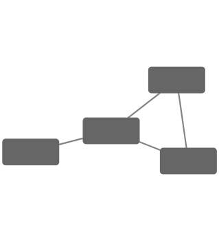
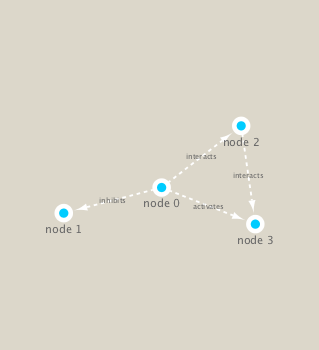

```{r setup, include=FALSE}
knitr::opts_chunk$set(echo = TRUE)
```

## classs 17

These functions are a convenient way to verify a connection to Cytoscape and for logging the versions of RCy3 and Cytoscape in your scripts.

We will use the **igraph** package from CRAN adn the **RCy3** package from bioconductor to build and visualize networks of this data.
```{r}
# load the packages
library(RCy3)
library(igraph)
```

```{r}
# Test the connection to Cytoscape.
cytoscapePing()
```

```{r}
# Check the version
cytoscapeVersionInfo()
```


We can test things further by making a small network (here in igraph format as used by the R igraph package) and sending it to Cytoscape:

```{r}
g <- makeSimpleIgraph()
createNetworkFromIgraph(g,"myGraph")
```

```{r}
plot(g)
```


If you turn to your Cytoscape window you should now see a simple 4 vertex and 4 edge network displayed (see below).

We can include this Cytoscape rendered network image in our report with the following code:

Tell cytoscape to export an image: 
```{r}
# save image?
fig <- exportImage(filename="demo", type="png", height=350)
```

Inset this image into this Rmd report:
```{r}
# have whatever shows on the cytoscape

```

Change the cytoscape display style
```{r}
# will change simolutiously in cytoscape!! 
setVisualStyle("Marquee")
```

Save and include image here in this report
```{r}
fig <- exportImage(filename="demo_marquee", type="png", height=350)

```

There are a lot of visual styles you can choose
```{r}
styles <- getVisualStyleNames()
styles
```


## Read our metagenomics data


```{r}
## scripts for processing located in "inst/data-raw/"
prok_vir_cor <- read.delim("virus_prok_cor_abundant.tsv", stringsAsFactors = FALSE)

## Have a peak at the first 6 rows
head(prok_vir_cor)
```

There are many different ways to work with graphs in R. We will primarily use the igraph package (see: http://igraph.org/r/ ) and also work with our network within Cytoscape.

Here we will use the igraph package to convert the co-occurrence dataframe into a network that we can send to Cytoscape. In this case our graph is undirected (so we will set directed = FALSE) since we do not have any information about the direction of the interactions from this type of data.


```{r}
g <- graph.data.frame(prok_vir_cor, directed = FALSE)
```

We can check the class of our new object g and see that is is of class igraph. Therefor the print.igraph() function will be called when we type it's name allowing us have an informative overview of the graph structu
```{r}
class(g)

```

```{r}
g
# tell us 845 nodes, 1544 edges
# UNW = In this case our network is Undirected, Named (i.e. has the 'name' node/vertex attribute set) and Weighted (i.e. the 'weight' edge attribute is set).
```


```{r}
plot(g)
# too dense in terms of node, label, etc... 
```

Let's turn off the blue text labels
```{r}
plot(g, vertex.label=NA)
```

Make the nodes / vertex smaller.. 
```{r}
plot(g, vertex.size=3, vertex.label=NA)
```

To find out more about igraph network plot options see http://igraph.org/r/doc/plot.common.html. Note that we can tune lots of plot attributes (see the help page ?igraph.plotting for details). Here we just turned down our vertex size from the default value of 15 and turned of our vertex labels.


To send this network to Cytoscape we can use the command:
```{r}

```


network analysis is useful

