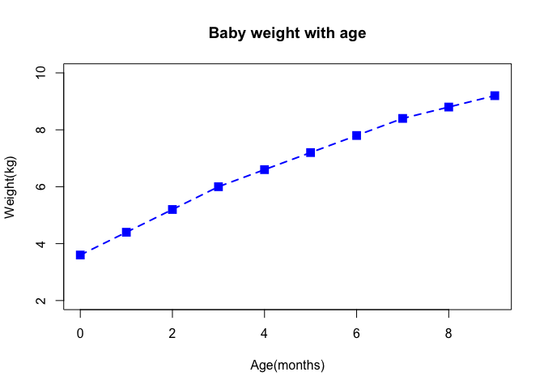
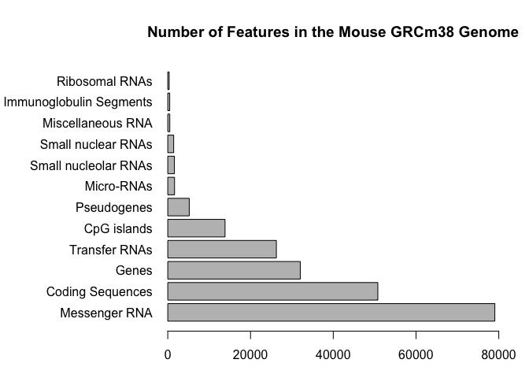
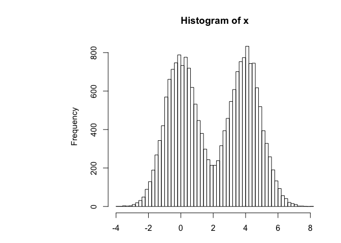
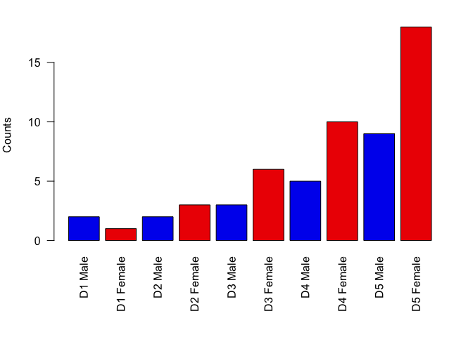
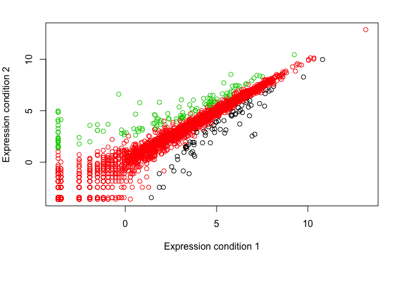
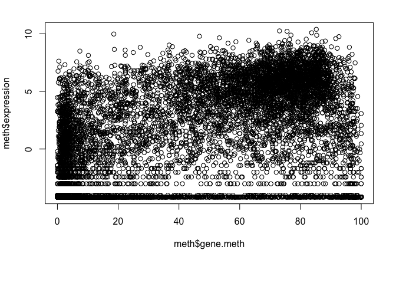
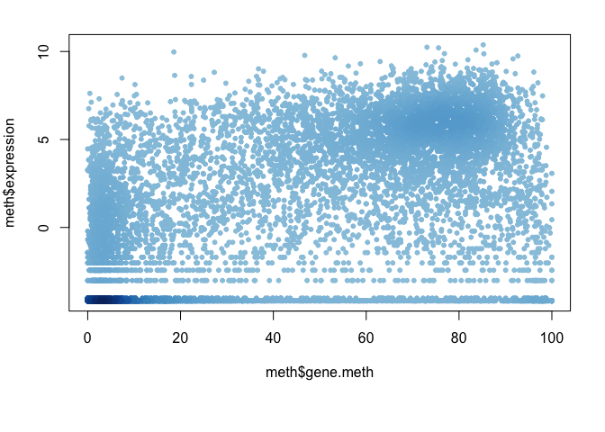
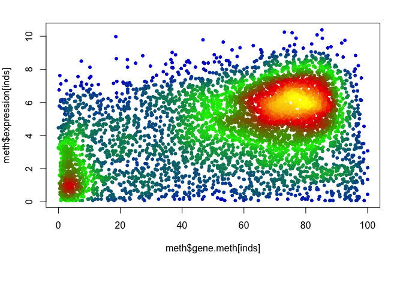

Class5 Data exploration and visualization in R
================
Belinda Xue
Oct 31, 2019

``` r
# LEC 5 Data Visualization (from ppt)

x <- rnorm(1000)
# some summary stats about the normal distribution
mean(x)
```

    ## [1] 0.0242769

``` r
sd(x)
```

    ## [1] 1.002441

``` r
summary(x)
```

    ##     Min.  1st Qu.   Median     Mean  3rd Qu.     Max. 
    ## -3.68380 -0.64771  0.01290  0.02428  0.70244  3.82361

``` r
# 5 number summary (include max,Q1,Q2,Q3,min)
# Q2 = median, Q3-Q1 = interquartile range
boxplot(x) 
```

<!-- -->

``` r
# box and whisker plots; shows the max,Q1,median,Q3,min
hist(x)
rug(x)
```

<!-- -->

``` r
# SECTION 2A: LINE PLOT

# the file separater for this file is SPACE
# HOW TO READ TABLE --> like below "bimm143_05_rstats/ file name"
# EX) read.table("bimm143_05_rstats/weight_chart.txt",header=FALSE)
# use read.table here because the file separator is a SPACE
# name the data set as baby, and use read.table (), type in the project name slash chart to read
# view (name) to view the table in a new tab 
baby <- read.table("bimm143_05_rstats/weight_chart.txt",header = TRUE)
# notice the difference between header when you choose true or false
# baby <- read.table("bimm143_05_rstats/weight_chart.txt",header = FALSE)
# header=TRUE will put the first row as header; if false, then first row is just regular data show in table

# Test out different functions
#barplot(baby$Weight)
#barplot(baby$Age)

# line plot the table 
# plot(baby$Age, baby$Weight, typ="o", pch=15)
# Let's add more features
plot(baby$Age, baby$Weight, typ="o", pch=15, lty=2, cex=1.5, lwd=2, ylim=c(2,10), xlab="Age(months)", ylab="Weight(kg)", main="Baby weight with age", col="blue")
```

<!-- -->

``` r
# name of plot $ which column, name of plot $ which column.....??  
# type = "o" = overplotted to line and dot
# pch = point chracter ; change shape of the dot
# pch = 15 = point character of filled square (see lec slides for all point character numbers)
# lty = line style; 1=solid, 2=dashed, 3=dotted... 
# cex = 1.5 = dot sizes
# lwd = line width = large number = thicker line
# ylim=c(min, max) = on y axis limit to 2 - 10 kg (y-axis is kg)
# xlab= x-axis label = {xlab="name of your x axis"}
# ylab= y-axis label = {ylab="name of your y axis"}
# main = title of your plot on the top = {main="title of plot"}
# color= {col="color of your choice"}

# SECTION 2B: BARPLOT

# name "feature_counts.txt" as feat
# the file separater for this file is TAB 
feat <- read.table("bimm143_05_rstats/feature_counts.txt", sep="\t", header=TRUE)
# sep = the field separator character；Values on each line of the file are separated by this character
# click on the data on the right hand side, then create a barplot
barplot(feat$Count)
```

<!-- -->

``` r
# barplot (file name $ column name you want to plot)
# Get a polish graph 
par(mar=c(3.1, 11.1, 4.1, 2))
# margin of bottom,left, top, right (left 11.1 cuz name is too long, give more spaces)
# par = parameter for all plot in the current plot area (global)
# par affect the subsequent plots
barplot(feat$Count, names.arg=feat$Feature, horiz=TRUE, main="Number of Features in the Mouse GRCm38 Genome", las=1, xlim=c(0,80000))
```

<!-- -->

``` r
# names.arg : bar label / a vector of names to be plotted below each bar or group of bars. 
# horiz = TRUE, make the plot horizotal
# beside = TRUE ; plot multiple series as a group not stacked
# las = can find on ?par; the style of axis label; 0=always parallel to the axis, 1=always horizontal, 2=always perpendicular, 3= always vertical

# SECTION 2C: HISTORGRAM

x <- c(rnorm(10000), rnorm(10000)+4)
hist(x, breaks=80)
```

<!-- -->

``` r
# rnorm(number of points?) 
# rnorm(10000)+4 加了4个offset; shift 4
# create histogram of x and use a break of 80 （用几个格分；break=10？ 用10个格分10000个东西）


# Section 3A: Color Vectors

par(mar=c(7,4,2,2))
mf <- read.delim("bimm143_05_rstats/male_female_counts.txt")
# use read.delim here because the separator is TAB
barplot(mf$Count, names.arg=mf$Sample, col=rainbow(nrow(mf)), las=2, ylab="Counts")
```

<!-- -->

``` r
# las=2, axis label style is vertical 
# col = rainbow color for every row of the data name mf = {col=rainbow(nrow(mf))} ; alternate the color
barplot(mf$Count, names.arg=mf$Sample, col=c("blue2","red2"), las=2, ylab="Counts")
```

<!-- -->

``` r
# make the female and male different colors

# Section 3B: Coloring by Values

# file separator is TAB..?
genes <- read.delim("bimm143_05_rstats/up_down_expression.txt")
# what is delim????? reading a table and create a data form
# when to use read.table & read.delim? depend on the separator???
# how many genes are there (how many rows?)
nrow(genes)
```

    ## [1] 5196

``` r
# how many rows and columns are there? 
dim(genes)
```

    ## [1] 5196    4

``` r
# how many genes are up, down, unchange? 
# to categorize and count the "State" column in the "genes" file
table(genes$State)
```

    ## 
    ##       down unchanging         up 
    ##         72       4997        127

``` r
# create scatter plot??? 
plot(genes$Condition1, genes$Condition2, col=genes$State, xlab="Expression condition 1", ylab="Expression condition 2")
```

<!-- -->

``` r
# genes$x-axis (Condition1 is one of the coloumn in that data)
# color according to the "State" column (total 3 different answers in that column = 3 different colors)

# check the order of the option for column "State"
levels(genes$State)
```

    ## [1] "down"       "unchanging" "up"

``` r
# assign the color according to the order of the option
# Run levels() on the "State" column and match this with what you saw in palette() to see how each color was selected. 
# Work out what colors you would need to put into palette to get the color selection you actually want.
# EX) the order is "down" "unchanging" "up" , can assign the color according to that order by {palatte (c"a","b","c")}

# use palette function to designate the colors of the "State" column (3 different options=3 colors)
palette(c("blue", "grey","red"))
# since we know the order of the options in "State" column, then we can assign the color accordingly
plot(genes$Condition1, genes$Condition2, col=genes$State, xlab="Expression condition 1", ylab="Expression condition 2")
```

<!-- -->

``` r
# SECCTION 3C: Dynamic use of Color

# The file separator is a TAB --> use read.delim??? 
meth <- read.delim("bimm143_05_rstats/expression_methylation.txt")
# check how many rows and column are there --> use dim() or nrow()
dim(meth)
```

    ## [1] 9241    4

``` r
# create a scatterplot of x-axis=gene.meth and y-axis=expression
plot(meth$gene.meth, meth$expression)
```

<!-- -->

``` r
# scatterplot is cluster together; can make it smooth density plot
# densCols(meth$gene.meth, meth$expression) --> will code a bunch of things
# use densCols() to color by point density ; colors for smooth density plots
# to make a new color vector that you can use in a new plot along with solid plotting character (e.g. pch=20).
dcols <- densCols(meth$gene.meth, meth$expression)
# name the densCols so more convinent
# then plot as regular but need to change "pch" aka point character default from hollow circle to solid dot
plot(meth$gene.meth, meth$expression, col=dcols, pch=20)
```

<!-- -->

``` r
# seems like most data is cluster in the origion (where expression >0)
# limit the expression and only show those exp >0
inds <- meth$expression > 0
# plot just these gene (those > 0)
plot(meth$gene.meth[inds], meth$expression[inds])
```

<!-- -->

``` r
# make a density color vector for these gene
dcols <- densCols(meth$gene.meth[inds], meth$expression[inds])
# plot the smooth density plot for these genes
plot(meth$gene[inds], meth$expression[inds], col=dcols, pch=20)
```

<!-- -->

``` r
# Change the colramp used by the densCols() function to go between blue, green, red and yellow with the colorRampPalette() function ....
dcols.custom <- densCols(meth$gene.meth[inds], meth$expression[inds], colramp= colorRampPalette(c("blue2","green2","red2","yellow")))
# colramp ??? 
# colorRampPalette() = make smooth palettes for ramped colors; can generate a function to make actual color vectors 
# how to assign color?? 
plot(meth$gene.meth[inds], meth$expression[inds], col=dcols.custom, pch=20)                       
```

<!-- -->
