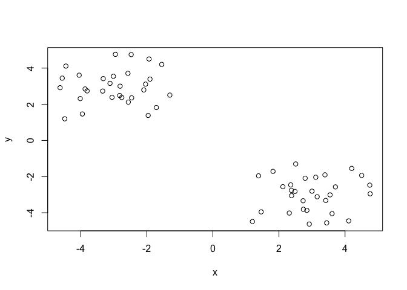
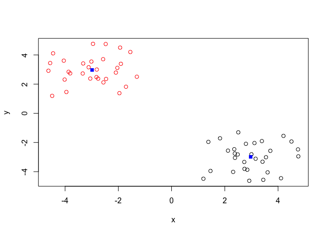
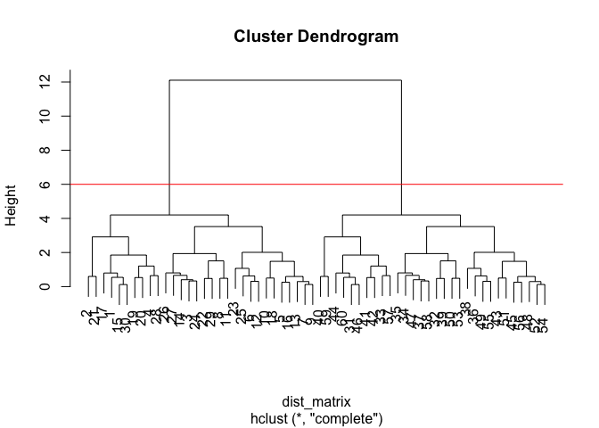
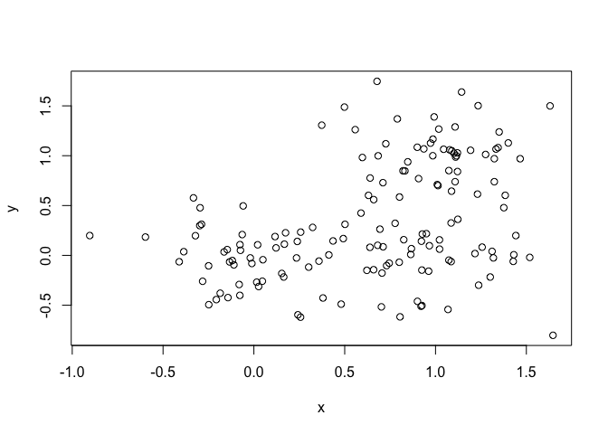
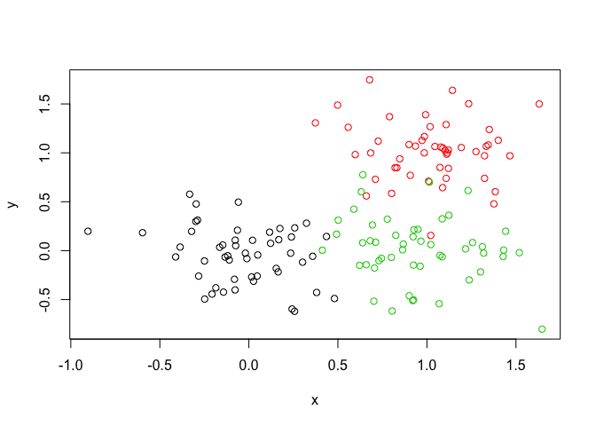
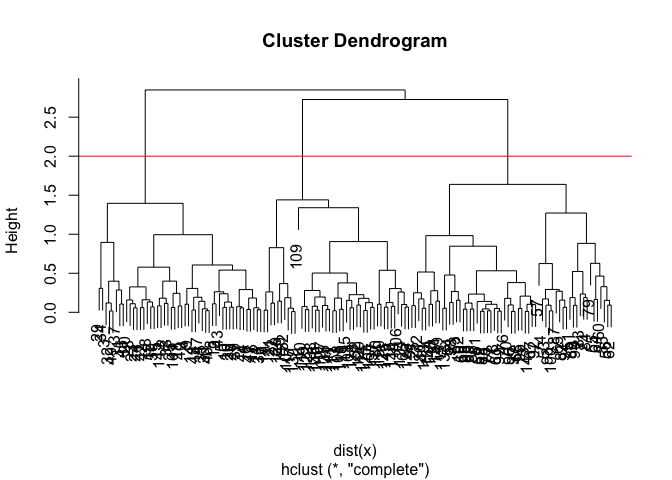
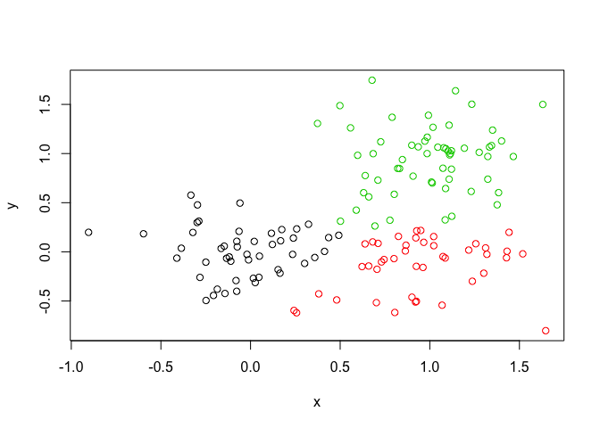
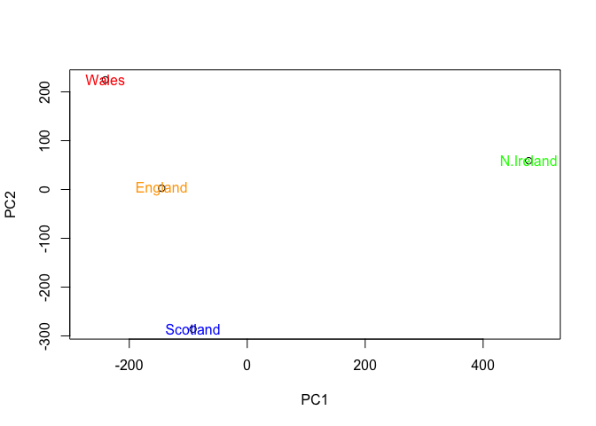
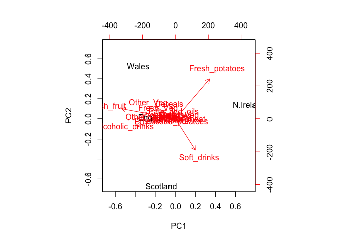

Class 8 Machine Learning 1
================
Belinda Xue
10/24/2019

## K-means Clustering

``` r
#  Generate some example data for clustering
tmp <- c(rnorm(30,-3), rnorm(30,3))
# rnorm function pick normal distrubtuion, 
# next rnorm will have 30 points clustering around -3 and second one is 30 points clustering around 3
x <- cbind(x=tmp, y=rev(tmp))
# cbind = bin them together?? 
plot(x)
```

<!-- -->

Use the kmeans() function setting k to 2 and nstart=20 - k=2 means group
these number into 2 clusters - nstart= 20 means run the iritation 20
times - the plot will show the best clustering

``` r
kk <- kmeans(x, centers = 2, nstart=20)
```

Inspect/print the results

``` r
kk
```

    ## K-means clustering with 2 clusters of sizes 30, 30
    ## 
    ## Cluster means:
    ##           x         y
    ## 1  2.970920 -2.984522
    ## 2 -2.984522  2.970920
    ## 
    ## Clustering vector:
    ##  [1] 2 2 2 2 2 2 2 2 2 2 2 2 2 2 2 2 2 2 2 2 2 2 2 2 2 2 2 2 2 2 1 1 1 1 1
    ## [36] 1 1 1 1 1 1 1 1 1 1 1 1 1 1 1 1 1 1 1 1 1 1 1 1 1
    ## 
    ## Within cluster sum of squares by cluster:
    ## [1] 52.53764 52.53764
    ##  (between_SS / total_SS =  91.0 %)
    ## 
    ## Available components:
    ## 
    ## [1] "cluster"      "centers"      "totss"        "withinss"    
    ## [5] "tot.withinss" "betweenss"    "size"         "iter"        
    ## [9] "ifault"

``` r
# 30 points for each clusters (cuz rnorm you set 30)
# clustering vector -> where each point (total 60 points) is at which cluster ;;;; first 30 in one cluster, second 30 in another cluster
# input data have 60 points
#
```

Q. How many points are in each cluster? \# 30 points each Q. What
‘component’ of your result object details - cluster size? - cluster
assignment/membership? - cluster center?

Try to get stuff out of the k, how to access it - using $ sign

  - cluster size?

<!-- end list -->

``` r
kk$size
```

    ## [1] 30 30

  - cluster
    assignment/membership?

<!-- end list -->

``` r
kk$cluster
```

    ##  [1] 2 2 2 2 2 2 2 2 2 2 2 2 2 2 2 2 2 2 2 2 2 2 2 2 2 2 2 2 2 2 1 1 1 1 1
    ## [36] 1 1 1 1 1 1 1 1 1 1 1 1 1 1 1 1 1 1 1 1 1 1 1 1 1

  - cluster center?

<!-- end list -->

``` r
kk$centers
```

    ##           x         y
    ## 1  2.970920 -2.984522
    ## 2 -2.984522  2.970920

Plot x colored by the kmeans cluster assignment and add cluster centers
as blue points

``` r
plot(x, col= kk$cluster)
# assign color vector 1 black 2 red to your two cluster ;;;;  can also use number to give colors
points(kk$centers, col="blue", pch=15) 
```

<!-- -->

``` r
# give center an unique blue dot --> show us where the best point is... 
```

## Hierarchical Clustering in R

The **hclust()** function requires a distance matrix as input. You can
get this from the **dist()** function

``` r
# First we need to calculate point (dis)similarity
#   as the Euclidean distance between observations
dist_matrix <- dist(x)

# The hclust() function returns a hierarchical
#  clustering model
hc <- hclust(d = dist_matrix)

# the print method is not so useful here
# tell you which cluster method, distance, number of objects
hc
```

    ## 
    ## Call:
    ## hclust(d = dist_matrix)
    ## 
    ## Cluster method   : complete 
    ## Distance         : euclidean 
    ## Number of objects: 60

The above is not a helpful print.. cuz just tell you how many points you
have

Give us a phylogenic tree if we plot this..

``` r
plot(hc)
# the tree give first 30 on left branch and second 30 at right brunch

abline(h=6, col="red")
```

<!-- -->

``` r
# draw a line at the height of 6 and give it red color

grps <- cutree(hc, h=6)
# give us the membership function; which point is at which branch!! first 30 at branch 1 and second 30 at branch 2
```

``` r
cutree(hc, k=2)
```

    ##  [1] 1 1 1 1 1 1 1 1 1 1 1 1 1 1 1 1 1 1 1 1 1 1 1 1 1 1 1 1 1 1 2 2 2 2 2
    ## [36] 2 2 2 2 2 2 2 2 2 2 2 2 2 2 2 2 2 2 2 2 2 2 2 2 2

``` r
# cut this tree where k=2
cutree(hc, k=4)
```

    ##  [1] 1 1 2 1 2 2 2 2 2 2 2 2 2 2 1 2 1 2 1 1 1 2 2 2 2 2 2 1 2 1 3 4 3 4 4
    ## [36] 4 4 4 4 3 3 3 4 3 4 3 4 4 4 4 4 4 4 4 4 4 3 4 3 3

``` r
# cut your tree into 4 clusters
```

Try another set of data

``` r
# Step 1. Generate some example data for clustering
x <- rbind(
  matrix(rnorm(100, mean=0, sd = 0.3), ncol = 2),   # c1
  matrix(rnorm(100, mean = 1, sd = 0.3), ncol = 2), # c2
  matrix(c(rnorm(50, mean = 1, sd = 0.3),           # c3
           rnorm(50, mean = 0, sd = 0.3)), ncol = 2))
colnames(x) <- c("x", "y")

# Step 2. Plot the data without clustering
plot(x)
```

<!-- -->

``` r
# Step 3. Generate colors for known clusters
#  (just so we can compare to hclust results)
col <- as.factor( rep(c("c1","c2","c3"), each=50) )
plot(x, col=col)
```

<!-- -->

Q. Use the dist(), hclust(), plot() and cutree() functions to return 2
and 3 clusters

Q. How does this compare to your known ‘col’ groups?

``` r
# clustering
hc <- hclust( dist(x) )

# draw tree
plot(hc)
abline(h=2, col="red")
```

<!-- -->

``` r
# cut the ree into clusters/groups
grps <- cutree(hc, h=2)
grps
```

    ##   [1] 1 1 1 1 1 1 1 1 1 1 1 1 1 1 1 1 2 1 2 1 2 2 1 1 1 1 1 1 1 1 1 1 1 1 1
    ##  [36] 1 1 1 1 1 1 1 1 1 1 1 1 1 1 1 3 2 3 3 3 3 3 3 3 3 3 3 3 3 3 3 3 3 3 3
    ##  [71] 3 3 3 3 3 3 3 3 3 3 3 3 3 3 3 3 3 3 3 3 3 3 3 3 3 3 3 3 3 3 1 3 2 2 2
    ## [106] 2 2 2 2 2 2 3 2 2 2 2 2 2 2 2 2 2 2 2 3 2 2 2 2 2 3 2 3 3 2 2 2 2 2 2
    ## [141] 2 1 3 2 2 2 3 3 3 2

Plot the data colored by the hclust result with k=3

``` r
plot(x, col=grps)
```

<!-- -->

``` r
# this plot looks the same as the last plot
```

How many points in each cluster?

``` r
table(grps)
```

    ## grps
    ##  1  2  3 
    ## 48 43 59

``` r
# cluster 1 have 66 members, cluster 2 have 43 members, cluster 3 have 41 members
# tell you how many points in each cluster
```

Cross-tablulate i.e. compare our clustering result with the known answer

``` r
table(grps, col)
```

    ##     col
    ## grps c1 c2 c3
    ##    1 46  0  2
    ##    2  4  1 38
    ##    3  0 49 10

``` r
# 
```

## Principal Component Analysis (PCA)

Read some example gene expression data (LAB 8 Gene data 2nd data)

``` r
## You can also download this file from the class website!
mydata <- read.csv("https://tinyurl.com/expression-CSV",row.names=1)

# show us the table of this data
head(mydata)
```

    ##        wt1 wt2  wt3  wt4 wt5 ko1 ko2 ko3 ko4 ko5
    ## gene1  439 458  408  429 420  90  88  86  90  93
    ## gene2  219 200  204  210 187 427 423 434 433 426
    ## gene3 1006 989 1030 1017 973 252 237 238 226 210
    ## gene4  783 792  829  856 760 849 856 835 885 894
    ## gene5  181 249  204  244 225 277 305 272 270 279
    ## gene6  460 502  491  491 493 612 594 577 618 638

How many rows/colums? What is the dimension of the data? How many genes
(the columns)?

``` r
dim(mydata)
```

    ## [1] 100  10

``` r
nrow(mydata)
```

    ## [1] 100

Lets do PCA with the **prcomp()** function…

``` r
## lets do PCA
pca <- prcomp(t(mydata), scale=TRUE)

## See what is returned by the prcomp() function
attributes(pca)
```

    ## $names
    ## [1] "sdev"     "rotation" "center"   "scale"    "x"       
    ## 
    ## $class
    ## [1] "prcomp"

``` r
## A basic PC1 vs PC2 2-D plot
plot(pca$x[,1], pca$x[,2])
```

<!-- -->

``` r
# five point of one side and 5 points on other side
# our 2D plot
```

``` r
## A basic PC1 vs PC2 2-D plot
plot(pca$x[,1], pca$x[,2])
```

<!-- -->

``` r
## Precent variance is often more informative to look at
pca.var <- pca$sdev^2
pca.var.per <- round(pca.var/sum(pca.var)*100, 1)
pca.var.per
```

    ##  [1] 92.6  2.3  1.1  1.1  0.8  0.7  0.6  0.4  0.4  0.0

``` r
# 92.6% at pc1, 2.3% at pc2 ... etc
# shows that pc1 contaon the most variant, then less and less for pc2, pc3.... 
```

Scree-plot

``` r
pca.var <- pca$sdev^2
pca.var.per <- round(pca.var/sum(pca.var)*100, 1)
barplot(pca.var.per, main="Scree Plot",
        xlab="Principal Component", ylab="Percent Variation")
```

<!-- -->

``` r
# shows in a graph style that how your pc looks like
# pc1 highest cuz contain 92.6% of the data
```

Give plot some
colors

``` r
plot(pca$x[,1], pca$x[,2], col=c("red", "red", "red","red","red","blue","blue","blue","blue","blue"))
```

<!-- -->

``` r
# assign the colors by hand... 
```

PCA plot can separate genes into .. ??????????

## Lab 8 PCA with food data

``` r
x <- read.csv("UK_foods.csv", row.names = 1)
head(x)
```

    ##                England Wales Scotland N.Ireland
    ## Cheese             105   103      103        66
    ## Carcass_meat       245   227      242       267
    ## Other_meat         685   803      750       586
    ## Fish               147   160      122        93
    ## Fats_and_oils      193   235      184       209
    ## Sugars             156   175      147       139

``` r
tail(x)
```

    ##                   England Wales Scotland N.Ireland
    ## Fresh_fruit          1102  1137      957       674
    ## Cereals              1472  1582     1462      1494
    ## Beverages              57    73       53        47
    ## Soft_drinks          1374  1256     1572      1506
    ## Alcoholic_drinks      375   475      458       135
    ## Confectionery          54    64       62        41

``` r
# head() shows the first 6 row of the data
# tail() shows the last 6 rows of the data
```

Q1. How many rows and columns are in your new data frame named x? What R
functions could you use to answer this
questions?

``` r
## Complete the following code to find out how many rows and columns are in x?
dim(x) # column & row
```

    ## [1] 17  4

``` r
ncol(x) # haw many columns
```

    ## [1] 4

``` r
nrow(x) # how many rows
```

    ## [1] 17

#### Checking your data

Q2. Which approach to solving the ‘row-names problem’ mentioned above do
you prefer and why? Is one approach more robust than another under
certain circumstances?

What happens if you run the first approach code block (i.e. the one with
x \<- x\[,-1\]), multiple times? —\> This -1 function is dangerous; -1
column each time you run it

``` r
# Note how the minus indexing works
# rownames(x) <- x[,1]
# x <- x[,-1]
# head(x)
```

#### Spotting major differences and trends

``` r
barplot(as.matrix(x), beside=T, col=rainbow(nrow(x)))
```

<!-- -->

``` r
# catagorized all 17 categories of foods into bar graphs
# each with different colors
```

Q3: Changing what optional argument in the above barplot() function
results in the following plot?

HINT: Try setting beside=FALSE in your barplot() code. Why would leaving
this argument out have the same effect as setting it to FALSE? See the
help page with ?barplot for further details.

Ans: change beside=FALSE will make thing stack together

``` r
barplot(as.matrix(x), beside=FALSE, col=rainbow(nrow(x)))
```

<!-- -->

Q5: Generating all pairwise plots may help somewhat. Can you make sense
of the following code and resulting figure? What does it mean if a given
point lies on the diagonal for a given plot?

``` r
pairs(x, col=rainbow(10), pch=16)
```

<!-- -->

``` r
# pair each country and compare them individually
# kinda like the hamming distance from BIEB 146
```

Even relatively small datasets can prove challanging to interpertate
Given that it is quite difficult to make sense of even this relatively
small data set. Hopefully, we can clearly see that a powerful analytical
method is absolutely necessary if we wish to observe trends and patterns
in larger datasets.

Q6. What is the main differences between N. Ireland and the other
countries of the UK in terms of this data-set?

#### PCA to the rescue

``` r
# Use the prcomp() PCA function 
pca <- prcomp( t(x) )
summary(pca)
```

    ## Importance of components:
    ##                             PC1      PC2      PC3       PC4
    ## Standard deviation     324.1502 212.7478 73.87622 4.189e-14
    ## Proportion of Variance   0.6744   0.2905  0.03503 0.000e+00
    ## Cumulative Proportion    0.6744   0.9650  1.00000 1.000e+00

``` r
# pc1 contain 67.44% of data, etc
```

The summary print-out above indicates that PC1 accounts for more than
67% of the sample variance, PC2 29% and PC3 3%. Collectively PC1 and PC2
together capture 96% of the original 17 dimensional variance. Thus these
first two new principal axis (PC1 and PC2) represent useful ways to view
and further investigate our data set. Lets start with a simple plot of
PC1 vs PC2.

In this case approximately 67% of the variance in the data is accounted
for by the first principal component, and approximately 97% is accounted
for in total by the first two principal components. In this case, we
have therefore accounted for the vast majority of the variation in the
data using only a two dimensional plot - a dramatic reduction in
dimensionality from seventeen dimensions to two.

Summary PC - shows how many PC in PC1, PC2 etc..

``` r
v <- round( pca$sdev^2/sum(pca$sdev^2) * 100 )
v
```

    ## [1] 67 29  4  0

OR

``` r
## or the second row here...
z <- summary(pca)
z$importance
```

    ##                              PC1       PC2      PC3          PC4
    ## Standard deviation     324.15019 212.74780 73.87622 4.188568e-14
    ## Proportion of Variance   0.67444   0.29052  0.03503 0.000000e+00
    ## Cumulative Proportion    0.67444   0.96497  1.00000 1.000000e+00

This information can be summarized in a plot of the variances
(eigenvalues) with respect to the principal component number
(eigenvector number), which is given below.

Scree-Plot\! show PC in a graph format

``` r
barplot(v, xlab="Principal Component", ylab="Percent Variation")
```

<!-- -->

Q7. Complete the code below to generate a plot of PC1 vs PC2. The second
line adds text labels over the data points.

``` r
# Plot PC1 vs PC2
plot(pca$x[,1], pca$x[,2], xlab="PC1", ylab="PC2", xlim=c(-270,500))
# the x limit is from 

text(pca$x[,1], pca$x[,2], colnames(x))
```

<!-- -->

``` r
# replace the dots with the column names for better comparision --> shows that Ireland is the outlier
```

Q8. Customize your plot so that the colors of the country names match
the colors in our UK and Ireland map and table at start of this
document.

HINT: You can provide a color vector as input to the text() function
just like you can with the plot() function itself.

``` r
plot(pca$x[,1], pca$x[,2], xlab="PC1", ylab="PC2", xlim=c(-270,500))
# the x limit is from 

text (pca$x[,1], pca$x[,2], colnames(x), col=c("orange","red", "blue", "green"))
```

<!-- -->

\#\#\#\#Digging depper

``` r
## Lets focus on PC1 as it accounts for > 90% of variance 
par(mar=c(10, 3, 0.35, 0))
# global function that adjest the margin
barplot( pca$rotation[,1], las=2 )
```

<!-- -->

``` r
# only focus on pc1
```

Q9: Generate a similar ‘loadings plot’ for PC2. What two food groups
feature prominantely and what does PC2 maninly tell us about? -
Fresh\_potatoes and soft drinks predominate\!

``` r
# Lets focus on PC2 
par(mar=c(10, 3, 0.35, 0))
# global function that adjest the margin
barplot( pca$rotation[,2], las=2 )
```

<!-- -->

``` r
## The inbuilt biplot() can be useful for small datasets 
biplot(pca)
```

<!-- --> Observe here
that there is a central group of foods (red arrows) around the middle of
each principal component, with four on the periphery that do not seem to
be part of the group. Recall the 2D score plot (Figure above), on which
England, Wales and Scotland were clustered together, whilst Northern
Ireland was the country that was away from the cluster. Perhaps there is
some association to be made between the four variables that are away
from the cluster in the main PCA plot and the country that is located
away from the rest of the countries i.e. Northern Ireland.

PCA has the awesome ability to be able to make these associations for
us. It has also successfully managed to reduce the dimensionality of our
data set down from 17 to 2, allowing us to assert (using our figures
above) that countries England, Wales and Scotland are ‘similar’ with
Northern Ireland being different in some way. Furthermore, digging
deeper into the loadings we were able to associate certain food types
with each cluster of countries.
