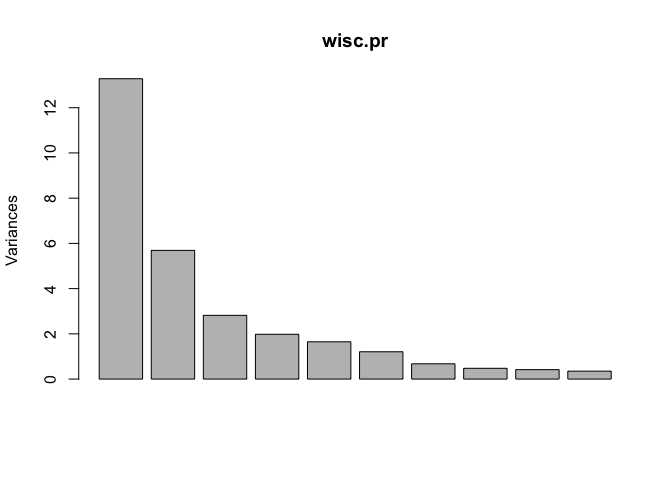
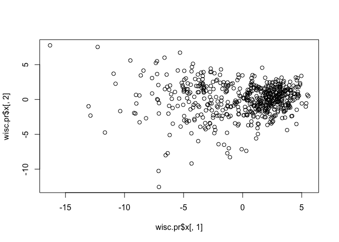

Class 9
================
Belinda Xue
10/29/2019

## Data Input

``` r
# read the data
wisc.df <- read.csv("WisconsinCancer.csv")
head(wisc.df)
```

    ##         id diagnosis radius_mean texture_mean perimeter_mean area_mean
    ## 1   842302         M       17.99        10.38         122.80    1001.0
    ## 2   842517         M       20.57        17.77         132.90    1326.0
    ## 3 84300903         M       19.69        21.25         130.00    1203.0
    ## 4 84348301         M       11.42        20.38          77.58     386.1
    ## 5 84358402         M       20.29        14.34         135.10    1297.0
    ## 6   843786         M       12.45        15.70          82.57     477.1
    ##   smoothness_mean compactness_mean concavity_mean concave.points_mean
    ## 1         0.11840          0.27760         0.3001             0.14710
    ## 2         0.08474          0.07864         0.0869             0.07017
    ## 3         0.10960          0.15990         0.1974             0.12790
    ## 4         0.14250          0.28390         0.2414             0.10520
    ## 5         0.10030          0.13280         0.1980             0.10430
    ## 6         0.12780          0.17000         0.1578             0.08089
    ##   symmetry_mean fractal_dimension_mean radius_se texture_se perimeter_se
    ## 1        0.2419                0.07871    1.0950     0.9053        8.589
    ## 2        0.1812                0.05667    0.5435     0.7339        3.398
    ## 3        0.2069                0.05999    0.7456     0.7869        4.585
    ## 4        0.2597                0.09744    0.4956     1.1560        3.445
    ## 5        0.1809                0.05883    0.7572     0.7813        5.438
    ## 6        0.2087                0.07613    0.3345     0.8902        2.217
    ##   area_se smoothness_se compactness_se concavity_se concave.points_se
    ## 1  153.40      0.006399        0.04904      0.05373           0.01587
    ## 2   74.08      0.005225        0.01308      0.01860           0.01340
    ## 3   94.03      0.006150        0.04006      0.03832           0.02058
    ## 4   27.23      0.009110        0.07458      0.05661           0.01867
    ## 5   94.44      0.011490        0.02461      0.05688           0.01885
    ## 6   27.19      0.007510        0.03345      0.03672           0.01137
    ##   symmetry_se fractal_dimension_se radius_worst texture_worst
    ## 1     0.03003             0.006193        25.38         17.33
    ## 2     0.01389             0.003532        24.99         23.41
    ## 3     0.02250             0.004571        23.57         25.53
    ## 4     0.05963             0.009208        14.91         26.50
    ## 5     0.01756             0.005115        22.54         16.67
    ## 6     0.02165             0.005082        15.47         23.75
    ##   perimeter_worst area_worst smoothness_worst compactness_worst
    ## 1          184.60     2019.0           0.1622            0.6656
    ## 2          158.80     1956.0           0.1238            0.1866
    ## 3          152.50     1709.0           0.1444            0.4245
    ## 4           98.87      567.7           0.2098            0.8663
    ## 5          152.20     1575.0           0.1374            0.2050
    ## 6          103.40      741.6           0.1791            0.5249
    ##   concavity_worst concave.points_worst symmetry_worst
    ## 1          0.7119               0.2654         0.4601
    ## 2          0.2416               0.1860         0.2750
    ## 3          0.4504               0.2430         0.3613
    ## 4          0.6869               0.2575         0.6638
    ## 5          0.4000               0.1625         0.2364
    ## 6          0.5355               0.1741         0.3985
    ##   fractal_dimension_worst  X
    ## 1                 0.11890 NA
    ## 2                 0.08902 NA
    ## 3                 0.08758 NA
    ## 4                 0.17300 NA
    ## 5                 0.07678 NA
    ## 6                 0.12440 NA

``` r
# use head() to only read the first 6 rows
```

Notes that the ‘id’ and ‘diagnosis’ columns will not be used for most of
the following steps, and the last “x” column in the following analysis

We have 569 samples in this dataset \# fill in the blank for you if r
xxx

How many patients we had?

``` r
nrow(wisc.df)
```

    ## [1] 569

How many benign (not cancerous) and and malignant (cancerous)) samples
do we have in the dataset?

``` r
table(wisc.df$diagnosis)
```

    ## 
    ##   B   M 
    ## 357 212

Exclude the “id”, “diagnosis”, “x” columns\!

``` r
# Convert the features of the data: wisc.data
wisc.data <- as.matrix(wisc.df[,3:32])


# Set the row names of wisc.data
row.names(wisc.data) <- wisc.df$id

head(wisc.data)
```

    ##          radius_mean texture_mean perimeter_mean area_mean smoothness_mean
    ## 842302         17.99        10.38         122.80    1001.0         0.11840
    ## 842517         20.57        17.77         132.90    1326.0         0.08474
    ## 84300903       19.69        21.25         130.00    1203.0         0.10960
    ## 84348301       11.42        20.38          77.58     386.1         0.14250
    ## 84358402       20.29        14.34         135.10    1297.0         0.10030
    ## 843786         12.45        15.70          82.57     477.1         0.12780
    ##          compactness_mean concavity_mean concave.points_mean symmetry_mean
    ## 842302            0.27760         0.3001             0.14710        0.2419
    ## 842517            0.07864         0.0869             0.07017        0.1812
    ## 84300903          0.15990         0.1974             0.12790        0.2069
    ## 84348301          0.28390         0.2414             0.10520        0.2597
    ## 84358402          0.13280         0.1980             0.10430        0.1809
    ## 843786            0.17000         0.1578             0.08089        0.2087
    ##          fractal_dimension_mean radius_se texture_se perimeter_se area_se
    ## 842302                  0.07871    1.0950     0.9053        8.589  153.40
    ## 842517                  0.05667    0.5435     0.7339        3.398   74.08
    ## 84300903                0.05999    0.7456     0.7869        4.585   94.03
    ## 84348301                0.09744    0.4956     1.1560        3.445   27.23
    ## 84358402                0.05883    0.7572     0.7813        5.438   94.44
    ## 843786                  0.07613    0.3345     0.8902        2.217   27.19
    ##          smoothness_se compactness_se concavity_se concave.points_se
    ## 842302        0.006399        0.04904      0.05373           0.01587
    ## 842517        0.005225        0.01308      0.01860           0.01340
    ## 84300903      0.006150        0.04006      0.03832           0.02058
    ## 84348301      0.009110        0.07458      0.05661           0.01867
    ## 84358402      0.011490        0.02461      0.05688           0.01885
    ## 843786        0.007510        0.03345      0.03672           0.01137
    ##          symmetry_se fractal_dimension_se radius_worst texture_worst
    ## 842302       0.03003             0.006193        25.38         17.33
    ## 842517       0.01389             0.003532        24.99         23.41
    ## 84300903     0.02250             0.004571        23.57         25.53
    ## 84348301     0.05963             0.009208        14.91         26.50
    ## 84358402     0.01756             0.005115        22.54         16.67
    ## 843786       0.02165             0.005082        15.47         23.75
    ##          perimeter_worst area_worst smoothness_worst compactness_worst
    ## 842302            184.60     2019.0           0.1622            0.6656
    ## 842517            158.80     1956.0           0.1238            0.1866
    ## 84300903          152.50     1709.0           0.1444            0.4245
    ## 84348301           98.87      567.7           0.2098            0.8663
    ## 84358402          152.20     1575.0           0.1374            0.2050
    ## 843786            103.40      741.6           0.1791            0.5249
    ##          concavity_worst concave.points_worst symmetry_worst
    ## 842302            0.7119               0.2654         0.4601
    ## 842517            0.2416               0.1860         0.2750
    ## 84300903          0.4504               0.2430         0.3613
    ## 84348301          0.6869               0.2575         0.6638
    ## 84358402          0.4000               0.1625         0.2364
    ## 843786            0.5355               0.1741         0.3985
    ##          fractal_dimension_worst
    ## 842302                   0.11890
    ## 842517                   0.08902
    ## 84300903                 0.08758
    ## 84348301                 0.17300
    ## 84358402                 0.07678
    ## 843786                   0.12440

Store the diagnosis for reference in the future as a separate vector -
Finally, setup a separate new vector called diagnosis that contains the
data from the diagnosis column of the origional dataset. We will use
this later to check our results.

``` r
# Create diagnosis vector for later
diagnosis <- wisc.df$diagnosis
```

## Exploratory data analysis

Q1. How many observations are in this dataset? Q2. How many of the
observations have a malignant diagnosis? Q3. How many variables/features
in the data are suffixed with \_mean?

HINT: The functions dim(), nrow(), table(), length() and grep() may be
useful for answering the first 3 questions above.

Q1. How many observations are in this dataset?

``` r
dim(wisc.df)
```

    ## [1] 569  33

``` r
# how many rows and how many columns 
# total 33 different tests are done with 569 patients
```

Q2. How many of the observations have a malignant diagnosis?

``` r
table(wisc.df$diagnosis)
```

    ## 
    ##   B   M 
    ## 357 212

``` r
# in the diagnosis column, how many malignant cancer?
# total 212 malignant 
```

Q3. How many variables/features in the data are suffixed with \_mean?

``` r
colnames(wisc.df)
```

    ##  [1] "id"                      "diagnosis"              
    ##  [3] "radius_mean"             "texture_mean"           
    ##  [5] "perimeter_mean"          "area_mean"              
    ##  [7] "smoothness_mean"         "compactness_mean"       
    ##  [9] "concavity_mean"          "concave.points_mean"    
    ## [11] "symmetry_mean"           "fractal_dimension_mean" 
    ## [13] "radius_se"               "texture_se"             
    ## [15] "perimeter_se"            "area_se"                
    ## [17] "smoothness_se"           "compactness_se"         
    ## [19] "concavity_se"            "concave.points_se"      
    ## [21] "symmetry_se"             "fractal_dimension_se"   
    ## [23] "radius_worst"            "texture_worst"          
    ## [25] "perimeter_worst"         "area_worst"             
    ## [27] "smoothness_worst"        "compactness_worst"      
    ## [29] "concavity_worst"         "concave.points_worst"   
    ## [31] "symmetry_worst"          "fractal_dimension_worst"
    ## [33] "X"

``` r
# give you all vectors of the column names
```

``` r
grep("_mean", colnames(wisc.df))
```

    ##  [1]  3  4  5  6  7  8  9 10 11 12

``` r
# within the column names, find the patter "_mean"
```

``` r
grep("_mean", colnames(wisc.df), value= TRUE)
```

    ##  [1] "radius_mean"            "texture_mean"          
    ##  [3] "perimeter_mean"         "area_mean"             
    ##  [5] "smoothness_mean"        "compactness_mean"      
    ##  [7] "concavity_mean"         "concave.points_mean"   
    ##  [9] "symmetry_mean"          "fractal_dimension_mean"

``` r
# within the column names, find the patter "_mean"
# use value=TRUE --> will spit out the name instead of the column number
```

``` r
length(grep("_mean", colnames(wisc.df)))
```

    ## [1] 10

``` r
# tell you how many as a number instead of giving you invidivual  names of the column that have _mean
```

## 2\. Principal Compoent Analysis

\#\#\#Performing PCA

The next step in your analysis is to perform principal component
analysis (PCA) on wisc.data.

It is important to check if the data need to be scaled before performing
PCA. Recall two common reasons for scaling data include: - The input
variables use different units of measurement. - The input variables have
significantly different variances.

Check the mean and standard deviation of the features (i.e. columns) of
the wisc.data to determine if the data should be scaled. Use the
colMeans() and apply() functions like you’ve done
before.

``` r
# Check column means and standard deviations to see if we need to use scaling

# use round() to round the mean and sd

round (colMeans(wisc.data), 3)
```

    ##             radius_mean            texture_mean          perimeter_mean 
    ##                  14.127                  19.290                  91.969 
    ##               area_mean         smoothness_mean        compactness_mean 
    ##                 654.889                   0.096                   0.104 
    ##          concavity_mean     concave.points_mean           symmetry_mean 
    ##                   0.089                   0.049                   0.181 
    ##  fractal_dimension_mean               radius_se              texture_se 
    ##                   0.063                   0.405                   1.217 
    ##            perimeter_se                 area_se           smoothness_se 
    ##                   2.866                  40.337                   0.007 
    ##          compactness_se            concavity_se       concave.points_se 
    ##                   0.025                   0.032                   0.012 
    ##             symmetry_se    fractal_dimension_se            radius_worst 
    ##                   0.021                   0.004                  16.269 
    ##           texture_worst         perimeter_worst              area_worst 
    ##                  25.677                 107.261                 880.583 
    ##        smoothness_worst       compactness_worst         concavity_worst 
    ##                   0.132                   0.254                   0.272 
    ##    concave.points_worst          symmetry_worst fractal_dimension_worst 
    ##                   0.115                   0.290                   0.084

``` r
# they all look different / mean and SD not silimar ==> need to set scale = TRUE
```

``` r
round ( apply(wisc.data,2,sd), 3) 
```

    ##             radius_mean            texture_mean          perimeter_mean 
    ##                   3.524                   4.301                  24.299 
    ##               area_mean         smoothness_mean        compactness_mean 
    ##                 351.914                   0.014                   0.053 
    ##          concavity_mean     concave.points_mean           symmetry_mean 
    ##                   0.080                   0.039                   0.027 
    ##  fractal_dimension_mean               radius_se              texture_se 
    ##                   0.007                   0.277                   0.552 
    ##            perimeter_se                 area_se           smoothness_se 
    ##                   2.022                  45.491                   0.003 
    ##          compactness_se            concavity_se       concave.points_se 
    ##                   0.018                   0.030                   0.006 
    ##             symmetry_se    fractal_dimension_se            radius_worst 
    ##                   0.008                   0.003                   4.833 
    ##           texture_worst         perimeter_worst              area_worst 
    ##                   6.146                  33.603                 569.357 
    ##        smoothness_worst       compactness_worst         concavity_worst 
    ##                   0.023                   0.157                   0.209 
    ##    concave.points_worst          symmetry_worst fractal_dimension_worst 
    ##                   0.066                   0.062                   0.018

``` r
# they all look different / mean and SD not silimar ==> need to set scale = TRUE
```

These values look very different so I will use `scale=TRUE` when I run
PCA

``` r
# Perform PCA on wisc.data by completing the following code
wisc.pr <- prcomp(wisc.data, scale=TRUE)
summary(wisc.pr)
```

    ## Importance of components:
    ##                           PC1    PC2     PC3     PC4     PC5     PC6
    ## Standard deviation     3.6444 2.3857 1.67867 1.40735 1.28403 1.09880
    ## Proportion of Variance 0.4427 0.1897 0.09393 0.06602 0.05496 0.04025
    ## Cumulative Proportion  0.4427 0.6324 0.72636 0.79239 0.84734 0.88759
    ##                            PC7     PC8    PC9    PC10   PC11    PC12
    ## Standard deviation     0.82172 0.69037 0.6457 0.59219 0.5421 0.51104
    ## Proportion of Variance 0.02251 0.01589 0.0139 0.01169 0.0098 0.00871
    ## Cumulative Proportion  0.91010 0.92598 0.9399 0.95157 0.9614 0.97007
    ##                           PC13    PC14    PC15    PC16    PC17    PC18
    ## Standard deviation     0.49128 0.39624 0.30681 0.28260 0.24372 0.22939
    ## Proportion of Variance 0.00805 0.00523 0.00314 0.00266 0.00198 0.00175
    ## Cumulative Proportion  0.97812 0.98335 0.98649 0.98915 0.99113 0.99288
    ##                           PC19    PC20   PC21    PC22    PC23   PC24
    ## Standard deviation     0.22244 0.17652 0.1731 0.16565 0.15602 0.1344
    ## Proportion of Variance 0.00165 0.00104 0.0010 0.00091 0.00081 0.0006
    ## Cumulative Proportion  0.99453 0.99557 0.9966 0.99749 0.99830 0.9989
    ##                           PC25    PC26    PC27    PC28    PC29    PC30
    ## Standard deviation     0.12442 0.09043 0.08307 0.03987 0.02736 0.01153
    ## Proportion of Variance 0.00052 0.00027 0.00023 0.00005 0.00002 0.00000
    ## Cumulative Proportion  0.99942 0.99969 0.99992 0.99997 1.00000 1.00000

# can look at the culmulative proportion to see the overall variant

  - “proportion of variance” is the what each PC has

Q4. From your results, what proportion of the original variance is
captured by the first principal components (PC1)? - 44.27% in PC1

``` r
x <- summary(wisc.pr)
x$importance[,1]
```

    ##     Standard deviation Proportion of Variance  Cumulative Proportion 
    ##               3.644394               0.442720               0.442720

Q5. How many principal components (PCs) are required to describe at
least 70% of the original variance in the data? - 3 PC needed; PC1 + PC2
+ PC3 = 72.5%

``` r
which(x$importance["Cumulative Proportion",] > 0.7) [1]
```

    ## PC3 
    ##   3

Q6. How many principal components (PCs) are required to describe at
least 90% of the original variance in the data? - 7 ; PC1 to PC7 = 91%
variant

``` r
which(x$importance["Cumulative Proportion",] > 0.9) [1]
```

    ## PC7 
    ##   7

Scree-plot that shows what each PC have how many variant

``` r
plot(wisc.pr)
```

<!-- -->

Lets make a plot of PC1 and PC2

``` r
plot(wisc.pr$x[,1], wisc.pr$x[,2])
```

<!-- -->

Color by cancer/
non-cancer…

``` r
plot(wisc.pr$x[,1], wisc.pr$x[,2], col=diagnosis, xlab="PC1", ylab="PC2")
```

<!-- -->

``` r
# color diagnosis, either benign and malignant
# but which color represent benign and malgant? 
```

\#\#Interpreting PCA results

Now you will use some visualizations to better understand your PCA
model. A common visualization for PCA results is the so-called biplot.

However, you will often run into some common challenges with using
biplots on real-world data containing a non-trivial number of
observations and variables. Here we will need to look at some
alternative visualizations. You are encouraged to experiment with
additional visualizations before moving on to the next section

Create a biplot of the wisc.pr using the biplot() function.

Q7. What stands out to you about this plot? Is it easy or difficult to
understand? Why?

``` r
biplot(wisc.pr)
```

<!-- -->

Q8. Generate a similar plot for principal components 1 and 3. What do
you notice about these plots?

``` r
# Repeat for components 1 and 3
plot(wisc.pr$x[, 1], wisc.pr$x[, 3] , col = diagnosis, 
     xlab = "PC1", ylab = "PC3")
```

<!-- -->

Because principal component 2 explains more variance in the original
data than principal component 3, you can see that the first plot has a
cleaner cut separating the two subgroups.

Overall, the plots indicate that principal component 1 is capturing a
separation of malignant from benign samples. This is an important and
interesting result worthy of further exploration - as we will do in the
next sections\!

### Variance explained

In this exercise, you will produce scree plots showing the proportion of
variance explained as the number of principal components increases.

As you look at these plots, ask yourself if there’s an ‘elbow’ in the
amount of variance explained that might lead you to pick a natural
number of principal components. If an obvious elbow does not exist, as
is typical in some real-world datasets, consider how else you might
determine the number of principal components to retain based on the
scree plot.

Calculate the variance of each principal component by squaring the sdev
component of wisc.pr (i.e. wisc.pr$sdev^2). Save the result as an object
called pr.var.

``` r
pr.var <- wisc.pr$sdev^2
head(pr.var)
```

    ## [1] 13.281608  5.691355  2.817949  1.980640  1.648731  1.207357

``` r
# variance in each PC 
# 13.28 is the variance 
```

Calculate the variance explained by each principal component by dividing
by the total variance explained of all principal components. Assign this
to a variable called pve and create a plot of variance explained for
each principal component.

``` r
# Variance explained by each principal component: pve
pve <-  pr.var / sum(pr.var) 

# Plot variance explained for each principal component
plot(pve, xlab = "Principal Component", 
     ylab = "Proportion of Variance Explained", 
     ylim = c(0, 1), type = "o")
```

<!-- -->

…

### Communicating PCA results

In this section we will check your understanding of the PCA results, in
particular the loadings and variance explained. The loadings,
represented as vectors, explain the mapping from the original features
to the principal components. The principal components are naturally
ordered from the most variance explained to the least variance
explained.

Q9. For the first principal component, what is the component of the
loading vector (i.e. wisc.pr$rotation\[,1\]) for the feature
concave.points\_mean?

``` r
wisc.pr$rotation["concave.points_mean",1]
```

    ## [1] -0.2608538

``` r
# what is angle rotation relative to the regualr xy axis
```

Q10. What is the minimum number of principal components required to
explain 80% of the variance of the data?

``` r
x <- summary(wisc.pr)
which(x$importance["Cumulative Proportion",] > 0.8) [1]
```

    ## PC5 
    ##   5

…..

\#3. Hierarchical clustering

Hierarchical clustering of case data The goal of this section is to do
hierarchical clustering of the observations. Recall from our last class
that this type of clustering does not assume in advance the number of
natural groups that exist in the data.

As part of the preparation for hierarchical clustering, the distance
between all pairs of observations are computed. Furthermore, there are
different ways to link clusters together, with single, complete, and
average being the most common linkage methods.

Scale the wisc.data data and assign the result to data.scaled.

``` r
# Scale the wisc.data data: data.scaled
data.scaled <- scale(wisc.data)
data.scaled
```

    ##            radius_mean  texture_mean perimeter_mean    area_mean
    ## 842302     1.096099529 -2.071512e+00     1.26881726  0.983509520
    ## 842517     1.828211974 -3.533215e-01     1.68447255  1.907030269
    ## 84300903   1.578499202  4.557859e-01     1.56512598  1.557513185
    ## 84348301  -0.768233323  2.535091e-01    -0.59216612 -0.763791736
    ## 84358402   1.748757910 -1.150804e+00     1.77501133  1.824623802
    ## 843786    -0.475955874 -8.346009e-01    -0.38680772 -0.505205927
    ## 844359     1.169878303  1.605082e-01     1.13712450  1.094332010
    ## 84458202  -0.118412587  3.581350e-01    -0.07280278 -0.218772414
    ## 844981    -0.319885392  5.883121e-01    -0.18391855 -0.383869508
    ## 84501001  -0.473118229  1.104467e+00    -0.32919213 -0.508615849
    ## 845636     0.537083438  9.184652e-01     0.44162208  0.406095932
    ## 84610002   0.468979955 -3.254213e-01     0.47866067  0.358357013
    ## 846226     1.430941655  1.281168e+00     1.66389556  1.330185001
    ## 846381     0.488843471  1.083542e+00     0.48277607  0.363187737
    ## 84667401  -0.112737297  7.719888e-01     0.06712078 -0.217635773
    ## 84799002   0.117111959  1.918224e+00     0.19593277  0.011113212
    ## 848406     0.156838990  1.953835e-01     0.11403633  0.084142391
    ## 84862001   0.568297535  3.232597e-01     0.66385362  0.408937534
    ## 849014     1.612550944  6.650378e-01     1.56512598  1.719484517
    ## 8510426   -0.166652555 -1.146154e+00    -0.18556471 -0.251735001
    ## 8510653   -0.297184231 -8.322759e-01    -0.26087651 -0.383301188
    ## 8510824   -1.311926130 -1.592558e+00    -1.30166089 -1.082619515
    ## 8511133    0.344123569 -1.169404e+00     0.43339128  0.140690277
    ## 851509     1.995633037  8.719647e-01     1.86143471  2.128675248
    ## 852552     0.715855082  4.860112e-01     0.74204620  0.709579058
    ## 852631     0.854899693 -6.718494e-01     0.98897014  0.732596037
    ## 852763     0.128462539  5.208865e-01     0.22391748 -0.028669220
    ## 852781     1.272033528  2.232838e-01     1.24000947  1.247778534
    ## 852973     0.332772989  1.390444e+00     0.42927589  0.220255141
    ## 853201     0.976918434 -9.857273e-01     0.94781615  0.853079974
    ## 853401     1.277708818  1.353244e+00     1.35112524  1.230728920
    ## 853612    -0.649052227 -1.370945e-01    -0.57776223 -0.608924411
    ## 85382601   0.820847952  1.090517e+00     0.85727737  0.694518566
    ## 854002     1.459318106  1.669447e+00     1.47870261  1.441007491
    ## 854039     0.568297535 -3.277463e-01     0.61858424  0.432806994
    ## 854253     0.741393888  5.348366e-01     0.74616160  0.609838817
    ## 854268     0.034820250  5.650619e-01     0.06835540 -0.062200127
    ## 854941    -0.311372457 -2.021951e-01    -0.38516156 -0.372503099
    ## 855133     0.244805990  1.374169e+00     0.14695952  0.124777304
    ## 855138    -0.183678426  3.558100e-01    -0.14687996 -0.271910377
    ## 855167    -0.195029006  5.325116e-01    -0.23824182 -0.261112289
    ## 855563    -0.901602644  4.790361e-01    -0.82592078 -0.806415771
    ## 855625     1.402565204  1.283494e+00     1.49516420  1.276194557
    ## 856106    -0.240431328  2.302588e-01    -0.19132627 -0.311692810
    ## 85638502  -0.271645425  5.859871e-01    -0.26951885 -0.350622761
    ## 857010     1.283384108 -3.928469e-01     1.30585585  1.196629693
    ## 85713702  -1.683090114 -5.695485e-01    -1.65681982 -1.287214880
    ## 85715     -0.271645425 -1.463946e-01    -0.24647261 -0.341813794
    ## 857155    -0.589461680 -1.083378e+00    -0.57323529 -0.584202471
    ## 857156    -0.180840780  6.999132e-01    -0.20819940 -0.266795493
    ## 857343    -0.671753388  5.371617e-01    -0.70986653 -0.645012760
    ## 857373    -0.138276103 -6.857996e-01    -0.19585321 -0.236106188
    ## 857374    -0.620675776 -2.440455e-01    -0.66912408 -0.617449218
    ## 857392     1.161365367 -1.370945e-01     1.16593229  1.074440794
    ## 857438     0.276020086  6.348126e-01     0.21774438  0.164559736
    ## 85759902  -0.739856872 -1.254694e-01    -0.76665904 -0.698719043
    ## 857637     1.442292236 -1.673198e-01     1.37993303  1.412591468
    ## 857793     0.165351926  5.348366e-01     0.14737106  0.005714168
    ## 857810    -0.305697166  4.731766e-03    -0.38516156 -0.362841651
    ## 858477    -1.563341489 -1.743684e+00    -1.54858483 -1.222994668
    ## 858970    -1.122938965 -1.025253e+00    -1.12840260 -0.974638627
    ## 858981    -1.569016779  3.930103e-01    -1.53541555 -1.230666995
    ## 858986     0.034820250  6.650378e-01     0.18317503 -0.026111778
    ## 859196    -1.405852184 -1.262405e+00    -1.34857644 -1.119560344
    ## 85922302  -0.410690036  1.057966e+00    -0.38186924 -0.442974836
    ## 859283     0.185215442  1.081217e+00     0.22350594  0.038108434
    ## 859464    -1.322992946  3.999854e-01    -1.31112631 -1.095406725
    ## 859465    -0.799447419 -5.804381e-02    -0.83003618 -0.741058918
    ## 859471    -1.446714274 -4.556225e-01    -1.36544958 -1.149113008
    ## 859487    -0.382313585 -6.509243e-01    -0.43619250 -0.433029228
    ## 859575     1.365675817  4.697360e-01     1.30174045  1.350076217
    ## 859711    -1.486725071 -1.081053e+00    -1.36544958 -1.167583423
    ## 859717     0.871925564  1.216068e+00     0.91489296  0.780050795
    ## 859983    -0.092873781 -8.136758e-01    -0.06333736 -0.201154480
    ## 8610175   -0.515682906 -6.439492e-01    -0.52590820 -0.522823861
    ## 8610404    0.551271664  8.378249e-02     0.49923767  0.462643818
    ## 8610629   -0.169490200 -1.941311e+00    -0.16704542 -0.271910377
    ## 8610637    1.113125400 -7.299750e-01     1.16181689  0.997717532
    ## 8610862    1.717543814  1.088192e+00     2.12893563  1.676860482
    ## 8610908   -0.359612424 -2.998460e-01    -0.36129224 -0.422231139
    ## 861103    -0.759720388  3.906853e-01    -0.74731666 -0.720031061
    ## 8611161   -0.223405457 -7.974006e-01    -0.22548408 -0.383301188
    ## 8611555    3.147716961  1.306744e+00     3.27301653  3.475594740
    ## 8611792    1.411078139  1.627597e+00     1.52808739  1.355759422
    ## 8612080   -0.603649905 -8.462260e-01    -0.61809314 -0.601252084
    ## 8612399    1.229468851 -1.789449e-01     1.19885548  1.193788091
    ## 86135501   0.100086088  5.046114e-01     0.09387087 -0.019007772
    ## 86135502   1.388376978  1.232343e+00     1.23589407  1.196629693
    ## 861597    -0.501494680  5.836621e-01    -0.50162735 -0.536463552
    ## 861598     0.145488410 -9.415519e-01     0.15642494 -0.008493844
    ## 861648     0.139813120  1.099817e+00     0.10704015  0.022195461
    ## 861799     0.352636505  8.068641e-01     0.33873711  0.208320412
    ## 861853    -0.243268973 -1.053153e+00    -0.29750356 -0.293222395
    ## 862009    -0.192191361 -2.300954e-01    -0.22095714 -0.283560947
    ## 862028     0.264669505  1.256329e-01     0.34285251  0.144100200
    ## 86208      1.740244975  8.696397e-01     1.66389556  1.730850926
    ## 86211     -0.552572293 -3.370464e-01    -0.58352379 -0.579087586
    ## 862261    -1.231620773  1.512081e-01    -1.22881833 -1.024082507
    ## 862485    -0.717155711 -1.499557e+00    -0.72550505 -0.688489275
    ## 862548     0.083060217  1.116827e-01     0.10333629 -0.035204906
    ## 862717    -0.146789039  1.323019e+00    -0.16128386 -0.205132723
    ## 862722    -2.027863997 -1.362381e+00    -1.98275941 -1.453164455
    ## 862965    -0.552572293  2.860593e-01    -0.60698156 -0.557491409
    ## 862980    -1.206365731  2.565696e-02    -1.15309499 -1.013284418
    ## 862989    -1.032134320  8.172307e-05    -1.01070219 -0.905871851
    ## 863030    -0.288671295 -8.671512e-01    -0.19585321 -0.354316844
    ## 863031    -0.705805130 -2.231203e-01    -0.69134724 -0.688773435
    ## 863270    -0.501494680 -1.742949e-01    -0.53331592 -0.534758590
    ## 86355      2.310611646  8.843253e-02     2.50343693  2.427043490
    ## 864018    -0.790934484  4.581109e-01    -0.80205147 -0.734239072
    ## 864033    -1.234458418 -5.346732e-01    -1.21276828 -1.036301397
    ## 86408     -0.424878262  3.418599e-01    -0.40409239 -0.495828639
    ## 86409      0.037657895  8.378249e-02     0.24120216 -0.071009095
    ## 864292    -1.026459030  2.093336e-01    -0.96008279 -0.911270896
    ## 864496    -1.532694922 -8.043757e-01    -1.48685385 -1.204808414
    ## 864685    -0.623513421  5.208865e-01    -0.63537781 -0.614607615
    ## 864726    -1.469131671 -8.206508e-01    -1.36750728 -1.164173501
    ## 864729     0.210754248 -6.090739e-01     0.27453689  0.078459187
    ## 864877     0.468979955  8.417395e-01     0.56508405  0.362903577
    ## 865128     1.084748949  1.674833e-01     0.91489296  0.929519076
    ## 865137    -0.771070968 -1.969211e+00    -0.76665904 -0.714916176
    ## 86517      1.286221753 -5.044479e-01     1.21120168  1.199471295
    ## 865423     2.872465383  2.116587e-01     3.05490039  3.143127271
    ## 865432     0.105761378 -1.952936e+00     0.09510549 -0.040319790
    ## 865468    -0.214892522 -6.741745e-01    -0.24153414 -0.288107511
    ## 86561     -0.078685556 -4.835227e-01    -0.14523380 -0.188083109
    ## 866083    -0.146789039  1.255593e+00    -0.17321851 -0.233832907
    ## 866203     1.382701688 -8.826909e-02     1.29350966  1.372809036
    ## 866458     0.276020086 -6.741745e-01     0.31322164  0.055726368
    ## 866674     1.606875653  1.355569e+00     1.58158758  1.526255560
    ## 866714    -0.549734648 -1.394931e+00    -0.53043514 -0.565732056
    ## 8670       0.378175311  4.425713e-02     0.40046809  0.267141579
    ## 86730502   0.576810470  5.232115e-01     0.58566104  0.440195160
    ## 867387     0.449116439 -1.246130e+00     0.41281429  0.303514089
    ## 867739     1.226631206  6.092373e-01     1.16181689  1.193788091
    ## 868202    -0.385151230  7.394385e-01    -0.42178861 -0.422231139
    ## 868223    -0.685941614 -6.090739e-01    -0.70986653 -0.657231650
    ## 868682    -0.765395678 -9.066766e-01    -0.77818215 -0.724861785
    ## 868826     0.233455409 -3.998219e-01     0.20087125  0.065956136
    ## 868871    -0.807960355 -1.371681e+00    -0.78065139 -0.767485819
    ## 868999    -1.245525234 -1.701834e+00    -1.26462230 -1.041132121
    ## 869104     0.562622244 -2.882209e-01     0.54039166  0.449288287
    ## 869218    -0.765395678 -4.602725e-01    -0.75348976 -0.729976669
    ## 869224    -0.348261843 -7.834505e-01    -0.33865755 -0.405465686
    ## 869254    -0.958355547 -1.004328e+00    -0.97572130 -0.851313087
    ## 869476    -0.632026357 -1.078728e+00    -0.57035451 -0.631088909
    ## 869691    -0.660402808 -6.299991e-01    -0.53413900 -0.633362190
    ## 86973701   0.233455409 -1.208194e-01     0.24161370  0.098350403
    ## 86973702   0.088735507 -9.555021e-01     0.08234776 -0.042024751
    ## 869931    -0.109899652 -3.207712e-01    -0.15840308 -0.198597038
    ## 871001501 -0.319885392  3.465099e-01    -0.34812297 -0.385006149
    ## 871001502 -1.676563530  3.279097e-01    -1.59261960 -1.281531676
    ## 8710441   -1.247511586 -9.183017e-01    -1.16009117 -1.007885374
    ## 87106     -0.844849742 -1.443757e+00    -0.86830939 -0.775726466
    ## 8711002   -0.277320715 -9.183017e-01    -0.27404579 -0.329594904
    ## 8711003   -0.532708777 -3.137962e-01    -0.56376987 -0.552944845
    ## 8711202    1.008132530  3.372098e-01     1.04658572  0.877517754
    ## 8711216    0.769770339  3.960709e-02     0.67619982  0.640243962
    ## 871122    -0.586624034 -1.522807e+00    -0.62262007 -0.586191592
    ## 871149    -0.915790870 -1.471657e+00    -0.95802509 -0.818634661
    ## 8711561   -0.674591034  2.070086e-01    -0.65307403 -0.668029738
    ## 8711803    1.436616945 -7.788004e-01     1.41285622  1.426799479
    ## 871201     1.550122751 -2.649707e-01     1.59393378  1.588770811
    ## 8712064   -0.507169971  6.813130e-01    -0.49874657 -0.541010116
    ## 8712289    2.594376160  6.394626e-01     2.47462914  2.930007098
    ## 8712291    0.239130699  1.093577e-01     0.14531336  0.100339524
    ## 87127     -0.944167321 -2.227289e+00    -0.95473277 -0.844777402
    ## 8712729    0.752744468 -1.138443e-01     0.71323841  0.657577736
    ## 8712766    0.948541983  1.253268e+00     0.99308554  0.936907242
    ## 8712853    0.239130699 -5.439733e-01     0.17494423  0.088120634
    ## 87139402  -0.512845261 -1.604183e+00    -0.53990056 -0.542146756
    ## 87163     -0.197866651  7.913245e-02    -0.25223417 -0.254292443
    ## 87164      0.378175311 -1.720434e+00     0.43339128  0.233042352
    ## 871641    -0.864713257 -1.064778e+00    -0.89547102 -0.801869207
    ## 871642    -0.983894353 -9.624771e-01    -1.00740987 -0.867510220
    ## 872113    -1.548301970 -1.125229e+00    -1.54529251 -1.215322342
    ## 872608    -1.198420325 -2.858959e-01    -1.12634490 -1.001633849
    ## 87281702   0.661939824  1.907335e-01     0.71323841  0.505836173
    ## 873357    -0.317047747  6.813130e-01    -0.40985395 -0.365114933
    ## 873586    -0.373800649 -1.448407e+00    -0.43948482 -0.415127134
    ## 873592     3.715245987  5.999372e-01     3.70924881  4.532670797
    ## 873593     1.975769521  1.692697e+00     2.08778165  1.864406234
    ## 873701     0.446278794  2.372339e-01     0.37989110  0.317437940
    ## 873843    -0.771070968 -1.015953e+00    -0.75883978 -0.718610259
    ## 873885     0.327097698  7.254884e-01     0.28606000  0.158308211
    ## 874158    -1.148477771 -9.717772e-01    -1.16091425 -0.958725654
    ## 874217     1.186904174 -1.649948e-01     1.09597051  1.097173612
    ## 874373    -0.685941614 -4.881728e-01    -0.71151269 -0.666608937
    ## 874662    -0.657565163 -4.416723e-01    -0.68723184 -0.642171158
    ## 874839    -0.518520551 -7.881005e-01    -0.54072364 -0.543283397
    ## 874858     0.026307314  8.905649e-01     0.09880935 -0.127841141
    ## 875093    -0.385151230  4.929862e-01    -0.40944241 -0.419105377
    ## 875099    -1.250632996 -2.486956e-01    -1.28561084 -1.042268762
    ## 875263    -0.507169971  1.760123e+00    -0.44524638 -0.504353446
    ## 87556202   0.207916603  9.114901e-01     0.34696791  0.046917401
    ## 875878    -0.345424198 -6.881246e-01    -0.38845388 -0.393530956
    ## 875938    -0.101386717  6.975881e-01    -0.05510657 -0.187514789
    ## 877159     1.121638336  5.929622e-01     1.04658572  1.048866373
    ## 877486     1.433779300  7.440886e-01     1.46224101  1.401225059
    ## 877500     0.091573152  2.163087e-01     0.10374783 -0.034636585
    ## 877501    -0.538384067  6.285730e-02    -0.55265829 -0.550955724
    ## 877989     0.968405498  7.056787e-03     0.95193155  0.843134366
    ## 878796     2.600051450  1.715947e+00     2.75447627  2.927165495
    ## 87880     -0.090036136  1.037041e+00    -0.01683336 -0.162224529
    ## 87930     -0.470280584 -1.603448e-01    -0.44771562 -0.491566235
    ## 879523     0.281695376 -6.067489e-01     0.28029845  0.175357825
    ## 879804    -1.206365731 -4.695726e-01    -1.19548360 -1.021525065
    ## 879830     0.818010306  2.256088e-01     0.72970001  0.708726577
    ## 8810158   -0.288671295  7.557137e-01    -0.20367247 -0.356590126
    ## 8810436    0.324260053 -1.483282e+00     0.25519451  0.200648086
    ## 881046502  1.831049619  6.627128e-01     1.75854973  1.804732586
    ## 8810528   -0.649052227 -8.129402e-02    -0.67735488 -0.644728600
    ## 8810703    3.967796404 -1.905700e-01     3.97263434  5.240229770
    ## 881094802  0.934353757  1.457870e+00     0.92723915  0.832904598
    ## 8810955    0.017794379  1.050991e+00     0.03707837 -0.125567859
    ## 8810987   -0.075847910 -5.486233e-01    -0.04152575 -0.215930812
    ## 8811523   -0.634864002 -2.184703e-01    -0.60286616 -0.632793870
    ## 8811779   -1.114426029 -4.207471e-01    -1.10782561 -0.948211726
    ## 8811842    1.609713298  5.278616e-01     1.55277979  1.634236448
    ## 88119002   1.533096880  3.064460e+00     1.48281801  1.614345231
    ## 8812816   -0.135438458 -1.425156e+00    -0.16828004 -0.244346835
    ## 8812818   -0.160977264 -1.253105e+00    -0.13906070 -0.265943013
    ## 8812844   -1.120101319 -4.091220e-01    -1.10494483 -0.971228704
    ## 8812877    0.460467020  2.232838e-01     0.43750668  0.302377448
    ## 8813129   -0.243268973 -5.276981e-01    -0.30532282 -0.308282887
    ## 88143502   0.060359056 -1.353081e+00     0.02226293 -0.038898989
    ## 88147101  -1.046322546 -8.904015e-01    -1.04321384 -0.924342266
    ## 88147102   0.247643635 -8.787763e-01     0.22556364  0.084142391
    ## 88147202  -0.427715907  1.088192e+00    -0.43701558 -0.450363002
    ## 881861    -0.368125359  7.068882e-01    -0.27610349 -0.431040106
    ## 881972     0.829360887 -4.874373e-02     0.88196977  0.682299676
    ## 88199202  -0.796609774  1.811273e+00    -0.83168234 -0.736512354
    ## 88203002  -0.824986226  3.376013e+00    -0.87160171 -0.761802615
    ## 88206102   1.811186103  1.981000e+00     1.74620354  1.887139053
    ## 882488    -1.294048966 -7.857755e-01    -1.30701091 -1.066422381
    ## 88249602  -0.027607943  4.557859e-01    -0.08967592 -0.146311556
    ## 88299702   2.577350289  1.785698e+00     2.53224473  2.884541461
    ## 883263     1.802673168  5.046114e-01     1.66801096  1.850198223
    ## 883270     0.026307314  1.990300e+00     0.02390909 -0.088058708
    ## 88330202   0.945704337  4.647799e+00     0.88196977  0.755044695
    ## 88350402  -0.138276103 -8.578512e-01    -0.18885703 -0.226160580
    ## 883539    -0.484468810 -9.880524e-01    -0.54977751 -0.506910888
    ## 883852    -0.802285065 -2.556706e-01    -0.74237818 -0.754414449
    ## 88411702  -0.107062007  1.041691e+00    -0.14111840 -0.184389026
    ## 884180     1.496207493  9.789157e-01     1.52808739  1.421116275
    ## 884437    -1.034971965  1.326079e-01    -1.03909844 -0.901325288
    ## 884448    -0.263132489 -4.323722e-01    -0.32260749 -0.321922578
    ## 884626    -0.351099488 -1.204279e+00    -0.28886122 -0.405465686
    ## 88466802  -0.986731998  1.378819e+00    -0.98600980 -0.874898386
    ## 884689    -0.739856872 -1.013628e+00    -0.74484742 -0.706391370
    ## 884948     1.933204844  9.928658e-01     1.93139649  2.015011156
    ## 88518501  -0.745532162 -1.952201e-01    -0.76912828 -0.703265607
    ## 885429     1.589849783  1.233079e-01     1.59393378  1.566037992
    ## 8860702    0.900302015 -5.137480e-01     0.86550817  0.776640872
    ## 886226     1.510395719  9.381808e-03     1.42108702  1.460898707
    ## 886452    -0.047471459 -5.207231e-01    -0.02218337 -0.149153158
    ## 88649001   1.538772170  2.204202e+00     1.71328034  1.568879595
    ## 886776     0.338448279 -4.695726e-01     0.46219908  0.165980537
    ## 887181     0.434928213  9.091651e-01     0.75027700  0.337044996
    ## 88725602   0.398038827  3.317887e+00     0.48277607  0.255775170
    ## 887549     1.754433200  1.806623e+00     1.68447255  1.799049381
    ## 888264     0.914490241  8.766148e-01     0.78320019  0.790564724
    ## 888570     0.897464370  6.603878e-01     0.92312375  0.832336278
    ## 889403     0.420739988  2.100692e-02     0.33050631  0.294705122
    ## 889719     0.869087919  6.464377e-01     0.80789259  0.776925033
    ## 88995002   1.873614296  2.750582e+00     1.79970372  2.171299283
    ## 8910251   -1.000920224 -7.896900e-02    -0.93374423 -0.876603348
    ## 8910499   -0.152464329  5.929622e-01    -0.19791091 -0.266795493
    ## 8910506   -0.356774779 -7.160249e-01    -0.39462698 -0.405465686
    ## 8910720   -0.969706127  2.558341e-01    -0.92469035 -0.880865751
    ## 8910721    0.046170830 -5.741986e-01    -0.06868738 -0.063336768
    ## 8910748   -0.805122710 -1.453057e+00    -0.81233996 -0.758392692
    ## 8910988    2.163054099  3.953354e-01     2.27708999  2.375894649
    ## 8910996   -1.244390176 -8.415760e-01    -1.25392227 -1.037153878
    ## 8911163    1.079073659  1.206768e+00     0.95604695  0.977542155
    ## 8911164   -0.634864002 -4.486474e-01    -0.64895863 -0.623132422
    ## 8911230   -0.793772129 -1.192654e+00    -0.83044772 -0.733954912
    ## 8911670    1.328786430  1.605082e-01     1.19062468  1.270511353
    ## 8911800   -0.152464329 -3.370464e-01    -0.23577258 -0.234685387
    ## 8911834   -0.078685556 -9.555021e-01    -0.12259911 -0.191777192
    ## 8912049    1.428104010  1.699672e+00     1.40874083  1.372809036
    ## 8912055   -0.677428679 -1.225205e+00    -0.72962045 -0.646717721
    ## 89122      1.496207493 -2.579956e-01     1.44989481  1.392700252
    ## 8912280    0.599511631 -1.208194e-01     0.69266142  0.426839629
    ## 8912284   -0.351099488 -8.346009e-01    -0.32466519 -0.392962636
    ## 8912521   -0.439066487 -2.068452e-01    -0.49956965 -0.471390859
    ## 8912909   -0.620675776  3.418599e-01    -0.58023147 -0.607787770
    ## 8913      -0.351099488 -1.434456e+00    -0.41479243 -0.394951757
    ## 8913049   -0.813635645  1.558582e-01    -0.75102052 -0.741058918
    ## 89143601  -0.782421549 -9.291913e-02    -0.81480920 -0.735659873
    ## 89143602   0.080222572  1.023827e-01     0.16712498 -0.011051286
    ## 8915       0.236293054 -4.409368e-02     0.20827896  0.092098878
    ## 891670    -0.334073618 -7.602003e-01    -0.36334994 -0.401203282
    ## 891703    -0.646214582 -4.253972e-01    -0.67612026 -0.631373069
    ## 891716    -0.399339456 -1.281005e+00    -0.41931937 -0.462581892
    ## 891923    -0.101386717 -1.399581e+00    -0.16087232 -0.205132723
    ## 891936    -0.912953225 -1.613483e+00    -0.93950579 -0.827443628
    ## 892189    -0.671753388 -2.672957e-01    -0.69834341 -0.635919632
    ## 892214     0.037657895 -2.603207e-01    -0.03082571 -0.061915967
    ## 892399    -1.026459030  8.835898e-01    -1.03374843 -0.911270896
    ## 892438     1.533096880 -9.059411e-02     1.54454899  1.597295618
    ## 892604    -0.473118229  1.395830e-01    -0.47487725 -0.521687220
    ## 89263202   1.692005007  1.062616e+00     1.75854973  1.682543687
    ## 892657    -1.032134320 -1.580197e-01    -1.03333689 -0.910986735
    ## 89296     -0.756882742 -2.626457e-01    -0.75637054 -0.715484497
    ## 893061    -0.717155711  1.209093e+00    -0.73003199 -0.675417904
    ## 89344     -0.263132489 -8.067007e-01    -0.32507673 -0.334141468
    ## 89346     -1.454943445 -1.136854e+00    -1.46545377 -1.161047738
    ## 893526    -0.178003135 -1.529782e+00    -0.25840727 -0.252019161
    ## 893548    -0.305697166 -1.267055e+00    -0.38104616 -0.353180203
    ## 893783    -0.688779259 -4.176866e-02    -0.72591659 -0.671155501
    ## 89382601   0.136975474 -8.369260e-01     0.02925911  0.028446986
    ## 89382602  -0.387988875 -1.376331e+00    -0.39833083 -0.428482664
    ## 893988    -0.734181581 -1.992462e+00    -0.75060898 -0.698434883
    ## 894047    -1.569300544 -1.603448e-01    -1.55887333 -1.232371956
    ## 894089    -0.464605294 -5.672235e-01    -0.52590820 -0.492418716
    ## 894090    -0.552572293 -1.211254e+00    -0.60574694 -0.549819083
    ## 894326     1.161365367 -9.756917e-02     1.10008591  1.057391180
    ## 894329    -1.443025336 -9.059411e-02    -1.31277247 -1.166162622
    ## 894335    -0.481631164 -5.323482e-01    -0.55018905 -0.504637606
    ## 894604    -1.100237803 -7.229999e-01    -1.04732924 -0.939686919
    ## 894618     1.711868523  8.610751e-02     1.61039537  1.759266949
    ## 894855    -0.359612424 -1.387956e+00    -0.37651922 -0.426493543
    ## 895100     1.762946136  5.162365e-01     1.80793452  1.730850926
    ## 89511501  -0.546897003 -9.485270e-01    -0.57446991 -0.559764691
    ## 89511502  -0.413527681 -4.625975e-01    -0.44113098 -0.468833417
    ## 89524     -0.004906782 -1.490257e+00    -0.07979896 -0.109086565
    ## 895299    -0.595136970 -3.161212e-01    -0.65348557 -0.593579758
    ## 8953902    0.608024567  3.302348e-01     0.61446884  0.451277409
    ## 895633     0.605186921  6.022623e-01     0.63916123  0.488502399
    ## 896839     0.539921083 -8.787763e-01     0.56919945  0.393024562
    ## 896864    -0.325560682  1.403185e-02    -0.30655744 -0.400350802
    ## 897132    -0.824986226  1.326079e-01    -0.82427462 -0.760381813
    ## 897137    -0.816473290 -1.048503e+00    -0.84732086 -0.752709487
    ## 897374    -0.518520551 -6.269385e-02    -0.57981993 -0.541294276
    ## 89742801   0.832198532  3.976604e-01     0.81612338  0.749361490
    ## 897604    -0.322723037 -1.176379e+00    -0.32466519 -0.399498321
    ## 897630     1.317435850  4.976363e-01     1.27293266  1.242095330
    ## 897880    -1.156990706 -4.091220e-01    -1.13416416 -0.977764390
    ## 89812      2.662479643  1.157942e+00     2.59809111  3.103344838
    ## 89813      0.083060217 -6.392991e-01     0.08975548 -0.038898989
    ## 898143    -1.282982150 -5.695485e-01    -1.24816071 -1.063864939
    ## 89827     -0.870388548 -1.006653e+00    -0.84279392 -0.798459284
    ## 898431     1.575661557  5.557618e-01     1.56101059  1.531938765
    ## 89864002  -0.685941614 -8.927265e-01    -0.69710880 -0.666608937
    ## 898677    -1.097400158 -1.064778e+00    -1.06049852 -0.947075085
    ## 898678    -0.586624034 -9.059411e-02    -0.63002779 -0.595568880
    ## 89869      0.179540151 -1.057803e+00     0.11938635  0.039245075
    ## 898690    -0.754045097 -7.578752e-01    -0.77982831 -0.716621138
    ## 899147    -0.617838131 -1.006653e+00    -0.60657002 -0.648422683
    ## 899187    -0.700129840 -5.160730e-01    -0.75184360 -0.664619816
    ## 899667     0.460467020 -1.619343e-02     0.62269963  0.294705122
    ## 899987     3.292436862 -4.253972e-01     3.38413230  3.850686244
    ## 9010018    0.270344796  1.499720e+00     0.24819833  0.175357825
    ## 901011    -0.847687387 -1.213579e+00    -0.85308241 -0.768054140
    ## 9010258   -0.444741778 -5.106875e-02    -0.41355781 -0.480483986
    ## 9010259   -0.305697166 -1.626698e-01    -0.28309967 -0.406034006
    ## 901028    -0.073010265 -7.160249e-01    -0.14194148 -0.173875098
    ## 9010333   -1.489562716 -8.834264e-01    -1.44981526 -1.176108230
    ## 901034301 -1.331222117 -2.254453e-01    -1.32306097 -1.069263984
    ## 901034302 -0.450417068 -2.835709e-01    -0.51644278 -0.463150212
    ## 901041    -0.234756038  5.301866e-01    -0.27692657 -0.309135368
    ## 9010598   -0.387988875 -1.045442e-01    -0.41561551 -0.449794682
    ## 9010872    0.673290405 -2.324204e-01     0.60212264  0.520612505
    ## 9010877   -0.206379587 -5.439733e-01    -0.26704961 -0.291233273
    ## 901088     1.791322587  5.790120e-01     1.72151114  1.813257393
    ## 9011494    1.723219104  1.753148e+00     1.71739574  1.645602857
    ## 9011495   -0.544059357 -2.951960e-01    -0.56212371 -0.558343890
    ## 9011971    2.151703519 -4.742226e-01     2.01370446  2.532182775
    ## 9012000    2.236832873  6.069123e-01     2.27297460  2.350320228
    ## 9012315    0.630725728  9.300903e-01     0.70089221  0.527148190
    ## 9012568    0.301558892 -1.413531e+00     0.23379444  0.161718134
    ## 9012795    2.055223584 -9.741022e-01     2.03016606  2.077526407
    ## 901288     1.848075490 -4.509724e-01     1.76266513  1.932604689
    ## 9013005   -0.124087878 -7.485752e-01    -0.16992620 -0.215362492
    ## 901303     0.579648115 -7.485752e-01     0.58977644  0.379669031
    ## 901315    -1.009433159  2.163087e-01    -0.89794026 -0.899620326
    ## 9013579   -0.189353716  2.074001e+00    -0.25017647 -0.263669731
    ## 9013594   -0.132600813 -9.624771e-01    -0.15222998 -0.211100088
    ## 9013838   -0.864713257 -1.068693e-01    -0.76830520 -0.833410993
    ## 901549    -0.810798000 -1.471657e+00    -0.77406675 -0.763223416
    ## 901836    -0.876063838 -1.013628e+00    -0.87654019 -0.801869207
    ## 90250     -0.589461680  7.975640e-01    -0.54401596 -0.588464874
    ## 90251     -0.492981745 -4.207471e-01    -0.46623492 -0.545556679
    ## 902727    -0.240431328 -1.294955e+00    -0.25429187 -0.321354258
    ## 90291      0.134137829  9.300903e-01     0.08234776  0.027878666
    ## 902975    -0.544059357 -1.208929e+00    -0.54278134 -0.548114121
    ## 902976    -0.070172620 -7.276500e-01    -0.14811458 -0.165634451
    ## 903011    -0.810798000 -8.811014e-01    -0.76501288 -0.747026283
    ## 90312      1.538772170  9.114901e-01     1.51985660  1.475106719
    ## 90317302  -1.097400158 -1.643708e+00    -1.07901781 -0.947075085
    ## 903483    -1.530424806 -5.695485e-01    -1.51031162 -1.195146966
    ## 903507     0.386688246  1.581832e-01     0.42927589  0.255206850
    ## 903516     2.123327068  6.952631e-01     2.15774343  2.137200055
    ## 903554    -0.575273454 -3.649466e-01    -0.57200067 -0.593011438
    ## 903811    -0.019095008 -4.904978e-01    -0.09132208 -0.130114423
    ## 90401601  -0.175165490 -9.291913e-02    -0.15922616 -0.275036140
    ## 90401602  -0.376638295 -4.253972e-01    -0.36705380 -0.416547935
    ## 904302    -0.870388548 -1.036878e+00    -0.89135562 -0.786240394
    ## 904357    -0.660402808 -4.718976e-01    -0.68764338 -0.633646351
    ## 90439701   1.073398368  4.023104e-01     1.33466365  0.963618304
    ## 904647    -0.623513421 -1.948286e+00    -0.65142787 -0.602957046
    ## 904689    -0.331235972 -2.324204e-01    -0.32054980 -0.368524856
    ## 9047      -0.336911263 -7.253249e-01    -0.36170378 -0.418537056
    ## 904969    -0.507169971 -1.008978e+00    -0.56294679 -0.527938745
    ## 904971    -0.904440289 -1.626698e-01    -0.88806330 -0.809541533
    ## 905189     0.571135180 -1.029903e+00     0.50746846  0.412347457
    ## 905190    -0.362450069  4.836862e-01    -0.38433848 -0.398930000
    ## 90524101   1.096099529  3.186096e-01     1.06304732  0.957082619
    ## 905501    -0.527033487 -3.184462e-01    -0.55800831 -0.536463552
    ## 905502    -0.785259194 -3.998219e-01    -0.80163993 -0.724861785
    ## 905520    -0.876063838 -5.718735e-01    -0.86625169 -0.800448406
    ## 905539    -1.342288933  5.557618e-01    -1.32594175 -1.097111686
    ## 905557     0.244805990  6.557377e-01     0.22885596  0.110285132
    ## 905680     0.284533021  2.446004e+00     0.19510969  0.183598472
    ## 905686    -0.634864002  4.371857e-01    -0.64113937 -0.628247306
    ## 905978    -1.340018817  5.604119e-01    -1.33211485 -1.090291841
    ## 90602302   0.389525891  4.162605e-01     0.44985288  0.421156424
    ## 906024    -0.405014746 -1.655333e+00    -0.45635796 -0.454341245
    ## 906290    -0.842012096  4.929862e-01    -0.86501707 -0.780273029
    ## 906539    -0.725668646 -5.804381e-02    -0.73126661 -0.696729922
    ## 906564     0.159676636 -1.234505e+00     0.25725221  0.003440886
    ## 906616    -0.714318065 -7.602003e-01    -0.67941258 -0.700992325
    ## 906878    -0.132600813 -3.711862e-02    -0.10325673 -0.226160580
    ## 907145    -1.244390176 -3.944364e-02    -1.23622605 -1.037722198
    ## 907367    -1.162665996  4.627610e-01    -1.18437203 -0.987709998
    ## 907409    -1.034971965 -1.002002e+00    -1.00740987 -0.912975857
    ## 90745     -0.944167321  6.255125e-01    -0.95390969 -0.838241716
    ## 90769601  -0.850525032 -6.206990e-01    -0.88477099 -0.777999748
    ## 90769602  -0.399339456 -3.765717e-01    -0.45224256 -0.436439151
    ## 907914     0.219267183  7.533886e-01     0.41692969  0.085563192
    ## 907915    -0.490144100 -3.742467e-01    -0.43207711 -0.531632828
    ## 908194     1.717543814  5.820726e-02     1.72151114  1.691068494
    ## 908445     1.331624075  6.231874e-01     1.30585585  1.293244171
    ## 908469     0.207916603 -5.462983e-01     0.12020943  0.053453086
    ## 908489    -0.041796169  7.680743e-02    -0.03494111 -0.157393805
    ## 908916    -0.356774779  5.820726e-02    -0.38269232 -0.413990493
    ## 909220    -0.024770298 -7.695003e-01    -0.09008746 -0.124147058
    ## 909231    -0.078685556  7.215739e-02    -0.13535684 -0.177000861
    ## 909410    -0.030445588 -8.439010e-01    -0.09790671 -0.137502588
    ## 909411    -0.895927354 -4.858477e-01    -0.83291696 -0.805279130
    ## 909445     0.891789080  1.425320e+00     0.84081578  0.778345834
    ## 90944601  -0.098549072 -8.136758e-01    -0.14811458 -0.196039596
    ## 909777    -1.009433159 -2.254453e-01    -1.03498305 -0.892232160
    ## 9110127    1.107450110 -5.672235e-01     1.05070112  0.952251895
    ## 9110720   -0.606487550  1.302094e+00    -0.59093150 -0.606935289
    ## 9110732    1.027996046  2.032150e+00     1.04247032  0.928382435
    ## 9110944    0.190890732 -3.788968e-01     0.16095188  0.056578849
    ## 911150     0.114274313  1.170683e-02     0.09387087  0.013670654
    ## 911157302  1.978607166  2.860593e-01     1.89847330  2.071843202
    ## 9111596   -0.640539292  5.232115e-01    -0.62303161 -0.633362190
    ## 9111805    1.550122751  1.327669e+00     1.47047181  1.523413958
    ## 9111843   -0.603649905  2.078651e+00    -0.62550085 -0.603525366
    ## 911201     0.114274313 -1.234505e+00     0.07782082 -0.030374182
    ## 911202    -0.427715907 -4.974728e-01    -0.46705800 -0.460308610
    ## 9112085   -0.212054877  2.657581e+00    -0.23165718 -0.277593582
    ## 9112366   -0.708642775  2.325103e+00    -0.70369343 -0.681385269
    ## 9112367   -0.260294844  1.385794e+00    -0.32384211 -0.332436506
    ## 9112594   -0.319885392  1.357894e+00    -0.38516156 -0.382732867
    ## 9112712   -1.240701238  2.071676e+00    -1.24651455 -1.034312275
    ## 911296201  0.837873822  1.827549e+00     0.79143099  0.784313199
    ## 911296202  3.771998890  1.622947e+00     3.90678796  5.245912975
    ## 9113156    0.077384927  1.790348e+00     0.01156290 -0.024975137
    ## 911320501 -0.717155711 -2.161453e-01    -0.74443588 -0.688205115
    ## 911320502 -0.271645425 -2.486956e-01    -0.31643440 -0.334141468
    ## 9113239   -0.251781909  1.953835e-01    -0.20984556 -0.318228495
    ## 9113455   -0.280158360  3.372098e-01    -0.24647261 -0.335278109
    ## 9113514   -1.265388750 -2.765958e-01    -1.27203002 -1.047383646
    ## 9113538    0.985431369  9.393903e-01     1.11243210  0.925256673
    ## 911366    -0.711480420 -2.579956e-01    -0.64155091 -0.699287364
    ## 9113778   -1.265672515 -1.859200e-01    -1.25433381 -1.039427160
    ## 9113816   -0.592299325  2.057726e+00    -0.62220853 -0.582497509
    ## 911384     0.224942474 -1.013628e+00     0.18440965  0.090962237
    ## 9113846   -0.527033487  2.483205e+00    -0.59875076 -0.538452673
    ## 911391    -0.921466160 -8.532011e-01    -0.88724022 -0.841083319
    ## 911408    -0.368125359 -8.276259e-01    -0.37363844 -0.420526178
    ## 911654     0.020632024  2.883844e-01     0.01814753 -0.103687521
    ## 911673    -0.064497330 -6.206990e-01    -0.12342219 -0.157677965
    ## 911685    -0.748369807 -1.092678e+00    -0.73990894 -0.710369613
    ## 911916     0.602349276  5.123219e-02     0.73381540  0.457244774
    ## 912193    -0.558247583 -2.928710e-01    -0.56294679 -0.567152857
    ## 91227     -0.064497330 -1.154338e-02    -0.13329914 -0.147732357
    ## 912519    -0.186516071 -1.215904e+00    -0.19132627 -0.308567047
    ## 912558    -0.121250233 -3.835468e-01    -0.17321851 -0.238095310
    ## 912600     0.454791729 -1.862260e+00     0.44573748  0.262310856
    ## 913063    -0.475955874 -6.695244e-01    -0.37528460 -0.506342567
    ## 913102     0.145488410 -5.672235e-01     0.09222472  0.031572749
    ## 913505     1.507558074 -1.091943e-01     1.48693340  1.455215502
    ## 913512    -0.694454549 -7.253249e-01    -0.67817796 -0.666040617
    ## 913535     0.727205662  2.116587e-01     0.62269963  0.576023750
    ## 91376701  -0.532708777  7.324634e-01    -0.56747373 -0.535326911
    ## 91376702   1.056372498 -1.408881e+00     0.93135455  0.958219260
    ## 914062     1.101774820  2.953594e-01     1.08773971  1.000559134
    ## 914101    -0.473118229 -1.501882e+00    -0.54072364 -0.504637606
    ## 914102    -0.274483070  2.907094e-01    -0.32548827 -0.330163225
    ## 914333     0.210754248  2.139837e-01     0.17082883  0.073912623
    ## 914366    -0.419202972 -2.603207e-01    -0.38186924 -0.481052307
    ## 914580    -0.470280584 -4.602725e-01    -0.47405417 -0.496681120
    ## 914769     1.237981786 -4.114471e-01     1.20708628  1.173896874
    ## 91485      1.833887264  4.534609e-01     1.88612710  1.889980655
    ## 914862     0.258994215 -5.927987e-01     0.27824075  0.098066242
    ## 91504     -0.087198491  1.209093e+00     0.01485522 -0.167623573
    ## 91505     -0.450417068 -6.904496e-01    -0.44113098 -0.507479208
    ## 915143     2.543298547  1.256329e-01     2.47462914  2.918640689
    ## 915186    -1.378894556 -1.492582e+00    -1.25433381 -1.154227893
    ## 915276    -1.263118634 -1.429806e+00    -1.14609882 -1.086597758
    ## 91544001  -0.541221712  1.744583e-01    -0.51438508 -0.573404382
    ## 91544002  -0.870388548 -5.044479e-01    -0.85267087 -0.819487141
    ## 915452     0.616537502 -8.346009e-01     0.52393006  0.468611183
    ## 915460     0.378175311  1.083542e+00     0.48689147  0.217129379
    ## 91550     -0.677428679 -1.069428e+00    -0.64443169 -0.650411804
    ## 915664     0.193728377 -1.067103e+00     0.11074401  0.073344302
    ## 915691    -0.206379587  2.860593e-01    -0.13700300 -0.279014383
    ## 915940     0.128462539 -1.308905e+00     0.09551703  0.011113212
    ## 91594602   0.261831860 -5.106875e-02     0.21774438  0.133586271
    ## 916221    -0.790934484 -1.580197e-01    -0.79052835 -0.749299564
    ## 916799     1.186904174  3.000095e-01     1.18650928  1.128431238
    ## 916838     1.635252105  2.256088e-01     1.58570298  1.588770811
    ## 917062    -0.353937134 -2.486956e-01    -0.30943822 -0.459740290
    ## 917080    -0.390826520 -6.020988e-01    -0.38927696 -0.457751168
    ## 917092    -1.371232914 -1.253105e+00    -1.31729941 -1.128369312
    ## 91762702   2.980295898  5.371617e-01     3.02609260  3.370455455
    ## 91789     -0.813635645  1.256329e-01    -0.85061317 -0.758108532
    ## 917896    -0.118412587 -1.417446e-01    -0.13329914 -0.238379470
    ## 917897    -1.214594902 -8.392510e-01    -1.19219128 -1.027776590
    ## 91805     -1.576678421 -1.439106e+00    -1.54076557 -1.232087796
    ## 91813701  -0.189353716 -1.254694e-01    -0.18638779 -0.294927356
    ## 91813702  -0.507169971 -1.632083e+00    -0.53619670 -0.529643706
    ## 918192    -0.053146749 -1.422831e+00    -0.06827584 -0.172454297
    ## 918465    -0.583786389 -1.360056e+00    -0.58187763 -0.595853040
    ## 91858     -0.674591034 -4.021470e-01    -0.66171636 -0.659220771
    ## 91903901  -0.697292195  1.698083e-01    -0.68970108 -0.678259507
    ## 91903902  -0.126925523 -6.881246e-01    -0.17321851 -0.225592260
    ## 91930402   1.799835522  3.209347e-01     1.75854973  1.830307006
    ## 919537    -0.898764999 -3.881968e-01    -0.87160171 -0.822044583
    ## 919555     1.822536683  3.651101e-01     1.88612710  1.855881427
    ## 91979701   0.040495540  7.580387e-01     0.07411696 -0.071293255
    ## 919812    -0.691616904  1.197468e+00    -0.64196245 -0.706107209
    ## 921092    -1.815608141  1.441595e+00    -1.81032420 -1.352855894
    ## 921362    -1.826391193  1.429970e+00    -1.79550876 -1.376725353
    ## 921385    -0.734181581 -1.127554e+00    -0.71274731 -0.716052817
    ## 921386     0.097248443  1.325344e+00     0.15807110  0.004293366
    ## 921644     0.173864861  1.425320e+00     0.11239017  0.038960915
    ## 922296    -0.260294844  2.039125e+00    -0.29174200 -0.331015705
    ## 922297    -0.073010265  3.279097e-01    -0.09049900 -0.199165358
    ## 922576    -0.143951394  9.161401e-01    -0.19667629 -0.232127945
    ## 922577    -1.080374288 -6.834746e-01    -1.09712557 -0.937697797
    ## 922840    -1.097400158 -6.299991e-01    -1.07490241 -0.949348367
    ## 923169    -1.261132283  1.170683e-02    -1.27244156 -1.049088607
    ## 923465    -0.938492031  1.143992e+00    -0.94979429 -0.833410993
    ## 923748    -0.927141450  5.092614e-01    -0.96543280 -0.836536755
    ## 923780    -0.850525032  7.324634e-01    -0.84279392 -0.785672074
    ## 924084    -0.385151230  2.357653e+00    -0.43701558 -0.417684576
    ## 924342    -1.360449862  6.162124e-01    -1.35639570 -1.110751377
    ## 924632    -0.353937134  2.239077e+00    -0.38968850 -0.399498321
    ## 924934    -1.088887223  1.934499e+00    -1.08231013 -0.947643405
    ## 924964    -1.125776610  6.983236e-02    -1.12099488 -0.975206947
    ## 925236    -1.334911056  1.997275e+00    -1.34610720 -1.090007681
    ## 925277     0.131300184  7.882640e-01     0.18194041  0.006282488
    ## 925291    -0.742694517  1.078892e+00    -0.71809733 -0.714347856
    ## 925292    -0.021932653  1.827549e+00    -0.02424107 -0.154836363
    ## 925311    -0.830661516  2.343703e+00    -0.87654019 -0.764075896
    ## 925622     0.310071828  2.634331e+00     0.47042987  0.176210306
    ## 926125     1.927529553  1.348594e+00     2.10012784  1.966703917
    ## 926424     2.109138842  7.208383e-01     2.05897385  2.341795421
    ## 926682     1.703355588  2.083301e+00     1.61451077  1.722326119
    ## 926954     0.701666856  2.043775e+00     0.67208442  0.577444551
    ## 927241     1.836724909  2.334403e+00     1.98078127  1.733692528
    ## 92751     -1.806811442  1.220718e+00    -1.81279344 -1.346604368
    ##           smoothness_mean compactness_mean concavity_mean
    ## 842302        1.567087457      3.280628064    2.650541786
    ## 842517       -0.826235447     -0.486643478   -0.023824892
    ## 84300903      0.941382123      1.051999895    1.362279789
    ## 84348301      3.280666839      3.399917422    1.914212875
    ## 84358402      0.280125349      0.538866307    1.369806149
    ## 843786        2.235454519      1.243241565    0.865540012
    ## 844359       -0.123027974      0.088217620    0.299808599
    ## 84458202      1.602638897      1.139100062    0.060972100
    ## 844981        2.199903080      1.682529360    1.218024551
    ## 84501001      1.581308033      2.561104951    1.737343408
    ## 845636       -1.016791162     -0.712914562   -0.700068361
    ## 84610002      0.052596137      0.470700959    0.134730431
    ## 846226        0.073927000      2.678500827    1.476429586
    ## 846381       -0.878140548     -0.078408785    0.132723402
    ## 84667401      1.190242199      2.366076318    1.555456369
    ## 84799002      1.247124502      1.044425968    0.942058008
    ## 848406        0.164227657     -0.612370674   -0.186268834
    ## 84862001      1.467543427      1.852942729    1.046172658
    ## 849014        0.138630620     -0.031071738    0.741355068
    ## 8510426       0.101657123     -0.436466208   -0.277964990
    ## 8510653       0.792066077      0.429044358   -0.540885842
    ## 8510824       0.429441395     -0.746429191   -0.743094054
    ## 8511133       0.777845502      2.066906181    1.491482307
    ## 851509       -0.147913982     -0.040539147    0.262176798
    ## 852552        1.119139320      0.783125469    0.799057163
    ## 852631        1.581308033      2.333887126    1.682150100
    ## 852763        0.642750032      1.561346520    0.673617825
    ## 852781       -0.139381636      0.042774055    0.755153395
    ## 852973        0.841838093      1.237561119    0.997251316
    ## 853201        0.150007081      0.215080906    0.124820723
    ## 853401        0.713852911      1.597322676    1.795045504
    ## 853612        1.033815866      0.894840900    0.413958397
    ## 85382601      1.659521200      0.856971262    1.917976055
    ## 854002       -0.167111759      1.279217721    0.964637089
    ## 854039        0.543206001      0.976260620    0.584555896
    ## 854253       -0.018506742      0.554014162    0.577029535
    ## 854268        0.132942390      0.103365475    0.540652128
    ## 854941       -0.464321793     -1.262592351   -0.792517153
    ## 855133       -0.177066162     -1.004132074   -0.813089204
    ## 855138        0.372559092      0.400642130    0.219527423
    ## 855167       -1.048076429     -0.833718706   -0.723776396
    ## 855563        1.872829837      0.330583300    0.195693949
    ## 855625       -0.394640972      2.171047684    1.529114108
    ## 856106        0.550316289      0.743362349    0.121308422
    ## 85638502      0.055440252      0.006797899   -0.077889246
    ## 857010        0.962712987      1.216732819    1.362279789
    ## 85713702     -0.736645819     -0.850381346   -0.914695068
    ## 85715         1.382219972      0.355198565    0.423993544
    ## 857155        0.479213410     -0.254123903   -0.286996622
    ## 857156       -0.628569443     -0.518075277   -0.517930443
    ## 857343       -0.710337754     -1.035374525   -0.906039753
    ## 857373       -1.387237161     -0.828416956   -0.880951886
    ## 857374       -0.977684579     -1.076084386   -0.866526362
    ## 857392        1.311117093      0.836142961    1.108892327
    ## 857438       -0.412416691     -0.634903109   -0.454959895
    ## 85759902     -0.079655218     -0.939374994   -0.733058907
    ## 857637        0.635639744      0.423363912    0.545669701
    ## 857793        1.232903927      0.608925136    0.508037900
    ## 857810       -1.120601365     -1.258237342   -1.105212334
    ## 858477        0.082459346     -0.977433980   -0.855362261
    ## 858970        1.211573063     -0.449341885   -0.977916494
    ## 858981        1.986594443     -0.278549819   -0.737574723
    ## 858986        0.607198592      1.826433983    1.564237123
    ## 859196       -1.361640125     -0.318691635   -0.362761982
    ## 85922302      1.126249608      0.413896503    0.301062993
    ## 859283        1.481764003      0.824782070    0.475423672
    ## 859464        0.571647153     -0.503874163   -0.841438494
    ## 859465       -1.064430091     -1.085551795   -0.648638233
    ## 859471        0.728073486      0.699812266    2.812358532
    ## 859487        0.138630620     -0.984629211   -0.655662835
    ## 859575       -0.445835045     -0.027284774    0.240852111
    ## 859711        0.104501238      0.923243128   -0.034361796
    ## 859717        0.763624926      1.489394209    1.008540857
    ## 859983        0.308566501      0.447979177   -0.136845735
    ## 8610175      -0.329937352     -0.682618852   -0.690911289
    ## 8610404      -0.332781467     -0.380608493    0.111524153
    ## 8610629       2.327888262      0.006797899   -0.251246411
    ## 8610637       0.720963198      2.087734482    0.998505710
    ## 8610862       2.292336822      4.564408776    3.595099999
    ## 8610908       0.211866585     -0.168159826   -0.626059152
    ## 861103        0.984043850     -0.202999892   -0.538000737
    ## 8611161       0.813396941      0.930817055    0.352493121
    ## 8611555       0.706742623      3.070451576    3.074526748
    ## 8611792       1.787506382      1.415548416    1.315867234
    ## 8612080       0.061839511     -0.618997861   -0.593194045
    ## 8612399       0.169204858      0.018158791    0.560722422
    ## 86135501     -0.136537521     -0.092231203    0.396396889
    ## 86135502     -0.431614469      0.307861518    0.727556741
    ## 861597       -0.614348868     -0.187283993   -0.359375120
    ## 861598        1.197352487      0.559694607    0.136235703
    ## 861648       -0.470721052     -0.346147122   -0.724779910
    ## 861799       -0.310028546     -0.014030401    0.293536632
    ## 861853       -1.621876662     -1.018522537   -0.704835056
    ## 862009        0.415220819     -0.429649673   -0.615396808
    ## 862028        0.536095713      0.964899729    1.018576004
    ## 86208        -0.396774058      0.510464079    0.723793560
    ## 86211         0.578757441     -0.639447465   -0.801548785
    ## 862261        0.429441395     -0.971942883   -1.028230212
    ## 862485       -0.464321793     -0.550832513   -0.587549275
    ## 862548        0.082459346      0.184785196    0.063731766
    ## 862717       -0.105252255     -0.364135200   -0.031978449
    ## 862722        1.467543427     -0.542690541   -1.113892736
    ## 862965       -1.154019719     -1.211089644   -0.814970794
    ## 862980        0.294345925     -0.139568250   -0.341939052
    ## 862989        0.250973169     -0.351448872   -0.738201920
    ## 863030        3.088689066      1.366317887    1.483955946
    ## 863031        1.268455366     -0.050006557   -0.227036619
    ## 863270       -0.824102360     -0.685269726   -0.782356566
    ## 86355         2.576748338      3.265480209    4.234840621
    ## 864018       -0.623592242     -0.730713292   -0.470012616
    ## 864033        0.521875137     -0.384395456   -0.570238647
    ## 86408         0.211155557      0.313541963    0.222036210
    ## 86409        -1.279160785      2.252467405    2.653050573
    ## 864292        1.126249608      0.491529260   -0.301547585
    ## 864496        1.325337669     -0.422833138   -0.595577393
    ## 864685        0.093835806     -0.489483700   -0.696430620
    ## 864726       -0.123739003      0.377920347    0.048051849
    ## 864729        1.410661124      1.146673989    1.006032070
    ## 864877        1.360889109      1.341702622    1.561728336
    ## 865128       -0.877429520     -0.702879108   -0.199063646
    ## 865137       -0.187020565     -0.709884991   -0.673349782
    ## 86517         0.642750032      0.107152439    0.713758413
    ## 865423        3.437093173      3.452934915    4.239858194
    ## 865432        0.976933562      0.105258957   -0.004758112
    ## 865468       -1.792523571     -0.588702151   -0.098837616
    ## 86561        -0.605105493     -0.813837146   -0.935768876
    ## 866083       -0.268788876     -0.487022174   -0.450945836
    ## 866203       -1.008969846     -0.455590375    0.049055363
    ## 866458        1.325337669      1.445844126    0.313606926
    ## 866674        0.365448804      1.033065077    2.078538407
    ## 866714        0.728073486     -0.175165709   -0.755763427
    ## 8670          0.912940971      0.340050710    0.725047954
    ## 86730502      0.315676789      0.455553104    0.194439556
    ## 867387       -0.123739003     -0.184065074   -0.218883062
    ## 867739       -0.146491924     -0.137296071    0.332422827
    ## 868202       -0.413127720     -0.884842716   -0.522948016
    ## 868223        0.621419168     -0.821600422   -0.663314635
    ## 868682        0.002113093     -0.671257961   -0.674478736
    ## 868826        1.446212563      0.495316224    0.816618670
    ## 868871        1.424881700      0.175317786   -0.532481406
    ## 868999       -0.274477106     -1.198971360   -1.113892736
    ## 869104        0.060417453      0.177211268    0.071132687
    ## 869218        0.912940971     -0.179520717   -0.859125441
    ## 869224       -0.681896603     -0.175165709   -0.499992617
    ## 869254       -1.310446052     -1.002617289   -0.831528787
    ## 869476        1.339558245      0.478274887   -0.648512793
    ## 869691        0.905830684      1.243241565    0.967145875
    ## 86973701     -1.065141120      0.234015725    0.021333270
    ## 86973702      0.237463622     -0.042432629   -0.049289077
    ## 869931       -1.203080705     -0.768393581   -0.752502004
    ## 871001501     1.218683351     -0.538714229   -0.720514973
    ## 871001502    -0.164267644      0.495316224    0.543160914
    ## 8710441       0.770735214      1.051999895    4.039155254
    ## 87106         0.083881403     -1.007540342   -0.865271969
    ## 8711002      -0.179199249     -0.366596727    0.051815029
    ## 8711003      -0.698250265     -0.711021080   -0.626560909
    ## 8711202       1.076477593      1.176969699    1.213006977
    ## 8711216      -1.557884071     -0.608015666   -0.467880147
    ## 871122       -0.231104350     -0.983303774   -0.866526362
    ## 871149       -1.508112056     -1.271681064   -1.075131980
    ## 8711561       0.891610108      0.184785196   -0.255511348
    ## 8711803      -0.669809113      0.268098398    0.382598562
    ## 871201        1.112029032      1.178863181    2.032125852
    ## 8712064       0.344117940     -0.053793521   -0.440283493
    ## 8712289      -0.851121454      0.192359123    0.546924094
    ## 8712291      -0.863919973     -0.962286125   -0.869662345
    ## 87127        -0.029883203     -0.889576421   -0.796405772
    ## 8712729      -0.548223190     -0.237082566   -0.057442634
    ## 8712766       0.607198592      1.059573823    1.594342564
    ## 8712853       0.155695311     -0.482667166   -0.787499579
    ## 87139402      0.457882546     -0.653837927   -0.613766097
    ## 87163        -0.418104922     -0.785056221   -0.379069096
    ## 87164         2.086138474      0.968686693    1.435034605
    ## 871641        0.301456213     -0.888250984   -0.817479581
    ## 871642       -0.600128292     -1.161101722   -1.113892736
    ## 872113       -0.354112331     -1.166024775   -1.113892736
    ## 872608        0.044774820      0.474487923    0.525599407
    ## 87281702      0.138630620      0.970580175    1.135234588
    ## 873357       -2.406852445     -1.608720838   -1.093885161
    ## 873586       -0.637812818     -1.261077565   -0.998576353
    ## 873592        0.927161547      1.648446686    2.487470647
    ## 873593        1.261345078      3.386663049    2.005783591
    ## 873701       -0.027750117     -0.309602922   -0.286871183
    ## 873843       -0.410283605     -0.431543155   -0.338552190
    ## 873885       -0.411705663      0.016265309   -0.439656296
    ## 874158       -0.262389617     -1.086687884   -1.093860074
    ## 874217       -0.745178165     -0.372277172   -0.089178787
    ## 874373        0.098101979     -0.812890405   -0.636094299
    ## 874662        0.308566501     -0.922523006   -0.818733974
    ## 874839       -1.106380790     -0.602335220   -0.631703922
    ## 874858        0.792066077      2.593294143    1.371060543
    ## 875093       -0.630702530     -0.725790239   -0.723525517
    ## 875099       -1.909843321     -1.531845474   -1.113892736
    ## 875263        0.500544274      0.586203354    0.247124077
    ## 87556202      0.571647153      1.773416490    1.014812824
    ## 875878       -1.205213791     -0.959635250   -0.628066181
    ## 875938        1.680852064      0.423363912    0.623442090
    ## 877159       -1.610500201     -0.339330588    0.269703158
    ## 877486       -0.791395036      0.728214494    0.283501485
    ## 877500        0.167782800      0.307861518    0.366291448
    ## 877501       -0.035571433     -0.444418832   -0.588678229
    ## 877989       -0.474987225      0.292713663    0.185658802
    ## 878796        1.261345078      1.970338605    3.305335129
    ## 87880         2.555417474      1.371998332    0.840452144
    ## 87930         0.233908478      0.027626200   -0.109750838
    ## 879523       -0.540401874     -0.160207202   -0.166825737
    ## 879804        0.891610108     -0.606311532   -0.893621259
    ## 879830       -0.614348868     -0.592678463   -0.242089339
    ## 8810158       0.273015061      0.832355998   -0.021943302
    ## 8810436      -1.033855853     -0.796038416   -0.374804158
    ## 881046502    -0.388241713      0.576735944    0.943312401
    ## 8810528      -0.543957017     -0.669175131   -0.779095144
    ## 8810703       1.268455366      0.894840900    2.901420462
    ## 881094802     0.301456213      0.194252605    0.995996923
    ## 8810955      -0.123027974      0.497209705    0.284755879
    ## 8810987       0.443661971      0.896734381    0.128082146
    ## 8811523      -0.194130853      0.209400460   -0.281477291
    ## 8811779      -1.124867538     -0.857197881   -0.389606000
    ## 8811842      -0.179910277      0.497209705    0.481695639
    ## 88119002     -0.864631001      0.163956895    0.322387680
    ## 8812816       0.007090294     -0.326265563   -0.626184591
    ## 8812818       0.621419168      0.281352772   -0.127939542
    ## 8812844       0.692522047     -0.365839334   -0.892115987
    ## 8812877       0.436551683      0.304074554    0.324896467
    ## 8813129      -0.846855282     -1.030072776   -0.668081330
    ## 88143502      0.191957779     -0.532087043   -0.395877967
    ## 88147101      0.635639744     -0.513530920   -1.030563384
    ## 88147102     -0.899471412      0.099578511   -0.297909845
    ## 88147202     -1.232232885     -0.550075120   -0.431753618
    ## 881861        0.884499820      1.430696271    1.012304037
    ## 881972        1.261345078      1.000875885    1.281998613
    ## 88199202     -1.957482250     -1.253692986   -0.909050297
    ## 88203002     -1.319689426     -1.298947203   -1.051587017
    ## 88206102     -0.339180726      0.057921910    0.835434571
    ## 882488       -0.833345735     -1.201811582   -0.906666950
    ## 88249602     -0.402462288     -0.660654462   -0.930500424
    ## 88299702     -0.090320650      1.209158891    1.332174348
    ## 883263       -0.910847873     -0.394998955    0.020329755
    ## 883270       -1.004703673     -0.008349956    0.269703158
    ## 88330202      0.125121073      0.482061850    0.663582678
    ## 88350402     -0.151469126     -0.720299141   -0.523700652
    ## 883539       -1.215879223     -1.333219225   -0.981805113
    ## 883852       -0.031305261      0.533185861    0.827908211
    ## 88411702     -1.132688855     -0.686784512   -0.524704167
    ## 884180        0.450772259      0.974367138    1.456359292
    ## 884437        0.756514638     -0.845079597   -0.507895296
    ## 884448       -1.721420692     -1.119066424   -0.569987768
    ## 884626       -0.622881213      0.572948981    0.609643763
    ## 88466802      0.014911611     -0.605932836   -0.815472552
    ## 884689        0.351228228     -0.497246976   -0.570991283
    ## 884948        0.308566501      1.065254268    2.288022101
    ## 88518501     -0.206929371     -0.841292633   -0.782983763
    ## 885429        0.699632335      1.525370364    1.917976055
    ## 8860702       0.315676789     -0.004562992    0.474169279
    ## 886226        0.507654562      0.273778844    0.615915730
    ## 886452        0.941382123      0.446085695    0.114032940
    ## 88649001     -0.267366818      1.930575486    1.123945047
    ## 886776        2.640740929      2.349034981    1.956862249
    ## 887181        1.033815866      3.920624938    2.870060627
    ## 88725602      0.706742623      1.127739170    1.082550066
    ## 887549        0.258794485      0.084430656    0.791530803
    ## 888264       -0.692562034     -0.784677525   -0.751247611
    ## 888570       -0.452945332      0.434724804    0.102492521
    ## 889403       -1.277027699     -0.912298203   -0.585918564
    ## 889719        0.063972597     -0.272490677    0.022713102
    ## 88995002     -0.118761802      0.188572160    0.600863010
    ## 8910251       0.036953503      0.196146087   -0.312711686
    ## 8910499      -1.194548360     -0.411850943   -0.603103753
    ## 8910506      -0.150047068     -0.798121246   -0.624679319
    ## 8910720       0.841838093      0.465020514   -0.054181212
    ## 8910721      -2.280289321     -1.469171223   -1.022949216
    ## 8910748       0.140763706     -0.535116614   -0.704333298
    ## 8910988      -0.167111759      1.737440335    1.639500725
    ## 8910996      -0.425926238     -1.087823973   -0.975533146
    ## 8911163      -0.555333478     -0.645127911   -0.399013951
    ## 8911164       1.858609261     -0.610477192   -0.370162903
    ## 8911230      -0.182754393     -1.242521443   -1.095239906
    ## 8911670      -0.506983520     -0.861552889   -0.107869248
    ## 8911800      -1.200236590     -1.208438769   -0.863390379
    ## 8911834      -0.085343448     -0.519968759   -0.552049943
    ## 8912049       0.401000243      0.775551541    1.295796940
    ## 8912055      -1.296225476     -1.153906491   -0.832281423
    ## 89122         0.521875137      0.754723241    0.925750894
    ## 8912280       0.728073486      1.436376716    1.329665561
    ## 8912284      -1.292670332     -0.161721988    0.284755879
    ## 8912521      -0.883828779     -1.177385666   -1.090561019
    ## 8912909      -0.733090675     -0.061367448   -0.289254530
    ## 8913         -1.906288177     -1.269598234   -0.830399833
    ## 8913049      -1.149042517      0.260524471    0.049431681
    ## 89143601     -0.656299566     -1.027421902   -0.812963765
    ## 89143602     -0.625014299      1.197798000    0.594591043
    ## 8915         -0.457922534     -0.115710378   -0.368783070
    ## 891670        0.294345925     -0.471684971   -0.341813613
    ## 891703       -0.898760383     -0.907375151   -0.776711796
    ## 891716        0.022021899     -0.386478286   -0.952326869
    ## 891923       -0.311450603     -0.797742550   -0.980550720
    ## 891936       -0.794950180     -1.081764831   -0.958849714
    ## 892189        0.236041564     -0.855872444   -0.777088114
    ## 892214       -2.175768089     -0.987280086   -0.803430375
    ## 892399        0.365448804     -0.688677994   -0.800921588
    ## 892438        1.325337669      1.133419616    1.642009512
    ## 892604       -0.842589109     -0.055687002   -0.257142060
    ## 89263202      0.827617517      1.504542064    1.749887342
    ## 892657        0.742294062     -0.711210428   -0.825758577
    ## 89296        -0.556755536     -0.518832670   -0.694423591
    ## 893061       -1.537264236     -0.898665134   -0.866275483
    ## 89344        -0.799927382     -0.981410292   -1.095566049
    ## 89346        -1.870736738     -1.385668673   -1.067718516
    ## 893526       -1.606945057     -1.291373275   -1.079296566
    ## 893548       -0.912980959     -1.268462144   -1.056704942
    ## 893783       -0.584485658     -0.981031596   -0.915322264
    ## 89382601     -1.434876090     -1.310118746   -0.932382014
    ## 89382602     -0.598706234     -0.470738230   -0.605612540
    ## 893988       -0.738778906     -0.845458293   -0.942417161
    ## 894047        0.784955789     -0.868558772   -1.113892736
    ## 894089       -0.799927382     -1.249716674   -1.057783720
    ## 894090       -1.352396751     -1.367491247   -0.973024360
    ## 894326        0.078193173      0.139341631    0.303571779
    ## 894329        0.236041564      1.758268635    1.363534182
    ## 894335       -1.478248846     -1.321668985   -0.945553145
    ## 894604        0.692522047      0.127980740   -0.270187751
    ## 894618       -1.149042517     -0.354099746    0.334931614
    ## 894855        1.211573063     -0.302975736   -0.637223253
    ## 895100        1.467543427      1.574600893    2.103626274
    ## 89511501     -0.684740718     -0.736393737   -0.863766697
    ## 89511502      0.457882546     -0.524513115   -0.713364931
    ## 89524        -0.232526408     -0.970996142   -0.892492305
    ## 895299       -1.388659219     -1.238734479   -1.094499814
    ## 8953902       1.460433139      0.521824970    0.740100674
    ## 895633        1.431991988      0.453659622    1.142760948
    ## 896839       -0.103119168      0.620286027    0.396396889
    ## 896864       -0.040548635      0.154489486   -0.222395363
    ## 897132        0.642750032     -0.692086261   -1.051097803
    ## 897137       -0.945688283     -1.131563405   -1.101678707
    ## 897374       -0.940711082     -1.180036541   -1.016601986
    ## 89742801      1.104918745      0.023839236    0.777732476
    ## 897604       -0.123739003     -0.088822935   -0.645000492
    ## 897630       -0.369754964      0.678983966    0.215764243
    ## 897880        0.308566501     -0.588512803   -0.798914559
    ## 89812         0.749404350      0.453659622    1.781247177
    ## 89813         0.081748317      0.180998232   -0.109499959
    ## 898143       -0.821258245     -0.228372550   -0.057442634
    ## 89827         0.493433986     -0.253177162   -0.436896631
    ## 898431        0.114455641      0.559694607    1.223042124
    ## 89864002      1.325337669     -0.597033471   -0.611382749
    ## 898677        0.174893088     -0.241437575   -0.664694468
    ## 898678       -0.888805980     -0.878594226   -1.019687793
    ## 89869        -0.541112902     -0.502548725   -0.535868268
    ## 898690       -0.398196116     -0.861174193   -0.789381169
    ## 899147        1.382219972      0.307861518   -0.967003271
    ## 899187       -1.475404731     -1.288343704   -1.009702822
    ## 899667        1.986594443      2.500513531    2.541409563
    ## 899987        1.318227381      2.498620049    3.110904155
    ## 9010018       0.429441395     -0.125935180    0.435283084
    ## 901011       -1.679469994     -0.827470215   -0.548788520
    ## 9010258      -0.622881213     -0.010243437    0.178132442
    ## 9010259       0.841838093      0.493422742    0.090701223
    ## 901028       -0.634968702     -0.935777379   -0.925482851
    ## 9010333      -0.954931658     -0.518075277   -0.521693623
    ## 901034301     0.322787076     -0.847919820   -0.773952131
    ## 901034302    -1.564283330     -1.473904928   -1.098915279
    ## 901041       -0.749444338     -0.768961625   -0.694423591
    ## 9010598       0.028421158     -0.469980837   -0.776711796
    ## 9010872       0.035531446     -0.372277172   -0.378567339
    ## 9010877      -1.208057907     -0.897150348   -0.840309540
    ## 901088       -0.345579985      0.165850377    0.115287334
    ## 9011494       0.191246750      1.184543627    0.944566795
    ## 9011495      -0.287986653     -0.617104379   -0.562963165
    ## 9011971      -0.179199249     -0.354478443    0.351238728
    ## 9012000       0.706742623      1.724185962    1.956862249
    ## 9012315       0.075349058      0.858864744    1.157813669
    ## 9012568      -1.189571158     -0.662737292   -0.688277063
    ## 9012795       0.265904773      0.892947418    1.309595267
    ## 901288       -0.135115464      0.061708874    0.801565950
    ## 9013005      -0.948532398     -0.768772277   -0.793269789
    ## 901303        0.173471031      0.747149313   -0.279595701
    ## 901315       -0.400329202      1.167502290    1.746124162
    ## 9013579      -1.506689998     -1.080818091   -0.954459338
    ## 9013594      -0.972707377     -0.546477505   -0.580900990
    ## 9013838       1.794616670      2.102882337    1.004777677
    ## 901549        1.943932716      0.127980740   -0.122921969
    ## 901836       -1.172506467     -0.635281805   -0.669084845
    ## 90250        -1.920508753      0.056028428   -0.117528077
    ## 90251         0.557426577      0.480168369   -0.374804158
    ## 902727       -0.905159642     -0.352016916   -0.477037219
    ## 90291        -0.678341459     -0.719163052   -0.061456693
    ## 902975       -1.086471984     -0.494406753   -0.256013106
    ## 902976       -1.855805133     -1.060936531   -0.857369290
    ## 903011       -0.903737585      0.133661185    0.149281394
    ## 90312         0.329897364      0.519931488    1.214261371
    ## 90317302      0.255950370     -0.547613594   -0.872672890
    ## 903483        0.536095713     -0.569199287   -1.113892736
    ## 903507        1.396440548      0.981941066    1.258165139
    ## 903516        1.446212563      1.976019051    2.410952652
    ## 903554        0.464992834     -0.128018010   -0.513916384
    ## 903811       -1.131266797     -0.960581991   -0.777589872
    ## 90401601      0.678301471      0.196146087   -0.037623219
    ## 90401602     -1.131977826     -0.291425496   -0.186896031
    ## 904302       -1.347419549     -1.072865467   -0.773701252
    ## 904357       -0.390374799     -0.795659720   -0.756014306
    ## 90439701      1.894160700      2.901931689    2.886367741
    ## 904647       -0.543245989     -0.983114426   -0.786997822
    ## 904689       -1.624720777     -0.480016291   -0.604985343
    ## 9047          0.172760002     -0.302597039   -0.700444679
    ## 904969       -0.678341459     -1.110167060   -0.849341173
    ## 904971        0.287235637     -0.563140145   -0.493720651
    ## 905189       -0.100275053     -0.366028682   -0.423976379
    ## 905190       -1.482515019     -0.401058097   -0.345451353
    ## 90524101      0.514764850      0.493422742    0.392633709
    ## 905501       -0.676208372     -0.739991353   -0.711107023
    ## 905502       -0.553200392     -0.969670704   -0.764795059
    ## 905520        0.806286653     -0.498004369   -0.731804513
    ## 905539       -1.185304985     -0.829553045   -0.645376810
    ## 905557       -0.797083266     -0.034858702   -0.253504319
    ## 905680       -0.935733880     -1.103729221   -0.526084000
    ## 905686        0.097390950     -0.438170342   -0.793395228
    ## 905978        0.571647153     -0.809482138   -0.857118412
    ## 90602302      1.112029032      0.998982403    0.795293983
    ## 906024       -0.605105493     -0.878594226   -0.817855899
    ## 906290        0.386779668     -0.843754160   -1.001561809
    ## 906539       -0.775041374     -0.513530920   -0.425857969
    ## 906564        0.479213410      1.500755100    0.704977660
    ## 906616        0.884499820      0.235909207   -0.223649757
    ## 906878       -0.411705663      0.196146087    0.097474948
    ## 907145        0.792066077     -0.397839178   -1.001825232
    ## 907367       -1.080072724     -1.234947515   -1.082909219
    ## 907409        0.127965188     -0.057580484   -0.319234532
    ## 90745        -0.593729033     -0.888250984   -0.660554970
    ## 90769601     -1.055897746     -1.249716674   -0.942166283
    ## 90769602     -1.237210087     -1.119445121   -0.938026784
    ## 907914        0.221109960      2.237319550    2.314364362
    ## 907915        0.642750032      0.516144524   -0.142866823
    ## 908194        1.204462775      0.843716889    1.561728336
    ## 908445        0.386779668      0.654368701    0.885610306
    ## 908469       -0.506272492     -0.636228546   -0.694172712
    ## 908489        0.685411759      0.169637341    0.298554206
    ## 908916       -0.355534388     -0.483045862   -0.888478246
    ## 909220       -0.837611907     -0.859470059   -0.670590117
    ## 909231       -0.676919401     -0.777103597   -0.945553145
    ## 909410       -1.187438072     -0.918925390   -0.852100838
    ## 909411       -0.512671751      0.131767703    0.072387080
    ## 909445       -0.927912564      0.124193776    0.396396889
    ## 90944601     -0.582352572     -0.703636501   -0.981554235
    ## 909777       -1.062297005     -1.130806012   -0.863892136
    ## 9110127      -0.489918829      0.357092047    0.253396044
    ## 9110720       0.472103122     -0.230266032   -0.431377300
    ## 9110732       0.256661399      0.512357560    1.016067217
    ## 9110944      -0.324960150     -0.292372237   -0.603480071
    ## 911150       -0.887383923     -0.498761762   -0.007894096
    ## 911157302     0.034109388      0.249163580    0.858013652
    ## 9111596      -2.149460023      0.038987091   -0.012911669
    ## 9111805       0.486323698     -0.106621665    0.962128302
    ## 9111843      -0.852543512     -0.754381815   -0.605236222
    ## 911201        0.962712987     -0.225721675   -0.248988503
    ## 911202       -0.748733309     -0.947516966   -0.741839660
    ## 9112085      -0.278032250     -0.569577984   -0.760279243
    ## 9112366      -0.198397026     -0.352206264   -0.215747078
    ## 9112367      -0.600839321     -0.990120309   -0.766174892
    ## 9112594      -0.900893470     -1.015114269   -0.962612895
    ## 9112712      -1.174639553     -1.099752909   -0.920590716
    ## 911296201     0.186269549      0.126087258    0.149281394
    ## 911296202     0.856058668      1.788564345    3.445827187
    ## 9113156      -1.877847026     -0.986712041   -0.677865598
    ## 911320501    -0.802060468     -0.867043987   -0.691538486
    ## 911320502    -1.542952466     -0.840724589   -0.504382994
    ## 9113239      -0.961330917      0.340050710    0.153044574
    ## 9113455      -0.683318660      0.086324138    0.247124077
    ## 9113514      -0.942133139     -0.947895663   -0.928367955
    ## 9113538      -0.246746984      1.818860055    1.565491516
    ## 911366        1.503094866      0.832355998    0.165588508
    ## 9113778      -0.490629858     -0.790736667   -0.744097568
    ## 9113816      -0.628569443     -0.839588499   -0.816977824
    ## 911384       -1.093582271     -0.356939969   -0.419084245
    ## 9113846      -1.377282758     -1.332272484   -1.113892736
    ## 911391        0.308566501      0.048454501   -0.472270524
    ## 911408       -0.423793152     -0.409957462   -0.381954201
    ## 911654       -0.501295290      0.122300294   -0.478793369
    ## 911673       -1.996588834     -0.968534615   -0.834915649
    ## 911685        0.585867728     -0.417720737   -0.448060732
    ## 911916        0.443661971      1.608683567    1.690930854
    ## 912193       -0.390374799     -0.491566530   -0.748111627
    ## 91227        -1.169662352     -0.967209178   -0.738201920
    ## 912519        0.763624926      0.211293942   -0.388100728
    ## 912558        0.223243046     -0.469034096   -0.543394628
    ## 912600        0.564536865      0.483955332    0.380089775
    ## 913063       -0.086765506      0.885373490    0.822890637
    ## 913102       -0.707493639     -0.707423464   -0.462611695
    ## 913505        0.891610108      0.766084132    1.716018721
    ## 913512        1.168911336     -0.221745363   -0.577137810
    ## 913535       -1.520910574     -0.629033315   -0.656164593
    ## 91376701     -1.026745565     -0.991067050   -0.898889711
    ## 91376702     -1.278449757     -0.798499943   -0.556314880
    ## 914062        0.265904773      0.465020514    0.353747514
    ## 914101       -1.609789172     -1.210142903   -1.023915099
    ## 914102       -1.636097238     -0.976865935   -0.888101928
    ## 914333       -0.034860404     -0.395566999   -0.257894696
    ## 914366        0.799176365      0.550227198   -0.108245566
    ## 914580       -0.503428376     -0.530950954   -0.661182166
    ## 914769        0.344117940      0.518038006    0.756407788
    ## 91485         0.863168956      1.137206580    1.630719971
    ## 914862        0.175604117      0.607031654   -0.145375610
    ## 91504         1.410661124      1.207265409    0.588319076
    ## 91505         1.382219972      0.078750211   -0.370288342
    ## 915143       -0.209062458      0.438511767    0.988470563
    ## 915186        4.766717009      2.263828296    0.106632019
    ## 915276        2.071917898      2.197556431    0.376326595
    ## 91544001      0.941382123      0.205613496   -0.088426151
    ## 91544002      1.638190336      0.052241464   -0.604232707
    ## 915452       -0.148625011     -0.704772590   -0.420714956
    ## 915460        1.559977170      1.565133484    1.432525818
    ## 91550        -1.092871243     -0.146384784   -0.270187751
    ## 915664       -0.827657504     -1.025907116   -0.685391958
    ## 915691        1.012485002      0.805847251    0.698705693
    ## 915940        0.139341649     -0.287070488   -0.082530502
    ## 91594602     -0.299363114     -0.347851256   -0.174853854
    ## 916221        0.607198592     -0.366407378   -0.574252705
    ## 916799        0.742294062      0.387387757    0.854250472
    ## 916838        0.521875137      0.504783633    0.656056318
    ## 917062        1.808837246      1.169395772   -0.508647932
    ## 917080        1.147580472      0.139341631   -0.627188106
    ## 917092        2.896711293      0.343837673   -0.695928863
    ## 91762702      0.472103122      2.011995207    1.783755963
    ## 91789        -0.799927382     -1.140084073   -1.050332623
    ## 917896        0.199068067      0.050347983   -0.438401903
    ## 917897       -0.102408139     -0.381555233   -0.821619079
    ## 91805         0.514764850     -0.530572257   -0.792140835
    ## 91813701      0.792066077      0.179104750   -0.586922078
    ## 91813702     -0.450101217     -0.781458606   -0.742843175
    ## 918192        2.022145883     -0.128586055    0.153044574
    ## 918465        0.969823275     -0.269839803   -0.639606600
    ## 91858         0.777845502     -0.136538679   -0.451322154
    ## 91903901      0.372559092     -0.185769207   -0.587047518
    ## 91903902     -0.255279329     -0.601956524   -0.894123016
    ## 91930402     -0.341313813      0.510464079    0.796548376
    ## 919537        0.036242474     -0.129154099   -0.453705502
    ## 919555        0.585867728      1.317087358    1.501517454
    ## 91979701      0.528985425      0.209400460    0.721284774
    ## 919812        1.936822428      0.963006247   -0.547534126
    ## 921092       -1.093582271     -1.052037166   -1.113892736
    ## 921362       -0.688295862      0.294607145    0.046672016
    ## 921385        0.247418025      0.145022076   -0.268807918
    ## 921386       -0.568131996      0.353305083    0.151790181
    ## 921644       -0.967730176     -0.609719800   -0.598964255
    ## 922296       -0.686162775     -0.673530139   -0.739205434
    ## 922297       -0.041259664     -0.048113075   -0.651272459
    ## 922576       -0.277321222     -0.698145403   -0.740836146
    ## 922577       -0.143647809     -1.030072776   -0.986948126
    ## 922840       -0.539690845     -0.448395144   -0.567228102
    ## 923169       -0.814147957     -1.023256241   -0.820741004
    ## 923465       -1.026745565     -0.725600890   -0.919712641
    ## 923748       -1.567838474     -1.175302836   -1.113892736
    ## 923780       -0.049792009     -0.424158576   -0.508773371
    ## 924084       -0.967019147     -1.173977399   -0.863390379
    ## 924342       -0.281587394     -0.914381034   -0.612637143
    ## 924632       -1.075806552     -0.872913780   -0.336796039
    ## 924934       -0.430903440     -0.525649204   -0.361382149
    ## 924964        0.280125349     -0.554808825   -1.050859469
    ## 925236       -1.075806552     -1.034427785   -1.113892736
    ## 925277       -0.826946476      0.542653271    0.176878048
    ## 925291       -0.266655790     -0.042432629    0.280992699
    ## 925292        0.208311441      0.156382968   -0.554182411
    ## 925311       -1.555039956     -1.301976774   -1.113892736
    ## 925622        0.600088304      1.976019051    2.084810374
    ## 926125        0.962712987      2.258147851    2.867551840
    ## 926424        1.040926154      0.218867870    1.945572709
    ## 926682        0.102368152     -0.017817365    0.692433726
    ## 926954       -0.839744994     -0.038645666    0.046546577
    ## 927241        1.524425730      3.269267173    3.294045588
    ## 92751        -3.109348889     -1.149740831   -1.113892736
    ##           concave.points_mean symmetry_mean fractal_dimension_mean
    ## 842302            2.530248864   2.215565542            2.253763811
    ## 842517            0.547662271   0.001391139           -0.867888807
    ## 84300903          2.035439783   0.938858720           -0.397658013
    ## 84348301          1.450431130   2.864862154            4.906601993
    ## 84358402          1.427236955  -0.009552062           -0.561955519
    ## 843786            0.823930674   1.004517928            1.888343495
    ## 844359            0.646366374  -0.064268069           -0.761661971
    ## 84458202          0.281702390   1.402120910            1.658893530
    ## 844981            1.149679986   1.963871911            1.571079345
    ## 84501001          0.940932405   0.796597103            2.780648917
    ## 845636           -0.404329784  -1.034565253           -0.825398072
    ## 84610002          0.441742202   0.110823153           -0.280100315
    ## 846226            1.620521752   2.135315399            2.153202406
    ## 846381            0.121662578   0.129061821           -1.333870527
    ## 84667401          0.807437038   0.938858720            1.986072184
    ## 84799002          0.637088704   1.792428424            1.129175708
    ## 848406            0.094602706  -0.822996694           -0.506717565
    ## 84862001          1.388579995   1.285393429            1.524339538
    ## 849014            1.187048380  -0.837587629           -1.253138132
    ## 8510426          -0.028584138   0.267675705           -0.727669383
    ## 8510653          -0.459222666   0.566789875            0.752424530
    ## 8510824          -0.725697973   0.012334341            0.885562164
    ## 8511133           1.253538350   2.587634387            1.065439607
    ## 851509            0.963868867  -0.155461413           -1.418851996
    ## 852552            1.102518495   0.668926420            0.071156423
    ## 852631            2.349849720   4.480808217            1.605071933
    ## 852763            1.002783540   1.606394001            0.912472963
    ## 852781            0.731669398  -0.418098245           -0.822565357
    ## 852973            0.994536722   0.417232790            0.368591563
    ## 853201            0.788881698  -0.264893426           -0.185204341
    ## 853401            1.945240211   1.354700370           -0.117219166
    ## 853612            0.074758800   1.785132956            2.151786048
    ## 85382601          1.839577855   1.591803066            0.144807029
    ## 854002            0.696104995   0.150948224           -0.026572267
    ## 854039            0.737081372   0.679869622            0.333182618
    ## 854253            0.290206921   0.307800777           -0.883468743
    ## 854268            0.181967434   0.267675705           -0.219196929
    ## 854941           -0.507415009  -1.257077014           -0.590282676
    ## 855133           -0.513600122  -0.899599104           -1.098755130
    ## 855138            0.140991057  -0.334200368            0.197212268
    ## 855167           -0.737295061  -0.100745407           -0.981197432
    ## 855563            0.200265062   0.304153043            0.835989641
    ## 855625            1.306369528   1.817962560            0.089569074
    ## 856106            0.326286750   0.592324011            0.711350154
    ## 85638502          0.092798715  -0.239359290           -0.145546323
    ## 857010            1.339614513   0.347925848           -0.326840123
    ## 85713702         -1.108221473  -0.155461413            0.316186324
    ## 85715             0.630903590   1.154075013            0.704268364
    ## 857155           -0.552257082  -0.498348388           -0.335338270
    ## 857156           -0.388609287  -0.009552062           -0.795654558
    ## 857343           -0.973360227  -1.154940468           -0.554873730
    ## 857373           -0.816670684  -1.672918664           -0.462810473
    ## 857374           -0.913055370   0.205664231           -0.240442296
    ## 857392            1.471048175   1.022756597            0.042829266
    ## 857438           -0.401494940  -0.713564681           -0.843810724
    ## 85759902         -0.673639935   0.395346387           -0.527962932
    ## 857637            1.057160996   0.384403186           -0.451479610
    ## 857793            0.832692918   0.785653901            0.677357566
    ## 857810           -1.153321259   0.026925276           -1.103004204
    ## 858477           -1.059719874  -0.469166518            1.284975067
    ## 858970           -0.928260441   3.397431286            0.963461844
    ## 858981           -1.022093767   0.059754880            0.675941208
    ## 858986            0.969280842   0.501130667            1.433692638
    ## 859196           -0.698895815   1.931042307            0.967710917
    ## 85922302          0.510551590   0.340630380            0.439409454
    ## 859283            1.066180953   0.515721602            0.530056354
    ## 859464           -0.873109845  -0.345143570            0.877064018
    ## 859465           -0.686010162  -1.078338059           -0.867888807
    ## 859471           -0.133215642   1.092063539            2.501626428
    ## 859487           -0.522620080  -0.808405759           -0.887717816
    ## 859575            0.788366272  -0.837587629           -1.159658516
    ## 859711           -0.520558375   0.329687179            3.824504624
    ## 859717            0.786562280   0.420880524            0.293524599
    ## 859983            0.045637224  -0.545768927            0.405416866
    ## 8610175          -0.675186213  -0.334200368           -0.518048427
    ## 8610404           0.449989020  -0.049677134           -1.258803563
    ## 8610629           0.428856549   2.157201801            0.511643702
    ## 8610637           1.522590788   1.241620623            0.556967152
    ## 8610862           2.873007238   3.992011891            2.637596778
    ## 8610908          -0.664104551  -0.341495836           -0.400490729
    ## 861103           -0.685237022   0.110823153            1.027197946
    ## 8611161           0.539930879   0.475596530            0.881313091
    ## 8611555           3.494095720   0.063402613            0.711350154
    ## 8611792           2.525094603  -0.647905473            1.337380306
    ## 8612080          -0.780590856   0.975336058           -0.441565105
    ## 8612399           1.005876097   1.168665948           -0.365081784
    ## 86135501          0.011876813   0.960745123           -0.911795899
    ## 86135502          0.870834452   0.515721602           -0.921710404
    ## 861597           -0.295574871   0.431823725            0.175966901
    ## 861598            0.559774785   1.110302207            0.093818148
    ## 861648           -0.498652765  -0.461871050           -0.586033602
    ## 861799            0.667756558  -0.345143570           -0.258854948
    ## 861853           -0.578286101  -1.552543450           -1.362197683
    ## 862009           -0.544267977  -0.633314538           -0.806985421
    ## 862028            1.011030358   0.158243692            0.006003963
    ## 86208             0.977012234   1.033699798           -0.893383247
    ## 86211            -0.502776174   0.322391712            0.503145555
    ## 862261           -1.056163434  -1.683861866            0.864316797
    ## 862485           -0.397371531  -0.698973746            0.428078591
    ## 862548            0.244076283   0.245789302            0.156137891
    ## 862717           -0.103836352  -0.739098817           -0.578951813
    ## 862722           -1.260710292   0.431823725            2.178696847
    ## 862965           -0.804558170  -0.264893426           -0.853725229
    ## 862980           -0.480097424   0.486539732            0.059825560
    ## 862989           -0.951196903   1.478723319            0.285026452
    ## 863030            1.213592825   0.413585056            2.000235762
    ## 863031           -0.362580268  -0.038733932            0.340264407
    ## 863270           -0.765643498  -0.764632954           -0.302762040
    ## 86355             3.437398846   2.715305069            1.075354111
    ## 864018           -0.771313185  -1.184122338            0.353011627
    ## 864033           -0.802496466  -0.830292162            1.112179414
    ## 86408             0.290980060  -0.279484362            1.119261203
    ## 86409             0.748936173  -0.392564109            2.109295314
    ## 864292           -0.470046615   0.402641855            2.127707965
    ## 864496           -0.764870359  -0.593189466            1.916670651
    ## 864685           -0.743222462  -0.450927849           -0.121468240
    ## 864726           -0.665908543  -1.848009886            1.250982480
    ## 864729            1.038863369   1.259859292            0.691521144
    ## 864877            1.182151832   1.037347532            1.488930592
    ## 865128            0.181452008   1.157722747           -1.777190522
    ## 865137           -0.584728928  -0.527530258           -0.236193223
    ## 86517             0.972373399   0.563142141           -0.094557441
    ## 865423            3.924476535   3.076430713            0.845904146
    ## 865432            0.228355786   0.161891425            0.173134185
    ## 865468           -0.539113716  -1.421225034           -0.646936988
    ## 86561            -0.966659687  -0.720860149           -0.552041015
    ## 866083           -0.465665493  -0.184643283           -0.212115140
    ## 866203            0.189441113   0.490187465           -1.750279724
    ## 866458            0.938612987   0.690812823            0.265197443
    ## 866674            1.700412801   1.424007312           -0.236193223
    ## 866714           -0.517981244   0.249437036            0.270862874
    ## 8670              0.823415248   0.435471459           -0.685178649
    ## 86730502          0.185833130   1.270802494           -0.550624657
    ## 867387            0.268301311   0.015982074           -0.788572769
    ## 867739            0.503851050  -0.436336914           -0.782907338
    ## 868202           -0.563854170  -0.826644428           -0.304178398
    ## 868223           -0.590656328  -1.723986937           -0.474141335
    ## 868682           -0.519785236  -0.283132095           -0.587449960
    ## 868826            0.961807163   0.530312537           -0.090308368
    ## 868871           -0.024718442  -0.148165946           -0.294263893
    ## 868999           -1.260710292   0.333334913            0.201461341
    ## 869104            0.270878441   0.180130094           -0.044984918
    ## 869218           -0.781106282  -0.607780402            0.399751435
    ## 869224           -0.464892354  -0.122631809           -0.063397570
    ## 869254           -1.057761255  -1.505122911           -0.838145293
    ## 869476           -0.486797964   0.668926420            2.208440361
    ## 869691            0.650232070   3.160328590            1.545584905
    ## 86973701         -0.342736362  -0.246654758            0.302022746
    ## 86973702          0.164958372  -0.319609433           -0.281516673
    ## 869931           -0.918209631  -1.235190611           -0.991111936
    ## 871001501        -0.579059240   2.656941329           -0.273018526
    ## 871001502        -0.701988371   1.496961988            2.806143357
    ## 8710441           0.764141244   2.686123199            4.272073693
    ## 87106            -0.800434761   0.067050347           -0.247524085
    ## 8711002          -0.363095694   0.037868477           -0.103055588
    ## 8711003          -0.659981142   0.577733076           -0.073312074
    ## 8711202           1.455585392   0.581380810           -0.161126259
    ## 8711216          -0.546587394   0.118118620           -1.433015574
    ## 871122           -0.754819549  -0.808405759           -0.527962932
    ## 871149           -1.090928926  -1.348270358           -0.760245613
    ## 8711561          -0.297378863   0.661630953            0.245368433
    ## 8711803           1.230601888  -0.257597959           -1.563320492
    ## 871201            2.053479698   0.785653901           -0.280100315
    ## 8712064          -0.533444028  -0.950667377            0.681606639
    ## 8712289           1.239621845  -0.038733932           -1.029353597
    ## 8712291          -0.761004663  -1.081985793           -1.435848289
    ## 87127            -0.823113511  -1.570782119            0.170301469
    ## 8712729           0.434010810   0.296857575           -1.056264396
    ## 8712766           1.427236955  -0.998087916            0.120728946
    ## 8712853          -0.286297201  -0.115336342           -0.891966890
    ## 87139402         -0.307171959   0.537608004           -0.459977757
    ## 87163            -0.374692781  -0.779223889           -0.862223376
    ## 87164             1.566402009   0.563142141            1.117844846
    ## 871641           -0.595037450  -0.895951370            0.551301721
    ## 871642           -1.260710292   0.424528257           -0.431650601
    ## 872113           -1.260710292  -0.326904901            0.629201400
    ## 872608           -0.303048550  -0.520234791            2.600771475
    ## 87281702          1.024173724  -0.064268069            0.061241918
    ## 873357           -1.212981833  -1.519713846           -1.481171739
    ## 873586           -0.917951918  -1.260724748           -0.207866066
    ## 873592            3.579141030  -0.042381666           -0.722003952
    ## 873593            2.594677130   2.128019931            1.583826566
    ## 873701            0.076562792  -0.706269213           -1.035019029
    ## 873843           -0.652249750  -2.351397147           -0.088892010
    ## 873885           -0.419792568  -0.308666232            0.052743771
    ## 874158           -1.198756072  -0.396211842           -0.328256480
    ## 874217            0.237633456  -0.695326012           -1.210647397
    ## 874373           -0.425977681  -1.078338059           -0.261687663
    ## 874662           -0.860481905  -0.341495836           -0.707840374
    ## 874839           -0.834452886  -0.527530258           -1.141245865
    ## 874858            0.444834759   2.087894860            1.787782091
    ## 875093           -0.522620080  -0.429041446            0.010253037
    ## 875099           -1.260710292  -0.578598531            0.236870287
    ## 875263           -0.085023299   0.479244264            0.930885614
    ## 87556202          1.027266281  -0.272188894            0.555550794
    ## 875878           -0.648126341   0.063402613           -0.867888807
    ## 875938            0.421125157   0.081641282            0.845904146
    ## 877159            0.228355786  -0.151813679           -1.331037811
    ## 877486            0.484522570  -0.162756881           -1.063346185
    ## 877500            0.280413825   0.504778400            0.263781085
    ## 877501           -0.202282742   0.610562680           -0.377829004
    ## 877989            0.669045123  -1.114815397           -1.117167782
    ## 878796            2.914241328   1.416711845           -0.071895716
    ## 87880             1.104064774   1.602746267            1.616402795
    ## 87930            -0.275988678   0.413585056            0.132059808
    ## 879523           -0.209498708  -0.793814824           -0.416070665
    ## 879804           -0.757654393   0.446414660            0.007420321
    ## 879830            0.128363117   0.782006168           -1.496751675
    ## 8810158           0.054141755   0.140005023            1.459187078
    ## 8810436          -0.447110152  -1.651032262           -1.067595258
    ## 881046502         1.203284303  -0.170052348           -1.778606880
    ## 8810528          -0.901715995  -1.016326585           -0.315509260
    ## 8810703           2.849813062  -0.596837200           -1.069011616
    ## 881094802         0.439422784  -1.837066684           -0.586033602
    ## 8810955           0.404631521   1.544382527            0.217041277
    ## 8810987           0.182998287   1.073824870            0.901142100
    ## 8811523          -0.450975848   0.566789875            0.048494698
    ## 8811779          -0.984699602   0.555846673            0.049911055
    ## 8811842           0.979073938   1.030052064           -0.989695579
    ## 88119002          0.449731307  -1.399338631           -1.369279472
    ## 8812816          -0.600191712  -1.647384528            0.090985432
    ## 8812818          -0.113629449   0.548551206            0.032914762
    ## 8812844          -0.767189776   0.358869049            0.889811238
    ## 8812877           0.404631521   0.450062394            0.032914762
    ## 8813129          -0.627767009  -1.151292734           -0.857974302
    ## 88143502         -0.074457063   0.960745123           -1.178071168
    ## 88147101         -0.947331207  -0.086154471            0.241119360
    ## 88147102         -0.286554914   0.253084770           -0.527962932
    ## 88147202         -0.736006496  -1.085633526           -0.369330857
    ## 881861            0.507459033   1.135836344            1.379871041
    ## 881972            1.548362094   1.165018214            0.064074633
    ## 88199202         -1.180174960   0.209311965           -0.923126761
    ## 88203002         -1.094897707   0.121766354           -0.639855199
    ## 88206102          0.888616653  -1.326383956           -0.974115643
    ## 882488           -0.831102616  -0.950667377            0.174550543
    ## 88249602         -0.772086325  -1.074690325           -0.629940694
    ## 88299702          1.927200297   0.355221316            0.041412908
    ## 883263            0.291237773  -1.257077014           -1.561904135
    ## 883270           -0.124711110  -1.713043736           -0.213531498
    ## 88330202          1.009999506  -0.009552062           -0.444397821
    ## 88350402         -0.299182854  -0.345143570           -0.877803311
    ## 883539           -0.975164218  -0.968906045           -0.744665677
    ## 883852           -0.525197210   0.884142713            1.967659533
    ## 88411702         -0.656630872  -0.140870478           -1.204981966
    ## 884180            1.029327985   0.606914946           -0.396241655
    ## 884437           -0.469531189  -0.272188894            0.226955782
    ## 884448           -0.975937357  -1.184122338           -0.913212257
    ## 884626           -0.235012301  -0.786519357            0.183048690
    ## 88466802         -0.844503695   0.311448510            0.069740065
    ## 884689           -0.505868731   0.260380237           -0.158293543
    ## 884948            2.115330833   1.434950514           -0.540710152
    ## 88518501         -0.727501965   0.081641282           -0.489721271
    ## 885429            1.249414941  -0.286779829            0.590959740
    ## 8860702           0.891966923   0.005038873           -0.944372129
    ## 886226            0.953302632  -0.129927277           -0.896215963
    ## 886452            0.091252436   0.351573582           -0.212115140
    ## 88649001          1.687527148   0.296857575           -0.067646643
    ## 886776            1.940085950   2.138963133            1.864265412
    ## 887181            2.287998585   2.492793309            2.583775181
    ## 88725602          0.903821724   1.019108863            0.524390922
    ## 887549            1.144525725   0.008686607           -1.002442799
    ## 888264           -0.529578332  -0.903246837           -1.377777619
    ## 888570            0.673941672   1.081120337           -1.155409443
    ## 889403           -0.527001202  -0.965258312           -1.185152957
    ## 889719            0.421382870   0.202016497           -0.991111936
    ## 88995002          0.967476850  -0.155461413           -0.857974302
    ## 8910251          -0.579832380   0.402641855            0.299190030
    ## 8910499          -0.708688911  -0.644257739           -0.595948107
    ## 8910506          -0.844503695   0.723642427           -0.723420310
    ## 8910720          -0.521846940  -0.523882525            0.824658778
    ## 8910721          -1.099639628  -1.107519929           -1.280048930
    ## 8910748          -0.550710803  -0.155461413           -0.013825046
    ## 8910988           1.543207833  -0.330552634           -0.121468240
    ## 8910996          -0.898108012   0.982631525            0.045661982
    ## 8911163          -0.038119521  -0.998087916           -1.090256983
    ## 8911164           0.647397226   0.741881096           -0.573286382
    ## 8911230          -1.174814528   0.519369336           -0.649769704
    ## 8911670           0.245107135  -0.954315110           -1.818264899
    ## 8911800          -0.941661520  -0.870417233           -1.076093405
    ## 8911834          -0.304337115   1.088415805           -0.604446254
    ## 8912049           1.229828748   0.329687179           -0.084642937
    ## 8912055          -0.548649099   1.055586201           -0.236193223
    ## 89122             1.178286136   0.296857575           -0.549208299
    ## 8912280           1.072108354   0.234846101            0.572547088
    ## 8912284          -0.387063009  -1.384747696           -0.488304913
    ## 8912521          -1.185354992  -0.418098245           -0.601613538
    ## 8912909          -0.283720070  -0.815701227            0.688688429
    ## 8913             -0.958928295  -1.731282405           -0.989695579
    ## 8913049           0.179390304   2.857566687           -0.066230285
    ## 89143601         -0.700699806   0.734585628           -0.459977757
    ## 89143602          0.440711350  -0.356086771            1.292056856
    ## 8915             -0.018791042   0.245789302           -0.605862612
    ## 891670           -0.392217270  -0.297723030            0.269446516
    ## 891703           -0.673124508   0.231198367           -0.799903632
    ## 891716           -0.764870359  -0.633314538           -0.254605874
    ## 891923           -0.766674350  -0.801110292           -0.520881143
    ## 891936           -0.907901109  -1.322736222           -0.352334563
    ## 892189           -0.354848876  -0.702621480            0.010253037
    ## 892214           -0.906612543  -0.644257739           -0.982613790
    ## 892399           -0.777498299  -0.425393713            0.391253288
    ## 892438            1.476202437  -0.071563536            0.385587857
    ## 892604           -0.462057510  -0.111688608           -0.043568560
    ## 89263202          2.038016914   1.595450800            1.684387970
    ## 892657           -0.801981040  -1.202361007            0.453573032
    ## 89296            -0.873625271  -1.461350105           -0.052066707
    ## 893061           -0.922333040   0.450062394           -0.569037308
    ## 89344            -1.176670062  -0.655200941           -0.546375583
    ## 89346            -1.171232316  -0.086154471            0.783584402
    ## 893526           -1.146826889  -1.629145859           -1.338119600
    ## 893548           -1.033175429  -1.308145287           -1.078926121
    ## 893783           -0.964855696   0.453710128           -0.214947855
    ## 89382601         -0.776982873  -0.655200941           -1.451428225
    ## 89382602         -0.604057408  -0.768280688           -0.197951562
    ## 893988           -1.031165267   0.077993549           -0.254605874
    ## 894047           -1.260710292   1.281745695            1.528588611
    ## 894089           -1.095181192  -2.176305926           -0.859390660
    ## 894090           -1.130539424  -0.505643856           -0.893383247
    ## 894326            0.788108559  -0.016847530           -0.872137880
    ## 894329            0.004145421   1.890917236            3.488827823
    ## 894335           -0.822855798  -1.238838345           -1.018022735
    ## 894604           -0.238877997  -0.250302491            1.415279986
    ## 894618            0.730380832   0.424528257           -1.676629117
    ## 894855           -0.384485878  -0.979849247            0.277944663
    ## 895100            2.615294175   2.762725608            0.552718079
    ## 89511501         -0.824659789  -0.633314538           -0.213531498
    ## 89511502         -0.717708868  -0.381620907           -0.418903380
    ## 89524            -0.556380491  -1.599963989           -0.821148999
    ## 895299           -1.116597147  -1.567134385           -0.297096609
    ## 8953902           0.926758186   0.497482933           -0.003910542
    ## 895633            0.796097664   0.209311965            0.357260701
    ## 896839            0.553847384  -0.108040874           -0.430234243
    ## 896864           -0.500456756  -0.184643283            0.368591563
    ## 897132           -1.065286476   0.468301063           -0.356583637
    ## 897137           -1.184916880  -0.140870478           -0.281516673
    ## 897374           -1.040752193  -0.994440182           -0.474141335
    ## 89742801          1.299411275  -0.308666232           -0.295680251
    ## 897604           -0.720028286  -0.582246265            1.357209316
    ## 897630            0.308762261   0.515721602           -0.278683957
    ## 897880           -0.803269605   0.285914374            0.072572780
    ## 89812             2.373043896  -0.053324867           -1.095922415
    ## 89813            -0.172388027   0.366164517            0.187297763
    ## 898143           -0.670031952   0.818483505            1.197160883
    ## 89827            -0.399690949  -0.129927277            0.888394880
    ## 898431            1.581864792   0.986279259           -0.799903632
    ## 89864002         -0.423142837   0.719994693            0.320435397
    ## 898677           -0.735748783  -0.651553207            1.027197946
    ## 898678           -1.041963444  -0.936076441           -0.328256480
    ## 89869            -0.351498606  -1.060099390           -0.520881143
    ## 898690           -0.662300560  -0.647905473            0.130643451
    ## 899147           -0.800177048   2.361474893            0.426662233
    ## 899187           -0.961247713  -0.512939323           -0.777241907
    ## 899667            1.940085950   2.055065256            1.874179917
    ## 899987            3.669340602   0.526664803           -0.224862360
    ## 9010018           0.428083410  -0.600484934            0.260948369
    ## 901011           -0.881614376  -0.443632382           -0.278683957
    ## 9010258          -0.129092232  -1.016326585           -0.135631818
    ## 9010259           0.183256000   0.814835772            0.313353608
    ## 901028           -0.722605416  -1.413929566           -0.561955519
    ## 9010333          -0.647095489   0.431823725            0.483316546
    ## 901034301        -0.898365725  -1.114815397            0.962045486
    ## 901034302        -1.120282444  -1.034565253           -1.550573272
    ## 901041           -0.636013827   0.012334341           -0.826814430
    ## 9010598          -0.801723327  -0.191938751           -0.137048176
    ## 9010872          -0.014667633  -1.154940468           -0.972699285
    ## 9010877          -0.881098950  -0.589541733           -0.819732641
    ## 901088            0.745585903  -0.706269213           -1.023688166
    ## 9011494           1.999359954   0.231198367           -0.367914499
    ## 9011495          -0.738325913  -0.425393713           -0.515215712
    ## 9011971           0.920830786  -0.345143570           -1.736116146
    ## 9012000           2.607562783   0.045163945           -0.197951562
    ## 9012315           1.000206409   1.325518500           -0.087475652
    ## 9012568          -0.575966684  -0.330552634           -1.042100818
    ## 9012795           1.973588648   0.588676277           -0.137048176
    ## 901288            1.043502204  -0.877712701           -1.135580433
    ## 9013005          -0.737295061   0.220255166           -0.865056091
    ## 901303            0.130167109   0.650687752            0.413915013
    ## 901315            0.270363015   1.372939039            3.073834984
    ## 9013579          -0.972844801  -1.424872768           -0.731918457
    ## 9013594          -0.623901313  -0.071563536           -0.542126510
    ## 9013838           0.380148780   1.402120910            2.365656078
    ## 901549            0.169597207   0.752824297            0.898309385
    ## 901836           -0.726213399   0.698108291           -0.047817634
    ## 90250            -0.493240790  -2.220078731            0.537138143
    ## 90251            -0.518496671  -0.118984075            0.436576738
    ## 902727           -0.522620080  -0.709916947           -0.971282927
    ## 90291             0.097695263  -0.673439609           -1.223394618
    ## 902975           -0.607665390  -0.604132668           -0.178122552
    ## 902976           -1.041473789  -0.746394285           -1.141245865
    ## 903011           -0.550195377  -0.005904328            1.377038325
    ## 90312             1.370540081   0.647040018           -0.560539162
    ## 90317302         -0.753530984  -0.042381666            0.409665940
    ## 903483           -1.260710292   0.632449083            1.158919222
    ## 903507            1.087828851   0.428175991            0.657528557
    ## 903516            2.764767751   1.278097961            0.462071179
    ## 903554           -0.403556645   0.457357861           -0.168208048
    ## 903811           -0.422885124  -0.622371337           -0.730502099
    ## 90401601          0.126043700  -0.020495263           -0.284349388
    ## 90401602         -0.208467856  -0.866769500           -0.750331108
    ## 904302           -1.073971407  -1.009031117           -0.093141084
    ## 904357           -0.838576295   0.129061821           -0.369330857
    ## 90439701          1.826692202   1.099359006            1.182997305
    ## 904647           -0.797857631  -0.768280688           -1.046349891
    ## 904689           -0.775436594   0.227550633           -0.539293794
    ## 9047             -0.644776071  -0.279484362           -0.112970093
    ## 904969           -0.731367661  -0.877712701           -0.809818137
    ## 904971           -0.505095591  -1.187770072            0.474818399
    ## 905189           -0.093785543  -0.279484362           -0.573286382
    ## 905190           -0.779560003  -0.844883097           -0.234776865
    ## 90524101          1.013349776   0.657983219           -0.298512966
    ## 905501           -0.576997536   0.563142141           -0.967033854
    ## 905502           -0.719512860  -0.768280688           -0.519464785
    ## 905520           -0.621581896  -0.356086771            0.085320001
    ## 905539           -1.128555033  -1.961089633            0.629201400
    ## 905557           -0.261814460   0.482891998           -0.519464785
    ## 905680           -0.554834212   0.147300490           -1.396190271
    ## 905686           -0.699153528   0.756472031            0.014502110
    ## 905978           -0.936764972   0.778358434            0.454989390
    ## 90602302          0.924954195   0.997222460            0.827491494
    ## 906024           -0.641683515  -0.833939896           -0.006743257
    ## 906290           -0.983411036  -0.717212415           -0.192286131
    ## 906539           -0.892696038   0.800244836           -0.018074120
    ## 906564            0.362882005   1.000870194            1.595157428
    ## 906616           -0.101774648   0.271323439            0.056992844
    ## 906878           -0.020595033   0.132709555           -0.139880891
    ## 907145           -0.753788697   2.649645861            1.061190533
    ## 907367           -1.127756123  -0.662496408            0.225539424
    ## 907409           -0.689102718   0.413585056            0.899725743
    ## 90745            -0.898881152   0.745528830           -0.428817885
    ## 90769601         -0.907643396  -1.096576728           -0.186620699
    ## 90769602         -0.787806821  -1.286258884           -1.042100818
    ## 907914            1.241941262   0.836722174            0.875647660
    ## 907915           -0.539371429  -0.002256595            1.164584653
    ## 908194            1.983897171  -0.319609433           -0.321174691
    ## 908445            0.992732731   0.479244264           -0.209282424
    ## 908469           -0.519269810  -0.870417233           -0.816899926
    ## 908489            0.404889234  -0.520234791            0.374256994
    ## 908916           -0.722089990   0.180130094            0.095234505
    ## 909220           -0.502003035  -0.356086771           -0.540710152
    ## 909231           -0.669774239  -0.936076441           -0.859390660
    ## 909410           -0.577255249  -0.812053493           -0.982613790
    ## 909411           -0.329592995  -1.176826871            0.510227344
    ## 909445            0.217531837  -1.257077014           -1.236141838
    ## 90944601         -1.004620821  -1.483236508           -0.611528043
    ## 909777           -0.974391079   2.044122054           -0.724836668
    ## 9110127           0.351027204  -0.334200368           -0.707840374
    ## 9110720          -0.159244661   0.030573009            0.807662485
    ## 9110732           0.876504139  -0.359734505           -0.515215712
    ## 9110944          -0.678278770   0.296857575           -0.557706446
    ## 911150           -0.506899583  -1.235190611           -0.755996540
    ## 911157302         1.715875585  -0.939724175           -0.876386954
    ## 9111596          -0.645806924  -1.687509599            0.470569325
    ## 9111805           1.074943198  -0.542121194           -1.258803563
    ## 9111843          -0.759458384  -0.717212415           -0.248940443
    ## 911201            0.413136052  -0.589541733           -0.224862360
    ## 911202           -0.675186213  -0.046029400           -0.642687915
    ## 9112085          -0.419534854  -1.592668521           -0.373579930
    ## 9112366          -0.740903044  -0.046029400           -0.161126259
    ## 9112367          -0.727759678  -0.702621480           -0.985446505
    ## 9112594          -0.806619875  -0.527530258           -1.176654810
    ## 9112712          -0.991915567  -0.695326012           -0.464226830
    ## 911296201         0.396642416  -0.067915803            0.001754890
    ## 911296202         3.092063341   0.909676850           -0.930208551
    ## 9113156          -0.813062702  -0.381620907           -1.199316535
    ## 911320501        -0.802754179  -1.078338059           -0.595948107
    ## 911320502        -0.521073801  -1.304497553           -1.035019029
    ## 9113239          -0.530609185  -0.768280688            0.215624919
    ## 9113455          -0.356137441  -0.910542305           -0.367914499
    ## 9113514          -1.112035626  -0.480109719            0.187297763
    ## 9113538           1.321574599  -0.421745979            1.542752189
    ## 911366            0.173205190   0.530312537            1.381287399
    ## 9113778          -0.870532715   1.555325728            0.188714121
    ## 9113816          -0.648126341   0.154595958           -0.823981715
    ## 911384           -0.430616516  -0.454575583           -0.865056091
    ## 9113846          -1.260710292  -0.403507310           -0.452895968
    ## 911391           -0.855843070   0.180130094            0.789249833
    ## 911408           -0.467469484  -0.388916375           -0.519464785
    ## 911654           -0.472623745  -1.114815397           -0.383494435
    ## 911673           -0.915632501   0.005038873           -1.053431680
    ## 911685           -0.753273271  -0.118984075            0.416747729
    ## 911916            1.108703609   1.237972890            0.422413160
    ## 912193           -0.867182445  -1.268020215            0.006003963
    ## 91227            -0.727244252  -0.848530831           -0.971282927
    ## 912519            0.096406698  -0.118984075            0.508810986
    ## 912558           -0.446337013  -0.290427563           -0.271602168
    ## 912600            0.339945542  -0.100745407           -0.029404982
    ## 913063           -0.011832789   0.986279259            1.480432445
    ## 913102           -0.541433133  -1.468645573           -1.309792444
    ## 913505            1.816383680   0.041516211           -0.233360507
    ## 913512           -0.453552979   0.150948224            0.171717827
    ## 913535           -0.666166256   0.125414088           -1.352283178
    ## 91376701         -0.935734120  -0.976201513           -0.430234243
    ## 91376702         -0.183985115  -2.158067257           -1.468424519
    ## 914062            0.739658503   1.110302207           -0.287182104
    ## 914101           -0.964597983  -0.724507882           -0.377829004
    ## 914102           -0.937022685  -0.359734505           -0.554873730
    ## 914333            0.015227083  -1.184122338           -0.753163824
    ## 914366            0.046925790  -0.622371337            0.813327916
    ## 914580           -0.650188046  -1.041860721           -0.331089196
    ## 914769            1.105868765   0.074345815            0.590959740
    ## 91485             1.628253144   0.132709555           -0.081810221
    ## 914862            0.322163341  -0.523882525            0.834573283
    ## 91504             0.481172301   1.690291878            1.355792958
    ## 91505            -0.415669158   0.479244264            0.470569325
    ## 915143            1.324151730  -1.118463130           -1.127082286
    ## 915186            0.092798715   2.066008457            4.563843402
    ## 915276            0.553074245   0.895085915            4.667237522
    ## 91544001         -0.702503798   1.139484078            0.869982228
    ## 91544002         -0.160790939   0.519369336            2.402481381
    ## 915452           -0.084765586  -0.367029972           -0.882052385
    ## 915460            0.935005004  -0.016847530            1.137673855
    ## 91550            -0.580605519  -1.140349533            0.677357566
    ## 915664           -0.605861399  -0.556712129           -1.319706949
    ## 915691            0.845320859   1.110302207            1.480432445
    ## 915940           -0.139916181  -0.264893426           -0.906130468
    ## 91594602         -0.143524164  -0.914190039           -0.516632069
    ## 916221           -0.592202607   0.420880524           -0.097390157
    ## 916799            1.174935866   0.176482361           -0.479806766
    ## 916838            1.169781605  -0.035086199           -0.129966387
    ## 917062            0.105942081  -0.374325440            1.378454683
    ## 917080           -0.488859668   1.124893143            0.486149261
    ## 917092           -0.636786967   1.405768643            2.005901194
    ## 91762702          2.530248864   0.654335485            0.650446768
    ## 91789            -1.114741613  -0.636962272            0.089569074
    ## 917896           -0.285781775  -0.356086771            0.797747980
    ## 917897           -0.638075532  -1.548895716            0.865733155
    ## 91805            -0.871563567  -0.487405187            1.198577241
    ## 91813701         -0.448398717  -0.323257167            0.052743771
    ## 91813702         -0.578543814  -0.447280115           -0.668182355
    ## 918192            0.444061620   0.599619479            0.251033865
    ## 918465           -0.539629142  -0.564007596            0.464903894
    ## 91858            -0.116464292  -0.779223889            0.562632583
    ## 91903901         -0.704823215   0.172834627            0.256699296
    ## 91903902         -0.776209734  -0.658848674           -0.176706195
    ## 91930402          1.355077297   1.292688896           -1.219145544
    ## 919537           -0.542206272  -0.702621480            0.181632332
    ## 919555            2.146256400   1.150427279           -0.040735845
    ## 91979701          0.321390202   0.417232790           -0.421736096
    ## 919812           -0.093012404   1.165018214            1.593741070
    ## 921092           -1.260710292   0.212959698            1.423778133
    ## 921362           -0.909189674   0.822131239            2.083800873
    ## 921385           -0.592202607   0.023277542            0.711350154
    ## 921386           -0.258206477   0.220255166            0.086736358
    ## 921644           -0.480612850   0.103527685           -0.849476155
    ## 922296           -0.416700011  -0.669791876           -0.706424016
    ## 922297           -0.650188046  -0.698973746            0.578212519
    ## 922576           -0.631117279  -0.538473460           -0.678096860
    ## 922577           -1.119096964   0.267675705           -0.111553735
    ## 922840           -0.632405844  -0.520234791            0.615037822
    ## 923169           -1.012919182  -0.844883097           -0.063397570
    ## 923465           -1.050416433   0.599619479            0.068323707
    ## 923748           -1.260710292  -0.549416661           -0.469892262
    ## 923780           -0.679051909   0.796597103            0.385587857
    ## 924084           -0.874398411  -0.994440182           -0.910379541
    ## 924342           -0.930322145  -0.436336914            0.419580444
    ## 924632           -0.656888585  -0.895951370           -0.809818137
    ## 924934           -0.555091926  -0.797462558           -0.216364213
    ## 924964           -0.973102514  -0.075211270            0.072572780
    ## 925236           -1.260710292  -0.253950225           -0.312676545
    ## 925277           -0.297894289  -1.304497553           -0.188037057
    ## 925291           -0.202798168  -1.545247982            0.411082297
    ## 925292           -0.151513269  -1.001735649           -0.154044470
    ## 925311           -1.260710292  -2.741704661           -1.101587846
    ## 925622            1.169266179   1.154075013            1.235402544
    ## 926125            2.537980256   1.230677422            0.848736861
    ## 926424            2.318924153  -0.312313966           -0.930208551
    ## 926682            1.262558307  -0.217472887           -1.057680754
    ## 926954            0.105684368  -0.808405759           -0.894799605
    ## 927241            2.656528265   2.135315399            1.042777882
    ## 92751            -1.260710292  -0.819348961           -0.560539162
    ##               radius_se    texture_se perimeter_se      area_se
    ## 842302     2.4875451492 -0.5647681227  2.830540289  2.485390675
    ## 842517     0.4988156954 -0.8754732789  0.263095470  0.741749287
    ## 84300903   1.2275957908 -0.7793975888  0.850180232  1.180297518
    ## 84348301   0.3260865190 -0.1103119811  0.286341454 -0.288124629
    ## 84358402   1.2694258211 -0.7895489825  1.272070124  1.189310289
    ## 843786    -0.2548460559 -0.5921406306 -0.321021720 -0.289003924
    ## 844359     0.1497513054 -0.8042322483  0.155273668  0.298364935
    ## 84458202   0.6430571790  0.2903055190  0.489620171  0.233516951
    ## 844981    -0.3565363017 -0.3894753070 -0.227543186 -0.352093318
    ## 84501001  -0.3879088244  0.6927357680 -0.409059705 -0.360446618
    ## 845636    -0.0925743869 -0.0541167662 -0.197867461  0.003801211
    ## 84610002   0.3628680972 -0.4204733127  0.345198309  0.303860527
    ## 846226     1.9845029755  4.2620382918  4.057631523  1.667646605
    ## 846381    -0.0067507042 -0.2517063929  0.018270737 -0.082589493
    ## 84667401  -0.6962249954 -0.0867462458 -0.398178605 -0.464423216
    ## 84799002  -0.1268317392 -0.3332800920  0.006400447 -0.171178434
    ## 848406     0.2435082696  0.0419589239  0.162692600  0.111294988
    ## 84862001   0.5914908486 -0.2607701373  0.488630981  0.304300174
    ## 849014     1.2730318581 -0.3622840739  1.483262368  1.584113609
    ## 8510426   -0.4877960517 -0.7763159157 -0.399662392 -0.368799918
    ## 8510653   -0.7932273930 -0.8504573445 -0.733514299 -0.564223164
    ## 8510824   -0.4611113773 -0.4351565785 -0.473357109 -0.541581326
    ## 8511133    0.1212636124 -0.9195230764  0.256171134  0.100523628
    ## 851509     1.0332303918 -0.1628816983  0.710704324  1.179418224
    ## 852552     1.4482852606 -0.5712940186  1.280478246  1.368686408
    ## 852631     2.3108493319 -0.4366067776  2.181136504  1.562131241
    ## 852763    -0.5433290229 -0.4235549857 -0.373943430 -0.423975660
    ## 852781     1.6145235703  1.1459229854  1.368021635  1.169526158
    ## 852973     0.1219848198 -0.3713478183  0.312555011  0.069528490
    ## 853201     0.7036386020 -0.7148637290  0.884801911  0.456418157
    ## 853401     1.5344695470  0.4516401684  1.339335101  1.421444089
    ## 853612     0.2788474331 -0.3387183386  0.301179317  0.014572571
    ## 85382601   0.7058022243  0.3283732453  0.560347316  0.603260372
    ## 854002     0.5431699516 -1.1069613095  0.327392874  0.611833495
    ## 854039    -0.2566490744 -0.9628477744 -0.337837964 -0.116662163
    ## 854253     0.2031206543 -0.5386645389  0.070203256  0.106678691
    ## 854268    -0.4297388546 -0.3586585762 -0.103399736 -0.339123722
    ## 854941    -0.7979152412  2.0396081779 -0.838863124 -0.575434172
    ## 855133     2.9166635627  1.7604448521  2.577307434  1.443426457
    ## 855138    -0.6929795620 -1.1337899927 -0.653389842 -0.479591050
    ## 855167    -0.6010256163 -0.7076127336 -0.640035765 -0.435406491
    ## 855563    -0.6078770867  0.3827557114 -0.516386911 -0.513663719
    ## 855625     2.0768175250  0.8141899423  2.949737785  1.419245853
    ## 856106    -0.1253893244 -0.7105131318 -0.217156682 -0.197996922
    ## 85638502  -0.7622154741 -1.0959035414 -0.757749475 -0.568179991
    ## 857010     0.8067712627 -1.0034533490  0.705758369  0.686353721
    ## 85713702  -0.8974418649 -0.4715928308 -0.876452375 -0.706339170
    ## 85715     -0.4257722138 -0.5857960095 -0.479292254 -0.353632084
    ## 857155    -0.5105140854 -0.8836306488 -0.503527430 -0.449914854
    ## 857156    -0.6179739906  0.2467995462 -0.559416712 -0.442660672
    ## 857343     0.0037068033 -0.0124235422 -0.114280835 -0.260866493
    ## 857373    -0.7860153188 -0.5319573681 -0.700871002 -0.566861049
    ## 857374    -0.6414132316 -1.0585609147 -0.665754727 -0.502672536
    ## 857392     1.5452876583  0.6818592748  0.994602094  1.285373235
    ## 857438    -0.3413909460 -0.6941983919 -0.380373170 -0.229211884
    ## 85759902  -0.2894640119 -0.4672422335 -0.337837964 -0.370778331
    ## 857637     1.1623265196 -0.0432402729  0.974818277  1.366488171
    ## 857793     0.0628458116 -0.1211884743 -0.064821293 -0.005431383
    ## 857810    -0.0042264783 -0.0051725467 -0.134064652 -0.162165663
    ## 858477    -0.8988842797 -1.1551804294 -0.900192956 -0.703767233
    ## 858970     0.3989284681  0.4063214467  0.220560264 -0.125674933
    ## 858981    -0.1693829769  1.5411022389 -0.184513384 -0.482448757
    ## 858986     1.0761422332  0.0927158923  1.239921422  0.449383800
    ## 859196     0.0166885368  1.9000265150 -0.127634911 -0.369679212
    ## 85922302   0.0733033191 -0.0704315060  0.030141027 -0.085227377
    ## 859283    -0.1711859954  0.1162816276 -0.205780988 -0.112045866
    ## 859464    -0.6132861424  1.4395883022 -0.596511368 -0.574554877
    ## 859465    -0.4776991479 -0.4966087652 -0.511935552 -0.487724526
    ## 859471    -0.2804489192 -0.0414275241 -0.485227399 -0.498276062
    ## 859487    -0.6071558793 -0.6229573614 -0.689989903 -0.483767699
    ## 859575     1.3833765930 -0.7601824508  1.295810704  1.224701901
    ## 859711     0.4364312538 -0.6610250876  0.149338523 -0.327473067
    ## 859717     0.6690206460 -0.3187781011  0.414936263  0.640410573
    ## 859983    -0.4560629253 -1.0810390006 -0.449616529 -0.373416215
    ## 8610175   -0.5577531712 -0.3477820830 -0.556943735 -0.454091503
    ## 8610404    1.2340866576 -0.3640968228  1.069780598  0.855398127
    ## 8610629    0.0177703480 -0.3677223206 -0.105872713 -0.168980197
    ## 8610637    2.0750145064 -1.2079314215  1.703851925  2.076518640
    ## 8610862    1.8986792928  1.2111819447  2.860216014  1.672043079
    ## 8610908   -0.5036626149 -0.2208896621 -0.538149109 -0.439363317
    ## 861103    -0.2887428045  1.7350663679 -0.390265079 -0.345498608
    ## 8611161   -0.4297388546 -0.3640968228 -0.658335796 -0.601813013
    ## 8611555    1.7746316170  0.4661421593  2.233563618  1.751179602
    ## 8611792    0.4104677868  3.0692495357  1.451608261  0.588312362
    ## 8612080   -0.6421344391  0.0691501570 -0.704827765 -0.531469437
    ## 8612399    1.0620786885  0.4679549082  0.947615529  0.885074323
    ## 86135501   0.0549125300  1.8184528159  0.215119714 -0.032249872
    ## 86135502   0.5204519180 -1.0029095244  0.093449241  0.380578990
    ## 861597    -0.3871876170  0.5168991277 -0.327946056 -0.426173897
    ## 861598     0.3834225086 -0.8694912076  0.468847164  0.053261538
    ## 861648    -0.1192590614 -0.1918856802 -0.290356804 -0.144579769
    ## 861799    -0.3327364569 -0.6807840503 -0.391254270 -0.239543597
    ## 861853     0.0019037848 -0.1157502277 -0.081637537 -0.087645438
    ## 862009    -0.3972845208  0.2830545235 -0.379383980 -0.332309188
    ## 862028     0.2582930217 -0.4576346645  0.415430859  0.149544307
    ## 86208      1.2708682359  0.5295883698  0.834847774  1.044886135
    ## 86211     -0.1408952839  0.5332138675 -0.225564804 -0.349455434
    ## 862261    -0.2530430373  1.4975962660 -0.363062331 -0.445958027
    ## 862485    -0.6262678759 -1.2285967586 -0.688011521 -0.540482208
    ## 862548    -0.4171177248  1.1495484831 -0.242381048 -0.296477929
    ## 862717     0.1850904688  0.1325963674 -0.002502270  0.061614838
    ## 862722    -0.6529525503  0.5277756209 -0.649433078 -0.670551876
    ## 862965    -0.7672639260  0.6419787997 -0.832433383 -0.564003341
    ## 862980    -0.8108969748  0.0093294443 -0.661797964 -0.627972030
    ## 862989    -0.1809222956  0.5749070915 -0.278981109 -0.378252336
    ## 863030    -0.0518261678 -0.5312322686 -0.225564804 -0.124795639
    ## 863031    -0.3576181128  0.7978752024 -0.351686636 -0.433428078
    ## 863270    -1.0287016148 -0.5845270853 -0.997925010 -0.683873191
    ## 86355      2.9202695997  0.5948473291  3.553144196  2.850297975
    ## 864018    -0.6158103683 -0.4182980140 -0.627670880 -0.525973845
    ## 864033    -0.0078325154  0.3755047159 -0.058886148 -0.383967751
    ## 86408     -0.2263583629  1.0625365374 -0.076691583 -0.436505609
    ## 86409     -0.1527952063  0.4951461413  0.263590065 -0.243720247
    ## 864292    -0.2580914892  1.1658632229 -0.408070514 -0.449035559
    ## 864496    -0.8606602866 -1.1428537371 -0.747857567 -0.689610589
    ## 864685    -0.3367030977 -0.5332262923 -0.428348926 -0.341761606
    ## 864726    -0.3316546458 -0.4313498059  0.204733210 -0.514323190
    ## 864729     0.0772699599 -0.4857322720  0.060805943  0.018529397
    ## 864877     0.5294670107 -0.2625828861  0.362014553  0.402121710
    ## 865128     0.5244185588 -0.0051725467  0.242817057  0.301222643
    ## 865137    -0.9533354397 -1.3707162700 -0.872001017 -0.655889637
    ## 86517      1.1093177744  0.6601062884  1.003504812  1.102040290
    ## 865423     3.9804445035  3.4499267983  3.432957509  4.235187126
    ## 865432    -0.4048571987 -0.6523238930 -0.463959796 -0.354951026
    ## 865468    -0.8700359830 -0.1393159630 -0.812649566 -0.564442988
    ## 86561     -0.6731463580 -0.6539553670 -0.678119612 -0.493000294
    ## 866083    -0.6280708944 -0.3840370604 -0.551008590 -0.450794148
    ## 866203     1.0256577139  0.2268593086  1.162269941  0.898923215
    ## 866458     0.0927759194 -0.2698338816 -0.034650973 -0.010926975
    ## 866674     0.3250047078 -0.0323637797 -0.049983431  0.505438837
    ## 866714    -0.7380550256 -0.7261027720 -0.441703002 -0.551693215
    ## 8670       0.2492779290 -0.7812103377  0.112738462  0.175263677
    ## 86730502   0.1010698047  0.0872776457 -0.010910392  0.073485316
    ## 867387    -0.3370637014 -0.7275529711 -0.442197598 -0.272517148
    ## 867739     0.6877720388 -0.0269255331  0.445106584  0.615790322
    ## 868202    -0.6075164830  0.2957437656 -0.696914238 -0.449914854
    ## 868223     0.1576845870  2.3405244903  0.193852111 -0.131170525
    ## 868682    -0.8267635379 -0.4043398477 -0.852217200 -0.608187899
    ## 868826     3.2123586038  0.4262616842  2.746459068  1.353298750
    ## 868871    -0.2407825112  0.2286720575 -0.502043643 -0.307908760
    ## 868999    -0.7441852886 -1.3067262349 -0.815122544 -0.617200670
    ## 869104     1.0808300814  0.2087318199  0.824461270  0.741749287
    ## 869218    -0.4358691176  1.2528751686 -0.459508437 -0.416721479
    ## 869224    -0.6882917138 -0.8078577460 -0.582168101 -0.520917901
    ## 869254    -0.5505410970  0.0401461750 -0.524300437 -0.496737296
    ## 869476    -0.0323535675 -1.0206744633  0.076632997 -0.336485837
    ## 869691    -0.3082154047  0.3791302136 -0.289367613 -0.343300371
    ## 86973701   0.0606821893  1.2546879175  0.200281851 -0.019939746
    ## 86973702  -0.5934529384 -0.8655031601 -0.368997476 -0.420678305
    ## 869931    -0.5595561898 -0.8328736804 -0.639541170 -0.414743066
    ## 871001501  0.0541913226  0.1906043312  0.003432875 -0.122157755
    ## 871001502 -0.7632972852  1.3507636076 -0.802757658 -0.662264523
    ## 8710441    1.5121121171  2.6233133139  0.596947377  0.209116523
    ## 87106     -0.6493465132 -0.7891864327 -0.710762910 -0.546417447
    ## 8711002   -0.4838294109 -0.7688836453 -0.517870697 -0.385726341
    ## 8711003   -0.6677373024 -0.4251864597 -0.683560162 -0.523775608
    ## 8711202    1.4645124275  0.3319987430  1.322518857  1.177659634
    ## 8711216    0.2658656996  1.5284129968  0.303157698  0.137893653
    ## 871122    -0.8040455043 -0.8852621228 -0.838368528 -0.595438126
    ## 871149    -0.4448842104 -0.8256226850 -0.523311246 -0.479151402
    ## 8711561    0.3484439489  0.8631341617  0.524241851 -0.043900526
    ## 8711803    2.1449716259 -1.0572919905  2.030284901  1.735791944
    ## 871201     1.1944202496 -0.3060888590  0.952561483  1.247123915
    ## 8712064   -0.3976451245  0.7960624536 -0.450605720 -0.412984476
    ## 8712289    0.9340643719 -0.6539553670  0.859082949  1.264270162
    ## 8712291   -0.7975546375 -0.2752721282 -0.781490055 -0.520917901
    ## 87127     -0.8379422529 -1.4691485336 -0.860625322 -0.634346917
    ## 8712729    0.6989507538  0.3156840032  0.624644721  0.593588130
    ## 8712766    2.4623028896  0.3501262317  2.211306824  1.801739047
    ## 8712853   -0.4827475998  0.0002656999 -0.481270636 -0.352972613
    ## 87139402  -0.6100407090 -0.9992840266 -0.591565414 -0.503551830
    ## 87163      0.2326901584 -0.1266267209  0.136479042  0.067330253
    ## 87164      0.0567155485 -1.0125170934 -0.030199614  0.094588389
    ## 871641    -0.7135339734  1.0661620351 -0.736481872 -0.467280924
    ## 871642    -0.2678277894  1.2836918994 -0.351686636 -0.403532058
    ## 872113    -0.6662948875 -0.7786724892 -0.707795338 -0.636984801
    ## 872608     0.0934971268  1.8927755195  0.131533088 -0.282629037
    ## 87281702  -0.3659119981  0.1217198742 -0.189953934 -0.192281507
    ## 873357    -0.8368604418 -0.1356904653 -0.872990208 -0.571477346
    ## 873586    -0.4192813470 -0.4114095683 -0.538149109 -0.407708708
    ## 873592     1.5539421473  0.4788314014  1.461005574  1.942426199
    ## 873593     0.8100166961 -0.8229035617  0.765604415  0.903979159
    ## 873701    -0.1271923430 -0.1211884743 -0.227543186  0.014132924
    ## 873843    -0.2552066596 -0.1973239268 -0.476819277 -0.386165988
    ## 873885    -0.7203854439 -1.3074513344 -0.752803521 -0.457388859
    ## 874158     0.0696972820  0.0927158923 -0.092024041 -0.305710523
    ## 874217    -0.5317897042 -1.3435250369 -0.518859888 -0.250974428
    ## 874373    -0.5772257715 -0.8181904146 -0.555954544 -0.494099412
    ## 874662    -0.7907031671  1.2855046483 -0.917503795 -0.568619638
    ## 874839    -0.6021074274 -0.6912979937 -0.583157292 -0.483987523
    ## 874858    -0.4297388546  1.6190504403 -0.372954239 -0.189423799
    ## 875093     1.1753082531  0.9628353496  1.113799590  0.292649520
    ## 875099    -0.1848889364  6.6494285527 -0.314591980 -0.409906945
    ## 875263     0.0004613699  1.0734130306 -0.110818667 -0.129631759
    ## 87556202  -0.4528174920 -0.4616227120  0.358552385 -0.332748835
    ## 875878    -0.7607730592 -0.5587860514 -0.679108803 -0.540482208
    ## 875938     0.7714320993  1.6226759380  1.008945361  0.205819168
    ## 877159     0.8330953335  0.1597876004  0.715155682  0.791869085
    ## 877486     0.1100848974 -0.2607701373  0.478244477  0.305179469
    ## 877500    -0.7066825029 -1.0259314350 -0.702354788 -0.459806919
    ## 877501    -0.1866919549  0.1978553267 -0.276013537 -0.287904805
    ## 877989    -0.0291081342 -0.7045310605  0.109770890  0.008637332
    ## 878796     0.5363184812  0.6220385621  0.890737056  0.941349184
    ## 87880      0.5756242854  1.2927556438  0.515833729  0.272205918
    ## 87930     -0.0327141713 -0.3133398545 -0.182535003 -0.220858585
    ## 879523    -0.4834688072 -1.5494533085 -0.441208407 -0.305490699
    ## 879804    -0.6904553360  0.2268593086 -0.667238513 -0.615661904
    ## 879830     0.6513510643 -0.6552242912  0.613269026  0.618208382
    ## 8810158   -0.7647397000 -0.5339513919 -0.680097994 -0.554990570
    ## 8810436   -0.6915371472 -1.5481843843 -0.663281750 -0.447057146
    ## 881046502  1.6404870374  0.4770186526  2.058971435  1.568725952
    ## 8810528   -0.6598040208 -0.6374593523 -0.703343979 -0.510366364
    ## 8810703    8.8990790909  0.4697676571  9.453667543 10.667227849
    ## 881094802  0.4486917799  0.8160026911  0.445601179  0.399923473
    ## 8810955    0.0559943411  1.1386719899  0.330360447 -0.205251104
    ## 8810987   -0.5368381561 -0.0414275241 -0.461486819 -0.387924577
    ## 8811523   -0.3925966726  0.6274768087 -0.385319125 -0.414962889
    ## 8811779   -0.1747920325  1.2782536528 -0.058886148 -0.385726341
    ## 8811842    1.9837817681 -0.0559295150  1.790900718  1.847902018
    ## 88119002   1.2045171535  0.1887915823  0.917939804  1.529157690
    ## 8812816   -0.7030764658 -1.4198417643 -0.729557536 -0.504211301
    ## 8812818   -0.5346745338 -1.3029194623 -0.422908376 -0.424415307
    ## 8812844   -0.5714561121  0.0002656999 -0.605908681 -0.555869865
    ## 8812877   -0.2086887811 -0.5364892403 -0.307667644 -0.179092086
    ## 8813129   -0.4055784061 -0.5912342561 -0.406586728 -0.344179666
    ## 88143502   0.4212858981 -0.7337163173  0.443622797  0.174824030
    ## 88147101  -0.7712305668 -0.5694812697 -0.820068498 -0.625993617
    ## 88147102  -0.6251860647 -1.3056385856 -0.291840590 -0.449695030
    ## 88147202  -0.5779469789 -0.2734593794 -0.702849383 -0.479810873
    ## 881861    -0.3572575091 -0.2680211327 -0.301237903 -0.334287601
    ## 881972    -0.3940390874 -0.9749931918 -0.352675827 -0.183708383
    ## 88199202  -1.0247349740 -0.5876087584 -0.893763215 -0.697546223
    ## 88203002  -0.6536737577  0.7797477137 -0.681087185 -0.546857094
    ## 88206102   0.4284979722 -0.0504912684  0.445601179  0.652281052
    ## 882488    -0.6850462804 -0.7010868376 -0.816606330 -0.608847370
    ## 88249602  -0.5274624597  0.5187118766 -0.593049200 -0.401553645
    ## 88299702   2.3541217770 -0.4592661385  2.166793237  2.538148357
    ## 883263     1.0177244323 -0.3187781011  1.126659071  0.948823189
    ## 883270    -0.2516006225  2.0069786983 -0.376416407 -0.228112766
    ## 88330202   0.4739340395 -0.6539553670  0.067235684  0.190431511
    ## 88350402  -0.2919882379 -1.0072601217 -0.430327308 -0.289003924
    ## 883539    -1.0452893854 -0.9831505617 -1.043131032 -0.688731294
    ## 883852    -0.5855196568  0.7706839694 -0.245843216 -0.526413492
    ## 88411702   0.1064788603 -0.2897741192 -0.018329324 -0.008948562
    ## 884180     0.4295797834  1.0607237885  0.579141942  0.441250324
    ## 884437    -0.1199802688  2.5290503727 -0.172643094 -0.376273923
    ## 884448    -0.8732814164  0.6963612658 -0.985757963 -0.588623592
    ## 884626    -0.7308429514 -1.4078776218 -0.233972926 -0.527292787
    ## 88466802  -0.5606380009  0.5005843879 -0.677130422 -0.520917901
    ## 884689    -0.5371987598 -0.3242163477 -0.583651887 -0.477392813
    ## 884948     2.1593957743 -0.7179454021  1.734022245  2.144663979
    ## 88518501  -0.0449746974 -0.6778836521 -0.090045659 -0.293400397
    ## 885429     1.3015195511 -0.7919055560  0.617720385  1.153479030
    ## 8860702   -0.3457181905 -0.6526864428 -0.332892010 -0.147437477
    ## 886226     0.6877720388 -1.0562043411  0.460439042  0.674043595
    ## 886452     0.0715003006 -0.7378856397 -0.149891705 -0.101054682
    ## 88649001   1.5773813883 -0.0323637797  2.122774244  1.452219404
    ## 886776     0.9160341865 -0.2861486214  0.591012232  0.420367075
    ## 887181     3.1979344555  2.2426360513  3.587765875  2.157853400
    ## 88725602  -0.5887650902  0.1108433810 -0.476324682 -0.380670396
    ## 887549    -0.0269445119 -0.3332800920 -0.138021415  0.263852618
    ## 888264    -0.0161264007  0.1815405869 -0.142967369  0.089532444
    ## 888570     1.5492542991  0.7543692296  1.622243681  1.112372003
    ## 889403    -0.6323981389 -0.3952761034 -0.658830391 -0.399135585
    ## 889719     0.0545519263 -0.8674971838 -0.023275278  0.111734635
    ## 88995002   2.7652100050  0.7253652477  2.415080137  3.503174289
    ## 8910251    0.1634542463 -0.0359892775  0.278922523 -0.290982337
    ## 8910499   -0.2422249260  1.2673771596 -0.136043033 -0.298456342
    ## 8910506   -0.6154497646  0.0038911977 -0.652895246 -0.485746113
    ## 8910720   -0.3078548010  0.4933333924 -0.314591980 -0.430790194
    ## 8910721   -0.9915594328 -0.9010330379 -1.000150690 -0.649954398
    ## 8910748   -0.7744760002 -1.2463616975 -0.841830696 -0.597196716
    ## 8910988    2.7471798195  0.2449867973  2.968037815  2.560130725
    ## 8910996   -0.4932051073  0.3483134828 -0.551997781 -0.526413492
    ## 8911163    0.0577973596  0.3918194557 -0.049983431  0.120307759
    ## 8911164    0.8511255189  1.9507834834  0.571228416  0.186914332
    ## 8911230   -0.6046316533  0.1144688787 -0.643497933 -0.511025835
    ## 8911670   -0.2772034858 -0.7048936103 -0.248810789 -0.079072314
    ## 8911800   -0.5307078931 -0.0921844924 -0.585135674 -0.398256290
    ## 8911834   -0.5671288676 -0.5390270887 -0.512430147 -0.460026743
    ## 8912049    0.8327347298 -0.3912880559  0.719607041  0.644367399
    ## 8912055    0.5651667779  0.0927158923  0.420871408 -0.055111534
    ## 89122      0.2370174029 -0.4019832742  0.018270737  0.281878160
    ## 8912280   -0.4250510064 -0.5430151362 -0.198856652 -0.269219793
    ## 8912284   -0.4106268580  0.3120585055 -0.256724316 -0.374735157
    ## 8912521   -0.4805839775  0.2413612995 -0.566341048 -0.393200346
    ## 8912909   -0.4722900922  0.3138712543  0.164176386 -0.405070824
    ## 8913      -0.9086205798 -1.3556704544 -0.866065872 -0.607968076
    ## 8913049    0.2936321852  1.2474369220  0.005411256 -0.124355991
    ## 89143601  -0.5033020112  1.3725165940 -0.451100315 -0.502232888
    ## 89143602   1.7162138162  1.0027158247  0.738896262  0.808355861
    ## 8915      -0.4236085915 -0.4873637459 -0.343773109 -0.340003016
    ## 891670    -0.7059612955 -0.8216346374 -0.808692803 -0.498276062
    ## 891703    -0.7146157845  0.0383334262 -0.807209017 -0.581589235
    ## 891716    -0.8094545599 -0.9494334327 -0.754781902 -0.592580418
    ## 891923    -0.6709827358 -0.9467143094 -0.686033139 -0.496737296
    ## 891936    -0.8289271602 -0.3441565853 -0.790887368 -0.642920040
    ## 892189     0.8648284598  1.6099866959  0.629096080  0.192849571
    ## 892214    -0.6316769315 -0.9931206805 -0.596016773 -0.434747020
    ## 892399    -0.4268540249 -0.1338777164 -0.285410850 -0.434747020
    ## 892438     2.5452417426 -0.1012482368  2.161847283  2.036950379
    ## 892604    -0.1477467544 -0.3205908500 -0.141978178 -0.264163848
    ## 89263202   2.4046062962  0.9537716052  2.442282885  1.988589170
    ## 892657    -0.9255689541  0.6274768087 -0.905633505 -0.665122231
    ## 89296     -0.2790065043 -0.2861486214 -0.193416102 -0.382648809
    ## 893061    -0.5552289452  1.0317198066 -0.447638147 -0.486405584
    ## 89344     -0.7748366039 -1.1662381975 -0.822046879 -0.545977799
    ## 89346     -0.8314513862  0.1597876004 -0.851722605 -0.671519100
    ## 893526    -0.6518707392 -0.9615788502 -0.671195277 -0.438484022
    ## 893548    -0.0276657193 -0.7039872358 -0.147913323 -0.161066545
    ## 893783    -0.8837389239  0.3863812091 -0.869033444 -0.638743390
    ## 89382601  -0.3215577420 -0.5535290797 -0.451100315 -0.251414075
    ## 89382602  -0.2836943526 -1.0105230696 -0.257218911 -0.333188482
    ## 893988    -0.9879533958 -1.5528975313 -0.870022635 -0.679234911
    ## 894047    -0.2465521706  2.8281539361 -0.318548743 -0.495198531
    ## 894089    -0.8422694974 -0.9095529576 -0.899698360 -0.607748252
    ## 894090    -0.6991098250 -1.1189254520 -0.706311551 -0.538943442
    ## 894326    -0.0038658746 -1.2082939713 -0.157805232  0.188233274
    ## 894329     0.2168235952  1.2583134153  0.446590370 -0.354731202
    ## 894335    -0.0987046500  1.7821978385 -0.187480957 -0.201733925
    ## 894604    -0.1351256245  0.4607039127 -0.627670880 -0.388144401
    ## 894618     0.6755115127 -0.9617601250  0.495555316  0.758675710
    ## 894855    -0.6634100579 -0.3169653522 -0.619262758 -0.522456666
    ## 895100     0.5950968857 -0.3514075807  0.566777057  0.631397802
    ## 89511501  -0.5325109116 -0.7424175119 -0.448627338 -0.468819690
    ## 89511502  -0.7037976733 -0.4828318738 -0.643003338 -0.499595004
    ## 89524     -0.5339533264 -0.2462681463 -0.646960101 -0.360886265
    ## 895299    -0.6190558017 -0.5567920276 -0.692462880 -0.513663719
    ## 8953902    0.1165757642  0.0274569330  0.199787256  0.089532444
    ## 895633     0.5965393005  0.4353254286  0.046957272  0.382117755
    ## 896839    -0.2454703594 -0.8506386194 -0.117248408 -0.155351129
    ## 896864    -0.4932051073 -1.1791087145 -0.198362056 -0.432768607
    ## 897132    -0.3879088244  1.3580146031 -0.448627338 -0.455410445
    ## 897137    -0.6879311101 -0.4001705253 -0.661303368 -0.555430217
    ## 897374    -0.7975546375  0.5712815938 -0.824519856 -0.595657950
    ## 89742801   1.4818214055  1.6534926688  1.587622001  1.029498477
    ## 897604    -0.8069303340 -1.0435150991 -0.961572247 -0.569938580
    ## 897630     0.8547315560  0.5676560960  0.743347621  1.053239434
    ## 897880    -0.5166443484  1.4468392977 -0.538149109 -0.516301603
    ## 89812      2.1774259597 -0.5299633444  1.778535833  2.720602007
    ## 89813     -0.2021979144 -0.8089453954 -0.093507827 -0.180191205
    ## 898143    -0.7961122227 -0.4966087652 -0.710762910 -0.621377320
    ## 89827     -0.8837389239 -0.7148637290 -0.747362971 -0.649294927
    ## 898431     0.7840532291  1.9344687435  1.141002338  0.600622488
    ## 89864002  -0.2184250813 -0.8653218852 -0.252767552 -0.347477021
    ## 898677    -0.2422249260  2.3423372391 -0.233478331 -0.461785332
    ## 898678    -0.5847984494 -0.1175629766 -0.646465506 -0.490582233
    ## 89869     -0.2249159480 -1.4841943492 -0.162751186 -0.247896897
    ## 898690    -0.8455149308 -0.8254414101 -0.878430757 -0.617420494
    ## 899147    -0.1592860730 -0.3024633613 -0.203308010 -0.300874402
    ## 899187    -0.1866919549 -0.9869573343 -0.317064957 -0.314503470
    ## 899667     0.4155162387  0.1942298289  0.302168508  0.239232367
    ## 899987     2.1262202331 -0.6633816611  2.154428351  2.478795965
    ## 9010018    0.8951191714  0.5241501232  0.646901515  0.506318132
    ## 901011     0.0614033967 -0.7389732890  0.229462981 -0.252733017
    ## 9010258   -0.1621709027  0.4733931548  0.171100722 -0.282409213
    ## 9010259   -0.3410303422  0.5314011186 -0.136537629 -0.412544829
    ## 901028    -0.5440502303  0.2649270348 -0.558427521 -0.430790194
    ## 9010333    0.4793430952 -0.0305510309  0.697844843 -0.223276645
    ## 901034301  0.3704407751  0.0546481660  0.198303470 -0.216681935
    ## 901034302 -0.1949858402 -0.4788438262 -0.265627033 -0.264603496
    ## 901041    -0.5159231410  0.5839708359 -0.414500254 -0.425514426
    ## 9010598   -0.6630494542  0.1235326230 -0.658335796 -0.507288833
    ## 9010872   -0.2389794927  0.4026959489 -0.258208102 -0.148536596
    ## 9010877   -0.8898691870 -1.0957222665 -0.905138910 -0.596097597
    ## 901088     0.6235845787 -0.5439215107  0.668663713  0.705698205
    ## 9011494    2.0587873395  1.2238711867  2.107936382  1.390668775
    ## 9011495   -0.5498198896 -0.7944434044 -0.490667949 -0.478491931
    ## 9011971    2.8914213030 -0.3006506124  2.407166610  4.039544056
    ## 9012000    2.1738199226 -0.9371067404  2.322096198  1.975399750
    ## 9012315    0.0938577305 -0.3532203296  0.052397821  0.113493225
    ## 9012568   -0.8181090489 -1.4580907655 -0.755771093 -0.497176944
    ## 9012795   -0.2299643999  0.1670385959 -0.227048591 -0.028073222
    ## 901288     0.7519594990 -1.0139672925  0.619698767  0.806377448
    ## 9013005   -0.8462361382 -1.2875110969 -0.738954849 -0.578951351
    ## 901303    -0.8318119899 -1.3194154770 -0.750330544 -0.558947396
    ## 901315    -1.0589923264  0.0256441841 -0.248810789 -0.727815943
    ## 9013579   -0.8520057976 -0.1211884743 -0.725106177 -0.558947396
    ## 9013594   -0.9554990620 -1.2238836116 -0.872990208 -0.637204624
    ## 9013838   -0.6987492213 -0.3441565853 -0.567330239 -0.579171174
    ## 901549    -0.5371987598 -0.4188418387 -0.522816651 -0.534107321
    ## 901836    -0.8689541719 -0.3369055898 -0.783963032 -0.629950443
    ## 90250     -1.0305046334  0.3936322046 -0.538149109 -0.676794868
    ## 90251     -0.5206109892 -0.6233199111 -0.370481262 -0.464643040
    ## 902727    -0.8000788635 -1.2436425742 -0.630143857 -0.551253568
    ## 90291      0.0379641557  0.7434927364  0.023711287 -0.161066545
    ## 902975    -0.4996959741 -0.6996366385 -0.380373170 -0.447936441
    ## 902976    -0.5447714377 -1.0786824271 -0.572276193 -0.378472159
    ## 903011    -0.2692702042 -0.2716466305 -0.146924133 -0.381769514
    ## 90312      0.7411413877  2.9351061194  1.244867376  0.654259465
    ## 90317302  -0.7719517742 -1.2130071183 -0.750825139 -0.625553970
    ## 903483     0.4028951089  1.5628552253  0.148843928 -0.252513194
    ## 903507     0.8720405340  0.2069190710  0.894693819  0.584135712
    ## 903516     0.7898228884 -0.5364892403  0.638987988  0.893647446
    ## 903554    -0.4365903251  0.7888114581 -0.493140926 -0.398256290
    ## 903811    -0.9187174837  0.8486321708 -0.805725231 -0.608187899
    ## 90401601  -0.6908159397  0.2087318199 -0.669216895 -0.462664627
    ## 90401602  -0.1488285655  0.0872776457 -0.097959186 -0.214703522
    ## 904302    -0.7921455819 -0.9584971771 -0.792865750 -0.601373365
    ## 904357    -0.2213099109 -0.1393159630 -0.317064957 -0.335826366
    ## 90439701  -0.0078325154 -0.8015131250  0.127081729  0.025783579
    ## 904647    -0.5516229082 -0.3115271056 -0.601951918 -0.470138632
    ## 904689    -0.6111225201  0.1489111072 -0.231994545 -0.442440849
    ## 9047      -0.9353052543 -0.5653119473 -0.924180833 -0.636984801
    ## 904969    -0.0788714460 -0.5602362505 -0.130602484 -0.223936116
    ## 904971    -0.0922137832  0.9537716052  0.075149210 -0.319999062
    ## 905189    -0.6003044088 -1.0507660945 -0.562384284 -0.406829413
    ## 905190     0.3394288562  1.0534727930 -0.155332255  0.019848339
    ## 90524101   0.1749935650 -0.6227760865  0.096416813  0.208237229
    ## 905501    -0.2559278670  1.0226560622 -0.389275888 -0.319779238
    ## 905502    -0.7701487557  0.6129748178 -0.745384589 -0.586425356
    ## 905520    -0.7517579665  0.3084330077 -0.753792712 -0.589063240
    ## 905539    -1.0333894631 -0.0631805105 -0.836884742 -0.737180432
    ## 905557    -0.3121820455  0.2159828154 -0.275024346 -0.259987199
    ## 905680     0.2269204990  0.7434927364  0.087514096  0.110855341
    ## 905686    -0.4704870737 -0.0251127842 -0.462970605 -0.457388859
    ## 905978     0.0902516934  3.0112415719 -0.052951003 -0.333408306
    ## 90602302   3.4792053483 -0.0069852956  3.243527464  2.993183364
    ## 906024    -0.6486253058 -1.0353577291 -0.662292559 -0.504870772
    ## 906290    -0.4279358361  0.8359429287 -0.444175979 -0.469259337
    ## 906539    -0.4282964398  0.4045086978 -0.326462270 -0.440462436
    ## 906564     0.5085519956  0.5332138675  0.954045270  0.200323576
    ## 906616    -0.5754227529 -0.8754732789 -0.593049200 -0.537404676
    ## 906878    -0.6518707392 -0.5834394360 -0.525289628 -0.461125861
    ## 907145     1.0505393698  0.9610226007  0.861061331  0.069968137
    ## 907367    -0.7935879967  0.2250465597 -0.831938788 -0.631709033
    ## 907409    -0.2797277118 -0.1628816983 -0.149397110 -0.430130723
    ## 90745     -0.3514878498  0.7326162431 -0.309646025 -0.442660672
    ## 90769601  -0.9508112138 -0.4527402425 -0.938771398 -0.673387601
    ## 90769602  -0.3958421060 -0.6041047731 -0.374438025 -0.375834275
    ## 907914    -0.5487380785 -0.6198756883  0.296727958 -0.354951026
    ## 907915    -0.8238787083  0.4407636752 -0.327451461 -0.547516565
    ## 908194     0.1007092010 -0.3912880559  0.070203256  0.267149973
    ## 908445     1.4926395168  1.2945683926  0.804677453  1.397263485
    ## 908469    -0.3691574315 -0.9943896047 -0.620251948 -0.360886265
    ## 908489    -0.6648524727 -0.4777561769 -0.625197903 -0.472336868
    ## 908916    -0.1394528691 -0.8113019689 -0.133075461 -0.304171757
    ## 909220    -0.0575958272 -0.3097143567 -0.109829476 -0.167001784
    ## 909231    -0.2281613814  0.8359429287 -0.264637842 -0.235366947
    ## 909410    -0.6886523175 -1.0186804395 -0.623219521 -0.463543921
    ## 909411    -0.5328715153  0.2884927702 -0.029705018 -0.487724526
    ## 909445     0.3780134530  0.8377556776  0.206216996  0.396626118
    ## 90944601  -0.1762344473 -1.3297481455 -0.312119003 -0.241741834
    ## 909777    -0.8054879191  2.4021579518 -0.785941414 -0.598295834
    ## 9110127   -0.3843027873 -1.1352401918 -0.467421964 -0.100395211
    ## 9110720   -0.5152019336 -0.0233000354 -0.495119308 -0.460466390
    ## 9110732   -0.0557928086 -0.2535191418  0.003432875  0.079420555
    ## 9110944   -0.6662948875 -1.0781386025 -0.684549353 -0.452552738
    ## 911150    -0.5469350599  0.2486122950 -0.431316498 -0.380230749
    ## 911157302  0.9344249756  0.2613015371  0.828912629  0.913431577
    ## 9111596   -0.5379199672  0.6111620689 -0.450605720 -0.441781378
    ## 9111805    0.2243962731  0.2866800213  0.024700478  0.348264909
    ## 9111843   -0.7715911705  0.8848871482 -0.667733109 -0.582028882
    ## 911201    -0.3576181128 -0.8983139146 -0.357621781 -0.321757651
    ## 911202    -0.8509239864 -0.9960210787 -0.865571276 -0.593899361
    ## 9112085   -0.2321280222  1.2818791506 -0.286400041 -0.250754604
    ## 9112366   -0.3305728347  2.1918790830 -0.354159613 -0.378252336
    ## 9112367   -0.7095673326  0.2413612995 -0.767641383 -0.500254475
    ## 9112594   -0.5159231410  0.0274569330 -0.597995155 -0.420898129
    ## 9112712   -0.8188302563  0.8522576685 -0.802757658 -0.638743390
    ## 911296201  1.8893035964 -0.1175629766  1.575257116  1.645664238
    ## 911296202  7.7235110004  0.1616003493  7.806664798 11.032135149
    ## 9113156   -0.6262678759 -0.5540729043 -0.563373475 -0.435626315
    ## 911320501 -0.8062091265 -0.8180091397 -0.773081933 -0.603351779
    ## 911320502 -0.7315641588 -0.9641166986 -0.806219826 -0.515422309
    ## 9113239   -0.4477690400 -0.7311784689  0.248752202 -0.363304326
    ## 9113455   -0.3244425716 -0.7766784655 -0.274035155 -0.284387627
    ## 9113514   -0.2292431925  0.1724768425 -0.292335186 -0.425514426
    ## 9113538    1.8885823890  0.4498274195  1.451608261  1.419245853
    ## 911366     0.0177703480  0.9483333586  0.079600569 -0.274495561
    ## 9113778   -0.0994258574  0.2413612995 -0.146924133 -0.387045283
    ## 9113816    0.7245536171  2.5852455876  0.609806858  0.101622746
    ## 911384    -0.5790287900 -1.4202043141 -0.514408529 -0.374295509
    ## 9113846    0.1454240609  4.4052454525  0.008873424 -0.114463926
    ## 911391    -0.9266507653 -1.2305907824 -0.774071124 -0.675739715
    ## 911408    -0.9205205022 -1.3221346003 -0.826498238 -0.630829738
    ## 911654    -0.2068857626 -0.3604713251 -0.057896957 -0.205031280
    ## 911673    -0.9003266945 -1.1613437756 -0.729062941 -0.578291880
    ## 911685    -0.7275975180 -0.0921844924 -0.642508742 -0.571477346
    ## 911916    -0.3262455902 -0.4190231136  0.100868172 -0.158648485
    ## 912193    -0.6699009246 -0.0486785196 -0.587608651 -0.529271200
    ## 91227     -0.2653035634 -0.5265191215 -0.400651583 -0.262185435
    ## 912519    -0.8884267721 -1.1666007473 -0.872495612 -0.604450897
    ## 912558    -0.5844378457 -0.4906266939 -0.643992529 -0.432988431
    ## 912600    -0.8732814164 -1.5041345868 -0.852217200 -0.581809058
    ## 913063    -0.0471383196 -0.0178617888  1.057415712 -0.223056821
    ## 913102    -0.6662948875 -0.3822243115 -0.689989903 -0.447496793
    ## 913505     0.5795909262  0.3465007340  0.378336202  0.602381077
    ## 913512    -0.1221438910 -0.1139374788 -0.154343064 -0.280650624
    ## 913535    -0.5692924899 -1.1763895912 -0.539632895 -0.382209162
    ## 91376701  -0.6536737577 -0.1411287119 -0.637562788 -0.490142586
    ## 91376702   0.2820928665 -0.3097143567  0.146865546  0.233297127
    ## 914062     1.2607713320  0.1289708696  1.230029513  1.085993162
    ## 914101    -0.2797277118  0.4878951458 -0.374932621 -0.345938255
    ## 914102    -0.2937912564  0.4643294105 -0.267110819 -0.313624175
    ## 914333    -0.6233830462  0.7598074762 -0.628165475 -0.406609590
    ## 914366    -0.6230224425 -1.0580170900 -0.578705933 -0.482228934
    ## 914580    -0.9086205798 -0.7900928071 -0.797811704 -0.624894499
    ## 914769     1.3959977228 -0.3115271056  0.981742613  1.218546838
    ## 91485      0.6679388349 -0.0015470489  0.662728568  0.763951478
    ## 914862    -0.1196196651 -0.6789713014 -0.277991919 -0.120838813
    ## 91504      0.2521627587  0.5640305983  0.053387012 -0.028293045
    ## 91505     -0.5317897042 -0.2208896621 -0.643003338 -0.480250521
    ## 915143     3.1943284184 -0.8549892166  3.347887097  3.074518123
    ## 915186     0.0087552552 -0.2245151599  0.073170829 -0.446177851
    ## 915276    -0.4715688848  0.3138712543 -0.533697750 -0.498276062
    ## 91544001  -0.8080121451 -0.7630828490 -0.930017059 -0.610166312
    ## 91544002  -0.8195514638 -0.3387183386 -0.765663002 -0.616321375
    ## 915452    -0.7156975956 -1.3527700562 -0.850733414 -0.432328960
    ## 915460    -0.2598945078  1.3489508587  0.035086981 -0.171837905
    ## 91550     -0.7672639260 -1.0426087246 -0.752308925 -0.600054423
    ## 915664    -0.6742281691 -1.0761445787 -0.588103246 -0.431229841
    ## 915691    -0.0525473752 -0.5189055763  0.112243867 -0.146558182
    ## 915940     0.0408489853 -1.0752382043 -0.150880896 -0.070938838
    ## 91594602  -0.0691351458 -0.0341765286 -0.116753812 -0.040603171
    ## 916221    -0.5847984494 -0.3749733160 -0.680097994 -0.486845231
    ## 916799     0.5038641474 -0.5335888421  0.174068294  0.594027778
    ## 916838     0.3704407751 -0.6220509869  0.389711897  0.425642843
    ## 917062     0.1349665533 -0.0867462458  0.153295287 -0.131170525
    ## 917080    -0.0785108423 -0.3876625581 -0.183524194 -0.257569138
    ## 917092    -0.1852495401 -0.1574434517 -0.236445903 -0.455190622
    ## 91762702   2.1143203107 -0.5736505921  2.069357939  2.188628714
    ## 91789     -0.9764140771 -0.2426426486 -0.932242739 -0.681565042
    ## 917896    -0.3103790270  0.0582736637 -0.287883827 -0.305270876
    ## 917897    -0.5602773972 -0.0015470489 -0.440219216 -0.551693215
    ## 91805     -1.0041805626 -0.9744493671 -0.888817261 -0.727244402
    ## 91813701  -0.7405792515 -1.1058736602 -0.703838574 -0.533447850
    ## 91813702  -1.0406015372 -1.3072700595 -1.036008858 -0.689852395
    ## 918192     0.5081913919  2.5707435967  0.605850095  0.096786625
    ## 918465    -0.5548683415 -1.2922242439 -0.569803216 -0.479151402
    ## 91858      0.1198211975  1.2510624198  0.139941210 -0.212725109
    ## 91903901  -0.7156975956 -0.6206007878 -0.728568345 -0.549494978
    ## 91903902  -0.7229096698 -1.3355489419 -0.738460254 -0.507508656
    ## 91930402   1.5449270545  0.9410823631  1.138529361  1.320325199
    ## 919537    -0.9176356725  0.6637317861 -0.841336101 -0.664902407
    ## 919555     1.0581120477 -0.4110470185  0.910026277  1.042907722
    ## 91979701  -0.7301217440  1.1495484831 -0.480281445 -0.479151402
    ## 919812    -0.3947602948  1.3797675895 -0.350202850 -0.426173897
    ## 921092    -0.0990652537  0.4443891729 -0.185007980 -0.465961982
    ## 921362    -0.6691797172  0.4752059037 -0.702849383 -0.628851325
    ## 921385    -0.4571447365  0.9990903269 -0.612338422 -0.428152310
    ## 921386    -0.5444108340 -0.2498936440 -0.124172743 -0.378691983
    ## 921644    -0.3680756204  0.3048075100 -0.340805537 -0.284167803
    ## 922296    -0.6132861424  0.6891102703 -0.656357414 -0.494319236
    ## 922297    -0.4802233738 -0.3079016079 -0.390759674 -0.378472159
    ## 922576    -0.2133766293  0.2159828154 -0.395705628 -0.199975335
    ## 922577    -0.7023552584 -0.4529215174 -0.746868376 -0.601593189
    ## 922840    -1.0485348188 -0.3514075807 -0.928533273 -0.725661671
    ## 923169    -0.3947602948  0.2649270348 -0.401640773 -0.485746113
    ## 923465     0.4126314091  1.2710026573  0.345198309 -0.161286369
    ## 923748    -0.3204759308  0.1579748516 -0.371470453 -0.432328960
    ## 923780    -0.4513750771  0.4534529173 -0.431316498 -0.494319236
    ## 924084    -0.5923711272  0.2721780303 -0.687022330 -0.474315281
    ## 924342    -0.3745664872  1.2003054514 -0.368502880 -0.494099412
    ## 924632    -0.6980280139  0.2594887882 -0.674657445 -0.516741251
    ## 924934    -0.6680979061  1.8528950444 -0.706806147 -0.568839462
    ## 924964    -0.5808318086  1.5827954629 -0.602446513 -0.517400722
    ## 925236     0.4771794729  3.1000662665  0.371906462 -0.246797778
    ## 925277    -0.6482647021 -0.1973239268 -0.317559552 -0.457169035
    ## 925291    -0.5999438051  3.0583730425 -0.460003033 -0.513663719
    ## 925292    -0.1466649432  0.4987716390  0.010851806 -0.230750650
    ## 925311    -0.3284092124  4.8566199209 -0.408070514 -0.385286693
    ## 925622    -0.5227746115 -0.0214872865 -0.249305384 -0.388803872
    ## 926125     2.0086634240 -0.3459693341  2.914126915  1.724800761
    ## 926424     2.7796341533  0.0709629058  2.377490885  2.601897223
    ## 926682     1.2993559289  2.2589507911  1.155840201  1.290429179
    ## 926954     0.1847298651 -0.2571446395  0.276449546  0.180539446
    ## 927241     1.1569174639  0.6854847725  1.437264994  1.008615228
    ## 92751     -0.0702169570  0.3827557114 -0.157310636 -0.465742158
    ##           smoothness_se compactness_se  concavity_se concave.points_se
    ## 842302     -0.213813513    1.315703888  0.7233896514       0.660239001
    ## 842517     -0.604818670   -0.692317104 -0.4403925588       0.259933354
    ## 84300903   -0.296743909    0.814257044  0.2128891146       1.423574870
    ## 84348301    0.689095329    2.741867851  0.8187979283       1.114026779
    ## 84358402    1.481763364   -0.048477225  0.8277424542       1.143198850
    ## 843786      0.156209255    0.445151962  0.1598845164      -0.069062786
    ## 844359     -0.908230679   -0.650995203 -0.3098687356      -0.227888508
    ## 84458202    0.587513921    0.268696280 -0.2323495106       0.434965782
    ## 844981     -0.436293449    0.532821399  0.1204623464       0.075176901
    ## 84501001    0.035976834    2.607292473  1.5085202629       0.409035052
    ## 845636     -1.003151011   -0.905124890 -0.6918331217      -0.681514219
    ## 84610002   -0.422971297    0.844969267 -0.1319720527       0.165934457
    ## 846226     -1.299568890    3.210368855  1.8884969766       4.716777604
    ## 846381      0.908577781    0.322861473  0.6167178975       1.316610608
    ## 84667401   -0.203821899    1.891976875  0.7657933300       0.726686497
    ## 84799002   -0.477592120    0.944923593  0.5140214884      -0.145234306
    ## 848406     -0.440623149   -0.773844096 -0.3946760928      -0.114441564
    ## 84862001   -0.004988783   -0.026141063 -0.0004543933       0.190244516
    ## 849014     -0.182173403   -0.365650730  0.0667951907       0.553274739
    ## 8510426     0.473276469   -0.607439687 -0.2658086633       0.219416588
    ## 8510653    -0.980503353   -0.362858710 -0.4940597145      -0.859950056
    ## 8510824     0.854290012   -0.623075000 -0.3989827164       0.391207675
    ## 8511133    -0.083922533    1.552467208  1.0788517384       1.737984974
    ## 851509     -0.770346407   -0.719678902 -0.4884279759      -0.229509179
    ## 852552     -0.330715396   -0.371793174 -0.1485359897      -0.080407480
    ## 852631      0.329064175    0.698667404  0.1797612407       1.972982216
    ## 852763     -0.862269255    0.283214785 -0.1684127140       0.279381401
    ## 852781      1.235303555    0.097266234  0.6266562596       1.185336287
    ## 852973     -0.602154240    0.284331593  0.1280817574      -0.156579000
    ## 853201     -0.470931044    0.270929896  0.0720956505       0.282622742
    ## 853401     -0.264104637    0.461345680  0.6647533146      -0.035028702
    ## 853612     -0.496243133    0.483681842  0.3364560843      -0.219785155
    ## 85382601    0.408664032    0.298291695  0.6137363888      -0.109579552
    ## 854002     -0.674759968    0.430075052  0.1019107370      -0.348952605
    ## 854039     -0.951194619    0.178793226 -0.1740444526      -0.442303233
    ## 854253     -0.421306028   -0.027257871  0.1675039274       0.024936111
    ## 854268     -0.387334541    0.249710542  0.5385361151      -0.030166690
    ## 854941     -0.895574635   -1.149147463 -0.6116636668      -0.025304679
    ## 855133     -0.052615476   -0.811815572 -0.4543062658       1.195060311
    ## 855138     -0.557525031   -0.172442926 -0.0465021381       0.133521044
    ## 855167     -1.252608304   -0.807348339 -0.5960935661      -0.796581834
    ## 855563      0.340721058   -0.437684853 -0.1969026856      -0.231129849
    ## 855625     -0.164188498    4.194835209  2.1644521662       2.363563840
    ## 856106     -0.655775901   -0.223816099 -0.3327269686      -0.362404171
    ## 85638502   -1.229294539   -0.649878395 -0.5755542843      -0.801119712
    ## 857010     -0.248784162    0.807556195  0.7833511032       0.835271429
    ## 85713702    0.641801690   -0.503576532 -0.5305003758      -0.952814484
    ## 85715      -0.169517358   -0.118277732 -0.0942062765       0.057349524
    ## 857155     -0.517225522   -0.625867021 -0.2873417813      -0.994465719
    ## 857156     -0.861270094   -0.650995203 -0.3625420551       0.007108734
    ## 857343     -0.394328671   -0.877818931 -0.6696374462      -0.705176010
    ## 857373     -0.853942910   -0.765468035 -0.6991212539      -0.622359741
    ## 857374      0.056293116   -0.954767011 -0.6222645865      -0.615228790
    ## 857392     -1.046448004    0.230724804 -0.1233588055      -0.417182838
    ## 857438     -0.787998258   -0.847553432 -0.5255311947      -0.417182838
    ## 85759902    0.428647260   -0.935669592 -0.6096759944      -0.506643858
    ## 857637     -0.194163339   -0.135029854 -0.0809551269       0.580826140
    ## 857793     -1.126380915    0.171533974 -0.2045220966       0.149727750
    ## 857810      0.149881232   -0.942873004 -1.0336465246      -1.236431845
    ## 858477      1.022149125   -0.833593330 -0.4003078313      -0.981176220
    ## 858970      0.157541470   -0.809023552 -0.8026458599      -0.583949847
    ## 858981      1.628307035    0.342964019 -0.0627347963      -0.411186357
    ## 858986      0.788012306    2.517389420  1.2289210072       1.083234037
    ## 859196      0.565199316    0.776285568  0.3719029093       0.616480894
    ## 85922302    0.246466833    0.055944334 -0.0716793222       0.178899822
    ## 859283     -0.112565159   -0.132796238 -0.2896607325       0.007108734
    ## 859464      1.158701182   -0.442710490 -0.4887592547      -0.399193394
    ## 859465      0.746380582   -0.908084431 -0.3731429747      -0.458834074
    ## 859471      0.835305945    3.382915709  9.0076770783       3.472102555
    ## 859487      0.306749570   -1.109333254 -0.5314942120      -0.507940394
    ## 859575     -0.864933685   -0.500226108 -0.3048995545       0.308553473
    ## 859711      3.386831080    3.808419601  0.8221107157       0.950339045
    ## 859717     -0.406651661    1.713287577  0.3520261850      -0.085269492
    ## 859983     -0.774009999   -0.269605232 -0.4738517114      -0.419775911
    ## 8610175    -0.728381629   -0.406972630 -0.4516560359      -0.620901137
    ## 8610404     1.258617321   -0.192545472  0.1029045732       1.020027882
    ## 8610629     2.117896115    0.162599509 -0.6716251186      -0.576494762
    ## 8610637     0.299422387    1.837811682  0.4865253530       1.443022918
    ## 8610862     1.112073650    2.393982123  2.5576800294       2.290633661
    ## 8610908    -0.582171012   -0.495200471 -0.3704927448      -0.586218786
    ## 861103      1.108743112   -0.470072289 -0.1998841942      -0.695289920
    ## 8611161    -0.082257264    0.573584895  0.2619183680       0.329622191
    ## 8611555     0.374692545    1.756284689  0.8416561613       1.378196093
    ## 8611792     0.167866137    1.955634938 -0.3496221843       1.075130684
    ## 8612080    -0.357026646   -0.410881458 -0.3916945841      -0.772920043
    ## 8612399    -0.189833640   -0.501901320 -0.1270028716       0.389587004
    ## 86135501    0.775356262    0.243009693  0.7227270940       0.942235691
    ## 86135502   -1.055440457   -0.394129337  0.1724731084       0.033039464
    ## 861597      0.023653844   -0.030608295 -0.1611245818       0.183761834
    ## 861598     -0.510564446    1.040969091  0.4129814730       0.718583144
    ## 861648     -0.723718876   -0.407531034 -0.6852075469      -0.517016150
    ## 861799      0.946212860   -0.057970094  0.4444529532       0.945477033
    ## 861853     -0.852610695   -0.843086199 -0.6066944857      -0.158199671
    ## 862009     -0.385336218   -0.590129161 -0.4364172139      -0.393845181
    ## 862028      0.735722860    0.651761463  0.5557626095       1.088096049
    ## 86208      -0.341373117    0.521653318  0.3454006102       0.144865738
    ## 86211      -0.535543481   -0.764351227 -0.6818947595       0.550033397
    ## 862261      1.361863998   -0.605764475 -0.8807282587      -1.060913215
    ## 862485     -0.295744747   -0.680032214 -0.4957161082      -0.796095633
    ## 862548      0.321070884    0.193870136  0.0436056790       0.396069687
    ## 862717     -0.389332864   -0.591804373 -0.1796761911      -0.303897961
    ## 862722      1.048793429   -0.817399612 -1.0565710133      -1.911765299
    ## 862965     -0.653111471   -1.082194817 -0.7024340413      -0.810195468
    ## 862980      0.671776531   -0.196454300 -0.0531277128      -0.109579552
    ## 862989      0.184518827   -0.183611007 -0.1024882450      -0.515719613
    ## 863030      0.040306533    0.203363005  0.7565175253       0.337725544
    ## 863031      0.499254665   -0.132796238 -0.0809551269       0.353932250
    ## 863270     -1.193657782   -0.838060563 -0.6699687249      -1.010996560
    ## 86355      -0.175179273    3.417536761  2.3887278725       2.107497879
    ## 864018      0.690094490   -0.553274493 -0.2472570539      -0.868863745
    ## 864033      2.267770324    0.214531086 -0.1548302857      -0.253819238
    ## 86408       1.954699755    0.834359590  0.6332818344       1.807673811
    ## 86409      -0.580505743    2.735167002  3.6972788917       1.802811799
    ## 864292      1.611654345    0.669630393  0.4643296775       0.590550163
    ## 864496      0.406332656   -0.186961431  0.0230663971      -0.226267837
    ## 864685      0.253794017   -0.022790638 -0.4486745272      -0.662066172
    ## 864726      3.766512408    2.352101819  2.0120639463       1.828742530
    ## 864729     -0.018643989    0.008479989 -0.0590907301       0.148107080
    ## 864877      0.552210218    0.797504922  0.9145374839       0.340966885
    ## 865128     -1.004816280   -0.952421714 -0.2976114222      -0.313297851
    ## 865137     -0.333379826   -0.568909807 -0.5550150025      -0.864812068
    ## 86517       0.353377102   -0.249502686  0.0505625325       0.682928390
    ## 865423      5.425120314    4.053000578  3.1771712714       1.041096600
    ## 865432     -1.073425362   -0.710186033 -0.1018256875       0.033039464
    ## 865468     -0.373679336    0.403271658  0.5855776960      -0.229509179
    ## 86561      -0.813310347   -0.910708930 -0.7542129082      -1.131574455
    ## 866083     -0.983500837   -0.767143247 -0.4615943981      -0.796743901
    ## 866203     -0.870262546    0.102291870  0.2817950923       0.293967437
    ## 866458      0.654457734    0.914211370  0.0048460665       1.747708998
    ## 866674     -0.668764999    0.352456888  0.5186593907      -0.221405826
    ## 866714     -0.089251393   -0.051269245 -0.7193292570      -0.599994486
    ## 8670       -0.266769067   -0.594037989 -0.1246839205      -0.140372294
    ## 86730502   -0.720721391   -0.332704890 -0.3214634914      -0.415724235
    ## 867387     -0.607483101   -0.576727464 -0.5006852893       0.143245068
    ## 867739     -0.346368924   -0.628659041 -0.1107702134      -0.429175801
    ## 868202      0.152545663   -0.751507934 -0.2840289939      -0.466127092
    ## 868223     -0.154196884   -0.652112011 -0.1747070101       0.206451223
    ## 868682     -0.635459620   -0.573377039 -0.5815173016      -0.517664418
    ## 868826      0.985513208    0.520536510  1.1222492532       2.627733153
    ## 868871      1.408491529    0.530587783 -0.3320644111       1.272852501
    ## 868999     -0.333379826   -1.106876276 -1.0565710133      -1.911765299
    ## 869104     -0.090250555   -0.340522547 -0.0405391208      -0.020442667
    ## 869218     -0.125554257   -0.453878571 -0.6729502336      -0.368886853
    ## 869224     -0.571846344   -0.549924069 -0.5563401174      -0.682648689
    ## 869254     -0.164521551   -0.428191984 -0.3880505180      -1.002244938
    ## 869476      1.042132353    1.224684026 -0.1326346102      -0.112820893
    ## 869691     -0.537541803    0.605972330  0.4835438444       1.075130684
    ## 86973701   -0.416643275    1.300626978  0.7002001397       0.562998763
    ## 86973702   -0.444619794   -0.140055491 -0.0249690200       0.507895961
    ## 869931     -1.399818082   -0.533730351 -0.4668948579      -0.967238452
    ## 871001501  -0.007986267   -0.785012177 -0.4109087510      -0.043132056
    ## 871001502   1.794833933    1.601606765  1.5118330503      -0.255439909
    ## 8710441     1.308575390    3.930151685 12.0620670521       6.643754990
    ## 87106       0.658787433   -0.920983565 -0.6603616415      -0.577629231
    ## 8711002     0.513909032   -0.296408627 -0.0471646955      -0.366293780
    ## 8711003    -0.507233908   -0.550482473 -0.3960012077      -0.627545887
    ## 8711202     0.664782402    1.343624091  0.6680661020       1.071889342
    ## 8711216    -1.198320536    0.063203586 -0.0441831869      -0.112820893
    ## 871122     -0.503903370   -0.876087879 -0.7802182893      -0.895118609
    ## 871149     -0.299408339   -1.080184562 -0.9957813647      -1.332213480
    ## 8711561     0.796671705   -0.079747852  0.3238674922      -0.044752726
    ## 8711803     0.787679253    0.283214785  0.3825038290       2.616388459
    ## 871201     -0.993825505   -0.151223572  0.2781510262       0.199968540
    ## 8712064     1.431805295    0.350223272 -0.0213249539      -0.072304127
    ## 8712289    -0.709730616   -0.002129688 -0.1217024118       0.718583144
    ## 8712291    -1.134707260   -0.976935652 -0.7826697519      -0.869349946
    ## 87127       0.255792340   -0.874580188 -0.6924956792      -1.045678911
    ## 8712729    -0.305736361   -0.043451589 -0.1866330447       0.687790402
    ## 8712766    -0.288750618    0.606530734  0.4818874507       0.631066929
    ## 8712853    -0.653111471   -0.657696052 -0.8155326028      -0.441330831
    ## 87139402    0.334393036   -0.763792823 -0.4990288956       0.099486961
    ## 87163      -0.345702817   -0.829126098 -0.3439904457      -0.381366017
    ## 87164      -0.548865633   -0.126653793  0.3689214007       0.227519941
    ## 871641      2.637460038   -0.238334605 -0.5752230055       0.653756318
    ## 871642      0.556872972   -0.854812684 -1.0565710133      -1.911765299
    ## 872113      0.709744664   -0.975595482 -1.0565710133      -1.911765299
    ## 872608      1.938047065    3.495713329  2.9088354928       2.075084466
    ## 87281702   -0.137877248    0.863396601  0.7227270940       1.026510565
    ## 873357     -1.206646880   -1.296957017 -1.0037320545      -1.611617097
    ## 873586      0.497256342   -1.067341269 -0.8518407526      -0.711172492
    ## 873592     -0.802652625   -0.006038517 -0.0266254137       0.099486961
    ## 873593     -0.928546960    1.234735299  0.2261402642       0.627825588
    ## 873701     -0.804317894   -0.159041228 -0.4092523573      -0.328856289
    ## 873843      0.104918970    0.659020716  0.9029427280       0.862822830
    ## 873885     -1.249277766   -0.643735951 -0.4688825303      -0.937904314
    ## 874158      2.447619374   -0.752624742 -1.0036657987      -1.522156078
    ## 874217     -1.390492576   -0.910038846 -0.5888054338      -0.822836699
    ## 874373     -0.045288292   -0.936674719 -0.4013016676       0.008729405
    ## 874662      0.263119523   -0.932654210 -0.5411012954      -0.900466822
    ## 874839     -0.348034193   -0.187519835 -0.3552539228      -0.869187879
    ## 874858      0.309414001    6.138081329  2.8061390837       0.788271981
    ## 875093     -0.822635853   -0.423166348 -0.3357084772       0.935753009
    ## 875099     -1.774503603   -1.046568638 -1.0565710133      -1.911765299
    ## 875263      0.685098683    0.724353991  0.1900308816       0.229140611
    ## 87556202    0.346382972    1.437435972  0.7823572670       1.139957509
    ## 875878     -0.580505743   -0.536522371 -0.2876730601      -0.547160623
    ## 875938      2.251117634    0.446827174  0.4888443042       1.426816212
    ## 877159     -0.503237262    1.534598278  0.9675420821       0.428483100
    ## 877486     -0.505235585    0.642268594 -0.1601307455       0.067073548
    ## 877500     -0.998155204   -0.530938331 -0.3940135353      -0.728189534
    ## 877501      0.157541470   -0.429308792 -0.5924495000      -0.064200774
    ## 877989     -0.316727136    0.011830413 -0.1578117944       0.268036707
    ## 878796      0.761368003    1.436877568  1.9110239309       2.083187819
    ## 87880       0.593841943    0.312810200 -0.0256315775       0.180520492
    ## 87930      -0.029301710   -0.355599457 -0.1617871392      -0.231129849
    ## 879523     -0.522554383   -0.351132224 -0.3810936645      -0.573091354
    ## 879804      0.891925091   -0.725262943 -0.7923762190      -0.691886511
    ## 879830     -0.667099730   -0.583428312 -0.4119025872      -0.091752175
    ## 8810158    -0.596159272    0.275397128 -0.2197609186      -0.565960403
    ## 8810436    -0.915890916   -0.732522196 -0.4466868548      -0.716844839
    ## 881046502   0.360704285    0.593687441  0.7618179852       2.569389010
    ## 8810528    -0.507566962   -0.458345803 -0.3791059920      -0.818298821
    ## 8810703     2.134548805    0.125186437  1.0599688503       0.368518286
    ## 881094802   8.022939926    3.354437102  3.7072172539       4.452608290
    ## 8810955     1.278600548    0.648969443  0.1651849762       0.725065826
    ## 8810987    -0.360024130    0.497083539  0.2383975775       0.413897064
    ## 8811523     0.609828525    0.918120199  0.9132123689       0.981131787
    ## 8811779    -0.786332989    0.319511049  0.8562324258      -0.176027048
    ## 8811842    -0.078926726    0.346872848  0.0850155213       0.862822830
    ## 88119002   -0.500239778    0.053710717 -0.1740444526      -0.164682353
    ## 8812816    -0.968513416   -0.476214733 -0.5092985365      -0.832560723
    ## 8812818    -0.396326994   -0.130562622 -0.2137979013      -0.556884647
    ## 8812844     0.285767181   -0.640943930 -0.7738577375      -0.676166006
    ## 8812877    -0.757690363   -0.097058378 -0.2668024995      -0.511992071
    ## 8813129    -0.336044257   -0.806231531 -0.3082123419      -0.443923904
    ## 88143502    0.015993606   -0.625308617 -0.2747531892       0.172417139
    ## 88147101   -0.175845381   -0.972580100 -0.9632497926      -1.105967859
    ## 88147102   -0.973176169    0.368092202  0.1506087117      -0.039890714
    ## 88147202   -0.623469683   -0.141730703 -0.0574343364      -0.503240449
    ## 881861     -0.019310096    0.731613243  0.4948073215       0.517619985
    ## 881972     -0.502571155   -0.301434263 -0.0445144656       0.331242862
    ## 88199202   -1.128379238   -0.503018128 -0.5155928325      -1.405305725
    ## 88203002   -0.893243258   -1.042268926 -0.9497998758      -1.357658009
    ## 88206102   -0.673094699   -0.271280444  0.0886595875      -0.143613635
    ## 882488      1.531721434   -0.841969391 -0.6636744289      -0.352193946
    ## 88249602    0.115909745   -0.650436799 -0.8146712781      -0.284611980
    ## 88299702   -0.204154953    0.176001206  0.4331894761       0.869305513
    ## 883263      0.305750409    0.326770302  0.3536825787       0.796375334
    ## 883270     -0.244454463    0.165949933  0.2188521319      -0.273267286
    ## 88330202   -0.726383306    0.132445690 -0.1945837344       0.315036155
    ## 88350402   -0.190166694   -0.725821347 -0.4569564957      -0.124165587
    ## 883539     -1.257604111   -1.147416410 -0.8414717281      -1.302069006
    ## 883852     -0.125887311    1.879691986  1.8851841892       0.217795917
    ## 88411702   -0.895907688    0.066554011  0.0601696159      -0.279749968
    ## 884180      1.188676023    0.393220384  0.2403852499       0.614860223
    ## 884437      2.997158138   -0.648761587 -0.4387361651      -0.075545468
    ## 884448     -0.259774937   -0.546573644 -0.0365637759      -1.039358296
    ## 884626     -0.512895822    1.699885879  1.6460009396       0.308553473
    ## 88466802    0.049298986   -0.844761411 -0.6984586965      -0.899656487
    ## 884689     -0.126220365   -0.736989428 -0.3592292677      -0.281370639
    ## 884948     -0.585501550    0.759533446  2.0965400247       1.109164767
    ## 88518501   -0.220141535   -0.828009290 -0.6441289833      -0.424799990
    ## 885429      0.479937545    1.401139708  1.1961244120       1.282576525
    ## 8860702    -0.760687847   -0.583428312 -0.2840289939       0.133521044
    ## 886226     -0.796657657   -0.417582307 -0.1458857598       0.141624397
    ## 886452     -0.229800096    0.073254859 -0.0233126263       0.263174695
    ## 88649001   -0.228134827    1.238085724  0.2231587555       0.550033397
    ## 886776      1.035471277    1.139248205  0.5941909432       1.535401144
    ## 887181      1.771520167    1.924922715  1.6705155663       2.989142705
    ## 88725602   -0.564852215    0.004571160 -0.0995067363      -0.255439909
    ## 887549     -0.665434461   -0.541548008 -0.3552539228      -0.585246383
    ## 888264     -0.437958718   -0.805114723 -0.6437977045      -0.668548854
    ## 888570     -0.107902406    1.917105058  0.4798997783       1.571055898
    ## 889403     -1.403814728   -0.914282716 -0.6222645865      -1.073230312
    ## 889719     -0.848614049   -0.749274317 -0.3781121558      -0.311353046
    ## 88995002   -0.829296929   -0.597388414 -0.3466406756      -0.407782949
    ## 8910251     0.142887103    0.576935319  0.0545378773       0.300450119
    ## 8910499    -0.534544319   -0.079189448 -0.0299382011      -0.304222095
    ## 8910506    -0.507233908   -0.206505573 -0.1988903580      -0.885880786
    ## 8910720     0.619820139    1.249253805  1.3746836524       0.916304961
    ## 8910721    -1.182000899   -1.215541706 -0.8966958939      -1.327027334
    ## 8910748    -0.189500586   -0.796180258 -0.6318716699      -0.477633853
    ## 8910988    -0.450947816    1.346974515  1.0400921260       0.618101564
    ## 8910996     2.251117634   -0.826892481 -0.7800526499      -0.376666072
    ## 8911163    -0.531879889   -0.769935268 -0.5192368986      -0.530629783
    ## 8911164     2.377678077   -0.591245969 -0.6368408510       1.183715616
    ## 8911230     0.461286532   -0.920257640 -1.0073098649      -1.371595776
    ## 8911670     0.176525536   -0.800647491 -0.1876268809       0.459275842
    ## 8911800    -1.099070504   -1.128207311 -0.7037591563      -1.094299030
    ## 8911834    -0.934541929   -0.562208958 -0.5738978906      -0.221405826
    ## 8912049     0.116908907   -0.055178074  0.2645685979       0.183761834
    ## 8912055     0.330729444   -0.617490960 -0.5550150025       1.079992696
    ## 89122      -0.461938592   -0.194779088 -0.0431893507       0.517619985
    ## 8912280    -0.825300284    0.521094914  0.2261402642       0.047625500
    ## 8912284    -0.207485491    0.789128861  1.5694755509       0.963304410
    ## 8912521    -0.219142374   -0.975539642 -0.9949531679      -1.437881205
    ## 8912909    -0.107236298    1.456421710  0.3967488148       0.734789850
    ## 8913       -0.769347246   -0.671656153 -0.5092985365      -0.954759288
    ## 8913049     2.897241999    3.190824713  1.6264554940       3.739513210
    ## 89143601   -0.167519036   -0.643735951 -0.6007314684      -0.303411760
    ## 89143602    0.240138811    4.518709562  2.2429652274       2.579113034
    ## 8915       -0.569181914   -0.241685029 -0.5477268702       0.011970746
    ## 891670      0.560869617   -0.304226283 -0.2830351577      -0.077166139
    ## 891703      0.184518827   -0.585103524 -0.5888054338      -0.521554027
    ## 891716     -0.325386535   -0.763792823 -0.8391196491      -0.618794266
    ## 891923     -0.896906850   -0.967442783 -0.9150487360      -0.805009322
    ## 891936     -1.186663653   -0.740898257 -0.7014402051      -0.389469371
    ## 892189     -0.481255712   -0.861513533 -0.6351844573       0.409035052
    ## 892214     -1.289577276   -0.653787224 -0.6991212539      -1.062047685
    ## 892399      1.042132353   -0.616932556 -0.4400612800       0.114072996
    ## 892438     -0.328050965    0.365858586  0.8111785173       0.896856914
    ## 892604     -0.170183466    0.458553659  0.5044144049       0.362035604
    ## 89263202    0.307415678    1.219658390  1.4773800615       1.225853053
    ## 892657      0.610827687   -0.899931732 -0.4576190532      -0.420910381
    ## 89296      -0.129550903    0.058177950 -0.3208009340      -0.646507733
    ## 893061     -0.306069415   -0.117719328 -0.5278501459      -0.777619988
    ## 89344      -1.135373368   -0.983748181 -1.0192027716      -1.525073285
    ## 89346       0.115909745   -1.150040910 -0.9346273095      -1.349068454
    ## 893526     -1.233291184   -1.213531451 -0.9893214293      -1.386343879
    ## 893548     -0.963517609   -1.159645459 -0.9627860023      -1.130439985
    ## 893783     -0.325386535   -0.914003514 -0.7113785673      -0.673897067
    ## 89382601   -0.669431107   -1.086494528 -0.8801650848      -0.886853189
    ## 89382602   -0.182173403    0.122952821 -0.0173496090      -0.179268389
    ## 893988     -0.971510900   -0.674448174 -0.7242984381      -1.155398313
    ## 894047      4.565841519   -0.639268718 -1.0565710133      -1.911765299
    ## 894089     -0.703735648   -1.254518309 -0.9697759837      -1.362357954
    ## 894090     -0.565518322   -1.100677991 -0.6845449894      -1.093164561
    ## 894326     -0.739372404   -0.496317279 -0.2588518098      -0.059338762
    ## 894329      0.933889869    2.257173129  2.3456616365       2.183669399
    ## 894335      0.105252024   -0.820191633 -0.7266505172      -0.096614187
    ## 894604      1.148709568    0.958883695  0.2698690577       0.590550163
    ## 894618     -0.834292736   -0.654345628 -0.1803387486       0.109210984
    ## 894855     -0.376676820   -0.296967031 -0.4264788517      -0.273267286
    ## 895100     -0.518224683   -0.065229347  0.0002081641       0.306932802
    ## 89511501   -0.545535095   -0.630892657 -0.7083970586      -1.078416458
    ## 89511502   -0.077261457   -0.891443990 -0.6163015692      -0.862543129
    ## 89524      -0.116228751   -0.790596218 -0.8671789582      -0.837746869
    ## 895299     -0.770013353   -1.038136736 -1.0173476106      -1.271438331
    ## 8953902    -0.114563482   -0.259553959  0.0194223310       0.344208227
    ## 895633      1.172023334    0.674656030  0.8777655438       0.010350075
    ## 896839     -0.400323639    0.389311556  0.1741295021       0.452793159
    ## 896864     -0.437625665    0.394895597  0.3987364872      -0.321725338
    ## 897132      1.948038679   -0.806231531 -0.9473484131      -1.106778194
    ## 897137     -0.474261582   -1.024902560 -1.0243144025      -1.435126065
    ## 897374      0.279772213   -0.951863310 -0.8245433845      -0.854763910
    ## 89742801   -0.195162501   -0.419257519  0.4348458698       0.914684291
    ## 897604     -0.602820348   -0.135588258 -0.0253002988      -0.726244729
    ## 897630      0.168865299    0.753391002  0.2400539712       1.031372576
    ## 897880      0.253794017   -0.613582131 -0.4967099444      -0.608259906
    ## 89812      -0.249450270   -0.322095213  0.1300694298       0.196727199
    ## 89813      -0.820637530    0.282097977  0.2155393445       0.102728302
    ## 898143     -0.362022453    0.515510873  0.6090984865      -0.532574588
    ## 89827       0.124902198   -0.374585195 -0.1429042511      -0.274887957
    ## 898431     -0.761020901    0.457995255  0.3828351077       1.015165870
    ## 89864002    0.830976246   -0.810140360 -0.5096298152      -0.094993516
    ## 898677      3.436789149    1.185595742 -0.1916022257       0.188623846
    ## 898678      0.046301502   -0.810698764 -0.8633692527      -1.021206785
    ## 89869      -0.769014192   -0.581753100 -0.4420489525      -0.182509730
    ## 898690      0.716072686   -0.945385822 -0.7451689987      -0.888311792
    ## 899147     -0.413312737   -0.073047004 -0.7976435509      -0.206819790
    ## 899187     -0.152531615   -1.032329334 -0.8594932915      -0.891391067
    ## 899667      0.762034110    2.239862603  2.2406462762       1.788225764
    ## 899987     -0.223805127    0.946598806  0.3566640873       0.532206020
    ## 9010018     1.158701182   -0.065229347  0.5706701528       0.917925632
    ## 901011     -0.499573671    0.468604932  0.4358397060       0.472241207
    ## 9010258     0.936554300    0.942131573  1.0208779591       1.274473172
    ## 9010259     0.255126232    0.772935144  0.6369259006       1.128612815
    ## 901028     -0.467267452   -0.979392630 -0.8825171639      -0.932556101
    ## 9010333     1.295253238    0.196103752  0.0081588539       0.528964679
    ## 901034301  -0.068269004   -0.921151086 -0.2787285341      -0.847795026
    ## 901034302  -0.418974652   -1.160650587 -1.0303039221      -1.325568730
    ## 901041     -0.513894984   -0.280773313 -0.4619256768      -0.874698159
    ## 9010598    -0.477259066   -0.503576532 -0.5500458214      -0.291580864
    ## 9010872     0.071946644   -0.414790287 -0.4496683635      -0.237612532
    ## 9010877    -0.881586375   -0.724704539 -0.5758855630      -1.022989522
    ## 901088     -0.277426788   -0.358391477 -0.2697840082       0.456034501
    ## 9011494     0.465616231    1.187270954  0.8992986619       2.198255435
    ## 9011495    -0.402321962   -0.647644779 -0.3940135353      -0.763196019
    ## 9011971    -0.490581218   -0.801764299 -0.3622107763       0.028177452
    ## 9012000    -1.020136754    0.152548236  0.1280817574       0.472241207
    ## 9012315    -0.468266614    0.764559083  0.9549534900       0.772065275
    ## 9012568    -0.675759129   -0.593479585 -0.5427576891      -0.428041332
    ## 9012795    -0.870928654    0.071021243  0.0820340127       0.264795365
    ## 901288     -0.276427627   -0.364533922 -0.1684127140       0.084900925
    ## 9013005    -0.936207198   -0.536522371 -0.6693061674      -0.885070451
    ## 901303     -0.842952135   -0.410881458 -0.4102461935       0.026556782
    ## 901315      0.485599459    2.845172601  4.0285576307       2.818972288
    ## 9013579    -0.699072895   -0.750949530 -0.8078469361      -1.072419977
    ## 9013594    -0.609148370    0.243568097 -0.2472570539      -0.557532916
    ## 9013838     0.121238606    1.117470447  0.4633358413       0.258312683
    ## 901549     -0.135212817   -0.430425600 -0.3605543827      -0.025304679
    ## 901836     -0.581171851   -0.360066689 -0.4857777460      -0.783778536
    ## 90250      -0.665767515    1.123612892  0.3695839582       0.789892652
    ## 90251      -0.108568514    0.646177423  0.5193219482      -0.208440460
    ## 902727     -0.922551992   -0.265137999 -0.1197147394      -0.539381404
    ## 90291       0.423318399   -0.449969743  0.0661326332       0.642411624
    ## 902975     -0.877922783    0.267021067  0.3825038290      -0.150096318
    ## 902976     -1.103400204   -0.632567869 -0.3979888802      -0.774702781
    ## 903011      1.112073650    2.301287049  2.0813012027       1.405747493
    ## 90312       1.398499915    0.865071813  1.4177498884       3.664962361
    ## 90317302   -0.452613085   -0.660488072 -0.7751165967      -0.788802615
    ## 903483      2.923886303   -0.324887234 -1.0565710133      -1.911765299
    ## 903507      0.075943290    0.212297470  0.5905468771       0.744513874
    ## 903516     -0.608149208    0.657903908  0.5064020774       0.175658480
    ## 903554      0.368031469   -0.511952593 -0.4460242973      -0.694155450
    ## 903811     -0.556192816   -0.711861246 -0.6815634808      -0.428041332
    ## 90401601   -0.532545996   -0.329912870  0.0379739404       0.303691461
    ## 90401602   -0.539540126    0.518861297  0.4490908555       0.331242862
    ## 904302     -0.926548638   -0.602414050 -0.4138902596      -1.236269778
    ## 904357     -0.525551867   -0.326004042 -0.3678425149      -1.036927290
    ## 90439701    0.039307372    0.653436675  0.9857624128      -0.208440460
    ## 904647     -0.288417564   -0.750391126 -0.6007314684      -0.966590184
    ## 904689     -1.136372529    0.650644655  0.0870031938      -0.185751072
    ## 9047       -1.383498446   -0.705160397 -0.5222184073      -0.727379198
    ## 904969      0.220155583   -0.948568726 -0.6235897014      -0.242474544
    ## 904971      0.825314331   -0.231075352 -0.3973263227      -0.039890714
    ## 905189     -1.026797830   -0.726938155 -0.4499996422      -0.494164694
    ## 905190     -0.343038386    1.078940567  0.6577964611       0.261554024
    ## 90524101    0.063287245    0.125186437 -0.2253926571       0.486827243
    ## 905501     -0.384004003   -0.132796238 -0.3744680897      -0.169544365
    ## 905502     -0.549531740   -0.867265095 -0.6712938399      -0.960107502
    ## 905520     -0.627133275   -0.900322615 -0.7067406649      -0.699017462
    ## 905539     -0.508233069    0.070462839  0.1807550769      -1.080685397
    ## 905557     -0.863268416    0.145288983  0.0406241703       0.026556782
    ## 905680     -0.069934273   -0.625867021 -0.2320182319      -0.439061892
    ## 905686      0.950542559    0.282097977 -0.5165866687      -0.408431217
    ## 905978      2.564188203   -0.487941218 -0.6037129771      -0.505995589
    ## 90602302    0.385350266    0.748923769  0.4318643611       1.554849192
    ## 906024     -0.303071931   -0.717445286 -0.7559355577      -0.577791298
    ## 906290     -0.044289131   -0.895464500 -0.8256034765      -0.913594254
    ## 906539      0.078940774   -0.279656505  0.4166255391      -0.485737206
    ## 906564      0.977519916    1.505561267  0.6919181712       0.648894306
    ## 906616     -0.385336218   -0.303109475 -0.1849766510       0.201589211
    ## 906878     -1.019470647    0.145847387  0.1588906801       0.152969092
    ## 907145      2.007988363   -0.370117962 -0.8571080846      -0.206819790
    ## 907367     -0.438624826   -1.104586819 -0.9878638029      -1.340154766
    ## 907409      0.107583400    0.736638880  0.6869489902       0.136762385
    ## 90745      -0.165853767   -0.223257695 -0.0657163049      -0.218164484
    ## 90769601   -0.385669272   -1.072981150 -0.7452352544      -0.908732242
    ## 90769602    0.098590948   -0.767143247 -0.8782436681      -1.000462200
    ## 907914     -0.025305065    2.046654799  1.5691442722       1.708812902
    ## 907915      0.985513208    0.417231759  0.5537749371      -0.020442667
    ## 908194      0.681435091    0.093357406  0.7807008733       1.183715616
    ## 908445      0.344051596    0.860046177  0.7061631570       1.060544648
    ## 908469     -0.427967104   -0.492966855 -0.5725727756      -0.569687945
    ## 908489     -0.575176882   -0.422607944 -0.3327269686      -0.361269701
    ## 908916     -0.376676820   -0.662163284 -0.8224894564      -0.858005252
    ## 909220      0.311412324   -0.699576356 -0.5238748010      -0.445706642
    ## 909231     -0.401322801   -0.811257168 -0.8640318102      -0.770975238
    ## 909410     -0.734043543   -0.906855942 -0.7513639111      -0.167923695
    ## 909411      0.507581010    1.167168408  1.0735512786       0.953580386
    ## 909445      0.355708479    0.982895069  0.5806085149       0.911442949
    ## 90944601   -0.202822738   -0.777194520 -0.8001281415      -0.994951920
    ## 909777      1.225311941   -0.679473810 -0.3963324865      -0.111200222
    ## 9110127    -0.973842277   -0.551599281 -0.0710167647      -0.331125228
    ## 9110720     0.425982830   -0.291941394 -0.2833664365       0.786651310
    ## 9110732    -0.775009160   -0.297525435  0.1681664848      -0.112820893
    ## 9110944    -0.747698749   -0.768818459 -0.4741829901      -0.793988761
    ## 911150     -0.963850663   -0.279098101  0.0628198458      -0.477795920
    ## 911157302  -0.524219652   -0.264021191 -0.0014482295       0.464137854
    ## 9111596    -0.062274036    1.962894190  1.1507392248       0.605136199
    ## 9111805     1.618315421   -0.345548184  0.5690137591       0.517619985
    ## 9111843     0.097591786    0.022998494 -0.0822802419      -0.426258594
    ## 911201     -0.302405823   -0.724146135 -0.5215558498      -0.070683456
    ## 911202     -1.050111596   -0.945888386 -0.6404849171      -0.795447365
    ## 9112085    -0.399657532   -0.726938155 -0.7936682061      -0.432417142
    ## 9112366     0.939218730   -0.072488600  0.3596455960      -0.418317308
    ## 9112367    -0.423970459   -0.971407452 -0.5563401174      -0.866270672
    ## 9112594    -0.328717073   -0.921597810 -0.8683715617      -0.884908384
    ## 9112712    -0.150866346   -0.713536458 -0.5762168418      -0.922507943
    ## 911296201   0.565865424   -0.183611007 -0.1551615645       0.451172489
    ## 911296202   0.202836786    1.578153795  1.6118792295       2.298737014
    ## 9113156    -0.561188623   -0.485149198 -0.4036206187      -0.879398104
    ## 911320501  -0.110566836   -0.472864309 -0.3675112362      -0.696748523
    ## 911320502  -0.357026646   -0.589012353 -0.5384510655      -0.540191740
    ## 9113239    -0.703402594    2.294586201  1.4886435386       0.305312131
    ## 9113455     0.084602688    0.352456888  0.4722803673       0.120555679
    ## 9113514     1.311905928   -0.720795710 -0.7150226334      -1.274193471
    ## 9113538    -0.091582770    2.500078894  1.1268871556       1.833604541
    ## 911366      2.514230133    0.367533798  0.5869028110       1.071889342
    ## 9113778     0.153211770   -0.312043940 -0.1574805156      -0.310056509
    ## 9113816     0.158540631   -0.554391301 -0.5712476607       0.005488064
    ## 911384     -1.255605789   -0.434334429 -0.2913171262      -0.550564032
    ## 9113846     0.099257055   -0.962417146 -1.0565710133      -1.911765299
    ## 911391     -0.854942071    0.304434139 -0.1432355299      -0.827374576
    ## 911408     -0.722053607   -0.419815923  0.0426118427      -0.556884647
    ## 911654     -0.977172815    0.413322931 -0.1220336906       0.276140060
    ## 911673     -1.243282798   -0.688408275 -0.7284725502      -1.128657248
    ## 911685     -0.694077088   -0.242243433  0.3202234260      -0.609070242
    ## 911916      0.718071009    1.631760584  1.6198299193       1.678020160
    ## 912193     -0.709397562   -0.492408451 -0.5937746149      -1.075337184
    ## 91227      -1.111393495   -0.818516421 -0.5497145426      -0.894794475
    ## 912519     -0.862935363   -0.611906919 -0.6146451755      -0.487033743
    ## 912558     -1.264265187   -0.965600049 -0.4940597145      -0.415400101
    ## 912600     -0.335378149   -0.406414226  0.0485748600      -0.182509730
    ## 913063      0.064286407    2.749127104  2.6338741394       2.498079502
    ## 913102     -1.167679586   -0.644852759 -0.4602692831      -0.916025260
    ## 913505     -0.583836281    0.159249084  0.3533513000      -0.005856631
    ## 913512      0.651793304   -0.701251568 -0.4433740674      -0.020442667
    ## 913535     -1.456770282   -0.615257344 -0.5851613677      -1.053296063
    ## 91376701   -0.647782610   -0.749832721 -0.7448377199      -1.174198093
    ## 91376702   -0.889912720   -0.960686094 -0.6746066273      -0.706472547
    ## 914062      0.318406453    0.084981345  0.1814176344       0.759099910
    ## 914101      1.115404188   -0.862630341 -0.8440225744      -0.632245832
    ## 914102      0.253460963   -0.276864485 -0.6123262243      -1.010024157
    ## 914333     -0.541538449   -0.657137648 -0.3433278882       0.005488064
    ## 914366     -0.445285902   -0.025582659 -0.1833202573      -0.239233203
    ## 914580     -1.080752545   -0.657137648 -0.6106698306      -0.761737416
    ## 914769      0.310746216    0.372001030  0.4126501942       0.637549612
    ## 91485      -0.124888150    0.135796114  0.2890832246       0.485206572
    ## 914862     -0.971843954   -0.406972630 -0.3953386503      -0.284611980
    ## 91504       0.878935993    0.730496435  0.0949538835       0.707238449
    ## 91505       0.886263176   -0.547690453 -0.2035282604      -0.030166690
    ## 915143     -0.428966266    0.451294406  0.2605932530       1.582400593
    ## 915186      0.913240534    1.113561619  0.0972728347       1.634262053
    ## 915276      4.905556391    1.306769423  0.6624343635       0.438207124
    ## 91544001   -0.256111345   -0.195337492  0.2572804656      -0.308273772
    ## 91544002    1.858114154   -0.111576884 -0.4602692831       0.170796469
    ## 915452      0.117575014   -0.750949530 -0.2383125280       0.407414381
    ## 915460      0.831642354    1.335806434  0.9373957169       1.396023470
    ## 91550      -0.019643150    0.764000679  0.2741756813       0.564619433
    ## 915664     -0.110899890   -0.754299954 -0.5656159221      -0.200337107
    ## 915691     -0.541871503   -0.157924420  0.0870031938       0.250209330
    ## 915940     -0.695409303   -0.410881458 -0.0511400404      -0.510209333
    ## 91594602   -0.695742357   -0.512510997 -0.0736669947      -0.384607359
    ## 916221      0.511577655   -0.506368552 -0.3612169401      -0.117682905
    ## 916799     -0.288084510   -0.374585195 -0.0915560466      -0.216543814
    ## 916838     -0.650113987   -0.136705066 -0.0455083018      -0.002615290
    ## 917062     -0.588832088   -0.122186561 -0.5911243850       0.104348972
    ## 917080      0.155876201   -0.551040877 -0.4016329463      -0.420910381
    ## 917092      2.803986936   -0.004363305 -0.3287516237       0.648894306
    ## 91762702   -0.683419366    0.370884222  0.1264253637       0.676445707
    ## 91789      -0.946198812   -1.093251217 -0.9291612103      -1.252962686
    ## 917896     -0.100575223   -0.165742077 -0.3655235637       0.279381401
    ## 917897      0.563200994   -0.282448525 -0.7047529925      -0.809547199
    ## 91805       0.285101074   -0.438801661 -0.4599380044      -0.725434393
    ## 91813701   -0.875258353   -0.616932556 -0.5566713962      -0.717493107
    ## 91813702   -1.119053732   -0.910708930 -0.7672984184      -0.981500354
    ## 918192      0.998835359    0.390428364  0.5213096206       2.712008026
    ## 918465      0.095260410   -0.778869732 -0.4609318406      -0.617497729
    ## 91858      -0.151199400   -0.409206246 -0.4811398437       0.221037258
    ## 91903901   -0.596159272   -0.458345803 -0.4470181335      -1.053133996
    ## 91903902   -1.070094824   -1.019095158 -0.8220919219      -1.088950817
    ## 91930402   -0.700405110    0.302200523  0.2993528655       0.841754112
    ## 919537      0.819319363    0.463579296  0.4013867171       0.269657377
    ## 919555     -0.820304477    0.038075404  0.2702003365       0.391207675
    ## 91979701   -0.309066899    0.019648070  0.4822187294       0.156210433
    ## 919812      1.944708141    0.528912570 -0.4387361651       0.950339045
    ## 921092      1.871436306   -0.881504398 -1.0565710133      -1.911765299
    ## 921362      2.807317474    2.182905389  2.0084198801       0.298829449
    ## 921385      1.701578870    0.873447874  0.7830198245       0.509516632
    ## 921386      0.032313242    1.175544469  0.2118952784      -0.028546020
    ## 921644     -0.754692879   -0.768260055 -0.4115713085       0.144865738
    ## 922296     -0.688748227   -0.656579244 -0.5603154623      -0.434199880
    ## 922297     -0.247451947   -0.209855998 -0.1902771108      -0.443275636
    ## 922576     -0.390665079   -0.250619494 -0.3870566818      -0.442789434
    ## 922577      0.014994445   -1.018034190 -0.7213169295      -1.021206785
    ## 922840      1.075437733    0.299408503 -0.1909396683      -0.133889611
    ## 923169      0.132895489   -0.795621854 -0.2823726002      -0.353490482
    ## 923465      0.406998763   -0.378494023 -0.6335280636      -0.952814484
    ## 923748      0.845297559   -0.806231531 -1.0565710133      -1.911765299
    ## 923780     -1.181001738    0.280981169  0.0846842426      -0.252198568
    ## 924084      0.597505535   -0.734197408 -0.6166328479      -0.403731272
    ## 924342      1.298583776   -0.398596569  0.2672188278       0.165934457
    ## 924632      0.456623779   -0.220465675  0.2347535114      -0.676814274
    ## 924934      1.668273490    0.105083891  0.5348920489       0.877408866
    ## 924964      1.954699755   -0.181935795 -0.9182952677      -0.764006355
    ## 925236      1.515068744   -0.795063450 -1.0565710133      -1.911765299
    ## 925277     -0.932210552    1.167726812  1.1225805320       0.691031743
    ## 925291      0.386016374    0.242451289  0.8443063912       0.141624397
    ## 925292      0.071613590    0.072696455 -0.3704927448       0.723445156
    ## 925311      0.184185773   -0.926958489 -1.0565710133      -1.911765299
    ## 925622     -0.804650948    1.282199644  1.3813092272       0.694273084
    ## 926125     -0.213813513    0.984011877  1.5423106943       2.340874451
    ## 926424      1.085429346    0.191636520  0.6654158721       2.065360442
    ## 926682     -0.423637405   -0.069696579  0.2519800058       0.807720029
    ## 926954     -0.379008196    0.660695928  0.5103774223       0.611618882
    ## 927241     -0.172847896    2.015942576  1.3011397723       0.785030640
    ## 92751       0.049298986   -1.162493320 -1.0565710133      -1.911765299
    ##            symmetry_se fractal_dimension_se radius_worst texture_worst
    ## 842302     1.147746771         0.9062856452  1.885030997  -1.358098490
    ## 842517    -0.804742292        -0.0993563172  1.804339810  -0.368878647
    ## 84300903   0.236827152         0.2933013299  1.510541129  -0.023953307
    ## 84348301   4.728519774         2.0457108675 -0.281217023   0.133866306
    ## 84358402  -0.360774828         0.4988891643  1.297433635  -1.465480907
    ## 843786     0.134000901         0.4864178435 -0.165352754  -0.313560433
    ## 844359    -0.828936704        -0.6106804717  1.367779798   0.322599039
    ## 84458202  -0.687399393         0.6111310519  0.163619008   0.400695342
    ## 844981     0.107387047        -0.0173479347 -0.161214745   0.822089979
    ## 84501001  -0.320854048         2.3752560728 -0.243974936   2.440961268
    ## 845636    -0.718852129        -0.2845365358  0.604317029   1.334596970
    ## 84610002  -0.055925235         0.1319299966  0.858804619   0.260772799
    ## 846226     2.939342993         3.4183119977  0.970530878   0.693556480
    ## 846381     1.121132918        -0.2996532883  0.118100903   0.322599039
    ## 84667401  -0.112782104         1.6243313906 -0.256388965   1.030346788
    ## 84799002  -0.238593047         0.6315386678  0.246379200   1.863374024
    ## 848406    -0.779338159        -0.6462048402  0.579488972   0.846495074
    ## 84862001  -0.441826109         0.1311741589  0.970530878   0.944115453
    ## 849014    -0.844663072        -0.6794616958  2.286417927   0.846495074
    ## 8510426   -0.089797412        -0.5649522953 -0.239836927  -1.044086270
    ## 8510653   -0.455133036        -0.5177124436 -0.366046219  -0.843964493
    ## 8510824   -0.032940543        -0.3125025280 -1.249511266  -1.629808546
    ## 8511133    1.957049858         0.2264096999  0.372588492  -1.073372384
    ## 851509    -1.174916798        -0.6832408839  2.669183813   1.612815051
    ## 852552    -0.709174364        -0.3756149698  2.108483514   0.957131504
    ## 852631     0.306990948         1.3790620807  1.237432496  -0.695906918
    ## 852763    -0.726110452        -0.0317088496  0.279483277   1.225587547
    ## 852781     0.288845139         0.1595180699  1.042946046   0.257518786
    ## 852973    -0.346258181        -0.3128804468  0.827769547   1.795039759
    ## 853201    -0.156332045        -0.0199933664  0.773975422  -1.001784106
    ## 853401    -0.057134956         0.2891442229  1.423642928   1.355748052
    ## 853612     0.264650726         0.7075003493  0.113962893   0.397441330
    ## 85382601   0.057788502         0.0223335407  0.953978839   1.043362839
    ## 854002    -0.618445318         0.0382061308  1.630543407   0.849749087
    ## 854039    -0.424890021         0.0083505446  0.815355518   0.257518786
    ## 854253     0.888866561        -0.4270119284  0.773975422   0.543871898
    ## 854268    -0.031730823         0.0858239013 -0.078454553   0.761890745
    ## 854941     0.746119529        -0.7626038347 -0.614326794  -0.466499027
    ## 855133    -1.531542434        -0.7712959674 -0.264664984  -0.077644516
    ## 855138    -0.819258939        -0.2297383079 -0.152938725   0.055770002
    ## 855167    -0.815629777        -0.9481619721 -0.070178534   0.743993676
    ## 855563    -0.843453351        -0.2852923734 -0.709501015   1.572139893
    ## 855625     3.966395790         1.4554016810  1.618129378   1.219079521
    ## 856106    -0.405534491        -0.1806088621  0.229827162   0.377917254
    ## 85638502  -1.138625180        -0.7841452071 -0.008108390   0.685421448
    ## 857010     0.452157421        -0.0982225608  1.355365769  -0.708922968
    ## 85713702   0.628776630        -0.4583791899 -1.511447273  -0.604794564
    ## 85715     -0.376501196        -0.0574073289 -0.123972658   0.369782222
    ## 857155    -0.757563188        -0.5188462001 -0.519152574  -0.809797360
    ## 857156    -0.499892698        -0.6949563671 -0.231560908   0.999433668
    ## 857343     0.425543567        -0.7656271852 -0.680534948   0.006959813
    ## 857373    -0.882164411        -0.4700946732 -0.330873138  -0.404672786
    ## 857374    -0.070441882        -0.4383494928 -0.655706890  -0.707295962
    ## 857392     0.749748691         0.5030462713  0.896046705  -0.251734192
    ## 857438    -1.160400151        -0.8185358191  0.378795507   0.978282586
    ## 85759902   1.407836702        -0.5324512774 -0.709501015  -0.521817242
    ## 857637    -0.244641650        -0.4485533008  2.042275361   0.400695342
    ## 857793    -0.286981871         0.1183249193  0.331208396   0.817208960
    ## 857810     0.164243916        -0.3041883141 -0.421909349  -0.557611381
    ## 858477     0.043271855        -0.3805279144 -1.399100313  -1.672110710
    ## 858970     2.575217090         0.8155851300 -1.086059887  -1.338574414
    ## 858981     1.575987867        -0.2822690229 -1.387100085   0.221724647
    ## 858986    -0.428519183         0.8760521401  0.289828301   0.623595208
    ## 859196     2.586104575         0.7660777654 -1.295029372  -1.048967289
    ## 85922302  -0.507151022        -0.0732799191  0.169826022   1.267889711
    ## 859283    -0.186575061        -0.2157553118  0.215344128   1.254873660
    ## 859464     0.271909050         0.1670764462 -1.212269180   0.957131504
    ## 859465     0.155775872        -0.6231517926 -0.815020259  -0.298917376
    ## 859471     2.592153178         2.1783603710 -1.232959228  -0.492531128
    ## 859487     0.241666035        -0.7138523078 -0.581222718  -0.962735954
    ## 859575    -0.808371454        -0.7924594210  1.777442747   0.146882356
    ## 859711     0.588855850         6.8535940113 -1.352340804  -1.628181539
    ## 859717    -0.637800848         0.9463450394  1.458816009   1.324834932
    ## 859983    -1.009185075        -0.2512796802  0.062237773  -0.783765259
    ## 8610175   -0.808371454        -0.5634406201 -0.446737406  -0.401418774
    ## 8610404   -0.609977274        -0.6979797176  0.724319307  -0.181772921
    ## 8610629    0.626357189         0.8953259996 -0.452944420  -2.145569549
    ## 8610637    0.649341880         1.2316737435  1.266398563  -1.101031492
    ## 8610862    7.065699990         0.8284343696  1.469161033   0.983163605
    ## 8610908   -0.370452593        -0.3578527856 -0.419840344  -0.139470756
    ## 861103    -0.288191592         0.0684396359 -0.653637885   1.054751883
    ## 8611161    0.096499562         0.3053947319 -0.152938725  -0.404672786
    ## 8611555   -1.196691769         0.7929100012  2.840911211   1.292294806
    ## 8611792    1.211861963         2.4924109049  0.840183576   1.145864237
    ## 8612080   -0.099475177        -0.4489312196 -0.537773617  -0.126454706
    ## 8612399    0.381993626        -0.0150804219  1.378124822   0.325853051
    ## 86135501   0.440060215        -0.2063073414 -0.012246399   0.581293044
    ## 86135502  -0.109152942        -0.1730504858  1.715372604   0.770025777
    ## 861597    -0.116411265         0.2524860980 -0.504669540   0.784668834
    ## 861598     0.450947700         0.3953394095  0.014650663  -1.210040915
    ## 861648     0.037223252        -0.3408464390 -0.032936447   0.558514955
    ## 861799     0.504175407        -0.6246634678  0.033271706   0.026483888
    ## 861853    -1.191852887        -0.8918520689  0.018788673  -0.541341317
    ## 862009    -0.205930590        -0.7474870822 -0.241905931   0.042753952
    ## 862028    -0.672882746        -0.1038913430  0.405692569  -0.235464129
    ## 86208      0.729183440         0.2328343197  1.645026441   0.962012523
    ## 86211      0.200535534        -0.1462182501 -0.711570020  -0.774003221
    ## 862261    -0.306337401         0.7075003493 -1.106749935   0.099699173
    ## 862485    -0.487795492        -0.4700946732 -0.663982909  -1.385757598
    ## 862548    -0.716432687         0.2483289911  0.012581658   0.843241061
    ## 862717    -0.712803526        -0.5441667606  0.149135975   1.560750849
    ## 862722     0.731602882         0.1153015688 -1.725382369  -0.998530093
    ## 862965    -0.734578497        -0.8551939440 -0.606050775   1.165388313
    ## 862980    -0.538603758        -0.0849954023 -1.139854012   0.187557514
    ## 862989     0.793298633        -0.1299677411 -0.978471638  -0.385148711
    ## 863030    -0.613606436         1.2483021713  0.008443649  -0.533206286
    ## 863031    -0.591831465         0.0170426773 -0.647430871   0.582920050
    ## 863270    -0.971683736        -0.9217076551 -0.616395799   0.294939931
    ## 86355      1.279606317         0.4694114969  2.509870444   0.379544260
    ## 864018    -0.588202303        -0.4980606654 -0.674327933   0.565022981
    ## 864033     1.484049100         0.3186218904 -1.079852873  -0.684517874
    ## 86408      0.108596768         0.7921541635 -0.608119780  -0.033715345
    ## 86409      0.619098865         3.4712206316 -0.200525836  -0.316814445
    ## 864292     0.281586815         1.1326590144 -1.057093820  -0.476261065
    ## 864496    -0.418841418         0.0041934376 -1.374065355  -0.985514043
    ## 864685    -0.939021279         0.0230893783 -0.537773617   0.076921084
    ## 864726     0.398929714         0.6825577076 -1.418342057  -1.400400655
    ## 864729    -0.547071802         0.0336711051  0.525694847   0.275415856
    ## 864877    -0.676511907         0.8273006132  0.811217509   0.784668834
    ## 865128     3.580494916        -0.7153639830  0.891908696   0.350258146
    ## 865137    -0.859179719        -0.6004766638 -0.713639025  -1.579371350
    ## 86517     -0.011165572         0.2929234111  1.237432496  -0.126454706
    ## 865423     3.015555391         2.2977827160  2.017447303  -0.274512281
    ## 865432    -0.174477855        -0.3729695381 -0.117765644  -1.577744344
    ## 865468    -1.023701722         0.1062315172 -0.415702334  -0.476261065
    ## 86561     -0.976522618        -0.7886802328 -0.161214745  -0.341219540
    ## 866083    -0.884583852        -0.8805145045  0.128445927   1.620950083
    ## 866203    -0.029311382        -0.4190756334  1.251915530   0.008586819
    ## 866458     0.361428375         0.4493817998 -0.032936447  -1.195397858
    ## 866674    -0.576105097        -0.2157553118  1.316054678   1.285786781
    ## 866714     0.735232043         0.1315520777 -0.606050775  -1.280002187
    ## 8670      -0.795064527        -0.5041073664  0.618800063   0.052515990
    ## 86730502  -0.628123083        -0.5373642219  0.662249163   0.976655580
    ## 867387    -0.466020521        -0.5536147309  0.254655219  -1.045713277
    ## 867739    -0.680141069        -0.6008545826  1.293295626   0.929472396
    ## 868202    -0.492634375        -0.4406170057 -0.368115224   1.251619648
    ## 868223    -0.841033910        -0.0332205249 -0.608119780  -0.032088339
    ## 868682    -0.669253584        -0.8340304904 -0.817089264  -0.595032526
    ## 868826     3.766791889        -0.3431139519  0.471900722  -0.691025899
    ## 868871    -0.573685656        -0.1333690104 -0.899849456  -1.611911476
    ## 868999     0.269489609        -0.2172669870 -1.168820079  -1.883621532
    ## 869104    -0.216818076        -0.1363923609  0.755354379  -0.066255472
    ## 869218     0.275538212        -0.1016238301 -0.721915044   0.176168470
    ## 869224     0.060207944        -0.7210327652 -0.370184229  -0.627572652
    ## 869254    -0.463601080        -0.5422771665 -0.893642442  -0.806543348
    ## 869476     1.297752127         2.1269634124 -0.645361866  -1.491513009
    ## 869691     4.323263370         0.3174881339 -0.523290583   0.114342230
    ## 86973701   1.574778146         2.1061778776 -0.003970380  -0.033715345
    ## 86973702  -0.726110452        -0.4787868059 -0.086730572  -0.948092897
    ## 869931    -0.877325528        -0.6873979909 -0.192249816  -0.523444248
    ## 871001501  1.084841299        -0.8548160252 -0.436392382  -0.254988205
    ## 871001502  0.308200668         3.0177180555 -1.484964012   0.657762341
    ## 8710441    1.804625062         9.8429318251 -1.086059887  -1.006665125
    ## 87106      0.403768596        -0.8223150072 -0.885366422  -1.525680141
    ## 8711002    0.864672149        -0.1193860143 -0.310183090  -0.842337487
    ## 8711003   -0.308756842        -0.4954152337 -0.554325655  -0.074390503
    ## 8711202   -0.334160975         0.4433350988  0.869149643  -0.092287573
    ## 8711216   -0.646268892        -0.8601068886  0.403623564   0.389306298
    ## 871122    -0.712803526        -0.4780309682 -0.647430871  -1.182381808
    ## 871149    -0.504731581        -0.4270119284 -0.808813245  -1.216548940
    ## 8711561    1.624376691         0.4784815484 -0.610188785   0.086683122
    ## 8711803    1.332834024        -0.1636025155  1.191914391  -1.280002187
    ## 871201    -0.445455271        -0.1802309433  2.164346644   0.115969236
    ## 8712064   -0.211979193         0.5869442479 -0.556394660   0.488553683
    ## 8712289   -0.118830707        -0.0207492041  2.429179257   0.413711393
    ## 8712291   -0.157541766        -0.8597289698 -0.059833510   0.023229876
    ## 87127     -0.968054574        -0.6329776817 -0.966057609  -2.222038846
    ## 8712729    0.044481576        -0.1140951510  0.782251441   0.101326179
    ## 8712766   -1.099914120         0.5007787584  1.421573923   1.082410990
    ## 8712853   -0.851921396        -0.7894360705 -0.032936447  -0.435585907
    ## 87139402  -0.157541766        -0.5846040736 -0.572946699  -1.633062558
    ## 87163     -0.646268892        -0.7282132227  0.353967449   0.682167436
    ## 87164     -0.317224886         0.1410000481  0.521556837  -1.405281674
    ## 871641     1.243314699         0.3741759559 -1.017782729  -1.441075813
    ## 871642     1.464693571        -1.0554909151 -0.978471638  -1.053848308
    ## 872113     0.794508353        -0.1496195194 -1.449790930  -1.405281674
    ## 872608     2.208671745         5.3381395697 -1.036403772  -0.209432028
    ## 87281702  -0.450294153         0.2982142744  0.314656358   0.451132538
    ## 873357    -0.533764875        -1.0682267791 -0.469496459   0.543871898
    ## 873586    -1.196691769        -0.1677596225 -0.546049636  -1.550085236
    ## 873592    -0.579734259        -0.3960225857  3.486440707   1.167015319
    ## 873593    -0.309966563         0.5669145508  2.154001620   1.269516717
    ## 873701    -0.613606436        -0.5158228496  0.794665470   1.162134300
    ## 873843     0.134000901         0.3737980371 -0.806744240  -1.297899256
    ## 873885    -1.067251664        -0.4610246216  0.316725363   0.382798273
    ## 874158     0.585226688        -0.1227872837 -0.910194480  -0.731701057
    ## 874217    -1.191852887        -1.0233678159  1.042946046   0.111088217
    ## 874373    -0.190204223        -0.8026632289 -0.674327933  -0.697533924
    ## 874662     1.312268774        -0.6828629651 -0.765364144   0.130612293
    ## 874839    -0.035359985        -0.7822556130 -0.603981770  -0.990395062
    ## 874858     3.700257256         2.9950429267 -0.109489625   1.871509056
    ## 875093     1.595343396         0.7861074625 -0.521221579  -0.354235591
    ## 875099     2.110684376        -0.7962386091 -1.303719192  -0.788646278
    ## 875263    -0.213188914         0.7093899434 -0.128110668   2.222942421
    ## 87556202   0.593694732         0.1954203572 -0.039143462   0.342123115
    ## 875878    -0.243431929        -0.6208842797 -0.494324516  -0.598286539
    ## 875938     0.767894500         0.1931528443  0.024995687   1.355748052
    ## 877159     0.103757885         0.4690335781  0.722250302  -0.158994832
    ## 877486    -0.773289556        -0.1503753570  1.467092028   1.038481820
    ## 877500    -0.643849451        -0.6873979909  0.426382617   0.722842594
    ## 877501    -0.666834142        -0.1726725670 -0.378460248   0.436489481
    ## 877989    -0.556749567        -0.4296573601  0.858804619   0.026483888
    ## 878796     0.146098107         0.5291226694  1.831236872   1.139356212
    ## 87880     -0.068022441         0.2687366070  0.606386034   2.631321008
    ## 87930     -0.329322093        -0.0789487013 -0.268802994  -0.168756870
    ## 879523    -0.642639730        -0.3453814647  0.310518348  -0.884639651
    ## 879804     0.188438328        -0.4999502594 -1.210200175  -0.399791767
    ## 879830     0.290054859        -0.4587571088  0.730526322  -0.102049611
    ## 8810158    0.556193393         0.1523376125 -0.355701195   0.566649987
    ## 8810436   -1.331091729        -0.8083320111  0.229827162  -1.587506381
    ## 881046502  1.357028436        -0.5403875724  1.442263971   0.351885153
    ## 8810528   -0.530135714        -0.3298867934 -0.614326794  -0.111811649
    ## 8810703    3.301049455         0.2573990426  2.449869305  -1.172619770
    ## 881094802  0.146098107         3.3124947300  0.372588492   0.389306298
    ## 8810955    2.957488802         0.3677513361  0.122238912   1.492416583
    ## 8810987   -0.139395957         0.2891442229 -0.107420620   0.203827577
    ## 8811523    0.893705443         0.3703967678 -0.624671818   0.231486685
    ## 8811779    0.611840541         0.3091739200 -0.990885667  -0.196415977
    ## 8811842   -0.190204223         0.0945160340  1.957446164   0.482045658
    ## 88119002  -0.873696367        -0.5815807231  2.406420205   3.210535258
    ## 8812816   -0.826517263        -0.4005576115 -0.192249816  -1.517545110
    ## 8812818   -0.256738856        -0.3313984686 -0.266733989  -1.390638617
    ## 8812844    0.704989028        -0.0128129090 -1.055024815  -0.461618008
    ## 8812877   -0.341419299        -0.2509017614  0.680870207   0.750501701
    ## 8813129   -0.692238275        -0.4908802079 -0.233629912  -0.337965527
    ## 88143502   0.256182682        -0.8812703421  0.103617869  -1.428059762
    ## 88147101  -0.668043863        -0.3680565935 -0.982609648  -0.956227929
    ## 88147102  -0.802322851        -0.2233136880  0.029133697  -1.035951239
    ## 88147202  -0.833775587        -0.1465961689 -0.428116363   0.916456346
    ## 881861    -0.452713595         0.6886044087 -0.221215884   0.727723613
    ## 881972    -1.061203061        -0.5513472180  0.687077221  -0.128081712
    ## 88199202  -0.625703642        -0.6586761610 -0.866745379   1.313445888
    ## 88203002  -0.167219531        -0.4765192930 -0.808813245   2.619931963
    ## 88206102  -0.914826867        -0.3431139519  1.696751560   1.904049182
    ## 882488     0.397719993        -0.0963329667 -1.191579132  -1.060356334
    ## 88249602  -0.957167089        -0.3287530370 -0.194318821   0.748874695
    ## 88299702  -0.561588449        -0.2803794288  3.049880696   1.437098368
    ## 883263    -0.862808881         0.0521891269  1.645026441   0.080175097
    ## 883270    -1.051525296        -0.0778149449 -0.107420620   2.418183180
    ## 88330202  -1.001926751        -0.3914875600  1.291226621   3.122676916
    ## 88350402  -0.188994502        -0.7561792149 -0.293631051  -1.078253403
    ## 883539    -0.404324770        -0.9201959799 -0.635016842  -0.863488569
    ## 883852    -0.071651603         1.8442801400 -0.763295140   0.371409228
    ## 88411702   0.657809924        -0.2675301892 -0.260526975   0.107834204
    ## 884180     0.159405033         0.0582358279  1.113292208   0.789549853
    ## 884437     1.719944619        -0.0887745905 -0.990885667   0.615460176
    ## 884448    -0.111572383        -0.5838482360 -0.481910488   0.348631140
    ## 884626    -0.953537927         1.4210110690 -0.388805272  -1.297899256
    ## 88466802   0.125532856        -0.4443961939 -0.831572298   1.547734798
    ## 884689    -0.456342757        -0.3820395896 -0.748812106  -0.730074051
    ## 884948     0.419494964         0.4561843384  1.926411092   0.215216622
    ## 88518501   0.287635418        -0.8820261797 -0.682603953  -0.523444248
    ## 885429    -0.710384084         1.3091471002  1.864340949  -0.014191270
    ## 8860702   -0.798693689        -0.5415213289  0.740871346  -0.095541586
    ## 886226    -0.833775587        -0.4704725920  1.951239150  -0.180145914
    ## 886452     0.009399678        -0.4156743640  0.024995687  -0.586897494
    ## 88649001  -0.143025119         0.5506640418  1.816753838   1.723451481
    ## 886776    -0.205930590         1.8386113578  0.302242329  -0.490904121
    ## 887181     0.342072845         0.8492199043  0.740871346   0.970147554
    ## 88725602  -1.281735128        -0.1647362719  0.459486694   3.882488868
    ## 887549    -0.934182397        -0.7191431712  1.667785493   2.193656307
    ## 888264    -0.778128439        -0.8378096786  0.740871346   0.942488447
    ## 888570     0.838058295         0.7721244664  0.852597604   0.254264773
    ## 889403    -1.259597241        -0.9258647621  0.339484416   0.975028573
    ## 889719    -1.101123841        -0.8389434350  1.098809175   0.594309094
    ## 88995002  -0.831356145        -0.5653302141  3.356093405   3.495261364
    ## 8910251    1.753816796        -0.1802309433 -0.908125475  -0.445347944
    ## 8910499   -0.029311382        -0.2970078566 -0.303976075   0.709826543
    ## 8910506    0.651761321        -0.6189946856 -0.490186507  -0.331457502
    ## 8910720    0.815073604         1.4417966037 -0.947436566  -0.076017510
    ## 8910721   -0.626913362        -0.9122596848 -0.281217023  -0.817932392
    ## 8910748   -0.438196947        -0.3695682688 -0.817089264  -1.545204217
    ## 8910988   -0.157541766         0.3095518388  2.466421344   0.407203367
    ## 8910996   -0.309966563         0.1761464977 -1.141923017  -0.780511246
    ## 8911163   -0.768450674        -0.3945109105  0.962254859   1.466384482
    ## 8911164    0.754587573        -0.2996532883 -0.800537226  -1.088015441
    ## 8911230    0.367476978        -0.8192916567 -0.841917322  -1.088015441
    ## 8911670   -0.150283442        -0.8007736349  0.763630398  -0.224075085
    ## 8911800   -0.859179719        -1.0086289822 -0.159145740   0.068786053
    ## 8911834   -0.636591127        -0.8321408964 -0.266733989  -0.640588703
    ## 8912049   -0.749095144        -0.1318573352  1.541576201   1.663252247
    ## 8912055    1.048549681        -0.6764383453 -0.612257790  -1.206786902
    ## 89122     -0.521667669        -0.6915550978  1.556059234   0.483672665
    ## 8912280   -0.805952013         0.1081211113  0.471900722  -0.095541586
    ## 8912284   -0.213188914        -0.0373776318 -0.490186507  -0.974124999
    ## 8912521    0.625147468        -0.6726591571 -0.572946699  -0.422569856
    ## 8912909   -0.220447238         1.5948537231 -0.626740823   0.262399805
    ## 8913      -0.526506552        -0.6477165154 -0.548118641  -1.649332622
    ## 8913049    1.649780824         1.0287313407 -0.912263485  -0.544595330
    ## 89143601   1.647361383        -0.3276192805 -0.808813245   0.075294078
    ## 89143602   2.446986705         7.2050585078 -0.103282610  -0.577135456
    ## 8915      -0.643849451        -0.3703241064 -0.003970380   0.083429110
    ## 891670     0.690472381         0.3518787459 -0.523290583  -0.935076847
    ## 891703    -0.317224886        -0.7599584030 -0.663982909   0.011840832
    ## 891716    -0.822888101        -0.9081025779 -0.572946699  -1.333693395
    ## 891923     0.120693974        -0.7531558644 -0.330873138  -1.423178743
    ## 891936     1.072744093        -0.1386598738 -1.013644720  -1.766477077
    ## 892189    -0.579734259        -0.3918654788 -0.601912766  -0.372132660
    ## 892214    -1.150722386        -0.6945784483 -0.010177395  -0.067882478
    ## 892399     1.705427972        -0.6892875849 -1.104680931  -0.237091135
    ## 892438    -0.205930590         0.3749317936  1.998826260   0.091564141
    ## 892604     0.829590251         0.3235348349 -0.581222718  -0.424196862
    ## 89263202   0.824751368         0.8061371596  1.533300182   0.610579158
    ## 892657    -0.318434607        -0.1806088621 -1.077783868  -0.185026933
    ## 89296     -0.193833384        -0.1450844937 -0.742605092  -0.661739785
    ## 893061     1.378803407        -0.5985870697 -0.792261207   0.966893542
    ## 89344     -0.859179719        -0.4572454335 -0.384667262  -0.850472518
    ## 89346      0.782411147        -0.6205063609 -1.359375421  -0.912298758
    ## 893526    -0.694657716        -0.8423447043 -0.268802994  -1.421551737
    ## 893548    -0.764821512        -0.5751561033 -0.318459109  -1.346709446
    ## 893783     0.356589493        -0.8064424171 -0.757088125   0.142001337
    ## 89382601  -0.677721628        -1.0960038119  0.039478720  -0.638961697
    ## 89382602  -0.391017844         0.2256538623 -0.430185368  -1.509410078
    ## 893988    -0.026891940        -0.6964680424 -0.812951255  -2.083743309
    ## 894047     4.949898645         1.1432407412 -1.513930079  -0.526698260
    ## 894089    -0.799903409        -0.9262426809 -0.606050775  -0.970870986
    ## 894090    -0.093426574        -1.0750671096 -0.707432010  -1.498021034
    ## 894326    -0.942650441        -0.5078865545  1.152603300  -0.110184642
    ## 894329     1.738090428         1.5427009269 -1.284684348  -0.370505654
    ## 894335     1.667926633        -0.3151479597 -0.697086986  -0.889520670
    ## 894604     0.804186118         1.4365057403 -1.032265763  -0.824440417
    ## 894618     0.167873078        -0.8336525716  1.405021884  -0.430704888
    ## 894855    -1.030960046        -0.2599718129 -0.461220440  -0.747971120
    ## 895100     0.863462428        -0.1700271353  1.868478958   1.005941693
    ## 89511501  -0.872486646        -0.6537632165 -0.521221579  -0.699160930
    ## 89511502   0.003351075        -0.7599584030 -0.529497598  -0.744717107
    ## 89524     -0.772079835        -0.4984385842 -0.152938725  -1.249089067
    ## 895299    -0.711593805        -0.7709180486 -0.661913905  -0.557611381
    ## 8953902   -0.626913362        -0.3801499956  0.622938072   0.765144758
    ## 895633     2.380452072         0.9040181323  0.302242329  -0.076017510
    ## 896839    -0.710384084        -0.2546809495  0.515349823  -0.601540551
    ## 896864     0.842897178         0.2936792487 -0.382598257  -0.606421570
    ## 897132     2.647800326        -0.6923109354 -0.887435427   0.016721851
    ## 897137    -0.428519183        -0.6669903749 -0.726053053  -0.588524501
    ## 897374    -0.139395957        -0.5944299628 -0.603981770   0.452759544
    ## 89742801  -0.272465224        -0.0233946357  0.976737892   1.215825509
    ## 897604    -0.502312140         0.7203495890 -0.527428593  -1.426432756
    ## 897630     0.137630063         0.2456835594  1.711234594   1.414320280
    ## 897880     0.055369061        -0.3843071025 -1.057093820   0.189184521
    ## 89812     -0.695867437        -0.2558147060  2.979534533   0.822089979
    ## 89813     -0.219237517        -0.1594454086  0.082927821  -0.678009848
    ## 898143    -0.368033152         0.0892251706 -1.141923017  -0.424196862
    ## 89827      0.355379772        -0.3317763875 -0.899849456  -0.939957866
    ## 898431     2.058666390        -0.1915685077  1.340882736   1.461503463
    ## 89864002  -0.122459868        -0.2626172446 -0.663982909  -1.223056966
    ## 898677     1.960679020         1.1198097747 -1.115025955  -1.008292131
    ## 898678    -0.087377971        -0.3933771540 -0.543980631   0.224978660
    ## 89869      0.131581459        -0.3824175085  0.207068109  -1.260478111
    ## 898690    -0.361984549        -0.2970078566 -0.777778173  -0.795154303
    ## 899147     0.822331927        -0.2573263812 -0.715708029  -1.294645244
    ## 899187     0.195696652        -0.4258781720 -0.618464804  -0.965989967
    ## 899667     4.220437118         1.3359793360  0.225689152  -0.245226167
    ## 899987     0.339653404        -0.1549103828  3.488509712  -0.341219540
    ## 9010018    0.079563473         0.4051652986  0.463624703   1.227214553
    ## 901011     1.267509111         0.3915602213 -0.858469360  -1.603776445
    ## 9010258    0.707408469         0.1549830442 -0.599843761  -0.528325267
    ## 9010259    0.974756724         0.7256404524 -0.430185368  -0.134589737
    ## 901028    -0.617235598        -0.6454490026 -0.239836927  -0.015818276
    ## 9010333    0.946933150         0.1432675610 -1.301029485  -1.297899256
    ## 901034301 -0.135766795        -0.4088718254 -0.879159408  -0.106930630
    ## 901034302 -0.013585014        -1.0343274615 -0.527428593  -0.764241183
    ## 901041    -0.272465224        -0.6949563671 -0.428116363   0.573158012
    ## 9010598   -0.175687575        -0.6280647372 -0.521221579   0.050888983
    ## 9010872   -0.435777506        -0.6779500205  0.385002521  -0.036969358
    ## 9010877   -0.923294912        -0.6503619471 -0.318459109  -0.647096728
    ## 901088    -0.736997938        -0.7138523078  1.663647484   0.112715223
    ## 9011494    2.003019242         0.1855944681  1.638819426   1.323207926
    ## 9011495   -0.140605678        -0.6934446919 -0.409495320  -0.266377249
    ## 9011971   -0.957167089        -0.7527779456  2.996086571   0.124104268
    ## 9012000   -0.648688333         0.0004142495  2.356764090   0.019975863
    ## 9012315    1.382432569         0.1096327866  0.643628120   0.870900169
    ## 9012568   -0.492634375        -0.7663830228 -0.014315404  -1.618419502
    ## 9012795   -0.458762198         0.2162058919  1.328468707  -0.624318640
    ## 901288    -0.941440721        -0.7875464764  1.882961992  -0.407926799
    ## 9013005   -0.134557075        -0.6114363094 -0.295700056  -0.889520670
    ## 901303    -0.145444560        -0.0373776318  0.144997965  -1.063610346
    ## 901315    -0.528925993         3.1764439571 -1.121232969  -0.464872020
    ## 9013579   -0.740627100        -0.7977502844 -0.326735128   1.619323076
    ## 9013594   -0.285772151         0.4055432174 -0.357770200  -0.982260030
    ## 9013838   -0.382549799         0.2419043712 -0.626740823   1.162134300
    ## 901549     0.065046826        -0.0279296615 -0.709501015  -0.837456468
    ## 901836    -0.210769473        -0.7006251493 -0.864676374  -0.788646278
    ## 90250      0.502965686         1.3465610628 -0.765364144   0.493434702
    ## 90251     -0.261577738         1.1674275452 -0.432254373  -0.414434824
    ## 902727    -0.717642408        -0.4466637067 -0.419840344  -1.351590465
    ## 90291     -0.380130358        -0.3491606529 -0.099144601   0.981536599
    ## 902975    -0.161170928         0.3125751893 -0.649499876  -1.039205251
    ## 902976    -0.492634375        -0.6896655037 -0.157076735  -0.928568822
    ## 903011    -1.010394795         3.2255734029 -0.875021398  -1.097777479
    ## 90312      0.863462428         0.9240478294  0.941564811   0.774906796
    ## 90317302  -0.140605678        -0.5381200596 -1.011575715  -1.631435552
    ## 903483    -0.228915282         1.1114955608 -1.261925295  -0.468126033
    ## 903507    -0.244641650         0.1651868521  1.020186993   0.607325145
    ## 903516    -0.011165572         0.0880914142  2.060896404   0.498315721
    ## 903554    -0.047457191        -0.7546675396 -0.560532670   0.019975863
    ## 903811    -0.405534491        -0.8884507996 -0.279148018  -0.054866428
    ## 90401601  -0.894261617        -0.5029736099 -0.303976075   0.247756748
    ## 90401602  -0.224076400         0.1028302479 -0.523290583  -0.751225133
    ## 904302    -1.044266972        -0.0974667232 -0.742605092  -0.866742581
    ## 904357    -0.698286878        -0.2735768902 -0.583291722  -0.193161965
    ## 90439701  -0.560378729         0.4928424633  0.937426801   0.342123115
    ## 904647    -1.159190430        -0.7323703296 -0.510876555  -0.900909714
    ## 904689     0.698940425        -0.0339763625 -0.442599397  -0.173637889
    ## 9047      -0.222866679        -0.6889096661 -0.498462526  -0.432331894
    ## 904969     1.107825991        -0.8929858253 -0.639154852  -1.436194794
    ## 904971     0.029964928        -0.4134068512 -0.800537226  -0.015818276
    ## 905189    -0.670463304        -0.8215591696  0.298104320  -0.992022068
    ## 905190     0.743700088         1.4875247801 -0.386736267   0.216843628
    ## 90524101  -0.774499277        -0.1734284047  0.995358935  -0.043477383
    ## 905501     0.633615512        -0.5774236162 -0.448806411   0.521093810
    ## 905502    -0.862808881        -0.8071982547 -0.666051914   1.731586512
    ## 905520    -0.406744212        -0.6035000143 -0.798468221   0.124104268
    ## 905539    -0.124879310         0.2978363556 -1.304339893   0.376290247
    ## 905557    -0.179316737         0.0831784696  0.101548864   0.955504497
    ## 905680     1.326785421        -0.7728076427  0.204999104   1.827579885
    ## 905686     0.246504917        -0.5755340221 -0.666051914   0.249383754
    ## 905978     1.197345316         0.3004817873 -1.121232969   0.905067302
    ## 90602302  -0.043828029         0.7634323337  1.427780937   0.320972032
    ## 906024    -0.412792815         0.2339680762 -0.541911627  -1.424805749
    ## 906290     0.773943103        -0.6556528105 -0.808813245   0.527601835
    ## 906539    -0.225286120        -0.1722946482 -0.661913905   0.211962609
    ## 906564     0.724344558         0.6232244539  0.039478720  -1.193770852
    ## 906616    -0.249480532        -0.6851304780 -0.750881111  -0.977379011
    ## 906878    -0.572475935         0.0608812596 -0.233629912  -0.028834326
    ## 907145     1.265089670         0.1625414204 -1.046748796  -0.407926799
    ## 907367    -0.736997938        -0.5230033070 -1.067438844   0.530855848
    ## 907409     0.129162018         0.3911823025 -0.856400355  -0.668247810
    ## 90745     -0.254319415        -0.4175639581 -0.726053053   1.035227807
    ## 90769601  -0.054715514        -0.5358525467 -0.949505571  -0.876504619
    ## 90769602  -0.138186236        -0.9882213663 -0.506738545  -0.767495196
    ## 907914    -0.671673025         0.7517168505  0.016719668   0.307955982
    ## 907915     0.160614754         0.8352369083 -0.701224996  -0.450228963
    ## 908194     0.479980995         0.0793992815  1.191914391  -0.098795598
    ## 908445     0.397719993         0.2721378763  1.322261693   0.854630106
    ## 908469    -0.608767553        -0.6148375787  0.008443649  -0.835829461
    ## 908489    -1.005555913        -0.3586086232  0.159480999   0.833479023
    ## 908916     0.204164696        -0.5354746279 -0.376391243  -0.211059034
    ## 909220    -0.059554397        -0.3646553242 -0.126041663  -0.666620804
    ## 909231    -0.048666911        -0.5551264062 -0.132248677   0.379544260
    ## 909410    -1.068461385        -0.6390243827 -0.281217023  -1.035951239
    ## 909411    -0.651107775         0.4463584493 -0.808813245   0.194065539
    ## 909445    -0.556749567        -0.0211271229  0.850528600   1.591663969
    ## 90944601  -1.000717031        -0.4651817286 -0.206732850  -1.330439383
    ## 909777    -0.407953932         0.2634457436 -1.102611926  -0.385148711
    ## 9110127   -0.918456029        -0.5135553367  0.850528600  -0.595032526
    ## 9110720    0.048110737        -0.0456918457 -0.680534948   0.761890745
    ## 9110732   -0.988619824        -0.4682050791  1.088464151   2.092781915
    ## 9110944    0.241666035        -0.6892875849  0.033271706  -0.477888071
    ## 911150    -0.798693689        -0.5547484874  0.006374644   0.441370500
    ## 911157302 -1.240241711        -0.6008545826  1.947101140   1.040108826
    ## 9111596    0.362638096         1.9387598433 -0.719846039   0.407203367
    ## 9111805   -0.499892698        -0.7512662703  1.069843108   0.859511125
    ## 9111843   -0.374081755         0.1916411691 -0.657775895   1.985399498
    ## 911201     0.184809166        -0.0876408340 -0.097075596  -1.423178743
    ## 911202    -0.539813479        -0.8151345498 -0.399150296  -0.573881444
    ## 9112085   -0.593041185        -0.3060779082 -0.252250955   2.592272856
    ## 9112366    0.509014289        -0.6299543312 -0.651568881   2.136711086
    ## 9112367   -0.855550557        -0.7433299752 -0.397081291   1.391542191
    ## 9112594   -1.015233678        -0.8619964826 -0.399150296   1.009195706
    ## 9112712   -0.580943979        -0.5770456973 -1.158475055   1.829206892
    ## 911296201 -0.011165572         0.2351018326  1.384331836   1.433844356
    ## 911296202 -0.432148344         0.2883883853  4.090590107   0.926218384
    ## 9113156   -0.774499277        -0.7191431712 -0.179835788   1.025465769
    ## 911320501  0.084402356        -0.3880862907 -0.723984048  -0.269631262
    ## 911320502 -1.162819592        -0.8022853101 -0.283286027  -0.290782344
    ## 9113239   -0.639010568         1.6394481431 -0.171559769  -0.028834326
    ## 9113455   -0.596670347        -0.2134877989 -0.303976075  -0.035342352
    ## 9113514    0.772733382        -0.3083454210 -1.059162825  -0.172010883
    ## 9113538   -0.461181639         2.8363170251  1.096740170   0.519466804
    ## 911366    -0.299079077         0.5374368833 -0.601912766  -0.045104390
    ## 9113778   -0.113991824         0.0446307507 -1.061231830  -0.009310251
    ## 9113816   -0.008746131         0.0332931863 -0.552256651   1.245111623
    ## 911384    -1.096284959        -0.5350967091  0.188447066  -1.213294928
    ## 9113846    1.314688215        -0.2490121673 -0.583291722   2.013058606
    ## 911391    -1.018862840         0.3314711300 -0.895711446  -1.029443214
    ## 911408    -0.548281523        -0.5691094023 -0.450875416  -1.029443214
    ## 911654    -0.537394037        -0.3971563422  0.037409716   0.257518786
    ## 911673    -0.893051896        -0.6424256521 -0.233629912  -0.630826665
    ## 911685    -0.255529135        -0.0683669745 -0.800537226  -0.614556602
    ## 911916     0.869511031         0.9675084929  0.231896166  -0.427450875
    ## 912193    -0.726110452        -0.7319924108 -0.606050775   0.356766172
    ## 91227     -1.200320931        -0.5963195568  0.029133697   0.120850255
    ## 912519    -0.430938624        -0.3809058332 -0.297769061  -1.197024865
    ## 912558    -0.930553235        -0.8582172945 -0.270871999  -0.349354572
    ## 912600    -1.063622502        -0.5815807231  0.153273984  -1.867351469
    ## 913063     1.424772790         2.2040588503 -0.515014564  -0.756106152
    ## 913102    -0.968054574        -0.9734825326  0.039478720  -0.038596364
    ## 913505    -0.407953932        -0.2206682563  1.591232316   0.766771764
    ## 913512     0.118274533        -0.2199124187 -0.610188785  -0.664993798
    ## 913535    -0.112782104        -0.7917035833  0.602248024   0.143628344
    ## 91376701  -0.539813479        -0.5275383328 -0.434323377   1.027092776
    ## 91376702  -0.909987985        -0.9394698394  0.734664331  -1.180754801
    ## 914062     1.019516386         0.0759980122  1.088464151   0.062278028
    ## 914101     0.985644209         0.3877810332 -0.637085847  -1.515918103
    ## 914102     0.038432973        -0.4134068512 -0.366046219   0.452759544
    ## 914333    -0.115201545        -0.7493766762 -0.053626495   0.456013557
    ## 914366    -0.357145667        -0.0876408340 -0.390874277  -0.573881444
    ## 914580    -0.626913362        -0.8517926747 -0.457082430  -0.217567060
    ## 914769    -0.528925993         0.5517977982  1.340882736  -0.455109982
    ## 91485     -1.133786298        -0.0256621486  1.570542268   0.826970998
    ## 914862    -1.208788975        -0.2108423672  0.101548864  -0.853726531
    ## 91504      0.459415745         1.2093765335 -0.053626495   1.181658376
    ## 91505      0.903383208        -0.4969269089 -0.558463665  -0.695906918
    ## 915143     0.177550843        -0.3393347637  3.004362590  -0.294036357
    ## 915186     0.590065570         2.5150860337 -1.239166242  -1.512664091
    ## 915276     0.698940425         2.9043424115 -1.172958089  -1.242581042
    ## 91544001  -0.888213014         0.0068388693 -0.643292862  -0.245226167
    ## 91544002   0.200535534         1.7074735295 -0.947436566  -0.803289335
    ## 915452    -0.859179719        -0.4632921345  0.217413133  -1.288137218
    ## 915460     0.061417664         0.8333473142  0.173964032   1.733213519
    ## 91550      0.248924359         1.1439965788 -0.790192202  -1.314169320
    ## 915664    -0.573685656        -0.7618479971 -0.136386687  -1.317423332
    ## 915691    -0.422470579         0.0793992815  0.029133697   0.648000303
    ## 915940    -0.623284201        -0.5721327528  0.101548864  -1.372741547
    ## 91594602  -1.091446076        -0.7849010447  0.271207257   0.387679292
    ## 916221     0.459415745        -0.9742383702 -0.786054192  -0.430704888
    ## 916799    -0.599089788        -0.4043367996  1.156741309   0.085056116
    ## 916838    -1.206369534        -0.1526428699  1.543645206  -0.072763497
    ## 917062    -0.288191592        -0.1874114008 -0.252250955  -0.212686041
    ## 917080    -0.301498519        -0.0626981923 -0.376391243  -0.640588703
    ## 917092     2.350209056         0.0400957249 -1.179165103  -1.275121168
    ## 91762702  -0.211979193         0.3647279856  2.824359173   0.203827577
    ## 91789     -0.686189672        -0.5668418894 -0.897780451   0.122477261
    ## 917896    -0.222866679        -0.0181037724 -0.239836927  -0.007683244
    ## 917897    -0.278513827        -0.1137172321 -1.040541782  -0.437212913
    ## 91805     -0.559169008         0.0491657764 -1.406134929  -1.175873782
    ## 91813701  -0.847082513        -0.7588246466 -0.190180812  -0.084152541
    ## 91813702  -1.119269650        -0.9179284670 -0.550187646  -1.042459264
    ## 918192    -0.410373373         0.6549696343 -0.341218162  -1.675364723
    ## 918465    -0.111572383        -0.5898949370 -0.583291722  -1.611911476
    ## 91858     -0.265206900        -0.5581497567 -0.572946699   0.374663241
    ## 91903901  -0.732159055        -0.4247444156 -0.603981770   0.509704766
    ## 91903902  -1.209998696        -0.7928373398 -0.086730572  -0.891147676
    ## 91930402   0.921529017        -0.4066043125  1.440194966   0.239621716
    ## 919537    -0.885793573        -0.0986004796 -0.961919600   0.135493312
    ## 919555    -0.128508471        -0.4179418769  1.661578479  -0.032088339
    ## 91979701  -0.729739614        -0.0147025030 -0.202594840   1.398050217
    ## 919812    -0.597880068         0.7668336030 -0.680534948   1.059632902
    ## 921092     1.001370577         1.1628925195 -1.488067519   0.853003099
    ## 921362     0.061417664         1.4194993937 -1.570620810   1.010822712
    ## 921385    -0.259158297         0.6489229333 -0.829503293  -0.975752005
    ## 921386     0.016658002         0.8752963025 -0.010177395   0.984790611
    ## 921644    -0.222866679        -0.4417507622  0.049823744   1.075902965
    ## 922296    -0.399485888        -0.9266205997 -0.392943281   1.869882050
    ## 922297    -0.682560510        -0.0740357567 -0.252250955  -0.150859800
    ## 922576     0.039642693        -0.4580012711 -0.190180812   0.555260943
    ## 922577    -0.597880068        -0.4493091384 -1.038472777  -0.635707684
    ## 922840     0.269489609         0.7917762447 -1.125370978  -0.591778513
    ## 923169     0.179970284         0.1357091847 -1.104680931  -0.014191270
    ## 923465     0.498126804        -0.3091012587 -0.670189924   0.939234434
    ## 923748     1.148956492        -0.5921624499 -0.953643581  -0.147605788
    ## 923780     1.037662196         0.3507449895 -0.879159408   0.420219418
    ## 924084    -0.190204223        -0.7818776942 -0.496393521   1.679522310
    ## 924342     2.062295551         0.3129531082 -1.329167951  -0.102049611
    ## 924632    -0.434567786        -0.3756149698 -0.492255512   1.637220146
    ## 924934    -0.255529135         0.4319975344 -1.123301974   1.502178621
    ## 924964     0.626357189        -0.5732665092 -1.162613065  -0.455109982
    ## 925236     1.148956492        -0.1779634304 -1.195717141   1.393169198
    ## 925277    -0.503521860         0.2309447257 -0.163283749   0.259145792
    ## 925291    -0.684979952         0.3564137717 -0.783985187   1.868255043
    ## 925292     0.031174649         0.5703158201 -0.200525836   1.219079521
    ## 925311    -0.078909927        -0.7641155100 -0.899849456   2.053733764
    ## 925622     0.100128724         0.8870117857  0.258793229   2.784259602
    ## 926125     0.003351075         0.9138440214  1.659509474   0.607325145
    ## 926424    -1.137415459         0.1678322838  1.899514030   0.117596242
    ## 926682    -0.188994502        -0.4901243703  1.535369186   2.045598732
    ## 926954    -0.890632455         0.0366944556  0.560867929   1.373645122
    ## 927241     0.326346478         0.9032622947  1.959515169   2.235958472
    ## 92751      0.752168132        -0.3824175085 -1.409652237   0.763517752
    ##           perimeter_worst    area_worst smoothness_worst compactness_worst
    ## 842302        2.301575480  1.9994781593      1.306536657       2.614364658
    ## 842517        1.533776431  1.8888270199     -0.375281748      -0.430065806
    ## 84300903      1.346290616  1.4550042985      0.526943750       1.081980138
    ## 84348301     -0.249719577 -0.5495376931      3.391290721       3.889974667
    ## 84358402      1.337362721  1.2196510812      0.220362270      -0.313118999
    ## 843786       -0.114908349 -0.2441054208      2.046711944       1.720102933
    ## 844359        1.367122374  1.2740984673      0.518184279       0.021196330
    ## 84458202      0.099361153  0.0288340565      1.446688190       0.724148332
    ## 844981       -0.031581320 -0.2481450656      1.661295226       1.816711165
    ## 84501001     -0.286026354 -0.2971477131      2.318255541       5.108382433
    ## 845636        0.492188574  0.4731949817     -0.624926668      -0.630273655
    ## 84610002      0.870136167  0.7348937083      0.316716450       1.948911903
    ## 846226        1.322482894  0.7928538290     -1.255608570       0.864611617
    ## 846381        0.141024667 -0.0071714730     -0.843913439      -0.393202139
    ## 84667401      0.045793778 -0.3212099450      1.433548984       3.293800184
    ## 84799002      0.501116469  0.1099782255      1.551801841       2.564153801
    ## 848406        0.480284712  0.4521185741      0.614538459      -0.426887904
    ## 84862001      0.879064063  0.7629955850      2.037952473       1.074353173
    ## 849014        2.367046717  2.6651413634      0.824765759       0.386019521
    ## 8510426      -0.225019065 -0.2974989865      0.509424808      -0.489174790
    ## 8510653      -0.332451413 -0.4392378271     -0.051181327       0.148312424
    ## 8510824      -1.253810272 -0.9935473448      0.001375499      -0.886412586
    ## 8511133       0.530876123  0.1761932724      0.290438037       2.168187166
    ## 851509        2.402758300  3.0462730660      0.338615127       0.036450261
    ## 852552        2.075402117  2.3437261488      2.108028240       0.658047963
    ## 852631        1.343314651  1.0194252098      0.969297028       0.893848319
    ## 852763        0.450525059  0.0286584198      0.881702320       2.606102112
    ## 852781        0.971318988  0.9175559068      0.062691795      -0.270535107
    ## 852973        1.251059727  0.6822026895      1.389751630       2.267337720
    ## 853201        0.822520723  0.6084352632     -0.300826246       0.171193321
    ## 853401        1.584367841  1.3865059741      0.732791315       1.089607104
    ## 853612        0.361246100  0.0142562080      1.372232688       2.054418262
    ## 85382601      0.858232306  0.8139302365      1.359093482       0.645971934
    ## 854002        1.611151529  1.6376664970      0.811626553       2.572416347
    ## 854039        0.757049486  0.6681517512      0.535703221       2.072850095
    ## 854253        0.780857208  0.6119479978      1.048132266       0.821392145
    ## 854268        0.266015210 -0.1422361178      0.535703221       1.077531075
    ## 854941       -0.678556178 -0.5878265001     -1.548612870      -1.322484348
    ## 855133       -0.348819222 -0.3192779410     -1.686136562      -1.289942628
    ## 855138        0.001154298 -0.2462130616      1.253979831       1.069268529
    ## 855167       -0.141692037 -0.1627856152     -1.005963650      -0.317568062
    ## 855563       -0.596419536 -0.6438546167      2.563520725       0.098737147
    ## 855625        2.087305978  1.3531349955     -0.335864129       3.115202071
    ## 856106        0.173760286  0.0467490029      0.903600997       0.750842712
    ## 85638502     -0.052413078 -0.2456861514      0.785348140       0.865247197
    ## 857010        1.289747276  1.2056001429      1.556181576       1.619045638
    ## 85713702     -1.488018741 -1.1212352470     -0.116877358      -0.753576267
    ## 85715        -0.132764141 -0.2128420830      2.024813267       1.031769281
    ## 857155       -0.517258858 -0.5233678204      0.745930522      -0.245747469
    ## 857156       -0.245850822 -0.3192779410     -0.708141641      -0.528580779
    ## 857343       -0.722600465 -0.6394636985     -1.045381269      -1.068506391
    ## 857373       -0.332749009 -0.3932210040     -1.027862327      -0.610570660
    ## 857374       -0.702066304 -0.6206705685     -0.786976879      -1.050010999
    ## 857392        0.828472653  0.7735337888     -0.191332860      -0.156130622
    ## 857438        0.310654690  0.2624309065      0.286058302      -0.308669936
    ## 85759902     -0.757419259 -0.6575542816     -0.327104659      -1.061832796
    ## 857637        1.870060510  2.2207804383      1.315296127       0.615464072
    ## 857793        0.251135384  0.1842725620      0.194083858       1.110581260
    ## 857810       -0.506545383 -0.4504785778     -1.325684336      -1.222571098
    ## 858477       -1.409453257 -1.0638020365      1.792687289      -0.828574763
    ## 858970       -1.113047113 -0.8992304211     -0.213231537      -0.988995274
    ## 858981       -1.345172407 -1.0655584038      1.380992159      -0.536843326
    ## 858986        0.352318204  0.1386070123      1.385371894       2.354412245
    ## 859196       -1.240120831 -1.0019779078     -1.489486441      -0.549554935
    ## 85922302      0.135072737  0.0135536611      2.309496070       0.965033332
    ## 859283        0.218399765  0.0781879775      1.420409778       0.555083927
    ## 859464       -1.197266931 -0.9657967415      0.982436235      -0.558453062
    ## 859465       -0.870803537 -0.7269307897     -0.147535506      -1.034629952
    ## 859471       -1.242799200 -0.9763349453      0.693373696       1.158249795
    ## 859487       -0.642546998 -0.5720191944     -0.121257093      -1.167275596
    ## 859575        1.745069968  1.7307539635     -0.572369843      -0.131342984
    ## 859711       -1.330292580 -1.0471165472     -0.511053547      -0.067784937
    ## 859717        1.319506929  1.4058260143      1.144486446       3.083423047
    ## 859983        0.090433257 -0.1197546165      0.382412481       0.635167066
    ## 8610175      -0.522317999 -0.4733113526     -0.646825345      -0.444684157
    ## 8610404       0.640986839  0.6014097941      0.772208934      -0.316296902
    ## 8610629      -0.473214572 -0.4831470094      0.557601898      -0.739593496
    ## 8610637       1.274867449  1.2811239365      0.675854755       1.964801415
    ## 8610862       1.876012441  1.3039567113      1.380992159       2.301659066
    ## 8610908      -0.457739552 -0.4539913123     -0.151915241      -0.255281176
    ## 861103       -0.676473002 -0.6243589398      1.021853854      -0.550826096
    ## 8611161      -0.315488411 -0.4666371569      0.929879410       1.429007077
    ## 8611555       3.108062078  2.9531855995      1.091929621       2.245727984
    ## 8611792       1.012982502  0.7331373410      0.299197508       0.174371223
    ## 8612080      -0.579754130 -0.5491864196      0.233501476      -0.342991281
    ## 8612399       1.337362721  1.2688293654      0.325475920      -0.288331361
    ## 86135501      0.033889916 -0.1259019020     -0.077459739      -0.360151954
    ## 86135502      1.358194478  1.3039567113     -0.327104659       0.421612027
    ## 861597       -0.470238607 -0.5372431220     -0.086219210      -0.050624264
    ## 861598        0.063649569 -0.1352106487     -0.204472067       0.347249112
    ## 861648       -0.129788176 -0.1350350119     -0.913989206      -0.493623853
    ## 861799        0.007106229 -0.0872618216     -0.292066775      -0.346804764
    ## 861853       -0.082172731 -0.0877887317     -1.391380368      -0.829210343
    ## 862009       -0.287811933 -0.3182241206      0.067071530      -0.503157560
    ## 862028        0.483260678  0.2536490700      0.995575441       1.055285759
    ## 86208         1.453425367  1.5270153575     -0.585509049       0.633260325
    ## 86211        -0.747598573 -0.6768743218     -0.804495820      -1.021282762
    ## 862261       -1.144294748 -0.9036213394     -0.033662385      -1.013973586
    ## 862485       -0.723195658 -0.6464891677      0.470007190      -0.439599513
    ## 862548        0.066625535 -0.0951654744      0.470007190       0.307207542
    ## 862717        0.039841847  0.0455195458     -0.257028892      -0.381126110
    ## 862722       -1.691872365 -1.2213481827      1.140106710      -0.852091240
    ## 862965       -0.674985020 -0.5844894022     -0.878951323      -1.052807553
    ## 862980       -1.042814332 -0.9122275391      1.030613325      -0.152952720
    ## 862989       -0.983295025 -0.8391626597     -0.458496721      -0.671586386
    ## 863030       -0.025629390 -0.0937603805      2.357673160       0.989185389
    ## 863031       -0.647308542 -0.6303305886      1.595599195       0.074585089
    ## 863270       -0.645820560 -0.5909879612     -0.611787461      -0.368414500
    ## 86355         2.962239778  2.5983994063      1.652535755       2.831097599
    ## 864018       -0.692543215 -0.6366535108      1.643776285      -0.220324250
    ## 864033       -1.058884544 -0.9020406088      0.627677665      -0.494259434
    ## 86408        -0.543447353 -0.6203192950     -0.160674712      -0.186002905
    ## 86409        -0.007773598 -0.3013629946     -1.877968974       1.048929954
    ## 864292       -1.030910470 -0.8890434908     -0.103738152      -0.313754580
    ## 864496       -1.273154046 -1.0471165472      1.753269670      -0.113546731
    ## 864685       -0.586896447 -0.5226652735      0.772208934      -0.091301414
    ## 864726       -1.307080051 -1.0724082362     -0.633686139      -0.421803260
    ## 864729        0.590395429  0.3765947805      2.427748926       1.231341550
    ## 864877        0.685626318  0.6874717914      2.327015012       1.514174860
    ## 865128        0.652890700  0.6681517512     -1.102317830      -0.852091240
    ## 865137       -0.699983128 -0.6500019023      0.982436235      -0.097021638
    ## 86517         1.134997080  1.1739855316      0.785348140      -0.159944105
    ## 865423        2.191464763  2.0943219932      1.630637078       1.081344558
    ## 865432       -0.132764141 -0.2372555884     -0.046801591      -0.479641083
    ## 865468       -0.454465990 -0.4364276394     -1.308165395      -0.007404792
    ## 86561        -0.207163273 -0.2716803873     -0.730040318      -0.758025330
    ## 866083        0.176736251 -0.0559984837      0.645196607       0.216955115
    ## 866203        1.218324108  1.1546654914     -1.325684336      -0.177104778
    ## 866458       -0.040509216 -0.2072217077      0.272919095       0.216319535
    ## 866674        1.233203935  1.2442402233     -0.213231537       0.837917237
    ## 866714       -0.472619379 -0.5890559572      0.452488248       0.026916554
    ## 8670          0.524924192  0.4837331854      0.973676764      -0.094479317
    ## 86730502      0.667770527  0.5171041640      0.312336714       0.325639376
    ## 867387        0.209471869  0.0741483327     -0.440977780      -0.377312627
    ## 867739        1.140949010  1.2459965906      0.618918194      -0.170113393
    ## 868202       -0.452978008 -0.3986657426      0.417450364      -0.648069908
    ## 868223       -0.627964768 -0.5864214062     -0.230750479      -0.962682242
    ## 868682       -0.813367406 -0.7351857160     -0.585509049      -0.568622349
    ## 868826        0.420765406  0.1595077831      0.382412481      -0.240662825
    ## 868871       -0.914550227 -0.7843640002      0.189704122      -0.458031347
    ## 868999       -1.212146757 -0.9443690606     -0.392800690      -1.158186796
    ## 869104        0.646938769  0.6189734670     -0.042421856      -0.194901031
    ## 869218       -0.732123554 -0.6631746569      0.391171952      -0.477098761
    ## 869224       -0.300310988 -0.4158781421     -0.051181327       0.003400076
    ## 869254       -0.877053064 -0.7717181557     -1.084798888      -0.838744050
    ## 869476       -0.624988803 -0.6515826328      0.439349042      -0.016302918
    ## 869691       -0.456251570 -0.5073848781      0.268539360       0.984736326
    ## 86973701     -0.004797633 -0.1244968082     -1.430797987      -0.013760596
    ## 86973702      0.039841847 -0.1996693283     -0.033662385       0.122253625
    ## 869931       -0.299715795 -0.2716803873     -1.544233134      -0.456760186
    ## 871001501    -0.489284785 -0.4634756957     -0.116877358      -0.913742546
    ## 871001502    -1.463615826 -1.1078868556      1.341574540       1.123292869
    ## 8710441      -1.077930722 -0.8783296503     -0.138776035       0.145770102
    ## 87106        -0.922882930 -0.7724207026      0.075831001      -1.045879726
    ## 8711002      -0.285431161 -0.3570398378      0.675854755      -0.182189422
    ## 8711003      -0.614870520 -0.5556849786     -0.467256192      -0.479641083
    ## 8711202       0.763001416  0.7401628102      0.413070629       0.607201525
    ## 8711216       0.388029788  0.2659436411     -1.954614344      -0.529216360
    ## 871122       -0.689864846 -0.6108349116     -0.213231537      -0.833023826
    ## 871149       -0.868720361 -0.7211347776     -0.668724022      -1.088908524
    ## 8711561      -0.546125722 -0.5913392347      0.150286503      -0.413540714
    ## 8711803       1.170708663  1.0791416978     -0.874571587      -0.334728735
    ## 871201        2.012906845  2.3735843928      0.500665338       0.828383530
    ## 8712064      -0.592253184 -0.5753562923      0.561981634      -0.130071823
    ## 8712289       2.289671619  2.6739231999     -0.419079103       0.661225866
    ## 8712291      -0.147643967 -0.1729725455     -1.220570686      -0.980796286
    ## 87127        -0.999960431 -0.8194913460      0.491905867      -0.817134314
    ## 8712729       0.697530180  0.6663953839     -0.681863228      -0.269263947
    ## 8712766       1.429617645  1.3689423011      0.229121741       0.818214242
    ## 8712853      -0.079196765 -0.1525986849     -0.471635928      -0.575613734
    ## 87139402     -0.603859449 -0.5822061247      0.268539360      -0.811414090
    ## 87163         0.277919071  0.1984991370      0.338615127      -0.633451557
    ## 87164         0.527900157  0.3888893516      0.907980732       0.661225866
    ## 871641       -1.049063859 -0.8502277737     -0.471635928      -1.092340659
    ## 871642       -1.013649872 -0.8295026396     -1.084798888      -1.184436269
    ## 872113       -1.455283123 -1.0913770030     -0.708141641      -1.167529829
    ## 872608       -1.017518626 -0.8612928876     -0.099358416       0.258903426
    ## 87281702      0.483260678  0.1767201826      0.399931423       1.350195098
    ## 873357       -0.567850269 -0.4773509973     -2.238859173      -1.397927750
    ## 873586       -0.611894555 -0.5442685912     -0.708141641      -1.269985401
    ## 873592        3.378874921  4.1018498091      0.649576342       0.947872659
    ## 873593        2.060522290  2.1224238698      0.732791315       3.204183337
    ## 873701        0.655866665  0.6822026895      0.395551687       0.638344969
    ## 873843       -0.837472725 -0.7260526060     -0.887710794      -0.592774407
    ## 873885        0.194592043  0.1624936075     -0.099358416       0.480721011
    ## 874158       -0.948476231 -0.7790948983      0.864183378      -0.968402467
    ## 874217        0.950487231  0.9298504779     -0.392800690      -0.062064712
    ## 874373       -0.679746564 -0.6306818620     -0.003004237      -0.955055277
    ## 874662       -0.824080882 -0.6868856154      0.141527032      -0.980478495
    ## 874839       -0.613382538 -0.5864214062     -0.997204179      -0.567351188
    ## 874858       -0.025629390 -0.2075729811      0.916740203       4.312000101
    ## 875093       -0.542256967 -0.5288125590     -1.685698589      -1.045434820
    ## 875099       -1.339518073 -1.0130430217     -2.680336505      -1.442609057
    ## 875263       -0.165499759 -0.1961565937      2.020433532       1.374982736
    ## 87556202      0.337438378 -0.1684059905     -0.033662385       1.338119069
    ## 875878       -0.489582381 -0.4917532091     -0.992824444      -0.658874776
    ## 875938        0.129120806 -0.1294146366      1.810206231       0.368223268
    ## 877159        0.649914735  0.6101916305     -1.933591614      -0.368414500
    ## 877486        1.759949794  1.4181205853     -0.007383972       1.943827259
    ## 877500        0.316606620  0.2870200486      0.999955176       0.961855429
    ## 877501       -0.449704446 -0.4253625255      0.461247719      -0.318203643
    ## 877989        0.959415127  0.6295116707      0.251020418       0.557626248
    ## 878796        2.075402117  1.9415180387      0.929879410       1.032404862
    ## 87880         0.632058943  0.4784640835      3.951896856       1.694679714
    ## 87930        -0.333641799 -0.3559860174      0.448108512      -0.104648604
    ## 879523        0.310654690  0.1912980311      0.732791315       0.501059586
    ## 879804       -1.195778948 -0.9642160110      0.399931423      -0.823490119
    ## 879830        0.676698423  0.5785770192     -0.931508148      -0.671586386
    ## 8810158      -0.231566189 -0.4237817949      0.110868884       1.181766273
    ## 8810436       0.191616078  0.0915363689     -0.445357515      -0.226680055
    ## 881046502     1.518896604  1.3619168319     -0.638065874       0.239836012
    ## 8810528      -0.655938842 -0.5871239532     -0.191332860      -0.421167680
    ## 8810703       2.417638127  2.8425344600     -0.795736349      -0.652518972
    ## 881094802     0.391005753  0.2466236009     -0.353383071      -0.476463181
    ## 8810955       0.230303627 -0.1216866205      1.030613325       0.963762171
    ## 8810987      -0.085148696 -0.2291762988      0.597019517       1.161427698
    ## 8811523      -0.626774382 -0.6136450993      0.356134068       0.319919152
    ## 8811779      -0.948178635 -0.8375819291     -1.624820266      -0.728153048
    ## 8811842       1.876012441  1.9819144864      0.128387826       0.440043861
    ## 88119002      2.170633006  2.8038943795      0.369273275       0.987914229
    ## 8812816      -0.224721469 -0.3062808230     -0.055561062      -0.043632879
    ## 8812818      -0.183355551 -0.3407056219      0.229121741       0.098737147
    ## 8812844      -1.051147034 -0.8869358501      0.360513804      -0.700823087
    ## 8812877       0.554683845  0.3643002095      0.999955176       1.231341550
    ## 8813129      -0.250612367 -0.3017142680     -0.208851802      -0.782812968
    ## 88143502      0.093409222 -0.0129674851     -0.116877358      -0.646798747
    ## 88147101     -1.005614765 -0.8521597777      0.075831001      -0.883234683
    ## 88147102      0.206495904 -0.1271313591     -0.822014762       0.689191406
    ## 88147202     -0.493748732 -0.4506542145     -0.423458838       0.579235985
    ## 881861       -0.058365008 -0.3066320965      1.985395648       1.779847498
    ## 881972        0.780857208  0.5416933061      1.661295226       0.884314611
    ## 88199202     -0.816640968 -0.7522224787     -1.766723694      -0.705907731
    ## 88203002     -0.857709289 -0.7195540471     -1.420286622      -1.178461813
    ## 88206102      1.649839078  1.7412921672     -0.440977780       0.138778717
    ## 882488       -1.235656883 -0.9566636316      0.789727876      -1.011304148
    ## 88249602     -0.267575369 -0.2899466072     -0.160674712      -0.654425713
    ## 88299702      2.938432055  3.6241179054      0.688993961       1.006346062
    ## 883263        1.620079425  1.5270153575     -0.419079103      -0.147232496
    ## 883270       -0.141692037 -0.2047627935     -1.062900211      -0.074140741
    ## 88330202      1.010006537  0.9263377433      0.180944651       0.757834097
    ## 88350402     -0.391375526 -0.3463259973     -0.200092331      -0.795524578
    ## 883539       -0.696709566 -0.5922174183     -1.255608570      -1.121831593
    ## 883852       -0.598205115 -0.7160413125      0.102109414       1.465235164
    ## 88411702     -0.275610476 -0.3066320965     -1.694458060      -0.699551927
    ## 884180        1.120117253  0.9421450489      0.610158723       0.270343875
    ## 884437       -0.999365238 -0.8391626597      0.837904966      -0.963953403
    ## 884448       -0.564874303 -0.4892942949     -0.975305502      -0.657603615
    ## 884626       -0.067292904 -0.4241330684     -0.305205981       2.101451217
    ## 88466802     -0.871398730 -0.7462508299      0.767829199      -0.727517467
    ## 884689       -0.785095736 -0.6828459706      0.286058302      -0.610570660
    ## 884948        1.727214176  1.9836708537     -0.493534605       0.400002291
    ## 88518501     -0.718434113 -0.6528120899     -0.616167197      -0.949335052
    ## 885429        1.563536084  1.8484305721      1.691953374       2.168822747
    ## 8860702       0.703482110  0.5996534268      0.404311158      -0.087487931
    ## 886226        1.661742939  1.9169288966      0.759069728       0.393010906
    ## 886452        0.024962020 -0.0958680213      0.824765759       0.457204534
    ## 88649001      2.123017561  1.8361360011     -0.186953125       1.770949371
    ## 886776        0.373149961  0.0846865364      1.932838823       1.245959900
    ## 887181        1.084405670  0.6066788959      0.789727876       1.671163237
    ## 88725602      0.566587706  0.2712127430      2.449647604       1.920310782
    ## 887549        1.637935216  1.6921138830      0.868563114       0.255725524
    ## 888264        0.623131047  0.5926279576     -0.366522277      -0.671586386
    ## 888570        0.911799682  0.7278682392     -0.830774233       0.206150247
    ## 889403        0.257087314  0.1897173006     -1.049761004      -0.467565054
    ## 889719        0.989174780  0.9755160275      1.026233589       0.015476105
    ## 88995002      3.176509280  4.4812251444      0.338615127       0.064415802
    ## 8910251      -0.862470834 -0.8005225793     -0.484775134      -0.017574079
    ## 8910499      -0.285728758 -0.3847904410     -1.395760103      -0.516504750
    ## 8910506      -0.535412247 -0.4971979478     -0.296446511      -0.466929474
    ## 8910720      -0.915145420 -0.8258142683      0.049552588       0.004671237
    ## 8910721      -0.381554840 -0.3442183565     -2.045274867      -1.295980642
    ## 8910748      -0.862768430 -0.7430893688      0.150286503      -0.658239196
    ## 8910988       2.637859559  2.6405522213     -0.226370744       1.387058765
    ## 8910996      -1.165721699 -0.9227657429      0.627677665      -1.020520065
    ## 8911163       0.828472653  0.7717774215     -0.038042120      -0.468200634
    ## 8911164      -0.827354443 -0.7169194961      0.154666239      -1.084205229
    ## 8911230      -0.889552118 -0.7422111851     -0.283307304      -1.149034437
    ## 8911670       0.646938769  0.6242425689     -0.353383071      -0.878785620
    ## 8911800      -0.248529191 -0.2484963391     -1.198672009      -1.131619532
    ## 8911834      -0.264599404 -0.3698613190     -0.607407726      -0.520318233
    ## 8912049       1.563536084  1.4813498079      2.007294325       0.825205628
    ## 8912055      -0.671413861 -0.6092541811     -1.259988305      -1.075815566
    ## 89122         1.343314651  1.3127385477      0.851044172       0.766732224
    ## 8912280       0.584443498  0.2641872738      0.180944651       1.374982736
    ## 8912284      -0.450597236 -0.5005350456     -1.450068823      -0.143419013
    ## 8912521      -0.645820560 -0.5558606153     -1.251228834      -1.195050463
    ## 8912909      -0.448216463 -0.5874752266     -0.909609471       0.171828902
    ## 8913         -0.591062798 -0.5332034773     -1.585840621      -0.887048166
    ## 8913049      -0.862768430 -0.7780410779     -1.295026188      -0.444684157
    ## 89143601     -0.832413584 -0.7399279077     -0.900850000      -0.999037445
    ## 89143602     -0.165499759 -0.1989667814     -1.425104331      -0.044904040
    ## 8915          0.054721673 -0.1243211714     -0.046801591       0.309749864
    ## 891670       -0.549101687 -0.5184499920      0.697753432      -0.301678551
    ## 891703       -0.681829740 -0.6371804210      0.198463593      -0.498708497
    ## 891716       -0.557136794 -0.5741268352     -0.112497623      -0.680484512
    ## 891923       -0.389589947 -0.3854929879     -0.673103757      -0.934716701
    ## 891936       -1.036862401 -0.8577801530     -1.718984578      -1.138992265
    ## 892189       -0.659510000 -0.5743024719     -0.817635027      -1.109247099
    ## 892214       -0.043485182 -0.1069331352     -1.660734097      -0.238756084
    ## 892399       -1.105904796 -0.9095929882     -0.791356614      -1.068569949
    ## 892438        1.899820163  2.0591946473      0.750310257       0.999990258
    ## 892604       -0.569338251 -0.5783421167     -1.198672009      -0.244476308
    ## 89263202      1.533776431  1.4321715237      0.102109414       0.539194415
    ## 892657       -1.086263425 -0.8872871235      0.391171952      -0.952512955
    ## 89296        -0.731230764 -0.6863587052     -0.786976879      -0.479005503
    ## 893061       -0.769918313 -0.7097183902     -1.616936742      -0.751033945
    ## 89344        -0.454168394 -0.4279970764     -0.857052645      -0.760567652
    ## 89346        -1.379693604 -1.0451845432     -1.478537103      -1.283523265
    ## 893526       -0.350604801 -0.3194535777     -1.845558932      -1.245134204
    ## 893548       -0.395839474 -0.3656460375     -1.347583014      -1.244435066
    ## 893783       -0.783905350 -0.6981263661     -0.440977780      -0.925182994
    ## 89382601     -0.105980453 -0.0698737854     -1.369481691      -1.165623087
    ## 89382602     -0.452978008 -0.4597873244     -0.567990107      -0.212697284
    ## 893988       -0.774679857 -0.7249987857     -1.014723121      -0.582605120
    ## 894047       -1.506172130 -1.1249236183      0.102109414      -1.122403615
    ## 894089       -0.677960985 -0.5908123245     -0.962166296      -1.301255960
    ## 894090       -0.763668786 -0.6454353473     -1.413279045      -1.277167460
    ## 894326        1.001078641  1.0615780248      0.483146396       0.140049878
    ## 894329       -1.149949083 -1.0248106826     -0.449737251       0.766096644
    ## 894335       -0.758907241 -0.6405175189     -2.114474687      -1.316573449
    ## 894604       -1.063348492 -0.8609416141      0.342994862      -0.116089053
    ## 894618        1.277843414  1.3636731992     -1.181153067      -0.639171782
    ## 894855       -0.430360671 -0.4936852132      0.978056499      -0.198078934
    ## 895100        1.899820163  1.8572124086      1.175144594       1.238968515
    ## 89511501     -0.480654485 -0.5224896368     -0.296446511      -0.390659817
    ## 89511502     -0.552375249 -0.5377700322      0.264159624      -0.845735435
    ## 89524        -0.263706614 -0.2295275723     -0.186953125      -0.911200224
    ## 895299       -0.729742781 -0.6273447642     -1.360722220      -1.146364999
    ## 8953902       0.670746492  0.4222603302      1.166385123       0.256996685
    ## 895633        0.191616078  0.1661819788      0.448108512      -0.271170688
    ## 896839        0.507068400  0.3326855982      0.487526131       1.230070389
    ## 896864       -0.239601295 -0.4325636314     -0.156294977       0.451484310
    ## 897132       -0.903241559 -0.7806756289      0.439349042      -1.001516209
    ## 897137       -0.749384152 -0.6812652401     -0.690622699      -0.993571453
    ## 897374       -0.676473002 -0.5906366877     -0.445357515      -1.040731524
    ## 89742801      1.069525843  0.8455448478      0.548842427      -0.311212258
    ## 897604       -0.591657991 -0.5349598446     -0.795736349      -0.360787535
    ## 897630        1.602223633  1.7430485345      0.763449463       1.451887974
    ## 897880       -1.049956648 -0.8721823648      0.342994862      -0.724975145
    ## 89812         2.831297304  3.5573759483      0.837904966       0.086025538
    ## 89813         0.123168876 -0.0324631620     -0.130016564       0.526482805
    ## 898143       -1.071681195 -0.9255759305     -0.397180425       0.555083927
    ## 89827        -0.818426547 -0.7738257964      0.413070629      -0.211426124
    ## 898431        1.498064847  1.1581782260     -0.462876457       0.581778306
    ## 89864002     -0.687484074 -0.6396393352      0.597019517      -0.907386741
    ## 898677       -1.082394670 -0.9194286450      0.159045974      -0.576249315
    ## 898678       -0.616656100 -0.5584951663     -0.151915241      -0.756754169
    ## 89869         0.206495904  0.0003809064     -0.454116986      -0.339177799
    ## 898690       -0.821104916 -0.7109478473      0.907980732      -0.904208839
    ## 899147       -0.719326903 -0.6751179545     -0.134396300      -0.417989777
    ## 899187       -0.703851883 -0.5937981489     -1.436053669      -1.204457054
    ## 899667        0.361246100  0.0609755780      0.991195706       1.591080097
    ## 899987        3.631831972  4.1334644204      0.903600997       2.157382298
    ## 9010018       0.414813476  0.2975582524      1.472966603      -0.118631374
    ## 901011       -0.822592899 -0.7501148380     -1.915196725      -0.817769894
    ## 9010258      -0.542852160 -0.5851919491     -0.997204179      -0.343626862
    ## 9010259      -0.388101964 -0.5082630617      0.084590472       0.073313928
    ## 901028       -0.313107638 -0.3270059571     -0.747559260      -0.975393852
    ## 9010333      -1.249643920 -1.0162044829     -1.351962749      -0.822854538
    ## 901034301    -0.936572370 -0.7745283433      0.040793117      -0.949335052
    ## 901034302    -0.608323397 -0.5179230818     -1.727306075      -1.341043298
    ## 901041       -0.426194320 -0.4555720429     -0.804495820      -0.556546320
    ## 9010598      -0.578563744 -0.5284612856     -0.112497623      -0.447226479
    ## 9010872       0.295774863  0.2255471933      0.062691795      -0.548919355
    ## 9010877      -0.401791405 -0.3812777064     -0.484775134      -0.550826096
    ## 901088        1.605199598  1.5797063763      0.014514705      -0.105919765
    ## 9011494       1.569488014  1.3882623413     -0.200092331       0.555083927
    ## 9011495      -0.399113036 -0.4496003941      0.194083858      -0.236849342
    ## 9011971       2.744994310  3.9736349967      0.172185180      -0.581333959
    ## 9012000       2.611075872  2.3648025563     -0.130016564       0.853171168
    ## 9012315       0.655866665  0.4995404911      0.399931423       1.348923937
    ## 9012568      -0.082172731 -0.1079869556     -0.865812116      -0.512055687
    ## 9012795       1.334386755  1.1493963895     -0.576749578       0.188989574
    ## 901288        1.771853655  1.8712633469      1.043752531       0.325639376
    ## 9013005      -0.241089278 -0.3688074986     -0.957786560      -0.283882297
    ## 901303        0.173760286 -0.0335169824     -0.388420955       0.004671237
    ## 901315       -0.915145420 -0.9285617549     -0.791356614       0.684106763
    ## 9013579      -0.302096567 -0.3512438257     -0.944647354      -0.690018219
    ## 9013594      -0.276800862 -0.3926940938     -0.213231537       0.356782819
    ## 9013838      -0.461310711 -0.6542171838      3.767947968       4.345050285
    ## 901549       -0.664569141 -0.7104209371      1.253979831      -0.072234000
    ## 901836       -0.819319337 -0.7613555886     -1.001583915      -0.356338471
    ## 90250        -0.592253184 -0.6888176194     -1.943665005       0.426696671
    ## 90251        -0.358044715 -0.4919288459      0.452488248       0.667581670
    ## 902727       -0.317571586 -0.4511811247     -0.690622699       0.090474601
    ## 90291        -0.150619933 -0.2149497238     -0.051181327      -0.611206241
    ## 902975       -0.583622885 -0.6159283768     -1.303785659      -0.070962839
    ## 902976       -0.226209451 -0.2376068618     -2.081626672      -0.832388245
    ## 903011       -0.819319337 -0.7562621235     -0.970925767       0.169286580
    ## 90312         1.033814259  0.7594828504     -0.318345188      -0.081767707
    ## 90317302     -1.012757082 -0.8537405082      0.084590472      -0.567351188
    ## 903483       -1.287141083 -0.9898589735      0.597019517      -0.783448549
    ## 903507        1.036790225  0.8402757459      1.564941047       0.870967422
    ## 903516        1.926603851  2.1083729315      0.780968405       2.017554594
    ## 903554       -0.563386321 -0.5639399049      0.474386925      -0.489174790
    ## 903811       -0.322630727 -0.3443939933     -1.128596242      -0.833659406
    ## 90401601     -0.295549443 -0.3607282091      0.456867983       0.017382847
    ## 90401602     -0.492260750 -0.5086143352     -1.621754451      -0.464387152
    ## 904302       -0.787774105 -0.6742397709     -0.892090529      -0.421803260
    ## 904357       -0.632726312 -0.5595489867     -0.349003336      -0.519047072
    ## 90439701      1.259987623  0.7436755448      2.405850249       2.144670689
    ## 904647       -0.583920481 -0.5112488861      0.220362270      -0.615019724
    ## 904689       -0.325904289 -0.4543425858     -1.711539028      -0.142783432
    ## 9047         -0.522913192 -0.5263536448     -0.664344287      -0.371592403
    ## 904969       -0.688972057 -0.6103080014     -1.207431480      -1.187423497
    ## 904971       -0.729147588 -0.7169194961      0.172185180      -0.571164671
    ## 905189        0.257087314  0.1182331517     -0.515433282      -0.521589394
    ## 905190       -0.465179466 -0.4123654075     -1.679566959      -0.385575173
    ## 90524101      0.917751612  0.8227120730      0.693373696       0.757834097
    ## 905501       -0.543447353 -0.4748920831     -0.366522277      -0.475192020
    ## 905502       -0.660402790 -0.6310331355      0.566361369      -0.585147441
    ## 905520       -0.813367406 -0.7186758634      0.198463593      -0.674128708
    ## 905539       -1.209765985 -1.0179608501     -1.041001534      -0.416718616
    ## 905557        0.087457292 -0.0236813255     -1.080419152       0.509957713
    ## 905680        0.084481327  0.0892530914     -0.769457937      -0.988995274
    ## 905686       -0.659807597 -0.6282229478      0.448108512      -0.226044474
    ## 905978       -1.146675521 -0.9153890002      0.886082055      -0.857811464
    ## 90602302      1.483185021  1.5235026229      0.846664436       0.927534084
    ## 906024       -0.569635848 -0.5509427869     -0.042421856      -0.594681149
    ## 906290       -0.833306374 -0.7422111851     -0.182573389      -0.911835804
    ## 906539       -0.619929661 -0.6324382293     -0.327104659      -0.384939593
    ## 906564        0.203519939 -0.1253749918     -0.051181327       0.694276050
    ## 906616       -0.753848100 -0.7111234840      0.399931423      -0.236849342
    ## 906878       -0.174427655 -0.3017142680     -0.773837672       0.396824389
    ## 907145       -1.055610982 -0.8776271034      0.325475920      -0.756754169
    ## 907367       -1.111261534 -0.8857063930     -0.865812116      -1.165178181
    ## 907409       -0.769323120 -0.7731232495      0.014514705       0.288140128
    ## 90745        -0.701471111 -0.6868856154     -0.090598945      -0.538114486
    ## 90769601     -0.979426270 -0.8070211383     -1.286266718      -1.220791472
    ## 90769602     -0.547316108 -0.5159910778     -1.119836771      -1.005583924
    ## 907914        0.539804018 -0.0841003604      0.417450364       2.890206583
    ## 907915       -0.525293965 -0.6406931556      0.553222163       0.054882095
    ## 908194        1.152852872  1.0510398211      1.494865280       0.253818783
    ## 908445        1.132021114  1.2688293654      0.290438037       0.584956209
    ## 908469       -0.147643967 -0.1810518350     -0.462876457      -0.630909235
    ## 908489        0.197568008 -0.0198173175      1.267119038       0.651692158
    ## 908916       -0.360723083 -0.4455607493     -0.480395399      -0.566080027
    ## 909220       -0.180379586 -0.2293519356     -0.563610372      -0.820312216
    ## 909231       -0.189307482 -0.2309326661     -0.900850000      -0.890861649
    ## 909410       -0.319357166 -0.3366659772     -1.268747776      -0.969673627
    ## 909411       -0.509521349 -0.7098940269      0.294817772       0.978380521
    ## 909445        0.760025451  0.7085481989      0.491905867       1.003803740
    ## 90944601     -0.278586441 -0.3055782761     -1.102317830      -0.935352282
    ## 909777       -1.128224536 -0.9032700659     -1.507881330      -1.200262223
    ## 9110127       0.774905278  0.7225991373     -0.265788363       0.078398572
    ## 9110720      -0.677960985 -0.6440302535     -0.055561062      -0.458031347
    ## 9110732       1.134997080  0.9772723948      0.338615127       0.774994770
    ## 9110944      -0.040509216 -0.0897207358     -0.427838573      -0.420532099
    ## 911150        0.024962020 -0.0879643685     -1.027862327       0.067593704
    ## 911157302     1.813517170  2.0047472612      0.194083858       0.354876078
    ## 9111596      -0.706827848 -0.6557979143     -1.655478414       0.544279059
    ## 9111805       0.968343023  0.9491705181      0.894841526      -0.443412996
    ## 9111843      -0.660402790 -0.6268178540     -0.506673811      -0.436421611
    ## 911201       -0.123836245 -0.2295275723      0.102109414      -0.676671030
    ## 911202       -0.465477062 -0.4339687252     -0.432218309      -0.651883391
    ## 9112085      -0.314595621 -0.3073346434     -0.664344287      -0.712899116
    ## 9112366      -0.631535926 -0.6196167481      0.360513804      -0.325195028
    ## 9112367      -0.475297748 -0.4350225456     -0.151915241      -0.940436926
    ## 9112594      -0.482142468 -0.4427505617     -0.462876457      -0.921369512
    ## 9112712      -1.167507278 -0.9320744895     -0.935887883      -0.911200224
    ## 911296201     1.334386755  1.3478658936      1.210182477      -0.062700293
    ## 911296202     4.283568374  5.9249590593      0.145906768       1.088971524
    ## 9113156      -0.204187308 -0.2563999919     -1.343203278      -0.688111478
    ## 911320501    -0.731528360 -0.6770499586      0.080210736      -0.466929474
    ## 911320502    -0.361913469 -0.3389492547     -0.182573389      -0.367143339
    ## 9113239       0.230303627 -0.2583319959     -0.537331959       1.972428381
    ## 9113455      -0.189307482 -0.3363147037      0.119628355       0.639616129
    ## 9113514      -1.075847546 -0.8788565605      0.281678566      -0.818405475
    ## 9113538       1.081429704  0.9772723948     -0.511053547       1.425193594
    ## 911366       -0.569040655 -0.6190898379      1.998534854       0.213141632
    ## 9113778      -1.082692267 -0.8700747241     -0.392800690      -0.635993879
    ## 9113816      -0.595824343 -0.5497133298     -1.238089628      -0.997893400
    ## 911384        0.141024667  0.0456951825     -1.132975978       0.157846131
    ## 9113846      -0.660105193 -0.5649937253     -1.670807488      -1.284730868
    ## 911391       -0.788071701 -0.7859447307      0.036413382       0.861433714
    ## 911408       -0.417861617 -0.4826200992      0.010134969       0.042806066
    ## 911654        0.144000633 -0.0914771031     -0.747559260       0.563346473
    ## 911673       -0.180379586 -0.2839749584     -1.687450483      -0.341084540
    ## 911685       -0.750574538 -0.7253500591      0.124008091      -0.338542218
    ## 911916        0.441597163  0.1038309399      0.233501476       1.219901101
    ## 912193       -0.548506494 -0.5851919491     -0.506673811      -0.167571071
    ## 91227        -0.085148696 -0.0879643685     -1.137355713      -0.716712599
    ## 912519       -0.366675014 -0.3870737185      0.303577243      -0.027743367
    ## 912558       -0.341676905 -0.3408812587     -0.546091430      -0.760567652
    ## 912600        0.155904494 -0.0461628269      0.951778087       0.277335260
    ## 913063       -0.280967213 -0.5268805550     -0.651205080       0.965033332
    ## 913102       -0.037533251 -0.0870861848     -0.795736349      -0.300407390
    ## 913505        1.387954131  1.5094516846      0.833525230       0.751478293
    ## 913512       -0.615763310 -0.5809766676      0.886082055      -0.677306610
    ## 913535        0.596347359  0.3572747403     -1.378241162       0.239836012
    ## 91376701     -0.432146251 -0.4525862185     -0.296446511      -0.469471795
    ## 91376702      0.590395429  0.5785770192     -1.478099129      -0.982003889
    ## 914062        1.075477774  0.9579523545     -0.064320533      -0.137063208
    ## 914101       -0.714862955 -0.6087272709     -1.663361938      -1.204393496
    ## 914102       -0.356259135 -0.4079744893     -0.900850000      -0.569893510
    ## 914333       -0.100028522 -0.1703379945     -0.471635928      -0.733873272
    ## 914366       -0.356259135 -0.4336174517      0.916740203       0.825841208
    ## 914580       -0.429765478 -0.4799855483     -0.208851802      -0.023294304
    ## 914769        1.164756733  1.2635602635      0.386792216       0.347249112
    ## 91485         1.664718904  1.5445790304      0.614538459       0.670123992
    ## 914862        0.072577465 -0.0415962719     -0.826394497      -0.233035860
    ## 91504        -0.037533251 -0.1626099784      2.059851150       0.904653187
    ## 91505        -0.612787345 -0.5771126596      1.122587769      -0.503157560
    ## 915143        3.102110147  3.3395864039     -0.546091430       0.687920245
    ## 915186       -1.137152432 -1.0193659440      2.532862577       0.570973438
    ## 915276       -1.124653377 -0.9703632965      2.988355061       0.712072303
    ## 91544001     -0.658617210 -0.6415713392      0.342994862      -0.144690174
    ## 91544002     -0.927942071 -0.8245848112      1.481726074      -0.325195028
    ## 915452        0.075553431  0.0836327161      0.132767562      -0.751033945
    ## 915460        0.310654690  0.0506130110      1.788307554       1.540869240
    ## 91550        -0.774084664 -0.7144605819     -1.097938094       0.159117292
    ## 915664       -0.165499759 -0.2114369892     -0.808875556      -0.973487110
    ## 915691        0.179712216 -0.0635508631      1.096309356       0.834739335
    ## 915940        0.036865882 -0.0326387987     -0.440977780      -0.390659817
    ## 91594602      0.194592043  0.1517797670     -0.340243865      -0.280704395
    ## 916221       -0.836579936 -0.7060300189      0.697753432      -0.615655304
    ## 916799        1.039766190  1.0756289632      0.737171051      -0.004226889
    ## 916838        1.584367841  1.3443531590      0.408690894       0.487076816
    ## 917062       -0.236625330 -0.3616063927      0.579500575       0.265894812
    ## 917080       -0.405660159 -0.4504785778      0.662715548      -0.358245213
    ## 917092       -1.173161612 -0.9729978474      2.305116334      -0.283246717
    ## 91762702      2.929504159  3.0936949829      0.080210736       1.045752052
    ## 91789        -0.919014175 -0.7810269023     -0.944647354      -1.125200169
    ## 917896       -0.233054172 -0.3138332024      0.443728777       0.014840525
    ## 917897       -0.980319060 -0.8853551195      0.417450364      -0.190451968
    ## 91805        -1.308270437 -1.0625725794      1.389751630      -0.195536612
    ## 91813701     -0.159547829 -0.2823942278      1.315296127       0.369494429
    ## 91813702     -0.596419536 -0.5544555215     -0.138776035      -0.297865068
    ## 918192       -0.379174068 -0.3991926528      0.307956979      -0.749127203
    ## 918465       -0.605347431 -0.5808010309      0.864183378      -0.578791637
    ## 91858        -0.557731987 -0.5765857494      0.110868884      -0.437692772
    ## 91903901     -0.602966659 -0.5795715738      0.991195706       0.267801553
    ## 91903902     -0.168475724 -0.1882529409     -0.261408627      -0.622011109
    ## 91930402      1.331410790  1.3425967917     -0.992824444      -0.005498050
    ## 919537       -0.917526192 -0.8309077334      0.456867983      -0.020751982
    ## 919555        1.575439945  1.6306410278     -0.243889685       0.376485814
    ## 91979701     -0.088124661 -0.2674651058      0.246640683       0.120982464
    ## 919812       -0.629155154 -0.6900470765      1.945978029       0.450213149
    ## 921092       -1.490697110 -1.1110483167     -0.296446511      -1.085984854
    ## 921362       -1.570452980 -1.1539036786      1.192663535       0.331359600
    ## 921385       -0.847591007 -0.7425624586      0.093349943      -0.269899527
    ## 921386        0.185664147 -0.1259019020      0.071451265       1.054650178
    ## 921644        0.004130263 -0.0951654744     -1.154874655      -0.741500238
    ## 922296       -0.439883760 -0.4408185576     -1.102317830      -0.738322335
    ## 922297       -0.240791681 -0.3371928874     -0.261408627      -0.321381545
    ## 922576       -0.288109530 -0.2648305549     -0.471635928      -0.651883391
    ## 922577       -1.075549950 -0.8706016343     -0.169434183      -1.054078714
    ## 922840       -1.076740336 -0.9189017348      0.601399252      -0.188545226
    ## 923169       -1.135664449 -0.9069584372     -0.546091430      -1.009333849
    ## 923465       -0.695221584 -0.6586081020     -0.524192753      -0.578156056
    ## 923748       -0.987461377 -0.8224771704     -1.413279045      -1.149034437
    ## 923780       -0.876755467 -0.7797974452     -1.036621798      -0.483454566
    ## 924084       -0.570231041 -0.5021157762     -0.392800690      -0.939801345
    ## 924342       -1.321364684 -1.0270939601     -0.966546031      -1.088654292
    ## 924632       -0.548208898 -0.5003594089     -0.423458838      -0.586418602
    ## 924934       -1.121677412 -0.9185504614      0.264159624      -0.529216360
    ## 924964       -1.171971226 -0.9366410445     -0.257028892      -0.853362401
    ## 925236       -1.213039547 -0.9659723783     -1.097938094      -1.161110466
    ## 925277       -0.040509216 -0.2583319959     -1.303785659       0.399366711
    ## 925291       -0.743432222 -0.7137580350     -0.112497623      -0.016302918
    ## 925292       -0.210139239 -0.3054026394     -0.362142542      -0.177104778
    ## 925311       -0.954428162 -0.7745283433     -1.738693387      -1.266871057
    ## 925622        0.638010874  0.0604486678      0.408690894       3.415831634
    ## 926125        2.137897388  1.6482047007      0.364893539       1.044480891
    ## 926424        1.751021898  2.0135290977      0.378032746      -0.273077429
    ## 926682        1.420689749  1.4936443789     -0.690622699      -0.394473300
    ## 926954        0.578491567  0.4275294320     -0.808875556       0.350427014
    ## 927241        2.301575480  1.6517174353      1.429169249       3.901415115
    ## 92751        -1.431475401 -1.0748671504     -1.857384218      -1.206490912
    ##           concavity_worst concave.points_worst symmetry_worst
    ## 842302        2.107671818          2.294057599   2.7482041142
    ## 842517       -0.146619958          1.086128616  -0.2436752590
    ## 84300903      0.854222319          1.953281664   1.1512420284
    ## 84348301      1.987839169          2.173873229   6.0407261473
    ## 84358402      0.612639700          0.728618149  -0.8675895962
    ## 843786        1.262132653          0.905091401   1.7525273482
    ## 844359        0.509104292          1.195663738   0.2622449159
    ## 84458202     -0.021035343          0.623646991   0.4772205813
    ## 844981        1.278909223          1.390392844   2.3877561940
    ## 84501001      3.991920376          1.618591014   2.3683598934
    ## 845636       -0.605339335         -0.226010864   0.0763637015
    ## 84610002      0.595863129          1.010062560   1.4405701796
    ## 846226        0.439601356          0.944645751   0.4448934136
    ## 846381       -0.191677034         -0.041170346  -0.1483101142
    ## 84667401      2.023309633          1.615548372   1.1237639359
    ## 84799002      2.063094072          0.860973088   2.1291388522
    ## 848406        0.092086677          0.704277011   0.2072887308
    ## 84862001      0.988434884          1.410170019   1.3015633584
    ## 849014        1.270281273          1.889386176  -0.2145808081
    ## 8510426      -0.159082554          0.215932927   0.1232380947
    ## 8510653      -0.398747850         -0.635550513   0.4578242807
    ## 8510824      -0.879660233         -0.796202025  -0.7285827749
    ## 8511133       1.717496715          1.896992782   2.8548837677
    ## 851509        0.207605350          1.312805466  -0.1272974552
    ## 852552        0.945774462          1.443639084   1.1512420284
    ## 852631        0.542178103          2.135840201   1.8834523775
    ## 852763        1.350329482          2.365559692   2.2034913380
    ## 852781        0.347090552          0.523239796  -0.9047658391
    ## 852973        1.731876633          1.335625283   1.8204144004
    ## 853201       -0.111628825          0.471514877  -0.2339771087
    ## 853401        1.635051854          1.067872763   0.8780774611
    ## 853612        2.029540931          0.608433780   3.0068214560
    ## 85382601      1.373816681          1.066351442   1.0170842824
    ## 854002        1.614919969          0.972029531   1.2466071732
    ## 854039        1.223306875          1.092213901   2.2131894883
    ## 854253        1.288016505          1.014626523   3.1716900115
    ## 854268        1.181125783          0.457822987   1.1156821439
    ## 854941       -1.073022194         -0.980890411  -1.4769567079
    ## 855133       -1.189739193         -1.302497700  -2.1590599469
    ## 855138        1.106350210          1.691614429  -0.1515428310
    ## 855167       -0.305278384         -0.051819593   0.1507161873
    ## 855563        0.623664304          0.422832601   0.1022254357
    ## 855625        2.166629480          2.049124896   2.8597328429
    ## 856106        0.451584621          0.526282438   1.3549031851
    ## 85638502      0.482261779          0.701234369   1.2805506994
    ## 857010        2.216000531          1.874172965   1.4518846883
    ## 85713702     -0.974903222         -1.353461958   0.3301319681
    ## 85715         1.094846276          1.432989836   1.6151368853
    ## 857155        0.157275637         -0.747367617  -0.2485243342
    ## 857156       -0.210850258          0.206805000  -0.0480958943
    ## 857343       -1.039948383         -1.178357895  -0.7560608675
    ## 857373       -0.801385547         -0.437322369  -0.8966840471
    ## 857374       -0.863554725         -0.785704910  -0.1871027155
    ## 857392       -0.047398526          0.272221809   0.1943578637
    ## 857438       -0.004738103          0.584092642  -0.3649021380
    ## 85759902     -0.869642224         -0.782662267   0.6550200038
    ## 857637        0.554640698          1.437553799   1.0283987911
    ## 857793        0.414676165          1.046574267   1.2886324913
    ## 857810       -1.295839020         -1.574509919  -0.7463627172
    ## 858477       -0.744824537         -1.071256887   0.5160131826
    ## 858970       -1.200763797         -1.351179976   1.0607259588
    ## 858981       -0.873237203         -1.320905685   0.1151563028
    ## 858986        2.013243691          0.972029531  -0.0917375707
    ## 859196       -0.635057832         -0.969632635   0.6162274025
    ## 85922302      0.624143634          0.867058373   0.7794795996
    ## 859283        0.144813042          0.711883617   0.6792653796
    ## 859464       -0.853536716         -0.752083713  -0.0367813856
    ## 859465       -0.612529294         -0.684537054  -0.8094006943
    ## 859471        4.696536347          0.918783291   2.1453024361
    ## 859487       -0.806658184         -0.848687605  -0.8368787868
    ## 859575       -0.016721368          0.978114816  -0.5653305779
    ## 859711       -0.617322600         -1.015424401  -1.0453890187
    ## 859717        1.842602000          1.145460141   0.6663345125
    ## 859983        0.027377047          0.360458434  -0.5039089592
    ## 8610175      -0.488382671         -0.426064593  -0.4570345660
    ## 8610404       0.051343576          0.568879430  -0.4053110977
    ## 8610629      -0.895382276         -0.616686131  -0.3083295945
    ## 8610637       0.510062953          1.454288331   1.3742994858
    ## 8610862       2.377055610          2.071944713   4.1043288004
    ## 8610908      -0.474961414         -0.537729564  -0.1968008658
    ## 861103       -0.463457480         -0.811415237  -0.2242789584
    ## 8611161       1.023905348          0.854887804   1.0122352072
    ## 8611555       1.799462247          2.618099001  -0.8821368217
    ## 8611792      -0.138950669          1.057223515  -0.9532565907
    ## 8612080      -0.218040216         -0.582456406   0.7730141660
    ## 8612399       0.208564011          0.754480609   1.2837834161
    ## 86135501      0.300595484          0.120089695   0.1927415053
    ## 86135502      1.453864890          1.232175446   1.7056529550
    ## 861597       -0.137992008          0.089663272   0.1151563028
    ## 861598       -0.056505807          0.381756930   0.4044844539
    ## 861648       -0.864225788         -0.686819036  -0.6122049711
    ## 861799        0.059492196          0.501941300  -0.5572487860
    ## 861853       -0.657586370         -0.220686240  -1.4123023724
    ## 862009       -0.642727121         -0.540011546  -0.3600530628
    ## 862028        1.189274403          1.474065506  -0.1079011546
    ## 86208         0.659614098          0.649509450   1.2740852658
    ## 86211        -1.065976034         -0.848687605  -1.0890306951
    ## 862261       -1.206467831         -1.381302134  -1.5626237023
    ## 862485       -0.383409271         -0.458164469  -0.2081153745
    ## 862548        0.226299243          0.637338881  -0.2953987274
    ## 862717        0.214315978          0.057715528  -0.4036947393
    ## 862722       -1.304682669         -1.743528697   0.0505019673
    ## 862965       -0.755849141         -0.613034961  -0.3341913287
    ## 862980       -0.037332583         -0.260392721  -0.4505691325
    ## 862989       -0.921841325         -1.256249537  -0.1208320217
    ## 863030        1.751529187          1.277815080   0.3980190204
    ## 863031        0.072434122          0.109440447  -0.1531591894
    ## 863270       -0.376219312         -0.459229394   0.1329362450
    ## 86355         3.300725662          2.683515810   1.8656724352
    ## 864018        0.190828779         -0.484179060  -0.1159829465
    ## 864033       -0.681552899         -0.932056003  -0.5944250289
    ## 86408        -0.242486077         -0.062468841  -1.0906470535
    ## 86409         1.946616739          0.546059613  -0.8126334110
    ## 864292       -0.683949552         -0.810046048  -0.8368787868
    ## 864496       -0.127446735         -0.146141504   0.0408038170
    ## 864685       -0.584248789         -0.641027270  -0.7479790756
    ## 864726       -0.564596235         -1.158428588  -2.0184367673
    ## 864729        0.950088437          1.340189246   1.1059839936
    ## 864877        2.221273168          1.350838494   0.6032965355
    ## 865128       -0.226668167          0.059236849   3.2024008208
    ## 865137       -0.297129764         -0.380729223   0.1862760718
    ## 86517         0.263687029          0.803162885  -0.0109196514
    ## 865423        1.476872758          1.676401217   0.5192458994
    ## 865432       -0.077596353          0.114004410  -0.0190014433
    ## 865468        0.280942930         -0.377686581  -1.3783588463
    ## 86561        -0.915705894         -0.967046389  -0.8675895962
    ## 866083        0.514856259          0.278307093   0.9201027792
    ## 866203        0.232530540          0.109440447  -0.0965866459
    ## 866458       -0.365194708          0.421311280  -0.5022926009
    ## 866674        1.414559781          0.891399511   0.6534036454
    ## 866714       -0.829426387         -0.498023083   0.9184864208
    ## 8670          0.512459606          0.559751503  -0.1030520794
    ## 86730502      0.129474463          0.252444634   0.9362663631
    ## 867387       -0.485506687          0.346766544  -0.2873169355
    ## 867739        0.595863129          0.354373150   0.3365974017
    ## 868202       -0.261179970         -0.323983945  -0.1159829465
    ## 868223       -0.803302870         -0.683472129  -1.9214552641
    ## 868682       -0.634099171         -0.454056902  -0.3632857796
    ## 868826        0.303471468          0.792513637   0.8295867095
    ## 868871       -0.889150979         -0.433519067  -1.2910754934
    ## 868999       -1.304682669         -1.743528697   0.3301319681
    ## 869104        0.038401650          0.106397805  -0.1757882068
    ## 869218       -0.935214649         -0.769578906  -0.5119907512
    ## 869224       -0.302881731         -0.203951707   1.0477950917
    ## 869254       -0.837095676         -1.224301793  -0.9710365329
    ## 869476       -0.853153251         -0.824346466  -0.2808515019
    ## 869691        0.854222319          1.093735222   4.6441925015
    ## 86973701     -0.106356188         -0.464858282  -0.0788067036
    ## 86973702      0.182680159          0.689063800  -0.3390404038
    ## 869931       -0.555009623         -0.827845505  -0.8902186136
    ## 871001501    -0.915849693         -0.785704910   0.4772205813
    ## 871001502     1.274595248         -0.544879774   0.6808817380
    ## 8710441       2.633497477          0.646466808   0.3349810433
    ## 87106        -0.963591020         -0.905889279  -0.0674921949
    ## 8711002       0.137623083         -0.264500288   1.5327026076
    ## 8711003      -0.373343328         -0.494371912   0.3430628352
    ## 8711202       0.412758843          0.561272824  -0.7075701159
    ## 8711216      -0.402582495         -0.460142186  -0.6041231792
    ## 871122       -0.890732770         -0.674800599  -0.6251358382
    ## 871149       -1.215814777         -1.142150452  -0.2630715597
    ## 8711561      -0.367112031         -0.540315810   0.4319625465
    ## 8711803      -0.219478208          0.959858962  -0.7398972837
    ## 871201        1.959558665          1.674879896   1.1997327800
    ## 8712064      -0.495572629         -0.496958158  -1.0227600013
    ## 8712289       0.587714509          1.825490689   1.1124494272
    ## 8712291      -0.933201460         -0.868160515  -0.4117765312
    ## 87127        -0.802823539         -1.043264578  -1.3104717941
    ## 8712729      -0.193594356          0.498898658  -0.1466937558
    ## 8712766       1.039243927          0.874664979  -1.1973267070
    ## 8712853      -0.986023692         -0.452687713  -0.8029352607
    ## 87139402     -0.709354074         -0.314856018  -0.1192156633
    ## 87163        -0.037332583          0.021203821  -0.0270832352
    ## 87164         1.489814684          1.035925019   0.5095477490
    ## 871641       -1.115922282         -1.088447816  -1.6143471707
    ## 871642       -1.304682669         -1.743528697  -0.3083295945
    ## 872113       -1.304682669         -1.743528697  -0.4990598841
    ## 872608        0.366263776         -0.235899451  -0.4634999996
    ## 87281702      1.505153263          1.352359815   0.2476976904
    ## 873357       -1.266446468         -1.602669573  -0.9791183248
    ## 873586       -1.172483292         -1.136521564  -1.8066938187
    ## 873592        1.254942694          2.345782517  -0.0723412701
    ## 873593        1.945178747          2.672866562   1.9351758458
    ## 873701        0.086334710          0.600827174   0.8667629524
    ## 873843       -0.514745853         -0.785704910  -1.7614357839
    ## 873885        0.435287381          0.121611016   0.4432770552
    ## 874158       -1.271512992         -1.585007035   0.0521183257
    ## 874217        0.391188966          0.646466808   0.4933841652
    ## 874373       -0.575620838         -0.071596768  -0.5313870518
    ## 874662       -0.882727949         -1.088447816   0.4836860149
    ## 874839       -0.622595236         -1.011012570  -0.6768593066
    ## 874858        2.763875398          0.952252356   3.6614466025
    ## 875093       -1.056101824         -1.017402119  -1.1666158977
    ## 875099       -1.304682669         -1.743528697  -1.6030326620
    ## 875263        0.816355202          0.476078841   0.5079313907
    ## 87556202      0.894965419          0.883792905   0.1604143376
    ## 875878       -0.459143504         -0.490720741   0.1992069388
    ## 875938        0.521087557          0.801641564   0.2897230085
    ## 877159       -0.089579618         -0.346803762  -0.8595078042
    ## 877486        0.547930070          0.854887804   0.4723715062
    ## 877500        1.076152383          1.052659551   2.9938905889
    ## 877501       -0.644644444         -0.100501870  -0.3762166467
    ## 877989        0.376809049          1.206312986   0.0440365338
    ## 878796        2.478194365          2.414241968   0.4804532981
    ## 87880         0.922287263          1.318890750   2.4750395469
    ## 87930        -0.024390657         -0.199387744   0.1830433550
    ## 879523        0.290050211          0.161165366   0.8312030679
    ## 879804       -1.006874572         -0.893414446   0.1426343953
    ## 879830       -0.378615965         -0.076160732   0.6049128938
    ## 8810158       0.210960664         -0.030521098   1.9836665974
    ## 8810436       0.115094545         -0.168961321  -0.9387093652
    ## 881046502     0.546012748          1.177407885   0.0133257244
    ## 8810528      -0.599587368         -0.691839396  -0.5911923121
    ## 8810703       0.229654557          0.682978515  -2.0249022008
    ## 881094802     0.038880981         -0.071596768  -2.0976383282
    ## 8810955       0.489931068          0.952252356   2.9470161957
    ## 8810987       0.917493957          0.772736462   1.1787201210
    ## 8811523       0.040318973         -0.012265244   0.8021086170
    ## 8811779      -0.381971279         -1.200264919  -0.0529449694
    ## 8811842       0.429056083          1.025275771   0.2735594246
    ## 88119002      0.610243047          0.728618149  -0.3034805193
    ## 8812816      -0.461540157         -0.517952390  -0.8417278620
    ## 8812818      -0.069447733         -0.360647784   0.2654776327
    ## 8812844      -0.989666604         -0.895392164   0.2493140488
    ## 8812877       0.601135766          0.506505264   1.7654582153
    ## 8813129      -0.448598231         -0.271194101  -0.6380667053
    ## 88143502     -0.522415143         -0.089852622   0.2606285575
    ## 88147101     -1.178187326         -1.064410942  -0.4618836412
    ## 88147102      0.326000006          0.354373150   0.0860618518
    ## 88147202      0.569979277          0.051630244  -0.1208320217
    ## 881861        1.706472112          1.264123189   0.8182722008
    ## 881972        1.100598243          2.125190953   0.3365974017
    ## 88199202     -0.782691654         -1.426637504  -0.0836557788
    ## 88203002     -1.193573838         -1.286828092   0.0165584412
    ## 88206102      0.682621967          0.634296239  -0.7495954340
    ## 882488       -0.961434032         -0.644830572  -0.2323607503
    ## 88249602     -1.006011777         -0.532100676  -1.0906470535
    ## 88299702      1.485021378          2.201257009   0.3268992514
    ## 883263        0.209043341          0.454780345  -1.0712507529
    ## 883270        0.163986266         -0.493154855  -1.6337434713
    ## 88330202      0.248827780          1.399520771  -0.0771903452
    ## 88350402     -0.569868871         -0.340566345  -0.5992741040
    ## 883539       -1.005436581         -1.127089373   0.0003948573
    ## 883852        2.259619615          0.109440447   0.6582527206
    ## 88411702     -0.653272394         -0.814610011  -0.3842984386
    ## 884180        0.352842519          0.635817560   0.0311056667
    ## 884437       -0.738593240         -0.718766780  -0.0286995936
    ## 884448       -0.203180968         -0.987432092  -0.2161971665
    ## 884626        2.399104818          0.631253597  -0.4230910399
    ## 88466802     -0.765435753         -0.810046048   0.8215049176
    ## 884689       -0.439970281         -0.281843349  -0.3826820803
    ## 884948        2.046317502          1.458852295   0.3640754943
    ## 88518501     -0.916185224         -0.747976145  -0.2598388429
    ## 885429        2.764354729          2.070423392  -0.2452916174
    ## 8860702       0.314496072          1.081564653   0.3834717949
    ## 886226        0.764587498          1.297592254   0.7730141660
    ## 886452        0.233489202          0.346766544   0.2703267079
    ## 88649001      0.732951679          1.209355629  -0.1337628888
    ## 886776        0.818272524          1.647496116   0.5774348013
    ## 887181        1.658059722          2.001963941   0.6081456106
    ## 88725602      1.428939699          1.320412071   0.9879898314
    ## 887549        0.511021614          0.838153271   0.4044844539
    ## 888264       -0.724213322         -0.490720741  -0.7253500582
    ## 888570       -0.203180968          0.581049999   0.2687103495
    ## 889403       -0.221395531         -0.440060747  -0.3519712709
    ## 889719        0.559434004          1.274772437   0.5095477490
    ## 88995002      0.345173230          0.780343068  -0.0529449694
    ## 8910251      -0.386285254         -0.537729564   0.0634328344
    ## 8910499      -0.608215319         -0.801983046  -0.7350482085
    ## 8910506      -0.349856129         -0.864205080   1.1366948030
    ## 8910720      -0.090058948         -0.435192520  -0.4780472251
    ## 8910721      -1.119373462         -1.236472362  -0.7156519079
    ## 8910748      -0.693536164         -0.412372703  -0.2711533516
    ## 8910988       1.478790080          1.057223515  -0.1095175130
    ## 8910996      -1.110889311         -0.958679123  -0.0965866459
    ## 8911163      -0.307675037         -0.015307886  -0.6412994221
    ## 8911164      -0.961817497         -0.382554809  -1.1003452038
    ## 8911230      -1.280931838         -1.574509919  -0.2307443919
    ## 8911670      -0.245362060          0.225060853  -0.5394688437
    ## 8911800      -0.796592241         -0.954723688  -0.9144639894
    ## 8911834      -0.606777327         -0.223272486   0.0876782102
    ## 8912049       1.453385559          1.104384470   0.5774348013
    ## 8912055      -0.981853515         -0.482353475   0.3236665346
    ## 89122         0.764108167          1.682486502   1.1140657856
    ## 8912280       1.104432888          0.891399511  -0.2113480913
    ## 8912284       0.298198831         -0.196345101  -1.4575604072
    ## 8912521      -1.277940816         -1.610078407  -0.6396830637
    ## 8912909      -0.171065818          0.013597215  -0.7043373992
    ## 8913         -0.736196587         -0.927187775  -0.9564893074
    ## 8913049      -0.563637574         -0.326570191   0.0876782102
    ## 89143601     -0.943794666         -0.799853196   0.5919820267
    ## 89143602     -0.240568754         -0.190259817  -1.0162945677
    ## 8915         -0.439970281          0.521718475   0.0989927189
    ## 891670       -0.230502812         -0.137013577   0.7746305244
    ## 891703       -0.673883610         -0.353041178   0.3236665346
    ## 891716       -1.053848970         -0.778554700  -0.8595078042
    ## 891923       -1.125796492         -0.860858174  -0.1256810968
    ## 891936       -1.166443726         -1.257618726  -1.2248047996
    ## 892189       -1.011332347         -0.654262763  -1.4915039333
    ## 892214       -0.554530292         -0.597973881  -0.4279401151
    ## 892399       -1.105377009         -1.268115842  -1.0890306951
    ## 892438        1.629299886          1.268687153   0.1086908692
    ## 892604       -0.392037221         -0.583521331  -0.3487385541
    ## 89263202      1.059375812          1.181971848   0.6356237032
    ## 892657       -0.900942511         -0.750410259  -1.1116597125
    ## 89296        -0.717023363         -0.905432883  -1.1197415045
    ## 893061       -0.957695254         -1.011012570   0.5548057839
    ## 89344        -1.250997643         -1.363198413  -0.4036947393
    ## 89346        -1.234125206         -1.532217191   0.1458671121
    ## 893526       -1.238582981         -1.407316726  -1.0243763597
    ## 893548       -1.217252769         -1.206198072  -1.2829937015
    ## 893783       -0.925292505         -0.870138233   0.9475808718
    ## 89382601     -1.077192370         -0.859184721  -0.5992741040
    ## 89382602     -0.456746851         -0.463945489  -0.5443179189
    ## 893988       -0.905687884         -1.026225781   0.7907941083
    ## 894047       -1.304682669         -1.743528697   0.3899372284
    ## 894089       -1.211788401         -1.319992893  -1.5901017949
    ## 894090       -1.107390197         -1.461780023  -0.9823510416
    ## 894326        0.542178103          0.958337641  -0.1434610391
    ## 894329        0.904552031         -0.001615996   0.3786227197
    ## 894335       -1.197456416         -1.312690551  -1.6159635291
    ## 894604       -0.394913205         -0.261153382  -0.4731981499
    ## 894618       -0.055547146          0.424353922   0.2493140488
    ## 894855       -0.446201578          0.013597215  -0.8384951452
    ## 895100        1.256860016          2.341218554   4.2950590900
    ## 89511501     -0.745303868         -0.898282674  -0.3875311554
    ## 89511502     -0.815765465         -0.891284596  -0.3438894790
    ## 89524        -1.050301924         -0.847470548  -1.2943082102
    ## 895299       -1.267620828         -1.318167307  -1.1795467648
    ## 8953902       0.419469471          0.664722662   0.3268992514
    ## 895633        0.298198831         -0.150705467  -0.2663042764
    ## 896839        1.070879746          1.270208474   0.1911251469
    ## 896864        0.343735238         -0.243810321   1.1237639359
    ## 897132       -1.240692035         -1.435917563   0.6323909864
    ## 897137       -1.278233207         -1.489924464  -0.1386119639
    ## 897374       -1.131212928         -1.137586488  -0.5604815028
    ## 89742801      0.574293253          1.035925019  -0.4489527741
    ## 897604       -0.609653310         -0.853555832  -0.7576772259
    ## 897630        0.916535296          1.372136990   1.2579216819
    ## 897880       -0.798988894         -0.754822091  -0.0109196514
    ## 89812         1.005211455          1.434511157  -0.4974435257
    ## 89813         0.495203705          0.407619390   0.2460813321
    ## 898143        0.776091432         -0.508215934   0.1313198866
    ## 89827        -0.202701638         -0.108108476   0.6469382119
    ## 898431        0.964468355          1.687050465   1.8495088514
    ## 89864002     -0.783650315         -0.547161755  -0.2194298832
    ## 898677       -0.961386099         -1.123742466  -0.7544445091
    ## 898678       -1.088696304         -0.968719842  -0.0335486688
    ## 89869        -0.273642565          0.159644044   0.3365974017
    ## 898690       -0.833836228         -0.747367617  -0.0804230620
    ## 899147       -1.155035658         -1.018467043   0.3608427775
    ## 899187       -1.158678571         -1.095141629  -0.2743860684
    ## 899667        1.989277161          1.504491929   2.1727805287
    ## 899987        1.787478982          2.449232355   1.2757016242
    ## 9010018       0.626540287          0.578007357  -0.3988456641
    ## 901011       -0.729006628         -1.146866547  -0.5249216183
    ## 9010258      -0.160041215         -0.334024664  -1.2603646841
    ## 9010259      -0.071365055          0.170293292   0.3430628352
    ## 901028       -1.051356451         -0.898282674  -0.8708223130
    ## 9010333      -0.852146657         -1.019075572  -0.7544445091
    ## 901034301    -0.756328472         -0.974957259  -0.7221173414
    ## 901034302    -1.287517841         -1.494792691  -1.0793325448
    ## 901041       -0.723733991         -0.889459011  -0.4263237567
    ## 9010598      -0.703122776         -0.479006569  -0.2533734093
    ## 9010872      -0.507555894         -0.355627424  -0.8190988446
    ## 9010877      -0.650875741         -0.680581619  -0.2582224845
    ## 901088       -0.009531409          0.941603109  -0.4715817915
    ## 9011494       0.470278514          1.530354388   0.5984474603
    ## 9011495      -0.148057950         -0.400354266   0.5127804658
    ## 9011971       0.066682155          1.025275771  -0.6316012718
    ## 9012000       0.975013628          1.956324306  -0.2582224845
    ## 9012315       2.092333239          1.676401217   3.1086520344
    ## 9012568      -0.651834403         -0.499392272  -0.6687775147
    ## 9012795       0.624143634          1.247388657  -0.2760024268
    ## 901288        0.688853264          1.469501543  -0.3422731206
    ## 9013005      -0.659503692         -0.680581619   0.6824980964
    ## 901303       -0.291377797          0.159644044   0.4077171707
    ## 901315        1.585680803          0.485206768  -0.4909780921
    ## 9013579      -0.924381777         -0.864052948  -0.3341913287
    ## 9013594      -0.073282378         -0.140056219   0.7859450331
    ## 9013838       2.722652968          2.096285851   2.0256919155
    ## 901549       -0.227626828          0.261572561   0.7148252641
    ## 901836       -0.560282259         -0.716028402   0.4869187316
    ## 90250         0.091128016         -0.082246016  -1.1472195970
    ## 90251         0.232051210         -0.252025455  -0.1321465304
    ## 902727        0.069078808         -0.348020819  -0.2663042764
    ## 90291        -0.022473335          0.323946727  -0.6849410985
    ## 902975        0.169738233         -0.353041178  -0.3616694212
    ## 902976       -0.781732993         -1.053305297  -0.5798778034
    ## 903011        0.143375050         -0.485091853  -1.2021757822
    ## 90312         0.530674169          1.032882377  -0.5249216183
    ## 90317302     -0.891739364         -0.724852064   0.0585837592
    ## 903483       -1.304682669         -1.743528697  -0.7366645669
    ## 903507        1.357040110          1.483193433   0.4626733558
    ## 903516        2.076035998          1.941111095   1.4987590815
    ## 903554       -0.536315730         -0.790268873   0.2396158985
    ## 903811       -0.899168988         -0.540011546  -0.6105886127
    ## 90401601      0.343255907          0.466950914  -0.3794493635
    ## 90401602     -0.393475213         -0.481440682  -1.4753403495
    ## 904302       -0.308154368         -0.898282674  -0.5022926009
    ## 904357       -0.610132641         -0.928709096  -0.1968008658
    ## 90439701      3.025589902          1.244346015   0.5564221422
    ## 904647       -0.578976152         -0.697468284  -0.7124191911
    ## 904689       -0.535836399         -0.738239690   0.4950005236
    ## 9047         -0.437094297         -0.467444528   0.6404727783
    ## 904969       -1.068804085         -1.014359476  -0.9742692497
    ## 904971       -0.627867873         -0.543662717  -1.0502380938
    ## 905189       -0.197429001         -0.025957134  -0.1984172242
    ## 905190       -0.423673041         -0.891436729  -0.6671611563
    ## 90524101      0.277587616          1.259559226   0.2573958408
    ## 905501       -0.644644444         -0.293405390   0.8958574034
    ## 905502       -0.436614967         -0.420283573   0.1167726611
    ## 905520       -0.793236927         -0.613034961   0.1571816208
    ## 905539       -0.409293123         -1.353461958  -0.8481932955
    ## 905557        0.187952795          0.246359349   0.4238807546
    ## 905680       -0.563158243         -0.743260050   0.5370258416
    ## 905686       -0.746741860         -0.486461042   0.2816412166
    ## 905978       -1.010325753         -1.169990629  -0.0464795359
    ## 90602302      0.713778455          1.502970608   0.1652634127
    ## 906024       -0.854830908         -0.492394195  -0.2032662994
    ## 906290       -1.132986451         -1.088447816   0.1216217363
    ## 906539       -0.077596353         -0.729720292   0.2169868811
    ## 906564        0.238282507         -0.057904878  -0.1192156633
    ## 906616       -0.201263646         -0.062468841  -0.1838699987
    ## 906878        0.449667299          0.396970142  -0.2533734093
    ## 907145       -1.204742241         -1.045394428   0.4772205813
    ## 907367       -1.245485341         -1.351179976  -0.8918349720
    ## 907409        0.104069942         -0.327178719   0.1927415053
    ## 90745        -0.381012618         -0.604819827   0.1038417941
    ## 90769601     -1.085149258         -1.128306430  -0.8368787868
    ## 90769602     -1.138402887         -1.194027503  -1.1892449151
    ## 907914        3.018399943          2.021741115  -0.0561776862
    ## 907915       -0.152851256         -0.622315020  -0.5572487860
    ## 908194        1.239604115          1.562302132   0.2121378059
    ## 908445        0.570458608          0.854887804   0.1717288463
    ## 908469       -0.719899347         -0.530883619  -0.6073558960
    ## 908489        0.645713511          1.035925019   0.4497424887
    ## 908916       -0.963063756         -0.772317284   0.6663345125
    ## 909220       -0.769270398         -0.609688054  -0.2840842187
    ## 909231       -1.076856839         -0.847470548  -0.6267521966
    ## 909410       -1.004621718         -0.493611251  -1.2361193083
    ## 909411        0.986038231          0.622125670  -0.5831105202
    ## 909445        1.109226194          0.902048759  -0.6477648556
    ## 90944601     -1.136102100         -1.239667137  -1.6838505813
    ## 909777       -1.113621495         -1.405491141  -0.3261095367
    ## 9110127       0.751645572          0.591699247  -0.0949702875
    ## 9110720      -0.533439746          0.085099309  -0.4877453754
    ## 9110732       1.762553791          1.253473941   0.1151563028
    ## 9110944      -0.317261649         -0.479615097   1.1302293694
    ## 911150        0.506707639         -0.283973199  -0.6946392488
    ## 911157302     0.803892606          1.725083494  -1.0227600013
    ## 9111596       0.237803177         -0.412372703  -0.9629547410
    ## 9111805       0.601615096          0.486728089  -0.9823510416
    ## 9111843      -0.436614967         -0.660956576  -0.7334318501
    ## 911201       -0.646561766         -0.117236402  -0.4764308667
    ## 911202       -0.400185842         -0.244875246   0.5968311019
    ## 9112085      -0.969007455         -0.562527099  -1.1391378051
    ## 9112366       0.096400652         -0.703705700  -0.0270832352
    ## 9112367      -0.638413146         -0.829975355  -0.7382809253
    ## 9112594      -1.090805359         -0.842754452  -0.9613383826
    ## 9112712      -0.960043973         -1.003253832  -0.9370930068
    ## 911296201    -0.039729236          0.622125670   0.1765779214
    ## 911296202     1.970583268          2.249939286  -0.4198583231
    ## 9113156      -0.599108037         -0.897217749  -0.8983004055
    ## 911320501    -0.413127768         -0.482657739   0.4998495987
    ## 911320502    -0.405458478         -0.153748110  -1.0760998280
    ## 9113239       1.837808694          0.320904085  -0.0901212123
    ## 9113455       0.854222319          0.053151565  -0.5459342773
    ## 9113514      -0.997479693         -1.363198413   0.2525467656
    ## 9113538       1.171059840          1.293028291  -0.9694201745
    ## 911366        0.222464598          0.410662032  -0.3891475138
    ## 9113778      -0.692577503         -0.745542032   0.4416606968
    ## 9113816      -1.039900450         -0.899651863  -0.8029352607
    ## 911384        0.205688027          0.001426646  -0.3438894790
    ## 9113846      -1.304682669         -1.743528697  -0.7948534688
    ## 911391        0.308264774         -0.531644280  -0.5168398263
    ## 911408        0.361470470         -0.255220229   0.1701124879
    ## 911654       -0.100604221          0.293520304  -0.5928086705
    ## 911673       -0.641289130         -0.796962686  -0.3584367045
    ## 911685       -0.060340452         -0.613034961   0.0650491928
    ## 911916        1.521929834          0.956816320   0.6744163045
    ## 912193       -0.528167110         -0.877896970  -0.7997025440
    ## 91227        -0.502762588         -0.503651971  -0.8805204633
    ## 912519       -0.418879735          0.287435020   0.5273276913
    ## 912558       -0.469688777         -0.362625502  -0.6186704047
    ## 912600        0.614557022          0.465429593  -0.5556324276
    ## 913063        1.042119911          0.298084268   0.5337931248
    ## 913102       -0.136554016         -0.552638512  -0.7205009830
    ## 913505        1.540623727          1.390392844   0.5903656684
    ## 913512       -0.590480087         -0.250352002  -0.1563919062
    ## 913535       -0.117380792         -0.414350420   2.8710473516
    ## 91376701     -0.715106041         -0.779771757   0.3220501762
    ## 91376702     -0.802344209         -0.474594737  -1.8066938187
    ## 914062       -0.085265642          0.521718475   0.5661202926
    ## 914101       -1.224442728         -1.335814633  -1.0033637006
    ## 914102       -0.935693979         -1.105334480  -0.3455058374
    ## 914333       -0.489820662         -0.196345101  -0.8595078042
    ## 914366        0.412279512          0.396970142   0.5321767664
    ## 914580       -0.332600228         -0.141577541   0.2169868811
    ## 914769        0.388792313          0.786428353  -0.6316012718
    ## 91485         1.177770468          1.471022864  -0.6800920234
    ## 914862       -0.415045090         -0.194823780  -1.1698486144
    ## 91504         0.315934063          0.570400751   1.2126636471
    ## 91505        -0.399227180         -0.463945489   0.4109498875
    ## 915143        0.513897598          1.700742356   0.0117093660
    ## 915186       -0.298567756         -0.184174532   0.2218359563
    ## 915276        0.091607346         -0.108108476  -0.0852721372
    ## 91544001      0.389750975         -0.513084162  -0.3099459529
    ## 91544002     -0.702643445         -0.296143768  -0.1951845074
    ## 915452       -0.371426006          0.320904085  -0.9710365329
    ## 915460        1.528640462          1.547088921   0.1814269966
    ## 91550        -0.015283376         -0.137013577  -0.4796635834
    ## 915664       -0.776939687         -0.533317733  -0.9160803478
    ## 915691        1.142779335          1.376700954   1.1059839936
    ## 915940       -0.110190833         -0.346043101  -0.4441036989
    ## 91594602      0.069078808         -0.039649024  -1.0001309839
    ## 916221       -0.526249787         -0.444016182   0.2573958408
    ## 916799        0.497121027          0.553666219   0.2800248582
    ## 916838        0.701315860          0.710362296  -0.5685632947
    ## 917062       -0.707436751         -0.076160732  -0.5152234679
    ## 917080       -0.622595236         -0.519625843   0.2751757830
    ## 917092       -0.825543809         -0.638745288   1.2611543987
    ## 91762702      0.928039230          2.021741115   0.4141826042
    ## 91789        -1.183268230         -1.312690551  -0.5556324276
    ## 917896       -0.377177973          0.209847642  -0.0836557788
    ## 917897       -0.900415248         -0.750410259  -0.6445321389
    ## 91805        -0.463936810         -0.448580146   0.1329362450
    ## 91813701     -0.032539277          0.427396564   0.9976879817
    ## 91813702     -0.446201578         -0.115715081   0.3382137601
    ## 918192       -0.557406276         -0.199387744  -1.1973267070
    ## 918465       -0.527208449         -0.618815981  -0.1935681490
    ## 91858        -0.649917080         -0.206994349  -0.6833247401
    ## 91903901      0.017311104         -0.508215934   0.4933841652
    ## 91903902     -0.726609975         -0.419370780  -0.1531591894
    ## 91930402      0.177407522          0.710362296   0.5160131826
    ## 919537       -0.287063822         -0.243353925  -0.9888164752
    ## 919555        0.820189847          1.524269104   0.2848739333
    ## 91979701      0.724803059          0.328510691  -0.3277258951
    ## 919812       -0.636016493          0.246359349  -0.1580082645
    ## 921092       -1.304682669         -1.743528697   0.2541631240
    ## 921362        0.321686031         -0.982868129  -0.1790209236
    ## 921385       -0.443325595         -0.691078735  -0.9241621397
    ## 921386        0.631812924          0.089663272   0.4626733558
    ## 921644       -0.532481085         -0.077682053  -0.2889332938
    ## 922296       -0.795633580         -0.532861337  -0.6914065321
    ## 922297       -0.644644444         -0.702184379  -1.0534708106
    ## 922576       -0.801864878         -0.652132914  -0.4182419648
    ## 922577       -1.094544138         -1.381302134  -0.3552039877
    ## 922840       -0.450036223         -0.475811794  -0.3390404038
    ## 923169       -0.856508565         -1.158428588  -0.5637142195
    ## 923465       -1.007785300         -1.246969478   0.2557794824
    ## 923748       -1.304682669         -1.743528697  -0.7156519079
    ## 923780       -0.555009623         -0.767905452   0.4335789049
    ## 924084       -0.889917908         -0.754974223  -0.7980861856
    ## 924342       -0.921553727         -1.353461958  -0.7528281507
    ## 924632       -0.135595355         -0.755734883  -0.8546587291
    ## 924934       -0.346021485         -0.355018896  -1.0906470535
    ## 924964       -1.256509945         -1.403969819  -1.0324581516
    ## 925236       -1.304682669         -1.743528697  -0.6881738153
    ## 925277        0.450625960         -0.062468841  -1.0389235851
    ## 925291        0.435287381         -0.274997404  -1.2749119096
    ## 925292       -0.669090304         -0.149184146  -1.0518544522
    ## 925311       -1.304682669         -1.743528697  -2.1574435885
    ## 925622        4.303485261          1.840703900   1.9206286204
    ## 926125        1.858419910          2.123669631   0.0456528921
    ## 926424        0.663928073          1.627718941  -1.3589625456
    ## 926682        0.236365185          0.733182113  -0.5313870518
    ## 926954        0.326479336          0.413704674  -1.1035779206
    ## 927241        3.194793601          2.287972314   1.9173959036
    ## 92751        -1.304682669         -1.743528697  -0.0480958943
    ##           fractal_dimension_worst
    ## 842302                1.935311742
    ## 842517                0.280942787
    ## 84300903              0.201214162
    ## 84348301              4.930671866
    ## 84358402             -0.396750521
    ## 843786                2.239830793
    ## 844359               -0.014717529
    ## 84458202              1.724916761
    ## 844981                1.287516669
    ## 84501001              6.840836824
    ## 845636                0.031790835
    ## 84610002              1.154635628
    ## 846226                1.016217878
    ## 846381               -1.166906885
    ## 84667401              3.275195568
    ## 84799002              2.776891666
    ## 848406               -0.098875521
    ## 84862001              1.675086371
    ## 849014               -0.431631794
    ## 8510426              -0.628738671
    ## 8510653              -0.117146664
    ## 8510824              -0.344151775
    ## 8511133               0.858975313
    ## 851509               -0.480908513
    ## 852552                0.647472990
    ## 852631                1.215539439
    ## 852763                2.411468804
    ## 852781               -0.539043968
    ## 852973                0.820218343
    ## 853201               -0.263315809
    ## 853401                0.768173269
    ## 853612                3.114630977
    ## 85382601              0.048400965
    ## 854002                1.569888880
    ## 854039                2.178926983
    ## 854253                0.132005287
    ## 854268                0.966387488
    ## 854941               -1.232240063
    ## 855133               -1.600431280
    ## 855138                1.281979959
    ## 855167               -0.691303494
    ## 855563                0.670727172
    ## 855625                1.099268528
    ## 856106                1.038364718
    ## 85638502              0.677371224
    ## 857010                0.437631680
    ## 85713702             -0.545688020
    ## 85715                 1.879944642
    ## 857155               -0.051813486
    ## 857156               -0.818094154
    ## 857343               -1.014093688
    ## 857373               -0.204626683
    ## 857374               -0.546241691
    ## 857392               -0.225666181
    ## 857438               -0.288784675
    ## 85759902             -0.752207304
    ## 857637               -0.055689183
    ## 857793                1.409324290
    ## 857810               -1.165799543
    ## 858477                0.349597991
    ## 858970               -0.207395038
    ## 858981               -0.377925707
    ## 858986                1.619719271
    ## 859196                0.052830333
    ## 85922302              1.060511558
    ## 859283                0.285925826
    ## 859464                0.452027126
    ## 859465               -0.970907350
    ## 859471                1.857797802
    ## 859487               -1.098805352
    ## 859575               -0.999698242
    ## 859711                1.353957189
    ## 859717                2.765818246
    ## 859983                1.054974848
    ## 8610175              -0.434953820
    ## 8610404              -1.111539785
    ## 8610629              -0.666388299
    ## 8610637               1.486838230
    ## 8610862               0.868941391
    ## 8610908              -0.263869480
    ## 861103                0.252705565
    ## 8611161               0.977460908
    ## 8611555               1.171245759
    ## 8611792               0.447597758
    ## 8612080              -0.260547454
    ## 8612399               0.102107053
    ## 86135501             -0.857404795
    ## 86135502              0.494659793
    ## 861597                0.479710676
    ## 861598                0.043417926
    ## 861648               -0.635936394
    ## 861799               -0.867370873
    ## 861853               -1.211754236
    ## 862009               -0.991946848
    ## 862028               -0.088909443
    ## 86208                -0.014717529
    ## 86211                -0.563959163
    ## 862261                0.328558493
    ## 862485                0.200106820
    ## 862548                0.530648409
    ## 862717               -0.552332072
    ## 862722                0.546704868
    ## 862965               -0.839687323
    ## 862980                0.052830333
    ## 862989               -0.466513067
    ## 863030                3.131241108
    ## 863031                0.388908632
    ## 863270               -0.669710325
    ## 86355                 0.772048966
    ## 864018                0.242185816
    ## 864033                0.040649571
    ## 86408                 0.050615649
    ## 86409                 1.342883769
    ## 864292                0.349597991
    ## 864496                0.982997618
    ## 864685                0.081067555
    ## 864726               -0.372388996
    ## 864729                1.248759699
    ## 864877                2.284124474
    ## 865128               -1.264352982
    ## 865137                0.071101477
    ## 86517                 0.034005519
    ## 865423               -0.213485419
    ## 865432               -0.215146432
    ## 865468               -0.424434071
    ## 86561                -0.671371338
    ## 866083               -0.273835558
    ## 866203               -1.026274450
    ## 866458               -0.340829749
    ## 866674                0.038988558
    ## 866714                0.468637256
    ## 8670                 -0.207948709
    ## 86730502             -0.429417110
    ## 867387               -0.732828819
    ## 867739               -0.434400149
    ## 868202               -0.181372501
    ## 868223               -0.582230306
    ## 868682               -0.902252146
    ## 868826               -0.690749823
    ## 868871               -0.891732397
    ## 868999               -0.134864136
    ## 869104               -0.130988439
    ## 869218               -0.165316042
    ## 869224               -0.153135279
    ## 869254               -0.900037462
    ## 869476                1.088195108
    ## 869691                1.054974848
    ## 86973701              0.455902823
    ## 86973702             -0.393982166
    ## 869931               -0.764388066
    ## 871001501            -1.084963577
    ## 871001502             3.579714620
    ## 8710441               2.322881444
    ## 87106                -0.898376449
    ## 8711002               0.132005287
    ## 8711003              -0.145383885
    ## 8711202              -0.363530260
    ## 8711216              -1.341313251
    ## 871122               -0.274942900
    ## 871149               -0.392874824
    ## 8711561              -0.225666181
    ## 8711803              -1.186839041
    ## 871201                0.458671178
    ## 8712064               0.380603567
    ## 8712289               0.438739022
    ## 8712291              -1.278748428
    ## 87127                -0.385123430
    ## 8712729              -0.645902472
    ## 8712766               0.501303846
    ## 8712853              -1.088839274
    ## 87139402             -0.898930120
    ## 87163                -0.566727518
    ## 87164                 0.944240648
    ## 871641               -0.598840437
    ## 871642               -1.235008418
    ## 872113               -0.302626450
    ## 872608                1.785820571
    ## 87281702              0.622557795
    ## 873357               -1.412736810
    ## 873586               -0.595518410
    ## 873592               -0.173067436
    ## 873593                2.461299194
    ## 873701                0.130897945
    ## 873843               -0.535721942
    ## 873885                0.762636559
    ## 874158               -0.386230772
    ## 874217               -0.806467062
    ## 874373               -0.718433373
    ## 874662               -1.006895965
    ## 874839               -1.156387136
    ## 874858                3.358246219
    ## 875093               -0.843563020
    ## 875099               -1.016308372
    ## 875263                2.023899102
    ## 87556202              0.169654915
    ## 875878               -0.800376681
    ## 875938                0.519574989
    ## 877159               -1.016862043
    ## 877486                0.457563836
    ## 877500                0.960850778
    ## 877501               -0.122129703
    ## 877989               -0.292106701
    ## 878796                0.203428846
    ## 87880                 1.365030609
    ## 87930                 0.196784794
    ## 879523                0.744919087
    ## 879804               -0.561744479
    ## 879830               -1.066138763
    ## 8810158               1.309663509
    ## 8810436              -0.509699405
    ## 881046502            -1.400556048
    ## 8810528              -0.222344155
    ## 8810703              -1.588804189
    ## 881094802            -0.872907583
    ## 8810955               1.032828008
    ## 8810987               1.215539439
    ## 8811523              -0.016378542
    ## 8811779              -0.324219619
    ## 8811842              -0.077282352
    ## 88119002             -0.457654331
    ## 8812816               0.179067322
    ## 8812818              -0.120468690
    ## 8812844               0.222807331
    ## 8812877               1.243222989
    ## 8813129              -0.427202426
    ## 88143502             -1.285946151
    ## 88147101             -0.069530958
    ## 88147102             -0.018039555
    ## 88147202              0.659100081
    ## 881861                2.234294083
    ## 881972                0.368976476
    ## 88199202             -0.723970083
    ## 88203002             -0.602162463
    ## 88206102             -0.036864369
    ## 882488               -0.119915019
    ## 88249602             -0.430524452
    ## 88299702              0.156366811
    ## 883263               -0.701823243
    ## 883270               -0.331417342
    ## 88330202              0.056152359
    ## 88350402             -1.043438252
    ## 883539               -0.892286068
    ## 883852                2.533276425
    ## 88411702             -1.148082071
    ## 884180               -0.432185465
    ## 884437               -0.357993550
    ## 884448               -0.662512602
    ## 884626                1.874407932
    ## 88466802             -0.137078820
    ## 884689               -0.324219619
    ## 884948               -0.302072779
    ## 88518501             -1.056172685
    ## 885429                2.533276425
    ## 8860702              -0.155903634
    ## 886226                0.307518995
    ## 886452               -0.242276311
    ## 88649001              0.916557097
    ## 886776                1.946385162
    ## 887181                0.994071038
    ## 88725602              2.018362392
    ## 887549               -0.219022129
    ## 888264               -1.040669897
    ## 888570               -0.504162695
    ## 889403               -0.866817202
    ## 889719               -0.456546989
    ## 88995002             -0.097768179
    ## 8910251              -0.447134582
    ## 8910499              -0.758851356
    ## 8910506              -0.737811858
    ## 8910720               0.169654915
    ## 8910721              -1.259369943
    ## 8910748              -0.206287696
    ## 8910988               0.256581262
    ## 8910996              -0.121576032
    ## 8911163              -0.247259350
    ## 8911164              -1.307539320
    ## 8911230              -1.112093456
    ## 8911670              -1.471425936
    ## 8911800              -1.180194989
    ## 8911834              -0.820862509
    ## 8912049               0.733845667
    ## 8912055              -0.944884813
    ## 89122                -0.336400381
    ## 8912280               1.237686279
    ## 8912284              -0.701823243
    ## 8912521              -1.087178261
    ## 8912909               0.878353798
    ## 8913                 -0.819201496
    ## 8913049              -0.767156421
    ## 89143601             -0.775461486
    ## 89143602              0.223914673
    ## 8915                  0.042864255
    ## 891670                0.658546410
    ## 891703               -0.768263763
    ## 891716               -0.815325799
    ## 891923               -0.886195687
    ## 891936               -0.969800008
    ## 892189               -0.819201496
    ## 892214               -0.397857863
    ## 892399               -0.895608094
    ## 892438                0.849562906
    ## 892604               -0.349134814
    ## 89263202              0.594874245
    ## 892657               -0.305948476
    ## 89296                -0.418897361
    ## 893061               -0.913325566
    ## 89344                -0.005305122
    ## 89346                -0.326987974
    ## 893526               -1.219505630
    ## 893548               -1.004681281
    ## 893783               -0.795393642
    ## 89382601             -1.494680119
    ## 89382602             -0.078389694
    ## 893988               -0.531846245
    ## 894047               -0.154242621
    ## 894089               -1.229471708
    ## 894090               -1.305324636
    ## 894326               -0.108841599
    ## 894329                1.193392599
    ## 894335               -1.363460091
    ## 894604                0.723879589
    ## 894618               -1.362906420
    ## 894855                0.087711607
    ## 895100                1.021754588
    ## 89511501             -0.240061627
    ## 89511502             -0.834150613
    ## 89524                -0.726184767
    ## 895299               -0.751653633
    ## 8953902              -0.107734257
    ## 895633               -0.244490995
    ## 896839                0.403857749
    ## 896864                0.427111931
    ## 897132               -1.036794200
    ## 897137               -0.540704981
    ## 897374               -0.657529563
    ## 89742801             -0.440490530
    ## 897604                0.938703938
    ## 897630                0.816896317
    ## 897880               -0.404501915
    ## 89812                -0.363530260
    ## 89813                 0.204536188
    ## 898143                0.791981122
    ## 89827                 0.379496225
    ## 898431               -0.263869480
    ## 89864002             -0.325880632
    ## 898677                0.051722991
    ## 898678               -0.172513765
    ## 89869                -0.114931980
    ## 898690                0.203982517
    ## 899147               -0.445473569
    ## 899187               -0.869031886
    ## 899667                1.165709049
    ## 899987                0.232773409
    ## 9010018               0.577710444
    ## 901011               -0.762173382
    ## 9010258              -0.668049312
    ## 9010259              -0.042954750
    ## 901028               -0.709574637
    ## 9010333              -0.533507258
    ## 901034301            -0.143169201
    ## 901034302            -1.591018873
    ## 901041               -0.961494943
    ## 9010598              -0.640365762
    ## 9010872              -1.066138763
    ## 9010877              -0.449902937
    ## 901088               -0.918862276
    ## 9011494              -0.422219387
    ## 9011495              -0.511914089
    ## 9011971              -1.052296988
    ## 9012000               0.099338698
    ## 9012315               0.675156540
    ## 9012568              -0.901698475
    ## 9012795               0.150276430
    ## 901288               -0.741687555
    ## 9013005              -0.384016088
    ## 901303                0.313055705
    ## 901315                1.996215552
    ## 9013579              -0.738365529
    ## 9013594               0.688444644
    ## 9013838               3.120167687
    ## 901549                0.454241810
    ## 901836               -0.613235883
    ## 90250                 0.528433725
    ## 90251                 1.542205330
    ## 902727               -0.594964739
    ## 90291                -0.862941505
    ## 902975                0.237756448
    ## 902976               -0.980873428
    ## 903011                1.126952078
    ## 90312                -0.438829517
    ## 90317302             -0.372388996
    ## 903483                0.260456959
    ## 903507                0.994071038
    ## 903516                0.927630517
    ## 903554               -0.727292109
    ## 903811               -0.988624822
    ## 90401601             -0.392321153
    ## 90401602             -0.742794897
    ## 904302                0.422682563
    ## 904357               -0.151474266
    ## 90439701              1.985142132
    ## 904647               -0.627077658
    ## 904689               -0.635382723
    ## 9047                 -0.310377844
    ## 904969               -1.340205909
    ## 904971               -0.366852286
    ## 905189               -0.765495408
    ## 905190               -0.134864136
    ## 90524101              0.060028056
    ## 905501               -0.829721245
    ## 905502               -0.359654563
    ## 905520               -0.284355307
    ## 905539                0.449258771
    ## 905557                0.474173966
    ## 905680               -1.234454747
    ## 905686               -0.577800938
    ## 905978               -0.050152473
    ## 90602302              1.154635628
    ## 906024                0.592105890
    ## 906290               -0.704037927
    ## 906539               -0.061225893
    ## 906564                0.450366113
    ## 906616               -0.535721942
    ## 906878                0.246061513
    ## 907145               -0.213485419
    ## 907367               -0.184694527
    ## 907409                0.692874012
    ## 90745                -0.405609257
    ## 90769601             -0.726184767
    ## 90769602             -1.311968688
    ## 907914                1.747063601
    ## 907915                0.533970435
    ## 908194               -0.176943133
    ## 908445               -0.044615763
    ## 908469               -0.867924544
    ## 908489                1.193392599
    ## 908916               -0.365191273
    ## 909220               -0.642580446
    ## 909231               -0.821416180
    ## 909410               -0.932704051
    ## 909411                0.629755518
    ## 909445               -0.249474034
    ## 90944601             -0.877336951
    ## 909777               -0.918308605
    ## 9110127              -0.093892482
    ## 9110720              -0.079497036
    ## 9110732               0.376727870
    ## 9110944              -0.614343225
    ## 911150               -0.515789786
    ## 911157302            -0.536829284
    ## 9111596               0.862297339
    ## 9111805              -1.275426402
    ## 9111843              -0.111056283
    ## 911201               -0.323665948
    ## 911202               -0.589428029
    ## 9112085              -0.398411534
    ## 9112366              -0.650331840
    ## 9112367              -0.889517713
    ## 9112594              -1.164692201
    ## 9112712              -0.655314879
    ## 911296201             0.368422805
    ## 911296202            -0.535721942
    ## 9113156              -1.068907118
    ## 911320501            -0.294321385
    ## 911320502            -0.813664785
    ## 9113239               2.267514344
    ## 9113455              -0.122129703
    ## 9113514              -0.287677333
    ## 9113538               2.129096593
    ## 911366                0.484693715
    ## 9113778               0.071655148
    ## 9113816              -0.972014692
    ## 911384               -0.067316274
    ## 9113846              -0.914432908
    ## 911391                1.331810349
    ## 911408               -0.328095316
    ## 911654               -0.297089740
    ## 911673               -0.385677101
    ## 911685                0.434863325
    ## 911916                0.410501801
    ## 912193               -0.368513299
    ## 91227                -0.438275846
    ## 912519                0.515699292
    ## 912558               -0.794286300
    ## 912600               -0.118254006
    ## 913063                1.077121688
    ## 913102               -0.995822545
    ## 913505                0.340185584
    ## 913512               -0.205180354
    ## 913535               -0.427202426
    ## 91376701             -0.106073244
    ## 91376702             -1.397234022
    ## 914062               -0.426095084
    ## 914101               -0.756636672
    ## 914102               -0.534614600
    ## 914333               -0.994161532
    ## 914366                1.071584978
    ## 914580               -0.406162928
    ## 914769                0.581586141
    ## 91485                 0.334648874
    ## 914862                0.085496923
    ## 91504                 1.902091482
    ## 91505                -0.474264461
    ## 915143               -0.618772593
    ## 915186                2.284124474
    ## 915276                2.904235996
    ## 91544001              0.246061513
    ## 91544002              1.819040832
    ## 915452               -0.644795130
    ## 915460                1.259833119
    ## 91550                 0.821879356
    ## 915664               -1.247189180
    ## 915691                1.492374940
    ## 915940               -0.745563252
    ## 91594602             -0.797608326
    ## 916221               -0.892286068
    ## 916799               -0.294321385
    ## 916838                0.410501801
    ## 917062                0.275959747
    ## 917080                0.089926291
    ## 917092                0.325236467
    ## 91762702              0.706715787
    ## 91789                -0.432739136
    ## 917896                0.352366346
    ## 917897                0.450919784
    ## 91805                 1.160172339
    ## 91813701              0.149722759
    ## 91813702             -0.444366227
    ## 918192               -0.632060697
    ## 918465               -0.189677566
    ## 91858                -0.353010511
    ## 91903901              0.307518995
    ## 91903902             -0.339168736
    ## 91930402             -1.112093456
    ## 919537               -0.064547919
    ## 919555               -0.457100660
    ## 91979701             -0.024129936
    ## 919812                0.872263417
    ## 921092                0.854545945
    ## 921362                1.254296409
    ## 921385               -0.144276543
    ## 921386                1.016217878
    ## 921644               -0.796500984
    ## 922296               -1.080534209
    ## 922297                0.053937675
    ## 922576               -0.798161997
    ## 922577               -0.551224730
    ## 922840                0.600410955
    ## 923169               -0.262762138
    ## 923465               -0.425541413
    ## 923748               -0.998037229
    ## 923780               -0.200750986
    ## 924084               -1.057833698
    ## 924342               -0.554546756
    ## 924632               -0.638151078
    ## 924934               -0.061779564
    ## 924964               -0.914986579
    ## 925236               -0.789303261
    ## 925277               -0.216253774
    ## 925291                0.186818716
    ## 925292               -0.040740066
    ## 925311               -1.378409208
    ## 925622                3.153387948
    ## 926125                0.818557330
    ## 926424               -0.708467295
    ## 926682               -0.973122034
    ## 926954               -0.318129238
    ## 927241                2.217683953
    ## 92751                -0.750546291
    ## attr(,"scaled:center")
    ##             radius_mean            texture_mean          perimeter_mean 
    ##            1.412729e+01            1.928965e+01            9.196903e+01 
    ##               area_mean         smoothness_mean        compactness_mean 
    ##            6.548891e+02            9.636028e-02            1.043410e-01 
    ##          concavity_mean     concave.points_mean           symmetry_mean 
    ##            8.879932e-02            4.891915e-02            1.811619e-01 
    ##  fractal_dimension_mean               radius_se              texture_se 
    ##            6.279761e-02            4.051721e-01            1.216853e+00 
    ##            perimeter_se                 area_se           smoothness_se 
    ##            2.866059e+00            4.033708e+01            7.040979e-03 
    ##          compactness_se            concavity_se       concave.points_se 
    ##            2.547814e-02            3.189372e-02            1.179614e-02 
    ##             symmetry_se    fractal_dimension_se            radius_worst 
    ##            2.054230e-02            3.794904e-03            1.626919e+01 
    ##           texture_worst         perimeter_worst              area_worst 
    ##            2.567722e+01            1.072612e+02            8.805831e+02 
    ##        smoothness_worst       compactness_worst         concavity_worst 
    ##            1.323686e-01            2.542650e-01            2.721885e-01 
    ##    concave.points_worst          symmetry_worst fractal_dimension_worst 
    ##            1.146062e-01            2.900756e-01            8.394582e-02 
    ## attr(,"scaled:scale")
    ##             radius_mean            texture_mean          perimeter_mean 
    ##            3.524049e+00            4.301036e+00            2.429898e+01 
    ##               area_mean         smoothness_mean        compactness_mean 
    ##            3.519141e+02            1.406413e-02            5.281276e-02 
    ##          concavity_mean     concave.points_mean           symmetry_mean 
    ##            7.971981e-02            3.880284e-02            2.741428e-02 
    ##  fractal_dimension_mean               radius_se              texture_se 
    ##            7.060363e-03            2.773127e-01            5.516484e-01 
    ##            perimeter_se                 area_se           smoothness_se 
    ##            2.021855e+00            4.549101e+01            3.002518e-03 
    ##          compactness_se            concavity_se       concave.points_se 
    ##            1.790818e-02            3.018606e-02            6.170285e-03 
    ##             symmetry_se    fractal_dimension_se            radius_worst 
    ##            8.266372e-03            2.646071e-03            4.833242e+00 
    ##           texture_worst         perimeter_worst              area_worst 
    ##            6.146258e+00            3.360254e+01            5.693570e+02 
    ##        smoothness_worst       compactness_worst         concavity_worst 
    ##            2.283243e-02            1.573365e-01            2.086243e-01 
    ##    concave.points_worst          symmetry_worst fractal_dimension_worst 
    ##            6.573234e-02            6.186747e-02            1.806127e-02

``` r
data.dist <- dist(data.scaled)
```

Create a hierarchical clustering model using complete linkage. Manually
specify the method argument to hclust() and assign the results to
wisc.hclust.

``` r
wisc.hclust <- hclust(data.dist, method="complete")
```

Q11. Using the plot() and abline() functions, what is the height at
which the clustering model has 4 clusters?

``` r
plot(wisc.hclust)
abline(wisc.hclust, col="red", lty=2)
```

<!-- -->

Selecting number of clusters In this section, you will compare the
outputs from your hierarchical clustering model to the actual diagnoses.
Normally when performing unsupervised learning like this, a target
variable (i.e. known answer or labels) isn’t available. We do have it
with this dataset, however, so it can be used to check the performance
of the clustering model.

When performing supervised learning - that is, when you’re trying to
predict some target variable of interest and that target variable is
available in the original data - using clustering to create new features
may or may not improve the performance of the final model.

This exercise will help you determine if, in this case, hierarchical
clustering provides a promising new feature.

Use cutree() to cut the tree so that it has 4 clusters. Assign the
output to the variable wisc.hclust.clusters.

……….

skip k-means

……..

## 5\. Combining methods

Clustering on PCA results In this final section, you will put together
several steps you used earlier and, in doing so, you will experience
some of the creativity and open endedness that is typical in
unsupervised learning.

Recall from earlier sections that the PCA model required significantly
fewer features to describe 70%, 80% and 95% of the variability of the
data. In addition to normalizing data and potentially avoiding
over-fitting, PCA also uncorrelates the variables, sometimes improving
the performance of other modeling techniques.

Let’s see if PCA improves or degrades the performance of hierarchical
clustering.

Original data

``` r
wisc.pr.hclust <- hclust(dist(wisc.pr$x[, 1:7]), "ward.D2")
```

Using the minimum number of principal components required to describe at
least 90% of the variability in the data, create a hierarchical
clustering model with the linkage method=“ward.D2”. We use Ward’s
criterion here because it is based on multidimensional variance like
principal components analysis. Assign the results to wisc.pr.hclust.

???

``` r
plot(wisc.pr.hclust)
```

<!-- -->

cut tree at k=2

``` r
grps <- cutree(wisc.pr.hclust, k=2)
table(grps)
```

    ## grps
    ##   1   2 
    ## 216 353

``` r
# 216 in group 1, 353 in group 2
```

``` r
table(grps, diagnosis)
```

    ##     diagnosis
    ## grps   B   M
    ##    1  28 188
    ##    2 329  24

``` r
# group 1 include 28 benign, 188 diagnosis as maligant --> group 1 mostly maligant.. 28 ppl false positive 
# group 2 include 329 benign, 24 diagnosis as maligant --> 24 false negative?? misdiagnose, 
# trade off of sensitivity specificity ????
# group 1 sensitivty cuz they correctly identify the ill patients
# group 2 specoficity cuz they correctly reject the health patient as healthy
```

Re-order the color so group 2 comes first so group2 = red, group 1=
black —-\> group2 = benign? group1= malignant

``` r
g <- as.factor(grps)
levels(g)
```

    ## [1] "1" "2"

``` r
g <- relevel(g,2)
levels(g)
```

    ## [1] "2" "1"

``` r
# Plot using our re-ordered factor 
plot(wisc.pr$x[,1:2], col=g)
```

<!-- -->

…

hclust(dist(x)) x can be wisc.pr\([,1] or wisc.pr\)\[, 1:3\] cluster
results..???

…….

# Section 7: Prediction

We will use the predict() function that will take our PCA model from
before and new cancer cell data and project that data onto our PCA
space.

``` r
#url <- "new_samples.csv"
url <- "https://tinyurl.com/new-samples-CSV"
new <- read.csv(url)
npc <- predict(wisc.pr, newdata=new)
npc
```

    ##            PC1       PC2        PC3        PC4       PC5        PC6
    ## [1,]  2.576616 -3.135913  1.3990492 -0.7631950  2.781648 -0.8150185
    ## [2,] -4.754928 -3.009033 -0.1660946 -0.6052952 -1.140698 -1.2189945
    ##             PC7        PC8       PC9       PC10      PC11      PC12
    ## [1,] -0.3959098 -0.2307350 0.1029569 -0.9272861 0.3411457  0.375921
    ## [2,]  0.8193031 -0.3307423 0.5281896 -0.4855301 0.7173233 -1.185917
    ##           PC13     PC14      PC15       PC16        PC17        PC18
    ## [1,] 0.1610764 1.187882 0.3216974 -0.1743616 -0.07875393 -0.11207028
    ## [2,] 0.5893856 0.303029 0.1299153  0.1448061 -0.40509706  0.06565549
    ##             PC19       PC20       PC21       PC22       PC23       PC24
    ## [1,] -0.08802955 -0.2495216  0.1228233 0.09358453 0.08347651  0.1223396
    ## [2,]  0.25591230 -0.4289500 -0.1224776 0.01732146 0.06316631 -0.2338618
    ##             PC25         PC26         PC27        PC28         PC29
    ## [1,]  0.02124121  0.078884581  0.220199544 -0.02946023 -0.015620933
    ## [2,] -0.20755948 -0.009833238 -0.001134152  0.09638361  0.002795349
    ##              PC30
    ## [1,]  0.005269029
    ## [2,] -0.019015820

Plot these new samples on our PC1 VS PC2 plot….

``` r
plot(wisc.pr$x[,1:2], col=diagnosis)
points(npc[,1], npc[,2], col="blue", pch=16, cex=3)
text(npc[,1], npc[,2], c(1,2), col="white")
```

<!-- -->

Q17. Which of these new patients should we prioritize for follow up
based on your results?
